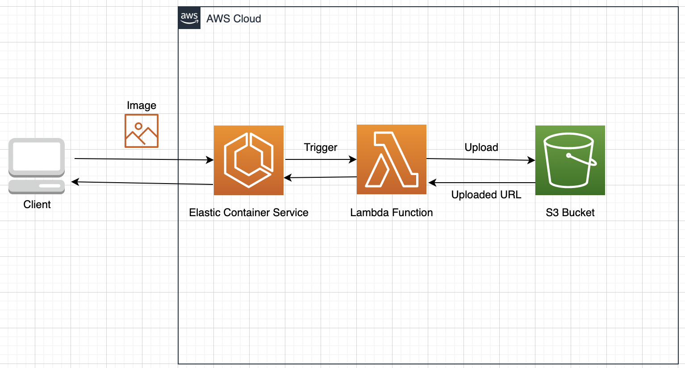
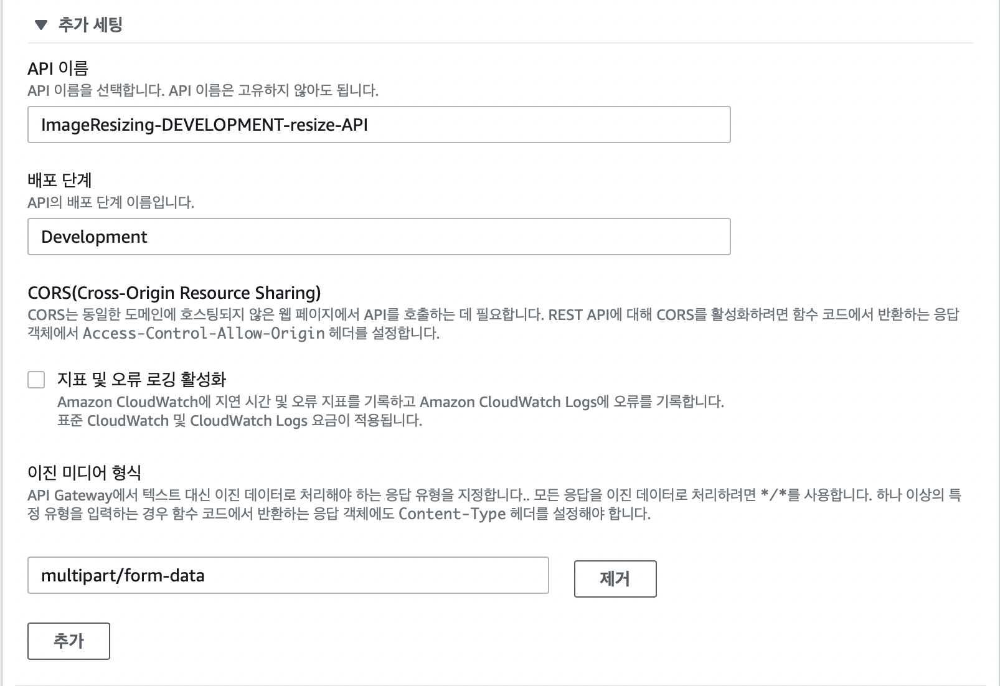

# Lambda로 이미지 압축 구현하기

<h2>들어가며</h2>

- 웹 애플리케이션 및 모바일 애플리케이션에는 사진 등의 다양한 미디어 파일이 굉장히 자주 사용된다.  
  이때, 사용자로부터 파일을 받아서 보여줘야하는 서비스가 있다고 해보자.  
  웹에서 사용자로부터 사진을 받으면 해당 파일을 백엔드 서비스에 전달하고,  
  백엔드 서비스에서는 받은 파일을 S3와 같은 Storage Service에 저장할 것이다.

- 이때, 사용자는 꽤나 용량이 큰 사진을 올릴 수 있을 것이다.  
  이렇게 용량이 큰 사진을 받아 그대로 Storage Service에 저장하면 나중에 해당 사진을  
  렌더링할 때 시간이 오래 걸린다는 단점이 있다.  
  하지만 이를 줄이기 위해 특정 크기 이상의 사진을 업로드하지 못하게 한다면, UX가 좋아지지 않는  
  것 까지 이어질 수도 있다. 이를 해결하기 위해 아래의 아키텍쳐를 구현해보자.



- 참고로 이 과정에서 백엔드 서비스는 생략한다.

<hr/>

<h2>Lambda 구축</h2>

- Lambda가 수행할 것은 매우 간단한데, 이미지를 받은 다음 해당 이미지를 압축한 후, S3에 업로드하는 것이다.  
  Lambda의 배포 과정 개발에 대한 것은 <a href="https://github.com/sang-w0o/Study/blob/master/AWS/Backend/Lambda%20%EA%B5%AC%EC%B6%95%ED%95%98%EA%B8%B0.md">여기</a>에서 확인할 수 있다.

- 아래는 Lambda의 함수가 특정 로직을 처리하는 pseudo code이다.

```ts
const upload: Handler = async (event: APIGatewayProxyEvent) => {
  const file = await parseFile(event);  // 파일을 받아온다.
  const response = await uploadToS3(file);  // S3에 업로드한다.
  return Response;  // 응답 반환
  };
};
```

- 이제 하나씩 구현해보자.

<h3>API Gateway 구축</h3>

- API Gateway는 간단히 트리거 추가를 통해 하면 되는데, 이때 주의할 점은 API의 설정에서 아래처럼  
  이진 형식에 `mutlipart/form-data`를 설정해주는 것이다.

- API Gateway를 먼저 만들고 Lambda에 연결하면 `multipart/form-data`를 선택해준 사항이  
  없어지는 것 같다.(버그인가..?)  
  따라서 Lambda를 먼저 배포한 후, Lambda 콘솔에서 _트리거 추가_ 버튼을 통해 API Gateway를 설정해주자.  
  _추가 세팅_ 항목에서 설정할 수 있다.
  

<hr/>

<h3>Lambda 함수 구축</h3>

- aws-lambda 패키지가 제공하는 Handler함수는 event를 인자로 받아오는데,  
  이때 클라이언트가 보내는 `multipart/form-data`를 어떻게 파싱해서 사용할지를 생각해야 한다.  
  이를 위한 패키지로 `lambda-multipart-parser`를 선택했다.

- 이제 사진 파일을 가져올 방법은 정했으니, _압축_ 을 어떻게 진행해야 할지 생각해야 한다.  
  사진 압축을 해주는 유명한 오픈소스 라이브러리로는 `compressorjs`와 `sharp`가 있는데,  
  Lambda에서 Typescript를 원활하게 사용하기 위해 <a href="https://github.com/lovell/sharp">Sharp</a>를 선택했다.

- 이제 마지막으로 S3에 업로드를 어떻게 진행할지를 생각해야 한다.  
  당연히 aws가 공식적으로 제공하는 aws-sdk 패키지를 사용하여 진행하는것이 가장 좋다.
