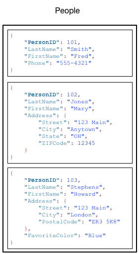
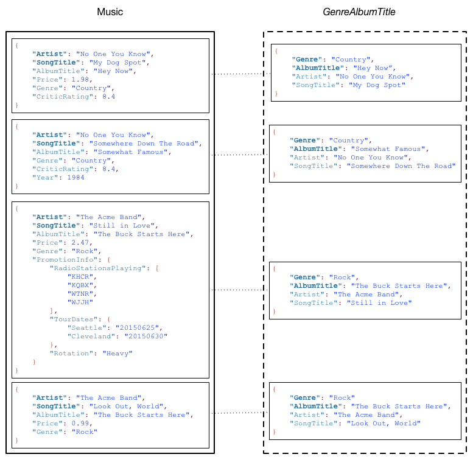

# Core Components of Amazon DynamoDB

## Tables, Items, and Attributes

- DynamoDB는 table, item, attribute라는 3가지 요소들로 구성된다.

- **Table** : 다른 데이터베이스 시스템과 비슷하게, DynamoDB도 데이터를 table에 저장한다.
- **Item** : 각 table은 0개 이상의 item들로 구성된다. **Item**은 attribute들의 집합으로, item들은 table 내에서  
  고유한 식별자를 가져야 한다.
- **attribute** : 각 item은 1개 이상의 attribute들로 구성된다.

- 아래의 `People` 테이블을 보자.

- 위 테이블의 설명을 보자.

  - 각 item들은 `PersonID`라는 고유 식별자를 갖고 있다. 이를 사용해 하나의 item을 table내의 다른 item들과 구분해낼 수 있다.(= PK)
  - PK를 제외한 나머지 부분은 _schemaless_ 하다. 즉, 사전에 정의된 data type이나 attribute가 없다.
  - 대부분의 attribute는 _scalar_, 즉 하나의 value만 갖고 있다.
  - `Address`를 갖는 item의 경우, attribute가 중첩(nested)되어 있다.  
    DynamoDB는 이러한 중첩 단계를 32단계까지 지원한다.

- PK의 역할은 2개 이상의 attribute가 함께 할 수도 있다.

--

## Primary Key

- Table 생성 시 table의 이름과 함께 해당 table의 Primary Key를 지정해줘야 한다.

- DynamoDB는 2 가지의 PK를 지원한다.

### Partition Key

- 단순한 Primary Key로, 하나의 attribute로 구성되어 있다. (이를 Partition Key라 한다.)  
  DynamoDB는 Partition Key의 value를 내부적인 해시 함수를 호출하는 데 사용한다.  
  해시 함수의 결과는 DynamoDB의 물리적 장치 중 어떤 partition에 해당 item을 저장할지 결정한다.  
  위에서 본 `People` 테이블이 Partition Key로 사용된 attribute는 `PersonID`이다.

### Partition Key and Sort Key

- 이 key는 **Composite Primary Key**라고도 불리는데, 2개의 attribute로 구성된 Primary Key이다.  
  첫 번째 attribute가 Partition Key, 두 번째 attribute가 Sort Key이다.

- DynamoDB는 Partition Key에 대해 위에 설명한 것처럼 해시 함수를 호출하고, 물리적 장치의 어느 partition에  
  데이터를 저장할지 결정한다. 따라서 partition key의 value가 같다면 항상 동일한 partition에 저장되고,  
  sort key의 value에 따라 정렬된다.

- 당연하게도 partition key and sort key로 구성된 테이블에서 여러 개의 item들이 동일한 partition key value를  
  가질 수 있다. 하지만 sorted key value는 달라야 한다.

> - Item의 Partition Key는 _Hash Attribute_ 라고 불리기도 한다. 이 용어는 DynamoDB가 Partition Key를  
>   해시 함수에 전달하기 때문에 생겨났다.
>
> - Item의 Sort Key는 _Range Attribute_ 라고 불리기도 한다. 이 용어는 DynamoDB가 동일한 partition key를 가진  
>   item들을 물리적으로 가깝게 저장시키고, Sort key의 value로 정렬하기 때문에 생겨났다.

---

## Secondary Indexes

- Table에 대해 하나 이상의 Secondary Index를 만들 수 있다.  
  Secondary Index는 table 내의 데이터를 Primary Key 외의 추가적인 key를 사용해 쿼리할 수 있게 해준다.  
  물론 index를 사용하는 것이 필수는 아니지만, index를 사용하면 데이터를 쿼리할 때 애플리케이션에게 더 높은  
  유연성을 제공할 수 있다. Secondary Index를 만든 후에는 해당 index를 사용해 데이터를 읽을 수 있다.

- DynamoDB가 지원하는 index로는 아래의 2가지가 있다.

  - Global Secondary Index: Partition Key 및 Sort Key가 table과 다른 index
  - Local Secondary Index: Table과 Partition Key는 동일하지만 Sort Key가 다른 index

- 아래의 `Music` table을 보면, `Artist`가 Partition Key이며 `SongTitle`이 Sort Key로 사용된다.  
  따라서 Partition Key를 기준으로, 또는 Partition Key와 Sort Key를 기준으로 데이터를 쿼리할 수 있다.  
  만약 `Genre`와 `AlbumTitle`로도 쿼리하고 싶다면 어떻게 해야할까?  
  바로 `Genre`와 `AlbumTitle`에 대해 Secondary Index를 만든 후 쿼리하면 된다.  
  아래 그림의 오른쪽 `GenreAlbumTitle`은 index를 나타낸 그림이다. `Genre`가 Partition Key이고,  
  `AlbumTitle`가 Sort Key이다.

- 위의 `GenreAlbumTitle` index에 대해 알아둬야 할 사항이 몇 가지 있다.

  - 모든 index는 table에 소속된다.(index의 _base table_)  
    위의 예시에서 `Music`이 `GenreAlbumTitle` index의 base table이다.

  - DynamoDB는 index를 자동적으로 갱신한다. 따라서 만약 base table에 item을 삽입, 갱신 또는 삭제하면  
    DynamoDB가 알아서 해당 item이 포함된 index도 함께 갱신해준다.

  - Index를 생성할 때 어떤 attribute가 base table로부터 복사될지(_projected_) 지정해야 한다.  
    기본적으로 DynamoDB는 base table의 Key attribute들만 index로 복사한다. 위 그림에서 알 수 있듯이,  
    `GenreAlbumTitle` index는 `Music`의 key attribute인 `Artist`와 `SongTitle`를 가진다.

- 위 예시 상황대로라면, `GenreAlbumTitle` index를 사용해 "특정 genre의 모든 album들"을 조회할 수 있다.  
  또한 index를 사용해 "특정 genre를 가지며 title이 H로 시작하는 모든 album들" 도 조회할 수 있다.

---
