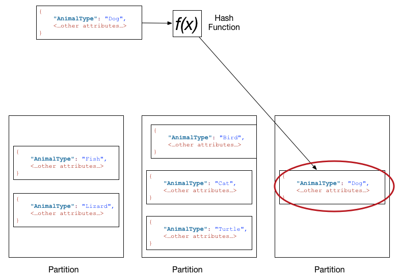
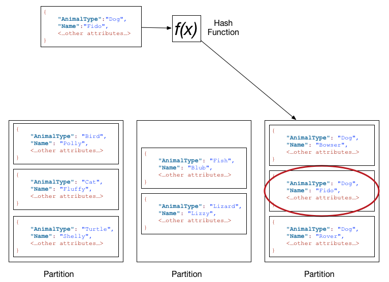

# Partitions and Data Distribution

- Amazon DynamoDB는 데이터를 partition들에 저장한다.  
  **Partition**이란 SSD에 table을 저장하기 위해 할당된 영역을 의미한다. 그리고 partition은 자동적으로  
  여러 개의 AWS 가용 영역으로 복제(replicate) 된다. Partition의 관리는 모두 DynamoDB가 처리한다.

- Table을 만들면 해당 table의 초기 상태는 `CREATING`이다. 이 상태에서 DynamoDB는 해당 table에게 적절한  
  partition을 할당한다. 이후 상태가 `ACTIVE`가 되면 해당 table에 대해 read, write 연산을 수행할 수 있다.

- DynamoDB는 아래의 경우 table에 대해 추가적인 partition을 할당한다.

  - Table의 provision setting을 기존 partition이 감당하지 못할 정도로 향상시키는 경우
  - 기존에 사용하던 partition이 모두 사용되어 더 많은 공간이 필요하게 된 경우

- Partition 관리는 백그라운드에서 자동으로 수행된다. 이 과정에서 변화가 발생하더라도 table은 항상 접근 가능하다.

## Data Distribution: Partition Key

- 만약 테이블이 하나의 PK(Partition Key)만 가진다면 DynamoDB는 각 item을 Partition Key의 value에 기반해 저장 및 조회한다.

- Table에 item을 write하기 위해 DynamoDB는 Partition Key의 value를 내부적인 hash function의 입력값으로 넘긴다.  
  그리고 이 함수의 결과값을 사용해 어느 partition에 해당 item을 저장할지 결정하게 된다.

- Table에서 item을 read하는 경우, 원하는 item의 Partition Key value를 명시해야 한다.  
  DynamoDB는 이 value를 hash 함수에 넣어 어떤 partition에서 해당 item을 찾을 수 있는지 알게 된다.

- 아래의 다이어그램을 보자. `Pets`라는 table이 있으며, 여러 개의 partition들을 사용하고 있다.  
  이 table의 Primary Key는 `AnimalType`이다.

---

## Data Distribution: Partition Key and Sort Key

- 만약 table이 복합 PK(Partition Key + Sort Key)를 가진다면, DynamoDB는 Partition Key를 사용해 Partition Key만 있는 PK가  
  hash 함수를 통해 하는 작업을 동일하게 수행한다. 차이점은 동일한 Partition Key value를 가지는 item들을 Sort Key의 value에 의해  
  정렬해 저장한다는 점이다.

- Table에 item을 write하기 위해서 hash 함수를 사용해 partition을 결정하는 과정은 동일하다. 하지만 추가적으로 Sort Key를 기준으로  
  오름차순(ascending)으로 item들을 정렬해 삽입하게 된다.

- Table에서 item을 read하기 위해서는 Partition Key value와 Sort Key value를 모두 명시해야 한다.  
  마찬가지로 Partition Key를 사용해 DynamoDB는 어느 partition에서 해당 item을 찾을 수 있는지 파악한다.

- 추가적으로 동일한 Partition Key value를 갖는 여러 개의 item을 table에서 한 번의 쿼리로 읽어올 수 있다.  
  (기본적으로 반환될 때 item이 저장된 순서, 즉 Sort Key의 오름차순으로 반환된다.)
  DynamoDB는 해당 Partition Key value를 갖는 모든 item을 반환한다. 추가적으로 Sort Key에 대한 조건을 명시해  
  특정 범위(range) 내의 item들만 쿼리할 수도 있다.

- 아래의 다이어그램을 보자. 위와 동일하게 `Pets` table이 있지만, 이번에는 Partition Key로는 `AnimalType` attribute를,  
  Sort Key로는 `Name`을 사용하는 복합 PK를 사용한다.

---
