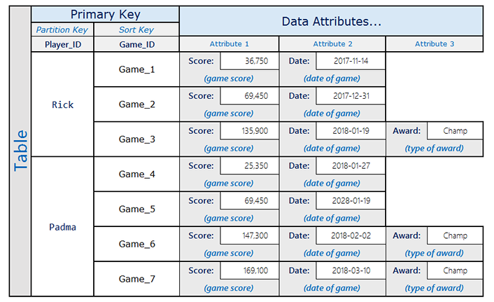
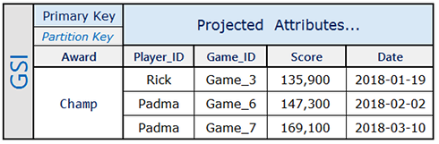

# Take Advantage of Sparse Indexes

- Table내의 모든 item에 대해서 DynamoDB는 **연관된 index의 Sort Key value가 있을 때에만** index에도 추가한다.  
  만약 Sort Key가 모든 item에 없는 경우, 해당 Sort Key를 갖는 index를 *Sparse Index*라 한다.

- Sparse Index는 table의 좁은 범위에 대한 query를 수행할 때 유용하다.  
  예를 들어 아래의 2개 주요 attribute를 포함한 고객의 주문 내역을 담는 table이 있다 해보자.

  - Partition Key: `CustomerId`
  - Sort Key: `OrderId`

- 주문의 배송 시작 유무를 확인하기 위해 시작 되지 않은 주문은 `isOpen` attribute를 추가한다고 하자.  
  그리고 배송이 시작되면 이 attribute는 제거된다. 여기서 만약 `CustomerId`를 Partition Key로,  
  `isOpen`을 Sort Key로 하는 index를 생성하면 오직 `isOpen` attribute가 있는 주문들만 조회될 것이다.  
  만약 수만개의 주문이 있고, 그중 매우 일부만 배송 시작 전이라면 이 index를 사용해 table 전체를 scan하는 것보다  
  훨씬 더 효율적으로 query를 수행할 수 있다.

- Sort Key로 `OrderOpenDate`와 같이 주문이 생성된 날짜를 담는 attribute를 사용했다고 하자.  
  마찬가지로 배송이 시작되면 이 attribute는 삭제된다. 이렇게 하면 sparse index를 사용해 query를 수행하면  
  item들이 날짜로 정렬되어 조회될 것이다.

## Examples of Sparse Indexes in DynamoDB

- 기본적으로 Global Secondary Index는 _sparse_ index이다.  
  Global Secondary Index를 만들 때 Partition Key는 필수로 지정해야 하지만 Sort Key는 선택적으로 지정할 수 있다.  
  이 두 attribute를 모두 가지는 item들만 index에 추가된다.

- Global Secondary Index가 _sparse_ 하게끔 설계해 index 생성 비용은 줄이고, query 성능은 향상시킬 수 있다.

- 예를 들어 모든 사용자의 점수를 트래킹하는 애플리케이션이 있다고 하자.  
  그리고 일반적으로는 몇 개의 high score만 query한다.

- 위 표를 보면 Rick은 게임을 3번 했으며 `Award: Champ` attribute가 있는 item이 하나 있다.  
  Padma는 4번의 게임을 했으며 `Award: Champ` attribute가 있는 item이 2개 있다.  
  `Award` attribute는 사용자가 award를 달성했을 때만 기록된다고 하자.

- 이제 사용자의 high score 들을(award 달성 기록) 조회할 때 사용할 Global Secondary Index는 아래처럼 만들 수 있을 것이다.

> Partition Key로 모든 item이 필수로 갖는 attribute가 아닌 `Award`가 지정되어 있기에, 이는 Sparse Index이다.

- 위 그림처럼 Global Secondary Index는 award를 달성한 high score를 갖는 item들만 가지게 된다.  
  (테이블의 좁은 범위, 전체 table scan보다 효율적으로 query 가능)

---
