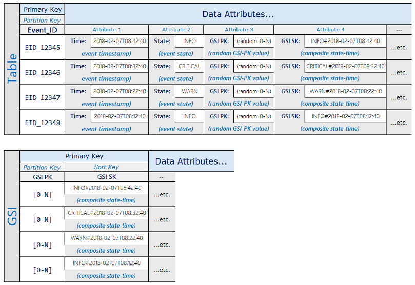

# Using Global Secondary Index Write Sharding for Selective Table Queries

- Amazon DynamoDB를 사용할 때 특정 조건을 만족시키는 table내의 작은 부분 집합에 대해서만 질의하는 패턴이 있는지 식별하는 것은 중요하다.  
  만약 이 작은 집합의 item들이 무작위로 흩어진 Partition Key를 갖는다면, query가 전체 table scan을 수행할 수도 있게 된다.  
  이는 table 내의 매우 많은 item들이 조건을 만족시킨다면 좋은 방식이긴 하지만, Partition Key의 범위만 크고 조건을 만족하는 item들이  
  매우 적은 경우에는 불필요한 연산을 수행하게 된다.(Table Scan)

- 위처럼 조건을 만족하는 item은 적지만 기본 PK에 의해 매우 많은 partition에 item들이 분배되어 있는 경우,  
  `(0-N)`의 무작위 값을 갖는 attribute를 추가하고, 이 attribute를 Partition Key로 하는 Global Secondary Index를  
  만들어 Write Sharding을 적용할 수 있다.

- 예를 들어, 아래의 예시 스키마를 보자.

- 위 스키마에 의하면 item들은 Global Secondary Index에 의해 `0-N` partition들에 분배된다.  
  따라서 복합 PK에 정렬 조건을 사용하는 scatter read로 특정 기간 내의 특정 state를 가지는 item들을 조회할 수 있다.

- 이렇게 전체 table scan을 피해 최소한의 비용으로 매우 선택적인 결과를 얻을 수 있다.

---
