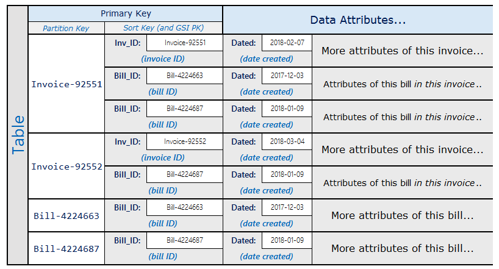
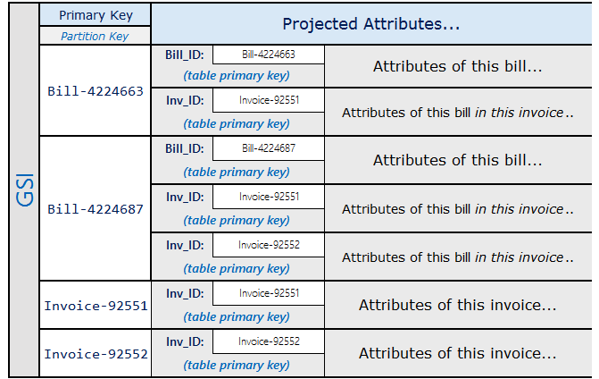
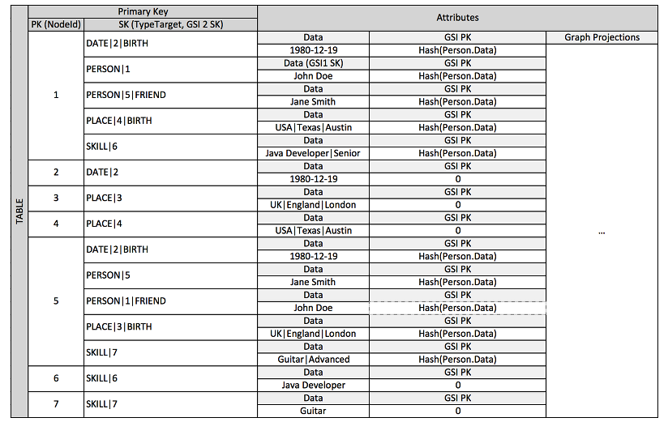
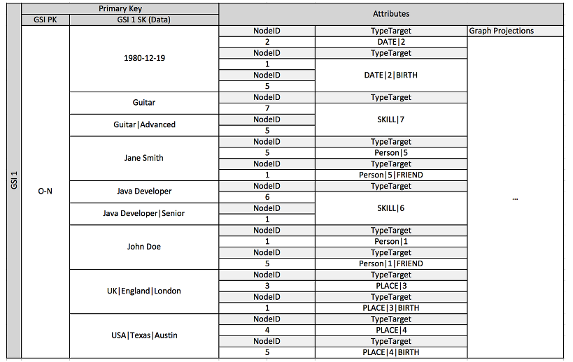
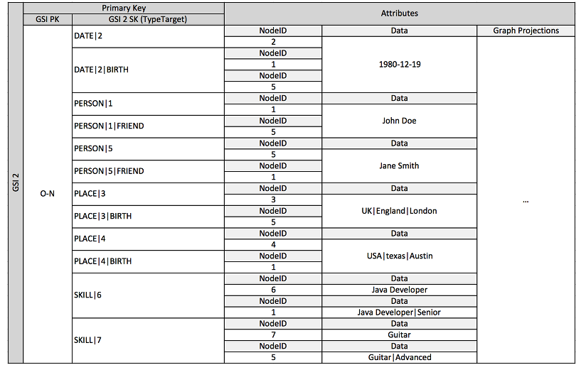

# Best Practices for Managing Many-to-Many Relationships

- Amazon DynamoDB에서 many-to-many 관계를 나타낼 때는 인접 리스트(Adjacency List)가 유용하게 쓰인다.  
  더 일반적으로 말하면, 인접 리스트를 사용해 DynamoDB에서 그래프 데이터(nodes, edges)를 나타낼 수 있다.

## Adjacency List Design Patern

- 애플리케이션 내의 서로 다른 entity들이 many-to-many 관계를 갖는다면, 이 관계는 인접 리스트로 표현될 수 있다.  
  이 패턴에서 graph model의 node에 해당하는 top-level entity는 Partition Key에 해당한다.  
  그리고 다른 entity(graph의 edge들)와의 관계는 다른 entity의 Partition Key value를 Sort Key value에 지정하게 된다.

- 이 패턴의 장점은 아래와 같다.

  - 최소한의 데이터 중복이 발생한다.
  - 대상 entity와 연관 관계를 갖는 모든 entity를 조회하는 query를 단순화할 수 있다.

- 예시 상황을 보자. 하나의 청구서(invoice)가 여러 개의 결제(bill) 내역을 가지는 시스템이 있다고 해보자.  
  하나의 bill은 여러 개의 invoice들에 포함될 수 있다. 이 경우 Partition Key로는 `InvoiceID` 또는 `BillID`를 사용할 수 있다.  
  `BillID` partition은 해당 bill에 대한 모든 정보들을 가질 것이다. 그리고 `InvoiceID` partition은 invoice에 특화된  
  정보를 갖는다. 스키마는 아래 표와 같다.

- 위 스키마를 사용하면 특정 invoice의 모든 bill들을 PK를 사용해 모두 조회할 수 있게 된다.  
  만약 반대로 bill과 연관된 invoice들만 조회하고 싶다면 기존의 Sort Key를 Partition Key로 갖는  
  Global Secondary Index를 만들면 된다. 아래 표와 같다.

---

## Materialized Graph Pattern

- 인접한 peer간의 순위, entity 간의 공통적인 연관 관계, 이웃 entity 상태 등 Graph 스타일의 workflow를 바탕으로 구현된  
  애플리케이션들도 많다. 이런 애플리케이션들은 아래의 스키마 설계를 고려해볼 수 있다.

- 가장 먼저 table이다. 복합 PK가 있으며 Partition Key로는 `NodeId`가, Sort Key로는 `TypeTarget`이 지정되어 있다.

- 다음으로 첫 번째 Global Secondary Index를 보자. `0-N` 사이의 값을 갖는 Partition Key와 `Data`를 Sort Key로 갖고 있다.

- 두 번째 Global Secondary Index도 보자.

- 위의 스키마는 graph의 node와 edge를 표현하는 데이터들로 이루어져있다.  
  Edge item은 `Target`과 `Type` attribute를 갖는다. 이 attribute들은 `TypeTarget`이라는 복합 PK에 사용되며,  
  이를 사용해 기본 table과 두 번째 Global Secondary Index에서 특정 item을 식별할 수 있다.

- 첫 번째 GSI는 `Data` attribute를 Sort Key로 갖는다. 즉, GSI Overloading을 사용해 다양한 `Data`가 의미하는  
  다양한 값들을 indexing할 수 있다. 위 예시에서는 `Dates`, `Places`, `Skills` `Name`의 4가지를 의마한다.  
  즉, 하나의 GSI로 4개의 다른 attribute들을 효과적으로 indexing한다.

- 이 설계 패턴은 실시간성이 보장되어야 하는 graph workflow에 대해 매우 효과적이다. 최고의 성능을 낼 수 있으며  
  연관 관계가 있는 entity들도 빠르게 조회, 수정할 수 있다.

- 만약 실시간 데이터 정합성이 보장될 필요가 없다면 Amazon EMR 등을 사용해 연관된 entity들에 대한 작업을 스케쥴링할 수도 있다.

- 정합성 보장을 위해 Amazon DynamoDB Stream과 AWS Lambda의 조합을 사용할 수도 있다.

---
