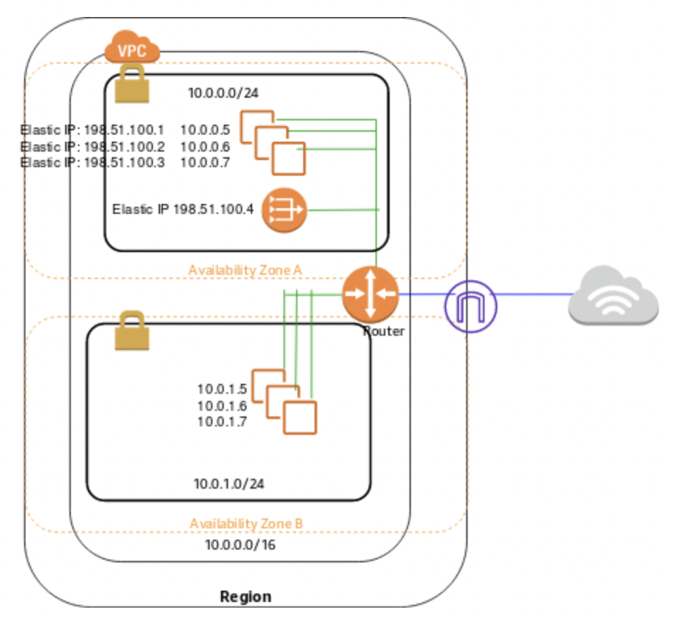

# NAT Gateway

- NAT(Network Address Translation) Gateway를 사용하면 private subnet 내의 인스턴스들이 인터넷 또는  
  다른 AWS 리소스들과 통신을 하게끔 할 수 있다. 하지만 외부 인터넷 연결이 인스턴스와 직접적인 Connection을 수립하는 것을 막을 수 있다.

- NAT Gateway를 생성하고 사용하는 것은 EC2 Data Transfer 비용과 관계없이 따로 비용이 청구된다.  
  청구되는 비용의 기준에는 시간당 사용량과 데이터 처리량이 포함된다.

- 참고로 IPv6에 대해서는 NAT Gateway가 지원이 되지 않으므로, 이 때에는 outbound에 대해서만 처리가 가능한  
  egress-only internet gateway를 사용해야 한다.

<h2>NAT Gateway 기본</h2>

- NAT Gateway를 생성하기 위해서는 해당 NAT Gateway가 적용될 public subnet을 지정해야 한다.  
  추가적으로 NAT Gateway와 연관된 Elastic IP Address를 할당받아 지정해주어야 한다.  
  지정된 Elastic IP Address 값은 NAT Gateway와 연관성을 갖게되면 변경될 수 없다.  
  NAT Gateway를 생성한 후에는 인터넷에서 들어온 트래픽이 NAT Gateway를 가리키도록 private subnet들의  
  routing table을 수정해주어야 한다. 이는 private subnet내의 인스턴스들이 인터넷과 통신할 수 있도록 해준다.

- 각 NAT Gateway는 특정 AZ 내에서 생성된다.

- NAT Gateway가 더이상 필요하지 않다면, 삭제하면 된다. 삭제된 NAT Gateway는 연관된 Elastic IP Address와의  
  관계를 끊지만, 할당된 Elastic IP Address가 AWS 계정에서 자동으로 release 되지는 않는다.

- 아래 그림은 VPC와 NAT Gateway가 적용된 아케텍쳐의 예시이다.  
  Main route table이 private subnet내의 인스턴스들로부터 발생된 트래픽을 NAT Gateway로 전달한다.  
  NAT Gateway는 받은 트래픽을 NAT Gateway의 Elastic IP Address 값을 발신자로 하여 Internet Gateway로 forwarding한다.

- 위 아키텍쳐에 대해 더 살펴보자. 우선 AZ(A)에 있는 subnet에 대해 직저 정의한 아래의 route table이 적용되어 있다.

<table>
    <tr>
        <td>Destination</td>
        <td>Target</td>
    </tr>
    <tr>
        <td>10.0.0.0/16</td>
        <td>Local</td>
    </tr>
    <tr>
        <td>0.0.0.0/0</td>
        <td>igw-***</td>
    </tr>
</table>

- 첫 번째 route는 이 VPC내의 routing을 위한 기본값이다. 이 route가 VPC내의 인스턴스들이 서로 통신할 수 있도록 해준다.  
  두 번째 route는 `10.0.0.0/16`에 포함되지 않는 나머지 모든 subnet 트래픽을 internet gateway로 전달한다.

- 다음으로 AZ(B)에 적용된 main route table이 아래와 같이 구성되어 있다고 하자.

<table>
    <tr>
        <td>Destination</td>
        <td>Target</td>
    </tr>
    <tr>
        <td>10.0.0.0/16</td>
        <td>Local</td>
    </tr>
    <tr>
        <td>0.0.0.0/0</td>
        <td>ngi-****</td>
    </tr>
</table>

- 첫 번째 Route는 AZ(A)에 적용된 route table과 마찬가지로 VPC 내의 routing을 하기 위한 기본값이며,  
  두 번째 route는 그 외의 모든 subnet 트래픽을 NAT Gateway로 전달한다.

<h2>NAT Gateway 적용하기</h2>
