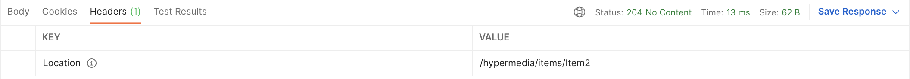

# API에 행동 유도성 추가

> 하이퍼텍스트는 여러 가지로 정의되지만, 여기서 Hypertext란 정보가  
> **행동 유도**로 이어지도록 해당 정보와 제어를 동시에 표현하는 것을 말한다.  
> 사용자의 선택권 획득이나 행동 선택은 정보를 바탕으로 하는 행동 유도를 통해 이뤄진다.

- 지금까지 하이퍼미디어를 만들었고, 적절한 링크도 추가했다.  
  하지만 뭔가 빠진 것 같은 느낌이 든다. 지금까지 봐온 JSON 형식은 기존의 보통  
  JSON이거나 HAL(Hypertext Application Language) 형식으로 기술된  
  하이퍼미디어였다. 이런 방식들은 단순하다는 장점 덕분에 하이퍼미디어용으로 가장  
  널리 사용되는 형식이다. 그래서 Spring HATEOAS도 기본적으로 이 형식으로  
  데이터를 생성한다. 하지만 여기에는 문제가 하나 있다.

- 동일한 URI를 가리키는 GET과 PUT을 함께 담으면 HAL문서는 한 개의 링크만 생성한다.  
  그 결과 사용자는 원래는 GET, PUT 두 가지의 서로 다른 선택지가 존재했었다는  
  사실을 알 수 없게 된다.

- GET과 PUT을 다른 링크로 표현하도록 강제하더라도 클라이언트가 PUT 요청을 보내려면  
  어떤 속성 정보를 제공해야 하는지 클라이언트에게 알려주지 않는다. 이를 클라이언트가 직접  
  알아내게 하는 방법은 결코 좋은 방법이 아니다. 바로 이 지점에서 Spring HATEOAS가  
  하이퍼미디어에 **행동 유도성(Affordance)** 을 추가한 API를 제공해준다.

- 하나의 `Item`을 보여줄 때, 그 `Item`을 수정할 수 있는 _행동 유도성_ 을 추가해주는 것이  
  전형적인 사례라고 할 수 있다. Spring HATEOAS는 관련 있는 메소드를 연결할 수 있는  
  수단을 제공한다. `Item` 사례에서는 GET 연산에 대한 링크가 PUT으로 이어질 수 있다.

- HAL로 표현되면 여전히 하나의 링크만 표시된다. 하지만 HAL-FORMS 같은 하이퍼미디어  
  형식은 추가 정보를 렌더링할 수 있는 연결 정보도 보여줄 수 있다. 행동 유도성을 추가할 수 있는  
  어떤 미디어 타입이라도 이런 메타데이터를 제공할 수 있다는 장점이 있다.

- GET과 PUT을 연결하기 전에 먼저 PUT을 만들어보자.

```kt
@RestController
class HypermediaItemController(
    private val itemRepository: ItemRepository
) {

    @GetMapping("/hypermedia/items/{id}")
    fun findOne(@PathVariable id: String): Mono<EntityModel<Item>> {
        //..
    }

    @GetMapping("/hypermedia/items")
    fun findAll(): Mono<CollectionModel<EntityModel<Item>>> {
        //..
    }

    @PutMapping("/hypermedia/items/{id}")
    fun updateItem(@RequestBody item: Mono<EntityModel<Item>>, @PathVariable id: String): Mono<ResponseEntity<*>> {
        return item
            .map(EntityModel<Item>::getContent)
            .map{content -> Item(id, content!!.name, content.description, content.price)} // (1)
            .flatMap { a -> itemRepository.save(a) } // (2)
            .then(findOne(id)) // (3)
            .map { model ->
                ResponseEntity.noContent()
                    .location(model.getRequiredLink(IanaLinkRelations.SELF).toUri()).build<Void>() // (4)
            }
    }
}
```

- `updateItem()` 메소드에서 `@RequestBody`의 타입은 `Mono<EntityModel<Item>>`이다.  
  `Mono` 타입이므로 이 메소드 호출자가 구독하기 전까지는 실제로 아무것도 동작하지 않는다.  
  `EntityModel`은 클라이언트가 `Item` 객체를 보낼 수도 있고, 하이퍼미디어 형식일 수도 있음을  
  의미한다. 어느 쪽인든 이 메소드가 처리할 수 있다.

- 추가 설명은 아래와 같다.

  - (1): `Mono`에 담긴 내용물을 꺼내서 새 `Item` 객체를 생성하고, 전달받은 id 값을 새 `Item`  
    객체의 식별자로 지정한다. 이렇게 하면 MongoDB에 이미 같은 id로 저장돼 있던 레코드를  
    새로 만든 `Item` 정보로 덮어쓰거나, MongoDB에 해당 id가 없다면 새 레코드가 추가된다.

  - (2): 새 `Item` 객체를 저장한다.

  - (3): 컨트롤러의 `findOne()` 메소드를 사용해 새로 저장된 객체를 조회한다. `findOne()`은  
    MongoDB에서 데이터를 조회해서 하이퍼미디어에 담아 반환하는 메소드이다.

  - (4): Spring Framework의 `ResponseEntity` helper method를 사용하여 location 헤더에  
    self 링크 URI를 담고, HTTP 204 NO CONTENT 상태 코드를 반환한다.

- 실제로 요청을 보내면, 아래와 같이 헤더가 응답으로 온다.



- 단순하게 보면 `Item` 데이터를 받아서 해당 id를 식별자로 해서 저장하고,  
  저장된 정보를 `findOne()`으로 다시 조회해서 필요한 URI를 추가해서 사용자에게 반환한다.

- `findOne()`에 행동 유도성을 적용하여 다시 작성해보자.  
  GET, PUT을 연결하는 작업을 해보자.

```kt
@RestController
class HypermediaItemController(
    private val itemRepository: ItemRepository
) {

    @GetMapping("/hypermedia/items/{id}")
    fun findOne(@PathVariable id: String): Mono<EntityModel<Item>> {
      val controller = methodOn(HypermediaItemController::class.java)
      val selfLink = linkTo(controller.findOne(id)).withSelfRel()//.toMono()
        .andAffordance(controller.updateItem(null, id)).toMono()
      val aggregateLink = linkTo(controller.findAll())
        .withRel(IanaLinkRelations.ITEM).toMono()
      return Mono.zip(itemRepository.findById(id), selfLink, aggregateLink)
        .map { o -> EntityModel.of(o.t1, Links.of(o.t2, o.t3)) }
    }

    @GetMapping("/hypermedia/items")
    fun findAll(): Mono<CollectionModel<EntityModel<Item>>> {
        //..
    }

    @PutMapping("/hypermedia/items/{id}")
    fun updateItem(@RequestBody item: Mono<EntityModel<Item>>, @PathVariable id: String): Mono<ResponseEntity<*>> {
        //..
    }
}
```

- 위 코드에서 수정된 `findOne()` 메소드에는 `andAffordance()`를 사용한 것 외에는  
  기존의 `findOne()`과 나머지 부분들이 모두 동일하다.

- 마지막으로 `@SpringBootApplication`이 적용되어 있는 클래스에 아래와 같이  
  `@EnableHypermediaSupport(type = [HypermediaType.HAL])`를 추가하자.

- 이제 `/hypermedia/items/{id}`에 GET 요청을 보내면 아래의 응답이 온다.

```json
{
  "id": "Item2",
  "name": "Smurf TV tray",
  "description": "A TV",
  "price": 24.99,
  "_links": {
    "self": {
      "href": "http://localhost:8080/hypermedia/items/Item2"
    },
    "item": {
      "href": "http://localhost:8080/hypermedia/items"
    }
  },
  "_templates": {
    "default": {
      "method": "put",
      "properties": [
        {
          "name": "description",
          "type": "text"
        },
        {
          "name": "id",
          "type": "text"
        },
        {
          "name": "name",
          "type": "text"
        },
        {
          "name": "price",
          "type": "number"
        }
      ]
    }
  }
}
```

<hr/>
