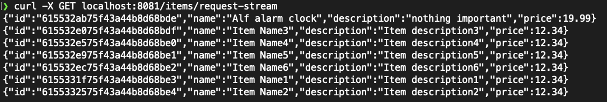

# R Socket 클라이언트 생성

- R Socket 클라이언트는 외부로부터 HTTP 요청을 받아서 R Socket 연결을 통해 백엔드 서버로  
  요청을 전달한다. 그래서 HTTP 요청을 받을 수 있는 Webflux 컨트롤러가 필요하다.  
  WebSocket을 사용해서 브라우저와 백엔드 서버가 통신하는 것만큼 복잡하지는 않을 것이다.

- 우선 컨트롤러 클래스를 만들어보자.

```kt
@RestController
class RSocketController(
    private val builder: RSocketRequester.Builder // (1)
) {

    private val requester: Mono<RSocketRequester> = builder
        .dataMimeType(MediaType.APPLICATION_JSON) // (2)
        .metadataMimeType(parseMediaType(WellKnownMimeType.MESSAGE_RSOCKET_ROUTING.toString())) // (3)
//            .connectTcp("localhost", 7000)
//            .retry(5)
//            .cache()
        .tcp("localhost", 7000) // (4)
        .toMono()
	.retry(5) // (5)
	.cache() // (6)
}
```

> 주석 처리한 부분은 Deprecated된 부분이다.

- 위 코드에서는 `RSocketRequester`를 `Mono`로 감싸서 R Socket에 연결된 코드가 클라이언트가  
  구독할 때마다 호출되도록 했다.

  - (1) Spring Boot는 `RSocketRequesterAutoConfiguration` 정책 안에서 `RSocketRequester.Builder` bean을 만들어준다.  
    Jackson을 포함해서 여러 가지 encoder, decoder를 사용할 수 있다.
  - (2) `dataMimeType()`을 이용해서 데이터의 미디어 타입을 지정해준다. 여기서는 `application/json`을 나타내는  
    Spring 상수를 사용했다.
  - (3) 라우팅 정보와 같은 메타데이터 값을 R Socket의 표준인 `message/x.rsocket.routing.v0`로 지정한다.
  - (4) TCP를 사용하므로 hostname과 port number를 지정하고, `tcp()`를 호출해서 7000번 포트를 사용하는  
    R Socket 서버에 연결한다.
  - (5) 견고성을 높이기 위해 메시지 처리 실패 시 `Mono`가 5번까지 재시도할 수 있도록 지정한다.
  - (6) 요청 `Mono`를 Hot Source로 전환한다. Hot Source에서는 가장 최근의 신호는 캐시되어 있을 수도  
    있으며, 구독자는 사본을 갖고 있을 수도 있다. 이 방식은 다수의 클라이언트가 동일한 하나의 데이터를  
    요구할 때 효율성을 높일 수 있다.

- `RSocketRequester`는 JavaDoc에 따르면 _R Socket에 무언가를 보낼 때 사용하는 얇은 포장재_ 와 같다.  
  결국 R Socket의 API는 프로젝트 리액터를 사용한다.

- R Socket에 Spring 메시징 패러다임은 포함되지 않았다. `RSocketRequester`를 사용해야  
  스프링 프레임워크와 연동된다. 이렇게 하면 도착지를 기준으로 메시지를 라우팅할 수 있다.  
  그리고 추가적으로 트래픽의 encoding, decoding도 쉽게 할 수 있다.  
  `RSocketRequester`를 사용하지 않으면, 클라이언트와 서버 양쪽의 R Socket 연결에서 데이터를  
  직접 관리해야 한다.

- 그런데 왜 `RSocketRequester`를 `Mono`로 감싸는 것일까? 리액터의 `Mono` 패러다임은  
  연결(connection)을 R Socket 연결의 세부 정보를 포함하는 지연 구조체(lazy construct)로 전환한다.  
  아무도 연결하지 않으면 R Socket은 열리지 않는다. 누군가가 구독을 해야지만 세부정보가 여러 구독자에게  
  공유될 수 있다.

- 하나의 R Socket만으로 모든 구독자에게 서비스할 수 있다는 점도 중요하다. R Socket을 구독자마다  
  1개씩 만들 필요가 없다. 대신에 하나의 R Socket 파이프에 대해 구독자별로 하나의 연결을 생성한다.

- 이렇게 준비 과정을 마쳐야 R Socket이 네트워크를 통해 오가는 데이터 프레임을 리액티브하게 전송하고  
  배압을 처리하는 데 집중할 수 있다. Spring 프레임워크는 데이터 encoding, decoding과 라우팅을  
  담당할 수 있다. 리액터는 요청 처리 전 과정을 지연 방식으로 수행할 수 있어서 자원의 효율성을  
  높일 수 있다.

## Webflux 요청을 RSocket 요청-응답으로 변환

- Spring Webflux로 들어오는 HTTP POST 요청을 R Socket 요청-응답 방식의 서버에 연결하는  
  방법을 살펴보자.

```kt
@RestController
class RSocketController {
   //..

    @PostMapping("/items/request-response")
    fun addNewItemsUsingRSocketRequestResponse(@RequestBody item: Item): Mono<ResponseEntity<*>> {
        return requester
            .flatMap {
                rSocketRequester -> rSocketRequester
                .route("newItems.request-response") // (1)
                .data(item) // (2)
                .retrieveMono(Item::class.java) // (3)
            }
            .map {
                savedItem -> ResponseEntity.created(URI.create("/items/request-response")).body(savedItem)
            }
    }
}
```

- 코드에 대한 설명을 보자.

  - (1) `Mono<RSocketRequester>`에 `flatMap()`을 적용해서 이 요청을 `newItems.request-response`에  
    라우팅한다. 라우팅 할 때는 `route()` 메소드를 사용한다.
  - (2) `Item` 객체 정보를 `data()` 메소드로 전송한다.
  - (3) `Mono<Item>` 형식의 응답을 원한다는 신호를 보내도록 한다.

- Spring Webflux와 RSocket API가 모두 프로젝트 리액터를 사용하는 덕분에 둘을 아주 매끄럽게  
  함께 사용할 수 있다. 둘은 하나의 플로우 안에서 체이닝으로 연결될 수 있어서 HTTP 웹 요청을  
  받아서 RSocket 연결에 전달하고, 응답을 받아 클라이언트에게 리액티브하게 반환할 수 있다.

- 요청-응답 서비스와 클라이언트는 테스트하기도 쉽다.

```kt
class RSocketTest {
    //..

    @DisplayName("요청-응답 테스트")
    @Test
    @Throws(InterruptedException::class)
    fun verifyRemoteOperationsThroughRSocketRequestResponse() {
        // 데이터 초기화
        repository.deleteAll()
            .`as`(StepVerifier::create)
            .verifyComplete()

        // 새로운 Item 생성
        val item = webTestClient.post().uri("/items/request-response") // <2>
            .bodyValue(Item("Alf alarm clock", "nothing important", 19.99)) //
            .exchange() //
            .expectStatus().isCreated // <3>
            .expectBody(Item::class.java) //
            .returnResult()
            .responseBody!!
        assertNotNull(item.id)
        assertEquals("Alf alarm clock", item.name)
        assertEquals("nothing important", item.description)
        assertEquals(19.99, item.price)

        Thread.sleep(500) // (1)

        repository.findAll()
            .`as`(StepVerifier::create)
            .expectNextMatches { item ->
                assertNotNull(item.id)
                assertEquals("Alf alarm clock", item.name)
                assertEquals("nothing important", item.description)
                assertEquals(19.99, item.price)
                true
            }
            .verifyComplete()
    }
}
```

- 특별히 새로운 코드는 없고, 중간에 _(1)_ 에서 스레드를 잠시 중단시킨 이유는  
  새로운 `Item`이 R Socket 서버를 거쳐 MongoDB에 저장될 시간적 여유를  
  둔 것 뿐이다.

- 위 테스트 케이스는 R Socket 클라이언트 API를 호출하고, R Socket Client가  
  R Socket을 통해 서버에 요청을 전달하는 과정을 명확하게 보여준다.

- 모든 과정이 비동기, 논블로킹 리액티브 스트림으로 처리된다.

<hr/>

## Webflux 요청을 RSocket 요청-스트림으로 반환

- 이번엔 Webflux로 들어오는 HTTP GET 요청을 RSocket 요청-스트림 방식의 서버에 연결해보자.

```kt
class RSocketController {
    @GetMapping("/items/request-stream", produces = [MediaType.APPLICATION_NDJSON_VALUE]) // (1)
    fun findItemsUsingRSocketRequestStream(): Flux<Item> {
        return requester
            .flatMapMany { rSocketRequester -> rSocketRequester // (2)
                .route("newItems.request-stream") // (3)
                .retrieveFlux(Item::class.java) // (4)
                .delayElements(Duration.ofSeconds(1))} // (5)
    }
}
```

- 코드 설명을 보자.

  - (1) `/items/request-stream`으로 들어오는 HTTP GET 요청을 처리하고, `Flux`를 통해 JSON 스트림  
    데이터를 반환한다. 스트림 방식으로 반환하기 위해 미디어타입을 `APPLICATION_NDJSON_VALUE`로  
    지정했다. 이 미디어타입의 설정값은 `application/x-ndjson`이다.

  - (2) 여러 건의 조회 결과를 `Flux`에 담아 반환할 수 있도록 `flatMapMany()`를 사용한다.
  - (3) `Item` 목록 조회 요청을 RSocket 서버의 `newItems.request-stream`으로 라우팅한다.
  - (4) 여러 건의 `Item`을 `Flux`에 담아 반환하도록 요청한다.
  - (5) 여러 건의 `Item`을 1초에 1건씩 반환하도록 요청한다. 여러 건의 데이터가 세 번에  
    응답되는게 아니라, 스트림을 통해 응답되는 것을 눈으로 쉽게 확인할 수 있도록 일부러 넣은  
    코드일 뿐이며, 반드시 필요한 로직은 아니다.

- 이전에 본 한 번의 응답으로 처리가 종료되는 요청-응답과는 다르게, 이번에는 스트림을 반환해야 하므로  
  데이터를 `Mono<ResponseEntity>`에 담지 않고, `Flux`에 담아 반환한다.  
  미디어타입도 `application/x-ndjson`으로 지정해야 스트림 방식으로 반환할 수 있다.  
  ndjson은 _'Newline Delimited JSON'_ 의 약자인데, 결국 여러 JSON 객체를  
  줄바꿈으로 구분해서 여러 번에 걸쳐 스트림으로 반환한다는 뜻이다.

- 실제로 아래 사진처럼 테스트해보면, 하나의 JSON 객체가 1초마다 응답 형식으로 온다.



- 이제 테스트코드를 작성해보자.

```kt
class RSocketTest {
    //..

    @Test
    @DisplayName("요청-스트림 테스트")
    @Throws(InterruptedException::class)
    fun verifyRemoteOperationsThroughRSocketRequestStream() {
        // 데이터 초기화
        repository.deleteAll().block() // (1)

        // 3개의 Item 생성
        val items: List<Item> = IntStream.rangeClosed(1, 3)
            .mapToObj { i -> Item("name - $i", "description - $i", i + 0.0) } // (2)
            .collect(Collectors.toList())

        repository.saveAll(items).blockLast() // (3)

        // Stream test
        webTestClient.get().uri("/items/request-stream")
            .accept(MediaType.APPLICATION_NDJSON) // (4)
            .exchange()
            .expectStatus().isOk
            .returnResult(Item::class.java)
            .responseBody
            .`as`(StepVerifier::create)
            .expectNextMatches(itemPredicate("1")) // (5)
            .expectNextMatches(itemPredicate("2"))
            .expectNextMatches(itemPredicate("3"))
            .verifyComplete()
    }

    private fun itemPredicate(num: String): Predicate<Item> {
        return Predicate { item: Item ->
            assertThat(item.name).startsWith("name")
            assertThat(item.name).endsWith(num)
            assertThat(item.description).startsWith("description")
            assertThat(item.description).endsWith(num)
            assertThat(item.price).isPositive
            true
        }
    }
}
```

- 테스트 코드에 대한 설명을 보자.

  - (1) 기존 데이터를 삭제한다. 기존 데이터는 검증해야 할 테스트 대상이 아니므로 단순히  
    `block()` 메소드로 삭제해도 무방하다.
  - (2) 테스트 데이터 3개를 List에 저장한다.
  - (3) List에 저장된 테스트 데이터를 MongoDB에 저장한다. 이 부분 또한 테스트 대상이 아니므로  
    `StepVerifier` 대신에 `blockLast()`를 사용하여 단순하게 저장만 했다.
  - (4) Accept 헤더에 `application/x-ndjson`을 지정해서 JSON Stream을 받는다는 것을  
    R Socket Client에게 알린다.
  - (5) `Flux`를 통해 제공받은 `Item`들을 각각 `itemPredicate()` 메소드를 사용해 검증한다.

- 요청-스트림 테스트는 요청-응답 테스트와는 다르다. 특히 검증 로직 첫 부분에 `StepVerifier`가  
  나오지 않고 `returnResult()`, `responseBody`를 통해 일단 플로우에서 빠져나온 다음에  
  `StepVerifier`를 사용해 검증을 시작하는 방법을 잘 기억해두자.

<hr/>

## Webflux 요청을 RSocket 실행 후 망각으로 전환

- 아래 코드를 보면 RSocket의 실행 후 망각 패러다임의 사용법을 알 수 있다.

```kt
class RSocketController {
    //..

    @PostMapping("/items/fire-and-forget")
    fun addNewItemsUsingRSocketFireAndForget(@RequestBody item: Item): Mono<ResponseEntity<*>> {
        return requester
            .flatMap { rSocketRequester -> rSocketRequester
                .route("newItems.fire-and-forget") // (1)
                .data(item)
                .send() // (2)
            }
            .then( // (3)
                Mono.just(ResponseEntity.created(URI.create("/items/fire-and-forget")).build<Void>())
            )
    }
}
```

- 코드 설명을 보자.

  - (1) 이 컨트롤러 메소드는 새로운 `Item` 생성 요청을 받아 R Socket 서버의  
    `newItems.fire-and-forget` 경로로 전달한다.
  - (2) 이전에 요청-응답 예제에서는 `retrieveMono()`를 호출해서 새로운 `Item`의  
    정보가 포함돼 있는 `Mono`를 받았지만, 이번 코드에서는 `send()`를 호출해서  
    `Mono<Void>`를 반환받는다.
  - (3) `Mono<Void>`를 반홥다았으므로 `map()`을 해도 아무런 일이 일어나지 않는다.  
    따라서 새로 생성된 `Item`에 대한 location 헤더값을 포함하는 HTTP 201 CREATED를  
    반환하기 위해 `then()`과 `Mono.just()`를 호출해 새로운 `Mono`를 만들어 반환한다.

- 함수형 프로그래밍에서 비어 있는 `Void`를 무시하는 것은 `map()`이나 `flatMap()`이나 마찬가지다.  
  그래서 `Mono<Void>`를 `map()`, `flatMap()`을 사용해서 다른 것으로 전환하는 것은  
  불가능하다. 많은 개발자들이 이 함정에 걸리기도 하므로 테스트 코드 작성 시 주의를 기울여야 한다.

- 실행 후 망각을 제대로 처리하는지 테스트하는 코드를 작성해보자.

```kt
class RSocketTest {
    //..

    @Test
    @DisplayName("실행 후 망각 테스트")
    @Throws(InterruptedException::class)
    fun verifyRemoteOperationsThroughRSocketFireAndForget() {
        // 데이터 초기화
        repository.deleteAll()
            .`as`(StepVerifier::create)
            .verifyComplete()

        // 새로운 Item 생성
        webTestClient.post().uri("/items/fire-and-forget")
            .bodyValue(Item("alf alarm clock", "nothing important", 19.99))
            .exchange()
            .expectStatus().isCreated
            .expectBody().isEmpty

        Thread.sleep(500)

            // Item이 MongoDB에 저장됐는지 확인
        repository.findAll()
            .`as`(StepVerifier::create)
            .expectNextMatches{ item ->
                assertNotNull(item.id)
                assertEquals("alf alarm clock", item.name)
                assertEquals("nothing important", item.description)
                assertEquals(19.99, item.price)
                true
            }
            .verifyComplete()
    }
}
```

<hr/>
