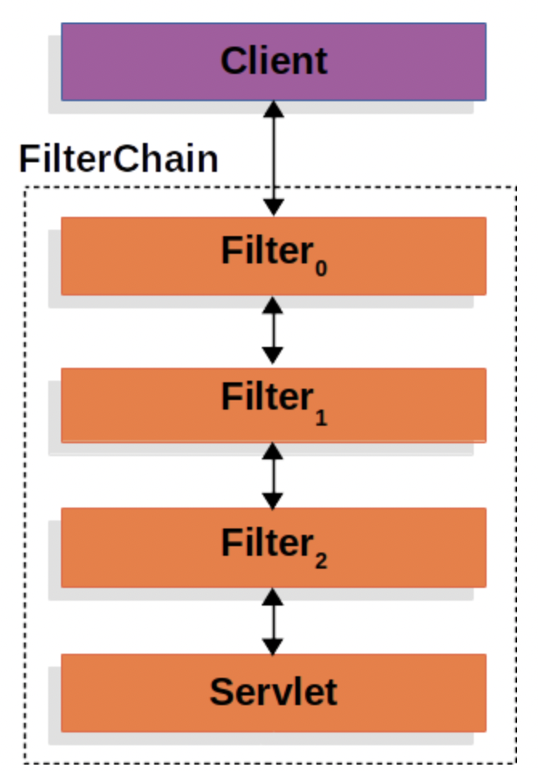

<h1>Servlet Security</h1>

<h2>Servlet이란?</h2>

- `Servlet`이라는 단어는 여러 방면에서 살펴보면 다양하게 해석될 수 있다.

  - 웹 애플리케이션을 생성하는 데에 사용되는 기술의 일종
  - 여러 인터페이스와 문서를 제공해주는 API
  - 어떠한 Servlet을 사용하더라도 필수적으로 구현해야 하는 인터페이스
  - 클라이언트의 요청 및 응답을 조작할 수 있는 기능이 있는 클래스를 상속한 클래스
  - 서버에 배포되어 동적 웹 페이지를 띄워줄 수 있는 웹 컴포넌트

- JAVA로 Servlet을 사용하면 아래의 이점들이 있다.

  - 요청 당 하나의 Thread를 생성한다.(프로세스가 아니다.)
  - Java를 사용하기에 WORA를 할 수 있으므로 JVM만 있다면 어디서든 실행 가능하다.
  - Servlet을 JVM이 직접 담당하기 때문에, 메모리 누수, GC 등에 대해 신경을 덜 쓸 수 있다.
  - Java를 사용하기에 기본적으로 보안이 어느정도 지원된다.

- 사실 Servlet을 관리하는 주체는 JVM이 아닌 Servlet Container이다.  
  Servlet Container는 클라이언트로부터 오는 모든 HTTP 요청을 일단 받으며,  
  해당 요청을 알맞은 Servlet에 전달한다.

  - 대표적인 컨테이너로는 Tomcat, Jetty, JBoss 등이 있다.

- Servlet Container는 WAS(Web Application Server)의 구성 요소인데,  
  WAS는 다양한 기능을 컨테이너에 구현하고 다양한 역할을 수행하는 서버라고 생각하면 된다.  
  WAS는 받은 요청을 내부적인 연산으로 처리한 후, 반환할 값을 클라이언트에게 전달해준다.  
  참고로 WAS와 Web Server는 다르다. Web Server 또한 WAS의 구성 요소 중 하나이다.

<hr/>

<h2>Servlet의 Filter 알아보기</h2>

- Spring Security의 Servlet에 대한 지원은 Filter들에 바탕을 두고 있다.  
  따라서 기본적으로 Filter가 무엇이고, 어떻게 적용되는지를 이해해보자.



- 그림에서 보면, 클라이언트의 요청을 받으면 Servlet이 해당 요청을 수행하기 전에 Filter들이 작동한다.  
  여러 개의 Filter들은 FilterChain으로 묶여서 Chain처럼 연속으로 작동한다.

- 내부적으로 진행되는 과정은 아래와 같다.

  - 클라이언트로부터 요청을 받으면 컨테이너는 `HttpServletRequest`의 작업을 정의하는 `Filter`들과 `Servlet`을 담은 `FilterChain`을 생성한다.  
    Spring MVC 기준으로 여기서 말하는 `Servlet`은 `DispatcherServlet`의 인스턴스이다.  
    하나의 `Servlet`은 하나의 `HttpServletRequest`와 `HttpServletResponse`의 쌍을 담당할 수 있다.  
    하지만 하나 이상의 `Filter`는 아래의 역할을 수행할 수 있다.
    - 다음 `Filter` 또는 `Servlet`이 작업을 수행하는 기준을 정의할 수 있다.
    - `HttpServletRequest` 또는 `HttpServletRequest`에 대한 작업을 수행할 수 있다.

- `Filter`들의 진짜 가치는 이들이 묶여 있는 `FilterChain`으로부터 나온다.

- 아래는 `FilterChain`의 사용에 대한 예시 코드이다.

```java
public void doFilter(ServletRequest request, ServletResponse response, FilterChain chain) {
    // Filter 적용 전 작업 수행
    chain.doFilter(request, response);
    // Filter 적용 후 작업 수행
}
```

- `Filter`가 다음에 수행될 또다른 `Filter` 또는 `Servlet`의 작업 수행 여부를 결정하기에,  
 각 `Filter`가 호출되는 순서는 매우 중요하다.
<hr/>
