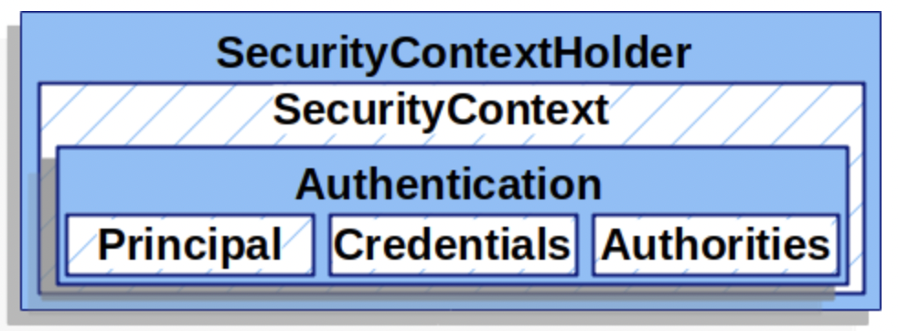

<h1>SecurityContextHolder</h1>

- Spring Security의 인증 모델의 중심에는 `SecurityContextHolder`가 있다.
  이 클래스는 이름에서 유추할 수 있듯이 `SecurityContext` 객체를 가지고 있다.



- `SecurityContextHolder`는 Spring Security가 인증을 통과시킨 사용자의 정보가 담기는 공간이다.  
  Spring Security는 `SecurityContextHolder`내에 인증된 사용자들의 정보가 어떻게 채워지는지에  
  대해서는 알지 못하며, 단지 정보가 있다면, 해당 정보의 사용자는 인증 된 것이라고 판단한다.

- Spring Security에게 사용자가 인증되었다고 알리는 가장 간단한 방법은 이 객체에 바로 정보를 전달하는 것이다.

```java
SecurityContext context = SecurityContextHolder.createEmptyContext();

Authentication authentication =
    new TestingAuthenticationToken("user_name", "password", "ROLE_USER");

context.setAuthentication(authentication);

SecurityContextHolder.setContext(context);
```

- 위 코드를 보면, `SecurityContextHolder.createEmptyContext()`를 호출하여  
  비어 있는 `SecurityContext` 객체를 생성한다. 여기서 주의할 점은, 아래와 같이 메소드 체이닝을 사용하면 안된다는 것이다.

  ```java
  SecurityContextHolder.getContext().setAuthentication(authentication);
  ```

  이렇게 메소드 체이닝을 사용하면 환경에 따라 다수의 Thread가 사용됨에 따라 문제가 발생할 수 있다.

- 그 다음에는 `Authentication` 객체를 생성했다. Spring Security는 `SecurityContext`에  
  어떤 `Authentication`의 구현체가 적용되어 있는지에 대해 신경쓰지 않는다.  
  위 예시에서는 `Authentication`의 구현체 중 하나인 `TestingAuthenticationToken` 객체를 사용했다.

- 마지막으로 생성된 `SecurityContext` 객체를 `SecurityContextHolder`에 적용했다.

* 현재 인증이 된 사용자 정보에 접근하는 예시 코드는 아래와 같다.

```java
SecurityContext context = SecurityContextHolder.getContext();
Authentication authentication = context.getAuthentication();
String userName = authentication.getName();
Object principal = authentication.getPrincipal();
Collection<? extends GrantedAuthority> authorities = authentication.getAuthorities();
```

- 기본적으로 `SecurityContextHolder`는 이러한 정보들을 저장하기 위해 내부적으로 `ThreadLocal`객체를 사용한다.  
 이는 곧 `SecurityContext`를 명시적으로 인자로 넘겨주지 않아도, 같은 Thread상에 있다면 어느 곳에서든  
 동일한 `SecurityContext`객체에 접근할 수 있음을 의미한다. 이러한 방식으로 `ThreadLocal`을 사용하는 것은  
하나의 인증 요청이 끝나고 해당 Thread가 clear된다는 보장이 있다면 안전한 방식이다. 이를 담당하는 것이  
 Spring Security의 FilterChainProxy이다.
<hr/>
