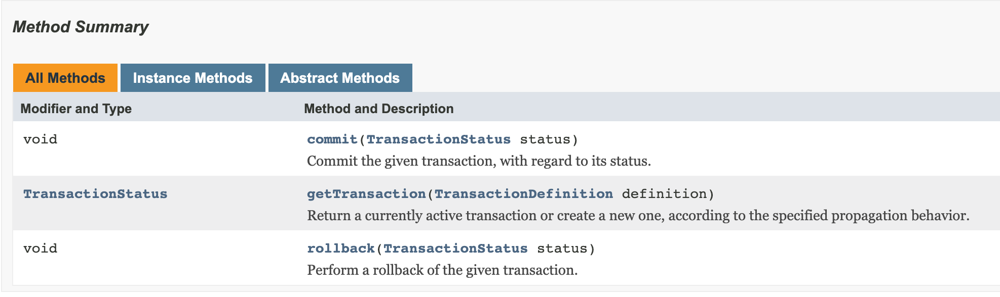

# @Transactional annotation

## @Transactional

- Spring Framework를 사용하며 개발할 때, 정말 많이 `@Transactional` 어노테이션을 사용한다.  
  하지만 이번에는 이 어노테이션이 예외가 발생했을 때 롤백 처리를 어떻게 하는지, 어떻게 작동하는지,  
  왜 사용해야 하는지 등에 대해 알아보자.

<hr/>

## @Transactional의 작동 방식

### 트랜잭션 관리자

- 트랜잭션 관련 설정을 할 때, 스프링에서 지원하는 다양한 **트랜잭션 관리자** 중 하나를 선택할 수 있는데,  
  이 트랜잭션 관리자들은 모두 아래의 인터페이스를 구현하고 있다.

```java
package org.springframework.transaction;

import org.springframework.lang.Nullable;

public interface PlatformTransactionManager extends TransactionManager {
    TransactionStatus getTransaction(@Nullable TransactionDefinition definition) throws TransactionException;
    void commit(TransactionStatus status) throws TransactionException;
    void rollback(TransactionStatus status) throws TransactionException;
}
```

- 위 메소드들에 대한 공식 문서의 요약은 아래와 같다.



- Spring은 위 인터페이스를 구현한 트랜잭션 관리자를 Spring Bean으로 등록한다.  
  아래는 JDBC 관련 트랜잭션을 관리하는 `DatasourceTransactionManager`이다.

```java
public class DataSourceTransactionManager extends AbstractPlatformTransactionManager implements ResourceTransactionManager, InitializingBean {
    //..
}

public abstract class AbstractPlatformTransactionManager implements PlatformTransactionManager, Serializable {
    //..
}
```

- 그리고 아래는 JPA 관련 트랜잭션을 관리하는 `JPATransactionManager` 이다.

```java
public class JpaTransactionManager extends AbstractPlatformTransactionManager implements ResourceTransactionManager, BeanFactoryAware, InitializingBean {
    //..
}

// AbstractPlatformTransactionManager는 DatasourceTransactionManager의 상위 클래스와 동일
```

- 이제 본격적으로 `@Transactional`이 어떻게 작동하는지 파악해보자.  
  이 어노테이션도 트랜잭션 관리자를 사용해 트랜잭션의 처리를 수행하며, 이를 AOP 방식으로 작동되게끔 한다.

> 참고로 Spring Boot가 아닌 Spring Framework에서는 `@Configuration`이 적용된 설정 클래스에 `@EnableTransactionManagement` 어노테이션을  
>  추가하고, 트랜잭션 매니저를 직접 지정해야 했다.

- 스프링 애플리케이션은 `@Transactional` 어노테이션이 적용된 **public 메소드** 에 대해 내부적으로 데이터베이스의 트랜잭션을 처리하기 위한  
  코드들을 삽입해준다. 대략적으로 아래와 같은 역할의 코드들이 삽입된다.

  - 데이터베이스 커넥션 획득
  - 트랜잭션 시잭 (`transaction.begin()`)
  - 정상 처리되면 commit (`transaction.commit()`)
  - 예외 발생 시 rollback (`transaction.rollback()`)

- 하지만 위와 같은 코드들은 컴파일 시점에 넣어지지 않고, 실행 시점(runtime)에 Dynamic Proxy를 이용해서 생성된다.

- 이제 실제 과정을 간략하게 보자.

  - (1) 실행될 메소드에 `@Transactional` 어노테이션이 적용되어 있다면 Dynamic Proxy가 생성된다.  
    이 과정에서 `ProxyFactoryBean`도 함께 생성된다. `ProxyFactoryBean`은 대상(타켓) bean에 대해  
    AOP를 사용해 호출 전 후로 특정 로직을 넣을 수 있도록 해준다.

  - (2) 실제 메소드 호출이 proxy 객체의 호출로 대신된다.

  - (3) Proxy 객체는 트랜잭션 관리자에게 처리를 위임한다.

  - (4) 결과 반환

<hr/>

## Isolation Level 지정

- `@Transactional` 으로 Transaction Isolation Level을 지정할 수 있다. 이 어노테이션의 isolation 속성에  
  `org.springframework.transaction.annotation.Isolation`의 5가지 값을 지정할 수 있다.

```java
public enum Isolation {

    DEFAULT(TransactionDefinition.ISOLATION_DEFAULT),

    READ_UNCOMMITTED(TransactionDefinition.ISOLATION_READ_UNCOMMITTED),

    READ_COMMITTED(TransactionDefinition.ISOLATION_READ_COMMITTED),

    REPEATABLE_READ(TransactionDefinition.ISOLATION_REPEATABLE_READ),

    SERIALIZABLE(TransactionDefinition.ISOLATION_SERIALIZABLE);

    private final int value;


    Isolation(int value) {
	this.value = value;
    }

    public int value() {
	return this.value;
    }
}
```

- 주로 사용하는 Mysql, MariaDB InnoDB 엔진의 기본 Isolation Level은 `REPEATABLE_READ`이고,  
  PostgreSQL의 경우에는 `READ_COMMITTED`이다.

## @Transactional의 트랜잭션 전파 방식

- `@Transactional`은 propagation 속성값을 지정함으로써 전파 단계를 설정할 수 있다.  
  설정할 수 있는 값들을 가진 열거형 클래스는 아래와 같다.

```java
public enum Propagation {

    REQUIRED(TransactionDefinition.PROPAGATION_REQUIRED),

    SUPPORTS(TransactionDefinition.PROPAGATION_SUPPORTS),

    MANDATORY(TransactionDefinition.PROPAGATION_MANDATORY),

    REQUIRES_NEW(TransactionDefinition.PROPAGATION_REQUIRES_NEW),

    NOT_SUPPORTED(TransactionDefinition.PROPAGATION_NOT_SUPPORTED),

    NEVER(TransactionDefinition.PROPAGATION_NEVER),

    NESTED(TransactionDefinition.PROPAGATION_NESTED);

    private final int value;


    Propagation(int value) {
	this.value = value;
    }

    public int value() {
	return this.value;
    }
}
```

- 각 상수의 의미는 아래와 같다.

  - `REQUIRED` : 기본값으로, 이미 트랜잭션이 있다면 해당 트랜잭션을 사용하고, 없다면 새로운 트랜잭션을 시작한다.
  - `SUPPORTS` : 이미 트랜잭션이 있다면 해당 트랜잭션을 사용하고, 없다면 트랜잭션 없이 실행한다.
  - `MANDATORY` : 이미 트랜잭션이 있다면 해당 트랜잭션을 사용하고, 없다면 예외를 발생시킨다.
  - `REQUIRES_NEW` : 새로운 트랜잭션을 시작한다. 이미 트랜잭션이 있다면 기존 트랜잭션은 연기한다.
  - `NOT_SUPPORTED` : 트랜잭션이 없이 실행한다. 이미 트랜잭션이 있다면 기존 트랜잭션은 연기한다.
  - `NEVER` : 트랜잭션 없이 실행한다. 이미 트랜잭션이 있다면 예외를 발생시킨다.
  - `NESTED` : 기존 트랜잭션이 있다면 해당 트랜잭션을 사용한다. 없다면 새로운 트랜잭션을 시작한다.

- 위 설정값들 중 `REQUIRES_NEW`와 `NESTED`가 헷갈릴 여지가 있는데, 이 둘은 아래와 같은 차이점들이 있다.

  - `REQUIRES_NEW` : 트랜잭션이 있다면 주어진 트랜잭션에서 _"inner"_ 트랜잭션을 만들어 사용한다.  
    이 내부 트랜잭션의 commit, rollback은 주어진 트랜잭션(_"outer"_ 트랜잭션)과 별개로 수행된다.  
    _"outer"_ 트랜잭션은 _"inner"_ 트랜잭션이 시작될 때 suspend(일시 정지, 연기)되고, _"inner"_ 트랜잭션의  
    작업이 끝났을 때 재개된다.

  - `NESTED` : 기존 트랜잭션에서 _"nested"(중첩)_ 트랜잭션을 만들어 사용한다. 이 _"nested"_ 트랜잭션은 기존  
    트랜잭션의 일부라고 봐도 무방하다. _"inner"_ 트랜잭션과는 달리, _"nested"_ 트랜잭션은 시작될 때 `SAVEPOINT`를  
    만든다. 만약 _"nested"_ 트랜잭션 내에서 예외가 발생하면, `SAVEPOINT`로 rollback된다.  
    _"nested"_ 트랜잭션은 기존 트랜잭션의 일부이기에, commit은 기존 트랜잭션이 끝날 때 수행된다.

  > `SAVEPOINT` : 데이터베이스의 특정 시점의 상태를 저장한 지점. 트랜잭션 내에서 예외가 발생했을 때 이 `SAVEPOINT`로  
  >  rollback할 수 있다.

- 위 전파 단계들을 테스트해보기 위해, 아래의 테이블이 하나 있다고 해보자.

```sql
CREATE TABLE `users` (
  `user_id` int NOT NULL AUTO_INCREMENT,
  `name` varchar(200) NOT NULL,
  `password` varchar(60) NOT NULL,
  `email` varchar(100) NOT NULL,
  `created_at` datetime NOT NULL DEFAULT now(),
  `updated_at` datetime NOT NULL DEFAULT now(),
  PRIMARY KEY (`user_id`),
  UNIQUE KEY `email` (`email`)
) ENGINE=InnoDB;
```

- `@Transactional`은 AOP 방식으로 동작하기에, 하나의 proxy 객체  
  내에서 한 메소드가 다른 메소드를 호출하면 트랜잭션이 전파되지 않는다.

- 이를 구현하기 위해 트랜잭션의 전파를 제대로 확인하기 위해 `TestService`와 `TestService2`를 만들었다. `TestService#foo()`에서 만든  
  트랜잭션을 `TestService2#bar()`에서 사용하게 된다.

### `REQUIRED`

```kt
// TestService.kt
@Service
class TestService(
    private val userRepository: UserRepository,
    private val testService2: TestService2
) {

    @Transactional
    fun foo() {
        userRepository.save(
            User(
                name = "user1",
                email = "user1@test.com",
                password = "user1"
            )
        )
        testService2.bar()
    }
}

// TestService2.kt
@Service
class TestService2(
    private val userRepository: UserRepository
) {

    @Transactional
    fun bar() {
        userRepository.save(
            User(
                name = "user2",
                email = "user2@test.com",
                password = "user2"
            )
        )
        throw RuntimeException("bar")
    }
}
```

- 위 코드에서 `foo()`, `bar()` 메소드 모두에 각각 `@Transactional`이 적용되어 있다.  
  이 경우, 두 메소드 모두 propagation은 기본값인 `REQUIRED`이다.  
  이제 `foo()`를 실행해보면, `bar()`에서 예외가 발생하는데 `foo()`, `bar()`는 같은 트랜잭션을  
  사용하므로 전체 로직이 모두 rollback된다.

### `SUPPORTS`

- 먼저 기존 트랜잭션이 없는 경우를 테스트해보자.

```kt
@Transactional(propagation = SUPPORTS)
fun foo() {
    userRepository.save(
        User(
            name = "user1",
            email = "user1@test.com",
            password = "user1"
        )
    )
    throw RuntimeException("foo")
}
```

- 위 경우, `SUPPORTS`는 기존 트랜잭션이 없다면 트랜잭션을 시작하지 않는다.  
  따라서 rollback이 되지 않으며, users 테이블에 새로운 row가 하나 삽입된다.

- 다음으로 이미 트랜잭션이 있는 경우를 보자.

```kt
// TestService.kt
@Service
class TestService(
    private val userRepository: UserRepository,
    private val testService2: TestService2
) {

    @Transactional
    fun foo() {
        userRepository.save(
            User(
                name = "user1",
                email = "user1@test.com",
                password = "user1"
            )
        )
        testService2.bar()
    }
}

// TestService2.kt
@Service
class TestService2(
    private val userRepository: UserRepository
) {

    @Transactional(propagation = SUPPORTS)
    fun bar() {
        userRepository.save(
            User(
                name = "user2",
                email = "user2@test.com",
                password = "user2"
            )
        )
        throw RuntimeException("bar")
    }
}
```

- `TestService2#bar()`는 `TestService#foo()`가 만든 기존 트랜잭션이 있기에 해당 트랜잭션을 사용하기에  
  모든 로직이 rollback된다.

### `MANDATORY`

- 먼저 기존 트랜잭션이 없는 경우를 보자.

```kt
@Transactional(propagation = MANDATORY)
fun foo() {
    userRepository.save(
        User(
            name = "user1",
            email = "user1@test.com",
            password = "user1"
        )
    )
    throw RuntimeException("foo")
}
```

- `foo()`가 실행되면, 아래의 예외를 발생시키게 된다.

```
org.springframework.transaction.IllegalTransactionStateException: No existing transaction found for transaction marked with propagation 'mandatory'
```

- 다음으로 기존 트랜잭션이 존재하는 경우를 보자.

```kt
// TestService.kt
@Service
class TestService(
    private val userRepository: UserRepository,
    private val testService2: TestService2
) {

    @Transactional
    fun foo() {
        userRepository.save(
            User(
                name = "user1",
                email = "user1@test.com",
                password = "user1"
            )
        )
        testService2.bar()
    }
}

// TestService2.kt
@Service
class TestService2(
    private val userRepository: UserRepository
) {

    @Transactional(propagation = MANDATORY)
    fun bar() {
        userRepository.save(
            User(
                name = "user2",
                email = "user2@test.com",
                password = "user2"
            )
        )
        throw RuntimeException("bar")
    }
}
```

- `SUPPORTS`와 마찬가지로 `MANDATORY`도 기존 트랜잭션이 있다면 해당 트랜잭션을 사용하기에, `bar()`에서 예외가 발생하면  
  `foo()`까지 rollback되어 모든 로직이 rollback된다.

### `NEVER`

- `NEVER`도 `SUPPORTS`가 트랜잭션이 없을 때와 마찬가지로 트랜잭션 없이 수행한다.  
  따라서 아래 메소드를 호출했을 때, rollback은 되지 않고 users 테이블에 하나의 row가 추가된다.

```kt
@Transactional(propagation = NEVER)
fun foo() {
    userRepository.save(
        User(
            name = "user1",
            email = "user1@test.com",
            password = "user1"
        )
    )
    throw RuntimeException("foo")
}
```

- 다음으로 기존 트랜잭션이 있는 경우를 보자.

```kt
// TestService.kt
@Service
class TestService(
    private val userRepository: UserRepository,
    private val testService2: TestService2
) {

    @Transactional
    fun foo() {
        userRepository.save(
            User(
                name = "user1",
                email = "user1@test.com",
                password = "user1"
            )
        )
        testService2.bar()
    }
}

// TestService2.kt
@Service
class TestService2(
    private val userRepository: UserRepository
) {
    @Transactional(propagation = NEVER)
    fun bar() {
        userRepository.save(
            User(
                name = "user2",
                email = "user2@test.com",
                password = "user2"
            )
        )
        throw RuntimeException("bar")
    }
}
```

- 이제 위 코드를 실행하면 아래와 같이 예외가 발생한다.

```
org.springframework.transaction.IllegalTransactionStateException: Existing transaction found for transaction marked with propagation 'never'
```

### `NOT_SUPPORTED`

- 마찬가지로 먼저 기존 트랜잭션이 없는 경우를 보자.

```kt
@Transactional(propagation = NOT_SUPPORTED)
fun foo() {
    userRepository.save(
        User(
            name = "user1",
            email = "user1@test.com",
            password = "user1"
        )
    )
    throw RuntimeException("foo")
}
```

- 트랜잭션이 없으면 트랜잭션 없이 실행하므로, 위 메소드의 호출 결과 rollback이 되지 않는다.

- 아래처럼 기존 트랜잭션이 있는 경우에는 어떨까?

```kt
// TestService.kt
@Service
class TestService(
    private val userRepository: UserRepository,
    private val testService2: TestService2
) {


    @Transactional
    fun foo() {
        userRepository.save(
            User(
                name = "user1",
                email = "user1@test.com",
                password = "user1"
            )
        )
        testService2.bar()
        userRepository.save(
            User(
                name = "user3",
                email = "user3@test.com",
                password = "user3"
            )
        )
    }
}

// TestService2.kt
@Service
class TestService2(
    private val userRepository: UserRepository
) {

    @Transactional(propagation = NOT_SUPPORTED)
    fun bar() {
        userRepository.save(
            User(
                name = "user2",
                email = "user2@test.com",
                password = "user2"
            )
        )
        throw RuntimeException("bar")
    }
}
```

- `NOT_SUPPORTED`는 기존 트랜잭션이 있다면 기존 트랜잭션을 _연기_ 한다고 했다.  
  위 코드의 `TestService#foo()`의 실행 결과, users 테이블에는 name이 user2인 row가 생성된다.  
  즉, `foo()`에서 만들어진 트랜잭션은 연기되고, `bar()`의 로직이 트랜잭션 없이 수행된 것이다.

### `REQUIRES_NEW`

- 아래 상황을 보자. 이번에는 `TestService2#bar()`가 아닌 `TestService#foo()`에서 예외를 발생시키도록 했다.

```kt
// TestService.kt
@Service
class TestService(
    private val userRepository: UserRepository,
    private val testService2: TestService2
) {

    @Transactional
    fun foo() {
        userRepository.save(
            User(
                name = "user1",
                email = "user1@test.com",
                password = "user1"
            )
        )
        testService2.bar()
        userRepository.save(
            User(
                name = "user3",
                email = "user3@test.com",
                password = "user3"
            )
        )
        throw RuntimeException("foo")
    }
}

// TestService2.kt
@Service
class TestService2(
    private val userRepository: UserRepository
) {

    @Transactional(propagation = REQUIRES_NEW)
    fun bar() {
        userRepository.save(
            User(
                name = "user2",
                email = "user2@test.com",
                password = "user2"
            )
        )
    }
}
```

- 이 상황에서 `TestService#foo()`를 호출하면, users 테이블에는 name이 user2인 row만 들어간다.  
  즉, `TestService#foo()`의 내용은 rollback 되었고, `TestService2#bar()`의 내용만 commit된 것이다.  
  여기서 _"outer"_ 트랜잭션은 `foo()`가 만들었고, _"inner_ 트랜잭션은 `bar()`가 만들었다.  
  이 결과를 통해 _"inner"_ 트랜잭션의 commit, rollback이 _"outer"_ 트랜잭션과 별개로 수행됨을 확인할 수 있다.

### `NESTED`

- 이번에는 `REQUIRES_NEW`의 코드에서 `TestService2#bar()`의 `@Transactional` 어노테이션의 propagation만  
  `NESTED`로 바꿔보았다.

```kt
// TestService.kt
@Service
class TestService(
    private val userRepository: UserRepository,
    private val testService2: TestService2
) {

    @Transactional
    fun foo() {
        userRepository.save(
            User(
                name = "user1",
                email = "user1@test.com",
                password = "user1"
            )
        )
        testService2.bar()
        userRepository.save(
            User(
                name = "user3",
                email = "user3@test.com",
                password = "user3"
            )
        )
        throw RuntimeException("foo")
    }
}

// TestService2.kt
@Service
class TestService2(
    private val userRepository: UserRepository
) {

    @Transactional(propagation = NESTED)
    fun bar() {
        userRepository.save(
            User(
                name = "user2",
                email = "user2@test.com",
                password = "user2"
            )
        )
    }
}
```

- `TestService#foo()`의 실행 결과, users 테이블에는 아무런 값도 저장되지 않았다.  
  이 상황에서 `TestService2#bar()`는 _"nested"_ 트랜잭션을 만들었고, 전에 이는 기존 트랜잭션의 일부이기에  
  기존 트랜잭션이 완료될 때 commit, rollback된다고 했다. 기존 트랜잭션을 시작한 `TestService#foo()`에서  
  예외를 발생했기에 _"nested"_ 트랜잭션을 사용한 `TestService2#bar()`에는 아무런 문제가 없음에도 불구하고  
  모든 내용이 rollback된 것이다.

<hr/>

### Reference

- AUSG 5th Spring Study by <a href="https://github.com/bluayer">blueayer</a>

- <a href="https://stackoverflow.com/questions/12390888/differences-between-requires-new-and-nested-propagation-in-spring-transactions">Difference between REQUIRES_NEW and NESTED</a>
- <a href="https://stackoverflow.com/questions/31088938/the-annotation-propagation-never-doesnt-work">Correct way to delegate transaction</a>
