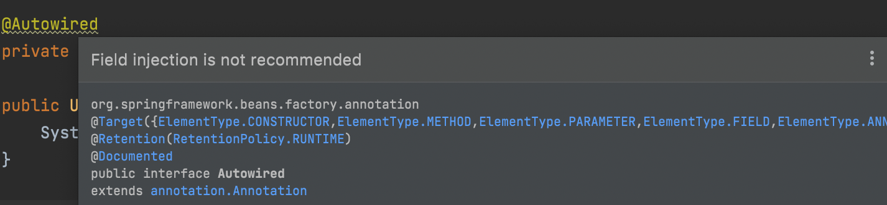

# DI 인스턴스화 순서와 필드 주입

- Spring Framework가 제공하는 DI가 어떤 순서로 이뤄지는지 간단히 알아보자.

- 기본적인 구조는 아래와 같다.
  - `UserController`
  - `UserServiceImpl` => `UserService`의 구현체
  - `UserRepositoryImpl` => `UserRepository`의 구현체

## 생성자 의존성 주입

- 생성자 의존성 주입을 사용해 구현해보자.

```java
// UserController
@RestController
public class UserController {

    private UserService userService;

    public UserController(UserService userService) {
        System.out.println("UserController constructor with UserService called.");
        this.userService = userService;
    }

    @GetMapping("/hi")
    public List<String> getHi() {
        return userService.returnHello();
    }
}

// UserServiceImpl
@Service
public class UserServiceImpl implements UserService {

    private UserRepository userRepository;

    public UserServiceImpl(UserRepository userRepository) {
        System.out.println("UserServiceImpl constructor with UserRepository called.");
        this.userRepository = userRepository;
    }

    @Override
    public List<String> returnHello() {
        return userRepository.listHellos();
    }
}

// UserRepositoryImpl
@Repository
public class UserRepositoryImpl implements UserRepository {

    public UserRepositoryImpl() {
        System.out.println("UserRepositoryImpl constructor called.");
    }

    @Override
    public List<String> listHellos() {
        return Arrays.asList("hello1", "hello2");
    }
}
```

- 이 상태로 스프링 애플리케이션을 실행하면, 아래와 같이 콘솔에 출력된다.

```
UserRepositoryImpl constructor called.
UserServiceImpl constructor with UserRepository called.
UserController constructor with UserService called.
```

- 예상한대로 의존성 주입이 될 `UserServiceImpl`의 생성자가 호출되어 인스턴스가 만들어지고,  
  의존성 주입을 받는 `UserController`의 인스턴스가 생성된다.

- 아마도 의존성 주입을 받을 클래스의 인스턴스가 생성되기 전에, 의존성 주입이 될  
  클래스의 인스턴스이 먼저 생성되어야 있어야지 주입을 할 수 있기 때문이지 않을까 싶다.

<hr/>

## `@Autowired` 필드 의존성 주입

- 다음으로 `@Autowired`를 사용해 필드를 사용한 의존성 주입을 받아보자.

```java
// UserController
@RestController
public class UserController {

    @Autowired
    private UserService userService;

    public UserController() {
        System.out.println("UserController constructor called.");
    }

    @GetMapping("/hi")
    public List<String> getHi() {
        return userService.returnHello();
    }
}

// UserServiceImpl
@Service
public class UserServiceImpl implements UserService {

    @Autowired
    private UserRepository userRepository;

    public UserServiceImpl() {
        System.out.println("UserServiceImpl constructor called.");
    }

    @Override
    public List<String> returnHello() {
        return userRepository.listHellos();
    }
}

// UserRepositoryImpl
@Repository
public class UserRepositoryImpl implements UserRepository {

    public UserRepositoryImpl() {
        System.out.println("UserRepositoryImpl constructor called.");
    }

    @Override
    public List<String> listHellos() {
        return Arrays.asList("hello1", "hello2");
    }
}
```

- 애플리케이션 실행 결과 콘솔에는 다음과 같이 출력된다.

```
UserController constructor called.
UserServiceImpl constructor called.
UserRepositoryImpl constructor called.
```

- 생성자 주입 방식과 순서가 바뀐 것을 알 수 있다.  
  즉 `UserController` 인스턴스가 먼저 생성되고, 그 이후에 `UserServiceImpl`의 인스턴스가 생성된다.  
  그리고 마지막으로 `UserRepositoryImpl`의 인스턴스가 생서된다.

## `@Autowired` setter 의존성 주입

- 마지막으로 `@Autowired`를 사용한 setter 의존성 주입을 받아보자.  
  바로 코드를 보자.

```java
// UserController
@RestController
public class UserController {

    private UserService userService;

    public UserController() {
        System.out.println("UserController constructor called.");
    }

    @Autowired
    public void setUserService(UserService userService) {
        System.out.println("Setter injection of UserService called.");
        this.userService = userService;
    }
}

// UserServiceImpl
@Service
public class UserServiceImpl implements UserService {

    private UserRepository userRepository;

    public UserServiceImpl() {
        System.out.println("UserServiceImpl constructor called.");
    }

    @Autowired
    public void setUserRepository(UserRepository userRepository) {
        System.out.println("Setter injection of UserRepository called.");
        this.userRepository = userRepository;
    }

    @Override
    public List<String> returnHello() {
        return userRepository.listHellos();
    }
}

// UserRepositoryImpl
@Repository
public class UserRepositoryImpl implements UserRepository {

    public UserRepositoryImpl() {
        System.out.println("UserRepositoryImpl constructor called.");
    }

    @Override
    public List<String> listHellos() {
        return Arrays.asList("hello1", "hello2");
    }
}
```

- 애플리케이션 실행 후 결과는 아래와 같다.

```
UserController constructor called.
UserServiceImpl constructor called.
UserRepositoryImpl constructor called.
Setter injection of UserRepository called.
Setter injection of UserService called.
```

- 즉 순서는 의존성 주입을 받는 객체의 인스턴스화로 시작해  
  그 반대 순서로 의존성 주입이 시행된다. 인스턴스화 순서는 `@Autowired` 필드 의존성  
  주입 방식과 동일하다.

<hr/>

## 지금까지의 결과

- 생성자 주입 방식의 순서와 `@Autowired`를 사용해 의존성 주입을 시행할 때의  
  순서가 정반대임을 확인할 수 있었다.

<hr/>

## Spring에서 `@Autowired` 필드 의존성 주입을 권장하지 않는 이유



- 위처럼 `@Autowired`를 사용해 필드 의존성 주입을 실행하면 애플리케이션은  
  정상적으로 실행되지만, IDE가 정적 검사 후 이 방식이 권장되지 않는다는 경고 문구를 띄워준다.

- Spring에서 이 방식을 권장하지 않는 이유를 찾아보다가, 매우 훌륭한 의견이 있는 글을 찾았다.  
  <a href="https://www.vojtechruzicka.com/field-dependency-injection-considered-harmful/">여기</a>에서 확인할 수 있다.

### SRP(단일 책임 원칙) 위배 가능성

- 필드를 통해 의존성을 주입받기는 매우 쉽다. 코드 또한 매우 간결하다.  
  심지어 6개, 10개, 그 이상의 의존성을 주입받아오 아무런 문제가 없다.  
  이는 다른 주입 방식을 사용해도 마찬가지인데, 생성자 주입 방식과 비교해보자.  
  생성자를 통해 의존성 주입을 받으면 주입받는 객체가 많아질 수록 생성자의  
  매개변수 또한 복잡하고 길어질 것이다. 이는 개발자로 하여금 코드에서 악취를  
  쉽게 찾을 수 있게 해준다. 특정 클래스에서 너무 많은 의존성을 갖는다는 것은 보통  
  해당 클래스가 너무 많은 책임을 가진다는 것을 의미한다. 이는 SRP 원칙을 위배하게 되며,  
  개발자는 이를 인지하고 관심사의 분리 및 리팩토링할 포인트를 쉽게 찾을 수 있다.  
  만약 필드를 통한 의존성 주입을 받는다면 이런 코드의 리팩토링 신호를 찾기 쉽지 않다.

### 의존성이 숨겨진다.

- DI Container를 사용한다는 것은 결국 클래스가 직접 의존성을 관리하지 않아도 됨을  
  의미한다. 즉 의존성을 유지하고 관리하는 책임을 해당 클래스가 갖지 않는다는 뜻이다.  
  클래스가 더 이상 이러한 책임을 갖지 않는다면, 해당 클래스가 어떤 일을 수행하는지를  
  공개된 인터페이스로 나타내야 한다. Setter를 통한 주입과 생성자를 통한 주입은 이를  
  명확히 드러낼 수 있지만, 필드를 통한 주입은 그렇지 못하다.

### DI Container와의 결합도 증가

- 의존성 주입(DI)을 제공하는 프레임워크의 핵심 아이디어 중 하나는  
  _"관리되는 클래스들이 어떤 DI Container가 사용되든 상관없어야 한다."_ 는 것이다.  
  즉 필요한 의존성을 모두 제공했다면 각 클래스들은 독립적으로 인스턴스화될 수 있어야 하며,  
  단지 POJO여야 한다는 뜻이다. 이 아이디어를 따른다면 DI Container를 실행하지 않고  
  단위 테스트를 실행할 수 있게 된다. 이렇게 DI Container와의 결합도가 없다면  
  클래스를 관리 또는 미관리 방식으로 사용할 수 있으며, 새로운 DI 프레임워크로도 쉽게  
  교체할 수 있다.

- 하지만, 필드를 통해 의존성 주입을 받게 되면 해당 클래스가 정상적으로 인스턴스화되기  
  위해 필요한 의존성들을 명시적으로 제공할 수 없게 된다. 자세히 알아보자.

  - 만약 의존성 주입을 받아야 하는 클래스를 기본 생성자를 통해 인스턴스화하면  
    의존성 주입이 되어야 하는 클래스들이 인스턴스화되지 않기에 `NullPointerException`이  
    매우 쉽게 발생할 수 있다.

  - 필드를 통해 의존성 주입을 받는 클래스들은 테스트, 다른 모듈 등 DI Container의 외부에서  
    사용할 수 없다. 사용하기 위해서는 리플렉션을 사용해 필요한 의존성들을 명시적으로 제공해주는  
    수밖에 없다.

### 불변성

- 생성자를 통한 의존성 주입 방식과 달리, 필드를 통한 의존성 주입에서는 의존성 주입이 될  
  객체의 필드를 불변(final)로 선언할 수 없다.

<hr/>
