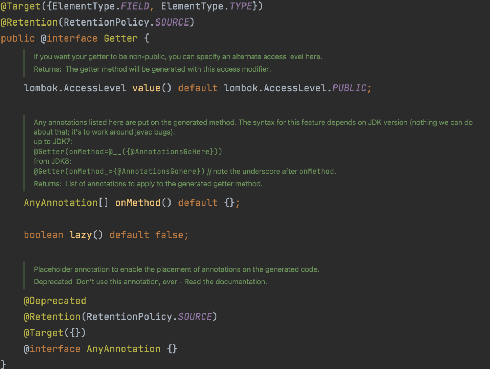
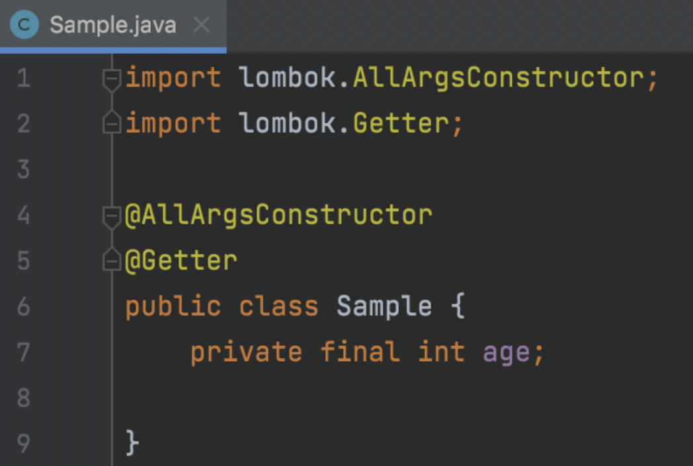
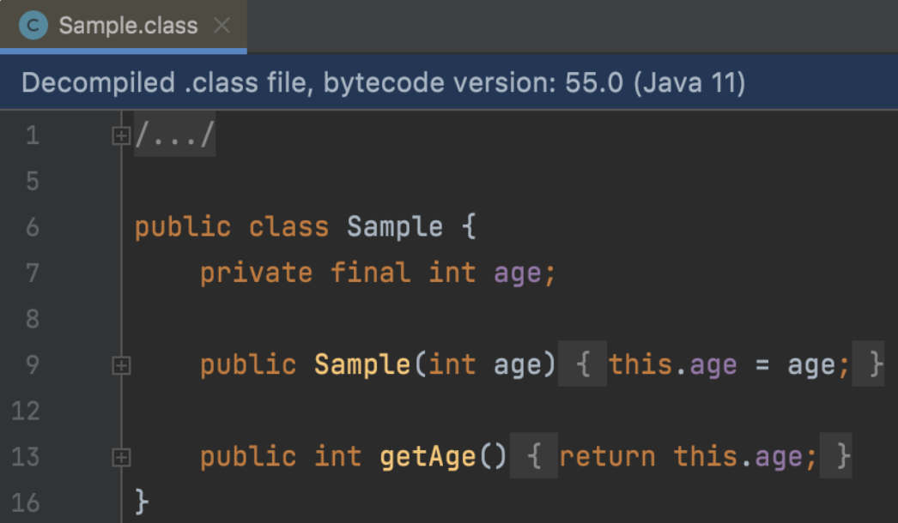
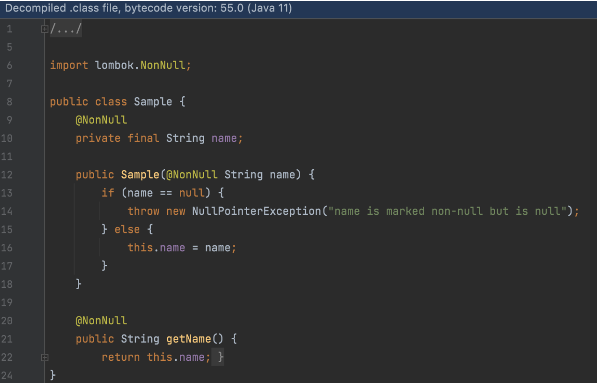
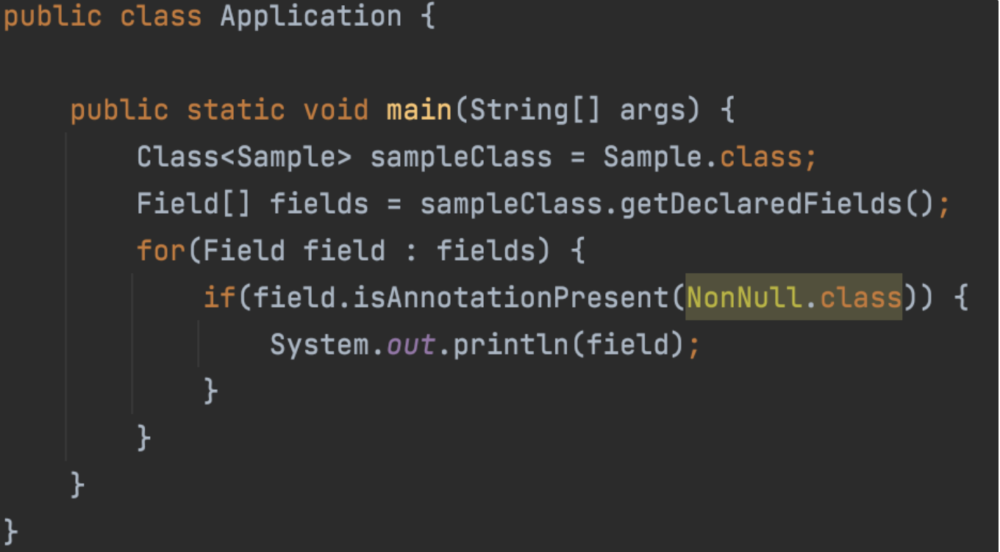
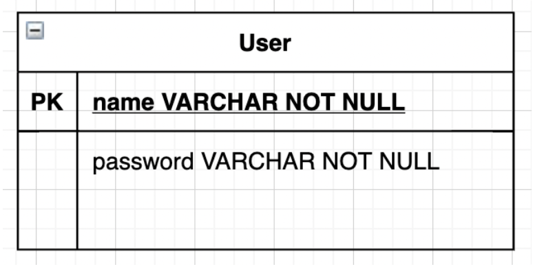
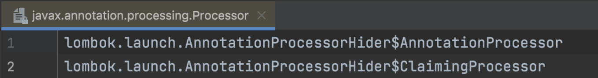
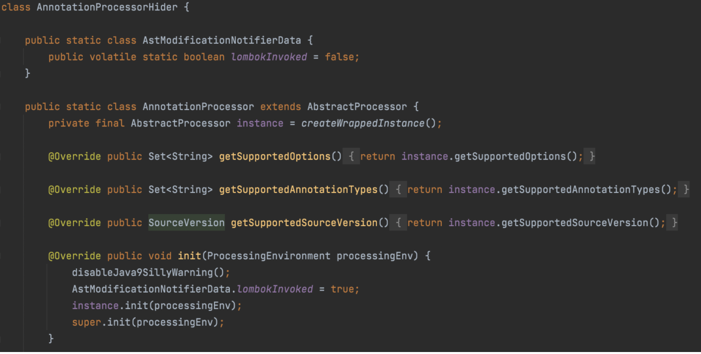

# 어노테이션 파헤쳐보기

## 기본적인 이론

- Java로 프로그래밍할 때, 정말 많이 그리고 자주 어노테이션을 사용하게 됩니다.
  특히 매번 작성해야 하는 코드, 보일러플레이트를 줄이기 위해 Lombok을 많이 사용하는데요.
  Lombok이 제공하는 무수한 어노테이션 중 `@Getter` 를 보면, 아래와 같이 선언돼 있습니다.
  

  어노테이션을 만들기 위한 클래스에 또다른 어노테이션이 붙어 있네요!
  이처럼 **어노테이션 선언에 다는 어노테이션을 메타 어노테이션(Meta-Annotation)**이라 합니다.

## 메타 어노테이션(Meta-Annotation)

어노테이션은 [JLS](https://docs.oracle.com/javase/specs/jls/se11/html/jls-9.html#jls-9.6.4.1)에 정의되어 있는 것처럼, 아래 9가지 문맥에서 사용할 수 있습니다.

- 어노테이션 적용 대상
  - 모듈 선언
  - 패키지 선언
  - 타입 선언(class, interface, enum, annotation type declarations)
  - 생성자 선언
  - Generic class, interface, method, 생성자의 타입 파라미터 선언부
  - 필드 선언(열거형 포함)
  - 예외 파라미터 선언
  - 지역 변수 선언(for문 내의 loop 변수 및 try-with-resources 문 포함)

메타 어노테이션 중 알아둬야할 중요한 것들은 아래 5가지 입니다.

- `@Target` : 어노테이션이 적용될 대상(Target)을 지정합니다.
  이 어노테이션의 매개변수로는 위의 어노테이션을 적용할 9가지 문맥을 전달합니다.
  예를 들어, `@Target(ElementType.METHOD)` 를 전달한다면, 이 어노테이션은 메소드에만 적용할 수 있게 됩니다.
- `@Retention` : 해당 어노테이션이 컴파일러에 의해 언제까지 _유지_ 될지를 지정합니다.

  이 어노테이션의 인자로는 `RetentionPolicy` 열거 타입을 전달하게 되는데, 이 열거 타입은 총

  `SOURCE`, `CLASS`, `RUNTIME` 의 세 개가 있습니다.

  예를 들어 `@Retention(RetentionPolicy.SOURCE)` 라면 이 어노테이션은

  `***.java` 파일 까지만 남아 있고, 컴파일 되어 바이트 코드를 담은 `*.class` 가 되었을 때는 사라집니다.\*\*

  바로 위에서 봤던 Lombok의 `@Getter` 가 이 RetentionPolicy가 적용되어 있는데요, 아래의 사진은 간단한 클래스의 Java 코드, 그리고 컴파일 한 후 디컴파일한 바이트 코드의 모습입니다.

  정말 Lombok 어노테이션이 사라져 있습니다.

  

  

  나머지 2개 열거 타입도 보자면, `RUNTIME` 은 가장 흔히 쓰이는 타입으로,

  바이트 코드 및 런타임에도 어노테이션이 그대로 남아 있습니다. 이 말은 곧 Reflection API를 사용해서 이 어노테이션을 읽을 수 있다는 뜻이죠.

  개인적으로 가장 의아했던건 `CLASS` 인데요, 이 어노테이션은 Javadoc에 아래처럼 쓰여 있습니다.

  ```java
  public enum RetentionPolicy {
     // SOURCE, RUNTIME,

      /**
       * Annotations are to be recorded in the class file by the compiler
       * but need not be retained by the VM at run time.  This is the default
       * behavior.
       */
      CLASS
  }
  ```

  - 즉 이 속성을 가지는 어노테이션은 _바이트 코드에도 남아 있지만 런타임에 VM에 의해 유지 될 필요가 없다._ 라고 되어 있으며, 심지어 기본 방식(default behavior)라고 합니다.
    이 문서만으로는 설명이 안되서, 리서치를 해보니 `CLASS` 가 적용된 어노테이션은 바이트코드에서 읽을 수 있지만, Reflection API로는 접근할 수 없다고 합니다. 코드 예시를 보겠습니다.
    아래 코드에서는 Lombok이 제공하는 `@NonNull` 어노테이션을 사용했으며, 이 어노테이션의 선언에는 `@Retention(RetentionPolicy.CLASS)` 가 적용되어 있습니다.

    ```java
    @Getter
    public class Sample {
        private @NonNull final String name;

    }
    ```

  - 위 코드를 컴파일해보고, 디컴파일 해보니 `@NonNull` 이 수행하는 로직(null 검사) 코드와 여전히 `@NonNull` 이 그대로 남아 있었습니다.

  

  - 이제 바이드 코드에까지 어노테이션이 그대로 남아 있는 것을 확인했으니, Reflection API로는 접근할 수 없는지 테스트해보겠습니다. 간단하게 `Sample` 클래스에서 `@NonNull` 이 적용된 필드들을 모두 가져와 콘솔에 출력해보고 싶었습니다.

  

  I~~DE가 정적 검사한 후 노란 색 경고를 띄워주는걸 보니 뭔가 벌써 잘못 썼다는게 느껴지네요,,~~

  경고문을 보면 아래와 같습니다.

  > Annotation 'NonNull.class' is not retained for reflective access

  - 즉 `NonNull` 이 Reflective 접근이 생길 때까지 유지되지 않는다는 것입니다.
    실제로 위 코드를 실행해보면 `ClassNotFoundException` 이 던져집니다.
    > Caused by: java.lang.ClassNotFoundException: lombok.NonNull

- 그 외에도 주요 메타 어노테이션이 3개 더 있는데, 아래 토클을 참고해 주세요.

  - 그 외의 메타 어노테이션들

    - `@Inherited` : 이 어노테이션이 슈퍼 클래스에 지정되면, 서브클래스에도 동일하게 적용됩니다.
      아래는 이를 이해할 수 있는 아주 간단한 예시입니다.

      ```java
      // `@Inheritable` 어노테이션 생성
      @Inherited
      @Retention(RetentionPolicy.RUNTIME)
      @Target(ElementType.TYPE)
      public @interface Inheritable {
      }

      // 부모 클래스인 `ParentClass`
      // 위에서 만든 `@Inheritable` 어노테이션이 적용되어 있습니다.
      @Inheritable
      @Getter
      @AllArgsConstructor
      public class ParentClass {
          private int age;
      }

      // 자식 클래스인 `SubClass`
      // `@Inheritable` 어노테이션이 적용되어 있지 않습니다.
      public class SubClass extends ParentClass {

          public SubClass(int age) {
              super(age);
          }
      }

      // 테스트 코드
      public class Application {
          public static void main(String[] args) {
              Class<ParentClass> parentClassClass = ParentClass.class;
              System.out.println(parentClassClass.isAnnotationPresent(Inheritable.class));
              Class<SubClass> subClassClass = SubClass.class;
              System.out.println(subClassClass.isAnnotationPresent(Inheritable.class));
          }
      }

      // 결과: true true
      ```

    - `@Deprecated` : 이 어노테이션이 적용된 클래스, 인터페이스, 메소드 등이 deprecated 처리됨을 알려줍니다.
    - `@Repeatable` : 직접 정의한 어노테이션에 배열 형태로 여러 개의 인자를 받고 싶을 경우, 이 어노테이션을 사용해 하나의 대상에 직접 정의한 어노테이션을 여러 번 적용할 수 있게 할 수 있습니다. 이 어노테이션을 적용한 어노테이션을 만들어 사용하려면 추가적으로 컨테이너 어노테이션을 생성해야 하는데, Effective Java의 Item 39에 자세한 예시가 나와있으니 참고해주세요..
      ~~너무 내용이 길어져요..~~

## 적용해보기 - 사용자 정보 가져오기!

- 매우 간단한 예시를 준비해 봤는데요, 상황은 아래와 같습니다.

  (예시는 예시일 뿐,, 너무 비현실적이라고 욕하지 말아주세요ㅜㅜ)

  1. Spring Security를 사용한다.
  2. 사용자가 요청을 보낼 때마다 헤더에 name, password를 함께 보낸다.
  3. 이 name, password를 갖고 로그인을 수행하며, 로직을 수행한다.

- 여기서 제가 하고 싶은건 특정 로직을 수행할 때 이 **_사용자_** 를 편하게 가져오는 것입니다.

- 우선 사용자 정보를 담는 테이블은 아래와 같이 매우 간단하게 생겼습니다.



- 최대한 나름 책임을 분리(?) 하기 위해 레포지토리도 만들어 보았는데요, 레포지토리는 하나의 `User`만을 가집니다.

> User는 단지 name, password 필드를 가진 POJO 입니다.

```java
@Repository
public class UserRepository {
    private Map<String, User> users;

    public UserRepository() {
        this.users = new HashMap<>();
        users.put("user1", new User("user1", "password"));
    }

    public Optional<User> findByNameAndPassword(String name, String password) {
        return users.values().stream()
                .filter(user -> user.getName().equals(name))
                .filter(user -> user.getPassword().equals(password))
                .findFirst();
    }
}
```

- 다음으로는 Spring Security에 대한 설정을 담은 설정 클래스 입니다.

```java
@Configuration
@RequiredArgsConstructor
public class SecurityConfig extends WebSecurityConfigurerAdapter {

    private final UserRepository userRepository;

    @Override
    protected void configure(HttpSecurity http) throws Exception {
        http
                .httpBasic().disable()
                .csrf().disable()
                .sessionManagement().sessionCreationPolicy(SessionCreationPolicy.STATELESS)
                .and()
                .authorizeRequests()
                .mvcMatchers(HttpMethod.GET, "/users").permitAll()
                .and()
                .addFilterBefore(new UserAuthenticationFilter(userRepository), UsernamePasswordAuthenticationFilter.class);
    }
}
```

- `addFilterBefore()` 를 사용해서 기본적으로 `SecurityFilterChain` 에 존재하는
  `UsernamePasswordAuthenticationFilter` 가 수행되기 전에 직접 만든
  `UserAuthenticationFilter` 를 끼워 넣어줬습니다. 이 필터는 아래처럼 생겼습니다.

```java
@RequiredArgsConstructor
public class UserAuthenticationFilter extends GenericFilterBean {

    private final UserRepository userRepository;

    private Authentication getAuthentication(ServletRequest request) {
        HttpServletRequest httpServletRequest = (HttpServletRequest) request;
				// name, password 가 key인 헤더값을 각각 추출해와서
        String name = httpServletRequest.getHeader("name");
        String password = httpServletRequest.getHeader("password");
				// userRepository를 통해 원하는 User가 있는지 쿼리한다.
        User user = userRepository.findByNameAndPassword(name, password).orElseThrow(() -> new RuntimeException("Login fail!"));
				// User가 있다면 Authentication의 구현체 중 하나인 UsernamePasswordAuthenticationToken에
				// 이 User를 담아 반환한다.
        return new UsernamePasswordAuthenticationToken(user, "", new TreeSet<>());
    }

    @Override
    public void doFilter(ServletRequest request, ServletResponse response, FilterChain chain) throws IOException, ServletException {
        try {
						// 바로 위의 getAuthentication을 호출해 User 정보를 받아온다.
            Authentication authentication = getAuthentication(request);

						// SecurityContext에 User 정보가 들어 있는 Authentication 객체를 넣는다.
            SecurityContext securityContext = SecurityContextHolder.getContext();
            securityContext.setAuthentication(authentication);

						// 나머지 SecurityFilterChain 내의 Filter들의 연산 호출
            chain.doFilter(request, response);
        } catch(Exception ex) {
            sendErrorMessage((HttpServletResponse) response, ex.getMessage());
        }
    }

		// 간단한 예외 처리 메소드..
    private void sendErrorMessage(HttpServletResponse response, String message) throws IOException {
        response.setStatus(HttpServletResponse.SC_UNAUTHORIZED);
        response.setContentType(MediaType.APPLICATION_JSON_VALUE);
        response.setCharacterEncoding("UTF-8");
        response.getWriter().write(new ObjectMapper()
                .writeValueAsString(new ErrorResponseDto(message)));
    }
}
```

- 이제 Spring Security에 대한 최소한의 설정을 마쳤으니, 어노테이션을 만들어 보겠습니다.
  그 전에 어노테이션이 없다면 원하는 사용자를 어떻게 가져와야 하는지를 살펴보겠습니다.

```java

@RestController
@RequiredArgsConstructor
public class UserController {

    private final UserService userService;

    @GetMapping("/v2/users")
    public User getInfoV1() {
        return (User) SecurityContextHolder.getContext().getAuthentication().getPrincipal();
    }

    @GetMapping("/v3/users")
    public User getInfoV2() {
        return userService.getUser();
    }
}

@Service
@RequiredArgsConstructor
public class UserService {

    //..
    public User getUser() {
        return (User) SecurityContextHolder.getContext().getAuthentication()
                .getPrincipal();
    }
}
```

- 이렇게 어디든 `SecurityContextHolder` 에서 `SecurityContext` 를 가져오고, `SecurityContext` 에서 `Authentication` 을 가져오고, `Authentication` 에서 원하는 정보를 가져오는 코드가 들어가야 합니다. 이를 어노테이션을 만들면 어떻게 되는지 파악해보겠습니다.

- 먼저 어노테이션을 정의합니다. 이름이 마땅히 떠오르지 않는데,, 우선 `@LoggedInUser` 라 짓겠습니다.
  저는 이 어노테이션이 예를 들면 `void foo(@LoggedInUser User user)` 처럼 메소드 파라미터로 사용되길 원하기 때문에 아래와 같이 선언했습니다.

```java
@Target(ElementType.PARAMETER)
@Retention(RetentionPolicy.RUNTIME)
public @interface LoggedInUser {
}
```

- 다음으로 이 어노테이션이 원하는 대로 **현재 SecurityContext 에 있는 사용자, 즉 로그인된 사용자를 가져다 주도록 하는 로직**을 작성해야 합니다.

- 우선 이 어노테이션은 Spring에서 사용하고, 특히 컨트롤러 메소드에서 사용할 것이기에 Spring이 제공하는 인터페이스 중 `HandlerMethodAgrumentResolver` 인터페이스를 구현해야 합니다. 이 인터페이스는
  컨트롤러에서 어노테이션을 사용해 원하는 값을 가져오고 싶을 때 (`@RequestBody` , `@PathVariable` , `@RequestParam` 등) 알맞은 값을 바인딩해주는 인터페이스입니다.
  실제로 파라미터명이 명시되지 않은 `@RequestParam` 을 `Map` 으로 담아 반환하기 위한 `HandlerMethodArgumentResolver` 구현체는
  `org.springframework.web.method.annotation.RequestParamMapMethodArgumentResolver` 에서 확인할 수 있습니다.
- 그럼 이제 위에서 만든 `@LoggedInUser` 를 위한 구현체를 만들어야 하는데요, 내용은 아래와 같습니다.

```java
@Component
public class UserInfoArgumentResolver implements HandlerMethodArgumentResolver {

		// 이 어노테이션이 적용된 파라미터를 지원하는지 여부
		// false를 반환하면 파라미터에 값 바인딩이 되지 않습니다.
		@Override
    public boolean supportsParameter(MethodParameter parameter) {
				//
        return parameter.getParameterAnnotation(LoggedInUser.class) != null
                && parameter.getParameterType().equals(User.class);
    }

		// 값 바인딩을 해주는 메소드, 바인딩할 값을 반환합니다.
    @Override
    public User resolveArgument(MethodParameter parameter, ModelAndViewContainer mavContainer, NativeWebRequest webRequest, WebDataBinderFactory binderFactory) throws Exception {
        Authentication authentication = SecurityContextHolder.getContext().getAuthentication();
        return (User)authentication.getPrincipal();
    }
}
```

- 마지막으로 위 컴포넌트가 실제로 작동하도록 하기 위해 `WebMvcConfigurer` 의 구현체를 만들어 Spring Bean으로 등록해야 합니다.

> `WebMvcConfigurer` 구현체를 만들지 않으면 `UserInfoArgumentResolver`는 아무런 동작도 하지 않습니다.

```java
@Configuration
@RequiredArgsConstructor
public class WebMvcConfig implements WebMvcConfigurer {
    private final UserInfoArgumentResolver userInfoArgumentResolver;

    @Override
    public void addArgumentResolvers(List<HandlerMethodArgumentResolver> resolvers) {
        resolvers.add(userInfoArgumentResolver);
    }
}
```

- 이제 컨트롤러에서 아래처럼 편리하게 현재 로그인한 사용자에 대한 정보를 가져와서 사용할 수 있습니다.

```java

@RestController
@RequiredArgsConstructor
public class UserController {

    private final UserService userService;

    @GetMapping("/v1/users")
    public User getInfo(@LoggedInUser User user) {
        return user;
    }
}
```

---

# 참고 및 부록

## Lombok의 작동 원리

- 어노테이션을 만들고, 이 어노테이션이 어떤 일을 하게끔 하는지에 대해서는 이제 조금 알 것 같습니다.
  그런데 위에서 든 예시는 Spring Boot에서 **어노테이션으로 특정 기능을 수행**하게 하는 것 이었습니다.
  그런데 Lombok의 경우, 위에서 봤듯이 아예 코드 자체를 기존 코드에 삽입해 버립니다.
  이를 가능하게끔 해주는 것이 **Annotation Processing** 인데, 조금만 알아보겠습니다.

### Annotation Processing

- Annotation Processing은 Java5에 등장한 개념으로, **컴파일타임에 코드를 생성해주는 기능** 입니다.

  예를 들어, 롬복의 어노테이션들이 각각 적절한 코드로 바뀌는 것도 Annotation Processing의 단계를 거치기 때문입니다.

- Annotation Processing의 단계를 하나씩 보겠습니다.

  1. Javac를 통한 빌드 시작
  2. 실행할 AnnotationProcessor 를 검색하고, 하나씩 실행합니다.
  3. 각 Processor는 1개 이상의 어노테이션에 대한 작업을 수행할 수 있으며, `javax.annotation.processing.AbstractProcessor` 를 상속받아 작성합니다.
  4. Processor 내에 해당 Processor가 처리할 어노테이션이 적용된 대상들을 모두 찾습니다.

     이때, 어노테이션이 적용된 클래스, 메소드, 혹은 필드들이 검색됩니다.

  5. 실질적으로 코드가 수정되는 단계로, `4` 에서 검색된 대상들의 메타데이터를 생성합니다.
  6. 새로운 파일을 만들고, `4` 에서 작성한 문자열들을 클래스에 작성합니다.
  7. 컴파일러는 모든 Annotation Processor 들이 작업을 완료했는지를 검사하며, 만약 모두 완료되지

     않았다면 `4~6` 단계를 계속해서 반복합니다.

- Java 컴파일러가 직접 정의한 `AbstractProcessor` 의 서브클래스를 찾는 방법은

  `META-INF/services/javax.annotation.processing.Processor` 를 참고합니다. 이 파일에 `AbstractProcessor` 의 서브클래스들을 써줘야지만 인식합니다.

  실제로 Lombok을 보면 `META-INF` 가 있으며, 위의 파일을 보면 아래와 같습니다.

  

- 첫 번째 줄에 있는 클래스를 타고 들어가면, 아래와 같이 `AbstractProcessor` 를 상속하는 클래스가 있습니다..



> 이 개념을 실제로 사용한 [예시 코드](https://www.logicbig.com/tutorials/core-java-tutorial/java-se-annotation-processing-api/annotation-processor-generate-code.html)를 발견했습니다.

<hr/>
