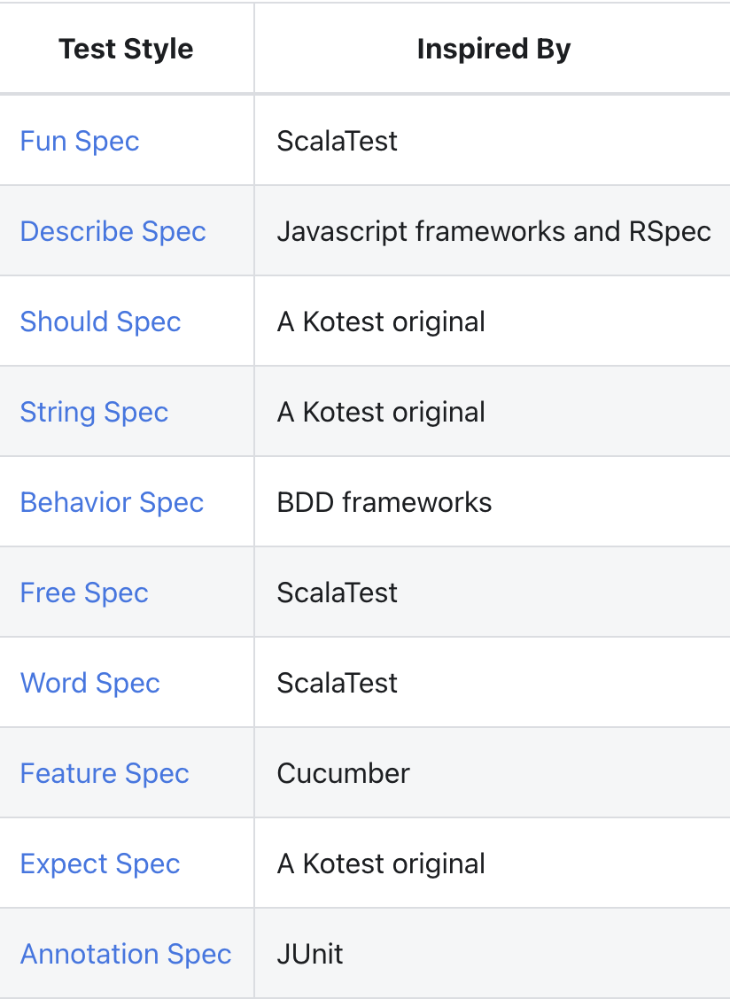

# Kotest, Mockk로 Spring 단위 테스트 작성하기

- 아래와 같은 코드가 있다고 해보자.  
  늘상 보는 `UserRepository`, `UserService`, 그리고 `User`이다.

```kt
// User.kt
class User(val id: Int, val name: String)

// UserRepository.kt
@Repository
class UserRepository {

    private val users: MutableMap<Int, User> = mutableMapOf()

    init {
        for(i in 1..10) {
            users[i] = User(i, "name$i")
        }
    }

    fun findById(id: Int) = users[id]
}

// UserService.kt
@Service
class UserService(
    private val userRepository: UserRepository
) {
    fun getUser(id: Int) = userRepository.findById(id)
}
```

- 이제 위 코드 중 `UserService`만의 동작을 테스트해보고 싶다 해보자.  
  이를 보통 단위 테스트라 하는데, `UserService`의 동작 만을 테스트하고 싶기 때문에 일반적으로  
  `UserService`가 사용하는 `UserRepository`의 동작은 실제 구현이 아닌, 흉내를 내도록(Mocking)해  
  테스트를 작성한다.

- 바로 작성해보자.

## 기존 코드

- Spring 프로젝트 생성 시 자동으로 포함되는 패키지를 그대로 쓰면 Mockito를 사용해 Mocking을 수행할 수 있다.  
  예를 들어, 아래처럼 두 개의 테스트 코드를 작성해보자. `UserRepository`는 `@MockBean` 어노테이션을 적용해  
  Mocking했고, 각 테스트 메소드 내에서 Mockito의 `when()`과 `thenReturn()`으로 Mocking을 해주었다.

```kt
/**
 * Java-like version of Unit test
 */
@ExtendWith(SpringExtension::class)
class UserServiceTest {

    private lateinit var userService: UserService

    @MockBean
    private lateinit var userRepository: UserRepository

    @BeforeEach
    fun setUp() {
        userService = UserService(userRepository)
    }

    @DisplayName("존재하는 id인 경우 사용자 가져오기 성공")
    @Test
    fun success_findById() {
        `when`(userRepository.findById(anyInt())).thenReturn(User(1, "name"))
        val result = userService.getUser(1)!!
        assertEquals(1, result.id)
        assertEquals("name", result.name)
    }

    @DisplayName("존재하지 않는 id인 경우, 사용자 가져오기 실패")
    @Test
    fun fail_findById() {
        `when`(userRepository.findById(anyInt())).thenReturn(null)
        val result = userService.getUser(1)
        assertNull(result)
    }
}
```

- 테스트는 잘 통과한다. 하지만 뭔가 _Java 코드를 그냥 그대로 Kotlin으로 변환만 한 느낌_ 이 든다.  
  즉, **코틀린이 제공하는 편리한 언어적 특성을 활용하지 않았기에** 이런 느낌이 드는 것 같다.

- 이를 만끽해보기 위해, 우선 Kotest의 일부만을 도입해보자.  
  Kotest는 코틀린에서 테스트를 수행하기 수월하게 도와주는 테스트 프레임워크이다.

<hr/>

## Kotest Assertions 도입

- Kotest를 일부 도입해보자. 아래의 의존성을 추가해준다.

```gradle
//..

dependencies {
    testImplementation("io.kotest:kotest-runner-junit5:5.0.0.M3")
    testImplementation("io.kotest:kotest-assertions-core:5.0.0.M3")
}

//..
```

- 이를 활용하면, 위의 `assertEquals()`를 사용한 테스트 코드를 아래처럼 바꿀 수 있다.

```kt
@ExtendWith(SpringExtension::class)
class UserServicePartlyKotest {

    // 동일

    @DisplayName("존재하는 id인 경우 사용자 가져오기 성공")
    @Test
    fun success_findById() {
	`when`(userRepository.findById(ArgumentMatchers.anyInt())).thenReturn(User(1, "name"))
        val result = userService.getUser(1)!!
        result.id shouldBe 1
        result.name shouldBe "name"
    }

    @DisplayName("존재하지 않는 id인 경우, 사용자 가져오기 실패")
    @Test
    fun fail_findById() {
	`when`(userRepository.findById(ArgumentMatchers.anyInt())).thenReturn(null)
        val result = userService.getUser(1)
        result shouldBe null
    }
}
```

- 기존에 Java에서 계속 봐왔던 `assertEquals()`, `assertNotNull()` 등의 JUnit 스타일의 검증이 아닌,  
  Kotlin만 활용할 수 있는 infix function을 제공해주는 kotlin-assertions를 사용해서 `X shouldBe Y` 처럼  
  코드가 조금 더 _코틀린 스러워_ 졌다.

<hr/>

## Mockito 제거하기

- 이번에는 `when(..).thenReturn(..)` 형식의 코드를 수정해보자. `assertEquals()`를 코틀린 스럽게 바꾼 것과  
  마찬가지로 이렇게 동작을 Mocking하기 위해 코틀린으로 지원되는 라이브러리가 있다. 바로 Mockk이다.

```kt
@ExtendWith(SpringExtension::class)
class UserServiceMockkTest {
    private lateinit var userService: UserService

    @MockkBean // 주의: @MockBean이 아니다!
    private lateinit var userRepository: UserRepository

    @BeforeEach
    fun setUp() {
        userService = UserService(userRepository)
    }

    @DisplayName("존재하는 id인 경우 사용자 가져오기 성공")
    @Test
    fun success_findById() {
        every { userRepository.findById(any()) } returns User(1, "name")
        val result = userService.getUser(1)!!
        result.id shouldBe 1
        result.name shouldBe "name"
    }

    @DisplayName("존재하지 않는 id인 경우, 사용자 가져오기 실패")
    @Test
    fun fail_findById() {
        every { userRepository.findById(any()) } returns null
        val result = userService.getUser(1)
        result shouldBe null
    }
}
```

- 위처럼 기존에 `when(..).thenReturn(..)` 형식의 코드가 `every { .. } returns X` 처럼 바뀌었다.  
  이또한 infix 함수를 사용한 것으로, 코틀린에서만 사용할 수 있는 매우 편리한 방식이다.

- 참고로 이렇게 되면 Spring Component를 더 이상 `@MockBean`으로 사용할 수 없게 된다.  
  (테스트 실행 자체가 실패한다.)  
  대신 아래의 의존성을 추가해 `@MockkBean`, `@SpykBean` 등을 적용해줘야 한다.

```gradle
//..

dependencies {
    //..
    testImplementation("com.ninja-squad:springmockk:3.0.1")
}

//..
```

- 그런데 아직도 뭔가 살짝 아쉬운 감이 있다. 꼭 모든 테스트를 JUnit 처럼 `@Test` 어노테이션을 붙여줘야 할까?  
  다른 더 편리한게 없을까?

<hr/>

## Kotest Testing Style 적용해보기

- Kotest에는 `XXSpec`이라는 테스트 스타일을 위한 클래스가 지원된다.  
  공식 문서를 보면 아래의 표를 통해 어떤 스타일을 제공하는지 알 수 있다.



- 개인적으로 나는 Scala는 써본 경험이 없기 때문에, Describe Spec, Should Spec, String Spec, Behavior Spec,  
  Expect Spec, 그리고 Annotation Spec을 사용해보려 한다.

### Describe Spec

```kt
class UserServiceDescribeSpecTest : DescribeSpec() {

    private val userRepository = mockk<UserRepository>()
    private lateinit var userService: UserService

    init {

        beforeTest {
            userService = UserService(userRepository)
        }

        describe("존재하는 ID인 경우") {
            it("사용자 가져오기 성공") {
                every { userRepository.findById(any()) } returns User(1, "name")
                val result = userService.getUser(1)!!
                result.id shouldBe 1
                result.name shouldBe "name"
            }
        }

        describe("존재하지 않는 ID인 경우") {
            it("사용자 가져오기 실패") {
                every { userRepository.findById(any()) } returns null
                val result = userService.getUser(1)
                result shouldBe null
            }
        }
    }
}
```

> 참고로 `@MockkBean` 또는 `@MockBean`을 사용하면 userRepository가 초기화되지 않았다는 오류가 발생한다.

- 코드가 정말 공식 문서에서 말한 것처럼 JavaScript 테스트 코드(Jest)와 비슷해졌다.  
  모든 테스트에 `@DisplayName`으로 이름을 붙이고, 테스트 메소드임을 알리려 `@Test`를 사용하지 않으면서도  
  더 알기 쉽게 이름을 지을 수 있으며, 테스트하는 상황, 과정도 더 가독성이 좋아졌다.

### Should Spec

- Should Spec은 Describe Spec과 거의 똑같다. 단지 `describe { }`를 `context { }`로, `it { }`를 `should { }`로 바꾸었다.  
  참고로 `should { }`만 있어도 된다. 꼭 `should { }`가 `context{ }`내에 있어야 할 필요는 없다.

```kt
class UserServiceShouldSpecTest : ShouldSpec() {

    private val userRepository = mockk<UserRepository>()
    private lateinit var userService: UserService

    init {

        beforeTest {
            userService = UserService(userRepository)
        }

        context("존재하는 ID인 경우") {
            should("사용자 가져오기 성공") {
                every { userRepository.findById(any()) } returns User(1, "name")
                val result = userService.getUser(1)!!
                result.id shouldBe 1
                result.name shouldBe "name"
            }
        }

        context("존재하지 않는 ID인 경우") {
            should("사용자 가져오기 실패") {
                every { userRepository.findById(any()) } returns null
                val result = userService.getUser(1)
                result shouldBe null
            }
        }

    }

}
```

### String Spec

- 이 방식은 문자열이 테스트명이 되며, 람다식 하나를 받아 그 안에 테스트 내용을 입력하면 된다.

```kt
class UserServiceStringSpecTest : StringSpec() {

    private val userRepository = mockk<UserRepository>()
    private lateinit var userService: UserService

    init {
        beforeTest {
            userService = UserService(userRepository)
        }

        "존재하는 ID라면 사용자 가져오기 성공" {
            every { userRepository.findById(any()) } returns User(1, "name")
            val result = userService.getUser(1)!!
            result.id shouldBe 1
            result.name shouldBe "name"
        }

        "존재하지 않는 ID라면 사용자 가져오기 실패" {
            every { userRepository.findById(any()) } returns null
            val result = userService.getUser(1)
            result shouldBe null
        }
    }
}
```

### Behavior Spec

- 이 방식은 BDD(Behavior Driven Development) 방식의 테스트 코드를 주로 선호하는  
  사람들이 좋아할만한 방법으로, 아예 `given()`, `when()`, `then()`을 제공한다.

```kt
class UserServiceBehaviorSpecTest : BehaviorSpec() {

    private val userRepository = mockk<UserRepository>()
    private lateinit var userService: UserService

    init {

        beforeTest {
            userService = UserService(userRepository)
        }

        given("사용자 ID가") {
            `when`("존재한다면") {
                then("사용자 가져오기 성공") {
                    every { userRepository.findById(any()) } returns User(1, "name")
                    val result = userService.getUser(1)!!
                    result.id shouldBe 1
                    result.name shouldBe "name"
                }
            }

            `when`("존재하지 않는 ID라면") {
                then("사용자 가져오기 실패") {
                    every { userRepository.findById(any()) } returns null
                    val result = userService.getUser(1)
                    result shouldBe null
                }
            }
        }
    }
}
```

### Expect Spec

- 이 방식은 `ShouldSpec`과 매우 비슷한데, 단지 `should()` 대신 `expect()`를 사용한다는 점만 다르다.

```kt
class UserServiceExpectSpecTest : ExpectSpec() {

    private val userRepository = mockk<UserRepository>()
    private lateinit var userService: UserService

    init {

        beforeTest {
            userService = UserService(userRepository)
        }

        context("존재하는 ID인 경우") {
            expect("사용자 가져오기 성공") {
                every { userRepository.findById(any()) } returns User(1, "name")
                val result = userService.getUser(1)!!
                result.id shouldBe 1
                result.name shouldBe "name"
            }
        }

        context("존재하지 않는 ID인 경우") {
            expect("사용자 가져오기 실패") {
                every { userRepository.findById(any()) } returns null
                val result = userService.getUser(1)
                result shouldBe null
            }
        }
    }
}
```

### Annotation Spec

- 이 스타일은 JUnit이 어노테이션을 많이 사용한다는 점에서 JUnit과 가장 비슷하다.

```kt
@DisplayName("사용자 ID 조회 테스트")
class UserServiceAnnotationSpecTest : AnnotationSpec() {

    private val userRepository = mockk<UserRepository>()
    private lateinit var userService: UserService

    @BeforeEach
    fun setUp() {
        userService = UserService(userRepository)
    }

    @Test
    fun successIfAvailableId() {
        every { userRepository.findById(any()) } returns User(1, "name")
        val result = userService.getUser(1)!!
        result.id shouldBe 1
        result.name shouldBe "name"
    }

    @Test
    fun failIfInvalidId() {
        every { userRepository.findById(any()) } returns null
        val result = userService.getUser(1)
        result shouldBe null
    }
}
```

- 위 코드에서 사용한 `@DisplayName`과 `@Test`는 `org.junit.jupiter.api` 패키지의 어노테이션들이 아닌,  
  `io.kotest.core.spec`의 어노테이션들이다. 사실 꼭 `io.kotest.core.spec`의 어노테이션일 필요는 없다.  
  단, 모든 어노테이션들을 **둘 중 하나에서 사용해야 한다.** 예를 들어, `@BeforeEach`는 kotest 패키지에 있고,  
  `successIfAvailable()`의 `@Test`는 kotest에서, 그리고 `failIfInvalidId()`의 `@Test`는  
  junit의 것이라 해보자. 이렇게 된다면 `failIfInvalidId()`의 이전에는 kotest의 `@BeforeEach`가 적용된  
  `setUp()`이 호출되지 않기에 userService 필드의 초기화가 일어나지 않으며 테스트에 실패하게 된다.

<hr/>

- <a href="https://kotest.io/docs/assertions/assertions.html">Kotest Assertions</a>
- <a href="https://mockk.io/">Mockk</a>
- <a href="https://kotest.io/docs/framework/testing-styles.html">Kotest Testing Styles</a>
- <a href="https://techblog.woowahan.com/5825/">스프링에서 코틀린 스타일 테스트 코드 작성하기</a>
