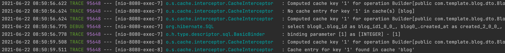
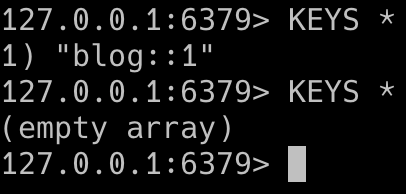

# Redis 적용하기(Spring)

- 이전에는 `UserRedisRepository`를 직접 만들어서, Redis에 정보가 없다면 넣어주고, 있다면 있는 정보를  
  가져오는 로직을 직접 작성했다. 이번에는 Spring이 제공하는 어노테이션들을 활용해서 Caching을 구현해보자.

- 우선 애플리케이션의 최상단에서 설정을 해줘야 하는데, `@EnableCaching` 어노테이션을 적용해주면 된다.

```kt
@SpringBootApplication
@EnableJpaAuditing
@EnableCaching
class Application {

    // Other Spring Beans..

    @Bean
    fun cacheConfiguration(): RedisCacheConfiguration {
        return RedisCacheConfiguration.defaultCacheConfig()
            .entryTtl(Duration.ofMinutes(60)) // 1시간의 TTL 지정
            .disableCachingNullValues()  // Null 값에 대한 caching disable
            .serializeValuesWith(
                RedisSerializationContext.SerializationPair.fromSerializer(
                    JdkSerializationRedisSerializer()
            ))
    }

    @Bean
    fun redisCacheManagerBuilder(): RedisCacheManagerBuilderCustomizer {
        return RedisCacheManagerBuilderCustomizer { builder ->
            builder.withCacheConfiguration("blog", RedisCacheConfiguration.defaultCacheConfig().entryTtl(Duration.ofMinutes(1)))
        }
    }

}
fun main(args: Array<String>) {
    runApplication<Application>(*args)
}
```

- 우선 `@EnableCaching`은 이 Spring Boot Application이 caching을 할 것임을 알려준다.  
  위 설정은 정말 최소한의 설정만 한 것이다.  
  우리는 이번에 "blog"를 caching할건데, `redisCacheManagerBuilder()`에서 `builder.withCacheConfiguration()`을 보면  
  cacheName이 "blog"인 cache에 대해서 1분의 TTL을 준 것을 볼 수 있다.  
  이는 의도적으로 설정한 값이며, 1분 뒤에 정말 cache가 지워지는지를 확인하기 위함이다.

- 다음으로 필요한 서비스 코드에 cache를 저장하라고 알려주자.  
  우선 이 예시는 게시글(blog)의 특정 ID를 가지고 조회할 때, caching을 하는 것이다.  
  기존에 있던 서비스 코드를 보자.

```kt
@Service
class BlogService(
    val blogRepository: BlogRepository
) {

    @Transactional(readOnly=true)
    fun getById(blogId: Int): BlogDetailResponseDto {
        val blog = blogRepository.findById(blogId).orElseThrow { BlogIdNotFoundException() }
        return BlogDetailResponseDto(blog)
    }
}
```

- `BlogDetailResponseDto`는 게시글에 대한 정보를 담고 있는 단순한 DTO 객체이다.ㄹ
- 게시글을 단순히 조회하는 것은 다른 것들과 마찬가지로 게시글의 정보가 변경된다든지 등의 경우를 생각하여 cache 정책을 세워야 하는데,  
  일단 여기서는 Caching이 제대로 되는지만 확인할 것이다.

- 우선 메소드 단위에 `@Cacheable` 어노테이션을 지정해주자.  
  이 어노테이션은 메소드 단위에 붙으면 메소드가 반환하는 객체를 Caching한다.  
  이때, Caching된게 없다면 Caching을 하고, 만약 있다면 Caching된 겍채를 가져온다.

- 이 어노테이션이 밭는 필드들 중 value는 말 cacheNames의 별칭으로, 우리는 위에서 최상단 애플리케이션에서 1분의 TTL을 준  
  cacheName이 "blog"이므로 여기에 "blog"를 지정해주자. 다음으로 key는 이 객체의 고유 key가 될만한 값을 받는다.  
  이 경우, blog는 각각 자신만의 고유한 blogId를 가지므로 이 값을 key로 넘겨주었다.

```kt
@Service
class BlogService(
    val blogRepository: BlogRepository
) {

    @Cacheable(value=["blog"], key="#blogId")
    @Transactional(readOnly=true)
    fun getById(blogId: Int): BlogDetailResponseDto {
        val blog = blogRepository.findById(blogId).orElseThrow { BlogIdNotFoundException() }
        return BlogDetailResponseDto(blog)
    }
}
```

- 이제 테스트만 하면 되는데, 마지막으로 한 가지 주의할 점은 Serializing을 하기 때문에 `@Cacheable`이 Caching을 할  
  객체들은 꼭 `java.io.Serializable` 인터페이스를 구현해야 한다는 것이다.

- `application.properties`에 아래의 logging 설정을 추가해주고, 테스트를 해보자.  
  조회할 blogId는 1이다.

```properties
# Cache Hit 등의 Cache 관련 로깅
logging.level.org.springframework.cache=TRACE

# RDB에 대해 수행되는 SQL문 관련 로깅
logging.level.org.hibernate.SQL=DEBUG
logging.level.org.hibernate.type.descriptor.sql.BasicBinder=TRACE
```



- 결과창을 보면, 처음에는 blogId = 1에 대한 cache가 없기에 `No cache entry for key '1' in cache(s) [blog]`가 출력된다.  
  그 후, `@Cacheable` 어노테이션은 이 객체를 Caching 처리한다. 또한 Caching할 객체의 정보를 채우기 위해 RDB에 대해 SQL문이  
  함께 수행된 것을 볼 수 있다.  
  다음으로 다시 동일한 요청을 보내면, SQL문은 수행되지 않고, `Cache entry for key '1' found in cache 'blog'`가  
  출력되는 것을 볼 수 있다. Cache에서 정보가 있기에 가져오고, 당연하게 RDB에 대해 SQL문은 수행하지 않은 것이다.

- 이렇게 Caching이 정상적으로 동작하는 것을 확인할 수 있다. 아래는 Redis-Cli 화면이다.



- "blog::1"이 key인 객체가 보이고, 지정된 TTL인 1분이 지나고 다시 명령을 수행하자, 해당 key를 가진 객체가  
 사라진 것을 볼 수 있다.
<hr/>
