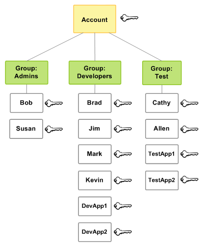

<h1>AWS의 IAM(Identity Access Management)</h1>

- 이 문서는 AWS의 공식 문서를 참조해서 정리한 것입니다.  
  <a href="https://docs.aws.amazon.com/ko_kr/IAM/latest/UserGuide/id.html">공식 문서 보기</a>

<h2>IAM(Identity Access Management)이란?</h2>

- AWS IAM은 AWS에서 생성하는 Entity로써 AWS의 다양한 서비스와 상호작용하기 위해  
  그 Entity를 사용하는 사람 또는 애플리케이션을 나타낸다.

<h3>AWS가 IAM 사용자를 식별하는 방법</h3>

- 사용자를 생성하면 IAM은 그 사용자를 식별하기 위한 방법을 아래와 같이 생성한다.

  - 사용자 생성 시 지정한 이름 확인
  - 사용자의 Amazon 리소스 이름(ARN) 확인
  - 사용자 각각의 고유 식별자 (AWS CLI를 사용하는 경우에 해당)

- `Root User`는 말그대로 Root 계정으로, AWS의 모든 서비스에 대해 접근이 가능하다.  
 반면에 `IAM User`는 특정 서비스에 대한 특정 권한만을 부여하여 특정 서비스에 대해서만  
 작업을 수행할 수 있도록 한다.

<h2>IAM 사용자 만들기</h2>

- AWS에서 IAM 사용자를 만드는 것은 아래 링크에 자세히 설명되어 있다.  
  <a href="https://docs.aws.amazon.com/ko_kr/IAM/latest/UserGuide/id_users_create.html">링크</a>

- 가장 중요한 것은 IAM 사용자를 만들고 그 사용자를 통해 AWS API를 이용하는 작업을 하려면  
 사용자를 생성하고 나서 보이는 `Access Key`를 사용해야 하는데, 이 키 (2개)는 그 화면에서만 볼 수 있고  
 나중에는 볼 수 없으므로 항상 저장을 해놓아야 한다. 만약 저장하지 않아서 잊어버렸다면  
 새로운 키를 발급받아 사용하는 방법 밖에 없다.

<h2>IAM Group</h2>

- IAM 그룹은 IAM 사용자들의 집합니다. 말그대로 사용자들이 포함되어 있는 그룹이라고 생각하면 된다.  
  그룹을 사용하면 동일한 권한을 여러 개의 사용자들에게 부여할 수 있다.  
  만약 A,B,C IAM 사용자에게 X,Y,Z의 권한을 동일하게 부여하고 싶다면  
  X,Y,Z의 권한을 가지는 그룹을 생성한 후 A,B,C 사용자를 해당 그룹에 추가하면 된다.

- 그룹은 위에 설명한대로 한 번에 여러 사용자에게 정책을 연결하는 방법이다.  
  자격 증명 기반 정책을 그룹에 연결하면 그룹의 모든 사용자가 그룹에서 권한을 받을 수 있다.

- 아래는 그룹이 갖는 중요한 특징들이다.
  - 한 그룹에 여러 사용자가 포함될 수 있으며, 한 사용자도 여러 그룹에 속해있을 수 있다.
  - 그룹은 중첩될 수 없다. 즉 그룹은 또다른 그룹을 포함하거나 또다른 그룹에 포함될 수 없다.
  - AWS 계정의 모든 사용자를 자동으로 포함하는 기본 그룹은 없다.
  - AWS 계정의 IAM 리소스 수와 크기는 제한되어 있다.

* 아래 사진은 AWS 공식 문서에 있는 그룹과 사용자의 관계를 이해하기 위한 그림이다.

<h2>IAM Role</h2>

- IAM 역할을 이해하기 위해 몇 가지 옹어들을 먼저 알아보자.

<h3>역할</h3>

- 역할 : 특정 권한을 가진 계정에 생성할 수 있는 IAM 자격 증명이다.  
  IAM 역할은 IAM 사용자와 몇 가지 점에서 유사한데, 역할과 사용자 모두 AWS에서  
  자격 증명으로 할 수 있는 것과 할 수 없는 것을 결정하는 권한 정책을 포함하는  
  AWS 자격 증명이다.

- 그러나 역할은 **한 사람과만 연관되지 않고 해당 역할이 필요한 사람이라면 누구든지**  
  **맡을 수 있어야 한다.** 또한 역할에는 암호 또는 Access Key와 같은 표준적인 장기적으로 제공되는  
  자격 증명이 없다. 그 대신 역할을 수임하면 역할 세션을 위한 임시 보안 자격 증명을 제공한다.

- 역할은 아래의 주체들이 사용할 수 있다.
  - 동일한 AWS 계정 내에 있는 IAM 사용자
  - 역할과 다른 AWS 계정의 IAM 사용자
  - Amazon Elastic Compute Cloud(EC2)와 같이 AWS가 제공하는 서비스

<h3>AWS 서비스 역할</h3>

- `AWS 서비스 역할`은 서비스가 사용자를 대신해서 사용자 계정에서  
  작업을 수행하기 위해 수임한 역할이다. 일부 AWS 서비스 환경을 설정할 때  
  IAM 역할을 정의할 수 있다. 그 역할에는 서비스가 AWS 리소스에 엑세스하는데에 필요한  
  모든 권한이 포함되어야 한다. 예를 들어 EC2에 CI/CD를 CodeDeploy를 통해 구축했는데  
  해당 EC2에 연결돤 IAM 역할에 CodeDeploy에 대한 권한이 부여되어 있지 않으면  
  CI/CD 파이프라인은 작동하지 못하게 된다.

- 서비스 역할은 해당 계정 내에서만 액세스를 제공하며, 다른 계정의 서비스에 대한  
  액세스를 부여하는 데에 사용할 수 없다.

<h3>EC2 인스턴스의 AWS 서비스 역할</h3>

- Amazon EC2 인스턴스에서 실행 중인 애플리케이션이 계정에서 작업을 수행하기 위해 맡을 수 있는  
  특수한 유형의 서비스 역할을 의미한다. 이 역할은 시작된 EC2 인스턴스에 할당된다.  
  해당 인스턴스에서 실행중인 애플리케이션은 임시 보안 자격 증명을 검색하고, 역할이 허용하는  
  범위 내에서(가진 권한 내에서) 작업을 수행할 수 있다.

<h3>AWS 서비스 연결 역할</h3>

- `AWS 서비스 연결 역할`은 AWS 서비스에 직접 연결된 고유한 유형의 서비스 역할이다.  
  서비스 연결 역할은 해당 서비스에서 사전 정의하며, 서비스에서 다른 AWS 서비스를 자동으로  
  호출하기 위해 필요한 모든 권한을 포함한다. 또한 연결된 서비스는 서비스 연결 역할을 만들고  
  수정하며 삭제하는 방법을 정의한다. 마법사, CLI, 콘솔 등을 통해 서비스 연결 역할을  
  생성할 수 있는데, 서비스 역할은 필요한 권한을 수동으로 추가할 필요가 없으므로 서비스를 더 쉽고  
  빠르게 설정할 수 있다.

<h3>위임</h3>

- `위임`은 제어하는 리소스에 대한 액세스를 허용하는 권한을 IAM 사용자에게 부여하는 것을 말한다.  
  위임은 두 계정 간에 신뢰를 설정하는 것을 포함한다. 첫 번째는 리소스를 소유한 계정(신뢰하는 계정)이며  
  두 번째는 리소스에 액세스해야 하는 사용자가 포함된 계정(신뢰되는 계정)이다.

- 신뢰받는 계정과 신뢰하는 계정은 아래 중 하나가 될 수 있다.

  - 동일 계정
  - 조직에서 통제하는 별도의 계정
  - 서로 다른 조직이 소유한 2개의 계정

- 리소스에 대한 액세스 권한을 위임하려면 2개의 `정책`이 연결되어 있는 IAM 역할을 생성해야 한다.  
  하나는 `권한 정책`으로 역할 사용자에게 리소스에 대해 의도한 작업을 수행하는데에 필요한 권한을 부여한 것이고,  
  또다른 하나는 `신뢰 정책`으로 역할을 위임하도록 허용된 신뢰할 수 있는 계정 멤버를 지정하는 것이다.

<h3>연합된 사용자</h3>

- `연합된 사용자`는 IAM 사용자를 만드는 대신 AWS Directory Service의 기존 자격 증명,  
  엔터프라이즈 사용자 디렉터리 또는 웹 자격 증명 공급자를 사용하는 것이다.  
  이렇게 사용되는 사용자를 `연합된 사용자`라 한다.

- AWS에서는 `자격 증명 공급자`를 통해 액세스가 요청되면 연합된 사용자에게 역할을 할당한다.

<h3>신뢰 정책</h3>

- `신뢰 정책`은 역할을 맡기 위해 **신뢰** 할 수 있는 보안 주체를 정의하는 JSON으로 구성된 정책 문서이다.  
  역할 신뢰 정책은 IAM의 역할에 연결된 필수 리소스 기반 정책이다. 신뢰 정책에서 지정할 수 있는 보안 주체에는  
  사용자, 역할, 계정 및 서비스가 포함된다.

<h3>권한 정책</h3>

- `권한 정책`은 JSON 으로 구성된 권한 문서로 역할이 사용할 수 있는 리소스와 작업을 정의한다.

<h3>권한 경계</h3>

- `권한 경계`은 자격 증명 기반의 정책이 역할에 부여할 수 있는 **최대 권한을 제한하는 정책을 사용하는** 고급 기능이다.  
  단, 서비스 연결 역할에 대해서는 권한 경계를 적용할 수 없다.

<h3>Principal</h3>

- `Principal`은 작업을 수행하고 리소스에 액세스할 수 있는 AWS의 개체이다.  
  보안 주체는 AWS 계정의 root 사용자, IAM 사용자 또는 역할이다.  
  리소스에 액세스할 수 있는 권한은 아래 두 가지 방식 중 하나로 부여할 수 있다.

  - 권한 정책을 사용자에게(직접 또는 그룹을 통해 간접적으로) 또는 역할에게 연결할 수 있다.
  - 리소스 기반 정책을 지원하는 서비스의 경우, 해당 리소스에 연결된 정책의 `Principal` 요소에서  
    보안 주체를 식별할 수 있다.

- 만약 AWS 계정을 보안 주체로 참조하는 경우, 그 보안 주체는 일반적으로  
  해당 계정 내에서 정의된 모든 보안 주체를 의미한다.
