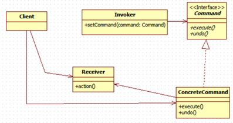

<h1>Command Pattern</h1>

<h2>예시 시나리오</h2>

* 식당을 예로 들어보자. 주문 과정은 아래와 같다.
  1. 고객이 직원에게 주문을 한다.
  2. 직원은 주문을 받아 카운터로 전달하고, 다시 주문을 받기를 대기한다.
  3. 주방장이 주문대로 음식을 준비한다.

* 위 과정을 메소드와 객체로 표현하자.
  1. `Customer`객체가 `createOrder()`를 호출한다.
  2. `Worker`객체는 `takeOrder()`로 주문을 받아 `Cashier`객체의 `orderUp()`을 호출하여 주문을 전달한다.
  3. `Chef`객체는 `makeBurger()`, `makeShake()`등을 수행하여 주문받은 음식을 만든다.

* 이제 이 과정을 고쳐 커맨트 패턴 다이어그램을 그려보자.
  1. `Client`는 `createCommandObject()`를 호출하여 `Command`객체를 생성한다. Command 객체는 Receiver에 전달할 일련의   
      행동으로 구성된다. `Command` 객체에는 행동과 `Receiver`에 대한 정보가 같이 들어 있다.
  2. 커맨드 객체에서 제공하는 메소드는 `execute()` 하나 뿐이다. 이 메소드는 행동을 캡슐화하며,   
      Receiver에 있는 특정 행동을 처리하기 위한 메소드를 호출하기 위한 메소드이다.
  3. 클라이언트에서는 `Invoker` 객체의 `setCommand()` 메소드를 호출하는데, 이 때 `Command`객체를 넘겨준다.   
      그 `Command`객체는 나중에 쓰이기 전까지 `Invoker`객체에 보관된다.
  4. `Invoker`에서 `Command#execute()`를 호출하면, `Receiver`에 있는 특정 행동을 하는 메소드가 알맞게 호출된다.

<h2>첫 번째 커맨드 객체</h2>

* `Command`객체는 모두 같은 인터페이스를 구현해야 한다. 그 인터페이스에는 메소드가 하나 밖에 없다.
```java
public interface Command {
    public void execute();
}
```

* 예시) 전등을 켜기 위한 커맨드 클래스 구현
```java
public class LightOnCommand implements Command {

    // Light에는 on(), off()가 존재한다.
    Light light;

    public LightOnCommand(Light light) {
        this.light = light;
    }

    @Override
    public void execute() {
        light.on();
    }
}
```

* 이제 커맨드 객체를 사용해보자.
```java
@Setter
public class SimpleRemoteControl {

    Command command;

    // 버튼이 눌렸을 때 커맨드 객체의 작동을 수행한다.
    public void buttonWasPressed() {
        slot.execute();
    }
}
```

* 이를 테스트하기 위한 코드는 매우 간단하다.
```java
public class RemoteControlTest {

    public static void main(String[] args) {
        SimpleRemoteControl control = new SimpleRemoteControl();
        Light light = new Light();
        LightOnCommand command = new LightOnCommand(light);

        control.setCommand(command);
        control.buttonWasPressed();
    }
}
```

* 위 클래스 구조에서 `SimpleRemoteControl`이 `Command`객체의 `execute()`를 호출하므로 `Invoker` 역할을 한다.   
  `execute()`에서 요청을 받아 처리하는 것은 `Light`이므로 `Light`가 `Receiver`의 역할을 한다.
<hr/>

<h2>Command Pattern</h2>

* 정의 : `Command Pattern`을 사용하면 요구 사항을 객체로 캡슐화 할 수 있으며, 매개변수를 써서 여러 가지 다른 요구 사항을   
  집어 넣을 수도 있다. 또한 요청 내역을 큐에 저장하거나 로그로 기록할 수도 있으며, 작업 취소 기능도 지원 가능하다.

* `Command`객체는 일련의 행동을 특정 `Receiver`와 연결시킴으로써 요구 사항을 캡슐화한다. 이렇게 하기 위해서 행동과 `Receiver`를   
  한 객체에 집어넣고, `execute()` 하나만 외부에 공개한다. 이 메소드의 호출에 의해 `Receiver`에서 일련의 작업이 처리된다.   
  외부에서 볼 때에는 어떤 객체가 `Receiver`역할을 하는지, 그 `Receiver`에서 실제로 어떤 작업을 수행하는지 알 수 없다.   
  단지 `execute()`가 호출되면 요구사항이 처리된다는 것만 알 뿐이다.

* 커맨드 패턴을 클래스 다이어그램으로 살펴보자.



<hr/>

<h2>커맨드 패턴의 구현</h2>