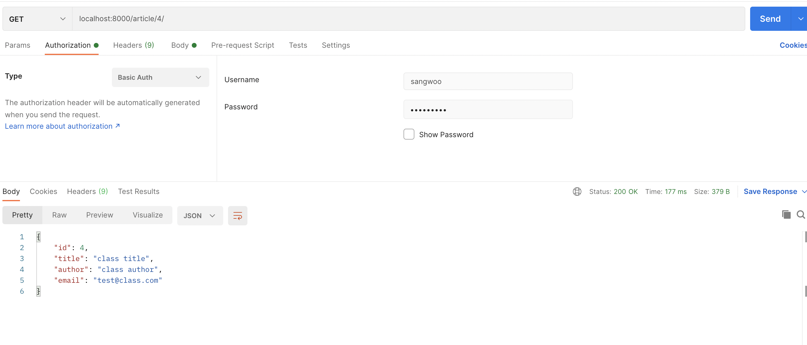

# Authentication

- 다른 백엔드 프레임워크와 마찬가지로, Authentication은 들어오는 요청(Request)에 대해서  
  인증 정보들을 토대로 해당 요청이 특정 리소스에 대해 조회, 수정, 삭제 등의 동작을 수행할 수 있는지  
  판별하는 과정이다.

- `djangorestframework`는 이미 제공되는 Authentication방식과, 개발자가 직접 생성한  
  인증 방식을 구현할 수 있도록 해준다.

- 요청에 대한 인증은 View의 가장 첫 번째부터 동작하며, 인증이 되고 나서야 서비스 코드가 동작한다.

- 인증 구현체를 사용하는 방법은 전역적(Global)으로 설정하는 방식과 View에 설정하는 방식이 있다.  
  전역적으로 설정하려면, `settings.py`에 설정하면 된다.

```py
# settings.py

# Other settings..

REST_FRAMEWORK = [
    'DEFAULT_AUTHENTICATION_CLASSES': [
        'rest_framework.authentication.BasicAuthentication',
        'rest_framework.authentication.SessionAuthentication'
    ]
]
```

- 여러 가지 방식 중 Class based API View에 적용하는 방법을 알아보자.

```py
# views.py

# Other import statements.
from rest_framework.authentication import SessionAuthentication, BasicAuthentication
from rest_framework.permissions import IsAuthenticated


class GenericAPIView(generics.GenericAPIView, mixins.ListModelMixin,
                     mixins.CreateModelMixin, mixins.UpdateModelMixin,
                     mixins.RetrieveModelMixin, mixins.DestroyModelMixin):
    serializer_class = ArticleModelSerializer
    queryset = Article.objects.all()
    lookup_field = 'id'
    authentication_classes = [SessionAuthentication, BasicAuthentication]
    permission_classes = [IsAuthenticated]

    def get(self, request, id=None):
        if id:
            return self.retrieve(request)
        else:
            return self.list(request)

    def post(self, request):
        return self.create(request)

    def put(self, request, id=None):
        return self.update(request, id)

    def delete(self, request, id=None):
        return self.destroy(request, id)
```

- authentication_classes에는 리스트의 형태로 인증에 사용되는 클래스들을 지정하면 되고,  
  permission_classes에는 인증에 대한 정보를 담는 클래스를 지정하면 된다.

* 위에서 보면, authentication_classes에 `SessionAuthentication`과 `BasicAuthentication`을  
  지정했는데, Django는 지정한 순서대로 인증을 진행한다. 각 인증 클래스에 대한 간략한 정보는 아래와 같다.

  - `SessionAuthentication` : Django의 session기본값을 인증에 사용한다.
  - `BasicAuthentication` : HTTP Basic Authentication 기능을 제공한다.

- 이 상태로 `GenericAPIView`가 사용되는 `/article/{id}/`에 대해 `GET` 요청을 보내면, 아래의 응답이  
  403(FORBIDDEN)과 함께 온다.

```json
{
  "detail": "Authentication credentials were not provided"
}
```

- `BasicAuthentication`은 username/password 기반의 인증 방식인데, 아래와 같이 인증 정보를 제공하고  
  요청을 보내면 응답이 제대로 오게 된다.



- `BasicAuthentication`은 요청 시 마다 username/password를 제공해야 하며,  
  `SessionAuthentication`은 AJAX 요청에 사용되는 것이 권장된다.  
  REST API의 본연을 제공하려면 `TokenAuthentication`을 사용하는 것이 가장 권장된다.

<hr/>

<h2>TokenAuthentication 적용하기</h2>

- `TokenAuthentication`을 사용해보자. 우선 Token은 데이터베이스에 저장된다고 하자.  
  이를 위해 `settings.py`의 `INSTALLED_APPS`에 `rest_framework.authtoken`을 추가해준다.

```py
# settings.py

# Other settings.

INSTALLED_APPS = [
    'django.contrib.admin',
    'django.contrib.auth',
    'django.contrib.contenttypes',
    'django.contrib.sessions',
    'django.contrib.messages',
    'django.contrib.staticfiles',
    'rest_framework',
    'rest_framework.authtoken',
    'api_basic'
]
```

- 그 다음 migration을 진행해주자.  
  이후 어드민 페이지에 가면, 아래와 같이 `AUTH TOKEN` 테이블이 생성된 것을 볼 수 있다.


- 어드민 페이지에서 `AUTH TOKEN`으로 이동해서 현재 존재하는 사용자(어드민)에 대한 토큰을 생성해주자.

* 마지막으로 `views.py`의 authentication_classes에 `TokenAuthentication`을 적용해주자.

* 이 인증 방식의 사용법은 Request의 Header에 토큰을 제공하는 것인데,  
  키 값은 `Authorization`이며 값은 `Token ${토큰 값}`이다.  
  정확한 토큰을 제공하고 요청을 보내면 성공적으로 정보를 받아오는 것을 확인할 수 있다.

<hr/>
