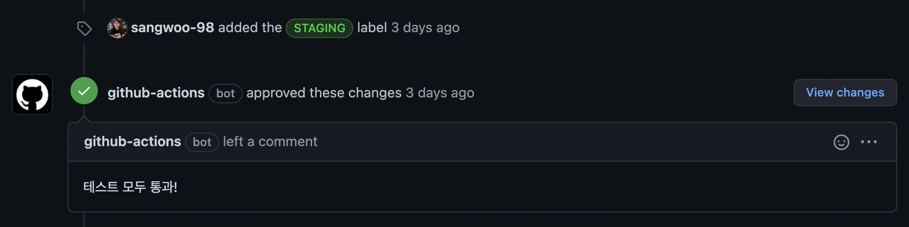
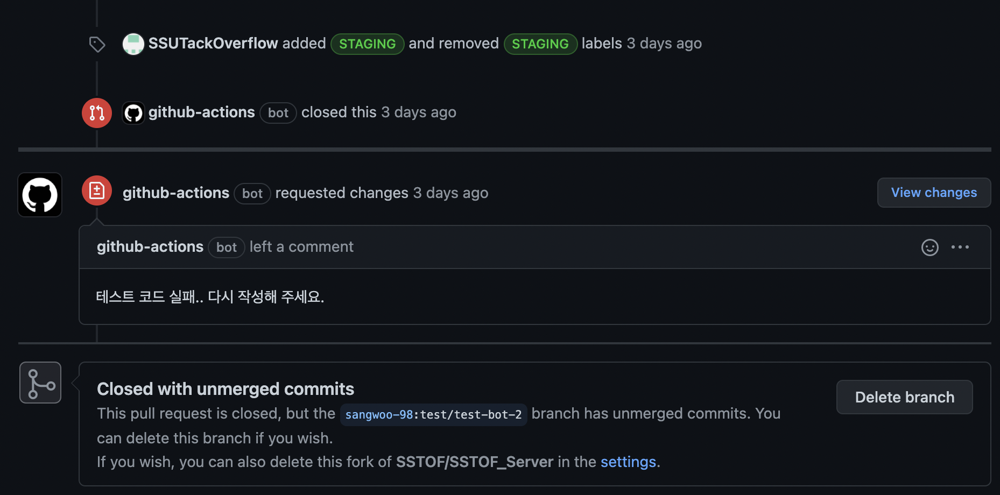

# Github Actions Bot 만들기

- 테스트 코드를 작성하여 배포할 때, 배포 전 테스트 코드가 모두 작동하는지 확인하고 배포하는 경우가 많다.  
  이때, 배포를 할 때(빌드) 마다 테스트 코드가 수행되어야 한다면 테스트 코드 수행이 마쳐지기를 기다려야 한다.  
  여기서 만약 PR이 생성되었을 때 바로 테스트 코드가 수행된다면 매우 편할 것이다.  
  테스트 코드가 PR이 생성되었을 때 수행되기에 직접 배포 브랜치에 push하지 않는 이상 테스트 단계는 빌드 단계에서 건너뛸 수 있게 된다.

- 참고로 이 예시는 JVM 환경에서 Java 또는 Kotlin 및 Gradle을 사용하여 개발한다고 가정한다.  
  테스트를 수행하는 명령어는 알맞게 수정하면 된다.

<hr/>

# 시작하기

- 우선 여느때와 마찬가지로 `.github/workflows` 폴더 하위에 yml 파일을 만들어 주자.  
  가장 먼저 이 workflow가 언제 수행될지를 지정해준다.

```yml
name: PullRequestGradleTest

on:
  pull_request_target:
    branches:
      - dev
    types:
      - labeled
```

- 나는 이 Workflow의 이름을 `PullRequestGradleTest`로 짓고, `pull_request_target` 이벤트가 dev 브랜치를  
  대상으로 발생했을 때 수행시킬 것이다.

- 다음으로 넘어가기 전에 `pull_request_target`에 조금 알아야 할 필요가 있다.  
  `pull_request_target`는 2020년 8월 경 기존에 있던 `pull_request` 이벤트를 대신하기 위해 소개되었다.  
  왜 소개되었는지의 배경에 대한 부분은 <a href="https://securitylab.github.com/research/github-actions-preventing-pwn-requests/">링크</a>에서 확인할 수 있다.

- 만약 `AA`라는 organization에 `AA`라는 레포지토리가 있다고 하자.  
  이를 fork한 사람이 `BB`라고 하고, fork한 레포지토리는 `BB/AA`에 있다고 하자.  
  만약 `BB`가 `BB/AA`에서 작업을 하고, `AA/AA`에 PR을 올리는 상황을 가정해보자.

- 이 상황에서 `pull_request`와 `pull_request_target`의 차이점이 드러난다.  
  `pull_request`를 통해 발생하는 액션은 **해당 PR이 merge되었을 때의 코드를 대상** 으로 수행된다.  
  하지만 `pull_request_target`은 **merge와 관계없이 merge되기 전의 코드를 대상** 으로 작업을 수행한다.

- 위와 같은 차이점으로 인해 아래와 같은 생각이 들었다.

  > 새로운 PR에 대해 검증을 하는 것이니 당연히 merge되었을 때의 코드를 대상으로 테스트가 수행되어야 하는거 아닌가?

- 따라서 당연히 `pull_request`를 선택했고, 액션을 수행했다.  
  이때, 테스트 코드가 성공하면 Github Actions Bot이 APPROVE Review를 남기고, 실패하면 REQUEST_CHANGES Review를  
  남기도록 하였더니, `403 : Resource not accessible by integration.`이라는 에러 로그가 출력되었다.

- 위에서 **Github Action Bot이 리뷰, 댓글 등을 남기는 작업** 을 하려면 Github Action이 수행되는 동안 사용되는  
  token을 발급받는데, `pull_request_target`이 등장하면서 `pull_request`를 통해 발급되는 token은  
  read-only 권한만을 가지게 되어서 문제가 되었다.

- 그렇다면 문제를 해결하는 방법은 `pull_request_target`을 사용하면서 테스트 코드가 PR이 merge되었을 때의 코드에서  
  수행되도록 해야하는 것이었다.

- 이를 위해 `actions@checkout`을 사용하여 해당 Github action이 수행될 커밋 위치를 아래와 같이 명시적으로 지정해주었다.

```yml
# ...

jobs:
  test:
    name: GradleTest
    runs-on: ubuntu-latest

    steps:
      - name: checkout
        uses: actions/checkout@v2
        with:
          ref: ${{ github.event.pull_request.head.ref }}
          repository: ${{github.event.pull_request.head.repo.full_name }}
```

- fork된 상황을 가정했기에 `actions/checkout@v2`가 수행되는 위치에 ref 뿐만 아니라 repository까지 지정해주었다.
<hr/>

# 마무리

- 완성된 전체 yml 파일은 아래와 같다.

```yml
name: PullRequestGradleTest

on:
  pull_request_target:
    branches:
      - dev
    types:
      - labeled

jobs:
  test:
    name: GradleTest
    runs-on: ubuntu-latest
    if: contains(github.event.pull_request.labels.*.name, 'STAGING')

    steps:
      - name: checkout
        uses: actions/checkout@v2
        with:
          ref: ${{ github.event.pull_request.head.ref }}
          repository: ${{github.event.pull_request.head.repo.full_name }}

      - name: Setup JDK 1.8
        uses: actions/setup-java@v2
        with:
          java-version: "8"
          distribution: "adopt"

      - name: Grant Permissions to gradlew
        run: chmod +x gradlew
      - name: Test
        run: ./gradlew test

      - name: Test Success
        if: success()
        uses: actions/github-script@0.2.0
        with:
          github-token: ${{ github.token }}
          script: |
            const pull_number = "${{github.event.number}}"
            await github.pulls.createReview({
              ...context.repo,
              pull_number,
              body: "테스트 모두 통과!",
              event: "APPROVE"
            })
      - name: Test Fail
        if: failure()
        uses: actions/github-script@0.2.0
        with:
          github-token: ${{ github.token }}
          script: |
            const pull_number = "${{github.event.number}}"
            await github.pulls.createReview({
              ...context.repo,
              pull_number,
              body: "테스트 코드 실패.. 다시 작성해 주세요.",
             event: "REQUEST_CHANGES"
            })
            await github.pulls.update({
              ...context.repo,
              pull_number,
              state: "closed"
            })
```

- 우선 이 workflow는 PR이 내가 만든 `STAGING` label이 적용되어야 수행되도록 했다.  
  그리고 `actions/setup-java@v2`를 사용하여 간편하게 action이 동작될 VM에 java 설정을  
  간편하게 수행해주었다.

- 테스트를 수행하는 부분은 `./gradlew test`이며, 만약 이 테스트가 성공한다면  
  Github Action Bot은 "테스트 모두 통과"라는 댓글과 함께 PR을 APPROVE할 것이고,  
  실패한다면 "테스트 코드 실패.. 다시 작성해 주세요."라는 댓글과 함께 REQUEST CHANGES를 하며  
  해당 PR을 closed 처리할 것이다.

- 성공 시



- 실패 시



<hr/>
