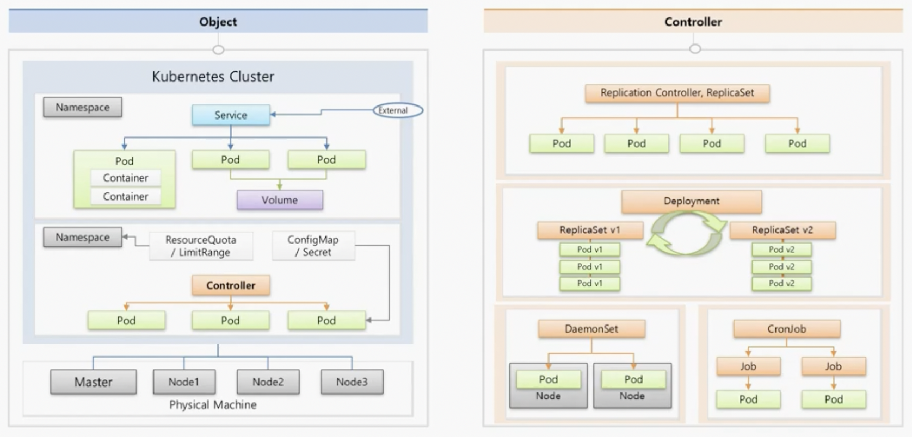

# Kubernetes Concepts

## Why Kubernetes?

- 어떤 서비스든 원활하게 유지되기 위해선 충분한 서버 자원들이 뒷받침되어야 한다.  
  온프레미스 환경에서는 특정 시간대에만 트래픽이 집중되는 현상, 또는 메인 서버가  
  장애가 날 때 조치하기 위한 서버를 따로 두는 등 서버 자원의 관리가 쉽지 않다.

- 하지만 클라우드 환경에서 Kubernetes를 사용하면 위의 문제들이 Kubernetes가  
  제공하는 Auto Scaling, Auto Healing 등의 기능으로 모두 해결된다.

- 즉 인프라를 조금 더 유연하게, 비용 효율적으로, 그리고 안전하고 편리하게 관리하기  
  위해 Kubernetes를 사용하게 되는 것이다.

## VM(Virtual Machine) vs Container

- 우선 둘 다 하나의 서버(Host Server)가 있고, 그 위에 Host OS가 올라간다.  
  이때 VM의 경우, 이 Host OS 위에 VM을 가상화시켜주기 위해 Virtual Box,  
  VMWare 등 Hypervisor가 있다. 이 Hypervisor를 사용해서 Host OS 위에  
  다른 여러 가상 머신 들을 실행할 수 있는 구조이다.

- 반면 컨테이너의 경우, VM과 Host OS가 있다는 점 까지는 동일하지만 Hypervisor대신  
  컨테이너 가상화를 해주는 docker, rkt, LXC 등 여러 가지 소프트웨어가 있다.  
  예를 들어, Docker라하면 Docker는 Container를 만들어주게 되는데, Container는  
  하나의 Image를 실행시키는 곳이다. Image에는 하나의 서비스와 그 서비스가 작동하기 위해  
  필요한 라이브러리들이 함께 들어 있다.

- Docker를 조금 더 보자. Docker는 여러 컨테이너들 간에 Host 자원을 분리해서 쓰도록  
  해주는데, 커널에 관련된 영역을 분리해주는 namespace, 자원에 대한 영역을 분리해주는  
  cgroup이 있다.

- 정리하자면, Docker와 같은 컨테이너 가상화 솔루션들은 OS에서 제공하는 자원 격리 기술을  
  이용해서 컨테이너라는 단위로 서비스를 분리할 수 있게 만들어준다. 이를 사용하면 컨테이너  
  가상화가 가능한 OS에서는 개발 환경, 배포 환경에 대한 걱정 없이 서비스 배포가 가능하게 된다.

- 다시 VM 과 Container의 비교로 돌아와서, 시스템 구조적으로 Container는 하나의 OS를  
  공유하는 개념이며 VM은 각각의 OS를 띄워야하기에 Container가 서비스 구동에 훨씬  
  빠를 수 밖에 없다. Container가 가지는 단점이라면, VM 의 경우에는 Host OS가 Windows라  
  하면 새로운 Guest OS를 설치할 때 Linux를 설치해 사용할 수 있다. 반면, Container는  
  Linux용 OS에서 Windows용 Container를 사용할 수 없다. 또한 보안적으로 VM의 경우에는  
  하나의 Guest OS가 해킹당해도 다른 Guest OS 또는 Host OS와 완벽히 분리되어 있기 때문에  
  각각의 VM 끼리 피해가 전이되지 않음이 보장되는데, 컨테이너의 경우 하나의 컨테이너가 해킹당해  
  OS 영역에 대한 접근이 가능해지면 다른 컨테이너들도 위험해질 수 있다.

- 시스템 개발 사상 측면에서의 차이점을 알아보자. 일반적으로 하나의 서비스는 하나의 언어를 사용해  
  여러 모듈들이 하나의 서비스로 같이 작동하게 만든다. 예를 들어, 하나의 서비스에 각각의 역할이  
  잘 분리된 세 개의 모듈 A, B, C가 있다 해보자. 그리고 모듈 C만 부하가 많이 나는 상황이라 해보자.  
  VM의 경우에는 부하를 분산하기 위해 VM을 하나 더 생성해서 띄우게 된다. 그렇게 되면 Guest OS가  
  2개 올라가게 되며, 모듈 A, B는 사실상 확장할 필요가 없음에도 불구하고 함께 올라가게 된다.

- 반면 컨테이너의 경우, 위 모듈 A, B, C를 각각 하나의 컨테이너가 담당하는 마이크로서비스로  
  분리할 수 있다. 컨테이너는 하나의 서비스를 만들 때 모듈별로 쪼개서 각각의 컨테이너로 만들 것을  
  권한다. 또한 이렇게 되면 각 모듈의 기능에 최적화된 언어를 각자 정해 사용할 수도 있다.

- 여기서 Kubernetes는 하나 이상의 컨테이너들을 **Pod** 라는 단위로 묶을 수 있고, 이 Pod는  
  서비스의 배포 단위가 된다. 이렇게 Pod로 컨테이너들을 구분지어 놓으면 필요한 Pod만  
  Scale out 하는 등의 여러 기능을 사용할 수 있다.

- 이렇게 컨테이너는 하나의 거대한 서비스를 모듈별로 쪼개 개발했을 때 큰 효과를 발휘할 수 있다.

## Overview

- Kubernetes의 기능들에 대해 전반적으로 훑어보자.

### Master, Node, Cluster, Pod

- Kubernetes는 서버 한대는 Master로 쓰고, 다른 서버들은 Node라고 한다.  
  한 Master에는 여러 Node들이 연결된다. 이렇게 연결되면 이를 하나의 Cluster라 한다.

- Master는 Kubernetes의 전반적인 기능들을 제어하는 역할을 하며, Node는 자원을 제공하는  
  역할을 담당하는데, 예를 들어 만약 Cluster의 자원들을 늘리고 싶다면 Node들을 계속 추가하면 된다.

- 또한 Cluster 내에는 Namespace들이 있는데, Namespace는 Kubernetes Object들을  
  독립된 공간으로 분리되게 만들어준다. Namespace안에는 Kubernetes의 최소 단위인 Pod들이  
  있으며 이 Pod들에게 외부로부터 연결이 가능하도록 IP를 할당해주는 Service가 있어서 외부  
  통신이 가능하게 해준다. 이때, 서로 다른 Namespace내에 있는 Pod들끼리는 서로 연결할 수 없다.  
  하나의 Pod안에는 여러 개의 Container들이 있다. Container 하나당 하나의 애플리케이션이  
  구동되기 때문에 결국 하나의 Pod에는 여러 애플리케이션이 동작할 수 있게 된다.

- 그런데, Pod에 문제가 생겨 재생성되면 그 안에 있던 기존 데이터들이 모두 사라진다. 이를 방지하기 위해  
  Volume을 Pod에 연결해 Pod가 사용하는 데이터들을 Volume에 저장하도록 해야 한다.

- 또한 Namespace에는 ResourceQuota, LimitRange 등의 속성을 지정하여 하나의 Namespace에서  
  사용할 자원의 양을 제한할 수 있다. 해당 Namespace의 Pod 개수, CPU 차지량, 메모리 등을 제한시킬 수 있다.

- Pod 생성시에는 Container에 환경 변수 값을 넣어주거나 파일을 마운팅해줄 수 있는데, 이는  
  Pod의 ConfigMap, Secret 속성을 통해 할 수 있다.

### Controller

- Controller는 여러 Pod들을 관리해주는 역할을 담당한다.  
  Controller는 종류가 매우 많으며, 각각 다른 상황에 알맞게 사용해야 한다.

#### Replication Controller, ReplicaSet

- 가장 기본적인 `Controller`는 `Replication Controller`, `ReplicaSet`이다.  
  이들은 `Pod`가 죽으면 다시 생성해준다든지, `Pod`의 개수를 늘리거나 줄이는 Scale Out, Scale In 등을  
  수행할 수 있다.

#### Deployment

- `Deployment`는 배포 후에 `Pod`들을 새로운 버전으로 업그레이드 해주고, 업그레이드 도중  
  문제가 생기면 쉽게 rollback을 하도록 도와준다.

#### DaemonSet

- `DaemonSet`은 하나의 `Node`에 `Pod`가 단 한개씩만 유지되도록 한다.  
  이렇게 사용해야만 하는 모듈들이 있는데, 이들에 대해 사용하면 좋다.

#### Job, CronJob

- `Job`은 어떤 특정 작업만 하고 종료시켜야할 때 `Pod`가 그렇게 동작하게끔 해준다.  
  이러한 `Job`들을 주기적으로 실행해야 할 때는 `CronJob`을 사용한다.

