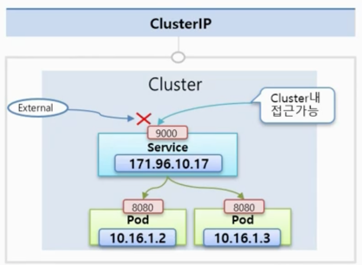
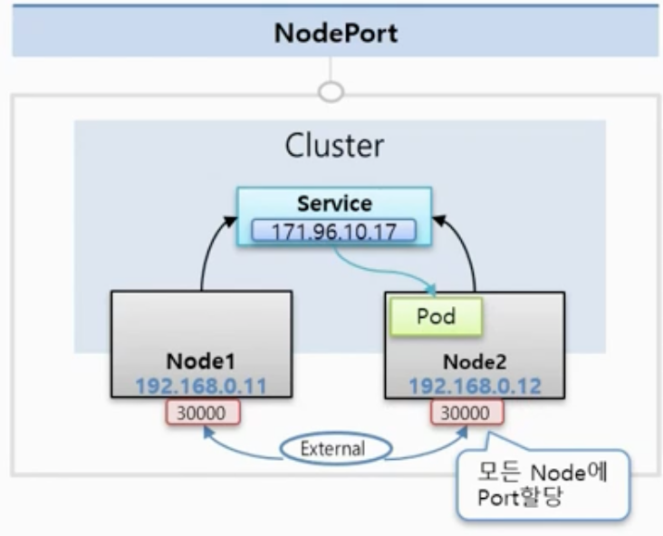
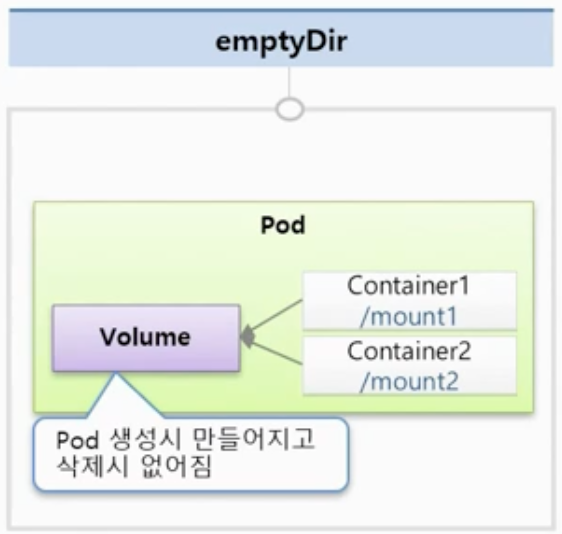
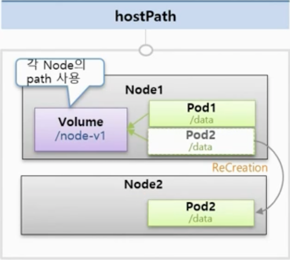
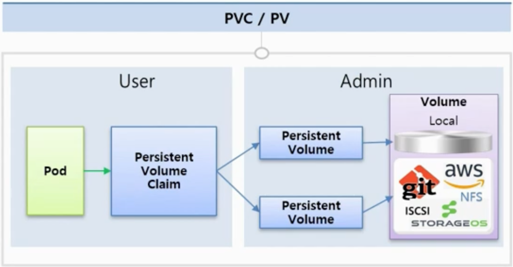

# 기본 오브젝트

## Pod - Container, Label, NodeSchedule

### Container

- `Pod` 안에는 하나의 독립적인 서비스들을 구성할 수 있는 `Container`들이 있으며, 그 컨테이너들은 각각  
  서비스가 연결될 수 있도록 포트를 갖고 있다. 하나의 컨테이너가 두 개 이상의 포트를 가질 수는 있지만,  
  하나의 `Pod`내의 `Container`들이 동일한 포트 번호를 사용할 수는 없다. 즉, **하나의 `Pod` 내에서**  
  **포트 번호는 중복될 수 없다.** 예를 들어, 하나의 `Pod`내에 Container1, Container2가 있다 하자.  
  Container1의 포트는 8000, Container2의 포트는 8080이다. 이러면 Container1에서는 `localhost:8080`으로  
  Container2에 접근할 수 있다.

- `Pod`가 생성될 때 각 `Pod`에는 고유한 IP 주소가 할당된다. 예를 들어, `10.16.36.22`가 할당되었다고 해보자.  
  이 IP는 **K8s `Cluster` 내에서만 유효하다.** 즉, 외부에서는 이 IP로 접근할 수 없다. 또한 `Pod`에 문제가 생기면  
  시스템이 이를 감지하고 해당 `Pod`를 재생성하게 되는데, 할당된 IP는 재생성 시 변경된다. 따라서 이 IP는 휘발성이 있다.  
  아래 파일을 보자.

```yml
apiVersion: v1
kind: Pod
metadata:
  name: pod-1
spec:
  containers:
    - name: container1
    - image: image/p8000
      ports:
        - containerPort: 8000
    - name: container2
    - image: image/p8080
      ports:
	- containerPort: 8080
```

- 위 yml 파일은 pod-1이라는 이름을 가진 `Pod`를 만들며, 8000번 포트를 가진 Container1과 8080번 포트를 가진  
  Container2라는 두 개의 `Container`를 만든다.

### Label

- `Label`은 `Pod` 뿐만 아니라, 모든 `Object`에 적용할 수 있는데, 주로 `Pod`에서 가장 많이 사용한다.  
  `Label`을 사용하는 이유는 목적에 따라 `Object`들을 분류하고, 분류된 `Object`들끼리만 골라 연결하기 위함이다.

- `Label`은 `Key: Value` 형식으로 구성되며 하나의 `Pod`에는 여러 개의 `Label`을 달 수 있다.


- 위와 같이 `Label`이 구성되어 있다고 하자. `type:web`, `type:db`, `type:server`의 `Label`이 있으며,  
  각각 개발 환경(`lo:dev`)과 상용 환경(`lo:production`)에 있다.

- 만약 이러한 상황에서 웹 개발자가 _웹 화면반 보고 싶다_ 라 한다면, `type:web`의 `Label`을 가진 `Pod`들을  
  `Service`에 연결해서 이 `Service`의 정보를 알려주면 된다. 같은 원리로 _상용 환경을 담당하는 운영자_ 에게는  
  `lo:production`의 `Label`을 가지는 `Pod`들을 `Service`에 연결해서 이 `Service`의 정보를 알려주면 된다.

- 이렇게 사용 목적에 따라 `Label`을 등록하면, 경우에 따라 원하는 `Pod`만 사용할 수 있다.

```yml
apiVersion: v1
kind: Pod
metadata:
  name: pod-2
  labels:
    type: web
    lo: dev
spec:
  containers:
    - name: container
    - image: image/init
```

- 위 yml 파일 처럼 `Pod`를 만들 때 lables에 key-value 쌍으로 `Label`을 지정할 수 있으며,  
  추후 `Service`를 만들 때는 아래 yml 파일처럼 특정 `Label`을 가진 `Pod`들을 가져와 생성할 수 있다.  
  (아래 파일에는 `type:web`의 `Label`을 가지는 `Pod`들을 선택해 `Service`를 만든다.)

```yml
apiVersion: v1
kind: Service
metadata:
  name: service-1
spec:
  selector:
    type: web
  ports:
    - port: 8080
```

### Node Schedule

- `Pod`는 결국 여러 `Node`들 중에서 한 `Node`에 올라가져야 한다. 이 방법에 대해서, 운영자가 직접 `Node`를  
  선택하는 방법과 K8S가 자동으로 지정해주는 방법이 있다.

#### Node 직접 선택하기

- 이전에 `Pod`에 `Label`을 단 것처럼 `Node`에 `Label`을 달고, `Pod`를 만들 때 `Node`를 지정할 수 있다.  
  아래 파일 내용을 보자.

```yml
apiVersion: v1
kind: Pod
metadata:
  name: pod-3
spec:
  nodeSelector:
    hostname: node1
  containers:
    - name: container
      image: image/init
```

#### K8S의 Scheduler가 판단해 지정해주기

- `Node`에는 전체 사용 가능한 자원량이 있다. 대표적으로 메모리의 CPU를 생각해보자.  
  만약 Node1에 2개의 `Pod`가 들어가 있어서 남은 메모리가 1GB이고, Node2에는 아무런 `Pod`가 없어  
  사용 가능한 메모리가 3.7GB 라 해보자.

- 위 상황에서 2GB의 메모리가 필요한 `Pod`를 만들어야 한다 해보자. 이때, K8S가 알아서 더 여유 메모리가 많은  
  `Node`인 Node2로 스케쥴링 해준다.

- 참고로 `Pod`에 메모리 사용량을 명시해주는 이유는, 만약 `Pod`가 사용할 메모리량이 명시되어 있지 않다면 `Pod`내의  
  서비스에서 부하가 생길 때 소속된 `Node`의 자원을 무한정 사용하려 할 것이며, 이렇게 되면 해당 `Node`에 있는 다른  
  `Pod`들은 자원이 없어서 결국 모두 죽게 된다.

```yml
apiVersion: v1
kind: Pod
metadata:
  name: pod-4
spec:
  containers:
    - name: container
      image: image/init
      resources:
        requests:
	  memory: 2Gi
	limits:
	  memory: 3Gi
```

- `Pod`를 만드는 위의 yml 파일은 해당 `Pod`가 2Gi의 메모리를 요구하며, 최대 3Gi의 메모리를 허용한다는 내용을  
  담고 있다. limits에 대해 조금 더 살펴보자.

  - memory: 초과시 해당 `Pod`가 종료된다.
  - cpu: 초과시 request로 낮춘다. Over 시 종료되지 않는다.

<hr/>

## Service - ClusterIP, NodePort, LoadBalancer

- `Service`는 Cluster 내에서 기본적으로 자신의 Cluster IP를 갖고 있다. 그리고 `Service`를 `Pod`에  
  연결시켜 놓으면 `Service`의 IP를 통해서도 `Pod`에 접근할 수 있게 된다. 하지만 `Pod`에도 똑같이 `Cluster`  
  내에서 접근할 수 있는 IP가 있다. 그럼 왜 굳이 `Service`를 달아서 `Service`의 IP를 통해 접근할까?

- 그 이유는 `Pod`는 K8S에서 시스템 장애, 성능 장애 등의 이유로 언제든지 죽을 수가 있고, 그럴 경우 재생성될 수 있는  
  오브젝트이기 때문이다. `Pod`의 IP는 재생성되면 변경되므로 `Pod`의 IP는 신뢰성이 떨어진다.  
  하지만 `Service`는 사용자가 직접 지우지 않는 한 삭제되거나 재생성되지 않는다. 그래서 `Service`의 IP로 접근하면  
  항상 해당 `Service`에 연결되어 있는 `Pod`에 접근할 수 있다.

### ClusterIP

- `Service`에는 여러 종류가 있는데, 종류 별로 `Pod`에 대한 접근을 지원하는 방식이 다르다.  
  그중 가장 기본적인 방식은 `ClusterIP` 방식이다. `ClusterIP` 방식의 `Service`에 부여되는 IP는  
  `Pod`에 부여되는 IP와 마찬가지로 `Cluster` 내의 모든 오브젝트는 접근할 수 있지만, 외부에서는 접근할 수 없다.

- `Service`를 만드는 yml 파일을 보자.

```yml
apiVersion: v1
kind: Service
metadata:
  name: service-1
spec:
  selector:
    app: pod
  ports:
    - port: 9000
      targetPort: 8080
  type: ClusterIP # 기본값: ClusterIP
```

- 위 파일의 내용은 9000번 포트로 `Service` IP로 요청이 오면, `Pod`의 8080번 포트로 연결된다는 뜻이다.  
  `Pod`의 yml도 보자. 8080번 포트를 사용한다.

```yml
apiVersion: v1
kind: Pod
metadata:
  name: pod-1
  labels:
    app: pod
spec:
  containers:
    - name: container
      image: image/app
      ports:
        - containerPort: 8080
```



### NodePort

- `NodePort` 타입의 `Service`를 만들어도, `Service`에는 Cluster IP가 할당되어 `ClusterIP` 타입의  
  `Service`의 기능이 포함되어 있다.

- `NodePort`만의 큰 특징은 K8S Cluster 내에 할당되어 있는 모든 `Node`에 동일한 포트 번호가 할당되어  
  외부로부터 어떤 `Node`건 간에 해당 `Node`의 IP와 포트로 접속을 하면 `Service`에 연결된다.  
  그럼 `Service`는 자신에게 연결되어 있는 적절한 `Pod`에게 트래픽을 전달해준다.

- 주의할 점은 `Pod`가 있는 `Node`에게만 포트가 할당되는 것이 아니라, **모든 `Node`에 포트가 할당된다.**  
  yml 내용을 보자.

```yml
apiVersion: v1
kind: Service
metadata:
  name: service-2
spec:
  selector:
    app: pod
  ports:
    - port: 9000
      targetPort: 8080
      nodePort: 30000
  type: NodePort
```

> spec.ports.nodePort는 Optional 한 속성이며, 값을 주지 않으면 30000~32767번 사이의  
> 임의의 값이 `Node`의 포트로 할당된다.

- 한 가지 특징을 더 보자.  
  Node1 `Node`에 이름이 Pod1인 `Pod`가 있고, Node2 `Node`에 이름이 Pod2인 `Pod`가 있다 하자.  
  이 상태에서 외부에서 Node1의 IP로 접근하더라도 `Service`는 Node2에 있는 `Pod`에게 트래픽을 전달할 수 있다.  
  **`Service`의 입장에서는 어떤 `Node`로부터 온 트래픽인지 관계없이 알맞은 `Pod`를 찾아 트래픽을 전달하기 때문이다.**  
  그런데, 만약 yml 파일에 `externalTrafficPolicy: Local` 속성을 지정하면 특정 `Node`의 IP를 통해 들어온  
  트래픽을 `Service`는 해당 `Node` 내의 `Pod`에게만 전달할 수 있다. 즉, Node1의 IP를 타고 들어온 트래픽을  
  `Service`가 Node2 내의 `Pod`에게 전달할 수 없다는 뜻이다.



### Load Balancer

- `Load Balancer` 타입으로 `Service`를 만들면 기본적으로는 `NodePort`의 성격을 그대로 갖고 있다.  
  추가적으로 `Load Balancer`가 생겨서, 해당 `Load Balancer`의 IP로 트래픽이 들어오면, `Load Balancer`가  
  트래픽을 분산시켜준다.

- 참고로 `Load Balancer`에 접근하기 위한 외부 접속 IP 주소는 기본적으로 생기지 않는다.  
  별도로 외부 접속 IP를 할당해주는 플러그인을 설치해야 할당받을 수 있다.

```yml
apiVersion: v1
kind: Service
metadata:
  name: service-3
spec:
  selector:
    app: pod
  ports:
    - port: 9000
      targetPort: 8080
  type: LoadBalancer
```

### 정리

- 이제 각각의 서비스 타입을 어떤 상황에 사용해야 하는지 알아보자.

#### ClusterIP

- 외부에서는 접근할 수 없고, `Cluster` 내에서만 사용하는 IP이다. 따라서 이 IP에 접근할 수 있는 주체는  
  인가된 사용자(운영자 등)일 수밖에 없으며 주로 내부 dashboard를 관리하거나, `Pod`의 서비스 상태를  
  디버깅할 때 사용한다.

#### NodePort

- `NodePort`의 특징은 `Node`의 IP를 통해 `Service`에 접근하고, 결국 `Pod`에도 접근할 수 있다는  
  점인데, 대부분 `Node`의 IP는 보안적으로 내부망에서만 접근할 수 있도록 네트워크를 구성하기 때문에  
  `Cluster` 밖에 있지만, 그래도 내부망에서 접근할 때만 쓰인다. 또한 일시적으로 외부 연동 용으로도 사용한다.

#### Load Balancer

- 실제로 외부에 `Service`를 노출시키기 위해 사용하는 타입이다. 그래야 내부 IP가 노출되지 않고 외부 IP를  
  통해 안정적으로 서비스를 노출시킬 수 있다. 따라서 `Load Balancer`는 외부에 시스템을 노출하는 용도로 쓰인다.

<hr/>

## Volume - emptyDir, hostPath, PV/PVC

### emptyDir

- emptyDir은 컨테이너들끼리 데이터를 공유하기 위해 `Volume`을 사용하는 것이며 최초로 이 `Volume`이  
  생성될 때 아무런 데이터도 없이 비어있기 때문에 emptyDir이라는 이름이 생겼다. Container1과 Container2가  
  하나의 `Volume`에 연결되어 있고, Container1은 웹을, Container2는 백엔드 단을 처리한다 해보자.  
  그러면 Container1이 웹을 통해 받은 어떤 파일을 mount된 `Volume`에 저장해 놓고, 백엔드 단에 있는  
  Container2 역시 이 `Volume`을 mount해놓으면 Container1과 Container2가 마치 이 `Volume`을  
  자신의 로컬에 있는 파일처럼 사용하기에 두 컨테이너가 굳이 파일을 주고받을 필요 없이 편리하게 사용할 수 있다.

- 또한 이 `Volume`은 `Pod` 안에 생성되기 때문에 `Pod`가 문제가 발생해 재생성되면 `Volume` 역시  
  삭제되고, 생성 시 새롭게 다시 만들어진다. 따라서 이 `Volume`에는 꼭 일시적 사용 목적을 가진 데이터들만  
  넣는게 좋다.

```yml
apiVersion: v1
kind: Pod
metadata:
  name: pod-volume-1
spec:
  containers:
    - name: container1
      image: image/init
      volumeMounts:
        - name: empty-dir
          mountPath: /mount1
    - name: container2
      image: image/init
      volumeMounts:
        - name: empty-dir
          mountPath: /mount2
  volumes:
    - name: empty-dir
      emptyDir: {}
```

- 위 yml 파일에는 두 개의 `Container`가 있으며, 둘 다 `Volume`을 mount하고 있다.(volumeMounts)  
  mount한 위치를 보면 Container1은 `/mount1`에, Container2는 `/mount2`에 mount 했다.  
  이때, volumeMounts.name에서는 똑같은 `Volume`의 이름을 지정하고 있기 때문에 `Container`마다 자신이  
  원하는 위치에 `Volume`을 mount하지만, 결국 하나의 `Volume`을 mount하는 것이다.



### hostPath

- hostPath는 이름 그대로 하나의 Host, 즉 `Pod`들이 올라가져 있는 `Node`의 path를 `Volume`으로써  
  사용하는 것인데, emptyDir과 다른점은 `Node`의 path를 각각의 `Pod`들이 mount한 후 공유하기 때문에  
  `Pod`들이 죽어도 `Node`에 있는 데이터들은 사라지지 않는다. 나름 좋아보일 수 있지만, `Pod` 입장에서 보면  
  한 가지 큰 문제점이 있다.

- 바로 **`Pod`가 죽었을 때, 꼭 다시 죽은 `Node`에서 재생성 될 것이라는 보장이 없다는 점** 이다.  
  만약 기존에 Node1에 있던 `Pod`가 죽어 재생성될 때 스케쥴러가 자원 상황을 보고 Node1가 아닌 Node2에  
  재생성시킨다면, `Volume`은 Node1에 있기에 `Volume`을 mount할 수 없게 된다.

- 이를 위한 해결책으로 새로운 `Node`가 추가될 때마다 똑같은 이름의 경로를 만들어서 직접 `Node`에 있는  
  path끼리 mount를 시켜주면 된다. 이렇게 구성하는게 어렵지는 않지만, K8S가 제공하는 기능이 아니며  
  운영자가 직접 구현해야 한다. 이는 자동화가 아닌 사람이 하는 작업이라 human fault가 일어날 여지가 많다.

- 그럼 이 hostPath는 어떨 때 사용해야 할까? 각각의 `Node`에는 기본적으로 각 `Node` 자신을 위해서  
  사용되는 파일들이 있다. 시스템 파일들, 또는 여러 설정 파일들이 있을 수 있다.  
  `Pod` 자신이 할당되어 있는 host, 즉 `Node`에 데이터를 읽거나 써야할 때 사용하면 된다.

```yml
apiVersion: v1
kind: Pod
metadata:
  name: pod-volume-2
spec:
  containers:
    - name: container
      image: image/init
      volumeMounts:
        - name: host-path
          mountPath: /mount1
  volumes:
    - name: host-path
      hostPath:
        path: /node-v
        type: Directory
```

- 한 가지 주의점으로는 volumes.hostPath.path에 명시된 path는 `Pod`가 만들어지기 전에  
  이미 있어야 한다. 그렇지 않으면 `Pod` 생성 시 에러가 발생한다.



### PV/PVC(Persistent Volume / Persistent Volume Claim)

- PV, PVC는 `Pod`에 영속성 있는 `Volume`을 제공하기 위한 개념이다.  
  즉 `Volume`안에 git, aws가 제공하는 서비스 등을 연결해 사용할 수 있다.  
  이때 `Pod`는 `PV`와 직접적으로 연결하지 않고, `PVC`를 통해 `PV`와 연결하게 된다.  
  직접 `PV`에 연결하지 않는 이유를 보자.

- K8S는 `Volume`의 사용에 있어 User와 Admin의 두 개 영역을 분리한다.  
  Admin은 K8S를 담당하는 K8S 운영자가 되며, User는 `Pod`에 서비스를 만들고, 배포를 담당하는  
  서비스 담당자이다. `Volume`안에는 위에서 봤듯이 여러 서비스를 둘 수 있으며, 서비스마다 각각  
  설정 방법도 다르다. 예시를 보자.

```yml
apiVersion: v1
kind: PersistentVolume
metadata:
  name: pv-01
spec:
  nfs:
    server: 192.168.0.xx
    path: /sda/data
  iscsi:
    targetPortal: 163.xx.xx.xx
    iqn: iqn.200.qnap:...
    lun: 0
    fsType: ext4
    readOnly: no
    chapAuthSession: true
  gitRepo:
    repository: github.com/..
    revision: master
    directory: .
```

- 위 파일을 보고 알 수 있듯이 정말 설정값들이 모두 다르다.  
  이렇게 `PV`를 전문적으로 관리하는 Admin이 `PV`를 만들어 놓으면 User는 이를 사용하기 위해 `PVC`를  
  만들어야 하는데, `PVC`를 만들기 위한 파일을 보자.

```yml
apiVersion: v1
kind: PersistentVolumeClaim
metadata:
  name: pvc-01
spec:
  accessModes:
    - ReadWriteOnce
  resources:
    requests:
      storage: 1Gi
  storageClassName: ""
```

- 위 파일을 보면 읽기 및 쓰기가 되며 용량이 1Gi인 볼륨을 할당해달라고 요청한다.

- 마지막으로 `Pod`를 만드는 부분을 보자.

```yml
apiVersion: v1
kind: Pod
metadata:
  name: pod-volume-3
spec:
  containers:
    - name: container
      image: image/init
      volumeMounts:
        - name: pvc-pv
          mountPath: /volume
  volumes:
    - name: pvc-pv
      persistentVolumeClaim:
        claimName: pvc-01
```

- volumes.persistentVolumeClaim.claimName 부분을 보면 앞서 만든 `PVC` 이름을 넣는 것을 볼 수 있다.

- 정리하자면 Admin이 `PV`를 정의하면 User가 `PVC`를 만들고, 그렇게 되면 K8S가 `PVC` 내용에 맞는 적절한  
  `PV`로 연결을 해준다. 그리고나서 `Pod`를 만들 때 이 `PVC`를 사용하면 된다.



<hr/>
