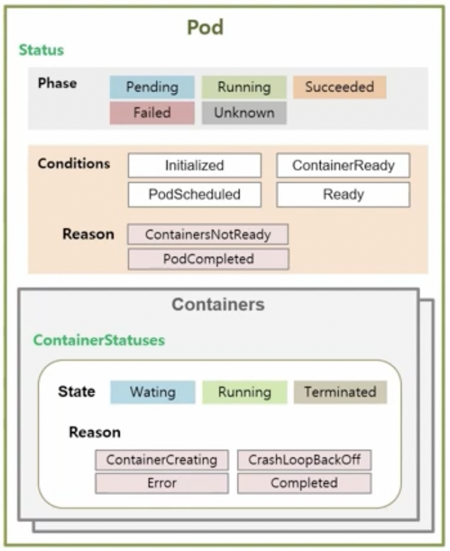
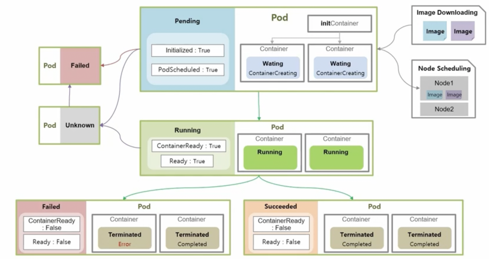

# Pod

## Pod Lifecycle

- `Pod`에도 생명주기(Lifecycle)이 존재하며, 생성되는 시점부터 소멸되는 시점까지의 과정이 있다.  
  이런 생명주기의 특징은 각 단계마다 수행되는 동작들이 모두 다르다는 점이다.

- `Pod`를 생성한 후, 내용을 보면 status라는 항목이 있다. 이 항목의 내용들은 아래와 같다.

```yml
status:
  phase: Pending
  conditions:
  - type: Initialized
    status: 'True'
    lastProbeTime: null
    lastTransitionTime: '2021-11-08T09:51:43Z'

  ####

  - type: PodScheduled
    status: 'True'
    lastProbeTime: null
    lastTransitionTime: '2021-11-08T09:51:43Z'

  ####
  - type: ContainersReady
    status: 'False'
    lastProbeTime: null
    lastTransitionTime: '2021-11-08T09:51:43Z'
    reason: ContainersNotReady

 ####
 - type: Ready
   status: 'False'
   lastProbeTime: null
   lastTransitionTime: '2021-11-08T09:51:43Z'
   reason: ContainersNotReady
```

- 이 내용을 하나씩 알아보자.  
  `Pod`가 있고, 그 안에 `Status`가 있다. 이 `Status`안에는 `Pod`의 전체 속성을 대표하는 `Phase`라는 속성이 있다.  
  또한 `Pod`가 생성되면서 실행되는 단계들이 있는데, 그 단계들의 상태를 알려주는 `Conditions`라는 속성도 `Status`내에 있다.

- `Pod` 안에는 하나 이상의 `Container`들이 있다. 이 각각의 `Container` 내에는 해당 컨테이너의 상태를 나타내는 `State`가 있다.

### Phase

- `Status`내에 있고 `Pod`의 전체 속성을 대표하는 `Phase`에는 아래의 다섯 가지 상태가 있다.

  - **Pending**
  - **Running**
  - **Succeeded**
  - **Failed**
  - **Unknown**

### Conditions

- `Pod`가 실행되면서 실행되는 단계들의 상태를 알려주는 `Conditions`에는 아래 네 가지 상태가 있다.

  - **Initialized**
  - **PodScheduled**
  - **ContainersReady**
  - **Ready**

- `Conditions`의 세부 내용들을 알려주는 `Reason`이라는 항목도 있다.

  - **ContainersNotReady**
  - **PodCompleted**
  - **ContainersNotInitialized**
  - 기타 등등

- 위에서 본 yml파일에서 `status: 'False'`인 경우, 이 상태가 왜 false인지를 알아야 하기에  
  `Reason`이 추가되어 있으며(reason), 내용을 보면 원인을 파악하기 쉽다.

### ContainerStatuses

- `Pod`내의 `Container`의 상태를 나타내는 `ContainerStatuses`에는 아래의 세 가지 항목이 있다.

  - **Waiting**
  - **Running**
  - **Terminated**

- `ContainerStatuses` 또한 `Condition`과 마찬가지로 세부 내용을 알기 위한 `Reason`이 있다.  
  예시 상황을 보자.

```yml
containerStatuses:
  - name: container
    state:
      waiting:
        reason: ContainerCreating
    lastState: {}
    ready: false
    restartCount: 0
    image: image/init
    imageID: ""
    started: false
```

- `Pod`의 상태 구조를 나타낸 그림이다.



- 이제 `Pod`의 상태를 나타내는 메인 지표인 `Phase`가 어떻게 변하고, 그 변화에 따라 `Pod`내의 `Container`의  
  동작이 어떻게 변하는지 살펴보자.

### Pod Phase - Pending

- `Pending`은 `Pod`의 최초 상태이다. 이 상태일 때 `Container`에서 일어나는 일들을 보자.  
  우선 실제 `Container`가 구동되기 전에 초기화시켜야 하는 내용들이 있을 경우, 그 내용들을 담고 있는  
  `InitContainer`가 있다. 만약 `Volume`이나 보안 세팅을 위해 사전 설정을 해야하는 일이 있을 경우,  
  `Pod` 생성 내용 안에 initContainers라는 항목에 초기화 스크립트를 넣을 수 있으며, 이 스크립트가  
  실제 `Container`보다 먼저 실행되어 스크립트 실행이 성공적으로 끝나거나, 아예 initContainers가  
  없을 경우에는 `Pending.Initialized`가 true로, 뭔가 잘못되었다면 false로 설정된다.

- 다음으로 이 `Pod`가 특정 `Node`에 올라가도록 직접 지정했을 때는 지정된 `Node`에, 아니라면 K8S가  
  알아서 자원 상황에 따라 `Node`를 결정하기도 하는데, 이 작업이 완료되면 `Pending.PodScheduled`가  
  true로 변한다.

- 그 후에는 `Container`에 사용할 이미지를 다운로드하는 동작이 있다.

- 위 세 단계가 실행되는 동안 `ContainerStatus`는 _Waiting_ 이며, reason은 _ContainerCreating_ 이다.

### Pod Phase - Running

- 이제 본격적으로 `Container`들이 기동되면서 `Pod`와 `Container`는 _Running_ 상태가 된다.  
  정상적으로 기동될 수도 있지만, 하나 이상의 컨테이너가 기동 중 문제가 발생해서 재시작될 수도 있다.  
  이때의 `ContainerStatus`는 다시 _Waiting_ 이 되며, reason은 _CrashLoopBackOff_ 이다.

- 정상적으로 기동되든, 컨테이너에 문제가 생겨 재시작되는 중이든 `Pod`는 이러한 `Container`의 상태를  
  *Running*이라 간주하며 `Phase`를 _Running_ 으로 설정한다. 대신 `Container`가 재시작되고 있다면  
  `Conditions`의 ContainerReady와 Ready는 false이다. 이후 모든 컨테이너들이 정상적으로 구동된다면  
  `Conditions`는 true가 된다.  
  따라서 **`Pod`의 `Phase`가 Running이더라도, `Container`들은 항상 정상 구동중이라는 보장이 없다.**  
  **즉, `Pod`뿐만 아니라 `Container`의 상태 또한 지속적으로 모니터링해야 한다.**

- 일반적으로 서비스가 지속적으로 운영되어야 하는 경우, `Pod`의 `Phase` 중 *Running*을 계속 유지해야 할 것이다.

### Pod Phase - Failed, Succeeded

- `Job` 또는 `CronJob`으로 생성된 `Pod`들은 자신의 일을 수행중일 때는 _Running_ 이지만, 일을 모두 마치면  
  `Pod`는 더이상 일을 하지 않는 상태가 되는데, 이때 `Phase`는 _Failed_ 또는 *Succeeded*로 변한다.  
  만약 작업을 하고 있는 `Container` 중 하나라도 문제가 생겨 `Container`의 상태가 *Error*가 되면  
  `Pod`의 `Phase`는 _Failed_ 가 되며, `Container`들이 모두 _Completed_ 로 주어진 일들을 모두 잘 마쳤을 때는  
  *Succeeded*가 된다.

- 이때 `Pod`의 `Condition`도 변하는데, `Phase`가 _Failed_ 이든 _Succeeded_ 이든 모두 ContainersReady는  
  false로, Ready도 false가 된다.

### 기타 상태

- 추가적으로 _Pending_ 중에 모종의 이유로 바로 _Failed_ 가 되는 경우도 있고, _Pending_ 이나 _Running_ 중에  
  통신 장애 등이 발생하면 _Unknown_ 상태로 바뀐다. 이런 장애들이 빠르게 해결되면 다시 _Pending_ 상태가 되지만,  
  계속 지속되면 _Failed_ 가 되기도 한다.

  


<hr/>

## ReadinessProbe, LivenessProbe

<hr/>

## Qos Classes

<hr/>

## Node Scheduling

<hr/>
