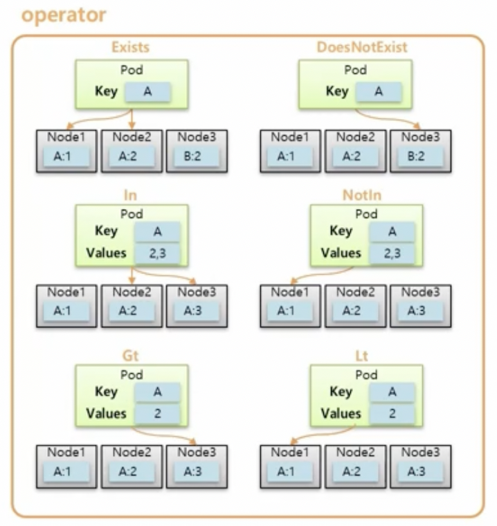
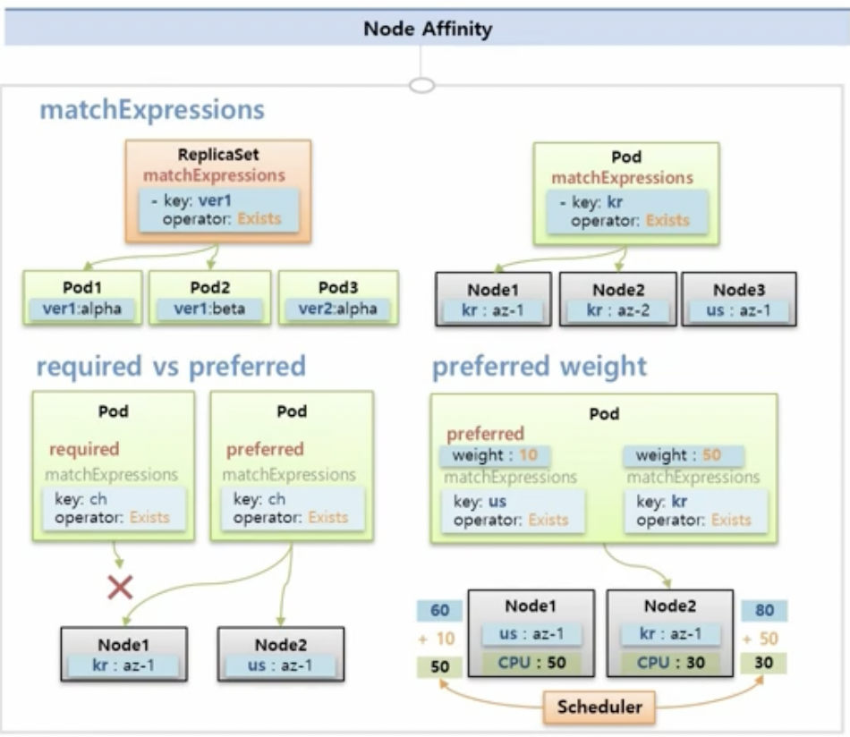
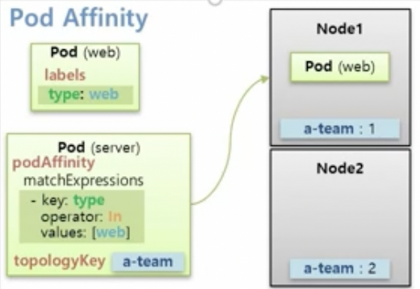
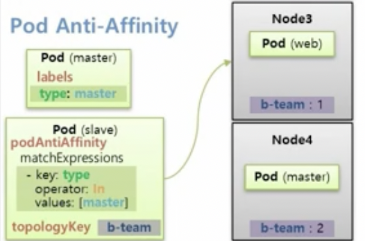

# Pod

## Pod Lifecycle

- `Pod`에도 생명주기(Lifecycle)이 존재하며, 생성되는 시점부터 소멸되는 시점까지의 과정이 있다.  
  이런 생명주기의 특징은 각 단계마다 수행되는 동작들이 모두 다르다는 점이다.

- `Pod`를 생성한 후, 내용을 보면 status라는 항목이 있다. 이 항목의 내용들은 아래와 같다.

```yaml
status:
  phase: Pending
  conditions:
  - type: Initialized
    status: 'True'
    lastProbeTime: null
    lastTransitionTime: '2021-11-08T09:51:43Z'

  ####

  - type: PodScheduled
    status: 'True'
    lastProbeTime: null
    lastTransitionTime: '2021-11-08T09:51:43Z'

  ####
  - type: ContainersReady
    status: 'False'
    lastProbeTime: null
    lastTransitionTime: '2021-11-08T09:51:43Z'
    reason: ContainersNotReady

 ####
 - type: Ready
   status: 'False'
   lastProbeTime: null
   lastTransitionTime: '2021-11-08T09:51:43Z'
   reason: ContainersNotReady
```

- 이 내용을 하나씩 알아보자.  
  `Pod`가 있고, 그 안에 `Status`가 있다. 이 `Status`안에는 `Pod`의 전체 속성을 대표하는 `Phase`라는 속성이 있다.  
  또한 `Pod`가 생성되면서 실행되는 단계들이 있는데, 그 단계들의 상태를 알려주는 `Conditions`라는 속성도 `Status`내에 있다.

- `Pod` 안에는 하나 이상의 `Container`들이 있다. 이 각각의 `Container` 내에는 해당 컨테이너의 상태를 나타내는 `State`가 있다.

### Phase

- `Status`내에 있고 `Pod`의 전체 속성을 대표하는 `Phase`에는 아래의 다섯 가지 상태가 있다.

  - **Pending**
  - **Running**
  - **Succeeded**
  - **Failed**
  - **Unknown**

### Conditions

- `Pod`가 실행되면서 실행되는 단계들의 상태를 알려주는 `Conditions`에는 아래 네 가지 상태가 있다.

  - **Initialized**
  - **PodScheduled**
  - **ContainersReady**
  - **Ready**

- `Conditions`의 세부 내용들을 알려주는 `Reason`이라는 항목도 있다.

  - **ContainersNotReady**
  - **PodCompleted**
  - **ContainersNotInitialized**
  - 기타 등등

- 위에서 본 yml파일에서 `status: 'False'`인 경우, 이 상태가 왜 false인지를 알아야 하기에  
  `Reason`이 추가되어 있으며(reason), 내용을 보면 원인을 파악하기 쉽다.

### ContainerStatuses

- `Pod`내의 `Container`의 상태를 나타내는 `ContainerStatuses`에는 아래의 세 가지 항목이 있다.

  - **Waiting**
  - **Running**
  - **Terminated**

- `ContainerStatuses` 또한 `Condition`과 마찬가지로 세부 내용을 알기 위한 `Reason`이 있다.  
  예시 상황을 보자.

```yaml
containerStatuses:
  - name: container
    state:
      waiting:
        reason: ContainerCreating
    lastState: {}
    ready: false
    restartCount: 0
    image: image/init
    imageID: ""
    started: false
```

- `Pod`의 상태 구조를 나타낸 그림이다.


- 이제 `Pod`의 상태를 나타내는 메인 지표인 `Phase`가 어떻게 변하고, 그 변화에 따라 `Pod`내의 `Container`의  
  동작이 어떻게 변하는지 살펴보자.

### Pod Phase - Pending

- `Pending`은 `Pod`의 최초 상태이다. 이 상태일 때 `Container`에서 일어나는 일들을 보자.  
  우선 실제 `Container`가 구동되기 전에 초기화시켜야 하는 내용들이 있을 경우, 그 내용들을 담고 있는  
  `InitContainer`가 있다. 만약 `Volume`이나 보안 세팅을 위해 사전 설정을 해야하는 일이 있을 경우,  
  `Pod` 생성 내용 안에 initContainers라는 항목에 초기화 스크립트를 넣을 수 있으며, 이 스크립트가  
  실제 `Container`보다 먼저 실행되어 스크립트 실행이 성공적으로 끝나거나, 아예 initContainers가  
  없을 경우에는 `Pending.Initialized`가 true로, 뭔가 잘못되었다면 false로 설정된다.

- 다음으로 이 `Pod`가 특정 `Node`에 올라가도록 직접 지정했을 때는 지정된 `Node`에, 아니라면 K8S가  
  알아서 자원 상황에 따라 `Node`를 결정하기도 하는데, 이 작업이 완료되면 `Pending.PodScheduled`가  
  true로 변한다.

- 그 후에는 `Container`에 사용할 이미지를 다운로드하는 동작이 있다.

- 위 세 단계가 실행되는 동안 `ContainerStatus`는 _Waiting_ 이며, reason은 _ContainerCreating_ 이다.

### Pod Phase - Running

- 이제 본격적으로 `Container`들이 기동되면서 `Pod`와 `Container`는 _Running_ 상태가 된다.  
  정상적으로 기동될 수도 있지만, 하나 이상의 컨테이너가 기동 중 문제가 발생해서 재시작될 수도 있다.  
  이때의 `ContainerStatus`는 다시 _Waiting_ 이 되며, reason은 _CrashLoopBackOff_ 이다.

- 정상적으로 기동되든, 컨테이너에 문제가 생겨 재시작되는 중이든 `Pod`는 이러한 `Container`의 상태를  
  *Running*이라 간주하며 `Phase`를 _Running_ 으로 설정한다. 대신 `Container`가 재시작되고 있다면  
  `Conditions`의 ContainerReady와 Ready는 false이다. 이후 모든 컨테이너들이 정상적으로 구동된다면  
  `Conditions`는 true가 된다.  
  따라서 **`Pod`의 `Phase`가 Running이더라도, `Container`들은 항상 정상 구동중이라는 보장이 없다.**  
  **즉, `Pod`뿐만 아니라 `Container`의 상태 또한 지속적으로 모니터링해야 한다.**

- 일반적으로 서비스가 지속적으로 운영되어야 하는 경우, `Pod`의 `Phase` 중 *Running*을 계속 유지해야 할 것이다.

### Pod Phase - Failed, Succeeded

- `Job` 또는 `CronJob`으로 생성된 `Pod`들은 자신의 일을 수행중일 때는 _Running_ 이지만, 일을 모두 마치면  
  `Pod`는 더이상 일을 하지 않는 상태가 되는데, 이때 `Phase`는 _Failed_ 또는 *Succeeded*로 변한다.  
  만약 작업을 하고 있는 `Container` 중 하나라도 문제가 생겨 `Container`의 상태가 *Error*가 되면  
  `Pod`의 `Phase`는 _Failed_ 가 되며, `Container`들이 모두 _Completed_ 로 주어진 일들을 모두 잘 마쳤을 때는  
  *Succeeded*가 된다.

- 이때 `Pod`의 `Condition`도 변하는데, `Phase`가 _Failed_ 이든 _Succeeded_ 이든 모두 ContainersReady는  
  false로, Ready도 false가 된다.

### 기타 상태

- 추가적으로 _Pending_ 중에 모종의 이유로 바로 _Failed_ 가 되는 경우도 있고, _Pending_ 이나 _Running_ 중에  
  통신 장애 등이 발생하면 _Unknown_ 상태로 바뀐다. 이런 장애들이 빠르게 해결되면 다시 _Pending_ 상태가 되지만,  
  계속 지속되면 _Failed_ 가 되기도 한다.


<hr/>

## ReadinessProbe, LivenessProbe

### ReadinessProbe, LivenessProbe

- `Pod`의 `ReadinessProbe`와 `LivenessProbe`를 알아보자. 우선 이들을 어떤 상황에서 쓰는지 보자.  
  `Pod`를 만들면 그 안에 `Container`가 생기고, `Pod`와 `Container`의 상태가 *Running*이 되면서  
  그 안에 있는 애플리케이션도 정상적으로 구동될 것이다. 그리고 `Pod`는 `Service`에 연결되고, 이 `Service`의  
  IP가 외부에 알려지면서 외부에서 접근할 수 있게 된다.

- 이 상황에서 하나의 `Service`에 2개의 `Pod`가 연결되어 있어, 50%씩 트래픽이 나눠진다 가정해보자.  
  (각 `Pod`는 Node1, Node2라는 `Node` 내에 있다.)  
  이 상태에서 Node2가 모종의 이유로 down되면 그 안에 있는 `Pod`또한 장애가 발생해 `Service`로 오는 모든  
  트래픽이 Node1 내의 `Pod`로 전달될 것이다. 이때 Auto Healing에 의해 Node2의 `Pod`는 다른 `Node`(Node3)에  
  재생성되려 할 것인데, 그 과정에서 새로운 `Pod`와 `Container`가 _Running_ 상태가 되면서 `Service`와 연결되는데,  
  **아직 애플리케이션은 구동 준비중(Booting)인 순간이 발생**한다. `Service`와 연결되자마자 애플리케이션의 상태와는  
  관계없이 트래픽이 Node3로도 분배되기 때문에 만약 애플리케이션이 구동중이라면 일부 사용자는 에러가 발생하게 된다.

- 이런 상황에 대비하기 위해 `Pod`를 만들 때 `ReadinessProbe`를 지정하면 이런 문제를 피할 수 있다.  
  `ReadinessProbe`가 애플리케이션이 구동되기 전까지는 `Service`와 연결되지 않게끔 해주기 때문이다.

- 또다른 상황으로 `Node`가 down되는게 아닌, 애플리케이션이 중단되고, `Pod`는 _Running_ 상태라고 해보자.  
  예를 들어 서비스를 Tomcat으로 돌릴 때 Tomcat은 작동하지만, 그 위에 띄워진 애플리케이션에 메모리 초과가 발생한다면  
  애플리케이션에 접근하면 500(INTERNAL SERVER ERROR)가 반환되게 된다. 이 경우에는 Tomcat 프로세스 자체가 죽은게 아니라  
  그 위에 있던 애플리케이션에 문제가 생긴 것이기에 Tomcat의 프로세스를 지켜보는 `Pod`의 입장에서는 계속 _Running_ 상태로  
  있게 되며, 이런 상황이 발생하면 이 `Pod`로 오는 트래픽은 또 문제가 된다.

- 이런 경우에 애플리케이션의 장애를 감지해주는게 바로 `LivenessProbe`인데, 마찬가지로 `Pod`를 만들 때  
  `LivenessProbe`를 지정해주면 해당 애플리케이션에 장애가 생기면 `Pod`를 재실행하게 만들어서  
  잠깐의 트래픽 에러는 발생하지만, 지속적으로 에러 상태에 머물러 있는 것을 방지해준다.

- 이렇게 서비스를 조금 더 안정하게 유지하기 위해서는 `ReadinessProbe`를 지정해 애플리케이션의 구동 순간에  
  발생하는 트래픽 실패를 없애고, `LivenessProbe`를 통해 애플리케이션에 장애 발생 시 지속적인 실패를 예방해야 한다.

- 이제 이 둘의 세부적인 사용 방법을 알아보자.

- `ReadinessProbe`와 `LivenessProbe`는 사용 목적만 다를 뿐, 설정할 수 있는 내용은 같다.  
  공통적으로 들어갈 수 있는 속성들을 보면 대표적으로 httpGet, Exec, tcpSocket으로 해당 애플리케이션의  
  상태를 확인할 수 있다.

  - httpGet: 포트번호, 호스트명, 엔드포인트(path), header, scheme(http, https 등)을 지정해  
    애플리케이션 상태 확인

  - Exec: 특정 명령어(Command)를 수행해 그 결과를 확인

  - tcpSocket: 포트번호, 호스트명을 검사

- 위 세 개 중 하나는 필수적으로 지정해야 하며 아래와 같은 옵션값들이 있다.

  - initialDelaySeconds: 최초 probe 수행 전 딜레이 시간(default: 0초)
  - periodSeconds: probe 수행 간격(default: 10초)
  - timeoutSeconds: 결과를 기다리는 최대 시간(default: 1초)
  - successThreshold: 정상 처리로 간주하기 위한 성공 횟수(default: 1회)
  - failureThreshold: 실패 처리로 간주하기 위한 실패 횟수(default: 3회)

### `ReadinessProbe`

- 하나의 `Service`에 `Pod`가 연결되어 있는 상태에서 `Pod`를 하나 더 만들 것인데, `Container`의 hostPath로  
  `Node`의 `Volume`이 연결되어 있다 해보자.


- 새로 만들 `Container`에 `ReadinessProbe`를 설정해보자.  
  위에서 본 설정값 중 Exec를 사용해보자. 명령어(Command)는 `cat /readiness/ready.txt`를 수행할 것이며  
  옵션으로는 initialDelaySeconds는 5, periodSeconds는 10, 그리고 successThreshold는 3을 지정해보자.

- 이렇게 설정하면 `Pod`를 만들 때 `Node`가 스케줄되고 `Container`가 사용할 이미지가 다운로드되면서  
  `Pod`와 `Container`의 상태는 _Running_ 이 되지만, `ReadinessProbe`에 지정한 probe가 성공하기 전까지  
  `Condition`의 ContainerReady와 Ready는 false로 유지된다. 만약 이 상태가 계속 false로 유지되면  
  `Endpoint`에서는 이 `Pod`의 IP를 NotReadyAddr로 간주하고 `Service`에 연결하지 않는다.  
  그 다음에 K8S가 `ReadinessProbe`에 정의된 동작대로 애플리케이션의 기동 상태를 체크하게 되는데, 지정한 것처럼  
  `Container`가 _Running_ 상태가 되면 최초 5초동안 지연하다가 10초에 한 번씩 `cat /readiness/ready.txt`를 수행한다.  
  계속해서 이 명령어가 잘못된 결과를 반환하면 이 `Pod`의 Ready는 false로 유지되고, 3번 성공을 확인하면  
  Ready가 true가 되고 `Endpoint`도 이 `Pod`의 IP를 정상적으로 Address로 간주하면서 `Service`와 연결된다.

- yml 파일은 아래와 같다.

```yaml
# yml for Pod
apiVersion: v1
kind: Pod
metadata:
  #..
spec:
  containers:
    - name: app1
      image: image/app
      ports:
        - containerPort: 8080
      readinessProbe:
        exec:
          command: ["cat", "/readiness/ready.txt"]
        initialDelaySeconds: 5
        periodSeconds: 10
        successThreshold: 3
      volumeMounts:
        - name: host-path
          mountPath: /readiness
  volumes:
    - name: host-path
      hostPath:
        path: /tmp/readiness
        type: DirectoryOrCreate
```

### `LivenessProbe`

- 이번에는 `LivenessProbe`를 살펴보자. 하나의 `Service`에 두 개의 `Pod`가 _Running_ 상태로 있다.  
  여기에서 수행되는 애플리케이션에는 `/health`라는 HTTP GET 엔드포인트가 있어서 200(OK)가 반환되면  
  애플리케이션이 정상 작동하고 있다고 알 수 있게 해준다. 이를 사용하기 위해 `Container`에는 `LivenessProbe`가  
  지정되어 있으며 httpGet을 사용하여 path에는 `/health`가 지정되어 있다. 옵션으로는 initialDelaySeconds는 5,  
  periodSeconds는 10, 그리고 failureThreshold는 3을 사용한다.

- K8S가 수행하는 동작은 `ReadinessProbe`에서 본 동작과 HTTP GET 요청을 보낸다는 점만 빼고는 모두 동일하다.  
  `/health`에 애플리케이션 구동 5초 후에 HTTP GET 요청을 10초 간격으로 보냈을 때 500등의 상태 코드와 에러가  
  3번 발생하면 해당 `Pod`를 restart한다.

- yml 파일도 보자.

```yaml
# yml file for Pod
apiVersion: v1
kind: Pod
metadata:
  #..
spec:
  containers:
    - name: app2
      image: image/app
      ports:
        - containerPort: 8080
      livenessProbe:
        httpGet:
          path: /health
          port: 8080
        initialDelaySeconds: 5
        periodSeconds: 10
        failureThreshold: 3
```

<hr/>

## Qos Classes

- `Node`안의 3개의 `Pod`(Pod1, Pod2, Pod3)가 `Node`의 자원을 균등하게 분배받아 사용중이라고 가정해보자.  
  이때 Pod1이 추가적인 자원이 필요하게 되었다고 하자. 하지만 `Node`에는 추가적으로 할당받을 수 있는 남은 자원이  
  없기 때문에 Pod1이 리소스 부족으로 에러가 나고, down될 수 있다. 이때, Pod2나 Pod3중 하나를 down 시키고  
  Pod1이 추가적으로 요청한 자원을 할당하도록 할 수도 있다.

- K8S는 애플리케이션의 중요도에 따라 이런 상황을 관리할 수 있도록 세 가지 단계로 Qos(Quality of Service)를 지원한다.


- 이 상황에서는 BestEffort가 부여된 Pod3가 가장 먼저 down되어 자원이 반환되고, Pod1은 필요한 추가적인  
  자원을 할당받아 사용할 수 있게 된다.

- BestEffort인 `Pod`가 없는 상황에서 `Pod`가 `Node`에 남아있는 자원량보다 많은 추가적인 자원을 요구하게 된다면  
  Burstable이 적용된 `Pod`가 down되면서 자원이 회수된다.

- 즉, Guaranteed가 마지막까지 `Pod`를 안정적으로 유지시켜주는 Class이다.

- QoS는 특정 속성이 있어서 설정하는 것은 아니고, `Container`에 리소스 관련 설정을 할 때 request, limits에  
  memory, cpu를 어떻게 설정하느냐에 따라 알아서 결정된다.  
  설정하는 방법을 알아보자.

### Guaranteed

- Guaranteed Class로 설정하기 위해서는 `Pod`내의 모든 `Container`에 대해 resources.requests와  
  resources.limits가 명시되어 있어야 한다. 이때, 각각 모두 memory와 cpu가 설정되어 있어야 한다.  
  또한 각 `Container`에 설정된 memory와 cpu값은 resources.requests와 resources.limits에  
  동일한 값으로 지정되어 있어야 한다.

- 위 규칙을 모두 충족해야 K8S가 이 `Pod`를 Guaranteed Class로 판단한다.

### Burstable

- Guaranteed와 BestEffort의 중간 클래스로, 가령 `Container`마다 resources.requests와  
  resources.limits가 설정되어 있지만, requests의 수치가 더 작거나 requests만 설정되어 있거나  
  모든 `Container`마다 requests, limits가 설정되어 있지 않은 경우 등에 해당한다.

### BestEffort

- `Pod`내의 어떠한 `Container`에도 resources.requests, resources.limits가 모두 설정되어 있지  
  않다면, K8S가 이 `Pod`를 BestEffort Class로 판단한다.


- Burstable로 판단된 여러 `Pod`들 중 어떤 `Pod`가 먼저 삭제되는지도  
  알아야 하는데, 이는 OOM Score(Out-Of-Memory Score)에 따라 결정된다.  
  위 사진에서 Burstable내에 있는 `Pod`들 중 Pod2와 Pod3를 보자.  
  이 둘은 각각 내부 `Container`의 memory request가 각각 5G, 8G로 설정되어 있는데  
  그 안에 수행되고 있는 애플리케이션이 실제로 사용하고 있는 메모리가 둘 다 4G라고 한다면  
  Pod2의 메모리 사용량은 80%, Pod3의 메모리 사용량은 50%이다. 이 상황에서 OOM Score는  
  Pod2가 80%로 더 크기 때문에 K8S는 **OOM Score가 더 큰 Pod2를 먼저 제거** 한다.

<hr/>

## Node Scheduling

- `Pod`는 기본적으로 스케줄러에 의해 `Node`에 할당되지만, 직접 생성되길 원하는 `Node`를 지정할 수도 있고,  
  운영자가 특정 `Node`를 사용하지 못하도록 관리할 수도 있다. K8S는 다양한 기능들을 통해 이런 작업들을 지원한다.

### Node 선택 - NodeName, NodeSelector, NodeAffinity

- 이들은 `Pod`를 특정 `Node`에 생성되도록 선택하기 위한 용도로 사용한다.  
  기본적으로 K8S 스케줄러는 여유 자원이 가장 많은 `Node`에 `Pod`를 할당해 생성하지만, 특별히 생성되길 원하는  
  `Node`가 있다고 해보자.

- `NodeName`을 사용하면 자원량과는 관계없이 바로 해당 이름을 가진 `Node`에 `Pod`가 할당된다.  
  명시적으로 `Node`를 지정해 `Pod`를 할당할 수 있다는 점이 매력적이지만, 실무 환경에서는 `Node`가 빈번히  
  추가되고 삭제되면서 `Node` 이름이 계속 변경될 수 있기 때문에 잘 사용되지는 않는다.

- 특정 `Node`를 선택할 때 권장되는 방식은 `NodeSelector`이다. `Pod`를 만들 때 원하는 key-value의  
  쌍을 지정하면, 이 값을 `Label`로 가지는 `Node`에 해당 `Pod`가 할당된다. 하지만 `Label`의 특성상  
  두개 이상의 `Node`에도 같은 key, value를 가지는 `Label`을 달 수 있기 때문에, 두 개 이상의 `Node`에  
  같은 `Label`이 있다면 그들 중 여유 자원이 많은 `Node`에 `Pod`가 할당된다. 이 방식의 단점은 key, value가  
  모두 정확히 일치하는 `Label`을 가진 `Node`에만 할당이 된다는 점과, 만약 매칭되는 `Label`을 가지는 `Node`가  
  한 개도 없다면, `Pod`는 어떠한 `Node`에도 할당되지 않아 에러가 발생한다는 점이다.  
  이런 단점을 보완해주는 방식이 `NodeAffinity`이다.

- `NodeAffinity`는 `Pod`에 key, value 중 Key만 설정한다. 그러면 해당 Key를 가지는 `Node`들 중 자원이  
  더 많은 `Node`에 `Pod`가 할당되고, 만약 해당 조건에 맞지 않는 key를 갖고 있더라도 스케줄러의 판단 하에  
  자원이 많은 `Node`에 할당되도록 옵션을 줄 수도 있다.

### Pod간 집중, 분산 - Pod Affinity, Anti-Affinity

- 이 기능은 여러 `Pod`들을 하나의 `Node`에 집중해서 할당하거나, `Pod`들 간에 겹치는 `Node`가 없게 분산해서  
  할당하게 해준다.

- 예를 들어, `Hostpath`를 사용하는 하나의 `PV`에 연결된 두 개의 `Pod`(Web, Server)가 있다 해보자.  
  `HostPath`의 특성 상 이 두개의 `Pod`는 항상 같은 `Node`상에 있어야만 문제가 발생하지 않는다.  
  따라서 이 두 개의 `Pod`가 항상 동일한 `Node`에 할당됨을 보장하려면 `PodAffinity`를 사용해야 한다.

- 두 개의 `Pod`(Master, Slave)가 있다고 하자. Master가 죽으면 Slave가 백업 처리를 해줘야 한다.  
  이런 상황에서 이 두 `Pod`가 동일한 `Node`에 할당된다면 `Node`가 down되면 Master, Slave가 모두 down되므로  
  적절한 백업 처리를 못한다. 따라서 이 둘은 항상 서로 다른 `Node`에 스케줄링 되어야 한다.  
  따라서 Master가 특정 `Node`에 할당되면, Slave에는 `AntiAffinity`를 줘서 Master와 다른 `Node`에  
  할당되도록 해야 한다.

### Node에 할당 제한 - Toleration / Taint

- 이 기능은 특정 `Node`에 아무런 `Pod`가 할당되지 않도록 제한을 하기 위해 사용한다.  
  예를 들어, 높은 사양의 그래픽 성능을 요구하는 애플리케이션을 구동하기 위해 만든 `Node`(Node5)가 있다 해보자.  
  운영자가 이 `Node`에 `Taint`를 설정하면, 일반적인 `Pod`는 Node5에 할당되지 않는다.  
  심지어 `Pod`에 Node5를 직접 명시해도 할당되지 않는다. `Taint`가 명시된 `Node`에 할당되기 위해서  
  `Pod`는 `Toleration`이 지정되어야만 한다.

- 각각 조금 더 자세하게 살펴보자.

### NodeAffinity

- `NodeAffinity`에 대해 볼 첫 번째 기능은 matchExpressions이다. 이전에 `Replication Controller`와  
  `ReplicaSet`의 차이점에서 보았듯이, Selector와 `Label`은 key, value가 모두 동일해야 매칭되지만,  
  matchExpressions는 여러 조합으로 `Pod`들을 선택할 수 있다.

- `ReplicaSet`에서 본 operator(Exists, DoesNotExists, In, NotIn) 외에 Gt, Lt의 두 가지 옵션이 더 있다.



- 다음 속성으로 required와 preferred를 보자.

  - required: 이 속성을 가진 `Pod`가 `Node`에는 없는 key를 갖고 있다면 해당 `Node`에는 절대 할당되지 않는다.
  - preferred: 동일한 key를 가진 `Node`를 선호할 뿐, 일치하는 key를 갖고 있지 않은 `Node`에 할당될 수 있다.  
    preferred 속성에는 선호도를 나타내는 weight라는 필수 값이 있는데, 아래 그림의 preferred weight에서  
    볼 수 있듯이, _남은 자원량 + weight_ 를 비교해 더 높은 쪽에 할당되도록 한다.(대략적인 점수 측정 방식이다.)



- 위 사진의 required `Pod`의 yml은 대략 아래와 같다.

```yaml
apiVersion: v1
kind: Pod
metadata:
  #...
spec:
  affinity:
    nodeAffinity:
      requiredDuringSchedulingIgnoredDuringExecution:
        nodeSelectorTerms:
          - matchExpressions:
              - { key: ch, operator: Exists }
  containers:
    #...
```

- Preferred Weight가 지정된 preferred `Pod`의 yml 내용은 아래와 같다.

```yaml
apiVersion: v1
kind: Pod
metadata:
  #...
spec:
  affinity:
    nodeAffinity:
      preferredDuringSchedulingIgnoredDuringExecution:
        - weight: 10
          preference:
            - matchExpressions:
                - { key: us, operator: Exists }
  containers:
    #...
```

### PodAffinity



- `Pod(web)`가 먼저 Node1에 할당되고, `Pod(server)`에 podAffinity로 matchExpressions를 지정하면  
  이는 `Node`가 아닌 `Pod`의 `Label`을 검색해 만족하는 결과를 찾는다. 위 사진에서 topologyKey는  
  `Node`의 key를 본다. 즉, a-team을 key로 갖는 `Node` 범위 내에서 가장 적합한 `Pod`를 찾는다.

- 만약 `Pod(web)`이 b-team을 key로 갖는 `Node`에 할당된다면, 조건을 만족하는 `Pod`를 찾지 못하기에  
  `Pod(server)`는 _PENDING_ 상태가 되고, 원하는 조건을 만족할 때까지 아무런 `Node`에도 할당되지 않는다.

- 위 사진의 Pod(server)의 yml 내용은 아래와 같다.

```yaml
apiVersion: v1
kind: Pod
metadata:
  #...
spec:
  affinity:
    podAffinity:
      requiredDuringSchedulingIgnoredDuringExecution:
        - topologyKey: a-team
          labelSelector:
            matchExpressions:
              - key: { key: type, operator: In, values: [web] }
  containers:
    #...
```

### Pod Anti-Affinity



- `PodAffinity`와 정반대로 `Pod(Master)`가 만들어지면, matchExpressions를 만족하는 `Pod`와는 절대  
  같은 `Node`에 할당되지 않는다. `PodAffinity`와 동일하게 topologyKey를 지정해 b-team을 key로  
  갖는 `Node`를 찾는다.

- 위 사진의 Pod(slave)의 yml 파일 내용은 아래와 같다.

```yaml
apiVersion: v1
kind: Pod
metadata:
  #...
spec:
  affinity:
    podAntiAffinity:
      requiredDuringSchedulingIgnoredDuringExecution:
        - topologyKey: b-team
          labelSelector:
            matchExpressions:
              - { key: type, operator: In, values: [master] }
  containers:
    #...
```

### Taint, Toleration

- 특정 목적을 위한 `Node`에 일반적인 `Pod`들이 스케줄링되는 것을 막기 위해 `Node`에 `Taint`를  
  지정한다고 했다. `Taint`에는 해당 `Taint`를 식별하기 위한 `Label`(key, value)가 있으며  
  effect라는 옵션이 있어, 만약 effect에 NoSchedule을 지정하면 다른 `Pod`들이 해당 `Node`에  
  절대 할당되지 않는다. effect에는 몇 가지 옵션이 더 있는데, PreferNoSchedule은 _가급적_  
  스케줄링이 안되도록 하는 거라 `Pod`가 정 다른 `Node`에 할당될 수 없는 상황이라면 `Taint`가  
  있더라도 해당 `Node`에 할당을 허용해준다. 마지막으로, Node3에 Pod2가 이미 할당되어 있다고 해보자.  
  이 상황에서 Node3에 NoSchedule effect를 가진 `Taint`를 추가하면, Pod2는 이미 할당되어  
  있었기에 중지되거나 하지 않는다. 반면 NoExecute effect로 `Taint`를 추가하면 Pod2는 삭제된다.  
  삭제를 막으려면 Pod2에 NoExecute effect를 갖는 `Toleration`를 추가해야 한다.  
  이때 이 `Taint`에 tolerationSeconds 옵션을 지정할 수 있는데, 이 값이 없으면 Pod2는 삭제되지  
  않지만, 지정되어 있다면 지정된 시간 후에 삭제된다.

- 특정 목적을 위한 `Node`를 사용해야 하는 `Pod`의 경우, `Pod`를 생성할 때 `Toleration`을 지정한다.  
  `Toleration`의 내용으로는 key, operator, value, effect가 있다. `Toleration`에 지정된  
  조건이 `Taint`와 일치해야 하며, operator에는 Equal과 Exists만 있다. 그리고 effect의  
  조건까지 매칭이 되어야 해당 `Node`에 할당되지, 하나라도 만족하지 못한다면 아무리 `Toleration`이  
  있다 하더라도 `Taint`를 가지고 있는 `Node`에 할당되지 않는다.

- 오해하기 쉬운 부분이 `Pod`에 있는 `Toleration`의 내용을 보고 매칭되는 `Taint`를 찾는다고  
  생각할 수 있지만, 그게 아니라 `Pod`가 특정 `Node`에 먼저 스케줄링 된 후, 일치하는  
  `Toleration`이 있는지 확인하는 것이다. 이 말은 곧 `Pod` 입장에서는 `Taint`가 있더라도  
  다른 `Node`에도 스케줄링될 수 있다는 뜻이다. 따라서 **`Pod`에 별도의 `NodeSelector`를 지정해**  
  **원하는 `Node`에만 배치될 수 있도록 해야 한다.**

- 기본적으로 Master Node에는 NoSchedule effect를 갖는 `Taint`가 적용되어 있어서 `Pod`를  
  만들 때 Master Node에 할당되지 않도록 하며, 만약 `ReplicaSet`에 의해 `Pod`가 운영되는 중인데  
  `Node`에 장애가 발생하게 되면 해당 `Node`에 있는 `Pod`들이 정상 동작하지 않게 될 수 있기 때문에  
  K8S가 자체적으로 NoExecute effect를 갖는 `Taint`를 해당 `Node`에 적용시킨다.  
  그러면 `ReplicaSet`은 `Pod`가 삭제되었기에 다른 `Node`에 `Pod`를 다시 만들어서  
  서비스가 잘 유지될 수 있도록 해준다.

- 아래 예시를 보자.

```sh
kubectl label nodes node1 gpu=no1
kubectl taint nodes node1 hw=gpu:NoSchedule
```

- 위 명령어는 node1이라는 `Node`에 `gpu:no1`라는 라벨을 추가하고,  
  `hw:gpu`라벨과 NoSchedule effect를 갖는 `Taint`를 추가했다.

- 이제 위 `Taint`와 일치하는 조건을 갖는 `Toleration`을 가지는 `Pod`의 yml 내용을 보자.

```yaml
apiVersion: v1
kind: Pod
metadata:
  #..
spec:
  nodeSelector:
    gpu: no1
  tolerations:
    - effect: NoSchedule
      key: hw
      operator: Equal
      value: gpu
  containers:
  #..
```

<hr/>
