# Basic Object

## Service - Headless, Endpoint, ExternalName

- 기존에 봤던 `Service`에 대해 다시 보자.  
  아래 그림처럼 192.168로 시작하는 IP로 내부망이 형성되고, 그 안에 Master와 2개의 Worker `Node`들이 있다.  
  이들로 만들어진 K8S Cluster에는 `Pod`를 위한 IP 대역과 `Service`를 위한 IP 대역이 있다.  
  `Pod`는 20, `Service`는 10으로 시작하는데, 이 대역은 K8S를 구성할 때 설정할 수 있는 부분이다.  
  pod1, pod2 `Pod`가 있으며, 이 둘은 모두 service1이라는 `Service`에 연결되어 있다.  
  이때, `Service`가 `ClusterIP`라면 service1으로의 접근은 이 K8S를 구성하고 있는 서버들(3개의 `Node`들)에서만  
  가능하다. 오로지 이 서버들에 접근할 수 있는 권한이 있는 사람만 `ClusterIP`에 접근할 수 있기 때문에, 특정 `Pod`에  
  `ClusterIP`를 달았다는 뜻은 결국 내부 관리자만 접근할 수 있게 하기 위함인 것이다.  
  내부망 내에 IP를 할당받은 여러 기기들이 있을 수 있지만, 여기서는 직접 `Service`의 IP를 호출할 수 없다.  
  내부망에 있는 다른 기기들이 접근하기 위해서는 `NodePort` 유형의 `Service`를 만들어 각각의 서버가 30000번대  
  포트번호를 할당받고, 그 할당받은 포트를 사용해 `Service`와 연결해야 한다. 그래서 K8S 관리자는 내부망에 있는 사람들에게  
  이 서버들 중 하나의 IP와 포트번호를 알려주면 이를 통해 `Service`에 접근할 수 있다.

- AWS, GCP, Azure 등의 Cloud Provider를 사용해 K8S Cluster를 구축했을 때에는 `LoadBalancer` 타입의 서비스를  
  만들면 `NodePort`가 생성되면서 해당 포트에 `LoadBalancer`가 연결되고, 외부망에 있는 사람들은 이 IP를 통해서  
  `Service`에 연결할 수 있다.

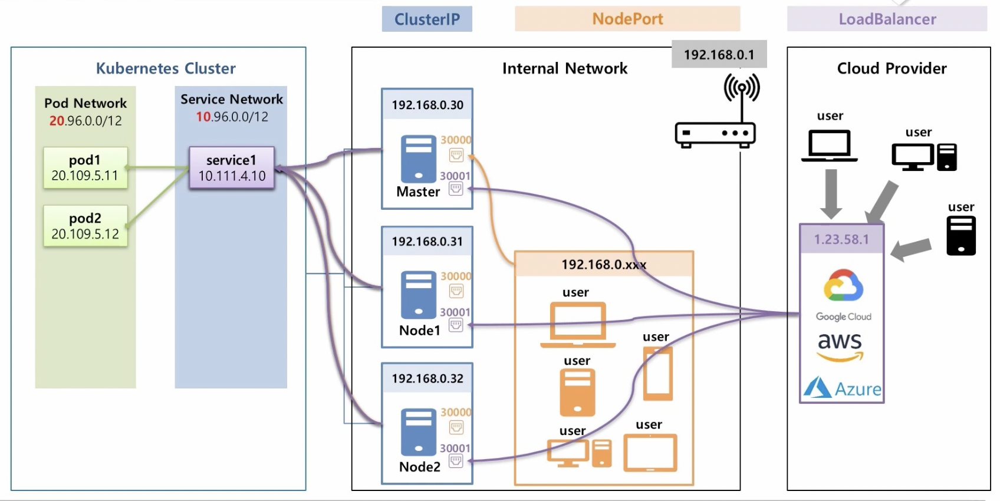

- 즉 사용자 관점에서는 이들이 K8S 망에 있는 `Service`에, 궁극적으로는 연결되어 있는 `Pod`에 접근하기 위해  
  `ClusterIP`, `NodePort`, `LoadBalancer` 타입의 `Service`를 만들었던 것이다.

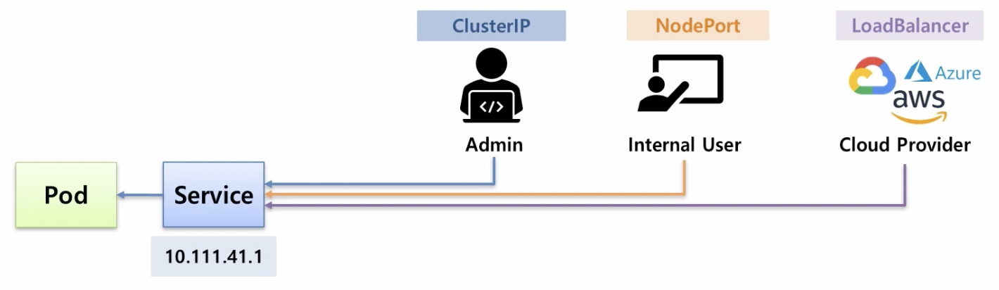

- 이번에는 사용자 입장이 아닌 `Pod`의 입장에서 원하는 `Service`, 혹은 다른 `Pod`로 직접 연결하는 방법과  
  외부 서비스에 안정적으로 연결하는 방법을 보자.

- 사용자 접근의 경우, `Service`가 만들어진 후에 해당 `Service`의 IP를 확인하고 해당 IP로 접근하면 되는데
  `Pod`의 경우에 자원들이 동시에 생성될 수 있다. 아래처럼 PodA가 PodB에 접근해야 하는 상황인데, IP는  
  `Pod`나 `Service`가 생성될 때 동적으로 할당되기 때문에 PodA는 PodB의 IP를 미리 알 수 없으며  
  PodB가 장애가 생겨 재생성되면 IP 또한 함께 변경되기 때문에 PodA가 PodB의 IP를 알고 있더라도 계속 쓸 수 없다.  
  이와 같은 문제를 해결해 PodA가 PodB와 `Service`에 연결할 수 있게 하기 위해서는 `DNS Server`와  
  `Headless Service`가 필요하다.

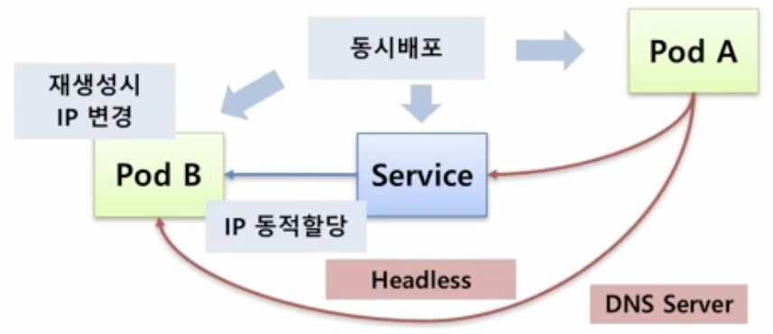

- 또한 `Pod`가 외부의 특정 사이트에 접근해서 데이터를 가져와야 하는 상황에서 접근 주소를 변경해야 하는 상황이 생기면  
  주소만 변경하기 위해 주소 변경 후 `Pod`를 재배포하지 않고 싶을 것이다. 이런 문제를 편리하게 해결하기 위해 K8S는  
  `Service`에 `ExternalName`을 이용해 외부로의 연결을 `Pod`의 수정 없이 변경하도록 할 수 있게 해준다.


- 위에서 본 사진의 K8S Cluster 부분에서 Pod Network와 Service Network외에 DNS Server도 존재한다.  
  DNS Server에는 `Service`의 도메인 이름과 IP가 저장되어 있기에 `Pod`가 service1에 대한 IP를 질의하면  
  해당 `Service`의 IP를 알려주는 역할을 한다. 또한 내부망에도 DNS Server가 구축되어 있다면, 내부 서버들이  
  생겼을 때 해당 서버의 이름들을 내부망의 DNS Server에 등록할 수 있고, 만약 `Pod`가 user1을 찾았을 때  
  K8S내의 DNS Server에 없다면 DNS 메커니즘 상 상위 DNS인 내부망의 DNS Server에 질의하게 되고, 발견하게 되면  
  해당 이름을 가진 서버의 IP를 알려준다. 마찬가지로 외부에 있는 사이트도 도메인명이 외부의 DNS Server에  
  등록되어 있기 때문에 예를 들어 Google을 찾으면 부모의 부모(외부의 DNS Server)에 질의하여 IP를 알 수 있다.

- 위처럼 `Pod`에서 DNS Server를 이용해서 원하는 `Service`나 외부 등에 접근할 수 있다. 그래서 `Pod`가 IP 주소를  
  몰라도 DNS에 서비스명으로 IP를 질의해 연결할 수 있는 것이다.

- 이번에는 하나의 `Pod`(Pod1)이 다른 `Pod`(Pod2)에 연결하고 싶다 해보자. 이 경우에는 `Pod`에 `Headless Service`를  
  연결하게 되면 DNS Server에 `Pod`명과 `Service`명이 붙여져 도메인이름으로 등록되기 때문에(ex. pod2.service2)  
  Pod1의 입장에서는 Pod2에 접근하기 위해서는 Pod2의 IP 주소는 불필요하고, 단지 DNS Server에 pod2.service2를 질의하면 된다.

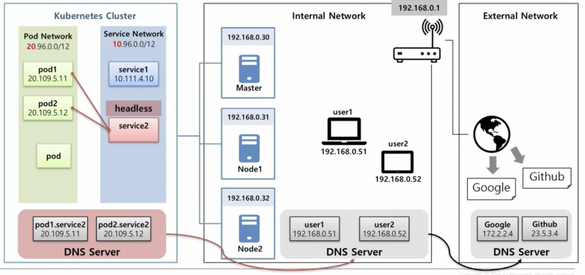

- `ExternalName Service`를 사용하는 경우를 보자. 이 `Service`에는 특정 외부 도메인의 주소를 넣을 수 있다.  
  예를 들어 기존에 google.com이 있었다고 해보자. 이 경우 DNS Server를 타고 타서 부모의 부모 DNS Server(외부 DNS)에  
  질의하게 되어 해당 도메인의 IP를 알 수 있다. `Pod`가 `ExternalName Service`를 통해 데이터를 가져오도록 해놓았다면  
  추후 다른 곳에서 데이터를 갖고오도록 해야 한다면 `ExternalName Service`의 도메인 주소만 바꿔주면 된다.

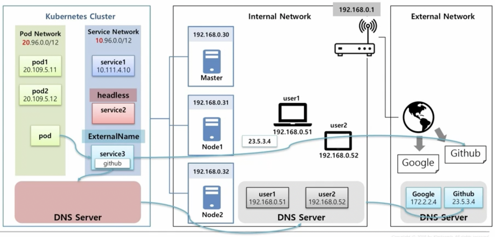

- 이제 본격적으로 각각의 특징에 대해 살펴보자.

### Headless

- default라는 이름의 `Namespace`에 `Pod` 2개(pod1, pod2)가 `Service`(service1)에 연결되어 있다 해보자.  
  service1은 `ClusterIP`로 만든 `Service`이다.

- 그리고 K8S DNS가 있는데, 이 DNS의 이름은 cluster.local 이다. 이 DNS에는 `Pod`든 `Service`든 생성을 하면  
  아래처럼 긴 도메인 이름과 IP가 저장된다.

| 종류      | 도메인 이름                           | IP          |
| --------- | ------------------------------------- | ----------- |
| `Service` | service1.default.svc.cluster.local    | 10.11.4.10  |
| `Pod`     | 20-109-5-11.default.pod.cluster.local | 20.109.5.11 |

- 위에서 도메인 이름의 구조를 살펴볼 필요가 있는데, `Service`의 경우 도메인명이 `서비스명.namespace명.svc.DNS명`이 된다.  
  `Pod`의 경우에는 `IP.namespace명.pod.DNS명`의 형식을 갖는다. 이렇게 규칙을 갖고 만들어진 도메인 명을  
  FQDN(Fully Qualitifed Domain Name)이라 한다. 같은 namespace 안에서 `Service`는 도메인명을 사용할 때 Service명만  
  사용해도 되지만, `Pod`는 FQDN 전체를 명시해야 한다. 이 규칙 때문에 하나의 `Pod`가 다른 `Pod`에 접근하려면 FQDN을 모두  
  명시해야 하는데, `Pod`의 FQDN 형식에는 IP 주소가 포함되어 있기에 사용할 수 없다.

- `Pod` 입장에서는 `Service`의 이름을 DNS에 질의해 해당 `Service`의 IP를 가져올 수 있기에 접근하고 싶은 `Service`의  
  이름만 알아도 `Pod`에서 해당 `Service`에 접근할 수 있게 할 수 있으며, 모든 이름은 사용자가 직접 만들기 때문에 미리  
  `Service`의 이름을 생각해 놓고 `Pod`에 심어놓을 수 있다. 그래서 단순히 `Pod`에서 `Service`에만 연결하는 데는  
  `ClusterIP`로 서비스를 만들어도 문제가 없다.

- 그런데 똑같은 상황에서 `Pod`가 Pod4에 직접 연결하고 싶다면 `Service`를 `Headless Service`로 만들어야 한다.  
  `Headless Service`를 만드는 방법은 clusterIP 속성에 None을 지정하기만 하면 되며, 이는 이 `Service`의 IP를  
  만들지 않겠다는 의미로, 실제로 만들어지지 않는다.

- 또한 `Pod`를 만들 때도 hostname 속성에 도메인 이름을, 그리고 subdomain 속성에는 위에서 만든 `Headless Service`의 이름을  
  지정해줘야 한다. 이렇게 만들면 DNS에 `Service`는 도메인 명은 기존과 그대로 등록되지만 IP를 갖지 않기에 서비스명을 질의하면
  연결되어 있는 모든 `Pod`들의 IP를 돌려준다 `Pod`는 `hostname.subdomain.namespace명.svc.cluster.local`로 등록된다.

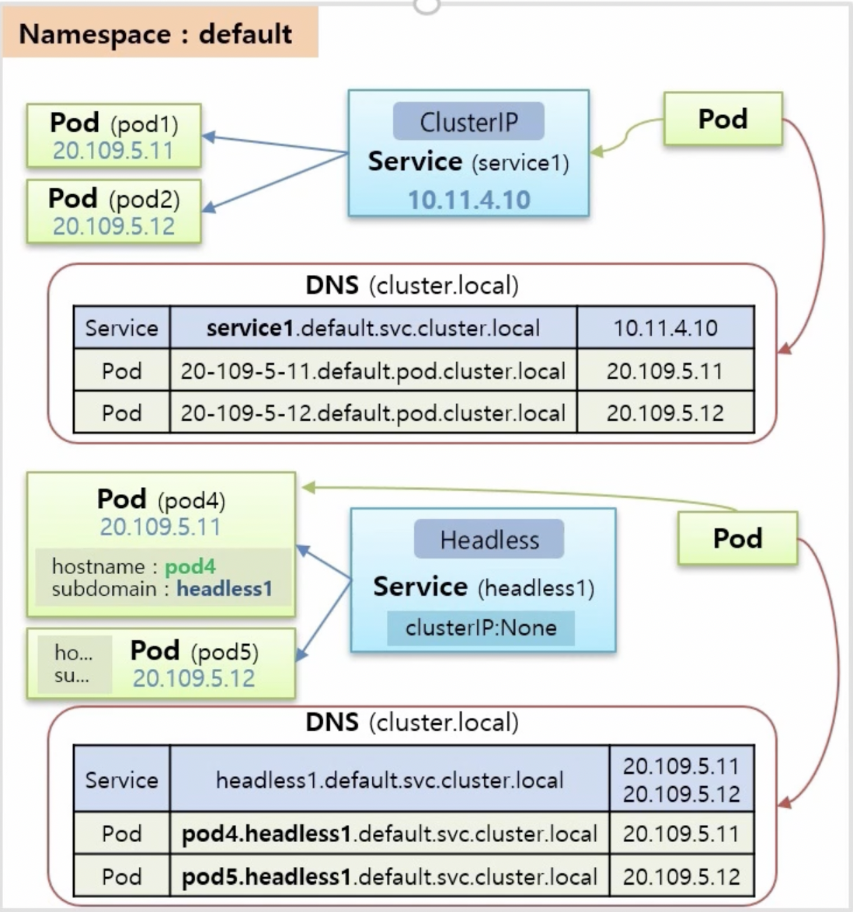

### Endpoint

- 기본적으로 `Service`와 `Pod`를 연결할 때 `Label`을 통해 연결한다. 그런데 `Label`은 사용자 측면에서 `Service`를 통해  
  `Pod`로 연결하기 위한 도구일 뿐이지, K8S는 `Endpoint`라는 것을 만들어줘서 실제 `Service`와 `Pod` 사이의 연결고리를  
  관리한다.

- K8S는 `Service`명과 동일한 이름으로 `Endpoint`의 이름을 설정하고, `Endpoint` 내에는 `Pod`에 접근하기 위한 정보들이  
  들어있다. 그렇기에 이 `Endpoint` 내에 만들어지는 정보들의 규칙을 알면 `Label`과 `Selector`를 만들지 않고 직접  
  연결할 수 있게 된다.

- 우선 `Service`와 `Pod`를 만들 때, 둘 다 `Label`이 없다면 이 둘은 일단 연결되지 않을 것이다.  
  이 상태에서 `Service`이름으로 `Endpoint`를 만들고, `Pod`의 정보를 직접 `Endpoint`에 넣게 되면 연결이 된다.  
  `Service`의 연결 대상을 사용자가 직접 지정해준 것인데, IP와 Port가 내부를 가리킬 수도 있고, 외부 IP 주소를 안다면  
  외부를 가리킬 수도 있다.


- 하지만 우리가 도메인명를 사용하는 이유는 IP의 변경 가능성 때문이다.  
  따라서 도메인이름을 지정하는 방법도 필요한데, 이때 사용하는 것이 `ExternalName`이다.

### ExternalName

- `Service`에 externalName이라는 속성을 달아, 이 안에 도메인 이름을 넣을 수 있는데, 이렇게 지정해주면  
  DNS Cache가 내부와 외부의 DNS를 찾아 IP를 알아낸다.

- 따라서 `Pod`가 externalName이 있는 `Service`를 가리키고만 있으면 `Service`에서 필요할 때마다  
  도메인명을 변경할 수 있어서 접속할 외부 도메인이 변경되더라도 `Pod`를 재생성 또는 재배포할 필요가 없다.

- 아래는 externalName을 사용하는 예시이다.

```yaml
apiVersion: v1
kind: Service
metadata:
  name: externalname1
spec:
  type: ExternalName
  externalName: github.github.io
```

<hr/>

## Volume - Dynamic Provisioning, StorageClass, Status, ReclaimPolicy

- `Volume`은 데이터를 안정적으로 유지하기 위해 사용하는 K8S Object이다. 그리고 실제 데이터들은  
  K8S Cluster와 분리되어 관리된다. 이렇게 관리하는 `Volume`들의 종류는 크게 내부망에서 관리하는 것들과  
  외부망에서 관리하는 것들로 분리해볼 수 있다. 외부망에 있는 `Volume`의 예시로는 AWS, GCP 등이 제공하는  
  Cloud Storage가 될 수 있다. 이들을 K8S Cluster에 연결해 사용하는 것이다. 내부망에는 K8S를 구성하는  
  `Node`들이 있는데, 기본적으로 K8S는 이 `Node`들의 실제 물리적인 공간에 데이터를 저장할 수 있는 hostPath,  
  local volume등이 있으며 별도의 온프레미스 형태로도 `Node`에 설치할 수 있다. 또한 NFS를 사용해 다른 서버를  
  `Volume` 자원으로 사용할 수 있다.

- 이렇게 많은 `Volume` 서비스들이 있는데, K8S Cluster 외부에 실제 `Volume`들이 많이 있다면 관리자는  
  `PV`를 만들어야 한다. 이 `PV`에 대해 저장 용량과 accessMode를 정하고, `Volume`을 선택해 연결한다.  
  그리고 사용자는 원하는 용량과 accessMode로 `PVC`를 만들면 K8S가 알아서 적절한 `PV`와 연결해주게 되며,  
  `PVC`를 `Pod`에서 사용할 수 있게 해준다.

- accessMode에는 아래의 세 가지가 있다.

  - RWO(ReadWriteOnce): 한 `Node`에서 읽기 쓰기 가능
  - ROM(ReadOnlyMany): 여러 `Node`에서 읽기만 가능
  - RWM(ReadWriteMany): 여러 `Node`에서 읽기, 쓰기 가능

- 하지만 위의 accessMode는 K8S에 이처럼 있다고 해서 실제 `Volume`들도 이를 모두 지원하지는 않는다.  
  각각의 `Volume`들마다 실제로 지원되는 accessMode가 다르다.

- 위처럼만 `Volume`을 사용한다면 `PV`, `PVC`를 만들고, 필요할 때마다 storage와 accessMode를 만들어 사용해야  
  하기 때문에 상당히 번거로울 수 있다. 이를 해결하기 위해 K8S에서는 `Dynamic Provisioning`이라는 기능을 제공한다.  
  이 기능은 사용자가 `PVC`를 만들면 알아서 `PV`를 만들어주고, 실제로 `Volume`과 연결해주도록 한다.

- 참고로 모든 `PV`에는 `Pod`와 마찬가지로 각각의 상태가 존재한다. 이 상태를 통해 `PV`가 `PVC`에 연결되어 있는 상태인지,  
  끊겼는지, 아니면 에러가 발생했는지 등을 파악할 수 있다.

### Dynamic Provisioning

- `Dynamic Provisioning`을 지원하는 `Volume`을 설치하면 `Service`, `Pod` 등 여러 Object들이 생성되지만, 이중  
  눈여겨 봐야할 것은 `StorageClass`이다. 이 `StorageClass`를 사용해 동적으로 `PV`를 만들 수 있는데, 우선 `PVC`를 보자.

> 여기서는 StorageOS 를 설치했다 가정한다.

- `PVC`를 만들 때 storage, accessMode 외에 storageClassName 이라는 부분이 있다. 이 부분에 위에서 생성된 `StorageClass`의  
  name을 넣으면 자동으로 StorageOS와 연결되는 `PV`가 생성된다. 또한 `StorageClass`는 추가로 만들수도 있고, default를  
  설정할 수도 있는데(name에 default 지정) 이런 default `StorageClass`를 만들어놓으면 `PVC`에 storageClassName을  
  생략했을 때 default `StorageClass`가 적용되어 `PV`가 생성된다.

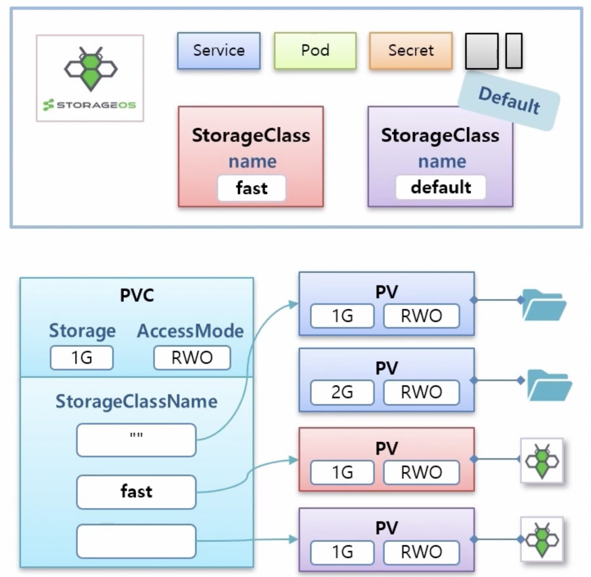

### Status & ReclaimPolicy

#### Status

- 최초 `PV`가 만들어졌을 때의 Status는 _Available_ 이다. 그리고 `PVC`와 연결되면 _Bound_ 상태로 변한다.  
  하지만 `PV`를 직접 만드는 경우에는 아직 `Volume`의 실제 데이터가 만들어진 상태는 아니고, `Pod`가 `PVC`를 사용해  
  구동이 될 때 실제 `Volume`이 만들어진다. 이렇게 서비스가 유지되다가 `Pod`가 삭제된다면 `PVC`와 `PV` 자체에는  
  아루런 변화가 없기 때문에 `Pod`가 삭제되더라도 데이터에는 문제가 없다. 하지만 `PVC`를 삭제한다면 `PV`와의 연결이  
  끊어지면서 `PV`의 상태가 _Released_ 로 변하게 된다. 또한, `PV`와 실제 `Volume`의 연결에 문제가 생긴다면  
  `PV`의 상태는 _Failed_ 가 된다.

- 위의 `PV`가 가지는 상태들 중 _Released_ 상태에서는 `PV`에 설정해놓은 ReclaimPolicy에 따라서 `PV`가 수행하는  
  동작들이 달라진다.

- RetainPolicy에는 _Retain, Delete, Recycle_ 의 세 가지가 있다.

  - _Retain_ : `PVC`가 삭제되면 `PV`의 상태가 _Released_ 상태가 되는데, 이는 `PV`를 만들 때 ReclaimPolicy를  
    별도로 설정하지 않았을 때 사용되는 기본 정책이며 실제 `Volume`의 데이터는 보존되지만, 이 `PV`를 다른 `PVC`에 연결할  
    수는 없다. 따라서 `PV`를 수동으로 만든 것처럼 삭제 또한 수동으로 해줘야 한다.

  - _Delete_ : `PVC`가 지워지면 `PV`도 함께 지워진다. 이는 `StorageClass`를 사용해 자동으로 만들어진 `PV`들이 갖는  
    기본 정책이며 `Volume`의 종류에 따라 데이터가 삭제되기도 하고, 유지되기도 한다. 삭제된 `PV`는 재사용 불가하다.

  - _Recycle_ : `PVC`가 지워지면 `PV`가 _Available_ 이 되면서 `PVC`에 다시 연결할 수 있는 상태가 된다.  
    하지만 이 정책은 현재 Deprecated된 상태이다. 실제 데이터는 삭제되며 `PV`는 재사용 가능하다.

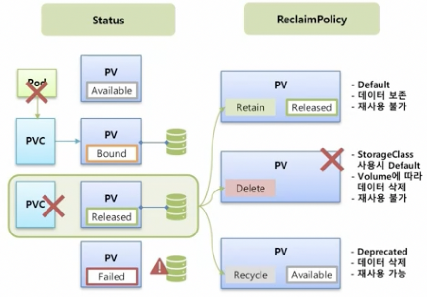

<hr/>

## K8S API 접근하기

- Master Node에 Kubernetes API Server가 있는데, 이 API Server를 통해서만 K8S에 자원을 만들거나 조회할 수 있다.  
  우리가 kubectl 명령어를 통해 CLI로 K8S 자원 정보를 조회할 수 있는 것도 모두 이 API Server에 접근하는 것이다.  
  반면, 외부에서 API Server에 접근하려면 인증서를 갖고 있는 사람만 https를 통해 보안 접근을 할 수 있다.  
  만약 내부 관리자가 kubectl을 통해 proxy를 열어줬다면 외부에서도 인증서 없이 http로 접근할 수 있다.

- 또한 kubectl 자체도 Master Node에만 설치할 수 있는게 아니라 외부 시스템에도 설치해서 사용할 수 있는데,  
  `Config` 기능을 활용하면 K8S Cluster가 여러 개 있을 때 간편한 명령으를 통해 접근하고 싶은 Cluster에  
  연결 상태를 유지할 수 있고, 연결된 상태에는 `kubectl get`으로 해당 Cluster에 있는 `Pod`들의 정보를 가져올 수 있다.

- 위는 사용자(User) 입장에서 API Server에 접근하는 방법이며, 이때 사용자들을 묶어 User Account라 한다.

- 이번에는 `Pod` 입장에서 보자. 모든 `Pod`가 API Server에 접근할 수 있다면, 누구나 `Pod`에 연결해 API Server로까지  
  연결할 수 있게 되기 때문에 보안상 문제가 생길 가능성이 커진다. 그래서 K8S는 `Pod`가 API Server로 접근하기 위해  
  Service Account라는 기능을 제공한다.

- 정리하자면 K8S에는 API Server에 접근할 때, User들을 위한 User Account와 `Pod`들을 위한 Service Account가  
  있는데, Service Account도 적절히 사용하면 User Account처럼 외부에서 접근하게 할 수도 있다.

- 위에서 본 모든 것이 K8S API Server에 접근하는 Authentication 과정이다. 이제 접근을 한 후, 필요한 자원에  
  대해 조회하기 위해 필요한 권한에 대해 알아보자.

- 두 개의 `Namespace` (Namespace1, Namespace2)가 있고, NamespaceA에는 Pod1, Pod2가, NamespaceB에는  
  Pod3이 있다 해보자. 이때, NamespaceB 내의 Pod3이 API Server에 접근할 수 있는 권한이 있다고 해서 NamespaceA에  
  대해 조회할 수 있을까? 이는 권한을 적절히 조절해 가능하게 또는 불가능하게 할 수 있다. 이런 권한을 조절하는 부분을  
  Authorization이라 한다.

- Authentication, Authorization까지 정상적으로 되었다면 마지막으로 Admission Control 과정을 거친다.  
  예를 들어, 관리자가 `PV`를 만들 때 Storage를 1G 이상으로 만들지 못하도록 설정해놨다면 `Pod`를 만들라는  
  요청이 생기면 K8S는 이를 검사해야 할 것이다.

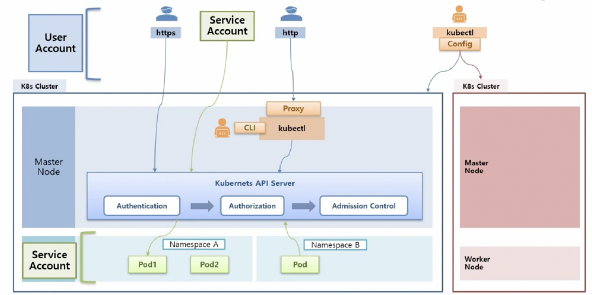

<hr/>

## Authentication - X509 Certificate, Kubectl, Service Account

- K8S API Server에 접근하는 세 가지 방법을 통해 Authentication을 알아보자.

### X509 Certificate

- 사용자(User)가 K8S API Server로 https를 통해 접속하려 한다 해보자.  
  기본적으로 K8S Cluster를 생성할 때 kubeconfig라고 해서, 이 Cluster에 접근하기 위한 정보들이  
  들어 있는 파일이 있다. 이 파일 내에는 CA crt, Client crt, Client key 등의 인증서 내용이 담겨있다.  
  따라서 User는 kubeconfig에서 Client crt, Client key를 가져와 사용하면 된다.

- 인증에 필요한 정보들을 무엇이며 어떻게 만드는지 살펴보자. 우선 최초에 CA Key(발급 기관 개인 키)와  
  Client Key(클라이언트 개인 키)를 만들고 이 두 개의 개인 키를 갖고 인증서를 만들기 위한 인증 요청서라는  
  csr 파일을 만든다.(CA Key -> CA csr, Client Key -> Client csr).  
  CA 의 경우에는 CA csr를 갖고 바로 CA crt(CA 인증서)를 만드는데, 이는 kubeconfig에 들어가는 정보이다.  
  반면 Client crt(Client 인증서)의 경우에는 CA Key, CA crt, Client csr를 모두 합쳐 만들어진다.  
  이렇게 만들어진 Client crt 또한 kubeconfig에 들어있으며 Client Key 또한 들어 있다.

- K8S를 설치할 때 kubectl도 설치하고, 설정 내용 중에 kubeconfig를 kubectl에서 사용할 수 있도록  
  통째로 복사하는 과정이 있는데, 이 과정 덕분에 User는 kubetcl로 K8S API Server에 접근할 수 있는 것이다.  
  또한 kubectl의 accept-hosts 속성을 통해 Proxy를 열어두면 외부에서도 http로 접근할 수 있게 된다.

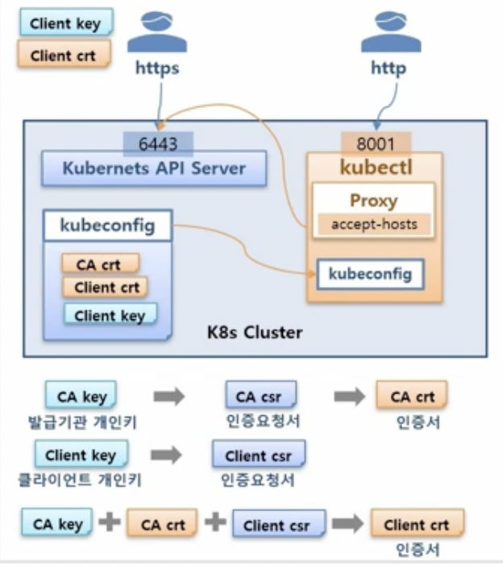

### kubectl

- 다음으로 외부 서버에 kubectl을 설치해 두 개 이상의 K8S Cluster에 접근하는 과정을 보자.  
  이를 가능하게 하기 위해서는 사전에 각 Cluster에 있는 kubeconfig 파일이 외부 서버에 있는  
  kubectl에도 있어야 한다.

- kubeconfig 파일 내의 내용에 대해 조금 더 자세히 살펴보자.  
  kubeconfig에는 clusters라는 항목으로 cluster 정보를 등록할 수 있고, 내용으로는  
  이름(name)과 url(연결 정보), 그리고 CA crt가 있다. 또한 users라는 항목으로  
  사용자(User)를 등록할 수 있는데, 내용으로는 name과 해당 User에 대한 Client crt와  
  Client key가 있다.

- 이렇게 clusters와 users가 있다면 contexts 항목을 통해 이 둘을 연결할 수 있는데,  
  contexts의 내용으로는 name과 연결한 cluster의 name, 그리고 User의 name이 있다.

- 아래 그림처럼 kubeconfig가 구성되어 있을 때, 사용자는 `kubectl config user-context context-A`  
  명령어를 사용해 Cluster-A에 연결할 수 있다.

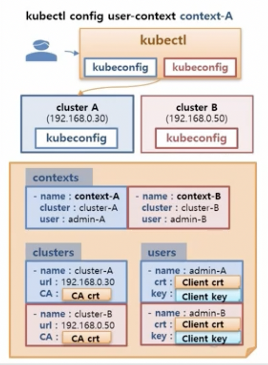

### Service Account

- K8S Cluster와 API Server가 있고, Namespace(nm-01)를 만들게 되면 기본적으로 default라는  
  이름을 가진 `ServiceAccount`가 자동으로 만들어진다. 그리고 이 `ServiceAccount`에는 하나의  
  `Secret`이 연결되어 있는데, 내용으로는 CA crt와 token이 있다. 이후 `Pod`를 만들면 이  
  `ServiceAccount`와 연결되고 `Pod`는 token을 통해 API Server와 연결할 수 있다.  
  결국 token값만 알면 사용자도 이 token을 통해 API Server에 접근할 수 있다.

> token을 사용할 때는 Authorization header에 Bearer Scheme으로 전달한다.

<hr/>

## Authorization - RBAC, Role, RoleBinding

### RBAC(Role, RoleBinding) Overview

- K8S가 자원에 대한 권한을 지정하는 방식에는 여러 가지가 있지만 이중 가장 많이 사용되는 RBAC에 대해  
  알아보자. RBAC(Role-Based Access Control)는 역할 기반으로 권한을 부여하는 방식이며,  
  `Role`과 `RoleBinding`이라는 Object가 그 기능을 하는데, 어떻게 쓰이는지 보자.

- K8S에는 자원이 크게 `Node`, `PV`, `Namespace`등과 같이 Cluster 단위로 관리되는 자원과  
  `Pod`, `Service`와 같이 `Namespace` 단위로 관리되는 자원으로 나눠진다.  
  또한 `Namespace`를 만들면 자동으로 `ServiceAccount`가 생성되기도 하고 추가적으로 만들 수도 있는데,  
  `ServiceAccount`에 `Role`과 `RoleBinding`을 어떻게 설정하느냐에 따라 `ServiceAccount`는  
  해당 `Namespace` 내에 있는 자원에만 접근이 가능할 수도 있고, `Cluster`에 있는 자원에도 접근할 수  
  있게 된다.

- 먼저 `Role`은 여러 개를 만들 수 있으며 각 `Role`에는 `Namespace`내의 자원에 대해 조회(read)만  
  가능하거나 생성(write)만 가능하도록 권한을 지정할 수도 있고 여러 가지 권한을 가질 수도 있다.

- `RoleBinding`은 `Role`과 `ServiceAccount`를 연결해주는 역할을 담당하는데, `Role`은 하나만  
  지정할 수 있으며 `ServiceAccount`는 여러 개 지정할 수 있다.  
  예를 들어, 아래 그림처럼 되어 있다면 2개의 `ServiceAccount`(SA, SA1)들은 Role1에 지정되어 있는  
  권한으로 API Server에 접근하게 된다.

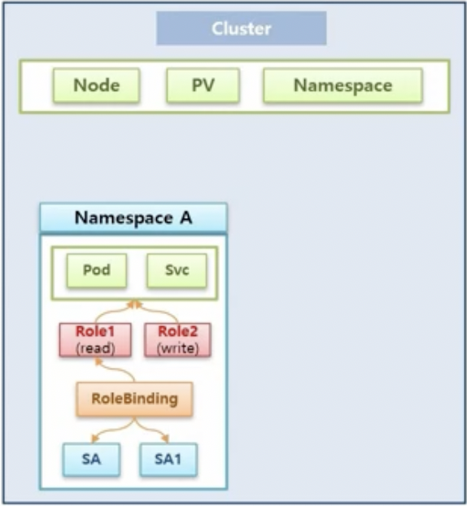

- 이렇게 한 `Namespace` 내에 권한을 부여할 때는 `Role`과 `RoleBinding`을 여러 개 만들어 관리하면 된다.

- 이번에는 `ServiceAccount`에서 Cluster 자원에 접근하는 경우에 대해 알아보자.  
  이를 하기 위해선 우선 `ClusterRole`과 `ClusterRoleBinding`이 먼저 만들어져 있어야 한다.  
  `ClusterRole`은 Cluster 단위의 자원들을 지정할 수 있다는 점이 `Role`과의 차이점이며, 기능은 동일하다.  
  따라서 `ClusterRoleBinding`에 `ServiceAccount`를 추가하게 되면, 해당 `ServiceAccount`가  
  Cluster 단위의 자원에 접근할 수 있는 권한을 얻게 되는 것이다.

- 다른 케이스로 `Namespace` 내에 있는 `RoleBinding`이 `ServiceAccount`와 연결이 되어 있고,  
  `RoleBinding`에 `Role`을 지정할 때 `Namespace`내에 있는 `Role`이 아닌 `ClusterRole`을  
  지정할 수도 있는데, 이 경우 `ServiceAccount`는 Cluster 자원에는 접근하지 못하고 자신의  
  `Namespace` 내에 있는 자원에만 접근할 수 있다. 결국 그냥 `Role`을 만들어 사용하는 것과 같게 되는데,  
  그럼 왜 `ClusterRole`을 만들어 사용할까?

- 그 이유는 관리의 수월함 때문이다. 만약 모든 `Namespace`마다 각각 동일한 `Role`을 만들어 사용하고  
  관리해야 한다면 `Role`에 대해 변경이 필요할 때 모든 `Role`들을 각각 수정해줘야 하는데, 이렇게 한다면  
  누락되는 `Role`이 생기는 등 관리하기 매우 불편할 것이다. 따라서 이를 해결하기 위해 `ClusterRole` 하나를  
  만들어 놓고, 모든 `Namespace`에 있는 `RoleBinding`이 이 `ClusterRole`을 지정하게 된다면  
  추후 권한에 대해 변경 사항이 있을 때 `ClusterRole` 하나만 수정하면 된다.

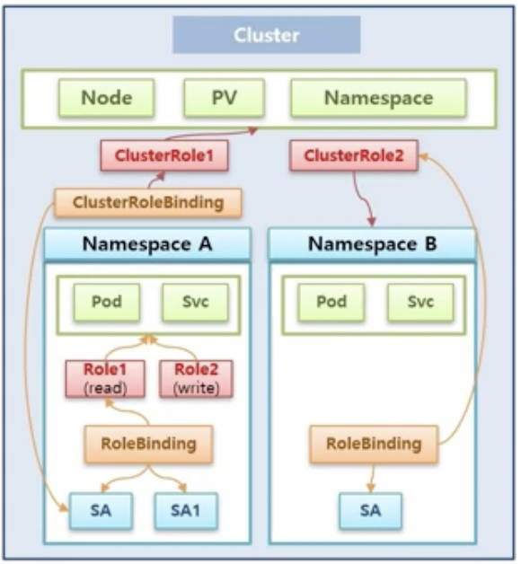

### Role, RoleBinding

- 조금 더 `Role`과 `RoleBinding`에 대해 상세하게 살펴보자.

- 우선 `Namespace`를 만들고, 그 안에 `Pod`와 `Service`가 있다고 해보자. 이전에 본 것처럼  
  `Namespace`가 만들어질 때 자동 생성되는 `ServiceAccount`와 그에 연결된 `Secret`도  
  있을 것이다. 이때 `Role`을 만들어보자. 만들 `Role`의 내용에는 apiGroups, resources, verbs를  
  지정할 수 있다. `Pod`에 대해 `Role`을 만든다면 apiGroups에는 `[""]`, resources에는 `[pods]`,  
  그리고 verbs에는 `[get, list]` 등을 지정할 수 있다.

> `Pod`는 Core API 이기에 apiGroups에 내용을 넣지 않아도 된다.

- 만약 `Role`이 가리키는 자원이 `Pod`가 아닌 `Job`이라면 apiGroups에는 `["batch"]`, resources에는  
  `[jobs]`를 넣어줄 수도 있을 것이다.

- 마지막으로 `RoleBinding`을 만드는데, roleRef 속성에는 위에서 만든 `Role`을, 그리고 subjects 속성에는  
  `ServiceAccount` 정보를 넣어주면 된다.

- 아래 그림처럼 구성되어 있다면, 사용자는 `Secret`에 있는 token 값을 가지고 API Server에 접근할 수  
  있게 되며 token에 담긴 권한에 따라 조회할 수 있는 자원(수행할 수 있는 작업)의 범위가 달라진다.

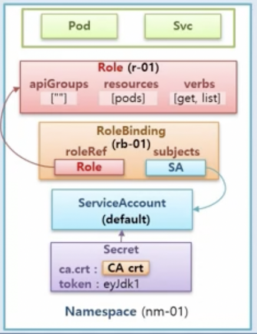

- 위 케이스의 yml 설정 내용들은 아래와 같다.

```yaml
# yaml file for Role
apiVersion: rbac.authorization.k8s.io/v1
kind: Role
metadata:
  name: r-01
  namespace: nm-01
roles:
- apiGroups: [""]
  resources: ["pods"]
  verbs: ["get", "list"]

# yaml file for RoleBinding
apiVersion: rbac.authorization.k8s.io/v1
kind: RoleBinding
metadata:
  name: rb-01
  namespace: nm-01
roleRef:
  apiGroup: rbac.authorization.k8s.io
  kind: Role
  name: r-01
subjects:
- kind: ServiceAccount
  name: default
  namespace: nm-01
```

- 또다른 케이스를 보자. 마찬가지로 `Namespace`를 만들어서 기본적으로 생성된 `ServiceAccount`와  
  `Secret`이 있다. 하지만 이번에는 해당 `ServiceAccount`가 마치 관리자처럼 모든 Cluster 내의  
  자원에 접근하도록 만들어보려 한다.

- 이렇게 하기 위해선 먼저 `ClusterRole`에 apiGroups에는 `[*]`를, resources에는 `[*]`를,  
  verbs에는 `[*]`를 넣어주면 된다.(모든 자원에 대한 접근 권한 부여) 그리고 `ClusterRoleBinding`을  
  만들어서 roleRef 속성에는 `ClusterRole`를, subjects 속성에는 `ServiceAccount`를 넣어주면 된다.

- 이렇게 구성하고 `Secret`에 있는 token을 사용해 API Server에 접근하면 다른 `Namespace`에 있는  
  자원은 물론, Cluster 단위의 자원에 대해서도 조회 및 생성이 가능하다.

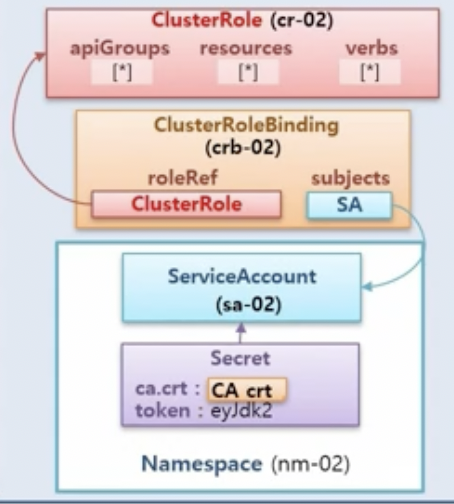

- 아래는 위 케이스의 자원을 만드는 yaml 파일 내용이다.

```yaml
# yaml file for ClusterRole, Role 생성과는 달리 Cluster단위이기에 metadata에
# namespace를 지정하지 않는다.
apiVersion: rbac.authorization.k8s.io/v1
kind: ClusterRole
metadata:
  name: cr-02
rules:
  - apiGroups: ["*"]
    resources: ["*"]
    verbs: ["*"]

# yaml file for ClusterRoleBinding
apiVersion: rbac.authorization.k8s.io/v1
kind: ClusterRoleBinding
metadata:
  name: rb-02
roleRef:
  apiGroup: rbac.authorization.k8s.io
  kind: ClusterRole
  name: cr-02
subjects:
- kind: ServiceAccount
  name: default
  namespace: nm-02
```
