# Controllers

## StatefulSet

- 애플리케이션은 대표적으로 Stateless Application과 Stateful Application으로 분류된다.

- Stateless Application

  - 대표적으로 Web Server가 있으며 Apahe, NginX 등이 있다.
  - 애플리케이션이 여러 개 배포되어도 다 똑같은 서비스 역할을 한다.

- Stateful Application

  - 대표적으로 Database가 있으며, MariaDB, Redis, MongoDB 등이 있다.
  - 각각의 애플리케이션마다 자신의 역할이 있다. MongoDB를 예로 들자면 Primary, Secondary, Arbiter 역할이 있는데  
    Primary는 Main Database의 역할을 하며 Primary가 죽으면 Arbiter가 이를 감지해 Secondary가 Primary의  
    역할을 대신할 수 있도록 해준다.

- 위처럼 단순 복제인 Stateless Application과 달리, Stateful Application은 각 애플리케이션 마다  
  자신의 고유 역할을 갖고 있다. 그래서 만약 애플리케이션 중 하나가 다운되면, Statelss Application은  
  단순히 같은 서비스의 역할을 하는 애플리케이션을 복제해주면 되고, Stateful Application의 경우 위에서 본  
  Arbiter역할을 하는 애플리케이션이 죽으면 반드시 Abriter역할을 하는 애플리케이션을 다시 생성해줘야 한다.

- 또 다른 차이점으로 Statelss Application은 `Volume`이 반드시 필요하지는 않다. 만약 애플리케이션의 로그를 영구적으로  
  저장하고 싶은 경우, `Volume`에 연결하면 된다. 반면 Stateful Application은 각각의 역할이 다른 만큼, `Volume` 또한  
  각각 써야 한다. 그래샤 Arbiter 역할의 애플리케이션이 죽어도, 새로운 애플리케이션이 기존 Arbiter가 연결되어 있던  
  `Volume`과 연결되면서 해당 역할을 이어갈 수 있다.

- 또한 애플리케이션이 연결되는 대상과 네트워킹 흐름에 대한 차이점도 있다. Stateless Application은 대체로 사용자들이 접속하며,  
  로드밸런서 등에 의해 여러 애플리케이션으로 트래픽이 분산된다. 반면 Stateful Application은 대체로 내부 시스템들이 데이터베이스  
  저장을 위해 연결하며 이때 트래픽은 각 애플리케이션의 특징에 맞게 분류되어야 한다. 예를 들어 Primary는 Read/Write의 권한이  
  있기 때문에 연결하려는 시스템에서 CRUD 연산을 모두 하려면 Primary에 접속해야 하며 Secondary는 Read의 권한만 있기 때문에  
  READ 연산만 하는 시스템은 트래픽 분산을 위해 Secondary로 접속되어야 한다. 마지막으로 Arbiter는 Primary와 Secondary의  
  상태를 감시하고 있어야하기 때문에 Primary와 Secondary에 연결되어야 한다.  
  이렇게 Stateful Application은 역할에 따라 의도적으로 다른 애플리케이션에 연결되며 Stateless Application은 단순 분산의  
  목적만을 가진다.

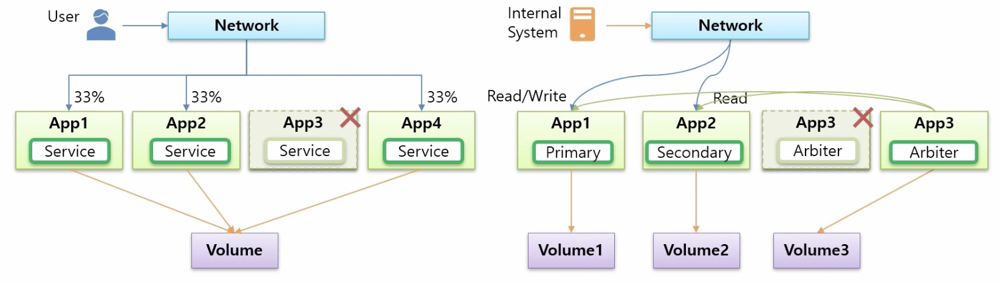

- K8S에는 이러한 두 애플리케이션의 특징에 따라 각각 `Controller`를 제공하는데, Stateless Application은  
  `ReplicaSet`, Stateful Application은 `StatefulSet`을 제공한다.

- `StatefulSet`은 Stateful Application을 관리할 수 있도록 지원한다. 목적에 따라 적절한 `Pod`에 연결하기 위해  
  `Pod`에 `Headless Service`를 달아주면 된다.

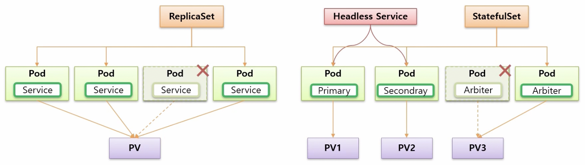

### StatefulSet과 ReplicaSet의 Controller 관점에서의 차이

- `StatefulSet`은 `Controller` 이며, 이 `Controller`의 특징을 `ReplicaSet`과 비교해가며 알아보자.

- 먼저 `replicas:1`로 `Controller`를 만들면, `ReplicaSet`과 마찬가지로 `StatefulSet`도 1개의 `Pod`를 생성한다.  
  이때 차이점은 `ReplicaSet`은 `Pod`의 이름이 random하게 부여되는 반면, `StatefulSet`은 0부터 순차적으로 Ordinal Index가  
  부여된 이름으로 생성된다.

- 만약 `replicas:3`으로 개수를 늘려보면 어떻게 될까? `ReplicaSet`은 두 개의 추가적인 `Pod`가 동시에 생성되고, 이름 또한  
  random하게 부여되는 것에 반해 `StatefulSet`의 경우에는 `Pod`가 하나씩 순차적으로 생성된다. 이름 또한 1, 2가 부여된다.  
  이 상황에서 하나의 `Pod`가 죽으면, `ReplicaSet`은 또 새로운 임의의 이름을 가진 `Pod`가 생성되는 반면, `StatefulSet`은  
  죽은 `Pod`의 이름 그대로를 가진 새로운 `Pod`를 만든다.

- 기존에 `replicas:3`으로 3개의 `Pod`가 있는 상태에서 `replicas:0`으로 개수를 줄이면 `ReplicaSet`은 모든 기존의 `Pod`가  
  동시에 삭제되는 반면, `StatefulSet`은 index가 높은 `Pod`부터 순차적으로 삭제한다.

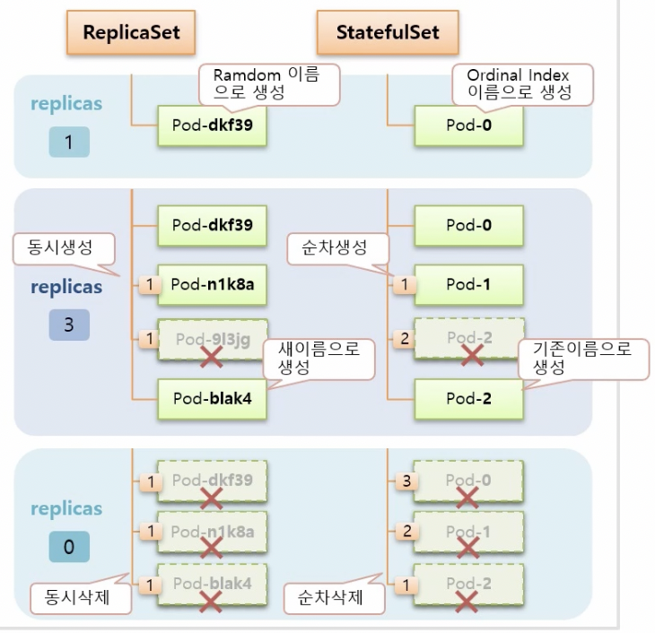

### Stateful과 ReplicaSet의 PVC, Headless Service를 연결하는 부분의 차이

- `ReplicaSet`의 경우에는 `Pod`에 `Volume`을 연결하기 위해서 `PVC`를 별도로 직접 생성해야 한다.  
  예를 들어 PVC1이라는 `PVC`를 만들었다면, `ReplicaSet`의 template에 `Pod`의 내용에 persistentVolumeClaim  
  속성에 PVC1을 지정해줘야 한다. 반면 `StatefulSet`의 경우에는 template을 통해 `Pod`가 만들어지고 추가적으로  
  volumeClaimTemplates가 있는데, 이를 통해 `PVC`를 동적으로 생성되고, `Pod`와도 바로 연결되게끔 한다.

- `replicas:3`으로 개수를 늘리면 `ReplicaSet`은 모든 `Pod`들이 동일한 `PVC`(PVC1)을 통해 `PV`와 연결되는 반면,  
  `StatefulSet`은 volumeClaimTemplates 때문에 `Pod`가 추가될 때마다 각각 동적으로 생성된 새로운 `PVC`에 연결된다.  
  그래서 `Pod`마다 각자의 역할에 따른 데이터를 저장할 수 있게 되는 것이다. 만약 Pod2가 삭제되면, 기존 Pod2가 연결되었던  
  `PVC`에 연결이 된다.

- 한 가지 주의할 점이 있는데, `ReplicaSet`의 경우에 만약 `PVC`가 Node1이라는 `Node`에 만들어졌다면, 해당 `PVC`에  
  연결하는 `Pod`도 항상 Node1 상에 만들어져 있어야 한다. 반면, `StatefulSet`의 경우에는 동적으로 `Pod`과 `PVC`가  
  동일한 `Node`상에 만들어지기 때문에 알아서 모든 `Node`에 균등하게 배포된다.

- 또한 `replicas:0`으로 모든 `Pod`를 지우려 하면 `StatefulSet`은 `Pod`를 index가 높은 순서부터 순차적으로  
  하나씩 삭제하지만, `PVC`는 삭제하지 않는다. `Volume`은 함부로 지우면 안되기 때문에 삭제하기 위해선 사용자가 직접  
  삭제해야 한다.

- 마지막으로 `StatefulSet`을 만들 때 serviceName 속성에 `Service`의 이름을 지정할 수 있는데, 만약 이 이름과 맞는  
  `Headless Service`를 만들게 되면 `Pod`에 예측 가능한 도메인 이름이 만들어지기 때문에 Internal Server에 있는  
  특정 `Pod`가 `StatefulSet`이 관리하는 특정 `Pod`에 연결할 수 있다. 따라서 상황에 따라 `Pod`를 선택해 접속할 수  
  있게 되는 것이다.

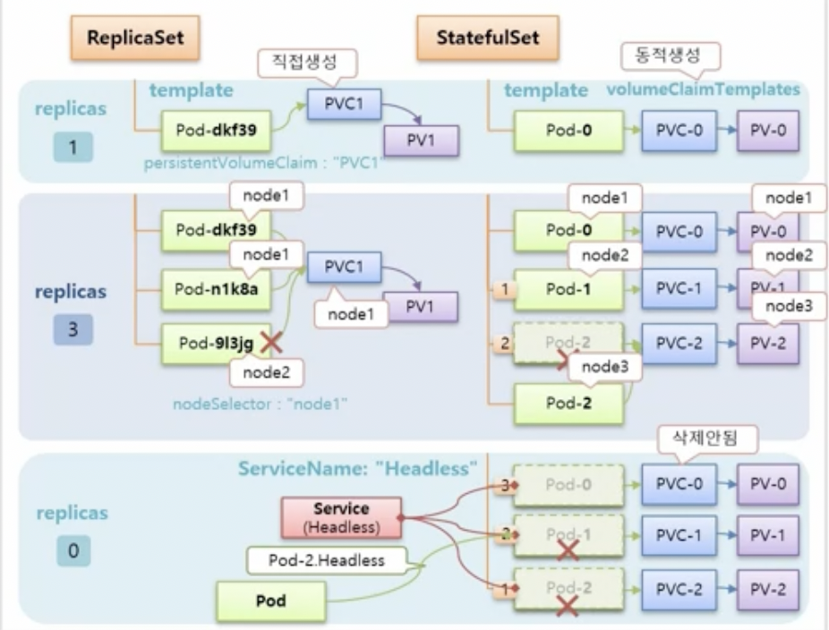

<hr/>

## Ingress - Nginx

- `Ingress`의 사용 목적으로는 대표적으로 Service Loadbalancing과 Canary Upgrade가 있다.

### Ingress Use Case - Service Loadbalancing

- 쇼핑몰을 운영 중이라 가정해보자. 3개의 `Pod`가 있고, 각각 쇼핑 페이지, 고객 센터, 배송 서비스를 담당한다.  
  이렇게 애플리케이션을 분리하면 쇼핑 페이지에 문제가 생겨도 고객 센터나 배송 서비스를 제공하는 데에는 아무런  
  문제가 생기지 않도록 할 수 있다. 또한 이 3개의 `Pod`에는 외부에서 연결할 수 있도록 각각 `Service`가 있다.  
  사용자들은 쇼핑 페이지에는 `www.mall.com`, 고객 센터에는 `www.mall.com/customer`, 그리고 배송 서비스로는  
  `www.mall.com/order`로 접근할 수 있다.

- 위와 같은 상황을 만들고 싶다면, 일반적으로는 각각의 path에 따라 각 `Service`의 IP를 이어줄 수 있는  
  L4 또는 L7 Switch 장비가 있어야 한다. 하지만 K8S에서는 `Ingress`라는 Object가 그 역할을 대신해준다.

- `Ingress`를 사용하면 별도의 IP loadbalancing을 위한 장비가 필요없게 된다.

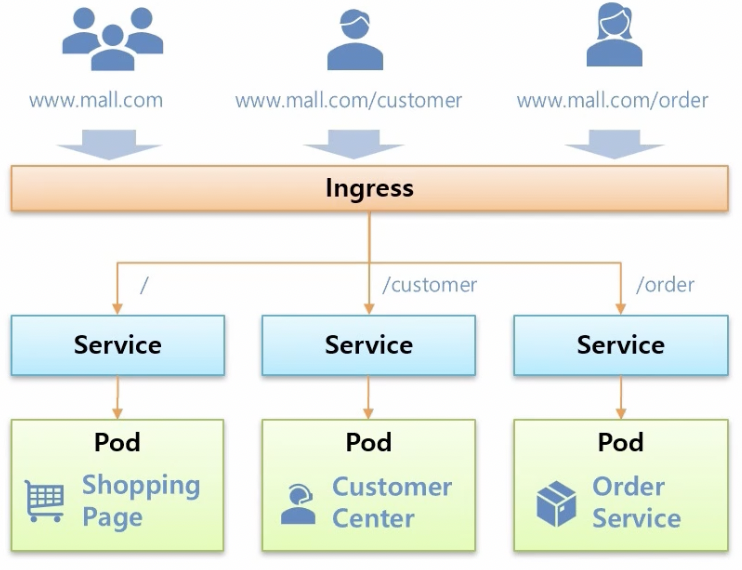

### Ingress Use Case - Canary Upgrade

- `Ingress`를 사용하면 Canary Upgrade 또한 쉽게 진행할 수 있다.

- 예르 들어 V1 애플리케이션이 구동되는 상태에서 테스트를 위해 V2를 구동시킨다고 해보자.  
  V1, V2는 각각 다른 `Service`에 연결되어 있는데 이 상황에서 `Ingress`를 만들어 이 두 개의 `Service`에 연결하면  
  사용자가 `Ingress`를 통해 접근했을 때 예를 들어 10%의 트래픽만 V2로 전달되도록 할 수 있다. 이 퍼센트 수치를 변경하거나,  
  연결 시 헤더에 있는 정보로 트래픽을 조정할 수도 있다.

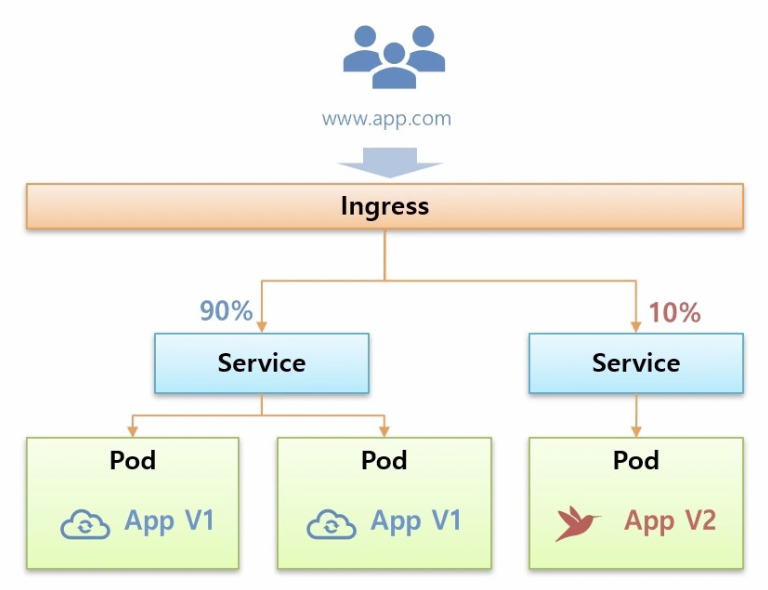

### Ingress Controller

- `Ingress`는 K8S가 설치되어 있다면 바로 만들 수 있다.  
  이 Object에는 host로 도메인명을 넣을 수 있고, path에 따라 연결될 `Service`를 넣을 수 있다.  
  하지만 `Ingress`만 만들었다 해서 작동되지는 않는다. 왜냐면 아직 이 규칙을 실행할 구현체가 없기 때문이다.  
  K8S에서는 이 구현체를 사용하기 위해 별도의 플러그인을 설치해 사용해야 한다.

- 이와 같은 플러그인들을 `Ingress Controller`라 하며, 대표적으로 Nginx, Kong이 있다.  
  여기서는 Nginx를 설치했다고 해보자.

- Nginx를 설치하게 되면 Nginx에 대한 `Namespace`가 생기며 그 안에 `Deployment`와 `ReplicaSet`이 만들어지면서  
  실제 `Ingress`의 구현체인 Nginx `Pod`가 만들어진다. 만들어진 `Pod`는 `Ingress`의 규칙을 보고 규칙이 있다면  
  그 규칙대로 `Service`에 연결해주는 역할을 담당한다. 그래서 규칙에 따라 해당 `Service`에 맞게 트래픽이 전달되려면  
  외부에서 접근하는 사용자들의 트래픽은 Nginx `Pod`를 지나가야 하기 때문에 외부에서 접근 가능한 `Service`를 하나  
  만들어서 Nginx `Pod`에 연결해줘야 한다. 직접 K8S를 설치했다면 `NodePort`를 만들어 외부에 연결할 수 있고,  
  Cloud Service를 이용하고 있다면 `LoadBalancer` 타입의 `Service`를 만들어 외부에 연결할 수 있을 것이다.

- 위 과정이 모두 완료되면 `Ingress` 규칙에 지정한 도메인으로 접근이 오면 `Service`를 통해 Nginx `Pod`로 트래픽이  
  전달돼서 `Ingress` 규칙에 따라 지정된 `Service`와 `Pod`에 접근할 수 있게 된다.

- 또한 두 개 이상의 `Ingress`를 만들 수도 았으며, path를 지정하지 않고 바로 `Service`로 연결되게 설정할 수도 있다.

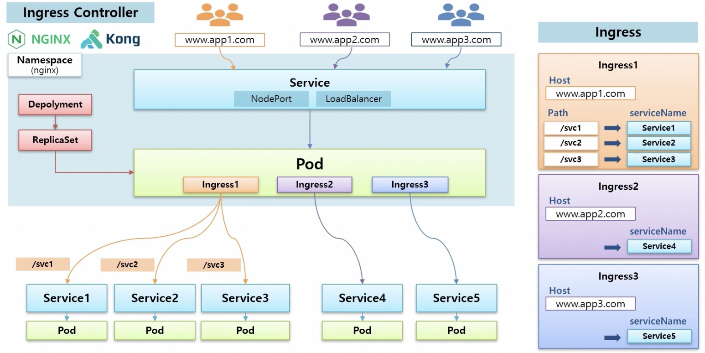

### Ingress - Service Loadbalancing

- 이전과 마찬가지 상황의 쇼핑몰 상황을 떠올려보자. 다만 이번에는 사전에 Nginx가 설치되어 있고 Nginx를 설치하며 만들어진  
  `Pod`에 외부로의 연결이 가능하게 해주는 `NodePort` 성격의 `Service`가 연결되어 있다고 하자.

- 이렇게 환경이 구성된 상태에서 `Ingress`를 만들고 규칙을 각 path에 맞는 `Service`로 지정해주었다.

- 별도의 도메인 이름은 주지 않았기에 사용자가 `Node`의 IP + `NodePort`로 인해 열린 port 번호로 접근하면  
  알맞은 페이지로 접근될 것이다.

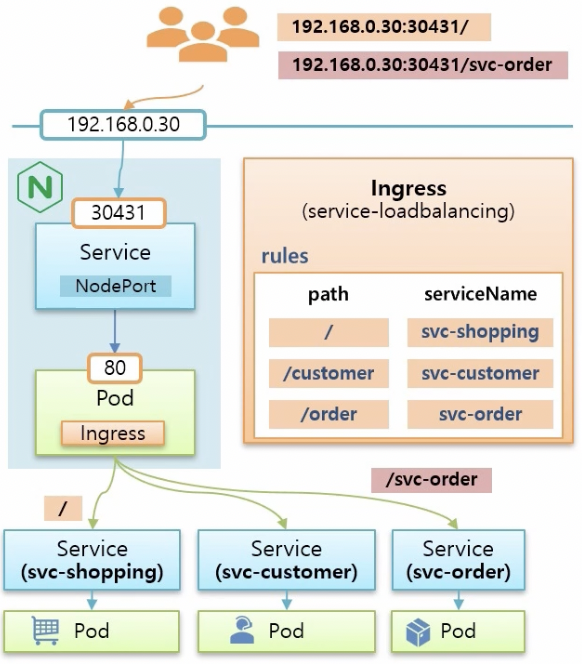

### Ingress - Canary Upgrade

- 이번에는 `www.app.com`으로 사용자가 접근하면 svc-v1이라는 `Service`로 연결되도록 구성되어 있다고 하자.  
  (host: www.app.com, serviceName: svc-v1인 `Ingress`가 있다.)
  이 상황에서 Canary Upgrade를 테스트할 `Pod`와 `Service`(svc-v2)를 띄웠다고 하자.  
  이를 위해 host: www.app.com, serviceName: svc-v2인 `Ingress`를 하나 더 생성한다.

- 이렇게 되면 Nginx `Pod`에서 svc-v2로의 연결고리가 만들어진다. 이때 새로 만든 `Ingress`에  
  @weight: 10% 라는 어노테이션을 지정하면 트래픽의 10%가 svc-v2로 전달되게 된다.  
  또한 @header 옵션을 사용할 수 있는데, 예를 들어 특정 나라별로 테스트하고 싶다고 하자.  
  `Language: kr` 헤더를 가진 트래픽이 온다면 해당 트래픽들을 모두 svc-v2로 전달되게 할 수 있다.

- 위 예시 외에도 `Ingress`에 다양한 어노테이션을 지정하면 Nginx의 다양한 기능들을 사용할 수 있다.

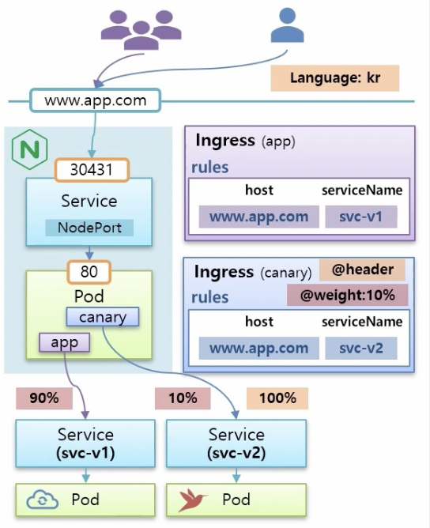

- @weight: 10% 를 사용하는 yaml 파일은 아래와 같다.

```yaml
apiVersion: network.k8s.io/v1beta1
kind: Ingress
metadata:
  name: canary-v2
  annotations:
    nginx.ingress.kubernetes.io/canary: "true"
    nginx.ingress.kubernetes.io/canary-weight: "10"
spec:
  rules:
  - host: www.app.com
    http:
      paths:
      - backend:
        serviceName: svc-v2
	servicePort: 8080
```

- @header 어노테이션을 사용하는 yaml 파일은 아래와 같다.

```yaml
apiVersion: network.k8s.io/v1beta1
kind: Ingress
metadata:
  name: canary-kr
  annotations:
    nginx.ingress.kubernetes.io/canary: "true"
    nginx.ingress.kubernetes.io/canary-by-header: "Accept-Language"
    nginx.ingress.kubernetes.io/canary-header-value: "kr"
spec:
  rules:
  - host: www.app.com
    http:
      paths:
      - backend:
        serviceName: svc-v2
	servicePort: 8080
```

### Ingress - HTTPS

- `Ingress`를 통해서 HTTPS로 연결할 수 있도록 인증서 관리도 할 수 있다. 이 기능은 `Pod` 자체에서 인증서 기능을  
  제공하기 어려울 때 사용하기 좋다.

- Canary Upgrade와 마찬가지의 상황이 있는데, 하나의 차이점이 있다면 Nginx `Pod`로 HTTPS를 사용하려면  
  443번 port로 연결해야 한다. `Ingress`를 만들 때는 기존과 마찬가지로 rules 옵션에 host와 serviceName을 적절하게  
  지정해주면 되는데, 추가적으로 tls라는 옵션이 있다. 이 옵션의 secretName에 실제 `Secret` Object의 이름을 지정해  
  `Secret`과 연결할 수 있다. `Secret`은 data에 인증값들을 갖고 있는데, 이렇게 구성하면 사용자는 항상  
  `https://abcd.com` 으로 접근할 수 있게 된다.

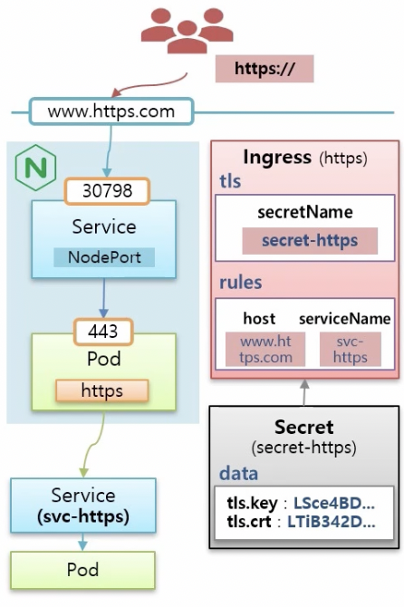

<hr/>

## Autoscaler - HPA

- K8S의 Autoscaler에는 세 가지 종류가 있다.

### HPA(Horizontal Pod Autoscaler) - Pod 개수 증가

- `Controller`가 있고, 지정된 replicas 수에 따라 `Pod`가 있어 운영 중인 상태라고 해보자. 그리고 `Service`도 있어 모든  
  트래픽이 `Pod`로 흐르고 있는 상황이다. 트래픽이 많아져 `Pod`가 사용할 수 있는 리소스를 모두 사용하게 된다면 `Pod`가 죽을 수도 있다.  
  하지만 사전에 `HPA`를 만들고 `Controller`에 연결해 놓았다면 `HPA`가 `Pod`의 리소스 상태를 감시하고 있다가 위험한 상황,  
  즉 리소스를 거의 다 사용하는 상황이 오게 되면 `Controller`의 replicas를 높여준다. 이에 의해 `Controller`는 `Pod`를  
  하나 더 만들게 된다.(Scale out)

- 반대로 다시 트래픽이 감소해 리소스 사용량이 줄게 되면 `Pod`가 삭제된다.(Scale in)

- 위처럼 개념적으로 매우 쉽고, 사용하기도 편리하지만 권장되는 조건들이 있다.

  - 기동이 빠르게 되는 애플리케이션 : `HPA`는 장애를 대비해 생긴 기능이고, 장애 상황에는 빠른 복구가 중요하기 때문에  
    애플리케이션 자체가 기동되는 시간이 길다면 효과적이지 못할 것이다.
  - Stateless Application: `Pod`마다 각각 역할이 있는 Stateful Application에 대해서 `HPA`를 사용한다면,  
    `Pod`가 죽으면 해당 역할을 하는 `Pod`를 재생성해야 하는데, `HPA`는 어떤 `Pod`를 생성해야 할지에 대해 알지 못한다.

### VPA(Vertical Pod Autoscaler) - Pod 리소스 증가

- `VPA`는 Stateful Application을 위한 Autoscaler이다.

- `Controller`에 위와 마찬가지로 replicas:1 이 지정되어 있어 하나의 `Pod`가 있다고 하자. 이 `Pod`의 리소스 자원이  
  모두 사용되는 시점이 생긴다면 그냥 둔다면 `Pod`가 죽겠지만, `VPA`를 `Controller`에 연결해놓았다면 `VPA`가 `Pod`의  
  리소스 사용량을 감지하고 있다가 리소스를 거의 다 사용하게 된다면 `Pod`의 리소스를 증가(Scale up)해준다.  
  반대는 Scale down이다.

- 따라서 `VPA`는 Stateful Application에 대해 Auto Scaling을 하고 싶을 때 사용하면 된다.  
  주의 사항으로는 한 `Controller`에 `VPA`와 `HPA`를 모두 연결하면, 기능이 작동하지 않는다.

### CA(Cluster Autoscaler) - Cluster에 Node 추가

- `Cluster` 내의 모든 `Node`에 자원이 없을 경우, `CA`를 사용하면 동적으로 Worker Node를 추가시킬 수 있다.  
  어떻게 추가되고 삭제되는지 살펴보자.

- 기존에 `Node`가 2개 있고 각 `Node`에는 여러 `Pod`들이 운영되고 있다고 하자. 이때 추가적으로 `Pod`를 만들면  
  K8S Scheduler가 잔여 자원이 더 많은 `Node`에 해당 `Pod`를 할당해줄 것이다.

- 이 상황에서 모든 `Node`들이 할당된 모든 자원을 다 사용하고 있다고 하자. 이때 새로운 `Pod`를 생성하려 하면  
  K8S Scheduler는 어느 `Node`에도 `Pod`를 할당할 수 없음을 확인하고 `CA`에게 새로운 `Node`를 생성해달라고  
  요청한다.

- `CA`를 사전에 특정 Cloud Provider와 연결해 놓았다면, 위처럼 요청이 들어왔을 때 해당 Cloud Provider에  
  `Node`를 하나 만들어주고, K8S Scheduler는 만들어진 새로운 `Node`에 새로운 `Pod`를 할당시킨다.

- 이렇게 운영되다가 기존에 사용되던 `Pod`들이 없어져 local `Node`에 자원이 남게된다면 어떻게 될까?  
  대체적으로 Cloud Provider는 사용 시간에 따라 과금되기 때문에 필요할 때만 사용하는 것이 좋다.  
  다행이도 K8S Scheduler는 local `Node`에 자원의 여유가 있음을 감지하고 `CA`에게 Cloud Provider 상의  
  `Node`를 삭제해줄 것을 요청한다. 그러면 Cloud Provider의 `Node`가 삭제되면서, 해당 `Node`에 있던  
  `Pod`가 local `Node`로 옮겨지게 된다.

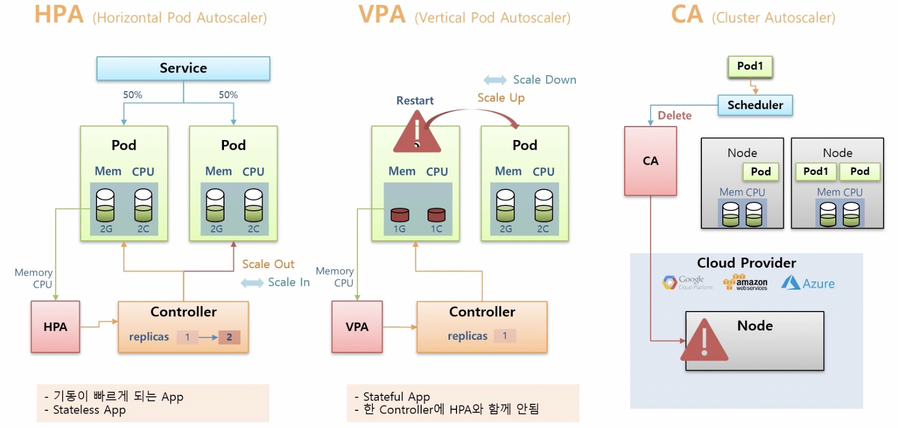

### HPA-Related K8S Architecture

- `HPA`를 알기 위해 K8S의 아키텍쳐 중 `HPA`와 관련된 부분만을 살펴보자.

- K8S에는 크게 Master Node와 하나 이상의 Worker Node들이 있다.

- Master Node에는 `Control Plane Component`라고 해서 K8S의 주요 기능을 하는 컴포넌트들이 `Pod`의 형태로  
  만들어져 돌아가고 있는데, 그 중 하나인 `Controller Manager`는 우리가 사용하고 있는 `Controller`들,  
  예를 들어 `Deployment`, `ReplicaSet`, `DaemonSet`, `HPA`, `VPA`, `CA` 등이 스레드의 형태로  
  작동하고 있다. 또한 API `kube-apiserver`가 있는데 이는 K8S의 모든 통신의 기본 역할을 담당한다.  
  사용자가 K8S에 접근할 때도 이용하지만, K8S내의 컴포넌트들도 통신할 때 `kube-apiserver`를 통하게 된다.

- 다음으로 Worker Node들에는 `Worker Node Component`라고 해서 K8S 설치 시에 `kubelet`이라는 것이 설치된다.  
  `kubelet`은 각각의 `Node`마다 설치되며 `Node`를 대표하는 agent 역할을 담당하는데, 자신의 `Node` 내에 있는  
  `Pod`들을 관리하는 역할을 담당한다. 그렇다고 `kubelet`이 직접 컨테이너까지 만드는 것은 아니다. 컨테이너의 생성 및 삭제는  
  `Controller Runtime`이라는 구현체가 담당한다.

- 위에서 본 K8S 아키텍쳐를 기준으로, 사용자가 `ReplicaSet`을 만들었을 때 벌어지는 일들을 살펴보자.  
  `ReplicaSet`을 담당하는 스레드는 replicas가 1이라고 했을 때 `Pod`를 1개 만들어달라고 `kube-apiserver`를 통해  
  적절한 `Node` 내에 있는 `kubelet`에 요청하게 된다. 요청을 받은 `kubelet`은 Docker, rkt, CoreOS 등의  
  `Controller Runtime`에게 컨테이너를 만들어 달라고 요청한다. 그럼 `Controller Runtime`은 `Node`위에  
  컨테이너를 만들어준다.

- 이 상태에서 `HPA`가 `Pod`의 자원 정보 등을 어떻게 파악할 수 있게 되는지 알아보자.  
  먼저 `Node`에 있는 `Resource Estimator`인 cAdvisor가 Docker(`Controller Runtime`)로부터  
  memory와 CPU 정보를 측정하는데, 이 정보를 `kubelet`을 통해 가져갈 수 있도록 해놓는다.

- 또한 우리는 `Node`에 있는 `AddOn Component`에 metrics server를 담당하는 `Pod`를 설치할 수 있는데  
  이를 설치하면 metrics server가 각각의 `Node`에 있는 `kubelet`에 접근해 memory, CPU 정보 등을  
  가져와서 저장해둔다. 저장한 후 이 데이터를 다른 컴포넌트들이 사용할 수 있도록 Master Node에 있는  
  `kube-apiserver`의 `Resource API`를 사용헤 `kube-apiserver`에 등록해 놓는다.

- 이렇게 되면 `HPA`는 memory와 CPU 정보를 `kube-apiserver`를 통해 가져갈 수 있게 되고 `HPA`는 자원 정보를  
  15초 주기로 검사하다가 `Pod`의 리소스 사용률이 높아졌을 때 `ReplicaSet`의 replicas를 증가시킨다.

> `kubectl top` 명령어릁 통해서 `kube-apiserver`의 `Resource API`를 통해 `Pod`나 `Node`의 현재 리소스  
> 상태를 조회해볼 수 있다.

- 추가적으로 Prometheus를 Worker Node에 설치하면 단순 memory, cpu외의 다양한 metric 정보들을 수집할 수 있는데,  
  예를 들어 `Pod`로 들어오는 packet 개수, `Ingress`로 들어오는 request량 등을 알 수 있다.  
  그럼 `HPA`는 이러한 정보들을 기준으로 `Controller`의 replicas를 조정할 수 있다.

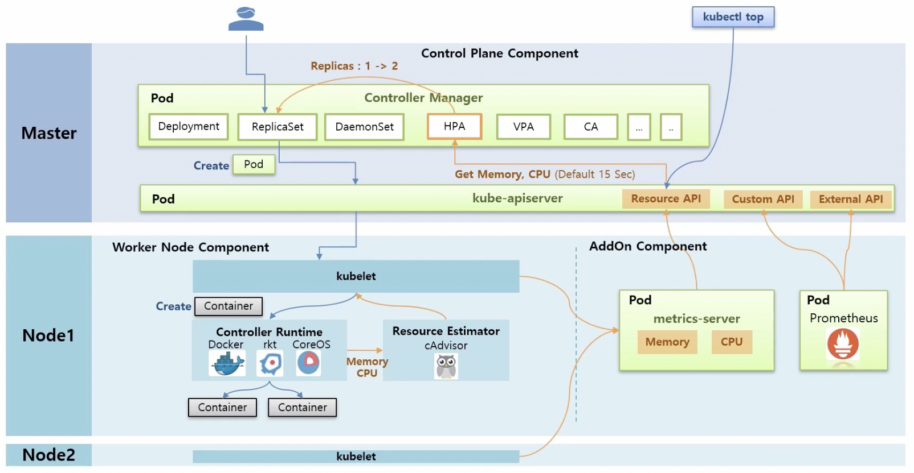
