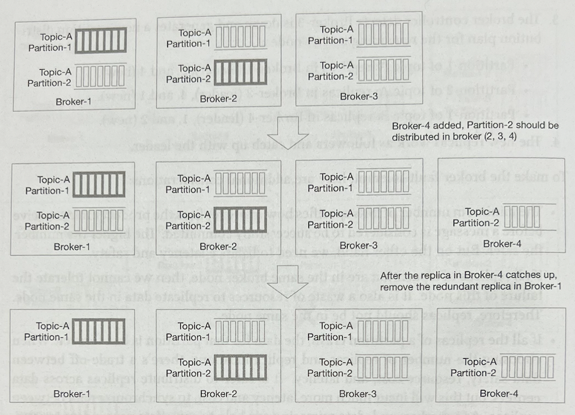
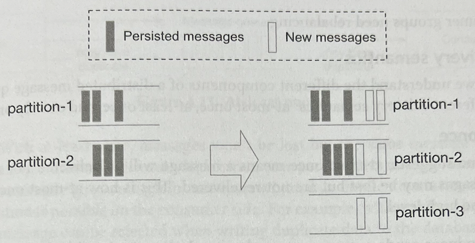
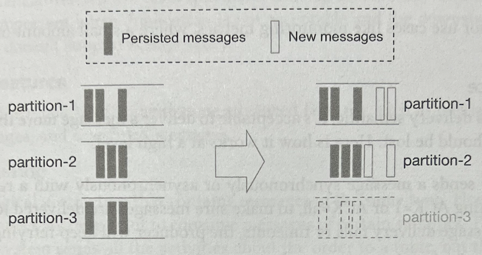
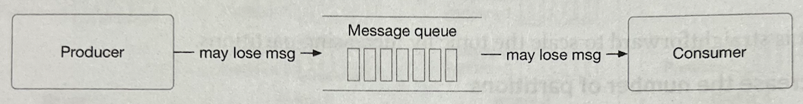
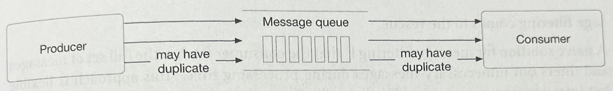
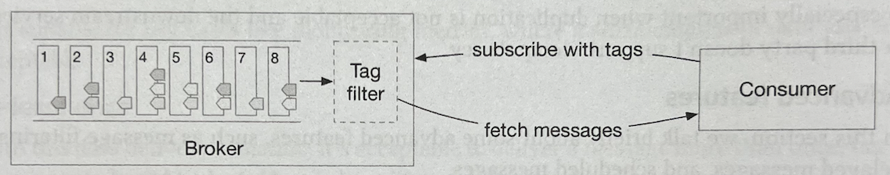

# Distributed Message Queue

- 이번 장에서는 시스템 디자인 면접에서 자주 등장하는 질문인 분산 message queue를 설계해보자. 현대 아키텍쳐에서 시스템은 작고 서로 독립된  
  컴포넌트들로 나눠지고, 이들은 잘 정의된 인터페이스를 두고 소통한다. Message queue는 이 컴포넌트들이 서로 상호작용하는 방법을 제공한다.  
  그렇다면 message queue가 어떤 이점을 가져다 줄까?

  - Decoupling: Message queue는 서로 다른 컴포넌트가 강결합되는 것을 막아 서로 독립적으로 개발될 수 있게 한다.
  - Improved scalability: 트래픽량에 따라 producer와 consumer 각각을 확장할 수 있다. 예를 들어 사용량이 많은 시간대에는 consumer만  
    확장해 늘어난 트래픽을 처리하도록 할 수 있다.
  - Increased availability: 시스템의 일부가 장애가 난다면, 다른 컴포넌트들은 queue를 사용해 계속해 상호작용할 수 있다.
  - Better performance: Message queue는 비동기 통신을 쉽게 하도록 한다. Producer들은 queue에 consumer가 메시지를 소비하기를 기다리지  
    않고, 단순히 메시지를 전달하고 다른 일을 할 수 있다. 즉 consumer, producer가 서로의 작업이 완료되기를 기다릴 필요가 없다.

- 다음은 유명한 분산 message queue들이다.
  - Apache Kafka, Apache RocketMQ, RabbitMQ, Apache Pulsar, Apache ActiveMQ, ZeroMQ

#### Message queues vs Event streaming platforms

- 위의 유명한 message queue들 중 따지고 보면 Apache Kafka와 Pulsar는 event streaming platform이지, message queue는 아니다.  
  하지만 message queue와 event streaming platform을 구분짓는 경계를 허무는 다양한 기능들을 제공한다. 예를 들어 일반적인 message queue인  
  RabbitMQ는 선택적으로 stream 기능을 사용할 수 있도록 한다. 이 stream 기능은 event streaming platform처럼 append-only log 방식으로  
  구현되어 있고, 메시지의 반복적인 소비와 메시지의 생명주기를 길게 다룰 수 있도록 해준다. 또한 Apache Plusar는 Kafka의 대조군인데,  
  일반 분산 message queue로 사용해도 될 정도로 유연하고 성능이 좋다.

- 이번 장에서는 long data retention, repeated consumption of messages 등 event streaming platform에서 제공할 만한 추가적인  
  기능을 가진 분산 message queue를 설계해볼 것이다. 이 기능들은 설계를 더욱 복잡하게 한다.

## 문제 이해 및 설계 범위 확정

- 기본적으로 message queue의 기능은 매우 간결하고 단순한데, producer는 메시지를 queue에 보낼 수 있어야 하고, consumer들은 이 메시지들을  
  가져와 사용(소비)할 수 있어야 한다. 이 기능 외에도 성능, 메시지 전달 방식, 메시지 retention 등의 고려 요소들이 많다.  
  이번에 디자인할 분산 message queue가 제공하는 기능 요구사항은 아래와 같다.

  - Producer들은 메시지를 message queue에 보낼 수 있다.
  - Consumer들은 message queue로부터 메시지를 소비한다.
  - 메시지는 한 번, 또는 여러 번 소비될 수 있다.
  - 메시지의 크기는 KB 단위이다.
  - Queue에 메시지가 전달된 순서대로 consumer에게 전달된다.
  - 데이터 전달 방식(at-least once, at-most once, exactly once)는 사용자들이 설정할 수 있다.

- 아래는 비 기능적 요구사항들이다.

  - Use case에 따라 높은 처리량 또는 낮은 latency를 제공해야 한다.
  - Scalability: 시스템은 분산 처리되어 있어야 한다. 따라서 전송되는 메시지가 갑자기 치솟아도 이를 감당할 수 있어야 한다.
  - Persist, durable: 데이터는 disk에 저장되어야 하고, 여러 개의 node들에 복제되어야 한다.

### 일반적인 message queue

- 위 요구사항들은 일반적인 message queue에서는 제공하지 않는 기능들을 포함한다. 예를 들어 일반적인 message queue는 메시지를 소비될 때까지  
  메모리에만 보관하고, 일반적으로 메시지의 순서를 보장하지 않는다. 이 기능이 없으면 설계가 훨씬 쉬워진다.

---

## 개략적 설계안 제시 및 동의 구하기

- 첫 번째로 message queue의 기본적인 요구사항을 다뤄보자.

- 아래 그림은 message queue의 중요한 컴포넌트들과 이들간의 상호작용을 나타낸다.

  

  - Producer는 message queue에 메시지를 보낸다.
  - Consumer는 queue를 구독하고, 해당 queue의 메시지를 소비한다.
  - Message queue는 producer와 consumer의 가운데에 위치해 이들을 decouple함으로써 각각 독립적으로 운영 및 확장할 수 있도록 한다.
  - Producer와 consumer 모두는 client/server model에서 client에 해당하고, message queue가 server에 해당한다.  
    Client, server는 네트워크를 통해 상호작용한다.

### Messaging Models

- 가장 유명한 messaging model은 point-to-point와 publish/subscribe 이다.

#### Point-to-point

- 이 모델은 전통적인 message queue에서 많이 사용된다. Point-to-point model에서는 메시지가 queue에 보내지고, 단 하나의 consumer에 의해  
  소비된다. 물론 queue로부터 메시지를 소비하기 위해 많은 consumer들이 있을 수 있지만, 각 메시지는 오직 단 하나의 consumer에 의해 소비된다.  
  아래 그림에서 메시지 A는 consumer 1에 의해 소비된다.

- Consumer가 메시지를 소비하면 해당 메시지는 queue에서 제거된다. 즉 point-to-point model에서는 data retention이 없다.  
  이와 반대로 우리가 이번에 설계할 message queue는 메시지를 2주 동안 보관하기 위한 persistence layer가 있고, 이를 통해 메시지가 반복적으로 소비되게 한다.

#### Publish-subscribe

- 이 모델을 알기 전에 우선 topic이 무엇인지 보자. Topic은 메시지를 분류하기 위한 카테고리이다. 각 topic은 모든 message queue service에서  
  unique한 이름을 가진다. 그리고 메시지는 특정 topic을 갖고 message queue에 보내지고, 읽어진다.

- Publish-subscribe model에서 메시지는 topic으로 보내지고, 해당 topic을 구독하고 있는 consumer들에 의해 소비된다.  
  아래 그림에 나타난 것처럼, message A는 consumer1, consumer2 모두에 의해 소비된다.

  

- 우리가 설계할 message queue는 위의 두 모델 모두를 지원한다. Publish-subscribe model은 **topic** 을 사용해 구현되고, point-to-point  
  model은 **consumer group** 을 사용해 구현된다.

### Topics, partitions, and brokers

- 이전에 봤듯이 메시지들은 topic으로 분류되고 저장된다. 그렇다면 단 하나의 서버가 처리하기에 topic의 데이터량이 너무 많으면 어떻게 될까?

- 이 문제를 해결하기 위한 하나의 접근법으로 **partition(sharding)** 을 사용할 수 있다. 아래 그림에 나타난 것처럼 topic을 partition들로  
  나누고, 각 partition에 고르게 메시지들을 전달한다. 여기서 partition을 _topic에 해당하는 메시지의 부분집합_ 으로 생각해도 된다.  
  Partition들은 message queue cluster 내의 서버들에 고르게 분포된다. 그리고 partition들을 갖는 서버를 **broker** 라 한다.  
  Broker들로 partition을 분배하는 것은 높은 확장성을 지원하기 위해 중요한 요소다. 특정 topic의 처리량을 partition의 개수를 늘림으로써  
  처리할 수 있다.

  

- Topic의 각 partition은 queue와 함께 FIFO mechanism으로 운영된다. 즉 partition 내에 메시지의 순서를 그대로 보관한다는 뜻이다.  
  그리고 partition 내에 있는 메시지의 위치를 **offset** 이라 한다.

- 메시지가 producer에 의해 전달되면, 실제로는 해당 메시지의 topic의 partition들 중 하나로 전달된다. 각 메시지는 선택적으로 message key를  
  가지며, 같은 message key를 가진 메시지들은 모두 동일한 partition으로 전달된다. 만약 message key가 없다면 메시지는 partition들 중  
  하나로 랜덤으로 전달된다.

- Consumer가 topic에 구독하게 되면, 해당 topic의 하나 이상의 partition들로부터 데이터를 pull하게 된다. 특정 topic에 구독하는  
  consumer들이 여러 개 있다면, 각 consumer는 topic의 partition의 일부를 처리하는 책임이 부여된다. 이러한 consumer들은 topic에 대해 하나의  
  **consumer group** 을 형성하게 된다.

- Broker와 partition들로 구성된 Message queue cluster는 아래와 같이 구성되어 있다.

  

### Consumer group

- 이전에 언급했듯이 우리가 설계하려는 message queue는 point-to-point와 publish-subscribe model 모두를 지원해야 한다.

- **Consumer group** 은 consumer들의 집합으로, 이 consumer group 내의 consumer들은 특정 topic의 메시지들을 소비하기 위해 협업한다.

- Consumer들은 group들로 구성될 수 있다. 각 consumer group은 여러 개의 topic을 구독할 수 있고, 각자 자신만의 소비 offset을 유지한다.  
  예를 들어 consumer들을 하나는 billing, 다른 하나는 accounting 처럼 use case별로 grouping할 수 있다.

- 동일한 consumer group 내의 consumer들은 트래픽을 병렬적으로 처리할 수 있다. 아래 그림을 보자.

  

  - Consumer group 1은 topic A를 구독한다.
  - Consumer group 2는 topic A와 topic B를 구독한다.
  - Topic A는 consumer group 1과 consumer group 2 모두에 의해 구독되고 있다. 즉 동일한 메시지가 여러 개의 consumer들에 의해 소비될 수  
    있다. 이 패턴이 publish-subscribe model을 지원하도록 한다.

- 하지만 위 그림대로 진행하면 문제점이 하나 생긴다. 병렬적으로 데이터를 처리하는 것은 처리량을 높여주지만, 같은 partition내의 메시지가 소비되는 순서가  
  메시지가 전달된 순서와 같다는 것이 보장되지 못한다. 예를 들어 만약 consumer 1과 consumer 2가 모두 partition 1의 메시지를 소비해가면,  
  partition-1의 메시지 소비 순서를 보장하지 못하게 될 것이다.

- 이 문제는 하나의 partition은 같은 group에 속한 단 하나의 consumer에 의해 소비되어야 한다는 규칙을 추가함으로써 해결할 수 있다.  
  만약 consumer group내의 consumer의 개수가 partition의 개수보다 크다면, 일부 consumer는 아무런 데이터를 소비하지 못하게 될 것이다.  
  예를 들어 위 그림에서 consumer group 2에 속한 consumer 3는 이미 같은 consumer group에 속한 consumer 4가 topic B를 구독하고  
  있으므로 topic B로부터 메시지를 소비하지 못한다.

- 이 규칙을 적용해 만약 하나의 consumer group에 모든 consumer들을 배치하게 된다면 동일한 partition에 있는 메시지들은 각각 단 하나의  
  consumer에 의해 소비될 것이고, 이는 곧 point-to-point model과 같다. Partition이 가장 작은 storage unit이니 사전에 미리 충분한  
  수의 partition들을 배치해놔 동적으로 partition의 개수를 늘리지 않도록 하면 좋다. 확장이 필요하다면 오로지 consumer만 추가하면 된다.

### 개략적 설계안

- 아래 그림은 위에서 다룬 모든 내용을 포함한 개략적 설계안이다.

  

  - Clients

    - Producer: 메시지를 특정 topic으로 push한다.
    - Consumer group: Topic을 구독하며 메시지를 소비한다.

  - Core service and storage

    - Broker: 여러 개의 partition을 가진다. Partition은 특정 topic 내의 메시지들의 부분 집합을 가진다.
    - Storage:
      - Data storage: 메시지는 partition 내의 data storage에 보관된다.
      - State storage: Consumer의 상태를 보관한다.
      - Metadata storage: 설정 값 및 topic의 속성들을 보관한다.

  - Coordination service:

    - Service discovery: 어떤 broker들이 사용 가능한지를 알려준다.
    - Leader election: Broker들 중 하나가 active controller로 선택된다. Cluster 내에는 단 하나의 active controller 만이 존재한다.  
      Active controller는 partition을 할당하는 작업에 대한 책임을 가진다.
    - 주로 controller를 선정하기 위해 Apache ZooKeeper, etcd 등이 사용된다.

---

## 상세 설계

- 높은 data retention 요구사항과 높은 처리량을 동시에 만족하기 위해 우리는 설계 시 아래의 중요한 3개 선택을 했다.

  - 현대 OS에서 순차적 접근에 대한 성능을 보장하고 disk caching이 적용 가능한 on-disk data structure를 사용한다.
  - 메시지가 변경되지 않고 producer로부터 받아져 queue에 보관되고, consumer에게 전달되도록 설계했다.  
    이렇게 하면 메시지를 복사할 필요가 없어진다. 복사하는 작업은 높은 처리량과 많은 데이터를 다루는 시스템에서 꽤나 비싼 작업이다.
  - 시스템을 batch 작업이 수월하도록 설계했다. 작은 I/O는 높은 처리량을 지원하는 시스템의 적과도 같다. 따라서 가능한 한 우리의 설계는 batch를  
    권장한다. Producer들은 메시지를 batch로 전달한다. Message queue는 더 큰 batch로 메시지들을 보관하고, consumer들은 원한다면  
    메시지를 batch로 가져갈 수도 있다.

### Data storage

- 이제 메시지를 보관하는 방법들을 자세히 살펴보자. 가장 좋은 선택을 하기 위해 message queue의 트래픽 패턴을 생각해보자.

  - Write-heavy, read-heavy
  - Update, delete 연산이 없다.
  - 순차적인 read/write 요청이 매우 많다.

#### 선택지 1번: 데이터베이스

- 첫 번째 선택지로 데이터베이스를 사용할 수 있다.

  - RDB: Topic table을 만들고, 하나의 메시지는 해당 topic table의 row로 저장된다.
  - NoSQL: Topic을 위한 collection을 만들고, 메시지를 document로 저장한다.

- Database는 메시지를 보관해야 한다는 요구사항은 만족시키지만, 큰 규모에서 write-heavy, read-heavy한 트래픽을 모두 원활히 처리하기 위해  
  설계하는 것이 어렵기 때문에 이상적인 선택지는 아니다. 데이터베이스를 사용하는 방법은 message queue의 데이터 사용 패턴을 잘 만족시키지 못한다.

- 이는 데이터베이스가 최선의 선택지가 아니며, 시스템의 병목점이 될 수 있음을 의미한다.

#### 선택지 2번: WAL(Write-ahead log)

- 두 번째 선택지로 WAL(Write-ahead log)를 사용할 수 있다. WAL은 단순히 하나의 파일로, 새로운 내용들이 append-only log에 append된다.  
  WAL은 MySQL의 redo log, ZooKeeper의 WAL 등 많은 시스템에서 사용된다.

- 이 설계안에서는 메시지를 디스크에 WAL log file로 저장하는 것이 좋다. WAL은 순차적인 read/write 접근 방식을 가진다.  
  디스크의 순차 접근 성능은 매우 좋다. 또한 rotational disk는 용량이 크며 비용도 적게 든다.

- 아래 그림에 나타난 것처럼 새로운 메시지는 하나씩 증가하는 offset과 함게 partition의 tail에 append된다. 가장 쉬운 구현 방법으로  
  log file의 line number를 offset으로 사용할 수도 있다. 하지만 하나의 파일이 무한정 커질 수 없다는 점을 감안하면, segment로  
  나누는 것이 좋을 것이다.

- Segment를 사용할 때 새로운 메시지들은 오직 활성 segment file에만 append된다. 활성 segment file이 특정 크기게 도달하면, 새로운  
  활성 segment file이 생겨 새로운 메시지를 저장하고, 기존에 있던 활성 segment file은 비활성 상태가 된다. 비활성 segment들은 오직  
  read request만 처리한다. 오래된 비활성 segment file들은 retention이 지나거나 용량의 한계에 의해 제거될 수 있다.

  

- 동일한 partition 내의 segment file들은 아래 그림과 같이 `Partition-{:partition_id}`의 이름을 갖는 폴더로 정리된다.

  

##### Disk performance에 대한 이야기

- 높은 data retention 요구사항을 만족시키기 위해 이 설계안은 많은 양의 데이터를 저장하기 위해 disk에 많이 의존한다. Rotational disk가  
  느리다는 잘못 알려진 사실이 있는데, 이는 오직 random access를 할 때만 느린 것이다. 우리가 설계하는 시스템은 순차적 접근을 하기 때문에  
  rotational disk를 사용해도 충분히 빠른 read/write 처리량, 그리고 성능을 보장받을 수 있다.

- 또한 현대 OS는 disk data를 메모리에 caching하기 때문에 접근 속도도 빠를 것이다. WAL도 마찬가지로 OS disk caching을 많이 사용한다.

### Message data structure

- 메시지의 자료 구조는 높은 처리량을 달성하기 위해 중요한 요소이다. 메시지 자료구조는 producer, message queue, 그리고 consumer 사이의  
  일종의 _약속_ 을 정의한다. 이 설계안은 메시지가 producer에서 queue로, 그리고 queue에서 consumer로 전달되는 과정에서 데이터의 불필요한  
  복사를 하지 않음으로써 높은 처리량을 달성한다. 만약 시스템의 어느 부분에서도 이 동작을 어긴다면, 메시지는 변경되야 할 것이고, 연산량이 많은  
  복사 작업이 필요하게 된다. 따라서 시스템의 성능을 심각하게 떨어뜨릴 수 있다.

- 아래는 메시지 자료구조의 스키마 예시이다.

| Field name | Data type |
| ---------- | --------- |
| key        | byte[]    |
| value      | byte[]    |
| topic      | string    |
| partition  | integer   |
| offset     | long      |
| timestamp  | long      |
| size       | integer   |
| crc        | integer   |

#### Message Key

- 메시지의 key는 해당 메시지가 어떤 partition으로 전달될지 결정하는 역할을 한다. 만약 key가 지정되지 않았다면, 무작위의 partition에 저장된다.  
  어떤 partition에 저장될지는 `hash(key) % numberOfPartitions`로 결정할 수 있다. 만약 더 높은 유연성을 제공하고 싶다면, producer가  
  직접 mapping 알고리즘을 정의해 partition을 고르도록 할 수도 있다. 참고로 key와 partition number은 절대 같은 것이 아님을 알아두자.

- Key는 string이나 number가 될 수 있고, 보통 business information을 담는다. Partition number는 message queue 내에서 사용되는  
  개념이므로 클라이언트들에게 직접적으로 노출되어서는 안된다.

- 적절한 mapping 알고리즘이 있으면 만약 partition의 개수가 바뀌더라도 메시지들이 여전히 모든 partition에 고르게 분배되도록 할 수 있다.

#### Message value

- Message value는 메시지의 payload이다. Plain text일 수도 있고, binary block일 수도 있다.

> 메시지의 key, value는 key-value store의 key-valye pair와는 다르다. Key-value store에서 key는 unique하며, key를 통해  
> value를 찾을 수 있다. 반면 메시지에서 key는 unique할 필요가 없다. 심지어 필수 값도 아닐 수도 있으며, key를 사용해 value를 찾을 필요도 없다.

#### Other field of message

- Topic: 메시지가 소속된 topic
- Partition: 메시지가 소속된 partition의 ID
- Offset: Partition 내 해당 메시지의 위치. Topic, partition, offset을 이용해 특정 메시지를 찾아낼 수 있다.
- Timestamp: 메시지가 보관된 시점의 timestamp
- Size: 메시지의 크기
- CRC(Cyclic redundancy check): Raw data의 무결성을 보장하기 위해 사용된다.

- 다른 기능들을 지원하기 위해 선택적인 field들이 메시지에 추가되도록 할 수 있다. 예를 들어 메시지를 tag로 필터링하고 싶다면, 메시지가 tag를  
  optional field로 갖도록 하면 된다.

### Batching

- Batching은 이 설계에 구석구석 스며들어 있다. Producer, consumer, 그리고 message queue 모두에서 메시지를 batch로 다룰 수 있다.  
  Batching은 시스템의 성능을 좌우하는 중요한 요소다. 이번 장에서는 message queue 내에서의 batching에 대해 집중적으로 다뤄보자.

- Batching이 시스템의 성능을 향상시키는 데 중요한 이유는 아래와 같다.

  - OS가 메시지를 grouping 해 하나의 네트워크 요청으로 처리할 수 있도록 한다. 따라서 비싼 네트워크 왕복 비용을 줄일 수 있다.
  - Broker가 큰 chunk 단위로 log를 append하는데, 이는 OS에 운영되는 disk cache에 더욱 큰 block들이 순차적으로 write되게 한다.  
    작은 단위가 아니라 큰 단위로 순차적 접근을 하기에 disk에 대한 순차적 접근 처리량이 높아진다.

- 처리량과 latency는 tradeoff 관계를 가진다. 만약 시스템이 latency가 더 중요한 전통적인 message queue로 배포되었다면, 해당 시스템은  
  더 작은 batch size를 사용할 것이다. 이 경우 Disk의 성능은 안 좋아질 것이다. 또한 순차적 disk 접근 처리량이 낮은 것을 보완하기 위해  
  topic 별로 더 많은 수의 partition을 사용할 것이다.

- 지금까지 main disk storage subsystem과 연관된 disk 자료구조에 대해 다뤄보았다. 이번에는 producer와 consumer 각각의 흐름에 대해  
  다뤄보자. 이후 다시 돌아와 message queue의 나머지 부분들을 깊게 다뤄볼 것이다.

### Producer flow

- 만약 producer가 메시지를 partition에 보내고 싶다면, 어떤 broker에 연결해야 할까?  
  첫 번째 선택지로 routing layer를 둘 수 있다. Routing layer로 전달된 모든 메시지들은 _"적절한"_ broker로 전달된다.  
  만약 broker들이 복제되었다면, _"적절한"_ broker는 leader replica가 된다.

- 위 그림에 나타난 것처럼, producer가 메시지를 Topic-A의 partition-1에 전달하고 싶다고 해보자. 과정은 아래와 같다.

  - (1) Producer는 routing layer에 메시지를 보낸다.
  - (2) Routing layer는 metadata storage로부터 partition-1을 가지는 replica들 읽고, local에 caching한다.  
    메시지가 도착하면 routing layer는 메시지를 Broker-1에 있는 Partition-1의 leader replica에 전달한다.
  - (3) Leader replica는 메시지를 수신하고, 나머지 follower replica들은 leader replica로부터 데이터를 pull한다.
  - (4) _"충분한"_ 수의 follower replica들이 메시지를 동기화했다면, leader replica는 data를 commit(disk에 저장)하고,  
    이후 데이터가 소비될 수 있도록 한다. 그리고 producer에게 메시지가 전달되었음을 알린다.

> Leader replica: Primary, Follower replica: Read Replica

- Leader, follower replica가 왜 모두 필요할까? 이유는 **fault tolerance**를 위함이다.

- 이 방식은 작동하지만, 몇 가지 단점들이 있다.

  - Routing layer가 있다는 것은 network hop이 증가한다는 뜻이고, 이는 network hop의 증가로 인한 overhead로 인해 network latency를  
    증가시킨다.
  - 이 방식은 요청의 batching을 고려하지 않았다. (Request batching은 효율성을 위한 중요한 요소다.)

- 아래 그림은 향상된 설계안이다.

- 위 설계안에서 routing layer는 producer의 일부가 되었고, buffer 컴포넌트가 producer에 추가되었다. 이 둘은 모두 producer client의  
  라이브러리의 일부로써 producer에 설치될 수 있다. 이 변화된 방식은 아래의 이점들을 가져온다.

  - Network hop이 적어져 latency가 감소한다.
  - Producer가 메시지가 전달될 partition을 결정하는 로직을 직접 가질 수 있다.
  - 메모리를 buffer에 두어 한 번의 요청으로 더 많은 양의 데이터를 batching할 수 있게 된다. 따라서 처리량이 증가하게 된다.

- Batch size를 결정할 때는 처리량과 latency의 tradeoff를 고려해야 한다.

  

- Batch size가 커지면 처리량은 증가히지만 batch size를 만족시키기 위해 batch를 모아야 하므로 latency는 증가한다.  
  반면 batch size가 작아지면 요청이 더 일찍 발생하므로 latency는 줄어들지만, 처리량은 감소한다.  
  Producer들은 use case에 따라 batch size를 조절할 수 있다.

### Consumer flow

- Consumer는 partition 내의 offset을 명시하고, 해당 위치로부터 발생한 이벤트들의 chunk를 받아간다.

#### Push vs pull

- 중요한 요소 중 하나로 broker가 consumer들에게 데이터를 push 할지, 아니면 consumer들이 broker들로부터 데이터를 pull할지 결정해야 한다.

#### Push model

- 장점: 낮은 latency. Broker는 메시지를 수신하자마자 consumer들에게 해당 메시지를 그대로 전달할 수 있다.
- 단점:
  - Broker가 받는 메시지량이 consumer의 메시지 처리량보다 많다면 consumer에게 부하가 발생한다.
  - Broker가 데이터가 전송되는 것을 평가하고 결정하기 때문에 서로 다른 processing power를 가진 consumer들이 모두 원활하게 작동하도록 하기 어렵다.

#### Pull model

- 장점:

  - Consumer가 소비량을 결정한다. 예를 들어 한 집합의 consumer들은 메시지를 실시간으로 처리하고, 다른 집합의 consumer들은 메시지를 batch로  
    처리하도록 할 수 있다.
  - Consumer의 소비량이 메시지가 전달되는 양을 따라잡지 못하면 consumer를 scale out하거나 다시 상황이 괜찮아지면 처리하도록 할 수 있다.
  - Pull model은 batch processing을 위해 더 적합하다. Push model에서 broker는 consumer가 메시지를 즉각적으로 소비할 수 있는 여건인지를  
    알지 못한다. 만약 broker가 consumer에게 메시지를 1번에 1개씩 보내고 consumer가 장애가 났다면, 새로운 메시지들은 buffer에서 대기하게 될  
    것이다. 반면 Pull model은 log에서 consumer의 position 뒤로 가능한 만큼 메시지를 pull해가게 된다. 따라서 data batching에 더  
    적합할 수 밖에 없다.

- 단점: Broker에 메시지가 없더라도 consumer가 계속 데이터를 pulling할 수 있고, 이는 리소스 낭비로 이어진다.  
  이 문제를 해결하기 위해 많은 message queue들은 새로운 메시지를 위해 특정 시간 동안 pull을 대기시키는 polling mode를 지원한다.

- 위의 push, pull model의 비교를 통해 대부분의 message queue들은 pull model을 사용한다.

- 아래 그림은 consumer pull model의 흐름이다.

- (1) 새로운 consumer가 consumer group 1에 등록하고 Topic A를 구독하고 싶어 한다. 우선 해당 consumer는 group name을 hashing해서  
  연관된 broker를 찾는다. 즉 동일한 consumer group 내의 모든 consumer들은 동일한 broker에 연결하게 되고, 이는 _coordinator of_  
  _consumer group_ 이라고도 한다. 여기서 conumser group의 coordinator와 처음 본 개략적 설계안의 coordinator service는 다르다는  
  것을 인지하자. 여기서 말하는 coordinator는 consumer group을 관리하고, 개략적 설계안의 coordination service는 broker cluster를  
  관리한다.

- (2) Coordinator가 새로운 consumer가 consumer group 1에 등록되었음을 확인하고, 해당 consumer가 partition-2를 구독하게 한다.  
  구독할 partition을 결정하는 방법에는 round-robin, range 등 다양한 전략들이 있다.

- (3) Consumer는 마지막으로 소비된 offset 이후의 메시지들을 소비한다. 이 offset은 state storage에 의해 관리된다.

- (4) Consumer가 메시지를 처리하고 처리된 마지막 메시지의 offset을 broker에게 전달해 저장시킨다.  
  데이터가 처리되는 순서와 offset을 기록하는 것은 message delivery semantic에 영향을 끼친다. 자세한 설명은 뒤에서 보자.

### Consumer rebalancing

- Consumer rebalancing은 어떤 consumer가 partition의 특정 하위 집합에 대해 책임을 갖는지 결정한다. 이 프로세스는 새로운 consumer가  
  추가되거나 consumer가 제거되거나, consumer에 장애가 나거나, 아니면 partition이 조정되었을 때 발생할 수 있다.

- Consumer rebalancing이 수행되면 coordinator가 중요한 역할을 수행한다. 우선 coordinator가 무엇인지 알아보자. Coordintor는  
  broker들 중 하나로, consumer rebalancing이 수행되기 위해 다른 consumer들과 소통한다. Coordinator는 consumer들로부터  
  heartbeat를 수신하고 그들의 partition의 offset을 관리한다.

- Coordinator와 consumer들이 어떻게 상호 작용하는지 예시를 통해 알아보자.

- 위 그림에 나타난대로 각 consumer는 특정 consumer group에 소속되어 있다. 그리고 group의 이름을 hashing 해 coordinator를  
  알아낼 수 있다. 같은 consumer group 내의 모든 consumer들은 동일한 coordinator에 연결되어 있다.

- Coordinator는 consumer group에 속한 consumer들의 목록을 관리한다. 이 목록이 바뀌면 coordinator는 consumer group의  
  새로운 leader를 선정한다.

- Consumer group의 leader는 partition을 어떻게 보낼지 계획(partition dispatch plan)을 세우고, 이를 coordinator에게  
  알린다. 그럼 coordinator는 해당 계획을 consumer group 내의 모든 consumer들에게 알린다.

- 분산 시스템에서 consumer들은 네트워크 문제, 장애, 재시작 등 온갖 이슈들을 맞딱뜨릴 수 있다. Coordinator의 관점에서 본다면, 이러한  
  상태의 consumer들은 더 이상 heartbeat가 없을 것이다. 이런 상황이 발생하면 coordinator는 아래 그림과 같이 partition을 다시  
  dispatch하기 위한 rebalance process를 시작한다.

- Rebalancing이 발생하는 몇 가지 시나리오를 살펴보자. Consumer group에 2개의 consumer가 있고, 이들이 구독한 topic은 총 4개의  
  partition으로 구성되어 있다고 해보자. 아래 그림은 새로운 consumer인 B가 consumer group에 등록되었을 때의 흐름을 나타낸다.

  

- 어떤 순서로 이뤄지는지 살펴보자.

  - (1) 처음에 오직 consumer A 만이 consumer group에 있었다. 이 상태에서 consumer A는 모든 partition의 메시지를 소비하며,  
    coordinator에게 heartbeat를 전송한다.

  - (2) Consumer B가 consumer group에 가입하기 위한 요청을 보낸다.

  - (3) Coordinator는 rebalancing을 수행하기 위해 해당 group 내의 모든 consumer들에게 이를 알린다. Coordinator가 consumer A의  
    heartbeart를 수신하면, consumer A에게 consumer group을 다시 join하라고 알린다.

  - (4) 모든 consumer들이 consumer group에 rejoin하면 coordinator는 해당 consumer들 중 leader를 결정하고, 모든 consumer들에게  
    어떤 consumer가 leader가 되었는지를 알린다.

  - (5) Leader consumer는 partition dispatch plan을 생성하고 이를 coordinator에게 전달한다. 다른 consumer들은 coordinator에게  
    partition dispatch plan을 달라고 요청한다.

  - (6) Consumer들이 각각 새롭게 할당된 partition으로부터 메시지를 소비하기 시작한다.

- 아래 그림은 consumer A가 consumer group을 나갔을 때의 흐름을 나타낸다.

  

- 순서를 보자.

  - (1) Consumer A와 consumer B가 동일한 consumer group에 소속되어 있다.
  - (2) Consumer A가 종료되어야 해서 group을 떠날 것을 coordinator에게 요청한다.
  - (3) Coordinator는 rebalancing을 수행하기 위해 consumer B의 heartbeat가 수신되었을 때 consumer B에게 consumer group을 다시  
    join하라고 알린다.
  - (4) 나머지 과정들은 새로운 consumer가 group에 join하고 싶을 때와 동일하다.

- 마지막으로 아래는 consumer A가 장애가 났을 때의 흐름을 나타낸다.

  

- 순서대로 알아보자.

  - (1) Consumer A, consumer B가 각각 coordinator에게 heartbeat를 보낸다.
  - (2) Consumer A에 장애가 나서 consumer A로부터 coordinator로 전달되는 heartbeat가 없어진다.  
    Coordinator는 특정 시간 동안 consumer A로부터 아무런 heartbeat 신호를 받지 않으므로 consumer A를 죽었다고 판단한다.
  - (3) Coordinator가 rebalancing process를 시작한다.(Consumer B의 heartbeat 수신하면 rejoin 요청 보냄)
  - (4) 나머지 과정은 이전 예시들과 동일하다.

- 이제 producer와 consumer의 흐름 모두를 파악했으니, 다시 돌아와 message queue broker의 나머지 부분에 대해 다뤄보자.

### State storage

- Message queue broker에서 state storage는 아래의 것들을 저장한다.

  - Partition과 consumer 사이의 mapping 관계
  - 각 partition에 대해 consumer group이 마지막으로 소비한 offset들  
    아래 그림에 있는 것처럼 consumer group 1이 소비한 마지막 offset은 6이고, consumer group 2가 소비한 마지막 offset은 13이다.

    

- 위 그림을 예로 들면 consumer group 1에 소속된 consumer가 partition의 메시지를 순차적으로 소비하고, 마지막으로 소비한 메시지의  
  offset인 6을 commit한다. 이는 offset이 6 이하인 메시지들이 이미 소비되었다고 표시하는 것과 같다. 만약 consumer에 장애가 나면  
  해당 consumer group 내의 다른 consumer가 state storage에서 마지막으로 소비된 offset을 찾아 그 이후의 메시지들부터 소비해갈 것이다.

- Consumer state에 대한 접근 패턴은 아래와 같다.

  - Read, write 연산 모두 자주 발생하지만, 그 크기가 크지는 않다.
  - 데이터는 자주 갱신되지만 삭제되지는 않는다.
  - Random read, write 연산들이 발생한다.
  - 데이터의 일관성이 중요하다.

- 이러한 패턴을 가지는 consumer state data를 적절히 처리하기 위해서 많은 선택지들을 사용할 수 있다. 데이터의 일관성이 중요하고 read, write  
  연산이 빨라야 한다는 점을 고려했을 때 ZooKeeper와 같은 KV Store가 좋은 선택지가 될 것이다. Kafka는 offset storage를 ZooKeeper에서  
  빼고 Kafka broker들로 옮겼다.

### Metadata storage

- Metadata storage는 설정값 및 topic의 속성들을 저장한다. 예를 들어 partition의 개수, retention 주기, 그리고 replica의 분산  
  형태를 저장한다.

- Metadata는 변경이 잦지 않고 데이터 volume도 작지만, 높은 일관성을 요구한다. 이 상황에서도 ZooKeeper가 좋은 선택지가 될 것이다.

#### ZooKeeper

- 위의 내용들을 보면서 ZooKeeper가 분산 message queue를 구현하는 데 굉장히 유용한 것임을 보았을 것이다.  
  ZooKeeper는 분산 시스템을 위한 서비스로 계층적 key-value store를 제공한다. 일반적인 사용 사례로는 분산 configuration service,  
  synchronization service, 그리고 naming registry 등이 있다.

- ZooKeeper는 아래 그림과 같이 사용되어 이 설계안을 단순화할 수 있다.

- 이전 설계안과 달라진 점을 간단히 짚고 넘어가자.

  - Metadata storage, 그리고 state storage가 ZooKeeper 내로 이동되었다.
  - Broker는 이제 메시지를 저장하기 위한 data storage만 관리하면 된다.
  - ZooKeeper가 broker cluster 중 leader broker를 선정하게 된다.

### Replication

- 분산 시스템에서 하드웨어 이슈는 매우 흔하며 절대 무시될 수 없다. 예를 들어 disk가 훼손되거나 영구적으로 장애가 나게 되면 데이터가 손실된다.  
  이런 문제를 해결해서 고가용성을 제공하기 위해 흔히 replication을 사용한다.

- 아래 그림과 같이 각 partition은 3개의 replica가 있고, 각 replica는 서로 다른 broker node에 분산되어 있다.

- 각 partition에 대해 굵은색으로 표시된 replica는 leader이고, 그렇지 않은 것들은 follower들이다.  
  Producer는 오로지 leader replica에만 메시지를 전송한다. 그리고 follower replica는 지속적으로 leader로부터 새로운 메시지를  
  pull한다. _"충분한"_ 수의 replica들에게 메시지가 동기화되면, leader는 producer에게 ACK 응답을 보낸다. 뒷 부분에서 _"충분한"_ 수를  
  정하는 방식을 알아볼 것이다.

- 각 partition에 대해 replica를 분산시키는 것을 replica distribution plan이라 한다.  
  예를 들어 위 그림에서 replica distribution plan은 아래와 같다.

  - Topic A의 partition 1: 3 replicas, leader in broker 1, followers in broker 2, broker 3
  - Topic A의 partition 2: 3 replicas, leader in broker 2, followers in broker 1, broker 3
  - Topic B의 partition 1: 3 replicas, leader in broker 3, followers in broker 1, broker 4

- 그렇다면 replica distribution plan은 어떤 컴포넌트가 생성할까? 과정은 아래와 같다.
  - (1) Coordination service의 도움으로 broker node들 중 하나가 leader로 선정된다.
  - (2) Leader broker는 replica distribution plan을 생성하고, 이를 metadata storage에 저장한다.
  - (3) 나머지 모든 broker들이 해당 plan에 따라 동작한다.

#### In-sync replicas

- 이전에 봤듯이 메시지는 single node failure를 피하기 위해 여러 개의 partition들에 걸쳐 저장되고, 각 partition은 여러 개의 replica를 가진다.  
  메시지는 오직 leader에만 전송되며 follower들은 데이터를 leader에 맞춰 동기화한다. 여기서 어떻게 이들을 동기화할지 고려해봐야 한다.

- In-sync replicas(ISR)은 leader와 "in-sync" 상태인 replica들을 말한다. "In-sync"의 정의는 topic의 설정에 따라 달라진다.  
  예를 들어 `replica.lag.max.messages = 4`라면 follower가 가진 메시지가 leader와 3개 이상 차이나지 않는 한 해당 follower는  
  ISR로 간주된다. Leader replica는 기본적으로 ISR이다.

- 아래 그림을 통해 ISR가 어떻게 동작하는지 확인해보자.

- Leader replica에 commit된 offset은 13이다. 두 개의 새로운 메시지가 leader replica에 전달되었으나, 아직 commit되지는 않은 상태이다.  
  Commit된 offset은 해당 offset 이전의 모든 메시지가 ISR들에게 모두 동기화되었음을 의미한다.

- Replica-2와 replica-3가 leader와 동기화 되었으므로 ISR가 되고 새로운 메시지를 pull할 수 있는 상태가 된다.

- Replica-4는 지정된 시간 내에 leader와 동기화가 되지 못했으므로 ISR가 아니다. 이후 동기화에 성공하면 ISR에 추가될 수 있다.

- 그렇다면 ISR가 왜 필요할까? 그 이유는 ISR가 성능과 내구성의 tradeoff 관계를 나타내는 지표가 되기 때문이다.  
  만약 producer가 모든 메시지를 손실 없이 보관하게 하고 싶다면, 이를 위한 가장 안전한 방법으로 producer에게 ACK를 보내기 전에 모든 replica들이  
  동기화된 상태로 만들도록 할 수 있다. 하지만 느린 replica가 있다면 동기화도 느려져 모든 partition의 성능을 떨어뜨리거나 심지어 사용 불가하게  
  할 수도 있다.

- 이제 ISR에 대해 다뤘으니 ACK 설정들에 대해 알아보자. Producer는 _k_ 개의 ISR들이 메시지를 동기화했을 때 ACK를 받도록 할 수 있고,  
  _k_ 는 설정 가능한 값이다.

##### ACK=all

- 아래 그림은 `ACK=all`의 경우를 나타낸다. `ACK=all`인 경우에는 모든 ISR가 메시지를 동기화했을 때 ACK를 수신하게 된다.  
  이렇게 되면 가장 느린 ISR의 처리까지 대기해야 하므로 메시지를 보내는 시간이 더 길어질 것이지만, 가장 강력한 메시지의 내구성이 보장된다.

##### ACK=1

- `ACK=1`이면 leader에만 메시지가 저장되어도 producer는 ACK를 반환받는다. Latency는 동기화를 대기하지 않기 때문에 줄어든다.  
  만약 leader가 메시지를 저장하지만 follower replica들이 수신한 메시지를 동기화하기 전에 장애가 난다면 해당 메시지는 손실된다.  
  이 설정은 latency가 낮아야하고, 가끔 발생하는 데이터의 손실이 허용 가능한 시스템에 적합하다.

##### ACK=0

- Producer는 leader의 ACK를 기다리지 않고 계속해서 메시지를 전송하며, 절대 재시도하지 않는다.  
  이 방식은 메시지의 손실이 자주 발생하지만, 가장 낮은 latency를 제공한다. 메트릭 수집, 데이터 로깅 등 데이터의 volume은 크지만  
  가끔 발생하는 데이터의 손실은 허용 가능한 use case에 적합할 것이다.

- 이렇게 설정 가능한 ACK는 성능과 데이터의 내구성 간의 tradeoff를 구성할 수 있게 해준다.

- 이제 consumer 쪽을 보자. 가장 쉬운 설정으로 consumer들이 leader replica에 연결해 메시지를 소비하도록 할 수 있을 것이다.  
  이 설계안에서는 실제로 이렇게 진행할 것이다. 그렇다면 왜 ISR에서 메시지를 소비할 수 있도록 하지 않고, 이렇게 한다면 leader replica가  
  부하가 발생하지 않을까? 이 질문에 대한 답은 아래와 같다.

  - 디자인과 운영이 간편해진다.
  - 애초에 하나의 partition은 하나의 consumer만 연결하도록 하기에 leader replica가 가질 수 있는 connection의 수는 제한된다.
  - Topic이 매우 자주 사용되는 경우가 아니라면 leader replica의 connection 수는 보통 그렇게 많지 않다.
  - Topic이 매우 자주 사용된다면, partition과 consumer의 수를 확장함으로써 이를 대응할 수 있다.

- 몇 가지 시나리오에서 leader replica로부터 데이터를 읽는 것이 최선의 선택지가 아닐 수도 있다. 예를 들어 만약 leader replica와  
  consumer가 서로 다른 data center에 위치하고 있다면 읽기 연산의 성능이 낮아질 것이다. 이 경우, consumer가 물리적으로 가장  
  가까운 ISR로부터 데이터를 읽어가도록 하는 것이 좋다.

- ISR은 굉장히 중요하다. 특정 replica가 ISR인지 아닌지 어떻게 구별할 수 있을까?  
  일반적으로 각 partition의 leader가 직접 자신과 각 replica의 동기화 차이(lag)를 계산함으로써 ISR 목록을 관리한다.

### Scalability

- 지금까지 분산 message queue system을 설계하는 데 많은 과정을 봤다.  
  다음으로는 아래의 시스템 컴포넌트들의 확장성(scalability)을 평가해보자.

  - Producers
  - Consumers
  - Brokers
  - Partitions

#### Producer

- Producer는 group coordination이 필요 없기 때문에 consumer보다 훨씬 관리가 쉽다. Producer의 확장성은 단순히 producer instance들을  
  추가하거나 삭제함으로써 쉽게 보장할 수 있다.

#### Consumer

- Consumer group이 서로 다른 consumer group과 독립적으로 관리되기 때문에 consumer group을 쉽게 추가하거나 제거할 수 있다.  
  Consumer group 내에서 consumer가 추가, 삭제되거나 장애가 났을 때는 rebalancing mechanism이 이를 처리해준다.  
  Consumer group과 rebalancing mechanism으로 인해 consumer의 확장성과 fault tolerance가 보장된다.

#### Broker

- Broker의 확장성에 대해 다뤄보기 전에, 먼저 broker에 장애가 났을 때 이를 어떻게 복구하는지 보자.

- 위의 그림을 예시로 들어 장애 복구가 어떻게 진행되는지 보자.

- (1) 4개의 broker가 있고, partition(replica) distribution plan이 아래와 같다.

  - Topic A의 partition 1: Leader replica는 broker 1, follower replica가 broker 2, 3
  - Topic A의 partition 2: Leader replica는 broker 2, follower replica는 broker 3, 4
  - Topic B의 partition 1: Leader replica는 broker 3, follower replica는 broker 1, 4

- (2) Broker 3에 장애가 난다. 즉, 해당 broker에 있는 모든 partition이 손실된다. Partition distribution plan이 아래처럼 바뀐다.

  - Topic A의 partition 1: Leader replica는 broker 1, follower replica가 broker 2
  - Topic A의 partition 2: Leader replica는 broker 2, follower replica는 broker 4
  - Topic B의 partition 1: Follower replica는 broker 1, 4

- (3) Broker controller가 broker 3이 죽었음을 파악하고 새로운 partition distribution plan을 나머지 broker node들을 갖고 생성한다.

  - Topic A의 partition 1: Leader replica는 broker 1, follower replica가 broker 2, 4(new)
  - Topic A의 partition 2: Leader replica는 broker 2, follower replica는 broker 1(new), 4
  - Topic B의 partition 1: Leader replica는 broker 4, follower replica는 broker 1, 2(new)

- (4) 새로운 replica들은 follower replica로 동작해 leader의 상태와 동기화한다.

- Broker를 fault tolerant하게 만들기 위해 아래의 사항들을 추가적으로 고려해야 한다.

  - ISR의 최소 개수는 메시지가 정상적으로 commit되었다고 판단될 때 까지 해당 메시지가 복제되어야 하는 replica의 개수를 의미한다.  
    ISR의 최소 개수가 클 수록 더 안전해진다. 하지만 latency와 tradeoff 관계를 가진다.

  - 만약 동일한 broker node에 partition의 모든 replica가 존재한다면 이 broker node의 fault tolerance가 보장될 수 없다.  
    그리고 동일한 node에 데이터를 복제하는 것은 리소스의 낭비이다. 따라서 replica들은 동일한 node에 존재하면 안된다.

  - 만약 특정 partition의 모든 replica에 장애가 난다면, 해당 partition의 데이터는 영구적으로 손실된다.  
    Replica의 수와 위치를 결정할 때 데이터의 안전성, 리소스 비용, 그리고 latency에 tradeoff 관계가 형성된다.  
    Replica들을 서로 다른 data center에 분산시키는 것이 좋지만, 이는 replica들 사이의 데이터를 동기화하는 데 드는 비용과 latency를  
    증가시키게 될 것이다. 이를 해결하기 위해 data center들 간의 데이터를 복사할 때 data mirroring을 사용하도록 할 수 있다.  
    (Data mirroring은 이 장의 범위를 넘어서므로 다루지는 않는다.)

- 다시 broker의 확장성을 다뤄보자. 확장성을 보장하기 위한 가장 단순한 방법으로 broker node가 추가되거나 제거되었을 때  
  replica를 다시 분산(redistribute)할 수 있을 것이다.

- 하지만 위 방법 보다 더 나은 방법이 있다. Broker controller는 설정 파일에 정의된 replica의 개수보다 더 많은 수의 replica를  
  일시적으로 생성할 수 있다. 새로 추가된 broker가 기존 broker와 동기화되면 더 이상 필요 없는 기존의 것들을 제거할 수 있다.  
  아래 그림의 예시를 통해 이 방법을 이해해보자.

- (1) 초기 설정: 3개의 broker, 2개의 partition, 그리고 각 partition에 대해 3개의 replica가 존재한다.
- (2) 새로운 broker 4가 추가된다. 이때 broker controller가 partition 2의 replica distribution plan을 broker 1, 2, 3에서  
  broker 2, 3, 4로 변경했다고 해보자. 그러면 broker 4에 추가된 broker 2 replica가 leader broker인 broker 2로부터 데이터를  
  복사하기 시작한다. 이때 partition 2의 replica 개수가 일시적으로 3개보다 많아진 4개가 된다.
- (3) Broker 4의 replica가 동기화가 완료되면 replica distribution plan에 없는 broker 1에 있는 partition 2의 replica는  
  제거된다. 동일한 과정이 안전하게 broker를 삭제하기 위해 사용될 수 있다.

#### Partition

- Topic의 확장, 처리량 tuning, 가용성과 처리량의 balancing 등 다양한 운영 상의 원인들 때문에 partition의 개수를 조정해야 할 필요가 있다.  
  Partition의 개수가 변경되면 producer는 broker와의 통신 과정에서 이에 대해 알게되며 consumer는 consumer rebalancing을 시작한다.  
  따라서 producer, consumer 모두에게 안전하다.

- 이제 partition의 개수가 변경되었을 때 data storage layer의 상황을 생각해보자.  
  아래 그림과 같이 topic에 새로운 partition을 추가했다고 해보자.

- 살펴보자.

  - 보관된 메시지들(persisted messages)은 여전히 이전 partition에 있으므로 data migration이 없다.
  - 새로운 partition 3가 추가되면 새로운 메시지들이 3개 partition 모두에 보관된다.

- 위와 같이 partition의 개수를 증가시켜 topic을 확장하는 것은 가능하다.

##### Decrease the number of partitions

- 반면 partition의 개수를 감소시키는 것은 추가하는 것보다 더 복잡한데, 아래 그림을 보자.

- 어떻게 삭제가 이뤄지는지 살펴보자.

  - Partition 3가 삭제되어야 하는 상황이다. 따라서 이후 새로운 메시지들은 남아 있는 partition(1, 2)들에게만 저장될 것이다.
  - 특정 시간 동안 consumer들로부터 데이터가 소비될 수 있으므로 partition 3를 즉각 삭제할 수는 없다. 설정된 retention 주기가 지나고 나서야  
    partition 3를 삭제할 수 있다.
  - 설정된 retention 주기 동안(partition 3가 삭제되기 전)에 producer들은 오직 partition 1, 2에게만 메시지를 보내게 되지만, consumer들은  
    해당 기간 동안에는 여전히 모든 3개의 partition으로부터 메시지를 소비할 수 있다. Retention 주기가 지나면 consumer group의  
    rebalancing이 수행된다.

### Data delivery semantics

- 이제 분산 message queue의 컴포넌트들에 대해 다뤘으니, 다음으로 delivery semantic(전달 정책)을 알아보자.

#### At-most once

- 이름에서 알 수 있듯이 at-most once는 메시지가 최대 한 번 전달될 것임을 의미한다. 메시지는 손실될 수 있지만, 다시 보내지지는 않는다.  
  아래는 at-most once 전달 정책이 개략적으로 동작하는 방식이다.

- Producer는 ACK를 기다리지 않고(`ACK=0`) topic에 메시지를 비동기적으로 보낸다. 메시지 전송이 실패해도 재시도하지 않는다.
- Consumer는 메시지를 수신하고, 데이터를 처리하기 전에 offset을 commit한다. 만약 commit 직후에 데이터가 처리되기 전에 consumer에 장애가  
  발생하더라도 데이터는 다시 처리되지 않을 것이다.

- 작은 양의 데이터 손실이 허용되는 메트릭 모니터링 등의 상황에 적합하다.

#### At-least once

- 이 전달 정책에서는 동일한 메시지를 1번 이상 재전송해도 괜찮지만, 메시지의 손실이 절대 일어나면 안된다.

- 위 그림은 개략적으로 이 전달 정책이 동작하는 방식을 보여준다.

  - Producer는 `ACK=1` 또는 `ACK=all`과 함께 메시지를 비동기적 또는 동기적으로 전송해 메시지가 broker에 전달되었음을 확실히 한다.  
    메시지의 전송이 실패하거나 timeout이 발생하면 producer는 계속 재시도를 수행한다.

  - Consumer는 메시지를 수신하고 데이터 처리가 정상적으로 모두 완료된 후에 offset을 commit한다. 만약 consumer가 메시지를 처리하는 데  
    실패하면, 데이터 손실이 발생하지 않도록 하기 위해 처리를 다시 진행할 것이다. 반면 만약 consumer가 메시지를 정상적으로 처리했지만  
    offset을 commit하는 데 실패했다면, 동일한 메시지는 다시 처리되어 중복이 발생할 것이다.

  - 메시지는 broker와 consumer에 1번 이상 전달될 수 있다.

- At-least once 전달 정책에서 메시지는 손실되지 않을 것이지만, 동일한 메시지가 여러 번 전달되는 상황이 발생할 수 있다.  
  이러한 행동이 사용자 관점에서 이상적이지는 않지만, 데이터의 중복이 큰 문제를 일으키지 않고 consumer가 동일한 메시지를 여러 번 처리해도 괜찮은  
  경우라면 at-least once 전달 정책은 잘 사용될 수 있다. 예를 들어 각 메시지에 unique한 key가 있다면 database에 데이터를 중복으로  
  저장하려 할 때 에러가 발생해 중복 처리를 불가하도록 할 수도 있다.

#### Exactly once

- Exactly once는 전달 정책 중 가장 구현하기 까다롭다. 사용자에게 친밀하지만 시스템을 설계하는 복잡성도 증가하고 성능을 보장하기도 어렵다.

### Advanced features

- 이번에는 메시지 filtering, 지연된 메시지, 그리고 예약 메시지 등 고급 기능에 대해 간단히 다뤄보자.

#### Message filtering

- Topic은 동일한 타입의 메시지를 분류할 수 있게 해주는 논리적 추상화 기법이다. 하지만 어떤 consumer group은 특정 subtype에 해당하는  
  메시지만 소비하고 싶을 수도 있다. 예를 들어 주문 시스템은 topic에 주문과 관련된 모든 내용을 전달하지만 결제 시스템은 오직 결제 또는 환불에  
  대한 메시지들만 처리한다.

- 이를 해결하기 위해 결제 시스템, 그리고 주문 시스템 각각을 위한 topic을 따로 만들어 관리하도록 할 수 있다.  
  이 방식은 간단하지만 아래의 고려 사항들이 생기게 된다.

  - 만약 다른 시스템이 추가되면 어떻게 할까? 모든 consumer들을 위해 각각 그들만을 위한 topic을 계속해서 생성해야 할까?
  - 동일한 메시지를 다른 topic들에 보내면 이는 리소스 낭비이다.
  - 이렇게 되면 consumer의 요구사항이 바뀔 때마다 producer도 이에 맞춰 바뀌어야 하므로 producer와 consumer가 강결합된다.

- 따라서 이 문제를 다른 방식으로 해결해야 한다. 이때 message filtering을 사용하면 된다.

- 가장 직관적인 접근법으로 consumer가 모든 메시지를 가져오긴 하지만, processing time에서 불필요한 메시지들을 걸러내도록 할 수 있다.  
  이 접근법은 유연하지만 시스템의 성능에 영향을 끼칠 수 있는 불필요한 트래픽을 소모하게 된다.

- 더 나은 방법으로 애초에 consumer들이 자신이 원하는 메시지들만 처리하도록 하기 위해 broker에서 메시지를 filtering하게 할 수 있다.  
  이를 구현할 때는 몇 가지 사항들을 조심히 고려해야 한다. 만약 메시지의 filtering이 데이터 암호화 또는 역직렬화가 필요하다면 broker의  
  성능을 떨어뜨리게될 수 있다. 추가적으로 만약 메시지가 민감한 정보를 담고 있다면 이 메시지는 message queue에서 읽혀질 수 없어야 한다.

- 따라서 broker에 있는 filtering을 위한 로직은 메시지 payload를 추출해서는 안된다. 이는 filtering을 위해 사용되는 데이터를  
  메시지의 metadata로 담아 처리할 수 있다. 예를 들어 각 메시지에 tag를 적용하고, broker가 tag를 기준으로 메시지 filtering을  
  수행하도록 할 수 있을 것이다.

- 각 메시지에 tag가 적용된 상황에서 아래 그림처럼 consumer는 특정 tag를 포함한 메시지들만 구독하도록 할 수 있다.

#### Delayed messages & scheduled messages

- 특정 상황에서 consumer에게 메시지가 전달되는 것을 일정 시간 동안 지연시켜야 할 때가 있다. 예를 들어 주문이 생성된 이후 30분 동안  
  결제가 이뤄지지 않으면 주문을 없던 것으로 해야 하는 상황이 있을 것이다. 이 상황에서 검증 메시지(결제가 완료 되었는지 확인하는 메시지)는  
  즉시 broker에 전달되지만, 30분 동안 consumer에게 전달되지 않는다. 30분 이후 consumer에게 메시지가 도착하면, 해당 consumer는  
  주문에 대한 결제가 이뤄졌는지 확인한다. 만약 결제가 이뤄지지 않았다면 주문이 취소된다. 이뤄졌다면 주문이 정상 처리된다.

- 메시지를 즉각적으로 consumer에게 전달하고 해당 topic의 partition에 즉각적으로 메시지를 저장시키는 것과 달리, broker의 임시 저장소에  
  지연 메시지를 저장하도록 하고, 주어진 시간이 지나면 그제서야 partition에 저장해 consumer들이 읽어가도록 할 수 있다.  
  아래 그림은 이를 위한 개략적인 설계안을 보여준다.

- 위 시스템의 핵심 컴포넌트는 temporary storage와 timing function이다.

  - Temporary storage는 하나 이상의 특정 메시지 topic을 위해 사용된다.
  - Timing function은 이 장의 범위를 넘어서지만, 아래의 유명한 2개 방식이 있다.

    - Dedicated delay queues with predefined delay levels: 예를 들어 RocketMQ는 임의의 시간 동안 지연되는 메시지는 지원하지  
      않지만 특정 시간 동안 지연되는 메시지는 지원한다. 이러한 delay level(특정 지연 시간)으로는 1s, 5s, 10s, 30s, 1m, 2m 등이 있다.

    - Hierarchical time wheel

- Scheduled message는 스케줄된 시간에 메시지가 consumer에게 전달되어야 하는 메시지를 의미한다.  
  이를 위한 개략적 설계는 delayed message의 경우와 매우 유사하다.

---

## 마무리

- 이번 장에서는 data streaming platform에서 사용되는 고급 기능들까지 지원하는 분산 message queue를 설계하는 과정을 살펴보았다.  
  아래의 사항들도 고려해볼만 하다.

  - Protocol: 서로 다른 node들이 정보를 교환하고 데이터를 전달하는 규칙, 문법, 그리고 API를 의미한다.  
    분산 message queue에서 protocol은 아래의 기능들을 수행할 수 있어야 한다.

    - Production, consumption, heartbeat 등의 모든 활동을 처리할 수 있어야 한다.
    - 큰 volume의 데이터를 효율적으로 전달할 수 있어야 한다.
    - 데이터의 일관성을 검증할 수 있어야 한다.
    - 유명한 protocol로는 AMQP(Advanced Message Queuing Protocol)과 Kafka protocol 등이 있다.

  - Consumption(소비)의 재시도: 일부 메시지들이 정상적으로 소비되지 못했다면 해당 연산을 재시도해야 한다.  
    새로 들어오는 메시지들을 block하지 않으면서 특정 시간이 지났을 때 정상적으로 소비되지 못한 메시지를 어떻게 재시도할 수 있을까?  
    하나의 방법으로 처리에 실패한 메시지들을 해당 메시지의 topic을 위한 retry topic에 보내 이후에 소비되도록 할 수 있을 것이다.

  - 예전 데이터 archiving: Time-based 또는 capacity-based retention mechanism이 있다고 가정해보자.  
    만약 consumer가 오래된 예전 데이터를 다시 처리해야 하는 상황이 있다면, 이를 어떻게 구현할 수 있을까?  
    하나의 방법으로 HDFS, object storage 등의 큰 용량을 가지는 storage system을 사용해 예전 데이터를 저장하도록 할 수 있을 것이다.

---
