# Metrics Monitoring and Alerting System

- 이번 장에서는 확장성 있는 metric 모니터링 및 알림 시스템을 설계해볼 것이다.  
  잘 설계된 metric 모니터링 및 알림 시스템은 infrastructure가 고가용성과 안전성을 가지는 것을 보장하는 데 중요한 요소로 사용된다.

- 아래는 시장에 나와있는 유명한 metric 모니터링 및 알림 시스템들이다.

  - Datadog, Prometheus, Grafana
  - InfluxDB, New Relic, Nagios, Graphite

- 이번 장에서는 위와 비슷한 서비스를 만들고, 대형 회사들을 위한 시스템을 구축해보자.

## 문제 이해 및 설계 범위 확정

- Metric 모니터링 및 알림 시스템은 회사마다 매우 다르게 사용될 수 있으므로 설계 전에 정확히 요구사항들을 파악하는 것이 중요하다.  
  예를 들어 만약 intrastructure metric만 다뤄야 하는데 web server logging을 집중적으로 다루는 시스템을 설계하는 것은 옳지 않다.

- 이번에 설계할 시스템의 요구사항 및 추정치들은 아래와 같다.

  - 대형 규모의 infrastructure에 대한 모니터링을 제공한다.

    - DAU: 1억명
    - 1000개의 server pool이 있으며 각 pool에는 100개의 서버가 있고, 각 서버 당 100개의 metric을 기록한다.  
      따라서 1000만 개의 metric을 수집해야 한다.
    - 데이터 저장 기간: 1년
    - 데이터 저장 정책: 7일 동안 raw data form, 30일 동안 1 minute resolution, 1년 동안 1 hour resolution

  - 아래와 같이 다양한 metric 정보들이 모니터링되어야 한다.
    - CPU usage
    - Request count
    - Memoru usage
    - Message count in message queues

- 아래는 기능적 요구사항이 아닌 다른 요구사항들이다.

  - 확장성(scalability): 시스템은 늘어나는 metric과 알림 양을 적절히 처리하기 위해 확장 가능해야 한다.
  - Low latency: 시스템은 대시보드 및 알림을 위해 query의 latency가 낮게 유지해야 한다.
  - 안전성(reliability): 시스템은 중요한 알림이 누락되는 것을 막기 위해 굉장히 안전성이 높아야 한다.
  - 유연성(flexibility): 기술이 지속적으로 변하기 때문에 pipeline은 미래의 새로운 기술들에도 연동하기 쉽게 유연해야 한다.

- 아래는 이번 시스템에서 다루지 않을 범위 밖의 내용들이다.

  - Log monitoring: ElasticSearch, Logstash, Kibana(ELK) stack이 로그를 모으고 모니터링하기 위해 매우 유명한 기술들이다.
  - Distributed system tracing: Distributed tracing은 요청이 처리되기 위해 사용되는 분산 시스템의 모든 것을 추적하기 위한 솔루션이다.  
    Request가 하나의 서비스로부터 다른 서비스로 갈 때의 데이터들을 모은다.

---

## 개략적 설계안 제시 및 동의 구하기

- 이번에는 시스템을 만들기 위한 기본적인 내용(데이터 모델, 개략적 설계안)을 살펴보자.

### 기본 적인 내용들

- 아래는 metrics 모니터링 및 알림 시스템이 일반적으로 포함하는 5개의 컴포넌트들이다.

  - Data collection: 다양한 source들로부터 metric data를 모은다.
  - Data transmission: Source로부터 metrics 모니터링 시스템에게 데이터를 전송한다.
  - Data storage: 들어오는 데이터를 분류하고 저장한다.
  - Alerting: 들어오는 데이터를 분석하고 변칙적인 형태를 찾아내고 알림을 생성한다.  
    시스템은 다양한 communication channel들에게 알림을 보낼 수 있어야 한다.
  - Visualization: 데이터를 그래프, 차트 등으로 시각화한다. Enginner 입장에서는 데이터의 흐름, 문제, 패턴 등을 데이터가 시각화되었을 때  
    더욱 발견해내기 쉽다.

### Data Model

- Metric 데이터는 일반적으로 timestamp에 특정 값들을 연관시킨 time series로 저장된다.  
  Series 자체는 unique identifier로 구별될 수 있고, label들로 선택해낼 수도 있다.  
  2개의 예시들을 살펴보자.

#### Example 1

- 아래 그림에서 production server 인스턴스 i631의 20:00의 CPU load가 얼마일까?


- 위 표의 그래프에서 명시된 특정 부분은 아래의 table로 나타내어진다.

| type        | value               |
| ----------- | ------------------- |
| metric_name | cpu.load            |
| labels      | host:i631, env:prod |
| timestamp   | 1613707265          |
| value       | 0.29                |

- 이 예시에서 time series는 metric의 이름과 label들(`host:i631,env:prod`)로 표현되며 특정 시간의 값을 표현한다.

#### Example 2

- Us-west region에 있는 모든 웹 서버들의 최근 10분 동안 사용된 CPU load의 평균량은 얼마일까?

- 개념적으로 이를 위해 metric 이름이 `CPU.load`이고 region label에 `us-west`인 아래처럼 구성된 내용을 storage에서 찾아낼 것이다.

```
CPU.load host=webserver01,region=us-west 1613707265 50
CPU.load host=webserver01,region=us-west 1613707265 62
CPU.load host=webserver02,region=us-west 1613707265 43
CPU.load host=webserver02,region=us-west 1613707265 53

CPU.load host=webserver01,region=us-west 1613707265 76
CPU.load host=webserver01,region=us-west 1613707265 83
```

- 평균 CPU load는 위 내용의 각 줄마다의 마지막 값을 평균한 값이 될 것이다.  
  위처럼 줄 단위로 이뤄진 형식을 line protocol이라 한다.  
  Line protocol은 Prometheus, OpenTSDB 등 시장의 많은 모니터링 소프트웨어의 input format이다.

- 모든 time series 데이터는 아래의 내용을 포함한다.

| Name                                    | Type                                   |
| --------------------------------------- | -------------------------------------- |
| A metric name                           | String                                 |
| A set of tags/labels                    | List of `<key:value>` pairs            |
| An array of values and their timestamps | An array of `<value, timestamp>` pairs |

#### Data access pattern

- 아래 그림에서 y축의 각 label은 이름과 label로 구별될 수 있는 time series를 나타내며, x축은 시간을 나타낸다.


- 쓰기(write)를 위한 데이터가 많다. 위 그림에서 알 수 있듯이 어느 순간에 대해서도 저장될 수 있는 time series data가 매우 많을 수 있다.  
  이전에 요구사항을 파악할 때 대략 1000만 개의 운영 metric이 하루에 저장된다는 것을 파악했고 많은 metric은 짧은 주기로 자주 저장된다.  
  따라서 트래픽은 의심할 여지 없이 write-heavy 하다.

- 반면 read 연산량은 때에 따라 다르다. 시각화 및 알림 서비스 모두 데이터베이스에 query를 하며 graph와 알림의 access pattern에 따라 read volume은  
  클 수도 있고 작을 수도 있다.(spiky)

#### Data storage system

- 데이터 저장 시스템은 이 설계의 심장과도 같다. 직접 저장 시스템을 구축하거나 일반적인 용도를 위한 저장 시스템(ex. MySQL)은 이 시스템에 사용되기에  
  적합하지 않다.

- 이론적으로 general-purpose database도 time-series data를 지원하지만, 지금 설계하는 시스템의 규모에서 동작하도록 하려면 꽤나 전문가 수준의  
  tuning이 필요할 것이다. 특히 RDBMS는 time-series data에 대해 수행할 연산들에 대해 최적화되어 있지 않다. 예를 들어 자주 수정되는 특정 시간대의  
  평균값을 구하는 것은 읽기 어려운 SQL Query를 필요로 할 것이다. 그리고 데이터의 tagging/labeling을 지원하기 위해서는 각 tag에 대해 index를  
  만들어야 할 것이다. 그리고 general-purpose RDBMS는 무거운 write load가 지속적으로 발생할 때 퍼포먼스를 잘 내지 못한다.  
  지금 설계하는 시스템의 규모에서는 database tuning에 엄청난 노력이 필요할 것이고, 이를 하더라도 제대로 동작하지 못할 수 있다.

- NoSQL은 어떨까? 이론적으로 Cassandra, Bigtable 등 시장의 몇 가지 NoSQL database들은 time-series data를 효율적으로 다룰 수 있다.  
  하지만 효과적으로 time-series data를 저장하고 질의하기 위해서 확장 가능한 스키마를 설계하기 위해선 NoSQL의 내부 동작 방식 등 전문가 적인  
  지식을 필요로 할 것이다. 또한 대규모를 위한 time-series 전용 데이터베이스가 있다는 점을 감안하면 general-purpose NoSQL database를  
  사용하는 것은 그닥 매력적인 선택지가 아니다.

- Time-series data를 위해 최적화된 많은 storage system들이 존재한다. 이들은 time-series에 특화되어 최적화되어 있기 때문에  
  동일한 양의 데이터를 처리하기 위해서도 더 적은 개수의 서버를 필요로 하게 된다. 그리고 이들 중 많은 데이터베이스들이 time-series data의  
  분석을 위해 SQL보다 사용이 쉬운 custom query interface를 제공한다. 일부는 심지어 데이터의 취합(aggregation)과  
  데이터의 저장 주기(retention)를 관리하기 위한 기능도 지원한다. Time-series database의 몇 가지 예시들을 보자.

- OpenTSDB는 분산 time-series database이지만 Hadoop과 HBase에 기반하고 있기 때문에 사용하기 위해서는 Hadoop/HBase cluster를  
  함께 운영해야 하며, 이는 운영의 복잡도를 증가시킨다. Twitter는 MetricsDB를 사용하며 Amazon은 time-series database로  
  Timestream을 제공한다. 특정 설문 조사에 따르면 가장 유명한 time-series database는 InfluxDB와 Prometheus라고 한다.  
  이 둘은 매우 큰 규모의 time-series data를 저장하고 저장된 데이터에 대해 실시간 분석을 원활히 수행하는 것에 맞춰 설계되었다.  
  이 둘은 모두 in-memory cache와 on-disk storage 모두에 의존하며 내구성과 성능이 뛰어나다.  
  아래 표에 나타난 것처럼 8-cores, 32GB RAM으로 구성된 InfluxDB는 초당 250,000개의 write 연산을 처리할 수 있다.

  | vCPU or CPU | RAM     | IOPS     | Writes per second | Queries\* per second | Unique series |
  | ----------- | ------- | -------- | ----------------- | -------------------- | ------------- |
  | 2-4 cores   | 2-4 GB  | 500      | < 5,000           | < 5                  | < 100,000     |
  | 4-6 cores   | 8-32 GB | 500-1000 | < 250,000         | < 25                 | < 1,000,000   |
  | 8+ cores    | 32+ GB  | 1000+    | > 250,000         | > 25                 | > 1,000,000   |

- 강력한 time-series database가 제공하는 또다른 기능으로 많은 양의 time-series data들을 label(tag)를 기준으로 취합하고 분석하는 것이 있다.  
  예를 들어 InfluxDB는 label들에 대해 index를 생성해 label로 time-series data를 빠르게 찾아낼 수 있도록 한다. 그리고 데이터베이스에 부하를 주지  
  않으면서 label을 효율적으로 사용하기 위한 명확한 best-practice 가이드라인을 제시한다. 중요한 것은 각 label이 낮은 cardinality  
  (가능한 값들이 작은 집합이 되도록)를 갖게 하는 것이다. 이 기능은 시각화를 위해 굉장히 중요하며 이를 general-purpose database로 구현하기 위해서는  
  엄청난 노력이 들 것이다.

### 개략적 설계안

- 아래는 이 시스템의 개략적 설계안이다.


- 각 컴포넌트들을 간단히 보자.

  - Metrics source: 애플리케이션 서버, SQL Database, message queue 등 metric을 수집해야 하는 컴포넌트
  - Metrics collector: Metric data를 모아 time-series database에 저장한다.
  - Time-series DB: Metric data를 time-series로 저장한다. 일반적으로 대량의 time-series data에 대해 분석, 요약 등을 수행할 수 있도록  
    custom query interface를 제공한다.
  - Query service: Query service는 time-series database에게 질의하고 데이터를 가져오기 쉽게 해준다.  
    이 서비스는 좋은 time-series database를 사용한다면 매우 가벼운 wrapper에 불과할 것이다. 그리고 이 서비스의 인터페이스는 time-series  
    database 자신의 query interface와 100% 호환되어야 한다.
  - Alerting System: 다양한 목적지로 알림을 전송한다.
  - Visualization system: Metric 정보를 다양한 형태의 그래프, 차트 등으로 시각화해 보여준다.

---

## 상세 설계

### Metrics collection

- CPU 사용량 등 metric을 수집할 때 때때로 데이터가 누락되는 것은 허용 가능하다. 클라이언트 측에서도 이를 fire-and-forget처럼 사용한다.  
  이제 metric 수집을 위한 과정을 살펴보자. 지금 살펴볼 부분은 아래 그림의 점선으로 표기된 네모 내의 부분이다.

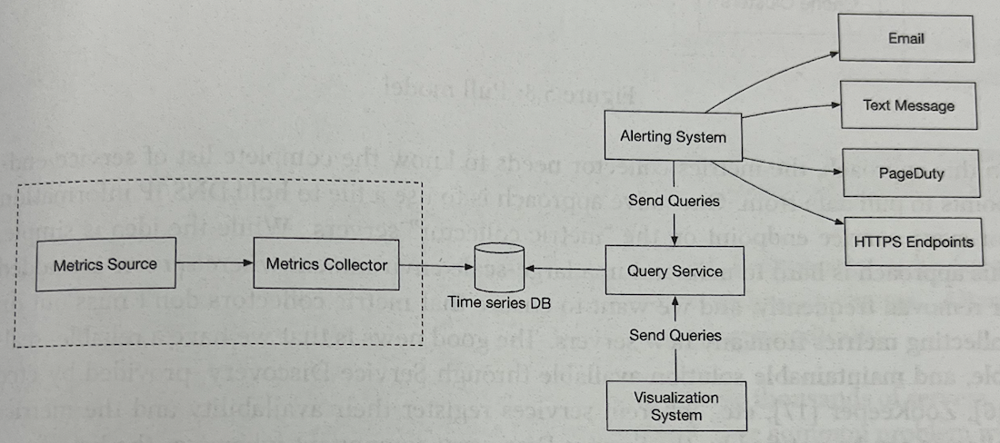

#### Pull vs Push models

- Metric data가 수집되기 위해서는 pull 또는 push 방식을 사용할 수 있다. 이 둘 중 어떤 것이 정답인지는 절대 정해져 있지 않다.  
  다만 이 둘을 비교해보며 이 시스템에는 어떤 것이 더 적합한지를 따져보자.

#### Pull model

- 아래 그림은 HTTP 상에서 pull model을 사용해 데이터를 모으는 과정을 보여준다.  
  실행중인 애플리케이션들에게서 주기적으로 metric 값들을 수집해오는 역할만을 담당하는 metric collector가 있다.

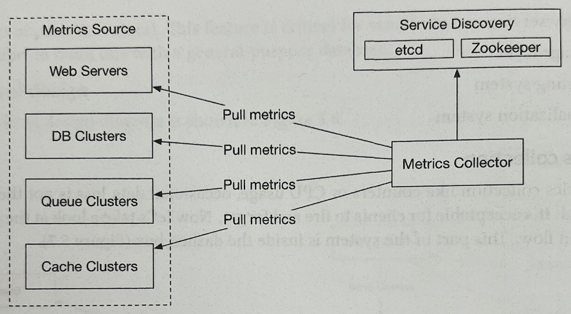

- 이 방식에서 metrics collector는 어디서 데이터를 pull해올지를 알기 위해 서비스들의 endpoint들을 알고 있어야 한다.  
  이를 위한 직관적인 접근법으로 metric collector 서버들이 모든 서비스 endpoint들의 DNS/IP 정보를 담은 파일을 갖도록 할 수 있다.  
  이 방식은 간단하지만 대규모 환경에서는 서버들이 자주 추가되고 삭제되고, metric collector들이 새로운 서버들의 metric을 수집하지 못하는 상황을  
  막기 위해 유지보수하는 과정이 꽤나 복잡하다. 이를 위해 etcd, ZooKeeper 등의 운영이 쉬운 service discovery를 사용할 수 있다.  
  Service discovery component를 사용하면 각 서비스들은 자신의 가용 상태를 service discovery component에 등록하고, metric collector는  
  이 service discovery component로부터 서비스들의 endpoint에 변경 사항이 생길 때마다 통지 받을 수 있다.

- Service discovery는 아래 그림처럼 언제, 그리고 어디로부터 metric을 수집해야 할지에 대한 설정 규칙들을 담고 있다.

  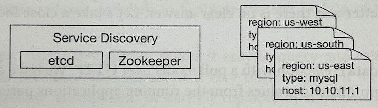

- 아래 그림은 pull model에 대한 더 상세한 과정을 나타낸다.

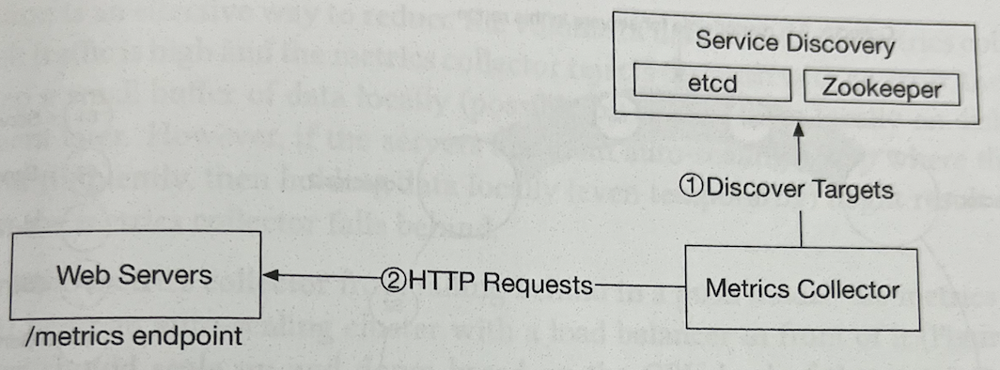

- 각 흐름을 살펴보자.

  - (1) Metrics collector가 Service discovery로부터 서비스의 endpoint 및 설정 metadata들을 가져온다.  
    이 설정 metadata는 pulling을 할 주기, IP 주고, timeout 값 및 재시도 등을 위한 파라미터를 갖는다.

  - (2) Metrics collector가 사전에 정의된 HTTP endpoint를 통해 metric data를 pull한다.  
    이 endpoint를 위해서 metric을 가져올 서비스(이 그림에서는 Web Servers)는 보통 클라이언트 라이브러리를 사용한다.

  - (3) 선택적으로 이 endpoint가 변경되었을 때 metrics collector가 이를 알 수 있도록 service discovery가 이를 metrics collector에게  
    통지하도록 할 수 있다. 다른 방식으로 metrics collector가 endpoint의 변경을 감지하기 위해 주기적으로 polling을 할 수도 있다.

- 우리가 설계하는 시스템의 규모에서 단 하나의 metrics collector를 사용해 수천대의 서버를 감당하기는 어렵다. 요구사항을 감당하기 위해서는  
  metrics collector들의 pool을 사용해야 한다. 여러 개의 metrics collector가 있을 때 흔히 생기는 문제로 한 개 이상의 metrics collector가  
  동일한 서비스의 metric data를 pull함으로써 중복 데이터를 발생시킬 수 있다. 이를 방지하기 위해서는 일종의 coordination scheme가 있어야 한다.

- 하나의 방법으로 각 metrics collector를 consistent hash ring 위에 위치시키고, 각 서비스에게 고유한 값을 부여해 consistent hash ring에  
  위치시킬 수 있을 것이다. 이렇게 하면 하나의 서비스가 단 하나의 metrics collector에 의해 데이터가 수집된다는 것을 보장할 수 있다.  
  예시를 통해 더 자세히 살펴보자.

- 아래 그림에 나타난 것처럼 4개의 metrics collector들과 6개의 서비스들이 있다고 해보자. 각 metrics collector는 자신에게 반시계 방향으로  
  인접한 서비스들의 metric을 수집하는 책임을 갖는다.

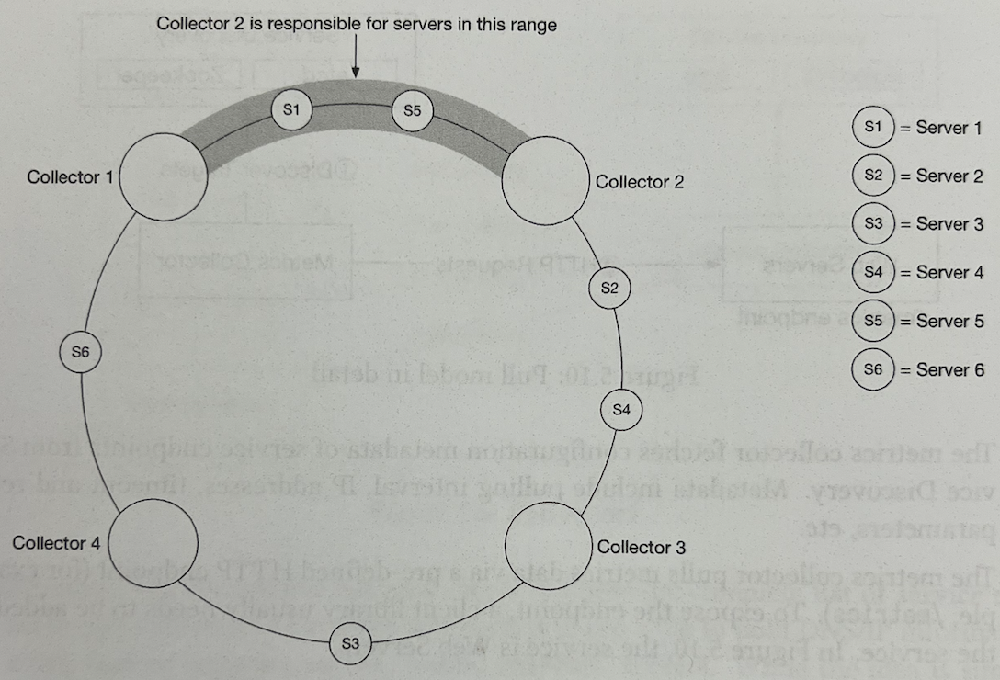

- Metrics collector 2는 Server 1, Server 5의 metric 정보를 수집해야 한다.

#### Push model

- 아래 그림에 나타난 것처럼 push model에서는 다양한 서비스들이 metrics collector에게 자신의 metric data를 push 한다.

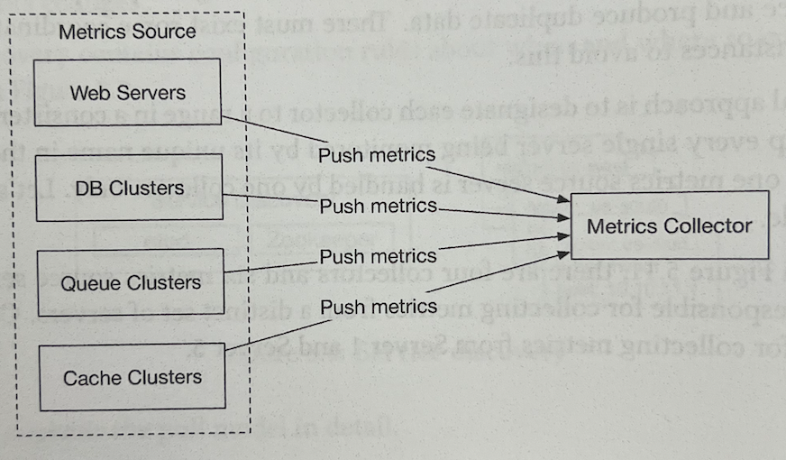

- Push model에서는 일반적으로 collection agenr가 모니터링되는 각 서비스에 설치된다. Collection agent는 long-running software로,  
  서비스의 metric을 수집하고 이 metric을 metrics collector에게 주기적으로 push하는 역할을 담당한다. Collection agent는  
  metric을 metrics collector에게 전달하기 전에 로컬에서 취합할 수도 있다.

- Metric을 로컬에서 취합하는 것은 metrics collector에게 전달되는 데이터의 volume을 줄이는 효과적인 방법이다.  
  만약 push traffic이 높고 metrics collector가 에러를 내뱉으며 push를 거절한다면, collection agent는 전달에 실패한 데이터들을 저장하기  
  위한 작은 buffer를 로컬(디스크를 사용할 수도 있다.)에 두고, 이후에 다시 재전송할 수 있다. 하지만 만약 collection agent가 auto scaling  
  group내에 위치해 자주 삭제되고 재생성되는 경우라면 로컬에 데이터를 보관하는 것은 데이터의 누락을 야기하게될 수 있다.

- 이렇게 metrics collector에게 보낼 데이터가 누락되는 것을 방지하기 위해 metrics collector를 auto scaling cluster 안에 두고,  
  앞단에 load balancer를 두도록 해야 한다. 해당 cluster는 metric collector server들의 CPU 부하에 따라 scale up, down을  
  수행해야 한다.

> 즉 metrics collector를 auto-scaling이 되도록 해 데이터를 처리하지 못하는 상황을 없애고, 이렇게 된다면 collection agent도  
> 전달에 실패한 데이터를 담기 위한 buffer를 유지하지 않아도 될 것이다.

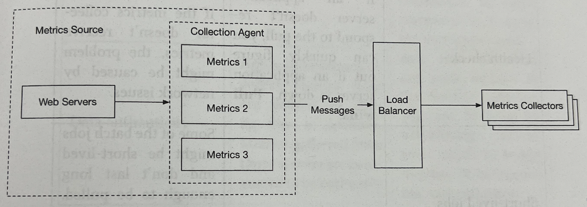

#### Pull or push?

- 그래서 push, pull 중 어떤 방식이 이 시스템에 더욱 적합할까? 정확한 해답은 없다. 이 두 방식 모두 많이 사용된다.

  - Pull: Prometheus 등
  - Push: Amazon CloudWatch, Graphite 등

- 이런 상황이 있을 때는 어떤 선택지가 더 낫다는 것보다, 이 둘의 장단점을 알고, 고려할 수 있어야 한다.

  - 디버깅의 용이함:
    - Pull: 애플리케이션 서버에서 metrics collector가 metric을 pull하기 위한 `/metrics` endpoint를 사용하면 metric을 언제든지  
      조회할 수 있다. 이는 브라우저가 있는 어떤 곳이면 수행 가능하다. 따라서 디버깅은 **pull** 이 더 수월하다.
  - Health check:

    - Pull: 애플리케이션 서버가 pull에 대해 응답이 없다면, 빠르게 애플리케이션 서버가 장애가 났는지 확인하고 대처할 수 있다.  
      따라서 **pull** 이 더 수월하다.
    - Push: Metrics collector가 metric을 수집하지 못할 경우, 네트워크 이슈 때문에 이런 문제가 발생할 수도 있다.

  - 짧은 태스크들:

    - Pull: x
    - Push: 짧은 batch job들은 pull되기 전에 끝나 metric을 수집하지 못할 수도 있다. 따라서 **push** 가 더 수월하다.

  - Firewall 또는 복잡한 네트워크 설정:

    - Pull: Metric server들이 metric을 pulling하도록 하기 위해서는 모든 metric endpoint가 접근 가능해야 한다.  
      만약 여러 개의 data center를 구축해야 한다면, 이것이 문제가 될 수 있다. 더욱 고도화된 네트워크 인프라가 필요할 수도 있다.
    - Push: Metrics collector가 load balancer와 함께 auto scaling group으로 설정되어 있다면 데이터를 어디서든지 관계 없이  
      받을 수 있을 것이다. 따라서 **push** 가 더 수월하다.

  - 성능:

    - Pull: Pull 방식은 대부분 TCP를 사용한다.
    - Push: Push 방식은 UDP를 사용한다. 즉 push가 더욱 낮은 latency로 metric을 전달할 수 있음을 의미한다.  
      단, UDP를 사용해 metrics data를 보내는 것보다 TCP connection을 수립하는 것이 더욱 간단하다는 것을 감안해야 한다.

  - 데이터 인증:
    - Pull: 애플리케이션 서버들은 사전에 정의된 설정 파일에 있는 서버들의 metric들을 수집해야 한다.  
      애초에 service discovery에 의해 관리되는 서버들이기 때문에 이 서버들로부터 전달되는 데이터는 인증되어 있음이 보장된다.
    - Push: 어떤 종류의 클라이언트도 metrics collector에 데이터를 보낼 수 있다. 이는 인증 과정을 추가하거나 metric을 수집할 서버들을  
      whitelisting함으로써 해결할 수 있다.

- 위에서 본 것처럼 pull, push 중 어떤 방식을 선택할 것인지에 대해서는 명확한 해답이 없다.  
  대규모 시스템에서는 최근에 자주 사용되는 serverless를 고려한다면 두 방식 모두를 제공해야 할 수도 있다.  
  Serverless의 경우, 애초에 collection agent를 설치할 방법 조차 없다.

### Scaling the metrics transmission pipleine

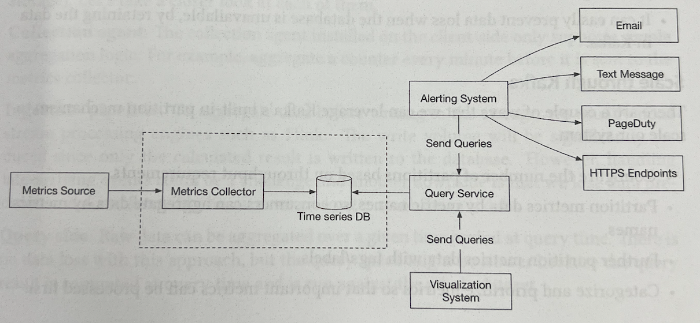

- 이번에는 metrics collector와 time-series database 사이의 관계에 집중해보자. Push model을 사용하든 push model을 사용하든,  
  metrics collector는 서버들의 cluster이며 해당 cluster는 어마무시한 양의 데이터를 받는다. 그리고 metrics collector cluster는  
  auto scaling을 사용해 많은 양의 데이터를 정상적으로 처리하기 위해 적절한 개수의 collector instance들이 존재하도록 한다.

- 하지만 만약 time-series database에 장애가 난다면 데이터의 누락이 발생할 수 있는 여지가 존재한다. 이를 해결하기 위해서는  
  아래와 같이 queueing component를 중간에 둘 수 있다.

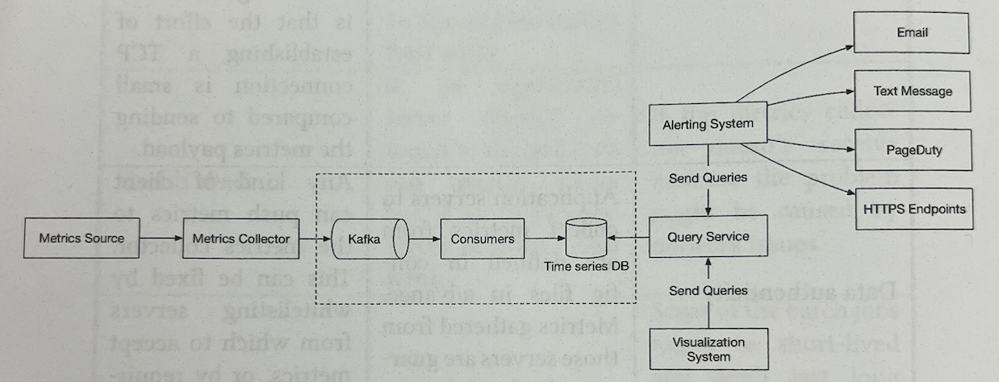

- 위 설계에서 metrics collector는 metric data는 Kafka와 같은 queueing system에 전달한다. 이후 consumer 혹은 Apache Storm,  
  Flink, Spark 등의 streaming processing service들이 데이터를 process하고 time-series database에 전달한다.  
  이 방식은 아래의 장점들을 가진다.

  - Kafka는 높은 안정성, 그리고 확장성을 가진 분산 messaging 플랫폼이다.
  - Data의 수집과 processing을 decoupling한다.
  - 데이터베이스에 장애가 나는 등 데이터베이스를 사용할 수 없는 경우에 데이터를 Kafka에 보관함으로써 데이터의 누락을 방지할 수 있다.

#### Scale through Kafka

- Kafka에 내장된 partition mechanism을 사용해 우리가 설계하는 시스템의 규모를 처리하도록 하는 여러 가지 방법이 있다.

  - 처리량 요구사항에 따라 partition 개수를 설정한다.
  - Consumer들이 metric name으로 데이터를 취합할 수 있도록 metrics data를 metric name을 기준으로 partition한다.
  - Metrics data를 tags/labels 들로도 partition한다.
  - 중요한 metric이 먼저 process될 수 있도록 하기 위해 metric을 분류(categorize)하고 우선순위를 매긴다.(prioritize)

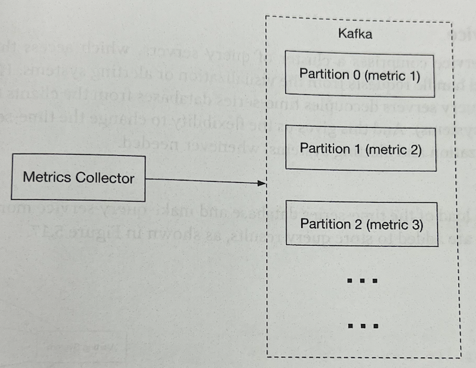

#### Alternative to Kafka

- 프로덕션 규모의 Kafka system을 운영하는 것은 절대 쉬운 일이 아니다. 중간 queue를 사용하지 않고 큰 규모의 모니터링 ingestion system들이  
  존재한다. 대표적으로 부분적으로 네트워크 장애가 발생하더라도 write 연산에 대한 고가용성을 제공하는 Facebook의 in-memory time-series  
  database인 Gorilla가 있다. 즉 Gorilla와 같은 솔루션을 사용하면 Kafka와 같은 중간 queue를 사용하지 않아도 고가옹성을 충분히 제공할 수 있다.

### Where aggregations can happen

- Metric들은 클라이언트단에 있는 collection agent, 데이터베이스에 저장하기 전에 사용되는 ingestion pipeline, 그리고 데이터베이스에 저장된  
  뒤에 사용되는 query에 의해 취합될 수 있다. 각 경우에 대해 자세히 살펴보자.

  - **Collection agent** : 클라이언트단에 설치된 collection agent는 단순한 취합 로직만을 지원한다. 예를 들어 metrics collector에  
    데이터가 전달되기 전에 매 분마다 counter를 증가시키도록 할 수 있다.

  - **Ingestion pipeline** : 데이터베이스에 데이터를 저장하기 전에 취합하기 위해, 주로 Flink와 같은 stream processing engine이  
    필요하다. 이를 사용하면 계산된 결과값들만 데이터베이스에 저장되므로 write volume이 굉장히 줄어들 것이다. 하지만 늦게 도착하는(late-arriving)  
    event들을 다루는 것이 복잡할 수 있고, raw data 자체를 데이터베이스 저장하지 않게 되므로 이후에 유연성 등이 떨어지게 될 것이다.

  - **Query side** : Raw data는 query 시점에 취합될 수 있다. 이 방법을 사용하면 데이터의 누락이 전혀 발생하지 않지만 전체 dataset에  
    대해 query를 수행하고, query의 결과가 query time에 계산되므로 query 속도가 느릴 것이다.

### Query service

- Query service는 query server들의 cluster로 time-series database에 접근할 수 있으며 시각화, 또는 알림 시스템이 호출하는 요청을  
  처리한다. 이런 query service를 갖는 것은 클라이언트(시각화, 알림 시스템)와 time-series database 사이를 decoupling한다.  
  그리고 필요할 때마다 time-series database 또는 시각화, 알림 시스템을 교체할 수 있도록 해준다.

### Cache layer

- Time-series database의 부하를 줄이고 query service가 더 좋은 성능을 내도록 하기 위해서 query 결과값들을 저장하기 위한 cache server들을  
  사용할 수 있다.

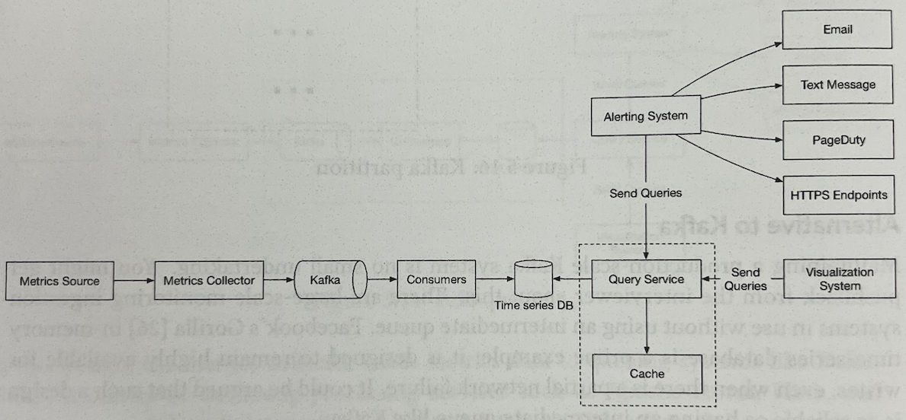

#### The case against query service

- 대부분의 산업 규모의 시각화 및 알림 시스템은 유명한 time-series database와 상호작용하기 위해 자체적으로 제공하는 plugin이 제공되기 때문에  
  굳이 직접 Query service를 만들 필요가 없을 수도 있다. 그리고 좋은 time-series database를 사용하면 자체적으로 caching을 수행하기 때문에  
  caching server도 구축할 필요가 없을 수도 있다.

#### Time-series database query language

- Prometheus, InfluxDB 등 유명한 metrics 모니터링 시스템은 SQL을 사용하지 않고 직접 제공하는 query 언어가 존재한다.  
  이렇게 직접 query 언어를 제공하는 가장 큰 이유 중 하나는 time-series data에 질의하기 위한 SQL문을 작성하는 것이 매우 복잡하기 때문이다.  
  예를 들어 아래의 sql문을 보자. 해당 sql문은 지수적으로 변동되는 평균값을 계산한다.

```sql
SELECT id, temp, avg(temp) over (partition by group_nr order by time_read) as rolling_avg
FROM (
  SELECT id, temp, time_read, interval_group, id - row_number() over (partition by interval_group order by time_read) as
  group_nr from (
    select id, time_Read, "epoch"::timestamp + "900 seconds"::interval * (
      extract(epoch from time_read)::int4 / 900) as interval_group, temp from readings
  ) t1
) t2
order by time_read;
```

- 이를 InfluxDB가 제공하는 time-series data의 분석을 위해 최적화된 Flux를 사용해 작성하면, 아래와 같이 훨씬 간단해지고 이해하기 쉬워진다.

```flux
from(db:"telegraf")
  |> range(start: -1h)
  |> filter(fn: (r) => r._measurement == "foo")
  |> exponentialMovingAverage(size:-10s)
```

### Storage layer

- 이제 storage layer에 대해 자세히 다뤄보자.

#### Choose a time-series database carefully

- Facebook에 의하면 운영을 위해 수행된 query들의 85%는 26시간 내의 데이터들 만을 조회하는 데에 사용되었다고 한다.  
  만약 이러한 속성을 잘 다룰 수 있는 time-series database를 사용하면 시스템의 전체적 성능을 매우 높일 수 있을 것이다.

#### Space optimization

- 개략적 설계를 할 때의 요구사항을 봤을 때, 저장해야 할 metric data의 양이 어마무시하다는 것을 알 수 있다.  
  이를 적절히 처리하기 위한 몇 가지 전략들을 살펴보자.

##### Data encoding and compression

- Data encoding과 압축은 데이터의 크기를 굉장히 줄일 수 있다. 이 기능들은 보통 좋은 time-series database라면 내장된 형태로 제공한다.  
  아래는 data encoding의 간략한 예시이다.

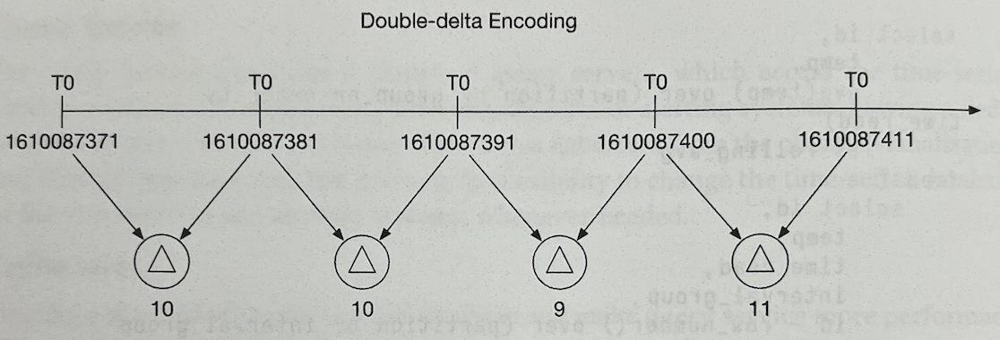

- 위 그림에서 알 수 있듯이 `1610087371`과 `1610087381`은 10초의 차이를 가지며 전체 32bit의 timestamp를 사용하지 않고 4bit만으로 이 둘의  
  차이를 표현해낼 수 있다. 따라서 전체 값을 저장하는 대신, base value 하나와 함께 값들의 delta만 저장해도 된다.  
  위 그림의 경우 `[1610087371, 10, 10, 9, 11]`로 표현할 수 있다.

##### Downsampling

- Downsampling은 high-resolution data를 low-resolution으로 변경하는 프로세스로, 전체적인 디스크 사용량을 줄이기 위해 사용된다.  
  이 시스템의 경우 데이터의 저장 주기가 1년 이므로 오래된 데이터들을 downsampling할 수 있다. 예를 들어 엔지니어나 data scientest들에게  
  각기 다른 metric에 대해 규칙을 정의하도록 할 수 있다. 아래는 하나의 예시이다.

  - Retention: 7일, no sampling
  - Retention: 30일, 1minute-resolution으로 downsampling
  - Retention: 1년, 1hour-resolution으로 downsampling

- 다른 직관적인 예시를 살펴보자. 아래 예시는 10-second resolution data를 30-second resolution data로 취합한다.  
  우선 10-second resolution data를 보자.

  | metric | timestamp            | hostname | metric_value |
  | ------ | -------------------- | -------- | ------------ |
  | cpu    | 2022-07-04T19:00:00Z | host-a   | 10           |
  | cpu    | 2022-07-04T19:00.10Z | host-a   | 16           |
  | cpu    | 2022-07-04T19:00.20Z | host-a   | 20           |
  | cpu    | 2022-07-04T19:00.30Z | host-a   | 30           |
  | cpu    | 2022-07-04T19:00.40Z | host-a   | 20           |
  | cpu    | 2022-07-04T19:00.50Z | host-a   | 30           |

- 이제 10초 단위가 아닌 30초 단위로 변경해 30-second resolution data로 이를 변경해보자.

| metric | timestamp            | hostname | metric_value |
| ------ | -------------------- | -------- | ------------ |
| cpu    | 2022-07-04:19:00:00Z | host-a   | 19           |
| cpu    | 2022-07-04:19:00:30Z | host-a   | 25           |

##### Cold storage

- Cold storage는 매우 드물게 사용되는 비활성 데이터를 보관하기 위한 storage이다. 일반 storage보다 훨씬 더 저렴한 가격에 사용할 수 있다.

### Aletering system

- 이번에는 알림 시스템에 대해 살펴보자.

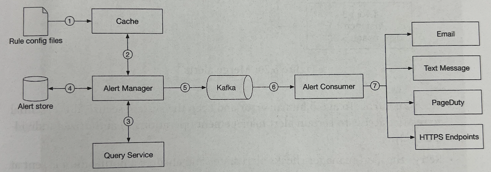

- 알림을 위한 과정은 아래와 같다.

  - (1) 알림 규칙들이 정의된 설정 파일들을 cache server에 저장한다. 규칙들은 디스크 상에 config file로 정의되어 있다.  
    일반적으로 규칙을 정의하기 위해서는 YAML 형탱를 많이 사용한다. 아래는 알림 규칙의 한 가지 예시이다.

    ```yaml
    - name: instance_down
    rules:

    # Alert for any instance that is unreachable for >5 minutes.
    - alert: instance_down
      expr: up == 0
      for: 5m
      labels:
      severity: page
    ```

  - (2) Alert Manager가 cache로부터 알림 설정들을 가져온다.
  - (3) 알림 규칙에 따라 alert manager는 사전에 정의된 주기에 따라 query service를 호출한다. 만약 호출 결과가 특정 임계치를 위반한다면  
    알림 이벤트가 생성된다. Alert manager는 아래의 것들에 대한 책임을 가진다.

    - 알림을 filter, merge, 그리고 dedupe한다. 아래는 하나의 instance에 대해 짧은 시간의 차이로 발생한 알림들을 merge하는 예시이다.

      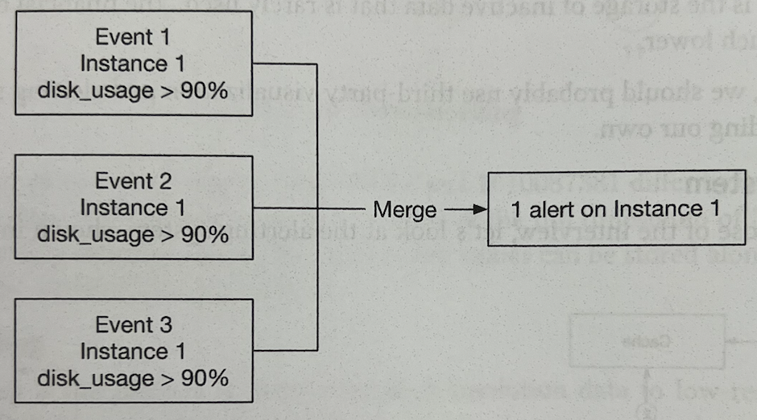

    - 접근 제어: Humen error를 피하고 시스템의 보안을 유지하기 위해서는 알림을 관리하기 위한 작업을 인증된 개체만이 수행할 수 있도록 해야한다.
    - 재시도: Alert manager는 알림의 상태를 검사하고, 최소 1번은 알림이 전달되었음을 보장한다.

  - (4) Alert store는 Cassandra와 같은 key-value database로 모든 알림의 상태(in-active, pending, firing, resolved)를  
    저장한다. 알림이 최소 1번은 전달되었음을 보장하기 위해 사용된다.

  - (5) 알림들은 Kafka에 전달된다.
  - (6) Alert consumer들은 알림 이벤트를 Kafka로부터 pull한다.
  - (7) Alert consumer들은 알림 이벤트를 Kafkaf로부터 받아와 처리하고, email, 문자 메시지, PagerDuty, HTTP endpoint 등 다양한  
    channel을 통해 알림을 전송한다.

#### Alerting system - build vs buy

- 산업 규모의 알림 시스템들이 존재하며, 이들은 유명한 time-series database와의 연동 방식을 직접 개발해 제공한다.  
  이런 알림 시스템들은 이메일, PagerDuty 등 다양한 알림 channel들과 잘 연동할 수 있게 해준다. 실세계에서는 알림 시스템을 직접 구축하기란  
  그것만으로도 꽤나 벅차고 어려운 일이다.

### Visualization system

- 시각화 시스템은 data layer의 상단에 존재한다. Metric data들은 다양한 time scale로 metrics dashboard에 표현될 수 있고,  
  알림들은 alerts dashboard에서 볼 수 있다. 아래 그림은 현재 서버의 요청량, memory/CPU 사용량, 페이지 로드 시간, 트래픽, 그리고  
  로그인 정보 등을 나타내는 dashboard의 예시이다.


- 높은 퀄리티의 시각화 시스템을 직접 구축하는 것은 꽤나 어려운 일이다. 이미 개발되어 있는 시스템을 사용하는 것이 훨씬 편하다.  
  예를 들어, Grafana를 사용할 수 있다. Grafana는 많은 유명한 time-series database와의 연동을 지원한다.

---

## 마무리

- 이번 장에서는 metrics monitoring, alerting system의 설계를 진행해보았다.  
  개략적으로는 data collection, time-series database, 알림, 그리고 시각화에 대해 다뤄보았다.  
  그리고 아래의 중요한 기술, 컴포넌트들에 대해 더욱 자세히 다뤄보았다.

  - Metrics data를 모으기 위한 Pull model, Push model
  - Kafka를 사용해 시스템을 확장하도록 하는 방식
  - 적절한 time-series database를 고르는 과정
  - 데이터량을 줄이기 위한 downsampling
  - 알림 및 시각화 시스템을 직접 구축할지, 존재하는 시스템을 사용할지에 대한 논의

- 상세 설계 이후 완성된 설계도는 아래와 같다.


