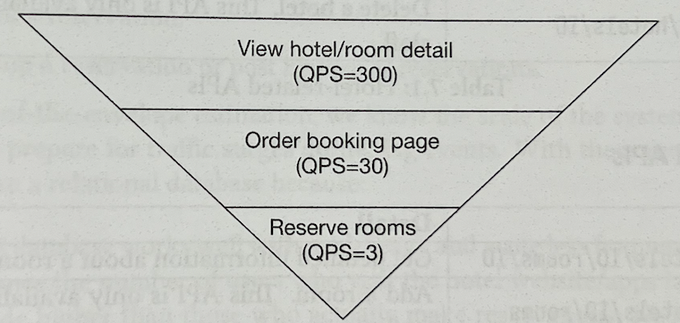
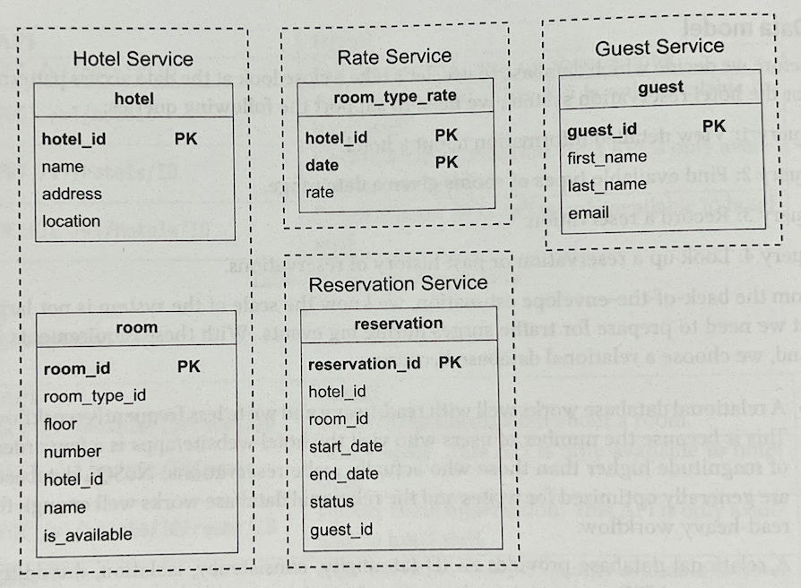
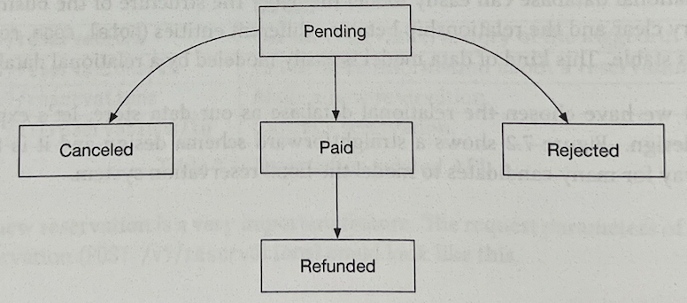
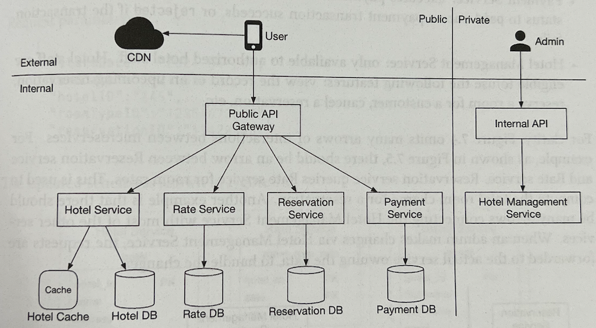
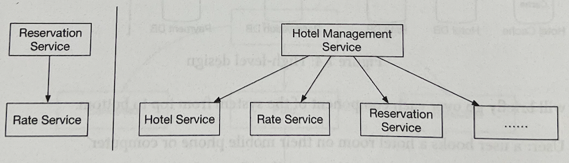

# Hotel Reservation System

- 이번 장에서는 Marriott International 등과 같은 호텔들의 예약 시스템을 설계해볼 것이다.  
  여기서 볼 설계와 기술들은 아래와 같이 예약과 관련된 다른 주제들에도 적용 가능하다.

  - Airbnb 설계
  - 항공 예약 시스템 설계
  - 영화 티켓 예약 시스템 설계

## 문제 이해 및 설계 범위 확정

- 호텔 예약 시스템은 복잡하고 사용되는 컴포넌트들은 비즈니스 요구사항에 따라 각각 다르다.  
  설계를 시작하기 전, 우선 요구사항을 확실히 파악해보자.

### 요구사항

- 5000개의 호텔이 있으며 총 100만개의 방이 있다.
- 예약 시 바로 결제가 이뤄진다.
- 사용자들은 호텔이 제공하는 웹사이트나 앱을 통해 예약할 수 있다.
- 예약은 취소할 수 있다.
- 10%의 overbooking을 허용한다.
  > Overbooking: 호텔이 실제로 가진 방 개수보다 더 많은 예약을 받도록 하는 것. 주로 예약 취소 등에 대해 대비하기 위해 사용된다.
- 아래의 사항들에 대해 집중한다.
  - 호텔 관련된 페이지 제공
  - 호텔 내의 방과 관련된 상세 페이지 제공
  - 방 예약
  - 호텔과 방 정보를 추가, 삭제, 갱신할 수 있는 어드민 페이지 제공
  - Overbooking 기능
- 호텔의 가격은 동적으로 변경된다. 예를 들어, 주어진 일자에 예약이 많을 것으로 예상되면 가격은 인상된다.  
  따라서 가격이 매일 다를 수 있다고 생각한다.

### 그 외의 요구사항들

- High concurrency: 성수기나 큰 행사가 있는 등의 상황에 동일한 방에 대해 예약을 하려 하는 고객들이 몰릴 수 있다.
- Moderate latency: 사용자가 예약을 할 때 빠른 response time이 있으면 좋지만, 예약 요청을 처리하는 데 최대 n초가 소요되도 된다.

### 수치화 및 추가 정보

- 위 요구사항들로부터 수치화한 내용들은 아래와 같다.

  - 총 5000개의 호텔이 있으며 100만개의 방이 있다.
  - 70%의 방이 이미 사용되고 있으며 평균 stay duration은 3일로 가정한다.
  - 일일 예상 예약 횟수: `100만 * 0.7 / 3 = 233,333`, 대략 240,000으로 가정한다.
  - 초당 예약 횟수: `240,000 / 10^5 = 3` (TPS가 그렇게 높지 않다.)

- 다음으로 이 시스템이 제공해야 하는 모든 페이지들의 QPS를 대략적으로 계산해보자.

  - 호텔, 방의 상세 피이지 조회(query)
  - 예약 페이지 조회(query): 사용자들은 일자, 사용자 수, 결제 정보 등 예약 상세 정보를 조회한다.
  - 방 예약(transaction): 사용자들은 _"예약"_ 버튼을 클릭해 방을 예약하고, 완료되면 방은 예약 처리 된다.

- 10%의 사용자들이 다음 depth로 넘어간다고 가정하고, 90%의 사용자들이 최종 단계까지 가기 전에 떨어져 나간다고 가정하자.  
  또한 prefetching feature이 없다고 가정하자. 아래 그림은 각 단계별로 대략적인 QPS를 나타낸다.  
  최종 예약에 대한 TPS가 3인 것은 주어졌으므로 이로부터 거꾸로 올라가 계산하면 된다. 예약 페이지의 QPS는 30이며 호텔 및 방에 대한  
  상세 페이지의 QPS는 300이다.



---

## 개략적 설계안 제시 및 동의 구하기

- 이번에는 아래의 내용들에 대해 다뤄볼 것이다.

  - API 설계
  - Data model
  - 개략적 설계안

### API 설계

- 호텔 예약 시스템을 위한 API 설계를 해보자. 대부분의 중요한 API들은 RESTful convention에 따라 설계된다.

> 이번 장은 호텔 예약 시스템의 설계에 대해 집중한다는 점에 유의하자. 완성된 호텔 웹사이트에서는 사용자들이 다양한 조건들에 맞춰 적절한 방을 검색하는  
> 기능 등의 다양한 기능이 추가되어야 할 것이다. 이러한 검색 기능 등을 제공하는 API들은 중요하지만 설계하는 것이 그렇게 어렵지 않다.  
> 따라서 이러한 것들은 다루지 않는다.

#### 호텔 관련 API들

| API                  | 설명                                            |
| :------------------- | :---------------------------------------------- |
| GET /v1/hotels/ID    | 호텔의 상세 정보 조회                           |
| POST /v1/hotels      | 새로운 호텔 추가, 오직 관리자만 호출할 수 있다. |
| PUT /v1/hotels/ID    | 호텔 정보 갱신, 오직 관리자만 호출할 수 있다.   |
| DELETE /v1/hotels/ID | 호텔 삭제, 오직 관리자만 호출할 수 있다.        |

#### 방 관련 API들

| API                           | 설명                                          |
| :---------------------------- | :-------------------------------------------- |
| GET /v1/hotels/ID/rooms/ID    | 방의 상세 정보 조회                           |
| POST /v1/hotels/ID/rooms      | 새로운 방 추가, 오직 관리자만 호출할 수 있다. |
| PUT /v1/hotels/ID/rooms/ID    | 방 정보 갱신, 오직 관리자만 호출할 수 있다.   |
| DELETE /v1/hotels/ID/rooms/ID | 방 삭제, 오직 관리자만 호출할 수 있다.        |

#### 예약 관련 API들

| API                        | 설명                                              |
| :------------------------- | :------------------------------------------------ |
| GET /v1/reservations       | 로그인한 사용자의 예약 히스토리 조회              |
| GET /v1/reservations/ID    | 로그인한 사용자의 특정 예약에 대한 상세 정보 조회 |
| POST /v1/reservations      | 새로운 예약 생성                                  |
| DELETE /v1/reservations/ID | 예약 취소                                         |

- 새로운 예약을 만드는 것은 굉장히 중요한 기능이다. 새로운 예약을 생성하는 `POST /v1/reservations`의 파라미터는 아래와 같을 것이다.

```json
{
  "startDate": "2022-07-21",
  "endDate": "2022-07-23",
  "hotelID": "245",
  "roomID": "U123456789",
  "reservationID": "13422445"
}
```

- 위에서 사용되는 reservationID는 double booking을 방지하기 위한 멱등(idempotent) key로 사용된다는 점에 유의하자.  
  동일한 방에 대해 동일한 날짜에 예약이 1개 이상 생성되는 것을 double booking이라 한다.

### Data model

- 어떤 데이터베이스를 사용할지 다루기 전에 우선 data access pattern을 살펴보자.  
  호텔 예약 시스템에서는 아래의 query들을 지원해야 한다.

  - Query 1: 호텔의 상세 정보 조회
  - Query 2: 주어진 날짜 범위에 예약 가능한 방 조회
  - Query 3: 예약 정보 기록
  - Query 4: 예약 정보 조회(과거 내역 포함)

- 이전에 수치화하는 단계에서 봤듯이 시스템의 규모는 그렇게 크지 않지만, 트래픽이 갑자기 증가하는 등의 상황을 잘 처리할 수 있어야 한다.  
  이 요구사항을 토대로 우리는 RDBMS를 선택할 것인데, 이유는 아래와 같다.

  - RDBMS는 read-heavy, write-less workflow와 적합하다. 이 시스템에서 호텔의 웹사이트, 페이지에 접근하는 사용자 수에 비해 실제 예약까지  
    진행하는 사용자 수는 매우 적다. NoSQL은 일반적으로 write에 최적화되어 있고 DBMS는 reead-heavy workflow에 대해 잘 동작한다.

  - RDBMS는 ACID를 보장한다. 예약 시스템에서 ACID는 매우 중요하다. 이 속성이 없다면 negative balance, double charge, double  
    reservation 등의 문제를 쉽게 예방하기 어렵다. 그리고 ACID 속성은 애플리케이선 코드를 훨씬 더 간단하게 작성하도록 한다.

  - RDBMS는 데이터를 쉽게 모델링할 수 있다. 비즈니스를 위한 데이터들은 매우 명확하며 이들 간의 관계도 명확하다. `hotel`, `room`,  
    `room_type` 등이 있으며 관계가 쉽게 변하지 않는다. 이런 데이터는 RDBMS에서 사용하기에 최적이다.

- 데이터를 보관할 곳으로 RDBMS를 선택했으니 스키마 설계를 보자. 아래 그림은 일반적으로 많은 사람들이 설계할 스키마를 보여준다.

  

- 대부분의 속성들은 어떤 정보를 담는지 명확하기 때문에 `reservation` 테이블의 status 필드에 대해서만 첨언을 하자면, 이 필드는  
  pending, paid, refunded, canceled, rejected의 상태 중 하나를 갖는다. State machine은 아래와 같다.

  

- 위 스키마 설계는 매우 큰 한 가지 문제가 있다. 이 data model은 Airbnb와 같이 _방_ 이 주 단위일 때는 문제없이 사용 가능하다.  
  하지만 호텔을 그렇지 않다. 사용자는 사실 특정 호텔 방의 _종류_ 를 예약하지, 방 자체를 예약하지 않기 때문이다. 예를 들어 room type은  
  king-size room, 2개의 queen-size 침대가 있는 queen-size room 등이 있을 수 있다. 실제 해당 사용자가 지낼 room number는  
  사용자가 호텔에 체크인하는 시점에 결정되지, 예약하는 시점에 결정되지 않는다. 따라서 이에 대처할 수 있도록 data model을 수정해야 한다.  
  이는 이후 상세 설계 부분에서 더 다룰 것이다.

### 개략적 설계안

- 이번 호텔 예약 시스템에서는 MSA를 사용할 것이다. 지난 몇 년 동안 MSA의 인기는 지속적으로 상승세를 타고 있다. Amazon, Netflix,  
  Uber, Airbnb, Twitter 등이 MSA를 사용하고 있다.

- 이 설계는 위에서 말한 것처럼 MSA로 진행될 것이며, 개략적 설계안은 아래와 같다.



- 각 컴포넌트들을 위에서 아래로 하나씩 간단히 살펴보자.

  - User: 사용자는 호텔 방을 휴대폰이나 컴퓨터로 예약한다.
  - Admin(hotel staff): 인증된 호텔 관리자는 사용자 환불, 예약 취소, 방 정보 갱신 등 관리자 작업을 수행한다.
  - CDN: 빠른 load time을 위해 Javascript bundle, 이미지, 비디오, HTML 등 모든 정적인 자원들을 CDN에 caching한다.
  - Public API Gateway: 이 컴포넌트는 rate limiting, 인증 등을 모두 완전 관리형으로 제공한다. API Gateway는 endpoint를  
    기반으로 요청을 적절한 서비스로 routing하는 역할을 담당한다. 예를 들어 호텔 홈페이지를 조회하는 요청은 Hotel service로, 예약을 하려는  
    요청은 Reservation service로 routing된다.
  - Internal APIs: 이 API들은 오직 인증된 관리자들만 사용할 수 있다. Internal 소프트웨어 혹은 웹사이트를 통해서만 접근할 수 있다.  
    이런 internal API들은 보통 VPN 등을 사용해 보안을 한 단계 더 높인다.
  - Hotel service: 호텔과 방에 대한 상세 정보를 제공한다. 이 정보들은 일반적으로 정적이므로 caching하기 쉽다.
  - Rate service: 매일 변하는 방의 가격을 제공한다.
  - Reservation service: 예약 요청을 받아 방을 예약한다.
  - Payment service: 사용자로부터 결제 정보를 받아 결제를 처리하며 결제가 성공하면 예약 상태를 paid로 갱신하고, 실패하면 rejected로 변경한다.
  - Hotel management service: 인증된 관리자들만 사용할 수 있는 서비스로, 다가오는 예약 정보 확인, 고객을 위한 방 예약, 예약 취소 등의  
    작업을 수행한다.

- 아래 그림은 위에서 본 개략적 설계안 중 microservice들 사이의 관계를 더 자세히 표현한 것이다. 예를 들어 변경되는 방의 가격을 확인하기 위해  
  reservation service와 rate service는 소통해야 하며 hotel management service는 다양한 작업을 처리하기 위해 다른 많은 서비스들과  
  소통할 수 있어야 한다. 만약 관리자가 hotel management service를 통해 특정 작업을 수행하면, 해당 작업은 실제로 해당 작업에 대한 책임을  
  가지는 microservice로 전달되어 그 곳에서 처리된다.

  

- 많은 사용 시스템들에서는 microservice들 사이의 통신(inter-service communication)에 gRPC와 같은 현대적이고 성능이 보장되는  
  RPC(remote procedure call) 프레임워크를 사용한다.

---
