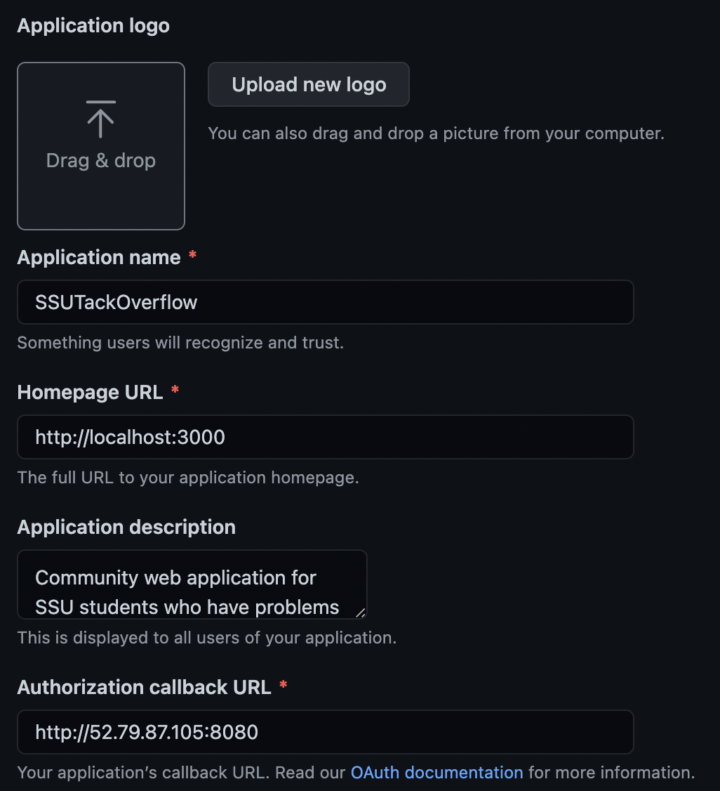

<h1>Github OAuth2 Login 구현</h1>

- 어떤 프로젝트에서 Github OAuth2 로그인 연동을 구현해야한 적이 있다.  
  인터넷에 나와있는 대부분의 코드들은 Thymeleaf 등의 STE를 사용하는 예제들이 많았는데,  
  아래 설명은 프론트엔드 코드는 ReactJS로 따로 있고, 백엔드 코드를 Spring으로 작성한 예시이다.

- 또한 ReactJS의 코드는 `localhost:3000`에서, 그리고 백엔드 코드는 `localhost:8080`에서 구동된다고 가정한다.

- 참고로 Github의 `OAuth Apps` 설정은 아래와 같다.



<h2>Spring Security 도입하기</h2>

- Spring Security는 Google, Facebook, Github 등에 대한 OAuth2 지원을 기본적으로 해준다.
- 우선 Spring Security를 통해 OAuth를 사용하기 위한 의존성은 아래와 같다.

```gradle
dependencies {
    // Other dependencies..
    implementation('org.springframework.boot:spring-boot-starter-oauth2-client')
}
```

<hr/>

<h2>Properties 파일 작성하기</h2>

- 가장 먼저, Github가 발급해주는 `CLIENT_ID`와 `CLIENT_SECRET` 등의 인증 정보를 property 파일에 지정해야 한다.  
  나는 이 값들을 환경변수에 저장해서 사용하는 방식을 선택했다.

```properties
# Other properties..

spring.security.oauth2.client.registration.github.client-id=${GH_CLIENT_ID}
spring.security.oauth2.client.registration.github.client-secret=${GH_CLIENT_SECRET}
spring.security.oauth2.client.registration.github.scope=read:user
```

- `spring.security.oauth2.client.registration.github.client-id` : Github가 제공한 `CLIENT_ID` 값
- `spring.security.oauth2.client.registration.github.client-secret` : Github가 제공한 `CLIENT_SECRET` 값
- `spring.security.oauth2.client.registration.github.scope`: OAuth2로 읽어올 사용자의 정보 범위(scope)

<h2>Spring Security Configuration</h2>

- 가장 먼저, Spring Security 설정 클래스를 작성해보자.  
  아래의 `SecurityConfig` 클래스가 설정 클래스이다.

```java
@RequiredArgsConstructor
@EnableWebSecurity
public class SecurityConfig extends WebSecurityConfigurerAdapter {

    private final GithubOAuth2UserService githubOAuth2UserService;

    @Override
    protected void configure(HttpSecurity http) throws Exception {

        http
                .httpBasic().disable()
                .headers().frameOptions().disable()
                .and().csrf().disable()
                .cors().configurationSource(corsConfigurationSource())
                .and()
                .sessionManagement().sessionCreationPolicy(SessionCreationPolicy.STATELESS)
                .and()
                    .authorizeRequests()
                        .antMatchers("/v1/**")
                        .permitAll()
                .and()
                    .logout()
                        .logoutSuccessUrl("/")
                .and()
                    .oauth2Login()
                        .successHandler(authenticationSuccessHandler())
                        .failureHandler(authenticationFailureHandler())
                        .userInfoEndpoint()
                        .userService(githubOAuth2UserService);
    }

    @Bean
    public CorsConfigurationSource corsConfigurationSource() {
        CorsConfiguration configuration = new CorsConfiguration();
        configuration.addAllowedOriginPattern("*");
        configuration.addAllowedHeader("*");
        configuration.addAllowedMethod("*");
        configuration.setAllowCredentials(true);

        UrlBasedCorsConfigurationSource source = new UrlBasedCorsConfigurationSource();
        source.registerCorsConfiguration("/**", configuration);
        return source;
    }

    @Bean
    public AuthenticationFailureHandler authenticationFailureHandler() {
        return new GithubOAuthExceptionHandler();
    }

    @Bean
    public AuthenticationSuccessHandler authenticationSuccessHandler() {
        return new GithubOAuthOnSuccessHandler();
    }
}
```

- 위 코드에 대한 설명은 아래와 같다.
  - `http.httpBasic().disable()` : HTTP 기본 인증 방식을 비활성화 한다.
  - `.headers().frameOptions().disable()` : 응답(Response) 헤더에 Security Header를 비활성화시킨다.
  - `.and().csrf().disable()` : CSRF를 비화성화한다.
  - `.cors().configurationSource(corsConfigurationSource())` : CORS에 사용되는 `CorsFilter`에  
    `corsConfigurationSource()` Bean을 등록한다.
  - `sessionManagement().sessionCreationPolicy(SessionCreationPolicy.STATELSS)` : Stateless Server  
    Application임을 지정한다.
  - `and().authorizeRequests().antMatchers("/v1/**").permitAll()` : `/v1/**`의 패턴에 맞는  
    엔드포인트를 인증 없이 사용할 수 있도록 한다.
  - `and().logout().logoutSuccessUrl("/")` : 로그아웃 성공 url을 지정한다.
  - `and().oauth2Login().successHandler(authenticationSuccessHandler())` : oauth2 로그인이 성공했을 때의  
    작업을 처리할 핸들러를 지정한다.
  - `.failureHandler(authenticationFailureHandler())` : oauth2 로그인 실패 시 예외를 처리할 핸들러를 지정한다.
  - `.userInfoEndpoint().userService(githubOAuth2UserService)` : OAuth2를 사용하여 사용자 정보를 받아온 후  
    작업을 처리할 서비스 클래스를 지정한다.

<hr/>

<h2>인증 정보 저장 클래스 작성</h2>

- 이제 OAuth2 인증을 수행한 후 정보가 담길 클래스를 작성해보자.

```java
@Getter
public class OAuthAttributes {
    private Map<String, Object> attributes;
    private String name;
    private String email;

    @Builder
    public OAuthAttributes(Map<String, Object> attributes, String name, String email) {
        this.attributes = attributes;
        this.name = name;
        this.email = email;
    }

    public static OAuthAttributes ofGithub(Map<String, Object> attributes) {
        if(attributes.get("email") == null) {
            throw new GithubEmailNotPublicException("깃허브 링크에 Public Email이 없습니다. 설정 후 다시 시도해 주세요.");
        }
        return OAuthAttributes.builder()
                .name((String) attributes.get("login"))
                .email((String) attributes.get("email"))
                .attributes(attributes)
                .build();
    }

    public User toEntity() {
        return User.builder()
                .name(name)
                .email(email)
                .role(UserRole.ROLE_USER)
                .auth(UserAuth.GITHUB)
                .build();
    }

```

- 위의 `OAuthAttributes` 클래스의 필드들에 대해 알아보자.

  - 우선 `nameAttributeKey`는 어떠한 OAuth2 서비스를 이용하는지를 구분해준다.  
    예를 들어, Github, Google, Naver의 경우 이 값은 모두 각각 다를 것이다.
  - `attributes`는 OAuth에서 제공받은 정보들을 담는 필드이다.  
    깃허브의 경우에는 name, id, avatar_url, company, location, email, bio, public_repos 등의  
    다양한 정보를 읽어와서 제공해준다. 이 데이터들을 출력해보고 싶다면 `OAuthAttributes#ofGithub()`내에  
    아래 코드를 추가해봐도 된다.

```java
attributes.forEach((key, value) -> System.out.println(key + ": " + value));
```

<hr/>

<h2>Service</h2>

- 이제 OAuth 인증을 받고 나서 사용자 정보를 데이터베이스에 저장하는 서비스 코드를 작성해보자.  
  우선, 서비스 클래스의 이름은 `GithubOAuth2UserService`라 하겠다.

- 이 서비스 클래스가 담당할 비즈니스 로직은 아래와 같다.

  1. Github OAuth2로부터 사용자 정보를 받아와 `OAuthAttributes`에 담는다.
  2. 받아온 정보들을 토대로 사용자(`User`) 테이블에 대해 기존에 없는 정보라면 저장하고,  
     기존에 있는 정보라면 알맞은 사용자를 테이블로부터 불러온다.
  3. 불러온 정보를 토대로 알맞은 JWT Access Token을 발급한다.

- 위 3가지 과정 이후에 AccessToken을 클라이언트에 전달하는 등에 대한 과정은 핸들러가 처리하도록 할 것이다.

- 우선 코드를 보자.

```java
@RequiredArgsConstructor
@Service
public class GithubOAuth2UserService implements OAuth2UserService<OAuth2UserRequest, OAuth2User> {
    private final UserRepository userRepository;
    private final JwtTokenUtil jwtTokenUtil;

    @Override
    public OAuth2User loadUser(OAuth2UserRequest userRequest) throws OAuth2AuthenticationException {
        OAuth2UserService<OAuth2UserRequest, OAuth2User> delegate = new DefaultOAuth2UserService();
        OAuth2User oAuth2User = delegate.loadUser(userRequest);

        String userNameAttributeName = userRequest.getClientRegistration()
                .getProviderDetails().getUserInfoEndpoint()
                .getUserNameAttributeName();

        OAuthAttributes attributes = OAuthAttributes.ofGithub(oAuth2User.getAttributes());
        User user = saveOrFindUser(attributes);

        HttpServletRequest request = ((ServletRequestAttributes) RequestContextHolder.getRequestAttributes()).getRequest();
        request.setAttribute("token", jwtTokenUtil.generateAccessToken(user.getId(), user.getRole()));

        return new DefaultOAuth2User(
                Collections.singleton(new SimpleGrantedAuthority(user.getRole().name())),
                attributes.getAttributes(),
                userNameAttributeName
        );
    }

    @Transactional
    protected User saveOrFindUser(OAuthAttributes attributes) {
        Optional<User> optionalUser = userRepository.findByEmail(attributes.getEmail());
        if(optionalUser.isPresent()) {
            User user = optionalUser.get();
            if(user.getAuth().equals(UserAuth.GITHUB)) {
                return optionalUser.get();
            } else throw new GithubUserAuthException("해당 이메일은 일반 회원가입으로 가입되어 있습니다.");
        } else {
            return userRepository.save(attributes.toEntity());
        }
    }
}
```

- 우선 `GithubOAuth2UserService`는 `OAuth2UserService` 인터페이스를 구현하고 있다.  
  이 인터페이스를 봐보자.

```java
@FunctionalInterface
public interface OAuth2UserService<R extends OAuth2UserRequest, U extends OAuth2User> {
  U loadUser(R userRequest) throws OAuth2AuthenticationException();
}
```

- `R` 타입은 OAuth 2.0 User Request이며, `U` 타입은 OAuth 2.0 User의 타입이다.  
  JavaDoc에 따르면, 이 인터페이스의 구현체는 사용자에 대한 정보를 리소스 소유자(이 경우 Github)로부터 읽어오고,  
  `OAuth2User` 형식에 맞춰 `AuthenticatedPrincipal`을 반환해야 한다고 작성되어 있다.

- `GithubOAuth2UserService`는 `OAuth2UserService<OAuth2UserRequest, OAuth2User>`를 구현한다.  
  이 말은 곧 `GithubOAuth2UserService#loadUser()`가 OAuth 요청에 대한 정보는 `OAuth2UserRequest`가 가지며,  
  리소스 소유자로부터 받아온 정보들을 `OAuth2User`에 담아 반환할 것이라는 뜻이다.

- 다음으로 아래 코드를 보자.

```java
OAuth2UserService<OAuth2UserRequest, OAuth2User> delegate = new DefaultOAuth2UserService()
```

- delegate 변수는 `DefaultOAuth2UserService`의 인스턴스이다. 이 클래스는 `OAuth2UserService` 인터페이스의 구현체로,
  Spring Security가 기본적으로 제공하는 Google, Github 등의 리소스 소유자들에 대해 OAuth2 인증을 진행하게 해준다.

```java
OAuth2User oAuth2User = delegate.loadUser(userRequest);
```

- OAuth2 요청에 대한 정보를 담은 userRequest를 `DefaultOAuth2UserService#loadUser()`에 전달하여  
  인증을 수행한 후, 리소스 소유자로부터 읽어온 사용자 정보를 담은 `OAuth2User`를 받아온다.

```java
OAuthAttributes attributes = OAuthAttributes.ofGithub(userNameAttributeName, oAuth2User.getAttributes());
```

- 사용자 정보를 담고 있는 oAuth2User를 우리가 작성한 `OAuthAttributes`에 전달하여 적절하게 정보를 추출해낸다.

```java
@Transactional
protected User saveOrFindUser(OAuthAttributes attributes) {
  //..
}
```

- 데이터베이스에 접근하여 이메일을 통해 해당 데이터가 존재한다면 존재하는 데이터를 반환하고,  
  존재하지 않는다면 저장한 후 저장된 데이터를 반환한다. 한 가지 유의할 점은 이 예제에서는 Github OAuth2를 통한  
  로그인, 회원가입 방식과 일반 회원가입 방식을 지원한다는 것이다. 만약 `a@a.com`인 이메일이 Github OAuth2를 통해  
  저장된 정보가 아니라, 일반 회원가입을 통해 저장된 정보인데, `a@a.com`를 가진 Github 사용자가 Github OAuth2를 통해  
  인증을 진행하려 할 경우 이메일이 중복되는 현상이 나타나기에 `GithubUserAuthException()`을 던지도록 했다.

- 위 메소드에서 던져지는 `GithubUserAuthException()`와 이를 처리하는 방법은 아래에서 다룰 것이다.

- `GithubOAuth2UserService#saveOrFindUser()`를 통해 `User`객체를 가져온 후 수행되는 작업을 보자.  
  우선 아래 코드를 통해 해당 스레드에서 `HttpServletRequest`를 받아온다. 받아온 후, 직접 작성한 JWT Access Token을  
  생성하고 반환하는 `JwtTokenUtil#generateAccessToken()`를 사용하여 토큰을 생성한 후, `HttpServletRequest`의  
  attribute에 "token"이라는 key로 저장한다.

```java
HttpServletRequest request = ((ServletRequestAttributes) RequestContextHolder.getRequestAttributes()).getRequest();
request.setAttribute("token", jwtTokenUtil.generateAccessToken(user.getId(), user.getRole()));
```

- Spring은 기본적으로 요청(request)마다 하나의 Thread가 생성되어, 해당 request의 수행을 담당하게 된다.  
  위 방식으로 `HttpServletRequest`를 가져와 사용하려면, 애플리케이션 메인 클래스에 아래의 Spring Bean을 추가해줘야 한다.

```java
@SpringBootApplication
@EnableJpaAuditing
public class Application {
    public static void main(String[] args) {
        SpringApplication.run(Application.class, args);
    }

    @Bean
    public RequestContextListener requestContextListener() {
        return new RequestContextListener();
    }
}
```

- 마지막으로 `GithubOAuth2UserService#loadUser()`가 반환하는 객체에 대한 부분을 살펴보자.

```java
@RequiredArgsConstructor
@Service
public class GithubOAuth2UserService implements OAuth2UserService<OAuth2UserRequest, OAuth2User> {

    //..

    @Override
    public OAuth2User loadUser(OAuth2UserRequest userRequest) throws OAuth2AuthenticationException {
        //..

        return new DefaultOAuth2User(
                Collections.singleton(new SimpleGrantedAuthority(user.getRole().name())),
                attributes.getAttributes(),
                userNameAttributeName
        );
    }

    // saveOrFindUser()
}
```

- `DefaultOAuth2User`는 `OAuth2User` 인터페이스의 구현체 중 하나로, 생성자에 들어가는 값들은 아래와 같다.

```java
public DefaultOAuth2User(Collection<? extends GrantedAuthority> authorities, Map<String, Object> attributes, String nameAttributeKey) {
  //..
}
```

- authorities 매개변수는 사용자(`OAuth2User`)에 부여된 권한(authorities)를 담는다.
- attributes 매개변수는 리소스 소유자로부터 읽어온 사용자에 대한 정보들을 담는다.
- nameAttributeKey는 사용자의 "name"을 읽어오는 데에 사용되는 key 값이다.  
  github의 경우 key값이 `id`에 저장된다. 따라서 위 서비스 코드에서 userNameAttributeName의 값은 `id`가 된다.

- 이제 예외 처리에 대해서 알아보도록 하자.

<hr/>

<h2>예외 처리 하기</h2>

<h3>예외 발생 상황</h3>

- 위에서 작성한 `GithubOAuth2UserService#loadUser()`가 수행되는 도중 예외가 발생하면, 알맞게 처리해줘야 한다.  
  나의 경우, OAuth2 scope가 `read:user`이었는데, 사용자의 email을 받아와야지만 회원 가입이 되는 상황이었다.  
  하지만 Github 공식 문서를 보니, **사용자가 Verified && Public** email을 하나 이상 설정해야지만  
  이메일을 읽어올 수 있는 것이었다.

- `GithubOauth2UserService#loadUser()`에서는 `OAuthAttributes.ofGithub()`를 호출한다.  
  그 부분을 다시 봐보자.

```java
@Getter
public class OAuthAttributes {

    //..

    public static OAuthAttributes ofGithub(Map<String, Object> attributes) {
        if(attributes.get("email") == null) {
            throw new GithubEmailNotPublicException("깃허브 링크에 Public Email이 없습니다. 설정 후 다시 시도해 주세요.");
        }
        return OAuthAttributes.builder()
                .name((String) attributes.get("login"))
                .email((String) attributes.get("email"))
                .attributes(attributes)
                .build();
    }

    //..
}
```

- 위의 `ofGithub()`에서 `attributes.get("email")`이 null일 때 `GithubEmailNotPublicException`을  
  발생시키도록 했다. 이 예외가 처리되는 과정에 대해 알아보자.

<h3>예외 클래스 작성하기</h3>

- 우선 Github OAuth 인증 도중, 더 많은 예외를 처리해야할 경우가 있으므로 Github OAuth2 인증 도중에  
  발생하는 모든 예외들에 대한 부모 클래스인 `GithubException`을 먼저 작성했다.

```java
@Getter
public abstract class GithubException extends AuthenticationException {
    protected Integer status;
    protected String message;

    public GithubException(Integer status, String message) {
        super(message);
        this.message = message;
        this.status = status;
    }
}
```

- 그리고 위에서 얘기했던, Verified + Public 이메일이 없을 때 던져지는 `GithubEmailNotPublicException`은 아래와 같다.

```java
@Getter
public class GithubEmailNotPublicException extends GithubException {
    private static final Integer STATUS = HttpStatus.BAD_REQUEST.value();
    public GithubEmailNotPublicException(String message) {
        super(STATUS, message);
    }
}
```

- `GithubEmailNotPublicException`은 `GithubException`을 상속하고, `GithubException`은  
  `org.springframework.security.core.AuthenticationException`을 상속하기 때문에 만약 예외가  
  던져진다면 `AuthenticationFailureHandler`에 의해 처리될 것이다. 왜 `AuthenticationException`이  
  `AuthenticationFailureHandler`에 의해 처리되는지에 대해서는 아래에서 보자.

<h3>예외 처리 핸들러 작성하기</h3>

- Spring Security의 OAuth2를 사용하는 과정에서 발생시키는 예외를 처리하는 클래스는  
  `AuthenticationFailureHandler`의 구현체이다. 하지만 이 인터페이스의 구현체가  
  처리하는 예외 클래스는 `AuthenticationException`이다. 인터페이스 코드를 보자.

```java
public interface AuthenticationFailureHandler {

	/**
	 * 인증 시도가 실패할 때 호출된다.
	 * @param request 인증이 수행되는 요청 객체
	 * @param response 응답 객체
	 * @param exception 인증 수행 도중 발생한 예외
	 */
	void onAuthenticationFailure(HttpServletRequest request, HttpServletResponse response,
			AuthenticationException exception) throws IOException, ServletException;

}
```

- 나의 경우, Spring 자체에서 View를 반환해주지 않고, 오직 RESTful API 작성 목적으로만 사용했기에,  
  요청을 보내준 클라이언트에게 응답을 주는 방법이 마땅치 않았다. 가장 마땅한 방법이 쿼리 파라미터로  
  `error_code=NUMBER` 형태로 반환해주는 것이었다. 이를 처리하는 `GithubOAuthExceptionHandler`를 보자.

```java
@NoArgsConstructor
public class GithubOAuthExceptionHandler implements AuthenticationFailureHandler {

    @Value("${application.url}")
    private String url;

    @Override
    public void onAuthenticationFailure(HttpServletRequest request, HttpServletResponse response, AuthenticationException exception) throws IOException, ServletException {
        if(exception instanceof GithubException) {
            GithubException githubException =  (GithubException) exception;
            response.setStatus(githubException.getStatus());
            response.sendRedirect(url + "/signup?error_code=" + githubException.getStatus());
        }
    }
}
```

- url 변수는 `application.properties`에 설정해 놓은 값이다.  
  나의 경우, 회원 가입을 수행하는 곳은 `http://localhost:3000/signup`이었다.  
  만약 `GithubEmailNotPublicException`이 발생하면 `http://localhost:3000/signup?error_code=400`으로  
  클라이언트는 보내질 것이다.

- 최종적으로 위에서 만든 `GithubOAuth2ExceptionHandler`가 예외를 처리할 수 있도록 지정하는 방법은  
  Spring Security 설정 클래스에 이 객체로 Bean을 등록하여 사용하도록 설정하는 것이다.

```java
@RequiredArgsConstructor
@EnableWebSecurity
public class SecurityConfig extends WebSecurityConfigurerAdapter {

    private final GithubOAuth2UserService githubOAuth2UserService;

    @Override
    protected void configure(HttpSecurity http) throws Exception {
        // TODO : 보안 적용할 HTTP Endpoint 수정
        http
                //..
                .and()
                    .oauth2Login()
                        .successHandler(authenticationSuccessHandler())
                        .failureHandler(authenticationFailureHandler())
                        .userInfoEndpoint()
                        .userService(githubOAuth2UserService);
    }

    @Bean
    public AuthenticationFailureHandler authenticationFailureHandler() {
        return new GithubOAuthExceptionHandler();
    }

    //..
}
```

- 위 설정 클래스의 `configure()` 메소드 내에서  
  `.oauth2Login().failureHandler(authenticationFailureHandler())`부분에서  
  oauth2 작업 도중 예외를 처리할 핸들러가 아래에 선언된 `authenticationFailureHandler()` bean임을 명시했다.

* 프론트 엔드에서는 위 값을 확인해서 처리할 것이다.  
  나의 경우, ReactJS의 `useEffect()` hook을 사용하여 아래와 같이 처리했다.

```ts
// import statements
// /signup에 나오는 최상위 컴포넌트

const SignUp: React.FC = () => {
  //..
  const location = useLocation();

  useEffect(() => {
    const query = new URLSearchParams(location.search);
    const error_code = query.get("error_code");
    if (error_code !== null) {
      switch (parseInt(error_code)) {
        case 400:
          message.error(
            "해당 Github 계정은 공개 이메일이 설정되어 있지 않습니다."
          );
          break;
        case 406:
          message.error("해당 이메일은 일반 회원 가입으로 가입되어 있습니다.");
          break;
        case 500:
          message.error(
            "알 수 없는 문제가 발생했습니다. 관리자에게 문의해 주세요."
          );
          break;
        default:
          message.error("알 수 없는 오류가 발생했습니다.");
          break;
      }
    }
  }, [location]);

  //..
};

export default SignUp;
```

<hr/>

<h2>인증 성공 시의 처리</h2>

- 인증 도중 예외가 발생하면 `AuthenticationFailureHandler`의 구현체가 처리했던 것처럼 인증이  
  정상적으로 완료 되었을 때에 대한 처리는 `AuthenticationSucessHandler`의 구현체가 처리할 수 있다.
