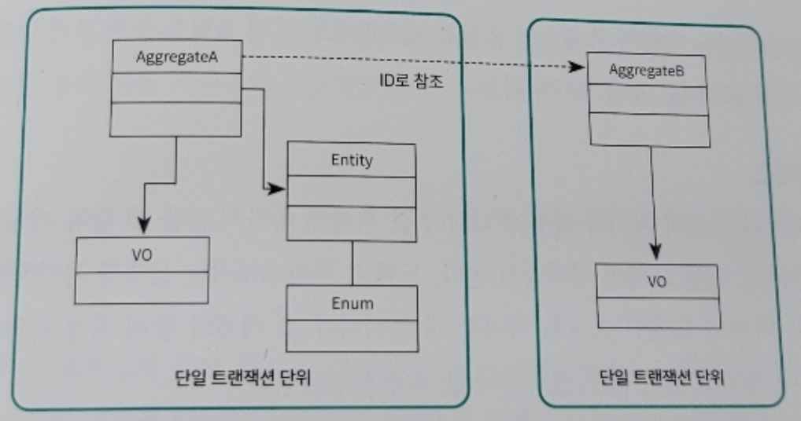

# 도메인 주도 설계와 마이크로서비스

- DDD(Domain Driven Development), 도메인 주도 설계는 마이크로서비스가 대중화되기 전에 이미 알려진 개발  
  방법론인데, 이후에 마이크로서비스의 개발이 활성화되는 과정에서 마이크로서비스의 설계와 개발을 위한 주요 가이드로  
  주목받게 되었다. 특히 마이크로서비스의 애플리케이션 개발 측면, 응집성이 있는 도메인 중심의 마이크로서비스를  
  도출하는 지침 및 마이크로서비스 내부의 비즈니스 로직 설계의 주요 가이드로 사용되고 있다.

- DDD에는 전략적 설계(Strategic Design)와 전술적 설계(Tactital Design)라는 설계 영역이 있다.  
 전략적 설계는 도메인 전문가 및 기술팀이 함께 모여 도메인 지식을 공유 및 이해하고, 이를 기준으로  
 개념과 경계를 식별해 Bounded Context로 정의하고 경계의 관계를 Context Map으로 정의하는 활동이다.  
 전술적 설계는 식별된 Bounded Context 내의 도메인 개념인 도메인 모델을 구성하는 유용한 모델링  
 구성요소들을 설명한다.

<h2>DDD의 전술적 설계</h2>

- DDD의 전술적 설계는 도메인 모델을 구성하기 위한 패턴들을 설명한다.  
  기존 객체 모델링 방식은 자유도가 높아 문제 영역을 파고들수록 여러 층의 복잡한 계층 구조를 만들게 될 가능성이  
  높다. 그래서 이를 정리하기 위해 객체들의 역할에 따른 유형을 정의하고, 이러한 규칙에 따라 모델링하면  
  단순하고 이해하기가 수월해지는데, 이러한 설계 기법을 DDD의 전술적 설계에서 제공한다.

<h3>Entity</h3>

- 엔티티는 **다른 엔티티와 구별할 수 있는 식별자를 가진 도메인의 실제 개념을 표현하는 객체**이다.  
  식별자는 고유하되, 엔티티의 속성 및 상태는 계속 변할 수 있다. 도메인에서 개별성(Individuality)이  
  있는 개념을 엔티티로 식별하며, 고유 식별자와 변화 가능성(Mutability)이 엔티티와 값 객체를 구분하는  
  차이점이다. 예를 들어, *구매*는 *구매 번호*라는 식별자로 구분 가능하며, 그 안에 있는 *구매품*이나 _수취자_  
  등이 개별적으로 변경될 수 있으므로 엔티티로 모델링할 수 있다.

<h3>VO(Value Object)</h3>

- 값 객체(VO)는 각 속성이 개별적으로 변화하지 않는 개념적 완전성을 모델링한다.  
  따라서 값 객체는 속성과 속성의 합에 의해 전체 개념이 부여되며, 개별 속성이 별개로 수정되지 않고 전체 객체가  
  한번에 생성되거나 삭제되는 객체이다. 엔티티와 같이 식별자의 차이에 따라 구별되지 않고 속성과 속성으로 이루어진  
  값의 비교에 의해 동일함이 결정된다. 값 객체의 특성은 아래와 같다.

  - 도메인 내의 어떤 대상을 측정하고, 수량화하고, 설명한다.
  - 관련 특징을 모은 필수 단위로 개념적 전체를 모델링한다.
  - 측정이나 설명이 변경될 땐 완벽히 대체 가능하다.
  - 다른 값과 등가성을 사용해 비교할 수 있다.
  - 값 객체는 일단 생성되면 변경될 수 없다.

- 예를 들어, *구매품*은 값 객체로 선택할 수 있다. *구매품*의 개별 속성들은 별도로 변경되지 않고 _구매품_  
  전체가 추가되거나 삭제되는 것만 가능하기 때문이다.

<h3>표준 타입</h3>

- 표준 타입은 대상의 타입을 나타내는 서술적 객체다. 엔티티나 값 객체의 속성을 구분하는 용도로 사용한다.  
  만약 전화번호를 값 객체로 모델링했다면, 이 전화번호가 집 전화번호인지 휴대전화번호인지 구분할 필요가 있다.

<h3>Aggregate</h3>

- 엔티티와 값 객체로 모델링하게 되면 자연스럽게 객체 간의 계층 구조가 만들어진다.  
  이처럼 연관된 엔티티와 값 객체의 묶음을 *Aggregate*라 한다.

- Aggregate는 1~2개의 엔티티, 값 객체, 표준 타입 등으로 구성되는데, 이들 간에는 비즈니스 의존 관계를  
  맺고 있으며, 비즈니스 정합성을 맞출 필요가 있다. 따라서 이 Aggregate 단위가 트랜잭션의 기본 단위가 된다.

- Aggregate내에 있는 엔티티 중 가장 상위의 엔티티를 *Aggregate Root*로 정하고, 이 *Aggregate Root*를  
  통해서만 Aggregate내의 엔티티나 값 객체를 변경할 수 있다.

- 보통 하나의 컨텍스트에 하나의 aggregate가 식별되나 하나의 컨텍스트 안에 여러 개의 aggregate가 존재할 수 있다.  
  이 경우 다른 aggregate를 참조해야할 필요가 있다면 직접 참조하지 않고, 참조할 aggregate root의 식별자를 통해  
  참조하게 한다. 직접 참조하는 경우, aggregate 단위의 트랜잭션 처리도 힘들고 의존관계가 점점 복잡해질 것이다.

- 또한 일반적으로 Bounded Context를 마이크로서비스로 식별하게 되는데, Aggregate 또한 별도의 마이크로서비스  
  후보가 될 수 있다. 그런데 같은 컨텍스트 내에 여러 개의 aggregate가 존재할 때, 다른 aggregate의  
  클래스를 직접 참조하면 별도로 마이크로서비스로 분리하기 힘들 것이다. 따라서 aggregate간의 참조는  
  aggregate root의 식별자를 활용해 간접 참조하는 것이 바람직하다.  
  아래는 식별자를 통한 aggregate간의 참조를 하는 간단한 예시이다.

- 각 aggregate는 각각의 단일 트랜잭션으로 일관성을 유지하지만, 다른 aggregate 사이의 일관성이 필요하다면  
  어떻게 일관성을 유지할까? 이때 아래의 예시와 같이 도메인 이벤트를 통한 결과적 일관성을 사용해 다른  
  aggregate를 갱신해서 일관성을 유지한다.

- 이처럼 DDD에서는 명확한 클래스의 유형과 aggregate 단위 식별을 통해 도메인 모델을 간결하고 단순하게  
  유지하는 것을 추구한다.
