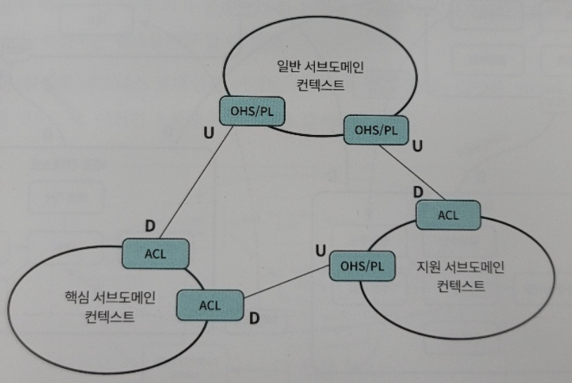

# DDD의 전략적 설계

<h2>도메인과 서브도메인</h2>

- DDD에서는 하나의 큰 도메인을 전략적으로 중요한 것들을 찾아 중요도에 따라 도메인을 나누고,  
  각 도메인을 각각 하나씩 해결하는 방법을 기본으로 삼는다. 이 방법을 사용하려면 알아야 하는  
  개념이 몇가지 있다. 우리가 시스템 개발을 통해 해결하고자 하는 비즈니스 도메인을 논리적으로  
  구분되는 개념으로 나누면, 문제가 되는 영역을 쉽게 이해할 수 있다. 즉 많은 개념들이 하나로  
  엮인 복잡한 비즈니스 도메인을 논리적으로 구분되는 여러 개의 하위 영억으로 분리해야 한다는  
  뜻으로, 이렇게 분리된 하위 도메인을 서브도메인이라고 한다.

- 서브도메인은 중요도에 따라 **핵심 서브도메인**, **지원 서브도메인**, **일반 서브도메인**의  
  총 3가지 유형으로 나뉜다.

- 먼저 핵심 서브도메인은 다른 경쟁자와 차별화를 만들 비즈니스 영역이기 때문에 기업의 프로젝트 목록에서  
  높은 우선순위를 갖는 영역이자 소프트웨어 개발에서 전략적으로 가장 큰 투자가 필요한 영역을 말한다.

- 지원 서브도메인은 비즈니스에 필수적이지만 핵심은 아닌 부분으로 볼 수 있다. 그러나 핵심 도메인을  
  성공시키기 위해서는 반드시 필요한 영역이므로, 핵심 서브도메인 다음으로 중요한 영역이다.

- 마지막으로 일반 서브도메인은 비즈니스적으로 특화된 부분은 아니지만, 전체 비즈니스 솔루션에는  
  필요한 부분으로 기존 제품을 구매해서 대체할 수 있다.

- 전략적 설계는 마이크로서비스를 도출하는 방법이자 비즈니스상 전략적으로 중요한 것을 찾아 중요도에 따라  
   일을 나누기 위해 사용할 수 있다. 이러한 전략적 설계를 수행하기 위해서는 반드시 아래의 2개 개념을 알아야 한다.

  - Bounded Context: 도메인의 주요 개념을 정의하고. 도메인 간의 관계를 식별
  - 유비쿼터스 언어(Ubiquitous Language): 도메인의 모든 구성원이 공통으로 사용하는 언어
  

<h2>유비쿼터스 언어와 도메인 모델, Bounded Context</h2>

- 일반적으로 프로젝트에는 고객이나 현업 담당자가 사용하는 언어와 설계자나 개발자가 사용하는 기술 언어가 서로 적정 수준의  
  이해를 바탕으로 혼용되는 경우가 많다. 같은 단어, 어구라도 특정한 상황에 따라 다르게 해석될 수도 있다. 이러한 혼란을 막기  
  위해 서로 다른 분야의 사람들이 원활하게 소통할 수 있는 단어, 용어 사전이 필요했는데 이것이 바로 유비쿼터스 언어이다.

- DDD에서는 이처럼 특정 도메인에서 해당 도메인에서의 의도를 명확히 반영하고 도메인의 핵심 개념을 잘 전달할 수 있는 언어를  
  유비쿼터스 언어라고 한다. 유비쿼터스 언어를 정의해서 이해관계자가 모두 공통의 언어를 사용하면 고객, 설계자, 개발자까지  
  용어에 따른 오해를 없앨 수 있게 된다.

- 유비쿼터스 언어는 예전에 데이터 모델링에서 사용했던 표준 단어/용어 사전과는 다른 개념이다. 표준 단어/용어는  
  특정 프로젝트나 전체 시스템에서 하향식으로 규정됐던 개념이라면 유비쿼터스 언어는 그보다 작은 단위의  
  세부 도메인에 특정 업무와 관련된 사람들 간에 자율적으로 정의되고 통용되는 개념을 나타낸다.

- 즉, 유비쿼터스 언어는 특정 도메인의 업무 개념을 표현하는 언어다. 예를 들면, 결제 도메인에서의 *고객*과  
  배송 도메인에서의 *고객*은 명확히 다르다. 결제 도메인에서의 고객은 결제자를 의미하며, 배송 도메인에서의  
  고객은 수취자를 의미한다. 이렇게 도메인 별로 명확히 다른 개념을 *고객*으로 포괄해서는 안된다.  
  결제 도메인에서는 결제자의 개념으로, 배송 도메인에서는 수취자의 개념으로 모델링해야 결제 서비스나 배송 서비스를  
  담당하는 팀의 의사소통이 명확해진다.

- 이렇게 도메인에 특화된 개념이 유비쿼터스 언어로 정의되고, 이 개념들은 서로 관계를 맺는다.  
  이 같은 관계를 표현한 모델을 도메인 모델이라 한다.

- 도메인 모델은 특정 비즈니스 맥락에서 통용되는 개념들의 관계를 잘 정의한 모형이다.  
  도메인 모델을 보면 해당 비즈니스를 이해할 수 있어야 한다.

- 이렇게 도메인 모델들을 구성하다 보면 당연히 각 도메인 모델과 다른 도메인 모델 간의 경계가 보인다.  
  이곳에서 사용하는 언어와 저곳에서 사용하는 언어와 개념이 상이한 이 경계가 바로 도메인의 겅계, 즉  
  Bounded Context이다. Bounded Context는 원으로 표현하고, 원 안에는 도메인 모델이 있다.

- 도메인 모델은 도메인과 관련된 업무를 수행하는 제품 책임자, 도메인 전문가, 개발자를 비롯한 모든 구성원들이  
  업무를 이해하는 기본 모형이 된다. 같은 컨텍스트를 다루는 이해관계자들은 도메인 모델에 정의된 언어로 업무  
  협의를 진행하고 개념을 발전시켜 나간다. 또한 이 모델의 언어를 그대로 사용해 설계 산출물을 표현하고 심지어  
  소스코드에도 사용한다. 따라서 예전처럼 설계 산출물에 사용했던 용어와 소스코드로 구현하면서 사용하는 용어가  
  다른 방식을 지양한다.

- 이렇게 유비쿼터스 언어는 팀의 의사소통 및 실제로 동작하는 코드에서도 살아 숨 쉬어야 한다.

<h2>컨텍스트 매핑</h2>

- Bounded Context를 식별할 때 각 컨텍스트는 내부적으로는 응집성이 높고, 외부적으로는 다른 컨텍스트와  
  의존관계가 낮아야 한다는 원칙하에 설계한다. 그렇다고 해서 컨텍스트간에 아무런 관계가 없다는 의미는 아니다.  
  하나의 큰 도메인을 여러 개의 Bounded 컨텍스트로 식별하면 비즈니스 수행을 위해 여러 개의 컨텍스트가  
  연계해야 하는 경우가 발생한다. 이러한 컨텍스트 간의 의존 관계를 DDD에서는 **컨텍스트 매핑**이라 하고,  
  연관관계에 있는 두 컨텍스트 사이에 선을 그려 표시한다.

- 시스템을 구성하는 컨텍스트 간의 매핑 관계를 표시한 다이어그램을 **컨텍스트 맵**이라 하며,  
  이 컨텍스트 맵을 그리려면 다양한 컨텍스트 매핑 패턴을 이해해야 한다.

<h3>주요 컨텍스트 매핑 관계</h3>

<h4>공유 커널(Shared Kernel)</h4>

- 공유 커널은 Bounded Context 사이에 공통적인 모델을 공유하는 관계다.  
  공유 커널은 두 개 이상의 팀에서 작지만 공통의 모델을 공유하는 관계를 나타낸다. 각 팀은 공유하는 모델에 서로  
  합의해야 한다. 보통 공통 라이브러리들이 여기에 해당하는데, 이 부분이 변경되면 여러 관련 컨텍스트에 영향을  
  미치므로 공유하는 모델의 빌드 코드를 관리하고 테스트하는 것은 한 팀이 맡아 수행해야 한다.

<h4>소비자와 공급자(Consumer-Supplier)</h4>

- 공급하는 컨텍스트는 상류(Upstream)로, 소비하는 컨텍스트는 하류(Downstream)로 표시한다.  
  데이터의 흐름은 **상류에서 하류로** 흐른다. 반대는 가능하지 않기에 상류에 변화가 있으면 하류에서는 그 변화를  
  따라야 한다. 즉, 공급자는 소비자가 원하는 기능을 제공해야 한다.

<h4>준수자(Confirmist)</h4>

- 준수자는 소비자와 공금자와 유사하지만 상류 팀이 하류 팀의 요구를 지원하지 않거나 못하는 경우 사용한다.  
  이런 상황에서는 하류팀은 상류팀에서 제공하는 모델을 그대로 사용한다.

<h4>충돌 방지 계층(ACL: Anti-Corruption Layer)</h4>

- 충돌 방지 계층은 하류 팀이 상류 팀의 모델에 영향을 받을 때, 하류 팀의 고유한 모델을 지키기 위한 번역 계층을  
  만드는 것이다. 이 계층은 둘 사이의 차이를 번역하며, 하류 모델의 독립성을 유지한다. 즉, 상류 모델의 변경 없이  
  하위 모델과 통합하기 위해 데이터를 변환하는 메커니즘을 구현한 것이라 볼 수 있다.

- 이 매핑 유형은 특히 클라우드 기반의 MSA를 적용하는 새로운 시스템을 레거시 시스템과 통합하기 위해 주로 사용한다.  
  새로운 시스템의 기능이 레거시 시스템의 기존 기능을 사용하거나, 새로운 기능을 필요로 할 때 레거시를 변경할 필요 없이  
  충돌 방지 계층을 구현해서 레거시 시스템과의 기존 연동 방식을 그대로 유지하면서 새로운 시스템과 통신하게 할 수 있다.  
  이러면 나중에 레거시 시스템이 클라우드 환경으로 이전되는 경우에도 이미 클라우드에 구축된 새로운 시스템을 변경할 필요  
  없이 충돌 방지 계층만 없애고 서로 직접 연동하도록 호출 주소만 변경하면 된다.

<h4>공개 호스트 서비스(OHS: Open Host Service)</h4>

- 공개 호스트 서비스는 Bounded Context에 대한 접근을 제공하는 프로토콜이나 인터페이스를 정의한다.  
  이 프로토콜은 하류의 컨텍스트가 상류의 컨텍스트에서 제공하는 기능을 용이하게 사용할 수 있도록 공개되어 있다.  
  보통 다른 컨텍스트에서 사용할 수 있는 공유된 API가 이에 해당한다.

<h4>발행된 언어(PL: Published Language)</h4>

- 발행된 언어는 하류의 컨텍스트가 상류의 컨텍스트가 제공하는 기능을 사용하게 하기 위한 간단한 사용법과 번역을  
  가능하게 하는 문서화된 정보 교환 언어이다. XML이나 JSON 스키마로 표현할 수 있으며, 주로 공개 호스트 서비스와  
  짝을 이뤄 사용한다.

<h3>컨텍스트 맵</h3>

- 하나의 큰 도메인을 여러 개의 Bounded Context로 식별하고 이들 간의 관계를 표현한 그림을 컨텍스트 맵이라 한다.  
  하나의 예시를 들어보자.

- 위 그림에서 핵심 서브도메인이 동작하기 위해 지원 서브도메인과 일반 서브도메인의 정보를 활용하고, 지원 서브도메인 역시  
  동작을 위해 일반 서브도메인을 활용한다는 것을 볼 수 있다. 각 서브도메인 간의 관계를 살펴보면, 일반 서브도메인이  
  핵심 서브도메인, 지원 서브도메인과 공급자/소비자 관계를 맺고 있으며, 일반 서브도메인이 공개 호스트 서비스로 일반  
  서브도메인을 사용할 수 있도록 프로토콜/인터페이스를 제공하면서 발행된 언어를 다른 컨텍스트에 제공한다. 또한 하류의  
  두 컨텍스트는 ACL을 통해 상류 모델을 번역해서 하류에서 사용할 수 있다. 즉, 핵심 서브도메인에 포함되는 컨텍스트는  
  일반 서브도메인과 지원 서브도메인에 속하는 컨텍스트를 사용하고. 지원 서브도메인에 포함된 컨텍스트는 일반 서브도메인의  
  컨텍스트를 사용한다.

