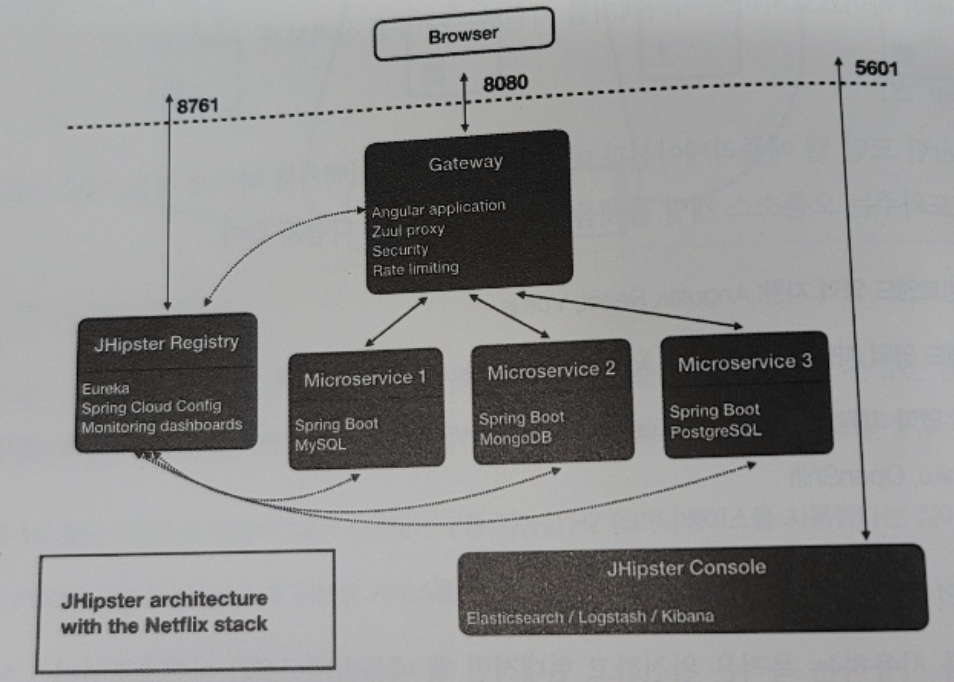

# 요구 사항 - 도서 대출 시스템

<h2>사용자 관리 및 로그인</h2>

- 사용자를 등록한다. 등록 시 사내 HR 시스템에 의해 검증된다.
- 특정 사용자는 사서의 역할을 부여받는다.
- 사용자는 시스템 사용을 위해 로그인하거나 로그아웃할 수 있다.

<h2>도서 관리</h2>

- 사서는 도서 분류 정보를 등록 / 수정 / 삭제 한다.
- 사서는 입고된 도서를 분류하고 등록 / 수정 / 삭제 한다.
- 일반적인 도서는 도서공급사에 의해 공급된다.
- 각 도서는 대출할 수 있는 수량(재고)이 있으며, 대출 / 반납에 의해 재고가 조정된다.

<h2>도서 대출 및 반납</h2>

- 사용자는 도서를 검색한다.
- 사용자는 베스트 대출 목록을 조회할 수 있다.
- 사용자는 재고가 있는 도서를 대출한다. (대출 조건: 2주, 1인 당 5권 이내)
- 반납되지 않고 대출 기간이 지난 도서는 연체된다.
- 1권이라도 연체되면 사용자는 대출 불가 상태가 된다.
- 사용자는 대출한 도서를 반납할 수 있다.
- 대출한 모든 도서 이력은 기록된다.
- 대출하거나 반납 시 사용자에게 10 포인트가 부여된다.
- 연체가 있는 이용자는 대출할 수 없다.(대출 불가 상태)
- 포인트는 연체 1일당 10포인트씩 연체일을 감면하는데에 사용된다.
- 연체일을 0으로 만듦으로써 대출 가능 상태가 된다.

<h2>배송</h2>

- 원격지의 사용자는 배송을 요청할 수 있다.
- 배송의 상태는 접수 / 준비 / 발송 / 배송완료 이다.
- 배송은 외부 배송업체를 이용한다.

<h2>이메일</h2>

- 주요 업무 변화 시 이메일로 사용자에게 통보한다.

<h2>외부 아키텍쳐 정의</h2>

- 백엔드 마이크로서비스: `사용자/로그인`, `배송`, `대출`, `도서`, `도서 카탈로그`, `게시판`, `이메일`로 구성한다.  
  사용자와 로그인은 별도의 Bounded Context로 식별했으나 구현의 편의성을 위해 하나의 서비스로 통합했다.

- 프론트엔드: Vue.js
- API Gateway: Load Balancing, Routing을 수행하며 Juul(Routing), Ribbon(Load Balancing)
- 프론트엔드 + 사용자/로그인 백엔드 서비스 + API Gateway: 하나의 서비스에 통합되어 구현하며,  
  API Gateway의 역할도 통합한다.
- 서비스 저장소: 서비스의 저장소에는 관계형 데이터베이스인 MariaDB를, 카탈로그 서비스에는 읽기에 최적화된  
  NoSQL 데이터베이스인 MongoDB를 사용한다.
- 서비스 간의 통신: 동기 통신에는 페인을 사용하고, 비동기 통신에는 메시지 큐를 사용한다.
- Message Queue: Kafka
- 배포: Docker Container + K8S
- 로그 중앙화: ELK Stack
- 모니터링: Kiali (Monitoring + Tracing)
- 형상 관리: Git
- 개발 환경 구축: JHipster

<h2>구현할 마이크로 서비스</h2>

- `대출(H2)`, `도서(H2)`, `도서 카탈로그(MongoDB)`, `게시판(H2)` 서비스
- 게시판, 배송, 이메일 서비스는 구현하지 않는다.
- 프론트엔드와 백엔드의 기본 통신 방법은 REST API이며, 서비스 간 통신에는 페인을 사용하며,  
  비동기 통신 메커니즘을 Kafka로 지원한다.
- 도서 검색과 최다대출도서집계 기능의 원활한 사용을 위해 도서 카탈로그 서비스와 도서 서비스를  
  분리하는 CQRS 패턴을 적용했으며, 도서 카탈로그 서비스에는 읽기에 최적화된 MongoDB를 사용한다.
- 초기 개발 환경 구축을 위해 JHipster를 사용한다.

<h2>JHipster</h2>

- JHipster는 현대 웹 애플리케이션과 마이크로서비스 아키텍쳐를 빠르게 적용, 개발, 배포할 수 있도록 도와주는  
  오픈 소스 개발 플랫폼이며, 지원 영역은 아래와 같다.
  - 프론트엔드: Angular, React, Vue
  - 백엔드: Spring Boot, Micronaut, Quarkus, Node.js, .NET
  - 배포 영역: Docker & K8S for AWS, Azure, Cloud Foundry, GCP, Heroku, OpenShift

<h3>JHipster의 목적</h3>

- JHipster를 사용하는 목적은 완전하고 현대적인 웹 애플리케이션과 마이크로서비스 아키텍쳐를  
  생성하는 데 있으며, 다음와 같은 항목들을 통합하는 것이 목표이다.
  - 광범위한 테스트를 커버할 수 있는 우수한 성능의 강력한 서버 스택
  - 세련되고 현대적인 모바일 친화적 UI를 위한 Angular, React, Vuew + Bootstrap을 갖춘 CSS
  - Webpack + Maven or Gradle을 사용해 애플리케이션을 빌드하는 강력한 workflow
  - 클라우드에 빠르게 배포할 수 있는 코드 기반의 인프라

<h3>JHipster 마이크로서비스 아키텍쳐</h3>

- 위 사진의 아키텍쳐에 대한 간단한 설명을 보자.

  - JHipster Registry: MSA 디스커버리 패턴을 구현한 것으로. 다른 모든 구성요소를 서로 연결하고  
    서로 통신할 수 있게 하는 역할을 한다. Eureka와 Spring Cloud Config를 기반으로 만들어진다.
  - 마이크로서비스: 백엔드 코드가 들어 있고, 실행 후 도메인에 대한 API를 노출한다.  
    여러 마이크로서비스로 구성될 수 있으며, 몇 개의 엔티티와 비즈니스 규칙이 포함된다.
  - Gateway: 모든 프론트엔드 코드를 가지고 있으며, 전체 마이크로서비스에서 생성한 API를 사용한다.  
    Zuul Proxy, Ribbon을 사용한다.
  - 백엔드 소스코드: `src/main/java` 폴더에 존재한다.
  - 프론트엔드 소스코드: `src/main/webapp` 폴더에 존재하고, 앞서 선택한 Angular로 만들어진다.
