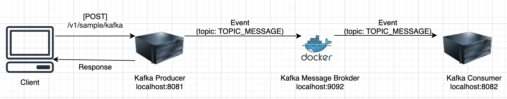

# Apache Kafka 사용하기

<h2>Apache Kafka</h2>

- Apache Kafka는 간단히 말해 이벤트 기반으로 비동기 작업을 처리할 수 있게 해주는 도구이다.  
  MSA 구조에서 각 마이크로서비스 끼리 소통할 때 자주 사용되며, 데이터의 결과적 일관성을 추구할 때에도  
  유용하게 사용된다.

- 이 글에서는 Apache Kafka를 Spring Boot와 함께 사용하여 간단한 프로젝트를 작성해 보도록 하겠다.  
  구현할 프로젝트의 아키텍쳐는 아래와 같다.

  

- 여기서 주의할 점은 Kafka Producer가 Client에 Response를 보낼 때, Kafka Consumer가 받은 이벤트에 대한 처리를  
  완료하는 것을 기다리지 않고 바로 Response를 보낸다는 점이다.

- 이러한 아키텍쳐는 MSA에서 하나의 서비스가 다른 서비스에 의존할 때, 다른 서비스에 오류가 발생해서 응답이 지연되는 등의 상황이  
  발생했을 때, 클라이언트는 서비스가 잘못된 것을 느끼지 못하게끔 할 때 유용하다.

<h3>기본 개념</h3>

- Kafka는 Producer, Broker, Consumer로 구성된다. 각각의 역할은 아래와 같다.

  - Producer: 이벤트 발행
  - Consumer: 이벤트 처리
  - Broker: Producer와 Consumer 사이에서 이 둘을 중개

- Kafka의 모든 메시지는 Key, Value의 형식으로 이루어지는데, 이 때 Key에는 **TOPIC** 이 들어간다.  
  TOPIC은 이벤트의 주제를 의미하며, 이벤트를 Consumer가 식별하여 적절하게 처리하기 위해 사용된다.  
  Value에는 Consumer가 해당 event를 처리하기 위해 필요한 적절한 정보들이 들어간다.

<h2>Spring Boot에서 사용하기</h2>

- Spring Boot에서 Kafka를 사용하기 위해 아래의 의존성 패키지를 추가해주자.

```gradle
implementation("org.apache.kafka:kafka-clients")
implementation("com.fasterxml.jackson.core:jackson-databind:2.11.4")
implementation("com.fasterxml.jackson.core:jackson-core:2.11.4")
```

- `org.apache.kafka:kafka-clients`는 Spring Boot에서 Kafka를 사용하기 위한 라이브러리이다.
- `com.fasterxml.jackson.core`는 파싱을 위한 라이브러리인데, 간혹 Kafka를 실행했을 때  
  Topic에 대한 에러 메시지가 출력되는 경우가 있다. 이를 해결하기 위해 추가해준 라이브러리이며,  
  버전은 Spring Boot가 가진 버전과 동일하게 설정해줘야 한다.  
  Spring Boot가 가진 jackson의 버전을 알기 위해서는 아래의 명령어를 수행하면 된다.

> ./gradlew dep | grep jackson

<h2>Producer</h2>

<h2>Consumer</h2>

<h2>실행 방법</h2>
