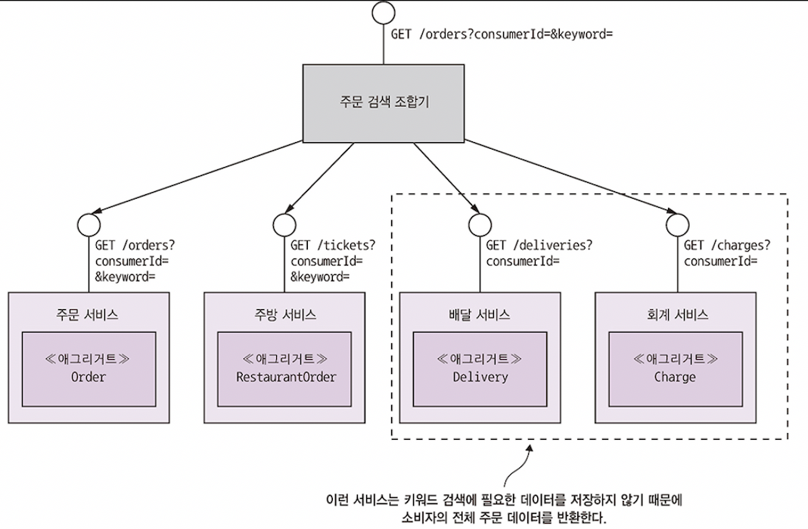
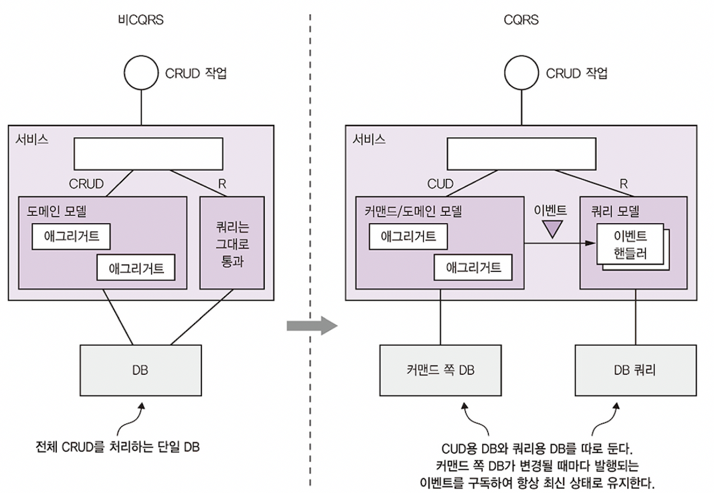

# CQRS 패턴

- 엔터프라이즈 애플리케이션은 대부분 RDBMS에 transatcion을 걸어 레코드를 관리하고, 텍스트 검색 query는 Elasticsearch나  
  Solr 등의 텍스트 검색 DB를 사용해 구현한다. 애플리케이션에 따라 RDBMS와 텍스트 검색 DB를 주기적으로 동기화하기도 하기도 한다.  
  이런 아키텍쳐로 구성하는 이유는 여러 DB를 사용하는 장점을 최대한 활용하기 위함이다. 즉 RDBMS만 지원하는 transaction 기능과  
  텍스트 검색 DB의 탁월한 query 능력을 융합해 활용하고자 하는 것이다.

> CQRS 패턴: 여러 서비스에 있는 데이터를 가져오는 query는 이벤트를 이용해 해당 서비스의 데이터를 복제한 read-only view를 유지한다.

- CQRS는 이런 종류의 아키텍쳐를 일반화한 것이다. 텍스트 검색 DB 뿐만 아니라 하나 이상의 query가 구현된 하나 이상의 view DB를  
  유지하는 기법이다. CQRS는 API composition 패턴으로는 효율적으로 구현하기 어려운 query 때문에 각광받기 시작했다.  
  CQRS의 작동 원리와 장단점, 그리고 언제 사용하는 것이 좋은지 알아보자.

## CQRS의 필요성

- API composition 패턴을 사용하면 여러 서비스에 있는 데이터를 조회하는 query를 쉽게 구현할 수 있다. 하지만 이 패턴은 MSA의  
  query 문제를 해결하는 반쪽짜리 해결책에 불과하다. 이 패턴만으로는 효율적으로 구현하기 어려운 다중 서비스 query가 많기 때문이다.

- 단일 서비스의 query 조차도 구현하기 어려운 경우도 있고, DB가 효율적인 query를 지원하지 않는 경우도 있다. 차라리 다른 서비스의  
  데이터를 조회하는 query를 서비스에 구현하는 것이 나을 때도 있다.  
  그렇다면 API composition 패턴으로 구현하기 어려운 다중 서비스 query란 무엇일까?

### `findOrderHistory()` query

- `findOrderHistory()`는 아래의 매개변수들을 받아 소비자의 주문 이력을 조회하는 query 작업이다.

  - consumerId: 소비자 식별자
  - orderHistoryFilter: 필터링 조건, 어느 시점 이후의 주문까지 반환할지(필수), 주문 상태(선택), 음식점명 및 메뉴 항목 등의 키워드(선택)

- 이 query는 주어진 조건에 부합하는 `OrderHistory` 객체들의 목록을 최근 순서로 반환하며 주문 이력의 view를 구현한 모듈에 의해 호출된다.

- 겉보기에 `findOrderHistory()`는 이전에 본 `findOrder()`와 비슷하지만, 한 건의 주문 정보가 아닌 여러 건의 주문 목록을 반환한다는  
  차이점이 있다. API 조합기로 각 프로바이더 서비스에 똑같은 query를 실행한 결과를 조합하면 간단히 구현할 수 있을 것 같지만, 아쉽게도 그렇지 않다.

- 이는 모든 서비스가 필터링, 정렬 용도의 속성을 보관하지 않기 때문이다. 예를 들어 `findOrderHistory()`의 `OrderHistoryFilter`에는  
  메뉴 항목과 매치할 keywords라는 속성이 있다. 하지만 메뉴 항목을 저장하는 서비스는 주문 서비스, 주방 서비스의 2개 뿐이며 나머지 배달 서비스,  
  회계 서비스는 메뉴 항목을 저장하지 않기 때문에 keywords로 데이터를 필터링할 수 없다. 마찬가지로 주방 서비스, 배달 서비스 둘 다 주문 생성  
  일자로 정렬하는 것은 불가능하다.

- API 조합기는 이 문제를 두 가지 방법으로 해결할 수 있다. 첫 번째로 API 조합기로 데이터를 in-memory join하는 방법이 있다.  
  어떤 소비자의 모든 주문 데이터를 배달 서비스, 회계 서비스에서 가져온 후 주방 서비스, 주문 서비스에서 가져온 데이터와 join하는 것이다.

  

- 그러나 거대한 데이터 뭉치를 이런 식으로 API 조합기에서 join하면 효율이 급격히 떨어질 수 있다.

- 두 번째 방법으로 API 조합기로 주문 서비스, 주방 서비스에서 데이터를 조회하고 주문 ID를 이용해 다른 서비스에 있는 데이터를 요청하는 것이다.  
  하지만 이는 해당 서비스가 대량의 조회 API를 제공하는 경우에만 현실성이 있는 방법이다. 그렇다고 주문 데이터를 하나하나 요청하는 것은 과도한  
  네트워크 트래픽이 유발되므로 비효율적이다.

- `findOrderHistory()`와 같은 query 작업은 API 조합기로 하여금 이미 RDBMS query engine에 탑재된 기능을 재탕하는 것밖에 안된다.  
  작업 자체를 확장성 낮은 DB에서 확장성 높은 애플리케이션으로 이동시킨다는 의미는 있겠지만, 비효율적이다.

- 그렇다면 단일 서비스에 국한되어 있지만 구현하기 어려운 query 작업은 어떤 것이 있을까?

### 어려운 단일 서비스 query: `findAvailableRestaurants()`

- 여러 서비스에서 데이터를 가져오는 query만 어려운 것이 아니라, 하나의 서비스에 국한된 query라도 구현하기 어려울 수 있다.  
  두 가지 이유가 있는데, 데이터를 가진 서비스에 query를 구현하는 것이 부적절한 경우일 수도 있고, 서비스 DB가 효율적인 query를  
  지원하지 않는 경우도 있다.

- 예를 들어 `findAvailableRestaurants()` query 작업을 생각해보자. 이 query는 주어진 시점에 주어진 위치로 배달 가능한 음식점을  
  검색한다. 이 query의 핵심은 배달 주소의 특정 거리 내에 있는 음식점을 지리 공간(geospatial), 즉 위치를 기준으로 찾는 기능이다.  
  이 기능은 가용 음식점을 표시하는 UI 모듈에 의해 호출되며 주문 프로세스 있어 매우 중요한 부분이다.

- 가령 MongoDB, PostgreSQL, MySQL의 geospatial extension을 사용하면 아주 쉽게 구현할 수 있다. 이렇게 이미 지리 공간 데이터형, index,  
  query 기능이 내장된 DB를 사용하는 경우 음식점 서비스는 `Restaurant`를 location 속성을 가지는 DB record로 저장한다. 그리고 이 속성의  
  지리 공간 index를 사용해 최적화된 지리 공간 query를 이용해 가용 음식점을 찾을 수 있다.

- 그러나 사용 중인 DB가 geospatial feature를 지원하지 않는다면 이 query는 구현하기 까다로워진다. 음식점 데이터의 replica를 지리 공간  
  query에 맞게 설계된 형태로 유지할 수 밖에 없기 때문이다. 애플리케이션에 따라 테이블을 일종의 geospatial index로 사용하는 DynamoDB의  
  지리 공간 indexing 라이브러리를 사용하거나, 음식점 데이터의 replica를 전혀 다른 종류의 DB에 저장하면 될 것이다.

- 하지만 이렇게 했을 때의 문제는 원본 데이터가 변경될 때마다 replica의 데이터를 항상 최신으로 유지하는 것이다. 다행이 replica의 동기화 문제는  
  잠시 후 볼 CQRS로 해결 가능하다.

### 관심사 분리의 필요성

- 단일 서비스 query가 구현하기 까다로운 또다른 이유로는 데이터를 가진 서비스에 query를 구현하면 안될 때가 있기 때문이다.  
  `findAvailableRestaurants()`는 음식점 서비스에 있는 데이터를 조회하는 query 작업이다. 음식점 서비스는 음식점 프로필, 메뉴 항목 등을  
  음식점에서 관리할 수 있게 해주는 서비스이다. 그리고 음식점명, 주소, 요리, 메뉴 등 다양한 속성들을 저장한다. 언뜻 보면 마땅히 음식점 데이터를  
  가진 음식점 서비스에 query를 구현해야 할 것처럼 느껴지지만, 이는 데이터의 소유권만 보고 판단할 문제는 아니다.

- 관심사를 어떻게 분리하면 좋을지, 어느 한 서비스에 너무 많은 책임을 부과하지 않으려면 어떻게 해야 할까 등의 문제도 함께 고민해야 한다.  
  가령 음식점 서비스 개발 팀의 주 임무는 음식점 주인이 자신이 운영하는 음식점을 잘 관리하도록 하는 서비스를 개발하는 일이지, 성능이 매우  
  중요한 대용량 데이터를 조회하는 query를 구현하는 일은 아닐 것이다.

- 그러므로 `findAvailableRestaurants()` query는 다른 서비스에서 구현하고, 음식점 서비스는 검색할 음식점 데이터만 제공하는 구조가 낫다.  
  그리고 geospatial index를 유지해야 하는 경우라면 query를 구현하기 위해 일부 데이터의 replica를 eventually consistent한  
  형태로 유지해야 한다. 이런 요건들을 CQRS로 어떻게 충족시킬 수 있을까?

---

## CQRS 개요

- 위에서 설명한 예시 상황을 정리하자면, MSA에서는 query를 구현할 때 흔히 아래의 3가지 난관에 봉착하게 된다.

  - API를 조합해 여러 서비스에 흩어진 데이터를 조회하려면 비싸고 비효율적인 in-memory join을 해야 한다.
  - 데이터를 가진 서비스는 필요한 query를 효율적으로 지원하지 못하는 DB에, 또는 그런 형태로 데이터를 저장한다.
  - 관심사를 분리할 필요가 있다는 것은 데이털를 가진 서비스가 query 작업을 구현할 장소로 적합하지 않다는 뜻이다.

- 위 3가지 문제를 모두 해결할 수 있는 묘안이 바로 CQRS 패턴이다.

### CQRS: Command, Query의 분리

- CQRS(Command Query Responsibility Separation)는 이름처럼 관심사의 분리, 구분에 대한 패턴이다.  
  이 패턴에 따르면 영속적 데이터 모델과 그것을 사용하는 모듈을 command, query로 가르게 된다.

- 조회 기능(ex. HTTP GET)은 query 쪽 모듈 및 데이터 모델에, CUD 기능은 command 쪽 모듈 및 데이터 모델에 구현하는 것이다.  
  양쪽 데이터 모델 사이의 동기화는 command 쪽에서 발행한 이벤트를 query 쪽에서 구독하는 식으로 이뤄진다.

- CQRS 패턴과 관계없이 거의 모든 서비스는 다양한 CRUD 작업이 구현된 API를 갖고 있다. 비CQRS 서비스에서는 이런 작업을 보통 DB에 mapping된  
  도메인 모델로 구현한다. 성능이 중요한 query는 도메인 모델을 건너뛰고 직접 DB에 접속하기도 한다. 하나의 영속적 데이터 모델은 command, query를  
  모두 지원한다.

- CQRS 서비스에서 command 쪽 도메인 모델은 CRUD 작업을 처리하고, 자체 DB에 mapping된다. 그리고 join이 없는 단순한 query와 PK 기반의  
  query도 처리할 수 있다. Command 쪽은 데이터가 바뀔 때마다 도메인 이벤트를 발행하게 된다.

- 별도로 나뉘어진 query 모델은 다소 복잡한 query를 처리한다. 비즈니스 규칙을 구현할 정도는 아니기 때문에 그래도 command 쪽보다는 훨씬  
  단순하다. Query 쪽은 반드시 지원해야 하는 query에 대해서는 모든 종류의 DB를 지원한다. 또 query 쪽에서는 도메인 이벤트를 구독하고, DB들을  
  갱신하는 이벤트 핸들러가 있다.

### CQRS와 query 전용 서비스

- CQRS는 서비스 내부에 적용할 수 있을 뿐만 아니라, 이 패턴을 이용해 query 전용 서비스를 따로 정의하는 것도 가능하다. Query 서비스에는  
  command 작업이 전혀 없는 오직 query 작업만으로 구성된 API가 있고, 하나 이상의 다른 서비스가 발행한 이벤트를 구독해 항상 최신 상태로  
  유지되는 DB를 query하는 로직이 구현되어 있다. Query 쪽 서비스는 여러 서비스가 발행한 이벤트를 구독해 구축된 view를 구현하기 좋은 방법이다.  
  이런 view는 특정 서비스에 종속되지 않기 때문에 standalone 서비스로 구현하는 것이 타당하다. 좋은 예시로 `findOrderHistory()`를 처리하는  
  주문 이력 서비스가 있다. 이 서비스는 주문, 배달 서비스 등 다른 여러 서비스가 발행한 이벤트를 구독한다.

  

- 주문 이력 서비스는 여러 서비스가 발행한 이벤트를 구독하고, 주문 이력 view DB를 업데이트하는 이벤트 핸들러를 가진다.

- Query 서비스는 한 서비스가 가진 데이터를 복제한 view를 구현하는 수단으로도 유용하다. 가령, 이전에 본 `findAvailableRestaurants()`  
  query 작업을 가용 음식점 서비스라는 별도의 query 서비스에 구현할 수 있다. 이 서비스는 음식점 서비스가 발생한 이벤트를 구독해  
  geospatial query을 효율적으로 처리할 수 있는 DB를 업데이트한다.

- 여러 면에서 CQRS는 RDBMS를 기록 시스템으로 활용하면서 텍스트 검색 엔진을 이용해 텍스트 검색 query를 처리하는 대중적인 접근 방식을  
  이벤트를 기반으로 일반화한 것이라 볼 수 있다. 다만 CQRS는 텍스트 검색 엔진 뿐만 아니라 훨씬 다양한 종류의 DB를 활용할 수 있다는 차이점이  
  있다. 또 CQRS query 쪽 view는 이벤트를 구독해 거의 실시간으로 업데이트된다.

---

## CQRS의 장점

- CQRS에도 일장일단이 있는데, 우선 장점은 아래와 같다.

  - MSA에서 query의 효율적인 구현이 가능하다.
  - 다양한 query들을 효율적으로 구현할 수 있다.
  - Event sourcing 애플리케이션에서 query가 가능하다.
  - 관심사가 더 잘 분리된다.

### MSA에서 query의 효율적인 구현이 가능하다.

- CQRS 패턴은 여러 서비스의 데이터를 조회하는 query를 효율적으로 구현할 수 있게 한다. API composition 패턴으로 query하면  
  거대한 데이터 뭉치를 in-memory join하는 비싸고 비효율적인 작업을 해야 하지만, CQRS는 여러 서비스에서 데이터를 미리 join해놓을 수  
  있기 때문에 더 간편하고 훨씬 효율적이다.

### 다양한 query들을 효율적으로 구현할 수 있다.

- 다양한 query를 애플리케이션, 서비스에 효율적으로 구현할 수 있다. 단일 영속화 데이터 모델 만으로는 다양한 종류의 query를 지원하기가 쉽지  
  않고 아예 불가능한 경우도 있다. 게다가 일부 NoSQL DB는 query 능력이 매우 제한적이다. 특정 유형의 query를 지원하는 확장팩이 DB에  
  설치되어 있더라도 특화된 DB를 사용하는 것이 더 효율적이다. CQRS 패턴을 이용하면 각 query가 효율적으로 구현된 하나 이상의 view를  
  정의해 단일 데이터 저장소의 한계를 극복할 수 있다.

### Event sourcing 애플리케이션에서 query가 가능하다.

- CQRS는 event sourcing의 중요한 한계(이벤트 저장소가 PK를 사용한 query만 지원하는 것)를 극복하게 한다. CQRS 패턴은 하나 이상의  
  aggregate view를 정의하고, event sourcing 기반의 aggregate가 발행한 event stream을 구독해 항상 최신 상태를 유지한다.  
  그래서 event sourcing 애플리케이션은 거의 예외 없이 CQRS 패턴을 사용한다.

> **Event Sourcing** : Aggregate를 일련의 이벤트 형태로 저장한다.  
> 이벤트는 각 Aggregate의 상태 변화를 나타낸다. 애플리케이션은 이벤트를 재연(replay)하여 Aggregate의 현재 상태를 재생성할 수 있다.

### 관심사가 더 잘 분리된다.

- CQRS 패턴에서 도메인 모델과 그에 대응되는 영속화 데이터 모델은 command, query를 모두 처리하지 않는다. Command 쪽, query 쪽에  
  각각 알맞은 모듈과 DB 스키마를 별도로 정의하기 때문이다. 이렇게 관심사를 분리하면 command, query 양쪽 모두 관리하기 간편해진다는  
  이점이 있다.

- 또한 CQRS를 이용하면 query를 구현한 서비스와 데이터를 소유한 서비스를 달리할 수 있다. 가령 `findAvailableRestaurants()` query로  
  조회한 데이터는 음식점 서비스에 있지만, 이렇게 대용량 query는 다른 서비스에 구현하는 것이 더 합당하다. CQRS query 서비스는 데이터를  
  소유한 서비스들이 발행한 이벤트를 구독하는 방식으로 view를 관리한다.

---

## CQRS의 단점

### 아키텍쳐가 복잡하다.

- CQRS를 사용하면 개발자는 view를 조회, 수정하는 query 서비스를 작성해야 하며, 별도의 데이터 저장소를 관리해야 하는 운영 복잡도 역시  
  증가한다. 종류가 다양한 DB를 사용하는 애플리케이션이라면 개발, 운영 복잡도가 더 가중된다.

### 복제 시차를 신경써야 한다.

- CQRS를 도입하면 command, query의 각 view 사이의 lag(시차)를 처리해야 한다. 당연히 command 쪽이 이벤트를 발행하는 시점과  
  query 쪽이 이벤트를 받아 view를 갱신하는 시점 사이에 지연이 발생하게 된다. 따라서 클라이언트 애플리케이션이 aggregate를  
  업데이트한 즉시 view를 query하면 이전 버전의 aggregate를 바라보게 될 수도 있다. 이렇게 일관되지 않은 데이터가 최대한 사용자에게  
  노출되지 않도록 애플리케이션을 개발해야 한다.

- 한 가지 방법으로 command, query 양쪽 API가 클라이언트에 버전 정보를 전달해 낡은 데이터인지를 판단할 수 있도록 할 수 있다.  
  클라이언트는 최신 데이터를 받을 때까지 query 쪽의 view를 계속 polling하게 될 것이다.

- 네이티브 모바일 앱이나 SPA 같은 UI 애플리케이션은 query를 하지 않고도 command가 성공하면 자신의 로컬 모델을 갱신하는 방법으로  
  복제 시차를 해소할 수 있다. 즉 command가 반환한 데이터로 자체 모델을 갱신시키는 것이다. 이렇게 한다면 별다른 문제가 없다면 사용자  
  액션으로 query가 trigger될 때 view는 항상 최신 상태가 될 것이다. 하지만 모델을 업데이트하려면 UI 코드가 서버 쪽의 코드를  
  복제해야 한다는 단점이 있다.

---
