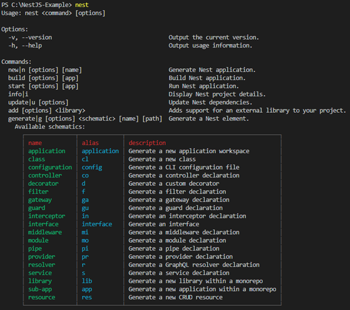

<h1>REST API 개발하기</h1>

* 프로젝트 생성시 NestJS의 CLI를 설치했기에 다양한 명령들을 사용할 수 있다.



* 예를 들어 새로운 `Controller`를 생성한다고 해보자.
```sh
# 단축어 없이
nest generate controller

# 단축어 사용
nest g co
```

* 위 명령어를 입력하면 컨트롤러의 이름을 물어보는데, movies라고 했다고 해보자.   
  그러면 `src/movies` 폴더가 생성되며. `app.module.ts`에는 자동으로 `@Module`   
  Decorator에 `MoviesController`가 import되어있는 것을 볼 수 있다.

```ts
// movies.controller.ts
import { Controller } from '@nestjs/common';

@Controller('movies')
export class MoviesController {}
```
<hr/>

<h2>Route 설정하기</h2>

* 아래와 같이 `/movies`를 위한 API Path를 하나 추가해보자.
```ts
import { Controller, Get } from '@nestjs/common';

@Controller('movies')
export class MoviesController {
    @Get('/movies'): string {
        return 'This will return all movies';
    }
}
```

* 이제 `/movies`로 요청을 보내면 우리가 예상한대로 응답이 오지 않고,   
  Path를 찾을 수 없다는 404 응답 코드가 온다.   
  이 이유는 `@Controller('값')`가 적용된 컨트롤러 안에 있는 `@Get`, `@Post` 등의   
  Route들은 `값`에 포함되기 때문이다.

* 즉, 위의 예시를 봤을 때에 `/movies/movies`로 요청을 보내야 우리가 원하는   
  응답을 얻을 수 있다.
<hr/>

<h2>Path Variable값 읽기</h2>

* 위위의 `MoviesController`에 아래와 같은 Route가 있다고 해보자.
```ts
import { Controller, Get } from '@nestjs/common';

@Controller('movies')
export class MoviesController {
    @Get('/:id')
    getMovieById(): string {
        // TODO : Return movie by id
    }
}
```

* 위의 `getMovieById`에서 URL Path로 들어온 `id` Path Variable값을   
  읽는 방법은 다음과 같다. 

```ts
import { Controller, Get } from '@nestjs/common';

@Controller('movies')
export class MoviesController {
    @Get('/:id')
    getMovieById(@Param('id') id: number ): string {
        return `This is info about a movie.(ID : ${id})`;
    }
}
```

* ~~Spring하고 너무너무너무 비슷하다...~~

* 위 코드는 문제점이 있는데, `@Param`으로 가져온 값은 기본적으로 string이 된다.   
  따라서 위와 같이 명시적으로 `id: number`를 지정해줘도, `typeof id`를 아래에서   
  살펴보면 string이 나오게 된다. 그렇다면 `/:id`의 id를 number로 string이 아닌   
  number로 가져오려면 어떻게 해야할까?

* 해답은 `ParseIntPipe`를 사용하는 것이다.
```ts
import { Controller, Get, Param, ParseIntPipe } from '@nestjs/common';

@Controller('movies')
export class MoviesController {

  @Get('/:id')
  getMovieById(@Param('id', ParseIntPipe) id: number): string {
    return `This is info about a movie. (ID : ${id}), ${typeof id}`;
  }
}
```

* 위와 같이 `@Param`의 두 번째 인자로 `ParseIntPipe`를 지정하면 id 파라미터를   
  number로 가져오며, `typeof id`도 number로 뜬다.   
  또한 `id: string`으로 가져와도 id는 number이 되며, id값에 숫자가 아닌   
  다른 값이 들어가면 `400(BAD_REQUEST)`가 반환된다.
