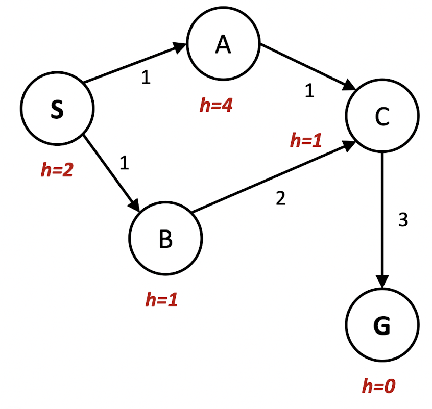

## 1 - Definition of AI

### Strong AI

- 사람과 같은 지능을 갖는다.
- 마음을 갖고 사람처럼 느끼면서 지능적으로 행동하는 기계이다.
- 추론, 문제 해결, 판단, 자아 의식 등을 갖고 할 수 있다.

- Strong AI matches or exceeds human intelligence.

### Weak AI

- 특정 문제를 해결하는 지능적 행동
- 사람의 지능적 행동을 흉내낼 수 있는 수준이다.
- **대부분의 인공지능 접근 방향이다.**

### Weak AI와 Strong AI의 차이점

- Weak AI's action, decision, and ideas are programmed into it.
- All current forms of AI are Weak AI.

### Symbolic AI

- Model the intelligence as knowledge and planning in data structures that make sense to programmers.
- Advantages of Symbolic AI

  - More useful for coding.
  - Easier to debug, explain, control
  - Not so big idea
  - More useful for explaining people's thoughts
  - Better for abstract problems.

### Subsymbolic AI

- Model intelligence at a level similar to neuron.
- Deep learning

- Advantages of Subsymbolic AI

  - More robust against noise.
  - Better performance.
  - Less prior knowledge.
  - Easier to scale up to big data.
  - More useful for connecting to neuroscience.
  - Better for perceptual problems.

---

## 2 - Informed and Uninformed Search Methods

### Properties

- State space: 상태 정보들을 모두 담아 놓은 공간
- Successor function(with actions, costs): 상태 정보를 수정할 수 있는 일련의 행동
- Start state: Initial State
- Goal test: Test if the result state is goal.

- Solution: A sequence of actions which transforms the start state to the goal state.

### Actual search and evaluation

- Real world is really complex, so it needs to be **abstracted**.

- A problem is formally defined by 4 components below.

  - Initial State: The state that the agent starts in.
  - Possible actions: Successor functions
  - Goal test: Determines whether a given state is a goal state.
  - Path cost: Assigns a numeric cost to each path
  - Solution: A sequence of actions leading from the initial state to the goal state.

#### State Space Graph

- A mathematical representation of a search problem.
- **In a State Space Graph, each state occurs only once!**

### Search Strategies

- Search strategy의 evaluation 방식

  - Completeness: _Does it always find a solution if one exists?_
  - Optimality: _Does it always find the least-cost solution?_
  - Time complexity
  - Space complexity

- Terms
  - _b_ : maximum branching factor of the search tree
  - _d_ : Depth of the least-cost function
  - _m_ : Maximum depth of the state space.(may be infinite)

### Uninformed Search

#### DFS(Depth-First Search)

- Strategy: Expand a deepest node first.
- Implementation: Fringe is a **LIFO Stack.**
- Evaluation
  - Completeness: No, it failes in infinite-depth spaces or spaces with loops.
  - Optimality: No, it may find a non-optimal goal first.
  - Time complexity: O(b^m) - Terrible if _m_ is much bigger than _d_
    - _m_ : Maximum depth of the state space, _d_ : depth of the least-cost function
  - Space complexity: O(bm) - Linear space

#### DLS(Depth-Limited Search)

- DFS with limit _l_
- Evaluation
  - Completeness: No, if _l_ < _d_
  - Optimality: No, even if _l_ > _d_
  - Time complexity: O(b^l)
  - Space complexity: O(bl)

#### IDS(Iterative-Deepening Depth-First Search)

- Gradually increases the limit _l_
- Evaluation
  - Completeness: Yes, if branching factor _b_ is finite.
  - Optimality: Yes, if the path cost is a non-decreasing function of _d_ (step cost >= epsilon)
  - Time complexity: O(b^d)
  - Space complexity: O(bd)

#### BFS(Breadth-First Search)

- Strategy: Expand a shallowest node first.
- Implementation: Fringe is a **FIFO Queue.**
- Evaluation
  - Completeness: Yes, it always reaches goal(if _b_ is finite).
  - Optimality: Yes, if the shallowest goal is optimal.
    - If path cost is a non-decreasing function of _d_, it is always optimal.
  - Time complexity: O(b^(d+1))
  - Space complexity: O(b^d)
    - Space is a bigger problem, since DFS's space complexity is O(bm)

#### UCS(Uniform-Cost Search)

- Strategy: Expand the cheapest node first.
- Implementation: Fringe is a **Priority Queue.**
  > Priority: 지금까지의 누적 cost + 현재 node의 cost
- It is equivalent to BFS is all step costs are same.
- Evaluation
  

- Issues
  - Strategy is to expand the cheapest node first. Good point is that UCS is optimal and complete.  
    But it explores options in _every direction_ , there are no information about goal location.

### Informed Search

#### Heuristics

- Heuristic

  - A function that _estimates_ how close a state is to the goal.
  - Designed for a particular search problem.

- Determining heuristic is a tradeoff between

  - The amount of work it takes to derive a heuristic value for a node.
  - How accurately the heuristic value of a node measures the actual path cost to the goal.

- Admissible heuristic

- Consistent heuristic

- 

- Ex

- Node `A`의 heuristic은 4
  - A -> G의 최소 path cost는 4이고, `0 <= h = 4 <= 4`이므로 admissible
  - `h(a) - h(c) = 4 - 1 = 3 <= cost from A to C` => `3 <= 1`이므로 not consistent

#### Greedy Search

- Strategy: Expand a node that you think is closest to the goal state.

  - Heuristic: Estimate of distance to nearest goal for each state.

- Common case: Greedy takes you to straight to the wrong goal.

#### A\* Search

- Strategy: Combine UCS with Greedy.

- 위 오른쪽 그림에서

  - Greedy: heuristic만 보니까 S -> a -> e -> d -> G
  - UCS: g만 보니까 S -> a -> b -> c
  - A\* : g + h를 보니까 s -> a -> d -> G

- Proof of optimality of A\* Search

- Evaluation
  - Completeness: Yes
  - Optimality: Yes if heuristic is admissible.
  - Time complexity: O(b^d)
  - Space: Keeps all generated nodes in memory, which is a main drawback of A\* Search.

### Optimality of A\* Search in Graph Search

- Tree Search
  - A\* is optimal **if heuristic is admissible**.
- Graph Search
  - A\* is optimal **if heuristic is consistent**.
- Consistency implies admissibility.

---

## 3 - Game Search

### Mini-Max Search

- MAX: You
- MIN: Your apponent
- Mini-Max search tree에서 상대방은 당연히 lowest value node를 갖는다.

### Alpha-Beta Pruning

- Visit nodes in Depth-First manner.

---

## 4 - Local Search Methods

- When to use Local Search Methods

  - When goal state itself is the solution(path to the goal state is irrelevant)

- Local search: Improve a **single option** until you can't make it better
  - Successor function: **local changes**
- Keep a single "current" state, trying to improve it by **only moving to neighbors**

### Optimization

### Gradient Descent Method

- 미분해서 순간의 벡터(방향)을 구한다.

### Genetic Algorithm

#### Selection - 선택 연산

- 교차에 쓰이는 두 개의 부모해를 고르기 위한 연산

  - 우수한 해가 선택될 확률이 높아야 한다.
  - 우수한 해들과 열등한 해들 사이의 적합도 차이를 조절함으로써 선택 확률을 조절할 수 있다.

- 일반적인 fitness function(적합도 함수)를 사용하면? -> 상위 멤버들(우수한 해)만 선택될 것이다.

- 품질 비례 룰렛휠 선택
  - 각 해의 품질을 평가한 다음 가장 좋은 해의 적합도가 가장 나쁜 해의 적합도의 k배가 되도록 조절
  - k가 높을수록 선택압(우수한 해가 선택될 확률과 열등한 해가 선택될 확률의 차이)이 높아진다.
  - 일반적으로 k는 3~4

#### Crossover - 교차 연산

##### Point crossover(일점 교차)

##### Uniform crossover(균등 교차)

##### Cycle crossover(사이클 교차)

##### Order crossover(순서 교차)

##### 간선 재조합

#### Mutation - 변이 연산

- 부모해에 없는 속성을 도입해 탐색 공간을 넓히려는 목적을 가진 연산

#### Replacement

#### GA가 유용한 경우

- 전통적 방법(결정론적인, deterministic 방법으로)으로 좋은 해를 잘 구하지 못하는 문제

#### GA가 소용 없는 문제들

- 결정적 알고리즘(Deterministic algorithm)으로 쉽게 풀리는 문제
- 결정적 알고리즘으로 쉽게 풀리지 않지만, 크기가 너무 작은 문제

#### GA Pros and Cons

##### Pros

- Faster(lower memory usage) than searching very large search space.
- Easy

##### Cons

- Randomized - Not optimal or even complete.
- Can get stuck on local maximum

---

## 5 - Basic ML Methods

### Concepts and Properties

#### ML의 궁극적인 목표

- 훈련 집합에 없는 새로운 sample에 대한 오류 최소화
- 테스트 집합에 대한 높은 성능을 generalization(일반화) 능력이라 부른다.

#### 지도 학습

- 특징 벡터 `X`와 목표값 `Y`(=label)가 모두 주어진 상황
- 회귀와 분류 문제로 구분

##### 분류(classification)

- 출력이 정해진 부류(class, category) 중의 하나로 결정

  
  
  

##### 회귀(regression)

- 출력이 연속인 영역(continuous domain)의 값 결정

#### 비지도 학습

- 특징 벡터 `X`는 주어지는데 `Y`가 주어지지 않은 상황

#### 강화 학습

- 목표값 `Y`가 주어지지만, 지도 학습과는 다른 형태이며 Penalty function이 존재한다.

#### 준지도 학습

- 일부는 `X`와 `Y`를 모두 가지지만, 나머지는 `X`만 가진 상황

### Linear Regression

  
  

---
