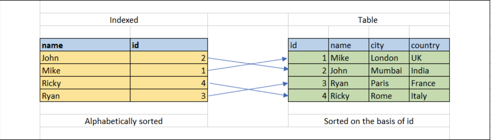
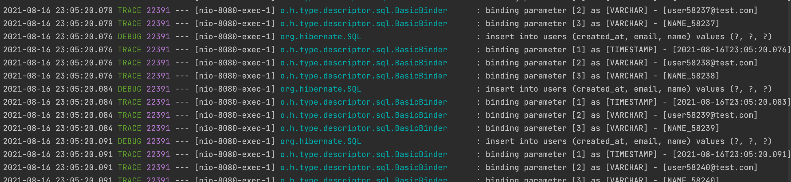

# About Database Indexing

<h2>Index란</h2>

- `Index`는 테이블의 데이터를 더 빠르게 가져오기(read) 위한 데이터베이스의 검색 엔진이 사용하는  
  특별한 lookup table이다. 기본적으로 index는 테이블 내의 특정 데이터(row)들을 가리키는  
  포인터이다.

- 데이터베이스에서의 index는 책의 가장 뒷 부분에 있는 index와 매우 유사하다.  
  책의 index를 보면 책의 특정 부분을 가리키고 있고, 독자는 원할 때 바로 그 부분을 찾을 수 있다.  
  또다른 예시로 데이터베이스 내의 매우 큰 테이블에서 특정 데이터를 찾는다고 생각해보자.  
  특정 데이터를 찾기 위해서 기본적으로 데이터베이스 엔진은 테이블 내의 레코드들이 정렬되지 않았다는 가정 하에서  
  원하는 데이터를 찾을 때 까지 그 전의 모든 레코드들을 하나씩 살펴볼 것이다.  
  만약 우리가 찾는 데이터가 가장 끝에 있다면, 그만큼 query의 수행 속도도 매우 느려질 것이다.

- 위와 같은 상황에서 index를 사용하면 매우 빠른 속도로 우리가 원하는 데이터를 찾아낼 수 있다.  
  만약 테이블 내의 레코드들이 특정 속성을 기준으로 정렬되어 있다면, 이또한 레코드를 빠르게 찾는 데에  
  큰 도움이 된다.



- 위 사진 처럼 테이블이 구성되어 있다고 하자. 오른쪽의 테이블 내의 레코드들은 id를 기준으로 정렬되어 있다.  
  이 테이블에서 특정 name을 가지는 레코드를 찾으려면 데이터베이스 엔진은 첫 번째 레코드부터 하나씩  
  찾아나가야 한다. 레코드 개수가 n개라 했을 때, 이 경우의 시간 복잡도는 `O(n)`이 된다.  
  이때, name을 기준으로 정렬된 lookup table이 있고, 각 레코드들이 실제 table의 레코드를 가리킨다고 해보자.  
  _name을 기준으로 정렬된 lookup table_ 이 index가 되는 것이다.  
  이 index를 사용하여 특정 name을 검색하면, 레코드들이 name을 기준으로 정렬되어 있기에 이진 검색이  
  가능해지므로 시간 복잡도는 `O(log n)`이 된다.

<hr/>

<h2>Index를 왜 사용할까?</h2>

- 위에서도 언급되어 있듯이, index를 적절하게 활용하면 데이터베이스에서 특정 데이터를 조회하는 시간을  
  효과적으로 감소시킬 수 있다. 기본적으로 index를 사용하면 `SELECT`절과 `WHERE`절이 있는 query들의  
  속도를 향상시켜준다. 하지만 이와 반대로 `INSERT`와 `UPDATE` query의 수행 속도는 느려진다.  
  따라서 index를 무조건 사용하지 말고, 적절하게 사용할 수 있어야 한다.

<hr/>

<h2>Index를 생성하는 방법</h2>

<h3>CREATE_INDEX</h3>

- `CREATE INDEX` 절은 this_is_index_name이라는 index를 this_is_table_name이라는 테이블에 생성한다.  
  하나의 index는 여러 개의 컬럼을 참조할 수 있다.

```sql
CREATE INDEX this_is_index_name
	ON this_is_table_name (this_is_column_name, this_is_column_name, ...);
```

<h3>CREATE UNIQUE INDEX</h3>

- `CREATE UNIQUE INDEX` 절은 unique한 index를 생성한다. Unique index는 중복 값을 가질 수 없다.  
  중복 값을 가질 수 없다는 것은 해당 column(들)이 각각 unique 제약을 가진다는 것을 의미한다.

```sql
CREATE UNIQUE INDEX this_is_index_name
	ON this_is_table_name (this_is_column_name, this_is_column_name, ...);
```

<h3>DROP INDEX</h3>

- `DROP INDEX`절은 테이블의 index를 제거할 때 사용한다.  
  아래 구문은 MySQL의 경우에 사용할 수 있는 구문이다.

```sql
ALTER TABLE this_is_table_name DROP INDEX this_is_index_name;
```

<hr/>

<h2>Index가 몇 개의 컬럼을 참조하도록 해야할까?</h2>

- 하나의 컬럼만을 참조하는 Single-Column Index를 생성할지, 아니면 여러 개의 컬럼을 참조하는  
  Multi-Column Index를 생성할지는 상황에 따라 결정해야 한다.  
  고려해야할 요소는 역시 `SELECT` 절의 사용이다.

- `SELECT`절을 사용할 때, 대부분의 경우에는 특정 *조건*에 맞는 데이터들만을 가져오기 위해  
  `WHERE`절을 사용한다. 이때, `WHERE`절에 자주 사용되는 컬럼이 기준이 된다.  
  만약 `WHERE`절에서 하나의 컬럼에 대한 조건만을 명시한다면 Single-Column Index를 사용하는 것이  
  좋으며, 여러 개의 컬럼에 대한 조건을 명시하는 경우가 많다면 Multi-Column Index를 사용하는 것이  
  가장 효과적이다.

<hr/>

<h2>Implicit Index</h2>

- 위에서 `CREATE INDEX` 또는 `CREATE UNIQUE INDEX`를 통해 만드는 index는  
  명시적(Explicit) index이다. 반면, 데이터베이스에 의해 테이블이 생성될 때 같이 생성되는 index도 있는데,  
  이들을 Implicit Index라 한다. 자동으로 생성되는 implicit index는 **primary key와 unique 제약이**  
  **있는 컬럼들** 에 대해 생성된다.

<hr/>

<h2>Index 사용을 피해야하는 경우</h2>

- Index를 사용하는 목적은 데이터베이스의 성능을 위함인데, 특정 경우에는 index를 사용하는 것을 지양해야 한다.

  - 레코드 개수가 적은 테이블
    - 레코드 개수가 적은 테이블은 간단한 테이블 스캔(일반적 SELECT)보다 오히려 index를 가지고 데이터를 순회하는게 더 오래 걸릴 수도 있다.
  - 큰 범위의 batch UPDATE, INSERT, DELETE 연산이 자주 수행되는 테이블
    - Index를 사용하면 UPDATE, INSERT, DELETE 연산이 단순히 값을 수정하는 데에 그치지 않고, index의 lookup table 또한 수정해야 하기에  
      큰 범위의 연산이 수행되는 테이블에는 적합하지 않다.
  - `NULL` 값이 많이 들어가는 컬럼
    - RDBMS에서는 NULL 값을 _값이 없다_ 고 판단하기에, NULL값은 indexing의 대상이아니다. 따라서 사실상 index를 만들어도 의미가 없다.
  - 자주 값 또는 속성 자체가 변경되는 컬럼

<hr/>

<h2>테스트 해보기</h2>

- 간단하게 Spring으로 데이터베이스에 50만개의 데이터를 넣는 코드를 작성하고, 실행해보았습니다.  
  ~~(10만개 넣어보고 유의미한 차이를 못 느껴서 100만개로 한건 비밀..)~~



> 열심히 쿼리를 수행하는 중..

- API 호출 후 응답 올 때까지 총 1시간 이상이 걸렸네요..

- 참고로 테스트용 테이블 생성 구문은 아래와 같습니다.

```sql
CREATE TABLE users(
    user_id integer auto_increment primary key,
    email varchar(45) not null unique,
    name varchar(45) not null,
    created_at datetime not null default now(),
    deleted_at datetime null
);
```

- 이제 Implicit index가 없는 데이터를 하나 찾아보겠습니다.  
  마지막으로 저장된 user의 name이 "NAME_1000000"이기에 이로 검색했습니다.

```sql
SELECT * FROM users WHERE name = "NAME_1000000";
```

- 10번 쿼리를 각각 수행한 후 평균치는 616ms 였습니다.

```sql
INSERT INTO users VALUES(DEFAULT, 'user100001@test.com', 'NAME_100001', DEFAULT, NULL);
```

- 10번 쿼리를 각각 수행한 후 평균치는 107ms 였습니다.

- 이제 아무런 Index가 적용되어 있지 않는 name 컬럼에 index를 만들어보겠습니다.

```sql
CREATE INDEX idx_user_name
	ON users (name);
```

- index 생성 후 name을 WHERE절에 넣은 쿼리의 10회 평균 소요 시간은 225.8ms이었습니다.
  데이터 크기가 막 크지는 않은지 INSERT 쿼리는 수행 시간이 index가 없을 때와 유사했습니다.(10회 기준 평균 105.6ms)

- 아직 name 컬럼에 대해서만 indexing이 되어있어서 INSERT의 시간은 동일한 수준이지만, 확실히 WHERE 조건에  
  name이 들어갔을 때의 검색 속도는 약 3배 빨라진 것을 확인할 수 있었습니다.

- 이제 indexing이 된 부분은 name, email(UNIQUE), user_id(PK)로 총 3개의 컬럼입니다.  
  다음으로는 Mutli-Column index를 name, email에 대하여 적용하기 전과 후를 비교해보겠습니다.

- 우선 아래 쿼리를 indexing 전과 후 각 10번씩 수행해 보겠습니다.

```sql
SELECT * FROM users WHERE name = 'NAME_1000018' AND created_at = '2021-08-17 14:23:12';
```

- Indexing 전: 평균 447.5ms
- Indexing 후: 평균 157.8ms

- 확실히 SELECT 쿼리의 성능이 눈에 띄게 좋아진 것을 볼 수 있습니다.

<hr/>

- 참고 링크: <a href="https://medium.com/javarevisited/indexes-when-to-use-and-when-to-avoid-them-39c56e5a7329">Medium</a>
