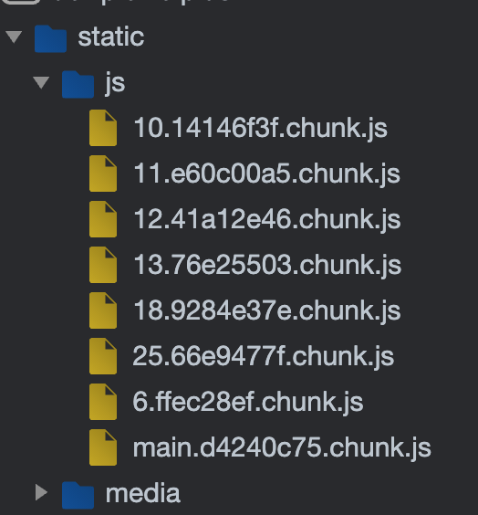

# ChunkLoadError 해결하기(Webpack 설정 X)

- CRA를 사용하여 React Project를 생성하면, Webpack 설정이 기본적으로  
  제공된다. 이 설정을 굳이 건들지 않고 ChunkLoadError를 해결해보자.

<h2>ChunkLoadError가 발생하는 이유</h2>

- 별도 설정 없이 React Project를 build하면 `build/static/js`의 하위에  
  아래와 같은 파일들이 생겨난다.



- 이렇게 빌드하게 되면 `[number].[hash].chunk.js` 형식의 파일이 나오게 된다.

- 우리가 `a.com`을 만든다고 해보자. 사용자는 `a.com`에 들어오는 순간 위의 chunk 파일들을 받아온다.  
  이때, 사용자가 페이지를 새로고침하는 등의 행동을 취하지 않으면 chunk파일은 브라우저에 남아있게 된다.

- 사용자가 `a.com`에 있는 동안에 새로운 배포가 이루어졌다고 해보자. 그러면 새로운 배포에 당연히 빌드도 다시 하기에  
  chunk 파일들도 새롭게 생겨날 것이다. 이때, 기본적으로 새로운 chunk 파일을 자동으로 불러오지 않기에  
  `ChunkLoadError`가 발생한다. 내용은 아래와 같다.

```
ChunkLoadError: Loading chunk [number] failed.
(missing: https://a.com/static/js/[number].[hash].chunk.js)
```

- 에러 내용을 봐도 chunk 파일을 찾지 못한다는 것을 알 수 있다.  
  Chunk파일을 찾지 못하면 당연히 JavaScript가 동작하지 않기에 심할 경우에는  
  웹 페이지가 Blank가 되는 경우도 발생한다. 이는 사용자 경혐에 매우 큰 악영향을 미칠 수 있으므로  
  꼭 해결해주어야 한다.

<hr/>
