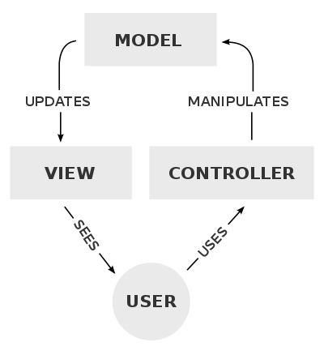

# MVC Pattern

## 정의

- MVC(Model-View-Controller)는 사용자 인터페이스를 만들어내는 프로그램에서 자주 사용되는 소프트웨어 디자인 패턴이다.  
  이 패턴은 전통적으로 Desktop GUI를 만들 때 사용되어 왔으며, Web Application을 만드는 데에도 많이 사용되었다.

## MVC Pattern의 구성 요소

- MVC 패턴의 각 구성 요소는 아래와 같다.

  - Model: MVC 패턴의 중추적인 역할을 하는 요소로, 사용자 인터페이스와 무관한 애플리케이션의 데이터를 저장하고 처리하는 컴포넌트이다.  
    애플리케이션의 데이터, 로직이 모두 이 Model에 해당한다.

  - View: 사용자 인터페이스를 나타내는 요소로, chart, diagram, table 등을 나타낼 수 있다.

  - Controller: 입력값을 받아 Model, View 등을 가져오는 명령으로 바꾼다.

## Spring MVC

- 그럼 Web Application을 만들기 위한 Spring MVC에서 MVC는 각각 어떤 역할을 하는지 알아보자.

  - Model: 애플리케이션 내부에서 필요한 데이터들을 담는 컴포넌트로, 일반적으로 POJO로 만들어진다.
  - View: Model을 적절한 HTML로 렌더링한다.
  - Controller: 사용자의 request(요청)를 받아 적절한 Model을 만들고, 렌더링을 위해 View에게 전달한다.

> REST API를 제공하는 Spring Application에서는 이 구조가 어떻게 될까?  
> 개인적으로 View가 HTML이 아닌 JSON 형식으로 반환되기에 DTO가 View에 해당하지 않을까 싶다.

## 3 Tier Architecture vs MVC

- 3 tier architecture(Controller, Service, Repository)와 MVC의 차이점은 뭘까?  
  이 두 아키텍쳐(패턴)는 모두 3개의 구성요소로 분리된다는 공통점이 있다.

### 호출 관계

- 3 tier architecture에서는 원칙적으로 각 layer는 인접한 하위 Layer에만 접근할 수 있다.  
  (Controller Layer가 Service Layer에 접근, Service Layer가 Repository Layer에 접근)  
  즉, Controller Layer에서 직접적으로 Repository Layer에 접근, 의존하는 것을 허용하지 않는다.

- 반면, MVC 패턴에서는 3개 구성 요소의 관계가 아래 그림처럼 삼각 관계이다.(꼭 삼각 관계일 필요는 없다.)  
  이러한 구조를 갖고 있기에 View가 Controller에게 특정 정보의 갱신을 알릴 수도 있고,  
  Controller가 Model을 바로 사용할 수도 있다.

### Reference

- <a href="https://en.wikipedia.org/wiki/Model%E2%80%93view%E2%80%93controller">Model-view-controller</a>
- <a href="https://softwareengineering.stackexchange.com/questions/324730/mvc-and-restful-api-service">MVC and RESTful API Service</a>
