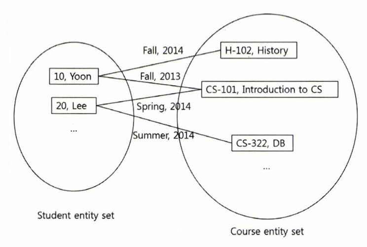
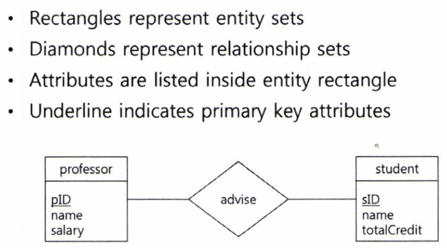
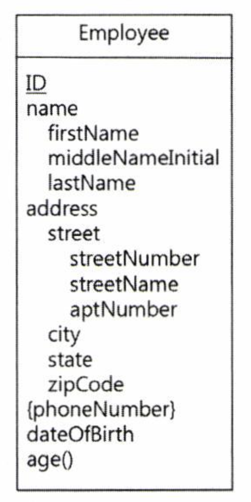
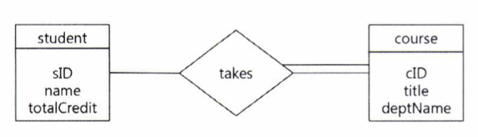
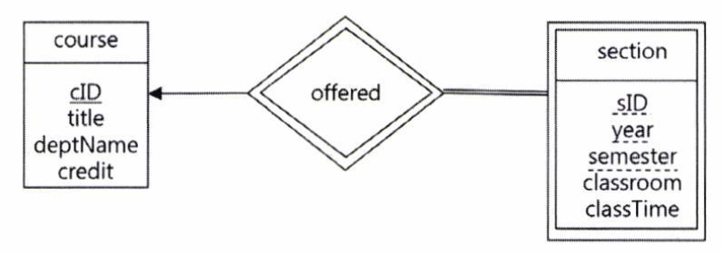

# 개체-관계성 데이터 모델

## 개체 및 관계성

- ER 데이터 모델은 데이터베이스를 개체와 관계로 모델링한다.

### Entity, Entity Set

- Entity: 하나의 객체로, 다른 객체들로부터 구분할 수 있는 객체이다.

  - Entity는 속성(attribute)들을 갖는다.

- Entity Set(entity type): 동일한 속성을 갖는 entity들의 집합

### Relationship, Relationship Set

- Relationship: 하나의 entity가 다른 entity와 연관된 관계를 나타낸다.
- Relationship Set: 동일한 속성을 갖는 relationship들의 집합
- Relationship도 속성을 가질 수 있다.

- Degree: Relationship에서 관련되어 있는 entity의 개수
  - 보통은 binary relationship으로, 2개의 entity가 연관되어 있다.

### Attributes

- 하나의 entity는 여러 개의 속성들로 나타내어 진다.
- Types
  - Simple vs Composite attributes
    - Composite ex) name은 first name, middle name, last name으로 구성된다.
  - Single-valued vs Multi-valued attributes
  - Derived attributes
    - ex) date of birth가 주어졌을 때 age를 구하는 것

### Cardinality Constraints

- Cardinality는 relationship set으로 연관될 수 있는 entity의 개수를 나타낸다.
- Binary relationship set의 경우, 아래와 같은 cardinality constraint를 갖는다.
  - One to one
  - One to many
  - Many to one
  - Many to many

### Keys

- Super key: Entity마다의 유일한 값을 가져 entity를 구분지을 수 있는 속성
- Candidate key: Super key 중 minimal key이다.
  - Candidate key 들 중 하나가 primamry key로 선정되어 사용된다.

### Keys for Relationship Sets

- 기본적으로 relationship에 관련된 entity들의 primary key들의 조합을 primary key로 갖는다.

---

## ER Diagram

- ID: PK
- name: composite attribute(firstName + middleNameInitial + lastName)
- phoneNumber: multi-valued attribute
- age(): derived attribute

### Participation Constraints

- Total participation

  - 두 개의 선(double line)으로 표시
  - Entity set 내의 모든 entity가 relationship set 내의 최소 1개 이상의 relationship에 참여한다.

- Partial participation

  - 하나의 선으로 표시
  - 일부 entity는 relationship set의 어떠한 relationship에도 참여하지 않을 수 있다.

- 위처럼 되어있으면 모든 course는 takes에 참여해야 한다.

### Ternary Relationship

- Relationship에 연관된 entity가 3개인 경우.

- Cardinality constraint: 1에 대응하는 entity set은 최대 1개만 허용한다.

### Roles

- Entity set이 하나의 relationship에 2번 이상 참여하면, 역할(role)을 지정해줘야 한다.

- 아래 다이어그램에서 course, prerequisite는 role이 되며 prerequisiteOf는 recursive relationship이다.

### Weak Entity Set

- Weak entity set is an entity set which does not have a primary key.

- Weak entity set의 존재 유무는 identifying entity set의 존재 유무에 따라 결정된다.

- 다이어그램에서

  - Weak entity set: Double rectangle
  - Identifying entity set: Double diamond

- PK of weak entity set = PK of strong entity set + partial key of weak entity set

- section의 PK: cID + sID + year + semester

- Strong entity set의 PK는 직접 weak entity set에 저장되지 않는다.  
  만약 그렇다면 section 자체가 strong entity set이 되므로 relationship이 무의미해질 것이다.

---

## Reduction to Relational Schema

- A database which conforms to an ER diagram can be represented by a collection of schemas.

### Strong / Weak Entity Sets

- Strong entity set becomes to a relation with the same attributes.
- Weak entity set becomes a relation that includes the PK of the identifying strong entity set.

### Composite attributes

- Composite attributes are flattend out by creating a seperate attribute for each component.

### Multi-valued attributes

- A multi-valued attribute of an entyt E is represented by a seperate schema that includes the primary key of E.

---
