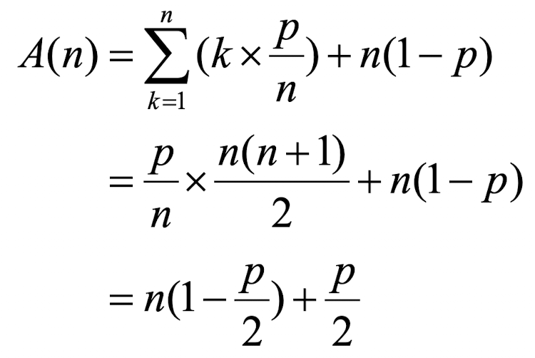
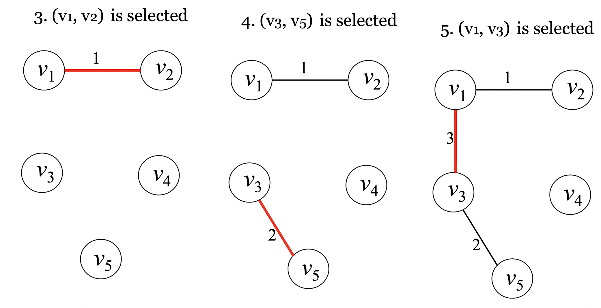
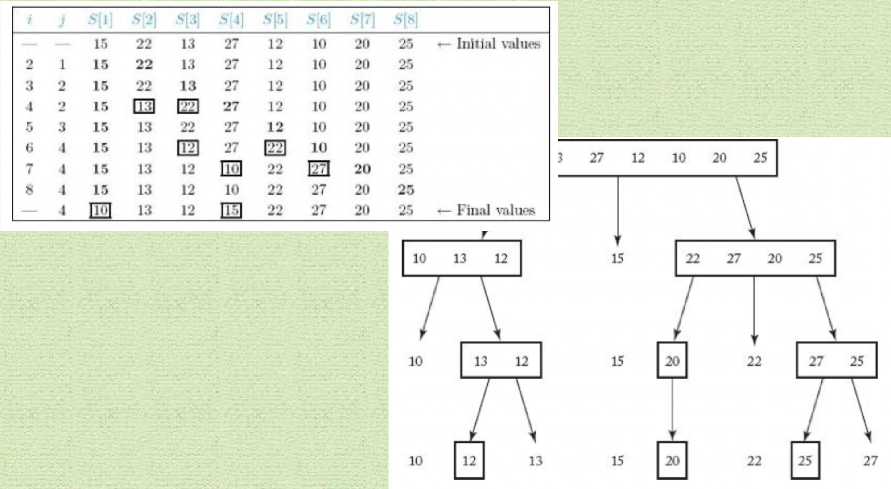

# Algorithm

## 22-1a

- 의사코드(pseudo-code): 실제 프로그램에 가깝게 계산 과정을 표현할 수 있는 언어.

  - 알고리즘은 주로 의사 코드로 표현한다.
  - 프로그래밍 언어와의 차이점
    - 파라미터 크기의 가변성을 허용한다.(`void pname(A[][])`)
    - 지역 배열에 변수 index를 허용한다.(`keytype S[low..high]`)
    - 수학적 표현식을 허용한다.($low \ge x \ge high$, `exchange x and y`)
    - `index`: 첨자로 사용되는 정수 변수
    - `number`: 정수, 실수 모두 표현
    - `bool`: true, false 값을 가지는 변수
    - `key`: record를 식별할 수 있는 각 item
    - `keytype`: key의 data type
    - 제어구조: `repeat(n time) { ... }`
    - 참조 파라미터(reference parameter)를 사용해 프로시저의 결과값 전달
      - 배열: 참조 파라미터로 전달
      - 기타: 데이터타입 이름 뒤에 `&`를 붙힌다.
      - const 배열: 전달되는 배열의 값 불변

- 순차검색 알고리즘

  - 문제: 크기가 n인 배열 S에 x가 있는가?
  - 입력: (1) 양수 n, (2) 배열 S[], (3) 키 x
  - 출력: x가 S에 어디있는지의 위치. 만약 없으면 0

  ```c
  void seqsearch(	int n,			// 입력 (1)
  		const keytype S[],		// 입력 (2)
  		keytype x,			// 입력 (3)
  		index& location) {		// 출력
  	location = 1;
  	while(location <= n && S[location] != x)
  		location++;
  	if(location > n)
  		location = 0;
  }
  ```

- 최악의 경우 S에 있는 항목을 n번 검색해야 한다.

- 이분검색 알고리즘

  - 문제: 크기가 n인 **정렬된** 배열 S에 x가 있는가?
  - 입력: (1) 양수 n, (2) 배열 S[1..n], (3) 키 x
  - 출력: x가 S에 어디있는지의 위치. 만약 없으면 0

  ```c
  void binsearch(	int n,			// 입력 (1)
  		const keytype S[],		// 입력 (2)
  		keytype x,			// 입력 (3)
  		index& location) {		// 출력
  	index low, high, mid;
  	low = 1; high = n;
  	location = 0;
  	while(low <= high && location == 0) {
  		mid = (low + high) / 2;
  		if(x == S[mid]) location = mid;
  		else if(x < S[mid]) high = mid - 1;
  		else low = mid + 1;
  	}
  }
  ```

  - S에 있는 항목은 while문 수행 시마다 검색 대상의 크기가 절반이 되므로 최악의 경우에도 $lg(n) + 1$ 개만 검사하면 된다.

- n-th Fibonacci 알고리즘

  - 문제: n번째 fibonacci 수를 구해라.
  - 입력: 양수 n
  - 출력: n번째 fibonacci 수

  ```c
  int fib(int n) {
  if(n <= 1)
  	return n;
  else
  	return fib(n-1) + fib(n-2);
  }
  ```

  - 재귀 알고리즘은 수행 속도가 매우 느리다. (같은 fibonacci 수를 중복 계산하기 때문)

  ```
                fib(5)
  	      /       \
  	    fib(3)    fib(4)
  	    /   \     /    \
  	fib(1) fib(2) fib(2) fib(3)
  	       /   \   /  \   /   \
  	     fib(0) fib(1) fib(1) fib(2)
  	                           /  \
  			      fib(0) fib(1)
  ```

- 계산한 호출 횟수의 검증

  - 재귀적 알고리즘으로 구성한 재귀 tree의 마디 개수를 $T(n)$이라 하면 $n \ge 2$ 인 모든 n에 대해 $T(n) \gt 2^{(n/2)}$ 이다.
  - 조건: $T(0) = 1, T(1) = 1, T(n) = T(n-1) + T(n-2) + 1$
  - 증명(n에 대한 수학적 귀납법)
    - 시작 단계(1): $T(2) = T(1) + T(0) + 1 = 3 \gt 2^{(2/2)} = 2$
    - 시작 단계(2): $T(3) = T(2) + T(1) + 1 = 5 \gt 2^{(3/2)} = 2.8$
    - 귀납가정: $2 \le m \lt n$인 모든 m에 대해 $T(m) \gt 2^{(m/2)}$ 이라 가정.
    - 귀납 절차: $T(n) = T(n-1) + T(n-2) + 1 \gt 2^{(n-1)/2} + 2^{(n-2)/2} + 1$
      $\gt 2^{(n-2)/2} + 2^{(n-2)/2} = 2 \times 2^{(n/2)-1} = 2^{(n/2)}$

- fibonacci를 반복적 방법으로 구하기

  ```c
  int fib2(int n) {
  	index i;
  	int f[0..n];
  	f[0] = 0;
  	if (n > 0) {
  		f[1] = 1;
  		for(i = 2; i <= n; i++)
  			f[i] = f[i-1] + f[i-2];
  	}
  	return f[n];
  }
  ```

  - 반복 알고리즘은 중복 계산이 없기에 재귀보다 훨씬 수행 속도가 빠르다.
  - 계산하는 항의 총 개수: $T(n) = n + 1$

- 알고리즘의 분석(analysis)

  - **입력 크기**에 따라서 **단위 연산**이 몇 번 수행되는지 결정하는 절차
  - 표현 척도
    - 입력 크기(input size): 배열의 크기, 리스트의 길이 등
    - 단위 연산(basic operation): 비교, 지정 등
  - 분석 방법의 종류

    - 모든 경우 분석: 입력 크기에만 종속. 결과값은 항상 일정
    - 최악의 경우 분석: 입력 크기, 입력 값 모두에 종속. 단위 연산이 수행되는 횟수가 최대인 경우
    - 평균의 경우 분석: 입력 크기, 입력 값 모두에 종속. 단위연산이 수행되는 기대치.
    - 최선의 경우 분석: 입력 크기, 입력 값 모두에 종속. 단위 연산이 수행되는 횟수가 최소인 경우

  - ex) 교환 정렬
    - 문제: 오름차순으로 n개의 키 정렬하기
    - 입력: 양수 n, 배열 S[1..n]
    - 출력: 오름차순으로 정렬된 배열
      ```c
      void exchangesort(int n, keytype S[]) {
      	index i, j;
      	for(i = 1; i <= n - 1; i++)
      		for(j = i + 1; j <= n; j++)
      			if(S[i] > S[j])
      				exchange S[i] and S[j];
      }
      ```
    - 단위 연산: 조건문(S[i]와 S[j]의 비교)
    - 입력 크기: 정렬할 항목의 개수 n
    - 모든 경우 분석: $T(n) = (n-1) + (n-2) + \cdots + 1 = \frac{n(n-1)}{2}$
    - 단위 연산이 `exchange S[i] and S[j]`라면?
      - 최악의 경우는 조건문이 항상 true가 되는, 즉 입력 배열이 내림차순으로 정렬되어 있는 경우 = $T(n) = \frac{n(n-1)}{2}$
  - ex) 순차검색
    - 평균: $1 \le k \le n$ 에 대해 x가 배열의 k 번째 있을 확률: $\frac{1}{n}$
      - 경우 1: x가 배열 S에 있는 경우: $A(n) = 1 \times \frac{1}{n} + 2 \times \frac{1}{n} \cdots = \frac{1}{n} \times \frac{n(n+1)}{2} = \frac{n+1}{2}$
      - 경우 2: x가 배열 S에 없는 경우
        - x가 배열 S안에 있을 확률을 p라 하면 x가 배열의 k번째 있을 확률은 $p/n$, x가 배열에 없을 확률은 $1-p$
  - 따라서 아래와 같다.
    

- 정확도 분석: 알고리즘이 의도된 대로 수행되는지를 검증하는 절차

---

## 22-1b

- 복잡도의 표기법

  - $O$ : Big O, asymptotic upper bound
    - 분석된 결과 $g(n)$에 대해 $g(n) \subseteq f(n)$이면 $f(n) = O(g(n))$
    - $O(n^3) \subsetneq O(n^2)$
  - $\Omega$ : Omega, asymptotic lower bound
    - $O(n^3) \subseteq \Omega(n^2)$
  - $\Theta$ : Theta, asymptotic tight bound
    - $g(n) \subseteq \theta(f(n))$: g(n)은 f(n)의 차수(order)
    - $2n^2 \subseteq \Omega(n^2), 2n^2 \subseteq O(n^2)$ 이므로 $2n^2 = \theta(n^2)$
  - $O(t^n) \gt O(n^t) \gt O(nlgn) \gt O(n) \gt O(lgn) \gt O(1)$

---

## 재귀적 알고리즘의 이해

- 재귀적 알고리즘: 특정 알고리즘이 자신을 반복적으로 호출해 문제의 답을 찾는 알고리즘

- AR(Activation Record)의 기본 구조

  - Sub-program: Return address, Static link, Dynamic link, Parameters, Local variables
  - Function: Return address, Static link, Dynamic link, Parameters, Local variables, Functional value

- ARI(Activation Record Instance): AR이 실제 생성된 상태

- ARI 생성 절차:

  - (1) 새로운 record 생성
  - (2) RA, SL, DL, Par, FV 값 할당

- ARI 삭제 절차:

  - (1) RA, Par, FV 값 return
  - Top ARI 삭제

- DL: Dynamic stack의 경우 무시
- SL: Nested call이 아니면 무시

---

## 분할 정복(a)

- 분할 정복(Divide and Conquer)식 설계 전략

  - Divide: 해결하기 쉽도록 문제를 여러 개의 작은 부분으로 나눈다.
  - Conquer: 나눈 작은 문제 각각을 해결한다.
  - Combine: 해결된 해답들을 모은다.
  - Top-down 접근 방법이다.

- 이분 검색(binary search): 재귀 알고리즘

  ```c
  index location(index low, index high) {
  index mid;
  if(low > high) return 0;
  else {
  	mid = (low + high) / 2;
  	if(x == S[mid]) return mid; // found!
  	else if (x < S[mid]) return location(low, mid-1); // 왼쪽 반 선택
  	else return location(mid+1, high); // 오른쪽 반 선택
  }
  }
  ```

  - 이렇게 마지막에 재귀호출하는 것을 **꼬리 재귀호출(tail recursion)** 이라 한다.

  - 최악의 경우 시간복잡도: $W(n) = O(\lg n)$

- 합병 정렬(merge sort)

  - 문제: n개 정수를 오름차순으로 정렬해라.
  - 입력: 정수 n, 크기가 n인 배열 S[1..n]
  - 출력: 오름차순으로 정렬된 배열 S[1..n]

  - 예시
    

  ```c
  void mergesort(int n, keytype S[]) {
  	const int h = n / 2, m = n - h;
  	keytype U[1..h], V[1..m];

  	if(n > 1) {
  		copy S[1] through S[h] to U[1] through U[h];
  		copy S[h+1] through S[n] to V[1] through V[m];
  		mergesort(h, U);
  		mergesort(m, V);
  		merge(h, m, U, V, S);
  	}
  }
  ```

  - 합병(merge)

    - 문제: 2개의 정렬된 배열을 하나의 정렬된 배열로 합쳐라.
    - 입력: 양의 정수 h, m, 정렬된 배열 U[1..h], V[1..m]
    - 출력: U, V에 있는 값들을 하나의 배열에 정렬한 S[1..h+m]

  - 시간 복잡도: $W(n) = O(n \lg n)$, 공간 복잡도: $O(n)$

- Master theorem(도사 정리)

  - a: $a \ge 1$, b: $b > 1$, 함수 f(n), n: $n \ge 1$
  - $T(n) = a \times T(\frac{n}{b}) + f(n)$
  - T(n)은 아래와 같이 점근적인 한계점(asymptotic bound)를 가진다.

    - (1) 어떤 상수 $t \gt 0$에 대해 $f(n) \subseteq O(n^{log_b a - t})$ 이면 $T(n) \subseteq O(n^{log_b a})$
    - (2) $f(n) \subseteq \Theta(n^{log_b a})$ 이면 $T(n) \subseteq \Theta(n^{log_b a} \lg n)$
    - (3) 어떤 상수 $t \gt 0$에 대해 만약 $f(n) \subseteq \Omega(n^{log_b a + t})$ 이고 어떤 상수 $c \lt 1$과  
      충분히 큰 모든 n에 대해서 $a \times f(\frac{n}{b}) \le c \times f(n)$ 이면 $T(n) \subseteq \Theta(f(n))$

  - 보조정리: $k \ge 0$인 k에 대해 $f(n) \subseteq \Theta(n^{log_b a} log^{k} n)$ 이면 $T(n) \subseteq \Theta(n^{log_b a} log^{k+1} n)$

  - ex1) $T(n) = 9T(\frac{n}{3}) + n$
    - a = 9, b = 3, f(n) = n 이고 $n^{log_b a} = n^2$ 이므로 t = 1일때 $f(n) = O(n^{log_3 9 - 1}) = O(n)$ 이다.  
      정리 1번을 사용하면 $T(n) = \Theta(n^{log_3 9}) = \Theta(n^2)$ 이다.
  - ex2) $T(n) = T(\frac{2n}{3}) + 1$
    - a = 1, b = 3/2, f(n) = 1이고 $n^{log_b a} = n^{log_{3/2} 1} = 1$ 이므로 $f(n) = \Theta(1)$ 이다.  
      정리 2번을 사용하면 $T(n) = \Theta(n^{log_{3/2} 1} \lg n) = \Theta(\lg n)$ 이다.
  - ex) $T(n) = 3T(\frac{n}{4}) + nlgn$
    - a = 3, b = 4, f(n) = $nlgn$ 이고 $n^{log_b a} = n^{log_4 3} = n^{0.75}$ 이므로 어떤 상수 t에 대해  
      $f(n) = \Omega(n^{log_4 3 + t})$ 라고 할 수 있다. 3번 정리를 적용할 수 있는지를 보기 위해 충분히 큰 n에 대해  
      $3f(\frac{n}{4}) \le c \times f(n)$이 성립하는 1보다 작은 c가 존재하는지 봐야 한다.  
      이때 $c = 3/4$이면 $3 \times \frac{n}{4} lg(\frac{n}{4}) \le \frac{3}{4} \times n lg n$은 항상 성립한다.  
      따라서 $T(n) = \Theta(nlgn)$ 이다.

---

## 분할 정복(b)

- 빠른 정렬(quick sort)

  

  - 문제: n개의 정수를 오름차순으로 정렬해라.
  - 입력: $n \gt 0$인 n, 크기가 n인 배열 S[1..n]
  - 출력: 오름차순으로 정렬된 배열 S[1..n]
    ```c
    void quicksort(index low, index high) {
    	index pivotpoint;
    	if(high > low) {
    		partition(low, high, pivotpoint);
    		quicksort(low, pivotpoint-1);
    		quickSort(pivotpoint+1, high);
    	}
    }
    ```
  - 최악의 경우 시간복잡도: $W(n) = O(n^2)$
  - 평균의 경우 시간복잡도: $B(n) = \Theta(n \lg n)$

- 행렬 곱셈(matrix multiplication)

  - 문제: n x n 크기의 행렬의 곱을 구해라.
  - 입력: 양수 n, n x n 크기의 행렬 A, B
  - 출력: A와 B의 곱 C

  ```c
  void matrixmult(int n, const number A[][], const number B[][], number C[][]) {
  	index i, j, k;
  	for(i = 1; i <= n; i++)
  		for(j = 1; j <= n; j++) {
  			C[i][j] = 0;
  			for(k = 1; k <= n; k++)
  				C[i][j] += A[i][k] * B[k][j];
  		}
  }
  ```

  - 시간복잡도: $T(n) = \Theta(n^3)$

- Strassen의 알고리즘

  - 문제: n이 $2^k$일 때 n x n 크기의 두 행렬의 곱을 구해라.
  - 입력: 정수 n, n x n 크기의 행렬 A, B
  - 출력: A와 B의 곱 C

  - 시간복잡도 재현식: $T(n) = 7T(\frac{n}{2}), n \gt 1, n = 2^k(k \ge 1)$
    - 이 재현식은 master's theorem 3번으로 계산 가능.
    - 결과: $T(n) = \Theta(n^{\lg_2 7}) = \Theta(n^{2.8074})$

- 분할 정복을 사용하지 말아야 하는 경우

  - 크기가 n인 입력이 2개 이상의 조각으로 분할되며, 분할된 부분들 각각의 크기가 거의 n에 가깝게 되는 경우 => exponential time
  - 크기가 n인 입력이 거의 n개 조각으로 분할되며, 분할된 부분의 크기가 $n/c$인 경우 => $O(n^{lgn})$

---

## 동적 계획법(a)

- 동적 계획법: 분할 정복법과 비슷하지만 나누어진 부분들 사이에 서로 상관 관계가 없는 문제를 해결하는 데에 적합하다.

  - 접근법: 재귀 관계식을 만들고 작은 문제들을 먼저 해결하는 bottom-up 방식으로 진행한다.
  - Bottom up 방식

- Shortest path

  - Optimization problem: 최적화 문제, 값이 최소 또는 최대인 해답(optimal solution)을 찾아야하는 문제

- Brute-force algorithm: 한 정점에서 다른 정점으로의 모든 경로의 길이를 구한 뒤, 그들 중 최소 길이를 찾는다.

- 최적의 원칙: 어떤 문제의 입력에 대한 최적의 해가 그 입력을 나누어 쪼갠 여러 부분에 대한 최적 해를 항상 포함하고 있는 경우 만족

---

## 동적 계획법(b)

- Binary search tree: 정렬된 집합으로부터 만들어내는 이진 트리

  - 각 node의 자식 node들 중 왼쪽은 해당 node의 값보다 작은 값들, 오른쪽은 해당 node의 값보다 큰 값들을 가진다.
  - depth(level): root부터 해당 node 까지의 edge 개수
  - balanced: 모든 node의 2개 subtree의 depth가 1이하로 차이나는 경우
  - optimal: key를 찾는 시간이 최소인 경우

- Optimal binary search tree

  - search time: key를 찾기 위해 필요한 비교 연산의 개수: `depth(key) + 1`
  - $p_i$ : 해당 key가 검색될 확률
  - 최악의 경우 시간 복잡도: $O(n^3)$

---

## 동적 계획법(c)

- TSP: Traveling Salesman Problem

  - salesman이 모든 도시를 방문하고 처음 출발했던 도시로 돌아오는 최단 경로를 찾는 문제
  - 모든 경우의 시간 복잡도: $\Theta(n^2 2^n)$
  - 모든 경우의 공간 복잡도: $\Theta(n 2^n)$

---
