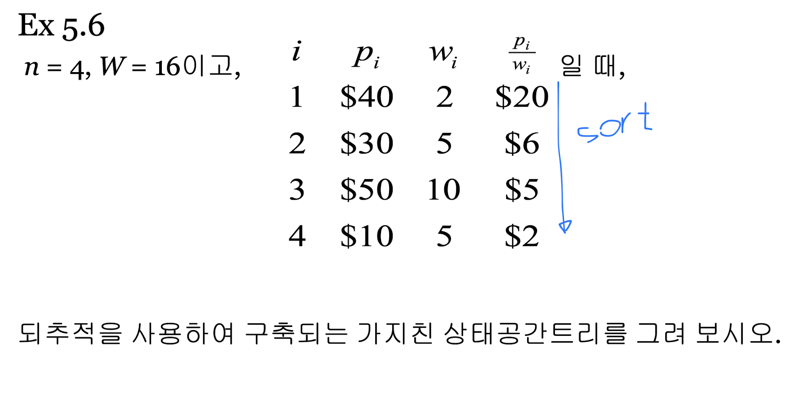
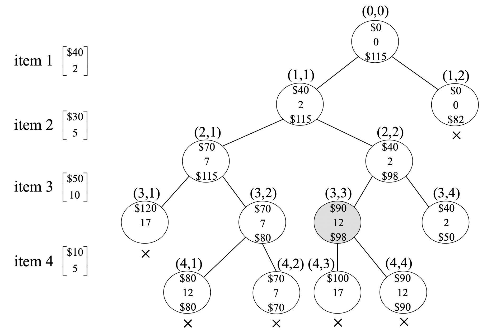

#1
효율성의 하한
NP는 뭐의 약자
뿌리에서 잎 마디까지 트리 이름-> 상태공간
표본공간 되추적 알고리즘

#2
초소비용신장투리znfhtmxjf
포이터 파인드 머지소트

#3
되추적 단점
단점 개선 코드

#4
정렬안하면 무슨문제

#4
여왕벌문재
else
promising

#5
비오름차순 정렬 안되면 문제?
bound산출식
구조체 사용해서 insertm remove과정 자세히
priority queue를 구현하고 최적의 경로를 출력하기 위한 구조체?

#6
bound,

for((all i )&&구현

minlength = length(u) 구현

u.bounf = bound(u)

---

1. 빈칸 채우기 문제
   a. 계산복잡도란? (!=시간복잡도)
   => 모든 알고리즘의 효율의하한을 결정

   b. NP
   Nondeterministic Polynomial

   c. State Space Tree
   => 깊이우선탐색 사용

   d. greedy approach
   => selection -> feasibility check(적절성 체크) -> solution check(최적성 체크)

   e. Monte Carlo
   => backtracking 알고리즘의 수행시간 추정 방법
   => 상태공간 트리의 “전형적인” 경로를 (무작위)로 생성하여 (평균치)로 추정
   => probabilistic(확률적) 알고리즘 (<-> deterministic 알고리즘)

2. kruskal 알고리즘(ch4)
   a. find()함수 알고리즘 작성
   b. merge()함수 알고리즘 작성

3. backtracking, Sum of subsets problem 알고리즘(ch5)
   a. backtracking 알고리즘 단점?
   b. backtracking 단점 개선한 코드?? -> 밑에 node부터 먼저 넣으라고?
   c. Sum of subsets problem 알고리즘 sorting안하면 어떤 문제? -> 어떻게 수정?

4. N-Queens problem 알고리즘(ch5)
   a. else부분 채우기
   b. promising함수 채우기

5. 0-1 knapsack problem 알고리즘(ch5,6)(책에 없는코드 추가 )
   a. 비 오름차순 정렬이 안돠어있으면 나타나는 문제?
   b. priority 구현 위한 struct(구조체) 구조? (ch6)
   c. b의 구조체 사용해서 stack에 insert remove과정 상세히 서술
   d. 특정 값 산출 위해 알고리즘 수정
   e. bound 산출식 작성

6. Traveling salesperson 알고리즘 (ch6)
   a.
   b.

---

# Algorithm

## 4. Greedy Approach

- Greddy algorithm: 결정 시 마다 그 순간에 최적이라고 생각되는 경우를 선택함으로써 최종적인 해답에 도달

  - 순간의 선택은 그 당시(local)에는 최적이지만, local 최적들을 모아 만들어낸 global 해답이 꼭 궁극적으로 최적이라는 보장이 없다.
  - 따라서 greedy algorithm은 항상 최적의 해답을 주는지를 반드시 검증해야 한다.

- Greedy algorithm의 설계 절차

  - (1) Selection procedure(선정과정): 현재 상태에서 가장 좋다고 생각되는 해답을 찾아 solution set에 포함시킨다.
  - (2) Feasibility check(적정성 검사): 새로 얻은 solution set이 적절한지를 결정한다.
  - (3) Solution check(해답점검): 새로 얻은 solution set이 최적의 해인지를 검증한다.

- Spanning tree: Connected, undirected graph G의 모든 vertex들을 포함하며 tree 형태인 subgraph
- Minimum spanning tree: Spanning tree 중 edge의 weight의 합이 최소인 tree

### Kruksal algorithm


```c
set_pointer find(index i) {
	index j = i;
	while(U[j] != j) {
		j = U[j];
	}
	return j;
}

void merge(set_pointer p, set_pointer q) {
	if(p < q) {
		U[q] = p;
	} else {
		U[p] = q;
	}
}
```

---

## 5. Backtracking

### State space tree(상태 공간 트리)

- Root node부터 leaf node까지의 경로가 candidate solution이 되는 tree
- DFS를 수행해 candidate solution들 중 solution을 찾을 수 있다.

### Backtracking

- 어떤 node의 promising 여부를 점검한 후, promising하지 않다고 판단되면 그 node의 parent node로 돌아가  
  다음 후손 node에 대한 검색을 계속 진행하는 방식

- 진행 절차:

  - (1) State space tree의 DFS 실시
  - (2) 각 node가 유망한지 검사
  - (3) 만일 그 node가 유망하지 않다면, 그 node의 부모 node로 돌아가 검색 수행

- 일반 backtracking 알고리즘

```c
void checknode(node v) {
	node u;

	if(promising(v)) {
		if(there_is_a_solution_at(v)) {
			print_solution();
		} else {
			for(u = first_child(v); u != NULL; u = next_sibling(u)) {
				checknode(u);
			}
		}
	}
}
```

- 개선된 되추적 알고리즘

```c
void expand(node v) {
	node u;
	for(each child u of v) {
		if(promising(u)) {
			if(there_is_a_solution_at(u)) {
				print_solution();
			} else {
				expand(u);
			}
		}
	}
}
```

- 일반적인 되추적과 달리, 개선된 되추적 알고리즘에서는 **node 방문 전 promising 여부 점검 실시**  
  그만큼 방문할 node 수가 더 적어진다.

### n-Queens problem

```cpp
void queens(index i) {
	index j;
	if(promising(i)) {
		if(i == n) // cout << col[1] through col[n]
		else {
			for(j = 1; j <= n; j++) {
				col[i+1] = j;
				queens(i+1);
			}
		}
	}
}

bool promising(index i) {
	index k = 1;
	bool swtch = true;
	while(k < i && swtch) {
		if(col[i] == col[k] || abs(col[i] - col[k]) == abs(i - k)) {
			swtch = false;
		}
		k++;
	}
	return swtch;
}
```

### Backtracking의 문제

- Weight들을 작은 순서대로 정렬하지 않으면 발생하는 문제는?

  - 답을 못 찾거나, 늦게 찾게될 수 있다.

### A Monte Carlo Algorithm

- 어떠한 입력이 주어졌을 때, 점검하게 되는 state space tree의 _"전형적인"_ 경로를 무작위로 생성해, 그 경로 상에 있는  
  node의 개수를 센다. 이 과정을 여러번 반복해 나오는 결과의 평균치를 추정치로 한다.
- 확률적(probabilistic) 알고리즘이다.(반대: deterministic(결정적))
- 적용 가능 조건 2개

  - State space tree에서 같은 level에 있는 모든 node는 같은 promising 함수를 사용해야 한다.
  - State space tree에서 같은 level에 있는 node들은 같은 수의 child node들을 가지고 있어야 한다.

### The 0-1 Knapsack problem




---

## 6. Branch and Bound

- Backtracking과 유사하게 state space tree를 사용해 문제를 해결한다.
- Backtracking과의 차이점:
  - Tree 순회 조건이 없다.
  - 최적화 문제에만 사용한다.

---

## 계산 복잡도

- 계산 복잡도: 어떤 문제에 대해 그 문제를 풀 수 있는 모든 알고리즘의 **효율의 하한(lower-bound)** 을 결정
- NP(Nondeterministic Polynomial) problem
