# Database

## 1. 트랜잭션 이론

### 1.1 트랜잭션 개념

- 트랜잭션: 하나의 논리적 작업을 수행하는 데이터베이스 연산의 순서(sequence)

- 트랜잭션의 ACID Property

  - Atomicity(원자성): 트랜잭션의 연산은 모두 성공하거나 모두 실패해야 한다.
  - Consistency(일관성): 단일 트랜잭션의 수행은 데이터의 무결성을 유지해야 한다.
  - Isolation(고립성): 동시에 트랜잭션들이 수행되더라도 각 트랜잭션은 다른 트랜잭션의 연산에 끼어들 수 없다.
  - Durability(지속성): 트랜잭션이 성공적으로 완료되면 그 결과는 시스템 장애가 발생하더라도 데이터베이스 상태에 반영되어야 한다.

### 1.2 직렬 가능(serializability)

- Schedule: 동시적으로 수행되는 다수의 트랜잭션에 속하는 연산이 수행된 시간적 순서

- Serial schedule


- 아래 schedule은 serial schedule은 아니지만 위의 schedule과 동일한 결과를 보인다.

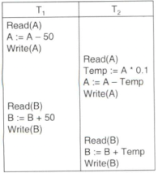

- Serializable(직렬 가능) schedule: Schedule의 결과가 serial schedule의 결과와 동일한 것.

- Conflicting instructions(충돌 연산): 동일한 데이터에 대해 서로 다른 트랜잭션 중 하나라도 write를 하면 conflict하다고 한다.  
  Conflict한 연산은 순서를 바꾸면 결과가 달라지지만 conflict하지 않은 연산은 순서를 바꾸어도 결과가 같다.(ex. read-read)

- Conflict equivalent: Schedule S에 대해 non-conflicting instructions의 순서를 바꾸어도 결과가 같은 schedule S'가 있다면,  
  S와 S'가 conflict equivalent라고 한다.
- Conflict serializable schedule: Schedule S가 serial schedule과 conflict equivalent하다면, S는 conflict serializable schedule이다.

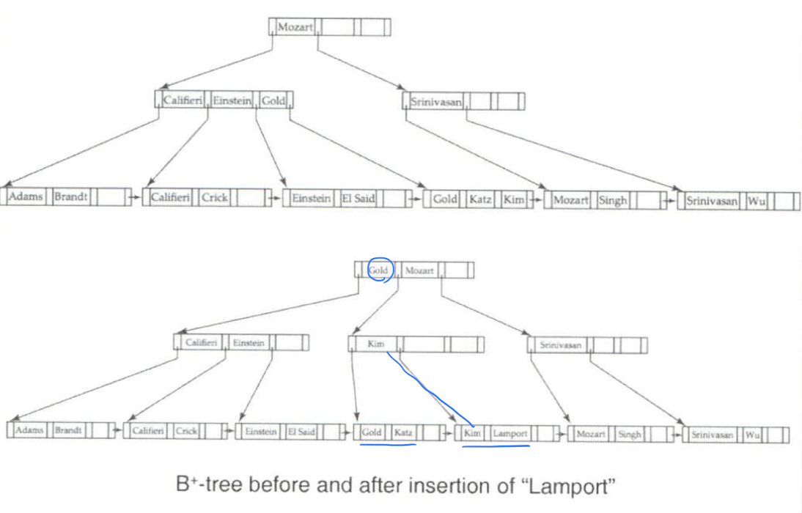

- 아래 schedule은 conflict serializable하지 않은 schedule이다.

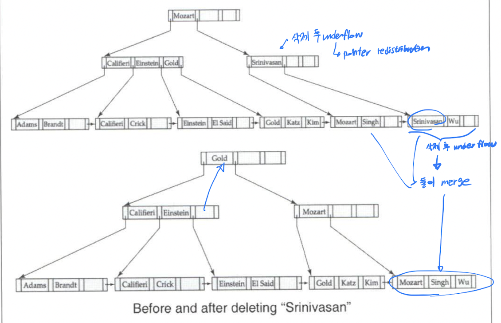

- View Serializability: 2개 schedule S, S'가 있다고 해보자. 이 둘은 아래 조건들을 모두 만족해야 view serializable하다.

  - S가 item Q의 초기 값을 read하면 S'도 item Q의 초기 값을 read한다.
  - S가 item S에 대해 final write를 하면 S'도 item Q에 대해 final write를 한다.

- 아래 예시 schedule은 view serializable하지만 conflict serializable하지는 않다.

  

  - 위 schedule은 < $T_5, T_6, T_7$ > 형태의 serial schedule과 view equivalent하다.
    - 둘 다 $T_5$가 initial value read, $T_7$가 final value write하기 때문.

- 아래 그림처럼 conflict serializable은 view serializable의 부분집합이다.

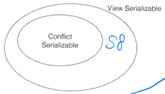

### 1.3 직렬 가능 시험

- Precedence graph:

  - Vertex가 transaction들인 direct graph.
  - Conflict 관계인 두 트랜잭션 $T_i$, $T_j$에 대해 먼저 연산을 수행하는 쪽에서 나머지 쪽으로 directed edge를 그린다.

  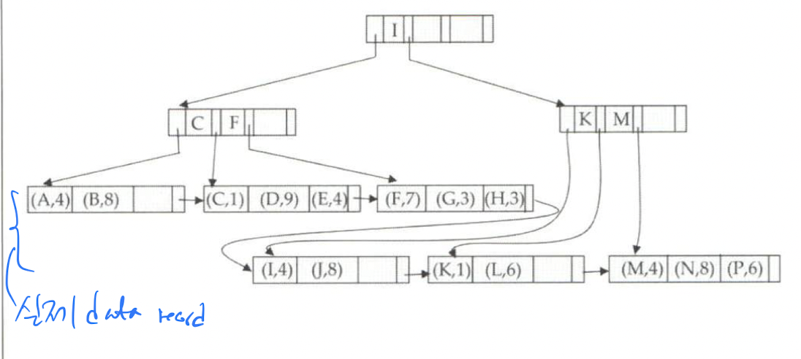

- 이렇게 그려진 precedence graph가 **acyclic 하면 해당 schedule은 conflict serializable하다.**

### 1.4 회복 가능

- 동시에 수행되는 트랜잭션들 중 일부가 실패했을 때 회복할 수 있어야 한다.

- Recovarable schedule: $T_i$에 의해 write된 item을 $T_j$가 읽는다면, $T_i$의 commit이 $T_j$의 commit보다 먼저 일어나야 한다.  
  아래 표는 recovarable하지 않은 schedule이다.

  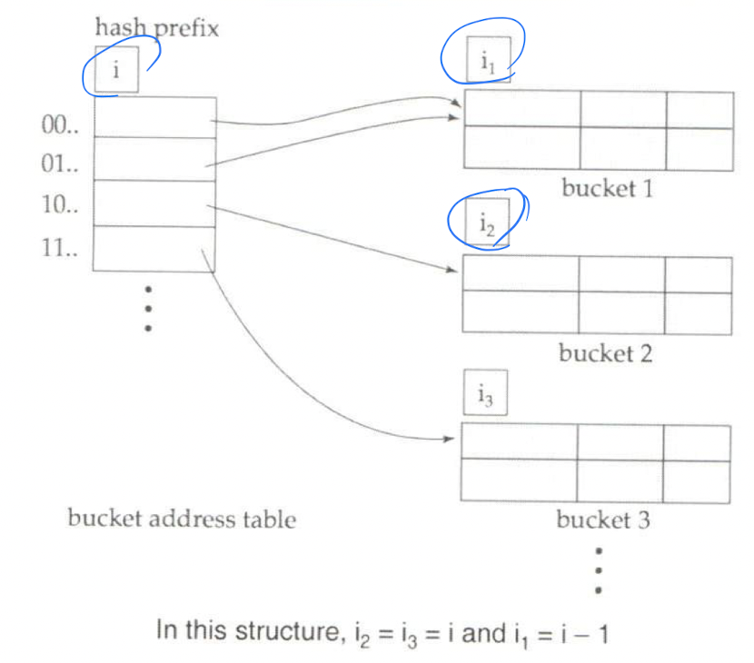

- Cascading rollbacks: 트랜잭션 하나의 실패가 수많은 트랜잭션의 rollback을 일으키는 것.  
  아래 schedule에서 그 어떤 tx도 commit하지 않았는데, 만약 $T_{10}$이 실패하면 $T_{11}, T_{12}$도 rollback되어야 한다.

  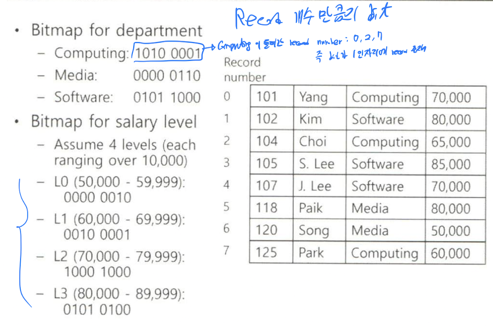

  - 참고로 위 schedule은 recoverable하다.

- DBMS는 schedule이 항상 recoverable하고, cascading rollback이 발생하지 않도록 해야 한다.  
  이것이 cascadeless schedule이다.

- Cascadeless schedule(ACA schedules: Avoid Cascading Aborts):

  - Cascading rollback이 발생하지 않는다.
  - $T_i$에 의해 write된 item을 $T_j$가 읽는다면, $T_i$의 commit이 $T_j$의 가 해당 item을 읽는 시점보다 먼저 일어나야 한다.

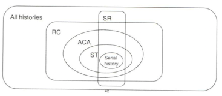

- RC: Recovarable
- ACA: Avoiding Cascading Aborts
- ST: Strict
- SR: Conflict Serializable

- 이렇게 schedule을 conflict serializable 또는 view serializable하게 하도록, 그리고 recoverable하면서  
  cascadeless 하도록 하기 위해 DBMS는 concurrency control protocol을 사용한다.
  > Concurrency control protocol은 precedence graph를 바로 만들어 cycle 여부를 관측하지 않는다.

---

## 2. 동시성 제어(Concurrency Control)

### 2.1 Lock-based protocols

- X lock: read, write 모두 가능
- S lock: read만 가능

- 여러 개의 트랜잭션이 S-lock은 동시에 획득할 수 있는 반면, X-lock은 단 하나의 트랜잭션만 획득할 수 있다.  
  다른 트랜잭션은 이미 X-lock을 획득한 tx가 해당 lock을 release해야만 X-lock을 획득할 수 있다.

- Lock을 획득하기 위해 트랜잭션은 필요한 경우 대기(wait)한다.  
  이러한 locking은 lock manager로 구현되는데, lock manager는 lock table이라는 자료구조를 관리해  
  부여한 lock과 lock을 획득하기 기다리는 tx들의 요청을 처리한다.

- 대략적인 lock 흐름

  - (1) lock(A)
  - (2) read(A)
  - (3) unlock(A)

- 2PL(Two-Phase Locking Protocol)

  - Phase 1: Growing phase

    - Lock 획득만 가능. release는 불가
    - S-lock을 X-lock으로 _upgrade_ 할 수 있다.

  - Phase 2: Shrinking phase

    - Lock release만 가능. 획득은 불가
    - X-lock을 S-lock으로 _downgrade_ 할 수 있다.

  - 2PL은 conflict serializable한 schedule만 생성한다.
  - Cascading rollback은 가능하다.

    - 이를 막기 위해 아래의 2개 2PL이 더 있다.
      - Strict 2PL: 트랜잭션이 commit 또는 abort할 때까지 X-lock을 release하지 못하게 한다.
      - Rigorous 2PL: X-lock 뿐만아니라 S-lock까지 트랜잭션이 commit 또는 abort할 때까지 release하지 못하게 한다.

  - 2PL을 써도 deadlock은 발생할 수 있다.

- Deadlock(피할 수 없다. 어떻게 해도 발생하긴 하지만 매우 낮은 확률로 발생한다.)

  

  - 위 schedule에서 $T_4$는 Lock-S(B)를 획득하기 위해 $T_3$를 기다리고, $T_3$는 Lock-X(B)를 획득하기 위해 $T_4$를 기다린다.  
    이렇게 되면 무한정 기다리게 되는데, 이를 deadlock이라고 한다.

- Starvation(기아 상태): 특정 tx가 lock을 획득하지 못하고 필요 이상으로 lock을 기다리게 되는 현상

- Graph-based Protocol

  - Lock을 걸려고 하는 데이터가 부분 순서가 있어야 한다는 가정이 필요하다.
  - Conflict serializable한 schedule만 생성하고, deadlock을 발생시키지 않음을 보장한다.
  - 2PL보다 unlock이 빠르게 발생할 수 있어서 대기 시간이 줄어들게 되고, 결과적으로 동시성이 향상된다.
  - Deadlock이 발생하지 않고 rollback도 필요 없다.

  - 단점:
    - Recoverable함과 cascading rollback이 없음을 보장하지 못한다.
    - Tx가 실제로 접근하지 않는 item에 대해서도 lock을 걸어야 할 수도 있다.

- Tree-based Protocol

  - Graph-based protocol의 하나.
  - X-lock만 허용한다.
  - $T_i$는 처음에 어떠한 item에도 X-lock을 걸 수 있다.
  - 이후에 $T_i$가 또 X-lock을 획득하려면, X-lock을 획득하려는 item의 부모 노드의 X-lock을 이미 $T_i$가 소유하고 있어야만 한다.
  - Unlock은 언제든지 가능하다.
  - $T_i$가 lock, unlock을 한 번 수행한 item에 대해 $T_i$는 다시 lock을 걸 수 없다.

  

- MGL(Multiple Granularity Locking)

  - 데이터의 계층 구조를 만들어 tree처럼 사용한다.
  - Tx가 하나의 node에 대해 lock을 걸면, 해당 node의 모든 자식 node들까지 암시적으로 동일한 lock mode의 lock이 걸린다.

  - Intention lock: S, X-lock에 더해 3개의 추가적인 lock mode가 존재한다.

    - IS(Intention-Shared): IS를 거는 node의 자식 node 중 하나를 read할 때
    - IX(Intension-Exclusive): IX를 거는 node의 자식 node 중 하나를 write할 때
    - SIX(Shared + Intension-Exclusive): SIX를 거는 node에 명시적으로 S-lock을 걸고 자식 node 중 하나를 write할 때

  - Intention lock의 호환성

    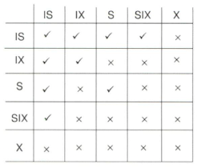

    - X는 다 호환 안됨.
    - SIX는 IS이랑만 호환됨.
    - IX는 IS, IX이랑만 호환됨.

  - MGL의 locking 방식

    - tx는 이전에 unlock하지 않은 node일 때만 lock 획득 가능.
    - Lock의 획득: root-to-leaf order
    - Lock의 해제: leaf-to-root order

  - 예시

    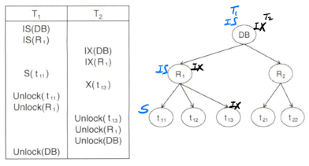
    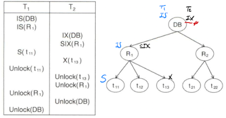
    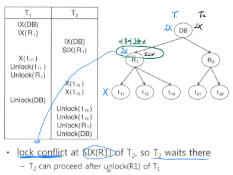

### 2.3 Deadlock

- Deadlock handling

  - Timeout-based scheme: Tx는 lock을 획득하기 위해 지정된 시간만큼 wait한다. 해당 시간이 timeout되면 tx가 rollback된다.  
    (no deadlocks)
  - Deadlock prevention protocol을 사용해 deadlock을 발생하지 않도록 한다.(ex. Graph-based protocol)
  - Tx의 timestamp를 활용하는 방식들
    - Wait-die:
      - Older tx는 younger tx가 lock을 release하기를 기다린다.
      - 반대로 younger tx는 older tx를 절대 기다리지 않고 바로 rollback된다.
    - Wound-wait:
      - Older tx는 younger tx를 기다리는 대신 younger tx를 강제로 rollback한다.
      - Younger tx는 older tx가 lock을 release하기를 기다린다.
    - Wait-die, Wound-wait 모두 rollback된 tx는 기존의 timestamp를 갖고 재시작된다.

- Deadlock detection

  - Wait-for graph를 사용한다.
    - G = (V, E)
      - V: Tx의 집합, $T_i$에서 $T_j$로의 화살표는 $T_i$가 lock 획득을 위해 $T_j$를 기다리고 있음을 의미한다.
  - 이 Wait-for graph가 cyclic하면 deadlock에 빠진 것이다.
  - 이렇게 deadlock이 발견되면 아래 2개 중 하나의 기준으로 tx를 rollback해야 한다.
    - rollback 비용이 가장 적은 tx를 rollback
    - total rollback: tx abort후 재시작
    - partial rollback: deadlock을 해결할 수 있을 만큼만 rollback

### 2.4 입력 및 삭제 연산

- Delete 연산: 삭제될 item에 대해 X-lock을 획득한 후 수행해야 한다.
- Insert 연산: 삽입한 item에 대해 tx가 X-lock을 획득하게 된다.
- Insert, delete 연산은 phantom 현상이 발생할 수 있다.

- Phantom 현상: tuple locking을 수행해 서로 다른 tx들이 tuple의 입력 또는 삭제 여부를 인식하지 못하기에 발생

  - 방지책:
    - Table locking: Phantom 현상을 방지할 수 있지만, 효율성이 떨어진다.(현저히 저하된 동시성)
    - Index locking

- Index에 2PL 적용하기

  - Read하는 tx: 접근하는 모든 node에 S-lock 획득해야함.
  - Insert,update,delete하는 tx: 접근하는 모든 node에 X-lock 획득해야함.
  - 동시성 지원이 어려움.
  - 2PL과 달리 internal node에 대한 lock을 더 빠르게 unlock할 수 없을까? => tree-based protocol

- Index Crabbing(Index에 tree-based protocol 적용한 것)

  - (1) Root node에 S-lock 걸기
  - (2) 필요한 자식 node에 S-lock 다 걸었으면 root node의 S-lock release
  - (3) Insert, Delete 중에는 leaf lock의 S-lock을 X-lock으로 upgrade

  - 문제: Deadlock이 많이 발생함

- 더 나은 방식:

  - Child node에 대한 lock 획득 전에 부모 node의 lock 해제 등

### 2.5 SQL 트랜잭션 고립

- Weak levels of consistency

  - 일부 애플리케이션은 serializable하지 않은 schedule도 허용한다.
  - 즉 정확성과 성능의 tradeoff 발생

- Degree-two consistency

  - S-Lock은 언제든지 release 가능, X-lock은 tx의 끝까지 release 불가
  - Lock은 언제든지 획득 가능
  - Serializability 보장 안됨.

- Cursor stability

  - Read의 경우 각 tuple은 lock => read => unlock이 즉각적으로 이뤄진다.
  - X-lock은 tx의 끝까지 유지
  - Degree-two consistency의 특별한 case이다.

- Transaction isolations in SQL

  - SERIALIZABLE: Conflict serializable schedule만 생성됨을 보장.
  - REPEATABLE READ: commit된 값만 read. Tx 내에서 read를 몇 번 해도 결과가 동일함.
  - READ COMMITTED: Degree-two consistency와 동일.
  - READ UNCOMMITTED: uncommit된 데이터도 read 가능.

  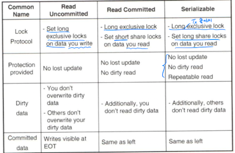

### 2.6 스냅샷 고립(Snapshot Isolation)

- Multiversion schemes

  - Data item의 이전 버전들을 보관해 동시성을 향상시킨다.
  - 성공적으로 write한 item이 있다면 해당 item의 새로운 버전이 생긴다.
  - 특정 item에 read가 발생하면 tx의 timestamp에 기반해 적절한 버전을 선택해 반환한다.  
    (read operations never have to wait!)

- Multiversion timestamp ordering

  - 각 item $Q_k$는 아래 3개 정보를 가진다.

    - Content: Value of the version $Q_k$
    - W-timestamp: $Q_k$를 성공적으로 write한 가장 최근 tx의 timestamp
    - R-timestamp: $Q_k$를 성공적으로 read한 가장 최근 tx의 timestamp

  - R-timestamp는 $TS(T_j) \gt R-timestamp(Q_k)$ 일 때 갱신된다.

  - $T_i$가 item Q에 대해 read, write를 한다고 해보자. 그리고 $Q_k$는 $TS(T_i)$와 같거나 바로 직전의 timestamp를 가진 버전이다.

    - $T_i$가 read(Q)를 수행하면 $Q_k$ 가 반환된다.
    - $T_i$가 write(Q)를 수행하면?
      - $TS(T_i) \gt R-timestamp(Q_k)$ 이면 $T_i$는 rollback된다.
      - $TS(T_i) = W-timestamp(Q_k)$이면 $Q_k$의 content만 갱신된다.
      - 그 외의 경우: Q의 새로운 버전이 생성된다.

- Snapshot Isolation

  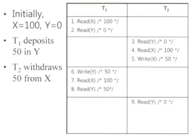

  - 이렇게 서로 다른 tx가 다른 item에 대해 write하면 결과가 달라질 수 있다.
  - 즉 write, read를 snapshot에 대해서만 수행하기에 발생하는 문제가 있다.

  - 이를 해결하기 위해 first-committer-wins, first-updater-wins 전략이 존재한다.

  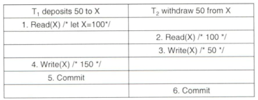

  - first-committer-wins: $T_2$가 rollback된다.
  - first-updater-wins: $T_1$이 rollback된다.

  - 장점: read 연산이 절대 block될 일이 없다.
  - 단점: serializable하지 않은 schedule이 생성될 수 있다.

  - Write skew

    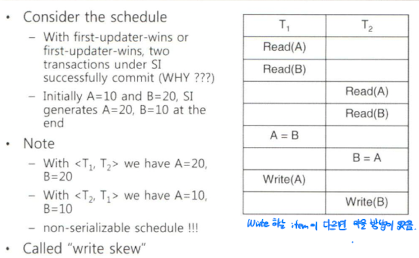

---

## 3. 복구(Recovery)

### 3.1 장애 및 복구

- Transaction failure
- System failure(crash)
- Disk failure

- Failures happen without prior warning, any time, and anywhere.

- Recovery algorithms: 장애에도 불구하고 데이터베이스의 일관성과 tx의 atomicity, durability를 보장하기 위한 것.

- Storage structure

  - Volatile storage: Does not survive system crashes (main memory, cache memory)
  - Nonvolatile storage: Survives system crashes(disk, tape, etc.)
  - Stable storage: 모든 failure를 다 survive하는 storage, 주로 여러 개의 copy를 사용해 구현

- Stable storage implementation

  - 동일한 data block을 서로 다른 2개 이상의 disk에 write
  - bad checksum등을 통해 잘못된 data block이 발생하면 overwrite
  - 이렇게 copy를 원격으로 두면 화재, 홍수 등의 재난 상황에 대응 가능

- Data location

  - 아래 그림처럼 disk에서 buffer로 buffer manager가 데이터를 불러오고, 각 tx는 연산을 처리하기 위한 임시 공간을 할당받아 사용.

  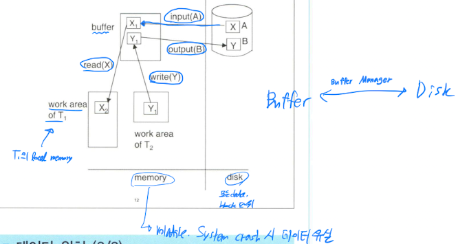

### 3.2 Log

- Recovery의 2가지 접근 방법

  - Log-based recovery
  - Shadow-paging(주로 text editor에서 사용됨)

- Simple logging: Normal processing

  - Log들은 stable storage에 보관된다.
  - Tx $T_i$가 start하면 < $T_i$, start > log record가 생기고 만약 X의 값을 $V_1$에서 $V_2$로 바꾸게 되면  
    < $T_i, X, V_1, V_2$ >의 log record가 생긴다. 마지막으로 $T_i$가 마지막 연산을 수행하면 < $T_i$ commit > log record가 생긴다.

- Simple logging: Checkpoint

  - Checkpointing:
    - main memory에 쌓인 log record들을 stable storage에 write.
    - buffer에 있는 수정된 data block들을 disk에 write.
    - <checkpoint L> 이라는 log record가 생성되고, L은 checkpoint 시점에 활성화된 모든 tx들의 목록을 의미한다.

  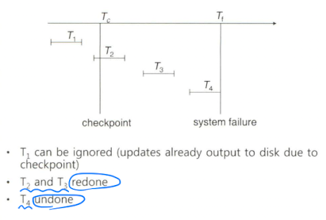

- Simple logging: Recovery

  - System이 crash로부터 회복하면 아래와 같은 과정을 거친다.

    - (1) "undo-list", "redo-list"를 empty list로 초기화.
    - (2) 로그를 \<checkpoint L\> record가 발견될 때까지 마지막(가장 최근)에서 처음으로 역순으로 scan한다.
      - 이 과정에서 < $T_i$ commit >이 발견되면 $T_i$를 "redo-list"에 $T_i$를 추가한다.
      - 이 과정에서 < $T_i$ start >가 발견되었지만 "redo-list"에 없다면 "undo-list"에 $T_i$를 추가한다.
    - (3) L에 있는 모든 tx에 대해 "redo-list"에 없는 tx들을 "undo-list"에 추가한다.

  - 이제 복구 과정은 아래처럼 수행된다.

    - (1) "undo-list"에 있는 모든 tx에 대해 가장 최근 log부터 역순으로 < $T_x$, start > record가 만날 때까지 scan한다.  
      scan과정에 있던 $T_x$ 관련된 모든 log record를 undo 한다.
    - (2) 가장 최근 \<checkpoint L\> record를 찾는다.
    - (3) \<checkpoint L\>부터 log의 마지막까지 scan을 수행한다.
      - scan 과정에서 "redo-list"에 있는 tx에 대해 모든 log record를 redo한다.

  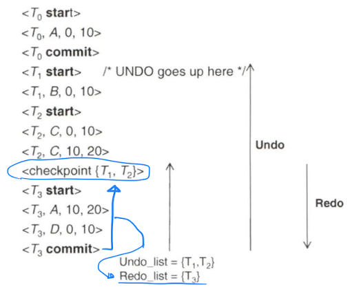

### 3.3 Data Buffer

- Buffer management

  - 데이터베이스 파일들은 block이라는 고정된 storage unit으로 분할된다.
  - Block: storage 할당, data transfer의 단위
  - Buffer: disk block의 복사본을 저장할 수 있는 main memory의 일부
  - Buffer manager: main memory에 buffer space 할당하는 역할

  - 이미 block이 buffer에 있다면 buffer manager는 해당 block의 main memory 주소를 반환한다.
  - block이 buffer에 없다면?
    - block을 위한 space를 buffer에 할당한다.
      - 이때 기존 block을 해제하거나 교체하도록 할 수 있다.

- Buffer management policies

  - LRU(Least Recently Used): 새로운 block 공간이 필요하면 가장 오래 전에 사용된 block을 buffer에서 해제한다.  
    data의 반복적인 scan이 필요한 상황에서 비효율적이다.

  - MRU(Most Recently Used): 새로운 block 공간이 필요하면 가장 최근에 사용된 block을 buffer에서 해제한다.

  - Buffer manager는 recovery를 위해 block을 강제로 disk로 write(forced output)할 수도 있다.

- Data page buffering

  - 데이터베이스는 data block의 in-memory buffer를 유지한다.
  - 수정된 데이터를 disk에 write하기 전 항상 log record를 먼저 stable storage로 보낸다.(WAL: Write-Ahead Logging)
  - Data block을 disk에 write하는 동안에는 어떠한 update 작업도 일어나서는 안된다.
  - Database buffer는 대부분 virtual memory로 구현된다.

- Slotted page structure

  - Page header, slot으로 구성된다. Slot은 해당 페이지에 저장되는 record의 주소를 가진다.

    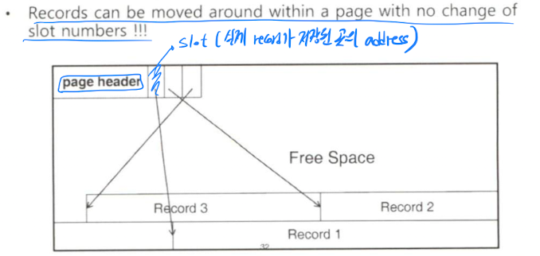

- Steal, Force policy

  - Force policy: Update된 block들을 commit 시점에 disk에 write한다.
  - Not-force policy: update된 block들을 tx가 commit해도 꼭 disk에 write하진 않는다.
    - Commit된 data block이 disk로 내려가지 않을 수도 있기에 "REDO" 가 필요하다.
  - Steal: Uncommit된 변경사항을 가진 block들을 commit되기 전에 disk에 write하기도 한다.

    - Commit되지 않은 data block이 disk로 내려갈 수 있기에 "UNDO" 가 필요하다.

  - 좋은 policy는 "steal + not-force" policy이다.

  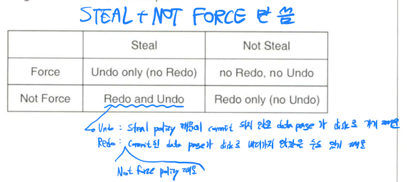

### 3.4 Log based recovery

- Log record들은 stable storage로 직접 보내지기 전 main memory에 buffering된다.  
  그리고 I/O cost를 낮추기 위해 여러 개의 log record들이 한번에 stable storage로 보내지기도 한다.(group commit)

- Log record가 buffering될 때는 아래의 규칙들이 지켜져야 한다.

  - Log record는 항상 생겨난 순서대로 stable storage로 보내져야 한다.
  - Tx $T_i$는 < $T_i$ commit > log record가 stable storage로 보내진 후에 commit되어야 한다.
  - 변경된 data block이 disk에 쓰여지기 전, 먼저 관련 log record들이 stable storage에 보내져야 한다.(WAL: Write-Ahead Logging)

- Recovery algorithm

  - 일반적인 상태에 log는 아래처럼 생긴다.
    - < $T_i$ start > => < $T_i, X_j, V_1, V_2$ >, < $T_i$ commit >
  - Tx $T_i$의 rollback은 아래처럼 이뤄진다.

    - (1) 마지막(가장 최근)부터 거꾸로 scan하며 < $T_i, X_j, V_1, V_2$ > 형태의 log record들 각각에 대해
      - undo를 수행한다. 이때 undo를 하는 log record를 생성한다!
      - 이러한 log record를 CLR(Compensation Log Record)라 하며 < $T_i, X_j, V_1$ > 형태로 생긴다.
    - (2) < $T_i$ start > record가 보이면 scan을 중지하고 < $T_i$ abort > record를 생성한다.

  - Failure로부터의 recovery는 2개 phase로 이뤄진다.(REDO FIRST!!)
    - Redo phase, Undo phase
    - Redo phase:
      - 마지막 \<checkpoint L\> record를 찾고 undo-list에 L을 넣는다.
      - \<checkpoint L\>부터 scan을 시작한다.
        - < $T_i, X_j, V_1, V_2$ >가 보이면 redo 한다.
        - < $T_i$ start >가 발견되면 $T_i$를 undo-list에 넣는다.
        - < $T_i$ commit > 또는 < $T_i$ abort >를 만나면 undo-list에서 $T_i$를 제거한다.
    - Undo phase: 로그를 마지막(가장 최근) 순서대로 거꾸로 scan 한다.
      - $T_i$가 undo-list에 있고 < $T_i, X_j, V_1, V_2$ >가 발견되면 undo를 수행한다.  
        그리고 CLR인 < $T_i, X_j, V_1$ >을 생성한다.
      - $T_i$가 undo-list에 있고 < $T_i$ start >가 발견되면 < $T_i$ abort >를 생성하고 undo-list에서 $T_i$를 제거한다.
      - 이 과정을 undo-list가 empty할 때까지 반복한다.

  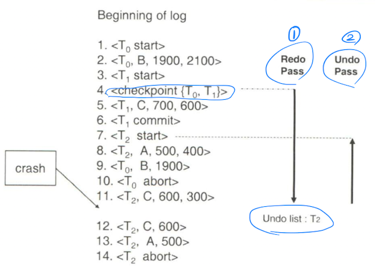

- Fuzzy checkpointing

  - Checkpoint 생성 중 processing을 가능하게끔 해준다. 과정은 아래와 같다.
    - (1) tx에 의한 모든 갱신 작업을 일시중지한다.
    - (2) \<checkpoint L\> log record를 생성하고 log record들을 stable storage로 force output한다.
    - (3) 수정된 buffer block들의 리스트 M을 생성한다.
    - (4) tx들이 작업을 수행하도록 재개한다.
    - (5) M에 있는 모든 수정된 block들을 disk에 write한다.
      - Write 도중에 block들은 수정되어서는 안된다.
      - WAL을 준수한다.
    - (6) Disk에 "last_checkpoint"라는 이름으로 checkpoint record를 가리키는 포인터를 생성한다.

- Failure of nonvolatile storage

  - Nonvolatile storage(disk 등)의 failure에는 checkpoint와 비슷한 기술이 쓰인다.
    - (1) Main memory에 있는 모든 log record를 stable storage로 보낸다.
    - (2) Buffer에 있는 모든 block들을 disk에 쓴다.
    - (3) 데이터베이스의 내용을 stable storage로 복사한다.
    - (4) \<dump\>라는 log record를 생성하고 stable storage로 보낸다.
  - Dump 과정에는 어떠한 tx도 작업할 수 없다.

  - Nonvolatile storage의 failure로부터 복구하는 과정은 아래와 같다.
    - (1) 가장 최근 dump로부터 복원
    - (2) Log record를 통해 dump 이후에 commit된 tx들의 작업을 redo.

### 3.6 원격 백업

- Disaster: 자연재해 등

- Remote backup systems

  - 고가용성을 제공하기 위해 primary에 disaster가 발생해도 tx가 처리되도록 한다.
    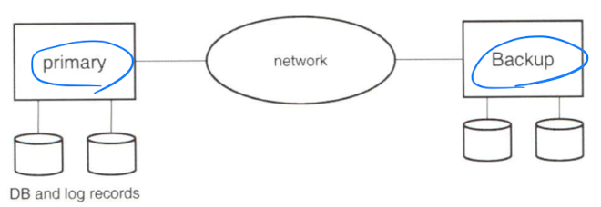
  - primary의 모든 log record를 secondary로 보내 동기화한다.

- Time to Commit
  - tx의 갱신 작업이 backup에도 저장되어야 commit되도록 해 durability 향상.
  - 전략들:
    - one-safe: primary에만 log record가 write되면 tx commit
      - primary가 장애가 났을 때 갱신 작업이 backup에 도달하지 못한 상황일 수 있다.
    - two-very-safe: primary와 secondary에 모두 log record가 write되면 tx commit
    - two-safe: primary, secondary 모두 동작할 때는 둘 다 write되어야 commit처리.  
      primary가 동작중일 때 primary에만 log record가 write 되어도 tx commit
      - two-very-safe보다 가용성이 높다.

---

## 4. 저장 장치(Storage Devices)

### 4.1 물리적 저장 매체

- Cache: 가장 빠른 접근 시간. CPU 내에 위치
- Main memory: nanosecond 단위의 접근 시간
- Flash memory: main memory만큼 빠른 읽기 시간.  
  write는 느리고 삭제는 더 느리다. 또한 overwrite가 안됨.
- NAND flash memory: 주로 storage에 사용.
- Optical disk: DVD 같은 것
- Magnetic disk: 대용량 데이터 저장 장치
- Magnetic tape: 대용량 데이터 저장 장치의 저렴한 방식

- Storage hierarchy

  ```
  cache - main memory - flash memory - magnetic disk - optical disk - magnetic tapes
  [FASTER] -------------------------------------------------------- [LARGER STORAGE]
  ```

### 4.2 자기 디스크(Magnetic Disk)

- Magnetic Disks

  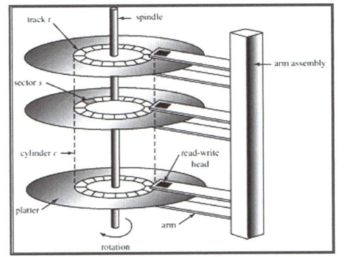

- Disk Controller

  - Computer system과 disk drive hardware 사이의 인터페이스
    - sector에 대해 read, write하라는 high level command 받아 수행
    - disk arm 움직이기, data 읽고 쓰기 등의 action 수행 지시

- Disk Connection

  - DAS(Directly Attached Storage)
    - disk가 컴퓨터에 직접 연결되어 있음
  - SAN(Storage Area Network)
    - disk들이 high-speed network를 통해 여러 컴퓨터들에 연결되어 있음.
    - SCSI, SAS 등 block storage를 위한 protocol 사용
    - any-to-any connection 지원
    - Block level operation만 가능(file이라는 단위가 없다.)
  - NAS(Network Attached Storage)
    - 컴퓨터가 NFS 등의 file system protocol을 통해 disk에 연결 및 사용

- Disk 성능 평가

  - Access time: read 또는 write request가 disk에 도달한 후에 응답을 받는데 걸리는 시간(seek time + rotational latency)
  - Data-transfer rate: 데이터를 disk로 보내거나 받아오는 속도
  - MTTF(Mean Time To Failure): Disk가 장애 없이 사용 가능한 평균 시간

- 성능 향상

  - Block: 데이터는 disk와 main memory 사이에서 block 단위로 움직인다.
  - File organization: 데이터의 access 방식에 따라 block을 정렬해 block access time을 최소화한다.
    - 밀접하게 관련된 정보들을 동일하거나 근처의 cylinder에 저장하기

### 4.3 RAID

- RAID: Redundent Arrays of Independent Disks

- Improvement of reliability via redundancy

  - Redundancy(중복): disk failure 시 원본 데이터를 복구하기 위해 원본 데이터에 추가적인 데이터를 함께 저장하는 것.
  - Mirroring: 모든 disk를 중복한다. 즉 logical disk는 2개의 physical disk로 구성된다.

- Improvement of performance via parallelism

  - 데이터를 여러 개의 disk에 분산(stripe)시킴으로써 transfer rate를 향상시킨다.
  - Bit-level striping: byte내의 bit들을 여러 디스크에 분산시킨다.
  - Block-level striping: n개의 디스크가 있을 때 파일의 i 번째 block을 $i \pmod n + 1$ 번째 디스크에 저장한다.

- RAID levels

  - Level 0: Block striping, non-redundant
    - 데이터의 누락이 어느정도 허용되는 high performance application에서 사용
    - 즉 data safety가 중요하지 않을 때만 사용
  - Level 1: Mirrored disks with block striping
    - 최고의 write performance
    - Database system에 log file 저장하는 등에 많이 사용
  - Level 2: ECC with bit striping
    - 하나의 bit가 손상되었을 때 복구하기 위해 추가적인 bit들을 저장
    - Level 3에 subsume되어 사용 x
  - Level 3: Bit-interleaved parity
    - Level 2의 장점을 모두 지원하며 더 저렴하다.
    - Bit-striping이 single block이 모든 disk에 접근하도록 하기에 사용 x
  - Level 4: Block-interleaved parity
    - Block-level striping을 사용하며 별도의 원본 데이터가 저장된 disk와 다른 disk에 parity block을 저장한다.
    - Parity block이 병목 지점이 된다.
    - Level 5에 subsume되어 사용 X
  - Level 5: Block-interleaved distributed parity
    - 데이터와 parity를 N+1개 disk들로 partition한다.
    - Level 4가 parity block이 병목 지점이 되는 것을 없앤다.
  - Level 6: P+Q redundancy scheme

    - Level 5와 유사하지만 여러 개의 disk에 장애가 났을 때를 방지하기 위해 추가적으로 redundant한 정보를 저장한다.
    - Level 5보다 높은 비용이지만 Level 5보다 더 높은 reliability를 제공한다.
    - Rarely used.

  - Choices

    - Level 1은 Level 5보다 훨씬 나은 write performance 제공
    - Level 1은 Level 5보다 storage cost가 높다.
    - Level 5는 update 빈도가 적은 대용량 애플리케이션에 적합
    - 일반적인 경우는 Level 1 사용

  - Software RAID: RAID 구현을 hardware 지원 없이 software로만 구현한 것.
  - Hardware RAID: RAID를 특별한 hardware로 구현한 것.

- Hardware issues

  - Latent failure(bit rot): 성공적으로 write되어 있는 데이터가 훼손되는 것
  - Data scrubbing: 지속적으로 latent failure를 탐지해 copy, parity를 사용해 복구하는 것
  - Hot swapping: disk를 교체할 때 시스템을 중단하지 않고 disk를 교체하는 것

### 4.4 파일 구성

- Database는 file들의 모음이다.
- 파일은 record들의 모음이다.
- record는 field들의 모음이다.

- Fixed-length records

  - 일반적으로 record의 크기는 고정되지 않아있기에 사용하지 않음.

- Variable-length records

  - 주로 사용된다.
  - offset, length로 특정 record가 어느 부분을 차지하는지 표현

- File 내의 record 구성

  - heap: file 내에 있는 공간 어디든지 record를 저장할 수 있다.
  - sequential: record들을 순차적으로 저장한다.(record의 search key 기반)
  - hashing: hash function을 record의 일부 attribute에 저장해 file의 어디에 저장할지 결정

- Multitable clusturing file organization

  - 여러 개의 table을 하나의 file에 저장한다.
  - join query를 지원하기에 좋지만 단일 테이블만을 조회하는 query에는 비효율적이다.

---
