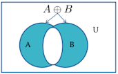
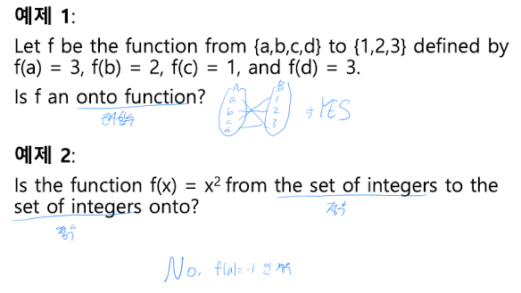
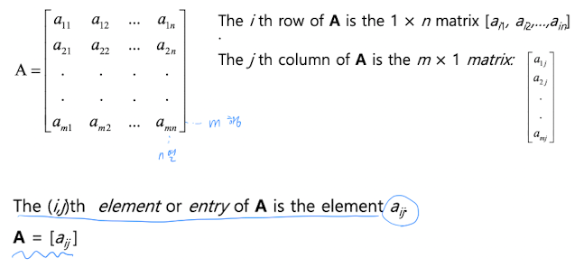
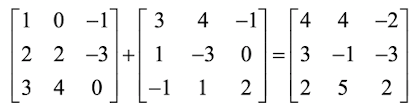
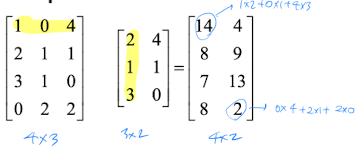
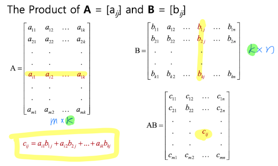
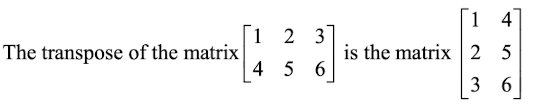

# Discrete Mathematics

## 1.1 명제 논리

### 명제(proposition)

- 명제: 참 또는 거짓 중 하나를 나타내는 문장이나 식

  - ex) 대한민국의 수도는 서울이다.
  - ex) `1 + 0 = 3`
  - 명제가 아닌 예시: 몇 시 입니까?

- 복합 명제(compound proposition): 논리 연산자를 이용해 기존의 명제들로 만든다.

  - 부정(negation): $\neg$
  - 논리곱(conjunction): $\land$
  - 논리합(disjuntion): $\lor$
  - 조건문(implication): $\rightarrow$
  - 상호 조건문(biconditional): $\leftrightarrow$
  - 논리곱(XOR): $\oplus$
    - 논리곱은 p, q 중 단 1개일 때만 T이고, 나머지는 모두 F이다.

- 부정(negation): $p$의 부정은 $\neg p$로 표현되고 아래의 진리표를 가진다.

  | $p$ | $\neg p$ |
  | --- | -------- |
  | T   | F        |
  | F   | T        |

  - 예시: $p$가 "지구는 둥글다"일 때 $\neg p$는 "지구는 둥글지 않다." 이다.

- 논리곱(conjunction): $p$와 $q$의 논리 곱은 $p \land q$로 표현되고 아래의 진리표를 가진다.

  | $p$ | $q$ | $p \land q$ |
  | --- | --- | ----------- |
  | T   | T   | T           |
  | T   | F   | F           |
  | F   | T   | F           |
  | F   | F   | F           |

  - 논리곱은 "AND"이다.
  - 예시: $p$가 "나는 집에 있다.", $q$가 "비가 온다" 일 때 $p \land q$는 "나는 집에 있고 비가 온다." 이다.

- 논리합(disjunction): $p$와 $q$의 논리합은 $p \lor q$로 표현하며 아래의 진리표를 가진다.

  | $p$ | $q$ | $p \lor q$ |
  | --- | --- | ---------- |
  | T   | T   | T          |
  | T   | F   | T          |
  | F   | T   | T          |
  | F   | F   | F          |

  - 논리합은 "OR"이다.
  - 예시: $p$가 "나는 집에 있다.", $q$가 "비가 온다" 일 때 $p \lor q$는 "나는 집에 있거나 비가 온다." 이다.

- 배타적 논리합(XOR): $p \oplus q$는 $p$, $q$ 중 어느 하나만이 T일때 T가 된다.

  | $p$ | $q$ | $p \oplus q$ |
  | --- | --- | ------------ |
  | T   | T   | F            |
  | T   | F   | T            |
  | F   | T   | T            |
  | F   | F   | F            |

- 조건문(implication): $p, q$에 대해 $p \rightarrow q$는 _"if p then q"_ 이다.

  | $p$ | $q$ | $p \rightarrow q$ |
  | --- | --- | ----------------- |
  | T   | T   | T                 |
  | T   | F   | F                 |
  | F   | T   | T                 |
  | F   | F   | T                 |

  - $p$가 T일 때 $q$가 F인 경우만 F가 된다.

  - 조건문의 진리값에 대한 이해

    - "If the moon is made of green cheese, then I have more money than Bill Gates."
      - $p \rightarrow q$에서 p가 F이고 q도 F이므로 T이다.
    - "If 1 + 1 = 3, then 2 + 3 = 5."
      - $p \rightarrow q$에서 p가 F이고 q가 T이므로 T이다.
    - "If I am elected, then I will lower taxes."
      - $p \rightarrow q$에서 이는 $T \rightarrow T$ 또는 $F \rightarrow F$ 일 때는 T, $T \rightarrow F$ 일 때는 F이다.
    - "If you get 100% on final, then you will get an A."
      - $p \rightarrow q$에서 이는 $T \rightarrow T$ 또는 $F \rightarrow F$ 일 때는 T, $F \rightarrow F$ 일 때는 T이다.

- $p \rightarrow q$를 나타내는 여러 가지 표현

  - if $p$, then $q$
  - $p$ implies $q$
  - $p$ only if $q$
  - A neccessary condition for $p$ is $q$ (필요 조건)
  - A sufficient condition for $p$ is $q$ (충분 조건)

### 역(converse), 이(inverse), 대우(contrapositive)

- $p \rightarrow q$에서 아래의 조건문을 만들어낼 수 있다.

  - $q \rightarrow p$ (역): is the **converse** of $p \rightarrow q$.
  - $\lnot p \rightarrow \lnot q$ (이): is the **inverse** of $p \rightarrow q$.
  - $\lnot q \rightarrow \lnot p$ (대우): is the **contrapositive** of $p \rightarrow q$.

- ex) "If it is raining, then I do not go to town."
  - Converse: "If I do not go to town, then it is not raining."
  - Inverse: "If it is not raining, then I go to town."
  - Contrapositive: "If I go to town, then it is not raining."

### 상호 조건문(biconditional)

- $p, q$에 대해 $p \leftrightarrow q$는 _"p if and only if q"_ 이다.  
  그리고 $p \leftrightarrow q$는 $(p \rightarrow q) \land (q \rightarrow p)$와 동일하다.

  | $p$ | $q$ | $p \leftrightarrow q$ |
  | --- | --- | --------------------- |
  | T   | T   | T                     |
  | T   | F   | F                     |
  | F   | T   | F                     |
  | F   | F   | T                     |

  - $p \leftrightarrow q$는 $p \rightarrow q$와 $q \rightarrow p$의 논리곱이다.
  - 예시: $p$가 "I am at home"이고 $q$가 "It is raining"이면 $p \leftrightarrow q$는 "I am at home if and only if it is raining"이다.

### 복합 명제의 진리표

- $(p \lor q) \rightarrow \lnot r$의 진리표

  | $p$ | $q$ | $r$ | $\lnot r$ | $p \lor q$ | $(p \lor q) \rightarrow \lnot r$ |
  | --- | --- | --- | --------- | ---------- | -------------------------------- |
  | T   | T   | T   | F         | T          | F                                |
  | T   | T   | F   | T         | T          | T                                |
  | T   | F   | T   | F         | T          | F                                |
  | T   | F   | F   | T         | T          | T                                |
  | F   | T   | T   | F         | T          | F                                |
  | F   | T   | F   | T         | T          | T                                |
  | F   | F   | T   | F         | F          | T                                |
  | F   | F   | F   | T         | F          | T                                |

### 동치 명제(equivalent propositions)

- 항상 동일한 진리값을 가지는 두 명제를 동치 명제라 한다.

- ex) 조건문이 대우와 동치 관계임을 진리표를 사용해 보여라.

  | $p$ | $q$ | $\lnot p$ | $\lnot q$ | $p \rightarrow q$ | $\lnot q \rightarrow \lnot p$ |
  | --- | --- | --------- | --------- | ----------------- | ----------------------------- |
  | T   | T   | F         | F         | T                 | T                             |
  | T   | F   | F         | T         | F                 | F                             |
  | F   | T   | T         | F         | T                 | T                             |
  | F   | F   | T         | T         | T                 | T                             |

- ex) 진리표를 사용해 조건문의 역, 이가 모두 조건문과 동치 관계가 아님을 보여라.

  | $p$ | $q$ | $\lnot p$ | $\lnot q$ | $p \rightarrow q$ | $\lnot p \rightarrow \lnot q$ | $q \rightarrow p$ |
  | --- | --- | --------- | --------- | ----------------- | ----------------------------- | ----------------- |
  | T   | T   | F         | F         | T                 | T                             | T                 |
  | T   | F   | F         | T         | F                 | T                             | T                 |
  | F   | T   | T         | F         | T                 | F                             | F                 |
  | F   | F   | T         | T         | T                 | T                             | T                 |

---

## 1.2 명제 논리의 응용

### 문장을 논리로 변환하기

- 문장을 논리 표현으로 바꾸는 과정:

  - 복잡한 문장을 기본 문장들로 나누고, 명제 변수로 적절하게 표현한다.
  - 그리고 적절한 논리 연산자를 사용해 결합한다.

  - ex) "If I go to Harry's or to the country, I will not go shopping."

    - $p$: I go to Harry's.
    - $q$: I go to the country.
    - $r$: I go shopping.
    - 논리 표현: $(p \lor q) \rightarrow \lnot r$

  - ex) "You can access the internet from campus only if you are a computer science major or you are not a freshman."
    - $p$: You can access the internet from campus.
    - $q$: You are a computer science major.
    - $r$ : You are a freshman.
    - 논리 표현: $p \rightarrow (q \lor \lnot r)$

---

## 1.3 명제의 동치(propositional equivalences)

### 항진명제, 모순, 불확정명제

- 항진명제(tautology): 항상 T인 명제
  - ex) $p \lor \lnot p$
- 모순(contradiction): 항상 F인 명제
  - ex) $p \land \lnot p$
- 불확정 명제(contingency): T 또는 F인 명제

  | $p$ | $\lnot p$ | $p \lor \lnot p$ | $p \land \lnot p$ |
  | --- | --------- | ---------------- | ----------------- |
  | T   | F         | T                | F                 |
  | F   | T         | T                | F                 |

### 논리적 동치(logically equivalent)

- 두 복합명제 $p, q$에 대해 $p \leftrightarrow q$가 항진 명제이면,  
  $p$와 $q$는 **논리적 동치** 이며 $p \equiv q$로 표기한다.

- 두 명제가 동치임을 판정하는 방법 중 하나는 **진리표**를 이용하는 것이다.  
  아래의 진리표로 $\lnot p \lor q$와 $p \rightarrow q$가 동치임을 보여보자.

  | $p$ | $q$ | $\lnot p$ | $\lnot p \lor q$ | $p \rightarrow q$ |
  | --- | --- | --------- | ---------------- | ----------------- |
  | T   | T   | F         | T                | T                 |
  | T   | F   | F         | F                | F                 |
  | F   | T   | T         | T                | T                 |
  | F   | F   | T         | T                | T                 |

### 드 모르간의 법칙

- $\lnot(p \land q) \equiv \lnot p \lor \lnot q$
- $\lnot(p \lor q) \equiv \lnot p \land \lnot q$

  | $p$ | $q$ | $\lnot p$ | $\lnot q$ | $p \lor q$ | $\lnot(p \lor q)$ | $\lnot p \land \lnot q$ |
  | --- | --- | --------- | --------- | ---------- | ----------------- | ----------------------- |
  | T   | T   | F         | F         | T          | F                 | F                       |
  | T   | F   | F         | T         | T          | F                 | F                       |
  | F   | T   | T         | F         | T          | F                 | F                       |
  | F   | F   | T         | T         | F          | T                 | T                       |

### 논리적 동치

- Identity laws: $p \land T \equiv p$, $p \lor F \equiv p$
- Domination laws: $p \lor T \equiv T$, $p \land F \equiv F$
- Double negation law: $\lnot(\lnot p) \equiv p$
- Negation laws: $p \lor \lnot p \equiv T$, $p \land \lnot p \equiv F$

- Commutative laws(교환): $p \land q \equiv q \land p$, $p \lor q \equiv q \lor p$
- Associative laws(결합): $(p \land q) \land r \equiv p \land (q \land r)$, $(p \lor q) \lor r \equiv p \lor (q \lor r)$
- Distributive laws(분배): $p \land (q \lor r) \equiv (p \land q) \lor (p \land r)$, $p \lor (q \land r) \equiv (p \lor q) \land (p \lor r)$
- Absorption laws(흡수): $p \land (p \lor q) \equiv p$, $p \lor (p \land q) \equiv p$

### 조건문을 포함한 논리적 동치(중요!)

- $p \rightarrow q \equiv \lnot p \lor q$
- $p \rightarrow q \equiv \lnot q \rightarrow \lnot p$
- $p \leftrightarrow q \equiv (p \rightarrow q) \land (q \rightarrow p)$

### 새로운 논리적 동치 만들기

- ex) $\lnot(p \rightarrow q) \equiv p \land \lnot q$ 임을 보여라!

  - $\lnot(p \rightarrow q)$ = $\lnot(\lnot p \lor q)$ = 드모르간 = $\lnot(\lnot p) \land \lnot q$ = $p \land \lnot q$

- ex) $\lnot(p \lor (\lnot p \land q))$ 와 $\lnot p \land \lnot q$와 논리적 동치임을 보여라!

  - $\lnot(p \lor (\lnot p \land q))$ = $\lnot((p \lor \lnot p) \land (p \lor q))$ = $\lnot(T \land (p \lor q))$ = $\lnot(p \lor q)$ = $\lnot p \land \lnot q$

- ex) $(p \land q) \rightarrow (p \lor q)$ 가 tautology(항진 명제)임을 보여라.

  - $(p \land q) \rightarrow (p \lor q)$ = $\lnot(p \land q) \lor (p \lor q)$ = $(\lnot p \lor \lnot q) \lor (p \lor q)$ = $(\lnot p \lor p) \lor (\lnot q \lor q)$ = $T \lor T$ = $T$

---

### 1.4 술어와 한정 기호

- 명제 함수(propositional functions)

  - 명제 함수는 정의역(domain)에서 변수 x에 특정 값이 할당되면 $P(x)$는 명제가 되고 T, F를 판정할 수 있게 된다.
    - ex) $P(x)$가 "X \> 3"을 나타내는 명제 함수라고 하면 $P(2)$는 F, $P(5)$는 T가 된다.
    - ex) $R(x, y, z)$가 "x + y = z"를 나타내는 명제 함수라고 하면 $R(1, 2, 3)$은 T, $R(0, 0, 1)$은 F가 된다.

- 전칭 한정기호(universal quantifier)

  - $P(x)$의 전칭 한정이란 "정의역에 속하는 x의 모든 값에 대해 $P(x)$이다"라는 뜻이고 $\forall x P(x)$로 표기하며  
    "For all $x, P(x)$" 또는 "For every $x, P(x)$"라고 읽는다.
    - ex) $P(x)$가 "x + 1 \> x"라 하면 $\forall x P(x)$는 T이다.
    - ex) $Q(x)$가 "x \< 2"라 하고 정의역이 모든 실수라면 $\forall x Q(x)$는 F이다. (반례: x = 3)
    - ex) 정의역이 모든 실수일 때 $\forall x (x^2 \ge x)$의 진리값은 F이다.(반례: x = 0.5)
    - ex) 정의역이 모든 정수일 때 $\forall x (x^2 \ge x)$의 진리값은 T이다.

- 존재 한정기호(existential quantifier)

  - $P(x)$의 존재 한정이란 "정의역에 속하는 적어도 하나의 x에 대해 $P(x)$이다."라는 뜻이고 $\exists x P(x)$로 표기하며  
    "There exists $x$ such that $P(x)$"라고 읽는다.
    - ex) $P(x)$가 "x \> 3"라 하면 $\exists x P(x)$는 T이다.
    - ex) $Q(x)$가 "x = x + 1"라 하고 정의역이 모든 실수라면 $\exists x Q(x)$는 F이다.
    - ex) 정의역이 모든 실수일 때 $\exists x (x^2 \gt 10)$의 진리값은 T이다.(ex. x = 4)

- 유일 한정기호

  - $\exists! x P(x)$로 표기하며 "There exists a unique $x$ such that $P(x)$ is true."라고 읽는다.
    - ex) 정의역이 실수 집합인 경우 $\exists! x ((x-1)^2 \le 0)$은 T이다. (ex. x = 1)

### 한정기호에 대한 드 모르간의 법칙(중요!)

- $\lnot \forall x P(x) \equiv \exists x \lnot P(x)$
  - "모든 x에 대해 성립하지 않는 것 == 어떤 x에 대해 성립하지 않는 것"
- $\lnot \exists x P(x) \equiv \forall x \lnot P(x)$

  - "어떤 x에 대해 성립하지 않는 것 == 모든 x에 대해 성립하지 않는 것"

- 한정기호에 대한 드 모르간의 법칙: `부정-부정-부정-P(x)`

  - $\exists x$의 부정 = $\forall x$, $\forall x$의 부정 = $\exists x$

- ex) $\forall x (x^2 \gt x)$의 부정 = $\exists x (x^2 \le x)$
- ex) $\exists x (x^2 = 2)$의 부정 = $\forall x (x^2 \ne 2)$

---

## 1.7 증명의 소개

### 용어 정리

- Theorem(정리): Statement that can be shown to be true using:
- Axiom(공리): Statement we assume to be true.
- Lemma(보조 정리): "Helping theorem" or a result which is needed to provide a theorem.
- Corollary(따름 정리): Result which follows directly from a theorem.
- Proposition(주장)
- Conjecture(가설, 추측)

### 정리 증명 방법

- 직접 증명

  - 주장: $n$이 홀수인 정수라면 $n^2$는 홀수이다.
  - 증명: $n$이 홀수라고 해보자. 그러면 $n$은 정수 $k$에 대해 $2k + 1$로 표현될 수 있다.  
    $n^2 = (2k + 1)^2 = 4k^2 + 4k + 1 = 2(2k^2 + 2k) + 1 = 2r + 1$ ($r = 2k^2 + 2$)

- 대우 증명

  - 주장: 정수 $n$에 대해 $3n + 2$가 홀수라면 $n$도 홀수이다.
  - 증명: $n$이 짝수라고 해보자. 그러면 $n$은 정수 $k$에 대해 $n = 2k$로 표기할 수 있다.  
    $3n + 2 = 3(2k) + 2 = 6k + 2 = 2(3k + 1) = 2j$ ($j = 3k + 1$)  
    따라서 $3n + 2$는 짝수이다.

> 주장의 대우가 True임을 증명해 주장도 True임을 보인다.

- 귀류법(모순에 의한 증명)

  - 주장: 임의의 22일 중 적어도 4일은 같은 요일이 되는 것이 있다.
  - 증명: 22일 중 많아야 3일이 같은 요일이라 해보자.  
    일주일은 최대 7일이고 각 요일에 대해 많아야 3일이 같다고 가정했으므로 전체 일수의 최대치는 21이 되어야 한다.  
    이는 22일이라는 가정에 모순이다.

  - 주장: 정수 $n$에 대해 $3n + 2$가 홀수라면 $n$도 홀수이다.
  - 증명: $n$이 $2k$로 표현되는 짝수라고 해보자. $3n + 2 = 3(2k) + 2 = 6k + 2 = 2(3k + 1)$ 이므로  
    $3n + 2$는 짝수이다. 이는 $3n + 2$가 홀수라는 가정에 모순이다.

---

## 2.1 집합

- 집합(set): 순서를 고려하지 않은 서로 다른 개체들의 모임

  - a가 집합 A의 원소일 때: $a \in A$
  - a가 집합 A의 원소가 아닐 때: $a \notin A$

- 집합을 나타내는 방법:
  - 원소 나열법: ex) $A = \{1, 2, 3, 4\}$
  - 조건 제시법: ex) $B = \{x | x는 5이하의 정수\}$

### 몇 거지 중요한 집합

- $N$: 자연수 집합
- $Z$: 정수 집합
- $Z^+$: 양의 정수 집합
- $R$: 실수 집합
- $R^+$: 양의 실수 집합
- $C$: 복소수 집합
- $Q$: 유리수 집합
- $Q^+$: 양의 유리수 집합

- 전체 집합(universal set): 모든 집합의 원소가 되는 집합 ($U$)
- 공집합(empty set): 하나의 원소도 포함하지 않는 집합 ($\emptyset$)

### 부분 집합

- 부분 집합(subset): A의 모든 원소가 B에 포함될 때 **A를 B의 부분집합** 이라고 정의
  - $A \subseteq B$로 표기
- 진부분집합(proper subset): A가 B의 부분집합이지만 A와 B가 같지 않은 경우
  - $A \subset B$로 표기

### 집합의 상등

- $A = B$ if $A \subseteq B$ and $B \subseteq A$

### 정리

- 집합 A, B, C에 대해 다음이 성립한다.

  - (1) $\emptyset \subseteq A$
  - (2) $A \subseteq A$
  - (3) $A \subseteq B$이고 $B \subseteq C$이면 $A \subseteq C$이다.

### 집합의 크기

- 집합 S에 n개의 서로 다른 원소가 존재하면 S를 유한 집합(finite set)이라 하고 $|S|$로 표기한다.  
  그리고 유한 집합이 아닌 집합을 무한 집합이라 한다.

  - $|\emptyset| = 0$
  - $|{1,2,3}| = 3$

### 멱집합

- 멱집합: 집합 A의 모든 부분집합들로 이루어진 집합. $P(A)$로 표기한다.

  - $A = {a,b}$의 멱집합: $P(A) = {\emptyset, {a}, {b}, {a, b}}$
  - 집합의 원소가 n개이면 그 멱집합은 $2^n$개의 원소를 가진다.

### 데가르트 곱(cartesian product)

- 정의: 두 집합 A, B의 데카르트 곱 $A \times B$는 $a \subseteq A, b \subseteq B$인 순서쌍 (a,b)의 집합이다.

  - ex) A = {a, b}, B = {1, 2, 3}일 때 $A \times B$ = {(a, 1), (a, 2), (a, 3), (b, 1), (b, 2), (b, 3)}
  - ex) A = {0, 1}, B = {1, 2}, C = {0, 1, 2}일 때 $A \times B \times C$는?  
    $A \times B \times C$ = {(0, 1, 0), (0, 1, 1), (0, 1, 2), (0, 2, 0), (0, 2, 1), (0, 2, 2), (1, 1, 0), (1, 1, 1), (1, 1, 2), (1, 2, 0), (1, 2, 1), (1, 2, 2)}

---

## 집합의 연산(set operations)

- 합집합(union): 두 집합 A, B에 모두 속하거나 둘 중 어느 한 곳에 속하는 원소들의 모임. $A \cup B$로 표기한다.
- 교집합(intersection): 두 집합 A와 B 모두에 속하는 원소들의 모임. $A \cap B$로 표기한다.
- 여집합: 전체집합 U의 부분집합 A에 대해 $x \subseteq U$이고 $x \not\subseteq A$인 원소들의 모임. $A^c$로 표기한다.
- 차집합(difference): A, B에 대해 A에는 속하지만 B에는 속하지 않는 원소들의 모임.
  - $A - B = \{x | x \subseteq A \land x \not\subseteq B\}$
  - $A - B = A \cap B^c$

### 합집합의 원소의 개수

- 집합 A, B가 모두 유한집합이면 $|A \cup B| = |A| + |B| - |A \cap B|$

### 대칭 차집합(symmetric difference)

- A, B에 대해 $A \oplus B = (A - B) \cup (B - A)$
  

### 집합의 항등

- 항등 법칙: $A \cup \emptyset = A, A \cap U = A$
- 지배 법칙: $A \cup U = U, A \cap \emptyset = \emptyset$
- 멱등 법칙: $A \cup A = A, A \cap A = A$
- 보원 법칙: $(A^c)^c = A$
- 교환 법칙: $A \cup B = B \cup A, A \cap B = B \cap A$
- 결합 법칙: $A \cup (B \cup C) = (A \cup B) \cup C, A \cap (B \cap C) = (A \cap B) \cap C$
- 분배 법칙: $A \cup (B \cap C) = (A \cup B) \cap (A \cup C), A \cap (B \cup C) = (A \cap B) \cup (A \cap C)$
- 드 모르간 법칙: $(A \cup B)^c = A^c \cap B^c, (A \cap B)^c = A^c \cup B^c$
- 흡수 법칙: $A \cup (A \cap B) = A, A \cap (A \cup B) = A$
- 보수 법칙: $A \cup A^c = U, A \cap A^c = \emptyset$

---

## 2.3 함수(function)

- 정의: 집합 A에서 집합 B로의 함수 f는 A의 각 원소에 B의 원소를 **단 하나만** 대응시키는 대응 규칙이다.  
  $f: A \rightarrow B$로 표현한다.

- 함수 $f: A \rightarrow B$에서:

  - A: f의 정의역(domain)
  - B: f의 공역(codomain)
  - 만약 $f(a) = b$이면:
    - b: a의 상(image)
    - a: b의 원상(preimage)
  - f의 치역(range): A의 원소에 대응되는 모든 상들의 집합, $f(A)$로 표기한다.

### 단사 함수(일대일 함수, one-to-one)

- 정의: f의 정의역에 속한 모든 a, b에 대해 $f(a) = f(b)$이면 $a = b$일 때 f를 단사함수라 한다.

  - $\forall a \forall b(f(a) = f(b) \rightarrow a = b)$

### 전사 함수(onto)

- 공역 B의 임의의 원소 b에 대해 $f(a) = b$인 원소 a가 A에 존재할 경우 f를 전사함수라 한다.

  - $\forall y \exists x (f(x) = y)$
  - 치역과 공역이 같은 함수!!

### 전단사 함수(bijections, one-to-one correspondence, 일대일 대응 함수)

- 정의: 단사함수 이면서 전사함수인 함수

### 함수 f가 단사 또는 전사임을 보이는 방법

### 역함수(inverse)

- f가 A에서 B로의 전단사함수라고 하면 f의 역함수는 B의 원소 b에서 A의 원소 a를 대응시키는 함수이다.  
  $f(a) = b$인 f의 역함수는 $f^{-1}(b) = a$로 표기한다.

- 역함수는 전단사함수에 대해서만 존재한다!!

### 합성함수(composition)

- $f: B \rightarrow C, g: A \rightarrow B$에 대해 f와 g의 합성함수는 아래와 같다.

  - $f \circ g = f \circ g(x) = f(g(x))$

  - ex) $f: R \rightarrow R, g: R \rightarrow R$에서 $f(x) = 2x + 1, g(x) = x^2$일 때  
    $(g \circ f)(x)와 (f \circ g)(x)$를 구하고 이 둘이 같은지 판별해라.
    - 답: $(g \circ f)(x) = g(f(x)) = g(2x + 1) = (2x + 1)^2$  
      $(f \circ g)(x) = f(g(x)) = f(x^2) = 2x^2 + 1$  
      따라서 두 값은 다르다.

### 중요한 함수들

- 바닥 함수(floor function): x와 같거나 작은 수 중에서 x와 가장 가까운 정수를 대응시키는 함수. $f(x) = \lfloor x \rfloor$로 표기한다.
- 천정 함수(ceiling function): x와 같거나 큰 수 중에서 x와 가장 가까운 정수를 대응시키는 함수. $f(x) = \lceil x \rceil$로 표기한다.

  - ex) $\lceil 3.5 \rceil = 4$, $\lfloor 3.5 \rfloor = 3$, $\lceil -1.5 \rceil = -1$, $\lfloor -1.5 \rfloor = -2$

  

- 계승 함수(factorial function): $f(n) = n!, f(0) = 1$

---

## 2.4 수열과 수열의 합

- 수열(sequence): 정수 집합의 부분집합으로부터 집합 S로의 함수.  
  각 항을 $a_n$으로 쓰고 $f(n)$과 같은 의미이다.

  - ex) $a_n = 1/n, \{a_n\} = \{a_1, a_2, ...\}$ 이면 $1, 1/2, 1/3, ...$

- 등차 수열: $a, a + d, a + 2d, ..., a + nd$의 형태를 갖는 수열(a와 공차 d는 실수)

  - ex) $a_n = -1 + 4n$, $b_n = 7 - 2n$

- 등비 수열: $a, ar, ar^2, ..., ar^n$의 형태를 갖는 수열(a와 공비 r은 실수)

  - ex) $a_n = (-1)^n , b_n = 2*4^n$

- 점화 관계: $n_0$이 음이 아닌 정수일 때 $n \ge n_0$인 모든 정수 n에 대해 $a_n$을 하나 이상의 이전 항들  
  $a_0, a_1, ..., a_{n-1}$을 이용해 표시하는 등식

  - 점화 관계를 수열의 재귀적 정의(귀납적 정의)라고도 한다.
  - ex) $a_n = a_{n-1} - a_{n-2}$이고 $n = 2,3,4...$이면서 $a_0=3, a_1=5$라 하자. $a_2, a_3$은?  
    정답: $a_2 = a_1 - a_0 = 5 - 3 = 2$, $a_3 = a_2 - a_1 = 2 - 5 = -3$

- 피보나치 수열
  - Initial conditions: $f_0 = 0, f_1 = 1$
  - Recurrence relation: $f_n = f_{n-1} + f_{n-2}$

### 수열의 합

- 기호: $\sum_{j=m}^n a_j = a_m + a_{m+1} + ... + a_n$

- 등비 수열의 합

  - $\sum_{j=0}^n ar^j$:
    - $r \ne 1$일 때 $\frac{a(r^{n+1}-1)}{r-1}$
    - $r = 1$일 때 $(n+1)a$

- 몇 가지 유용한 수열의 합 공식

  - $\sum_{k=0}^\infty x^k, |x| \lt 1$ --> $\frac{1}{1-x}$
  - $\sum_{k=0}^\infty kx^{k-1}, |x| \lt 1$ --> $\frac{1}{(1-x)^2}$

---

## 2.5 집합의 크기

- 크기(cardinality): 집합 A와 B가 같은 크기이면 A에서 B로의 전단사함수가 존재하며 그 역도 성립한다. 이를 $|A| = |B|$로 표기한다.
- A로부터 B로의 단사함수가 있다면 A의 크기는 B보다 작거나 같으며 이를 $|A| \le |B|$로 표기한다.

  - $|A| \le |B|$이고 A와 B가 다른 크기이면 $|A| < |B|$이다.

- 자연수 집합 $\mathbb{N}$과 정수 집합 $\mathbb{Z}$은 모두 **countable** 하다.  
  그렇기에 양의 정수 집합 $\mathbb{Z}^+$의 크기는 $\mathbb{N}$와 같다.

- 정수로 이뤄진 집합이 countable함은 해당 함수를 자연수로 표현하면 증명된다.(자연수 집합은 countable하기 때문)

- ex) $\mathbb{R}$과 $\mathbb{R}^+$의 크기가 동일한가?
  - 답: $f: \mathbb{R} \rightarrow \mathbb{R}^+$인 단사 함수 f가 있다면 동일하다고 할 수 있다.  
    $f(x) = 2^x$이면 $f: \mathbb{R} \rightarrow \mathbb{R}^+$도 만족하며 단사 함수이므로 이 둘의 개수는 동일하다.
- ex) (-1, 1) 범위 내의 실수와 실수 전체의 개수가 동일한가?
  - 답: $f: (-1, 1) \rightarrow \mathbb{R}$인 일대일 함수가 있는지 봐야 한다.  
    만약 $f(x) = \frac{x}{1-x^2}$ 이면 $f: (-1, 1) \rightarrow \mathbb{R}$이고 일대일 함수이므로 이 둘의 개수는 동일하다.

---

## 2.6 행렬

- 행렬(matrix): A rectangular array of numbers.  
  A matrix with _m_ rows and _n_ columns is called an _m_ x _n_ matrix.

- 두 행렬은 모든 원소 각각의 위치와 행, 열의 값이 동일하면 같다.

### 행렬의 덧셈

- 행렬의 덧셈은 크기가 동일한 행렬 끼리만 가능하다.
- 두 행렬 A, B에 대해 $A + B = [a_{ij} + b_{ij}]$
  

### 행렬의 곱

- A가 m x n 행렬이고 B가 n x p 행렬이면 AB는 m x p 행렬이다.
  
  

- 행렬의 곱은 교환 법칙이 성립하지 않는다.

### 항등 행렬(identity matrix)

- $I_n$: n x n 행렬 중에서 대각선 원소가 1이고 나머지 원소가 0인 행렬
- (어떠한 n x n 행렬) \* $I_n$ = (어떠한 n x n 행렬)

### 행렬의 거듭 제곱(powers of matrices)

- A가 n x n matrix일 때 $A^0 = I_n$ 이고 $A^r$ = $A \cdot A \cdot \cdots \cdot A$ (r번 곱함)

### 전치 행렬(transpose matrix)

- A가 m x n 행렬일 때 A의 전치 행렬 $A^t$는 n x m 행렬이되며 A의 각 원소의 행, 열을 바꿔치기한 행렬이다.

### 대칭 행렬(symmetric matrix)

- n x n 행렬 A에 대해 $A = A^t$인 행렬을 대칭 행렬이라고 한다.
  - ex) $A = \begin{bmatrix} 1 & 2 & 3 \\ 2 & 4 & 5 \\ 3 & 5 & 6 \end{bmatrix}$

---

## 4.1 가분성과 나머지 산술

- 나눗셈(division): $a \ne 0$인 두 정수 a, b가 있을 때 $b = ac$인 정수 c가 존재하면 _a divides b_.

  - $a$ is a factor or a divisor of $b$.
  - $b$ is a multiple of $a$.
  - 표기: $a | b$ (a가 b를 나눈다)
  - b가 a로 나눠지지 않는 경우: $a \nmid b$

- 나눗셈의 속성들: $a \ne 0$인 3개 정수 $a, b, c$에 대해:

  - $a | b$이고 $a | c$이면 $a | (b + c)$
    - b = am, c = an => b + c = am + an = a(m + n)
  - $a | b$이면 모든 c에 대해 $a | (bc)$
  - $a | b$이고 $b | c$이면 $a | c$

### Division algorithm

- $a$가 정수이고 $d$가 양의 정수일 때 $a = dq + r$을 만족시키는 unique한 두 정수 $q, r$이 존재한다. ($0 \le r \lt d$)

  - $d$: divisor(약수)
  - $a$: dividend(나뉠 수)
  - $q$: quotient(몫)
  - $r$: remainder(나머지)
  - q = a div d (몫), r = a mod d (나머지)

  - ex) -11을 3으로 나눌 때의 quotient, remainder는? => quotient: -4, remainder: 1

### 합동식(congruence relation)

- 두 정수 a, b와 양의 정수 m에 대해 m이 (a-b)로 나눠지면 **a is congruent to b modulo m**이라고 한다.

  - 표기: $a \equiv b \pmod{m}$
  - m으로 나누었을 때 나머지가 같은 두 수는 합동이다.
  - a, b가 합동이 아닌 경우 $a \not\equiv b \pmod{m}$ 로 표기한다.
  - ex) Is 17 congruent to 5 modulo 6? => YES
  - ex) Are 24 and 14 congruent modulo 6? => NO

- $a \equiv b \pmod{m}$이면 $a = b + km$인 정수 k가 존재한다.

### (mod m)과 mod m의 관계

- $a \equiv b \pmod{m}$은 "a와 b가 m으로 나눈 나머지가 같다는 관계" 를 나타낸다.
- a mod m = b 에서 mod는 "a를 b로 나눈 나머지를 뜻하는 함수" 이다.

### 합동식의 속성

- $a \equiv b \pmod{m}$이고 $c \equiv d \pmod{m}$이면 $a + c \equiv b + d \pmod{m}$이다.
- $a \equiv b \pmod{m}$이고 $c \equiv d \pmod{m}$이면 $ac \equiv bd \pmod{m}$이다.
- (a+b)(mod m) = ((a mod m) + (b mod m)) mod m
- ab mod m = ((a mod m) \* (b mod m)) mod m
- $a + {_m}b = (a + b)$ mod m
  - ex) $7 + {_{11}}9$ = (7+9)mod11 = 5
- $a \cdot {_m}b = (a \cdot b)$ mod m

  - ex) $7 \cdot {_{11}}9$ = (7\*9)mod11 = 8

- 연습문제(4.1.39)

  - $(99^2 mod 32)^3 mod 15$
    - 답: 9
  - $(3^4 mod 17)^2 mod 11$
    - 답: 4
  - $(19^3 mod 23)^2 mod 31$
    - 답: 25
  - $(89^3 mod 79)^4 mod 26$
    - 답: 0

---
