## 5.1 - 수학적 귀납법

### 수학적 귀납법의 원리

- 모든 양의 정수 n에 대해 명제함수 $P(n)$이 true 임을 보이기 위해 아래 두 단계를 확인한다.

  - 기본 단계: $P(1)$이 true 임을 보인다.
  - 귀납적 단계: 모든 양의 정수 k에 대해 $P(k) \rightarrow P(k+1)$이 true 임을 보인다.

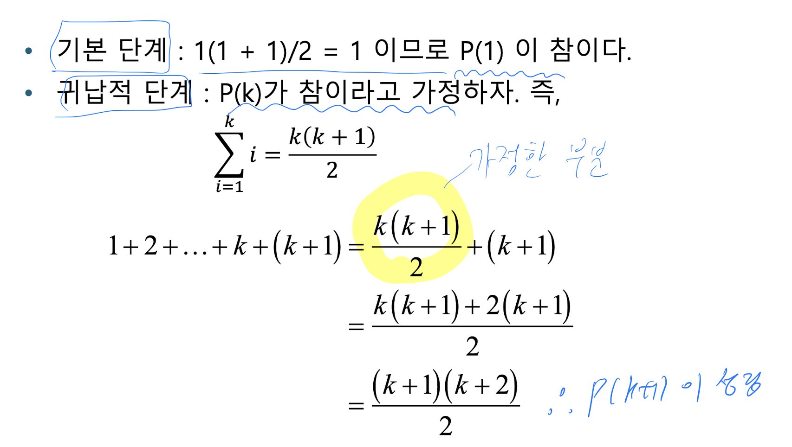
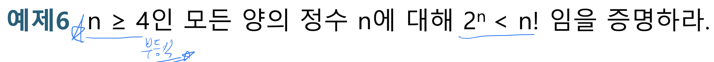
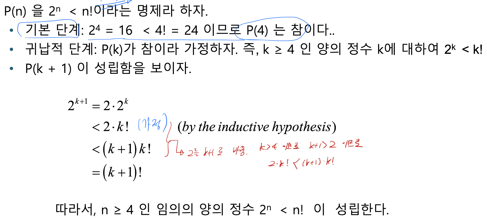
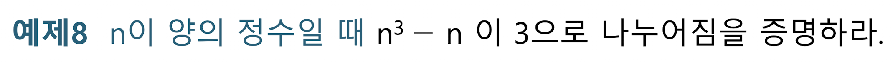
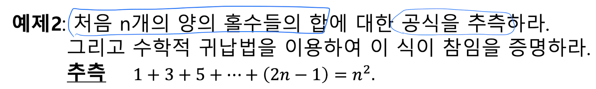
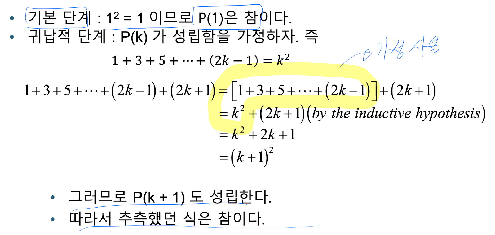

---

### 5.3 - 재귀적 정의와 구조적 귀납법

- 재귀적으로 정의된 함수(순열)

  - 기본 단계: 0에서의 함수 값 명시
  - 귀납 단계: 어떤 정수에서의 함수 값을 그보다 작은 정수들의 함수 값으로부터 구할 수 있는 규칙 제시

- 예제: 계승함수 $n!$의 재귀적 정의를 제시하라.

  - 답: 기본: $f(0) = 1$, 귀납: $f(n) =(n + 1) \times f(n)$

- 예제: $\sum\_{k=0}^n a_k$의 재귀적 정의를 제시하라.

  - 답: 기본: $f(0) = a_0$, 귀납: $f(n+1) = f(n) + a_{k+1}$

- 예제: 정수 집합의 부분 집합인 3의 배수의 집합 $S$의 재귀적 정의를 제시하라.

  - 답: 기본: $3 \in S$, 귀납: $x \in S$이고 $y \in $이면 $x + y \in S$

- 예제: 자연수의 집합 $N$의 재귀적 정의를 제시하라.

  - 답: 기본: $0 \in N$, 귀납: $n \in N$이면 $n + 1 \in N$

- 예제: 하노이의 탑

  - 서로 다른 크기의 원반과 3개의 기둥이 있으며, 처음 원반들은 가장 큰 원반이 아래에 있는 순으로 놓여있다.

    - 규칙 1: 원반을 한 기둥에서 다른 기둥으로 한 번에 하나씩 옮길 수 있다.
    - 규칙 2: 작은 원반 위에 큰 원반을 놓을 수 없다.
    - 목표: 원래 있던 대로 원반을 3번째 기둥으로 옮기는 것.

  - 해답: n개의 원반을 갖는 하노이 탑 문제를 푸는 최소 이동 횟수를 $H(n)$이라 하자.  
    기둥 1에 있는 n개의 원반으로 시작한다.  
    $H(n-1)$ 번의 이동으로 위에 있는 $n-1$개의 원반들을 기둥 3에 옮길 수 있다.  
    그리고 가장 큰 원반을 기둥 2로 이동한다.  
    마지막으로 기둥 3에 있는 $n-1$ 개의 원반들을 모두 $H(n-1)$번의 이동으로 기둥 2로 옮긴다.  
    즉, $H(n) = 2 \times H(n-1) + 1$

  - $H(n) = 2 \times H(n-1) + 1$을 풀어내면 $H(n) = 2^n - 1$ 이다.

---

## 6.1 - 계수의 기본 원리

- 예제: 길이가 7인 서로 다른 비트 문자열은 총 몇 개인가?

  - 답: $2 \times 2 \times \cdots 2 = 2^7$

- 예제: 자동차 번호판이 3개의 영문 대문자와 3개의 숫자로 구성되어 있다면 서로 다른 번호판의 개수는?  
  단, 3개의 영문 대문자가 모두 앞에 위치하고 뒤에 3개의 숫자가 있어야 한다.

  - 답: $26^3 \times 10^3$

- 예제: 원소가 m개인 집합으로부터 원소가 n개인 집합으로의 함수는 몇 개인가?

  - 답: $n^m$

- 예제: 원소가 m개인 집합으로부터 원소가 n개인 집합으로의 단사 함수는 몇 개인가?  
  단사함수 = 일대일 함수

  - 답: $n \times (n-1) \times \cdots \times (n-m+1)$

- 예제: A에 소속된 학생 37명과 B에 소속된 학생 83명이 있다고 해보자. A나 B에서 1명을 대표로 뽑는 가지 수는?

  - 답: $37 + 83 = 120$

- 서로소인 집합 $A, B$에 대해 $|A \cup B| = |A| + |B|$이 성립한다.

- 예제: 변수명이 하나 또는 2개의 영숫자(26개의 영문자 + 10개의 숫자)로 구성되는데, 변수명이 숫자로 시작해야 한다면 서로다른 변수의 개수는?

  - 답: $26 + 26 \times (26 + 10)$

- 두 집합 $A, B$에 대해 $|A \cup B| = |A| + |B| - |A \cap B|$이 성립한다.
- 세 집합 $A, B, C$에 대해 $A \cup B \cup C| = |A| + |B| + |C| - |A \cap B| - |A \cap C| - |B \cap C| + |A \cap B \cap C|$이 성립한다.

- 예제: 1로 시작하거나 00으로 끝나는 8비트 문자열의 경우의 수는?

  - 답: $2^7 + 2^6 - 2^5$

- 예제: 4인용 원형 탁자에 4명의 사람을 앉힐 수 있는 방법의 수는?  
  단, 자신의 왼쪽 옆과 오른쪽 옆에 같은 사람이 앉는 경우는 같은 방법으로 간주한다.

  - 답: 4명을 앉히는건 $4!$, 양옆에 같은 사람이 앉는건 $4$, 따라서 $4! / 4 = 6$

- 예제: 티셔츠가 S, M, L, XL, XXL의 5가지 사이즈로 판매되고 각 사이즈마다 w, r, g, b의 4가지 색이 있는데  
  XL 사이즈는 r, g, b의 3가지 색만 있고 XXL 사이즈는 g, b의 2가지 색만 있다고 하자.  
  가능한 모든 사이즈와 색을 구비하려면 최소한 몇 개의 티셔츠가 필요한가?

  - 답: 4(S) + 4(M) + L(4) + 3(XL) + 2(XXL) = 17

---

## 6.2 - 비둘기집의 원리

### 일반화된 비둘기집 원리

- $N$개의 물체를 $k$개의 상자에 넣을 때, 적어도 하나의 상자에는 $\lceil \frac{N}{k} \rceil$개의 물체가 들어가는 경우가 존재한다.

- 예제: 100명의 사람 중 같은 달에 태어난 사람은 적어도 몇명 있는가?

  - 답: $\lceil \frac{100}{12} \rceil = 9$

- 예제: 52장의 포커 카드에서 적어도 3장은 같은 무늬가 나오기 위해서는 최소 몇 장의 카드를 선택해야 하는가?

  - 답: $\lceil \frac{n}{4} \rceil \ge 3$ 인 최소 $n = 9$ .  
    이때 4는 무늬의 개수.

- 예제: 52장의 포커 카드에서 적어도 3장의 하트 무늬가 선택되기 위해서는 최소 몇 장의 카드를 선택해야 하는가?

  - 답: $13 \times 3 + 3 = 42$, $13 \times 3$의 3은 하트가 아닌 무늬의 개수. 더한 3은 3개의 하트 무늬 카드.  
    이렇게 정 안되는 최악의 개수 + 원하는 값을 해도 된다.

---

## 6.3 - 순열과 조합

### 순열

- 순열: 서로 다른 원소들의 집합에서 이 원소들의 **순서적인 배열**
- r-순열: 집합에서 **r 개의 일부 원소를 순서있게 배열** 하는 것
- $P(n, r)$ : n개의 원소로 이뤄진 집합에서의 r-순열 개수
- $P(n, r) = nPr = $n(n-1)(n-2) \cdots (n-r+1)$ = $\frac{n!}{(n-r)!}$

- 예제: 100명 중 1, 2, 3등을 봅는 경우의 수는?

  - 답: 100P3 = 100 \times 99 \times 98 = 970,200

- 예제: 외판원이 8개의 도시를 방문해야 한다. 특정한 도시에서 출발해 나머지 7개의 도시는 원하는 순서대로 방문할 수 있다.  
  이 외판원이 8개 도시를 방문하는 경우의 수는?

  - 답: 7P7 = 7! = 5,040

- 예제: ABCDEFGH의 순열 중 ABC 문자열을 포함하는 것들의 개수는?

  - 답: 6P6 = 6! = 720 (ABC를 1개로 취급)

### 조합

- r-조합: 어떤 집합에서 r개의 원소를 **순서 없이 선택하는** 경우의 수
- $C(n, r)$ 또는 $nCr$ : n개의 원소로 이뤄진 집합에서의 r-조합 개수
- $nCr = \frac{n!}{r!(n-r)!}$

- 예제: 52장의 포커 카드로부터 5장의 카드를 갖는 방법의 수는?

  - 답: 52C5 = $\frac{52!}{5!47!}$

- 예제: 10명 중 5명을 뽑는 경우의 수는?

  - 답: 10C5 = $\frac{10!}{5!5!}$

- 예제: A에 9명, B에 11명이 있을 때 A 3명, B 4명을 뽑는 경우의 수는?

  - 답: $9C3 \times 11C4$

---

## 6.4 - 이항계수와 항등식

### 이항정리

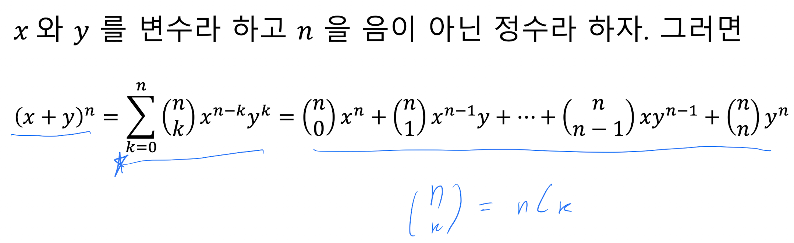

- 예제: $(2x - 3y)^{25}$의 전개에서 $x^{12}y^{13}$의 계수는?

  - 답: k = 13, $25C13 \times 2^{12} \times (-3)^{13}$

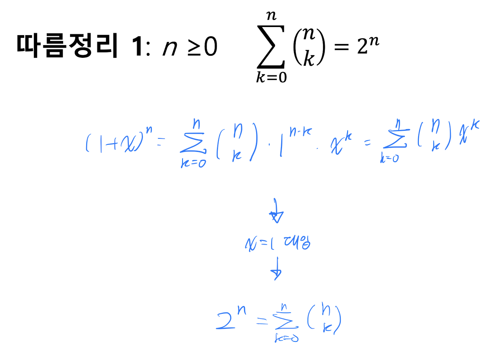

### 파스칼 항등식

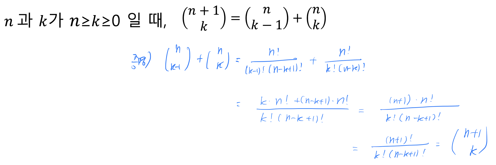

### 방데르몬드 항등식

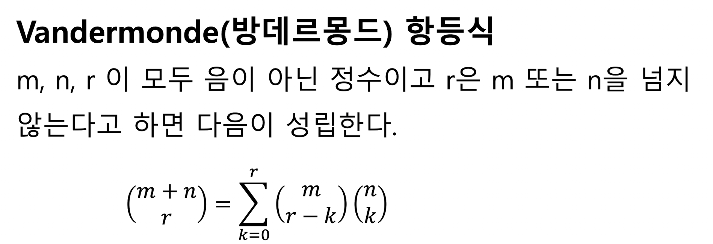
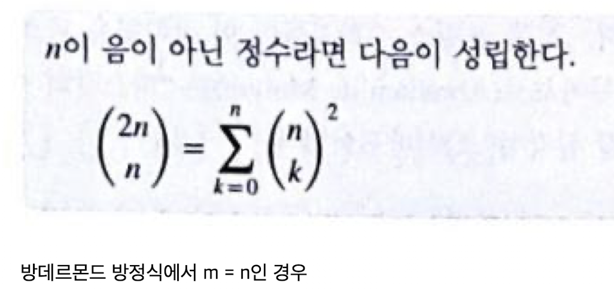
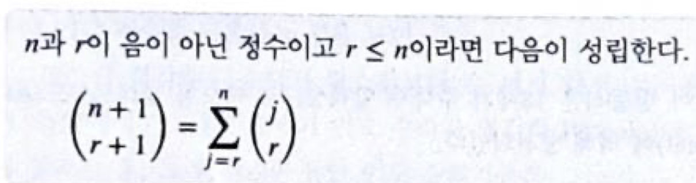

---

## 6.5 - 일반화된 수열과 조합

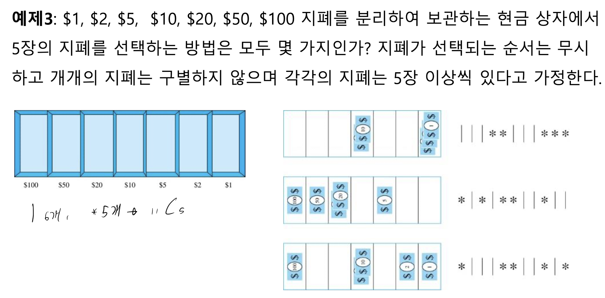

### 중복 조합

- 원소의 중복을 허용할 경우 n개의 원소의 집합에서 가능한 r-조합의 개수는 $H(n, r) = C(n + r - 1, r)$ 이다.

- 예제: 4가지 과자 중 6개를 선택하는 방법은?

  - 답: $H(4, 6) = C(4 + 6 - 1, 6) = C(9, 6) = 84$

- $x_1, x_2, x_3$가 있고 이들이 음이 아닌 정수일 때 $x_1 + x_2 + x_3 = 11$의 해는 모두 몇 가지인가?

  - 답: $H(3, 11) = C(13,11)$

- $x_1, x_2, x_3$이 있고 이들이 양의 정수일 때 $x_1 + x_2 + x_3 = 11$의 해는 모두 몇 가지인가?

  - 답: $H(3, 8) = C(10, 8)$

---

## 7.1 - 이산 확률의 도입

### 사건의 확률

- 실험: 일어날 수 있는 결과의 집합을 발생시키는 과정
- 표본 공간: 일어날 수 있는 결과들의 집합
- 사건: 표본 공간의 부분 집합

- 사건의 확률: **동일한 비율**로 발생할 수 있는 결과의 유한한 공집합이 아닌 표본공간 S와 S의 부분집합인 사건 E에 대해  
  E의 확률은 $p(E) = |E|/|S|$ 이다.

- 예제: 파란공 4개, 빨간공 5개. 1개 뽑았을 때 파란공일 확률은?

  - 답: $|S| = 9, |E| = 4$ 이므로 $p(E) = \frac{4}{9}$

- 예제: 1~45까지 자연수 중 6개 골라 다른 수와 모두 맞출 확률은?

  - 답: 45C6

### 여사건과 합사건의 확률

- E가 표본공간 S에서의 사건일 때, E의 여사건 $E^c$는 S에서의 사건이고 $E^c = S - E$이다.  
  즉 $p(E^c) = 1 - p(E)$이다.

- 예제: 임의로 생성된 10개 비트로 구성된 비트열에서 적어도 한 비트가 0일 확률은?

  - $p(E^c) = \frac{1}{2^{10}}$ 이므로 $p(E) = 1 - \frac{1}{2^{10}}$

- 예제: 1~100까지 자연수 중 임의로 선택된 수가 2의 배수거나 5의 배수일 확률은?

  - E: 2의 배수, $p(E) = \frac{50}{100}$ .  
    F: 5의 배수, $p(F) = \frac{20}{100}$ .  
    따라서 $p(E \cup F) = p(E) + p(F) - p(E \cap F) = \frac{50}{100} + \frac{20}{100} - \frac{10}{100} = \frac{60}{100}$

---

## 7.2 - 확률론

- 예제: 동전을 던졌을 때 앞면이 나오는 경우 H, 뒷면이 나오는 경우 T가 있다.  
  이때 동전이 특이해서 앞면이 뒷면보다 2배 더 많이 나오면 각 경우에 대한 확률은?

  - 답: $P(H) = 2 \times P(T), P(H) + P(T) = 1$, 따라서 $P(H) = \frac{2}{3}, P(T) = \frac{1}{3}$

- 예제: 주사위가 3이 다른 수보다 2배 더 많이 나오고 3이 아닌 수는 모두 같은 비율로 나온다면 주사위 던졌을 때 홀수가 나올 확률은?

  - $P(3) = 2 \times P(x), x = 1,2,4,5,6$ .  
    $P(3) = 2 \times a, P(x) = a$ => $a = \frac{1}{7}$ .  
    따라서 홀수는 $P(1) + P(3) + P(5) = \frac{1}{7} + \frac{2}{7} + \frac{1}{7} = \frac{4}{7}$

### 조건부 확률

- E, F가 사건이고 $p(F) \gt 0$ 이라 해보자.  
  F를 전제로 한 E의 조건부확률 $p(E|F)$ 는 $p(E|F) = \frac{p(E \cap F)}{p(F)}$ 이다.

- 예제: 자녀가 둘인 가정에서 적어도 한 명은 아들이라 할 때, 둘 다 아들일 조건부 확률은 얼마인가?  
  아들을 B, 딸을 G로 나타내면 BB, BG, GB, GG의 각 경우에 대한 확률은 동일하다고 가정한다.

  - 답: F를 "적어도 1명이 아들", E를 "둘 다 아들" 이라고 하면 |F| = BB, BF, GB로 3이고 $|E \cap F| = BB = 1$ 이다.  
    따라서 $p(E|F) = \frac{1}{3}$

### 독립 사건

- 사건 E, F가 독립이면 $p(E \cap F) = p(E) \times p(F)$ 이다.

- 예제: 임의로 생성된 길이가 4인 비트열이 1로 시작하는 사건을 E, 이 비트열에 짝수 개의 1이 들어있는 사건을 F라 하자.  
  길이가 4인 비트열이 서로 다른 16가지의 경우가 일어날 가능성이 모두 같다면, E와 F는 독립인가?

  - 답: p(E) = 8/16 = 1/2이고 |F| = 1 + C(4,2) + 1 = 8로 p(F) = 1/2이다.  
    $|E \cap F| = 4$이므로 $p(E \cap F) = p(E) \times p(F)$ 를 만족하므로 독립이다.

---

## 7.3 - 베이즈 정리

- 베이즈 정리

  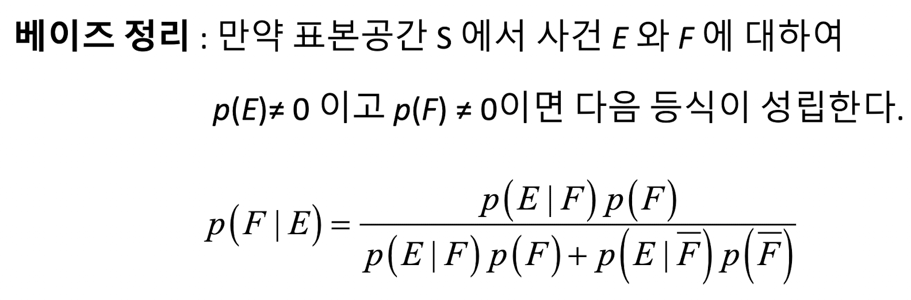

- 예제: 첫 번째 상자에는 파란공 2개, 빨간공 7개가, 두 번째 상자에는 파란공 4개, 빨간공 3개가 있다고 해보자.  
  먼저 2개 상자 중 하나를 임의로 선택한 다음, 그 다음 상자에서 공을 하나 꺼낸다고 해보자.  
  빨간공이 나왔을 때 첫 번째 상자를 선택했을 확률은?

  - 답: E를 빨간 공을 꺼낸 사건, F를 첫 번째 상자를 선택한 사건이라 해보자.  
    베이즈 정리에 의해 $p(F|E) = \frac{p(E|F) \times p(F)}{p(E|F) \times p(F) + p(E|F^c) \times p(F^c)}$ 이다.  
    이는 곧 $p(F|E) = \frac{7/9 \times 1/2}{7/9 \times 1/2 + 3/7 \times 1/2} = \frac{49}{76}$ 이다.

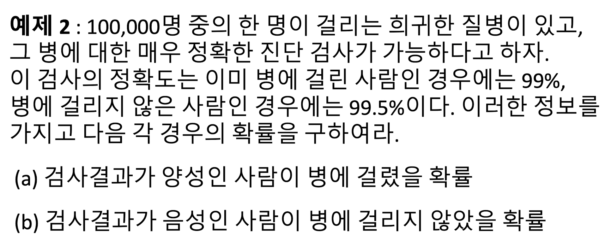
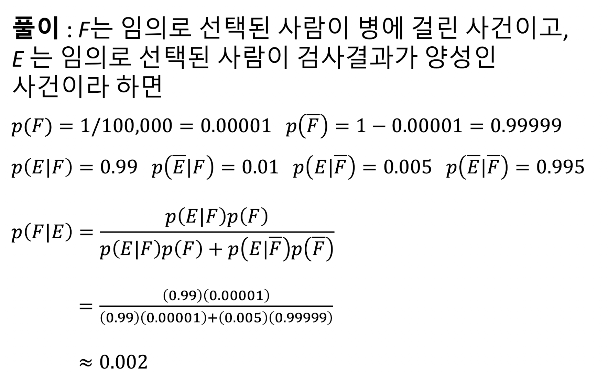
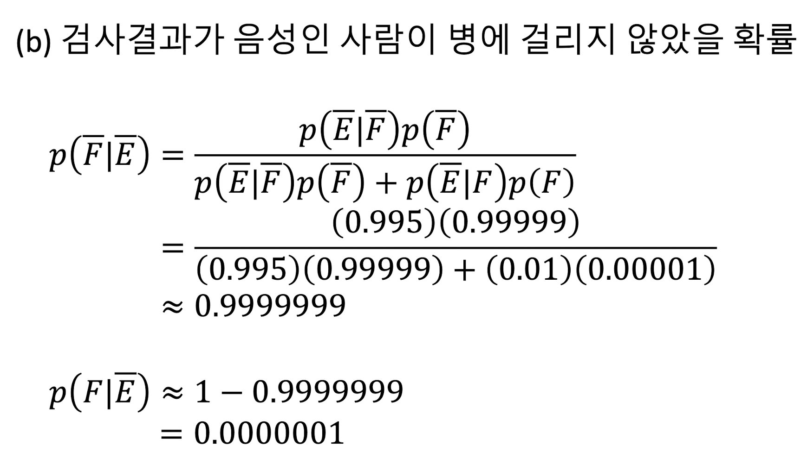

---

## 8.5, 8.6 - 포함, 배제

- 전사함수: 치역과 공역이 같은 함수. n개->n개의 전사함수 개수는 $n^2$개이다.

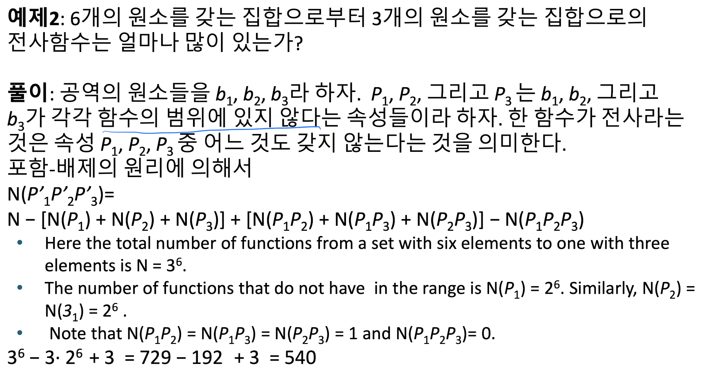
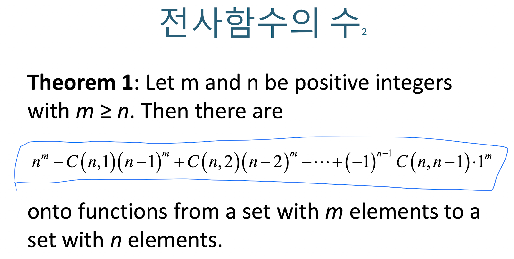

### 교란(derangements)

- 교란: 그 어떤 것도 원래 위치에 있지 않은 객체들의 순열  
  ex) 순열 21453은 12345의 교란이다. 반면 21543은 교란이 아니다.

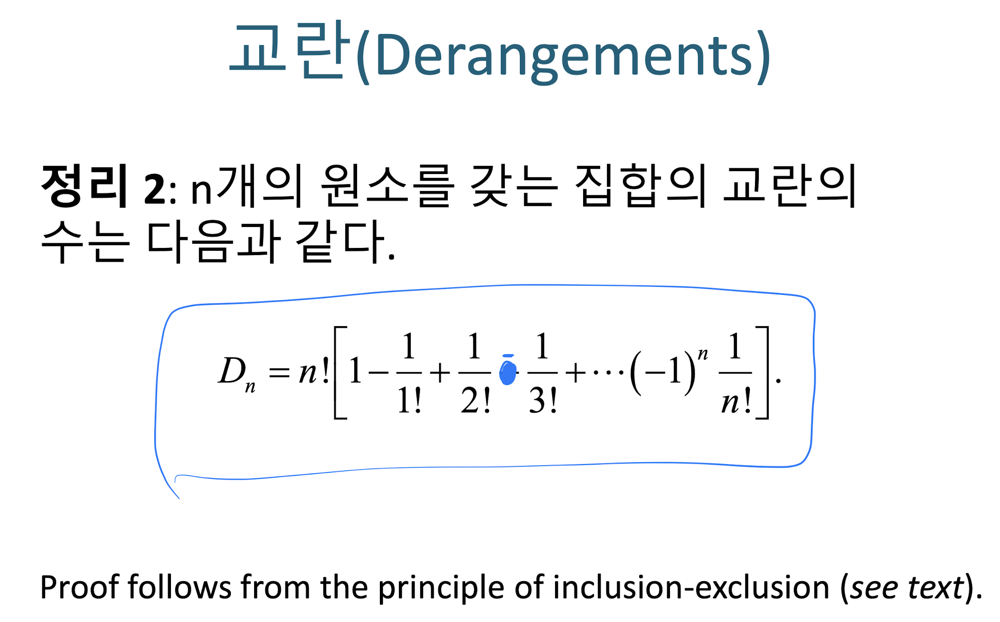

---

## 9.1 - 관계와 그 특성

### 이항 관계(binary relations)

- 집합 A에서 집합 B로의 이항 관계 R은 $A \times B$의 부분집합이다.

  - $R \subseteq A \times B$

- 예제: 집합 A에 대한 관계 R은 $A \times A$ 또는 A에서 A로의 관계이다.

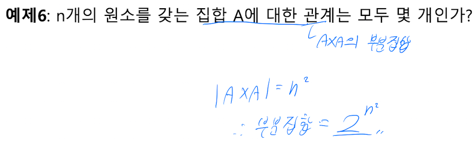

### 반사적 관계(Reflective relations)

- 모든 원소 $a \subseteq A$ 에 대해 $(a, a) \subseteq R$ 이면 **반사적** 이라고 한다.

  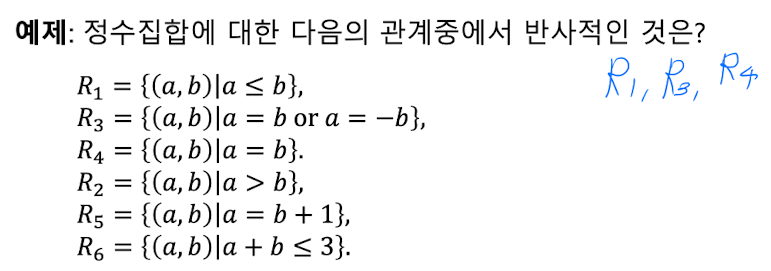

### 대칭적 관계(Symmetric relations)

- 모든 $a, b \subseteq A$ 에 대해 $(a, b) \subseteq R$ 이고 $(b, a) \subseteq R$ 이면 **대칭적** 이라고 한다.

  

- 모든 $a, b \subseteq A$ 에 대해 $(a, b) \subseteq R$ 이고 $(b, a) \subseteq R$ 이면 $a = b$ 일때  
  **반대칭적(antisymmetric)** 이라고 한다.

  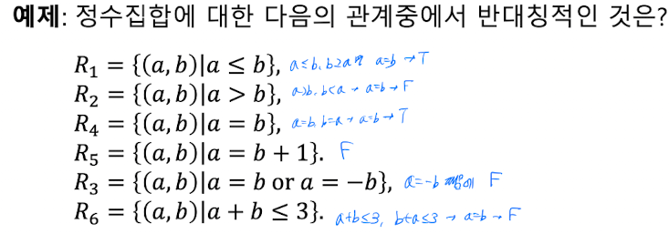

### 전이적 관계(Tansitive relations)

- 모든 $a, b, c \subseteq A$ 에 대해 $(a, b) \subseteq R$ 이고 $(b, c) \subseteq R$ 이면 $(a, c) \subseteq R$ 이면  
  **전이적** 이라고 한다.

  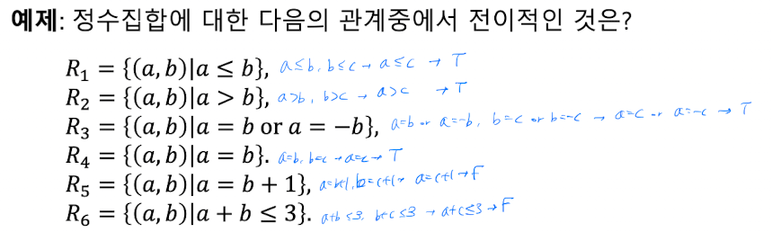

### 관계의 합성

- $R_1$: 집합 A에서 집합 B로의 관계
- $R_2$: 집합 B에서 집합 C로의 관계
- $R_1, R_2$ 의 합성 $R_1 \circ R_2$ 는 집합 A에서 집합 C로의 관계이다.  
  즉, $(a, b) \subseteq R, (b, c) \subseteq R$ 이면 $(a, c) \subseteq R_2 \circ R_1$ 이다.

  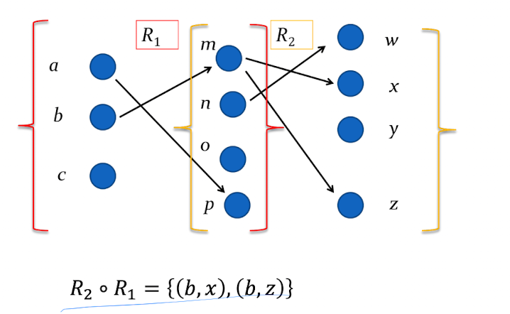

### 관계의 거듭제곱

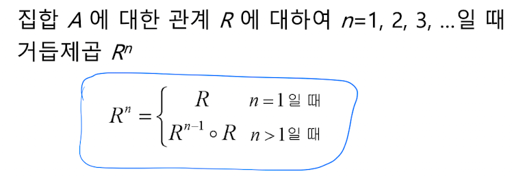

---

## 9.3 - 관계의 표현

### 행렬을 이용한 관계의 표현

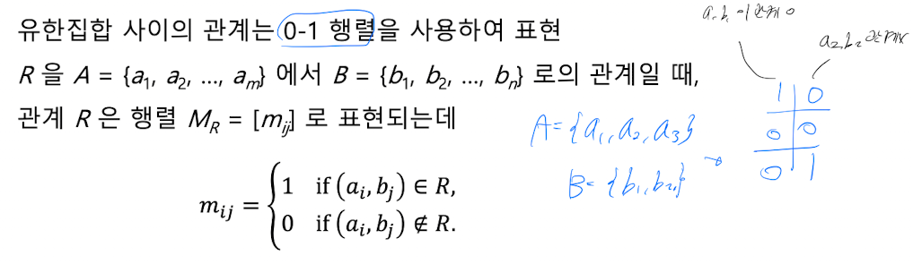
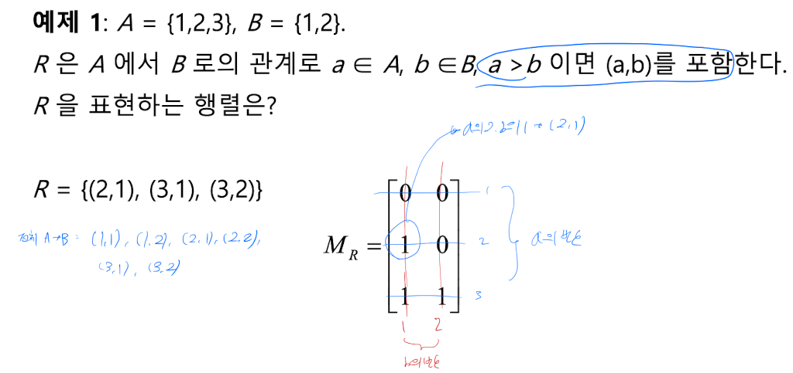
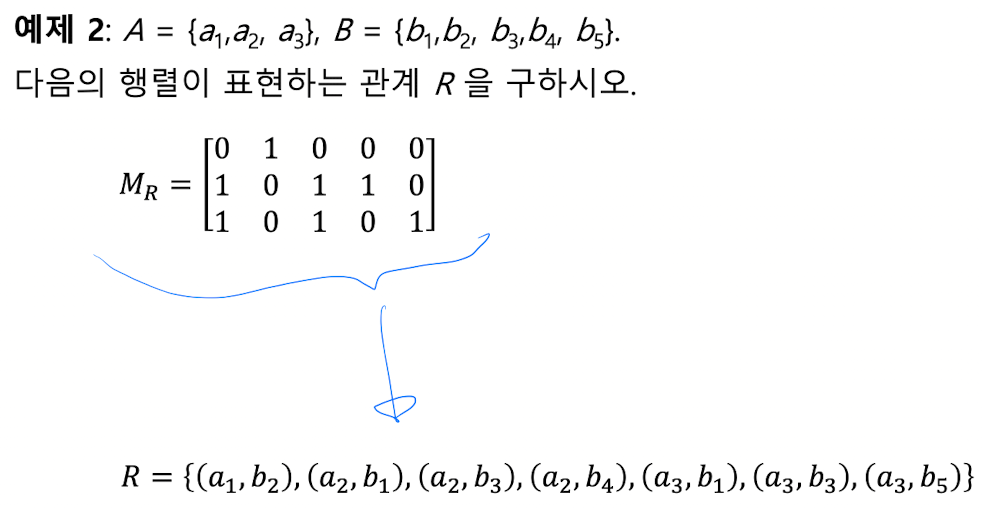

### 집합에 대한 관계의 행렬

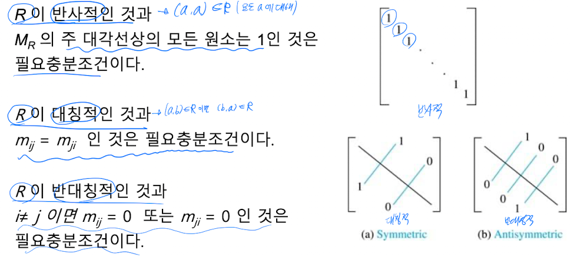
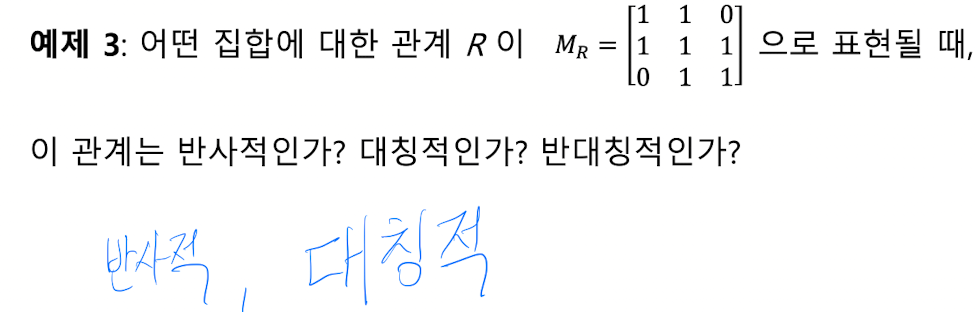

### 방향성 그래프를 이용한 관계의 표현

- 방향성 그래프(directed graph)

  - 꼭지점(vertex)들의 집합 V
  - V의 순서쌍의 집합인 모서리(edge) E로 구성
  - 꼭지점 a는 모서리 (a,b)의 시작점, 꼭지점 b는 끝점
  - (a,a) 형태의 모서리를 loop라 한다.

  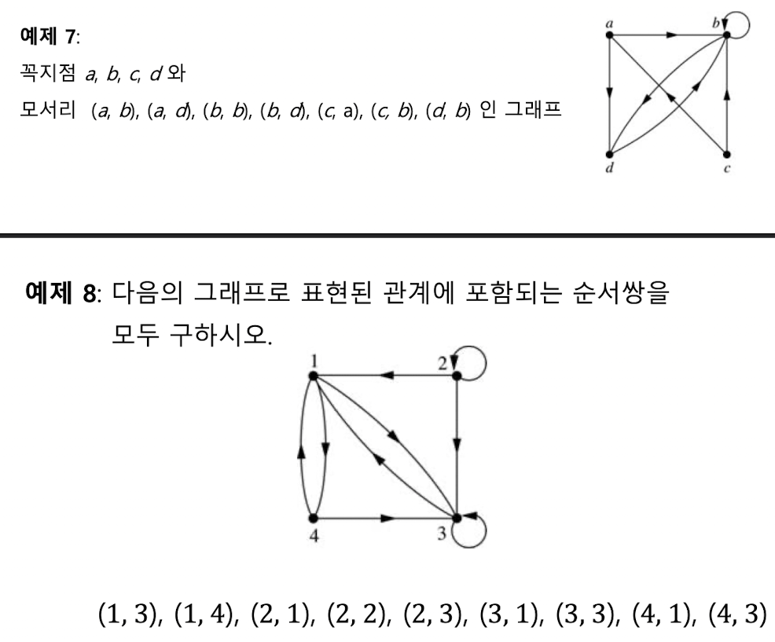

### 방향성 그래프를 통한 관계의 성질

- 반사적(reflective): 각 꼭지점에 loop가 있다.
- 대칭적(symmetric): (x,y)가 모서리면 (y,x)도 모서리이다.
- 반대칭적(antisymmetric): 서로 다른 두 꼭지점 사이에 방향이 반대인 두 모서리가 모두 존재하는 경우가 없다.
- 전이적(transitive): (x,y), (y,z)가 모서리면 (x,z)도 모서리이다.

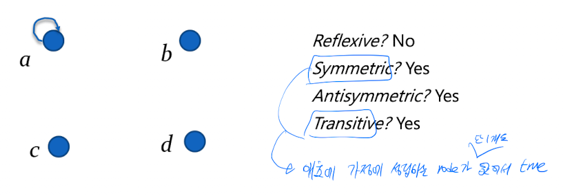
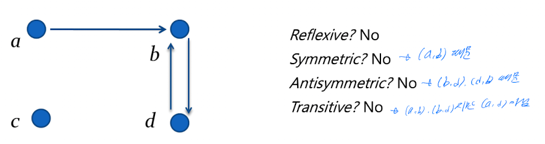
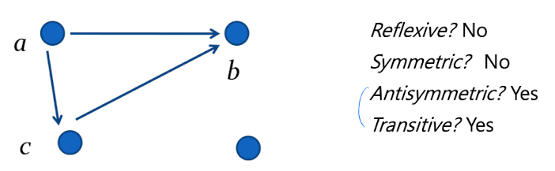
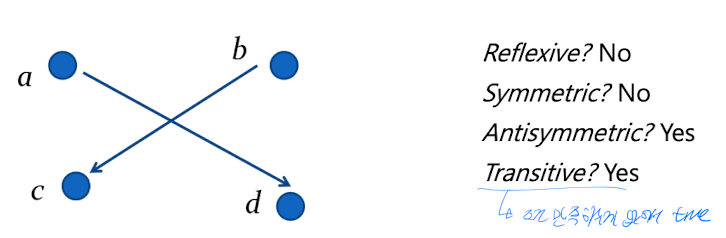

---
