# Network Security

## (1)

### 정보 보안 목표(CIA - Confidentiality, Integrity, Availability)

- Confidentiality(기밀성): 의도하지 않은 자원의 **노출** 방지
- Integrity(무결성): 의도하지 않은 자원의 **변경** 방지
- Availability(가용성): 원래 의도된 자원의 이용 범위 유지

  - 접근 권한이 없는 자의 접근 방지 등

- 인증(Authenticity):

  - 신원 인증(그 사람이 맞는지)
  - 메시지 인증(그 사람이 보낸 메시지인지)

- 책임(Accountability)

  - 부인 봉쇄
  - 법적 조치 등

- OSI 보안 구조

  - 보안 공격: 정보의 안전성 침해 행위
  - 보안 메커니즘: 보안 공격을 탐지, 예방, 침해 복구하는 기술 및 절차
  - 보안 서비스: 정보 전송과 데이터 처리 시스템의 보안 강화를 위한 처리 또는 통신 서비스

- 위협: 보안에 침해 및 위해를 가할 수 있는 환경, 능력, 행동 등의 event
- 공격: 시스템 보안에 대한 위협을 통한 침해

### 보안 공격

- Passive attack(소극적 공격)
  - 메시지 내용 갈취, 도청 등
  - 트래픽 분석
- Active attack(적극적 공격)
  - 전송 차단, 변조, 위조 등

### 보안 서비스

- 인증: 통신 개체가 그 당사자인지를 확인하는 것
  - 개체 인증, 데이터 출처 인증
- 접근 제어: 자원을 불법적으로 사용하지 못하도록 방지하는 것
- 데이터 무결성
  - 통신: 수신된 데이터와 보낸 것과의 일치성 확인
  - 저장: 저장된 데이터의 불법적 변경 여부 확인
- 부인 봉쇄: 송수신 사실의 부인 방지

---

## (2)

### 대칭키 암호 개요


- 위처럼 송수신자가 하나의 key를 공유해 사용한다.

- 대칭키 암호 필수 조건

  - 강한 암호화 알고리즘(해독도 어려워야 함)
  - 안전한 key 공유
    - Kerckhoff's principle: 알고리즘은 공개되어도 key가 없으면 해독이 불가해야 한다.
    - **key의 안전한 공유, 배분이 중요!**

- Brufe-force attack(전수 공격): 모든 key를 시도해서 key를 찾는 방법, key 길이가 길수록 소요 시간도 길다.
- Computational security(계산적 안전성)

  - 암호문을 깨는 데 드는 비용 \> 암호화된 정보의 가치
  - 암호문을 깨는 데 소요되는 시간 \> 해당 정보의 수명

- 암호 해독
  - 암호문만 알고 있는 공격
  - 알려진 평문 공격
  - 선택 평문 공격
  - 선택 암호문 공격
  - 선택문 공격

### 대칭 암호 알고리즘

- AES: 각 round에서 대체, 치환을 이용해 data block 전체 처리

  - Substitute bytes(바이드 대체)
  - Shift rows(행 이동)
  - Mix columns(열 섞기)
  - Add round key(round key 더하기)

- Block 크기는 **128bit로 고정**

  - Key길이(128bit, 192bit, 256bit)는 key scheduling에만 영향을 준다.

- 첫 번째 round에만 add round key 수행, 마지막 round에서는 mix columns 수행하지 않는다.

> XOR: XOR, `P`: Plaintext, `C`: Ciphertext, `K`: Key
>
> - `P` XOR `K` = `C`
> - `C` XOR `K` = `P`

### 암호 블록 운용 모드

- EBC(Electric Code Block)

  - 평문을 _b_ bit 크기의 block으로 분해
  - 각 block을 동일한 key로 암호화
  - 단점: 평문의 패턴이 암호문에 그대로 드러난다.

- CBC(Cipher Block Chaining)

  - 같은 평문에서 같은 암호문이 생성되지 않는다. -> 평문으로부터 암호문의 패턴을 분석할 수 없다.
  - Initial vector 사용
  - `P1` XOR `IV` XOR `K` = `C1`, `C1` XOR `P2` XOR `K` = `C2`, ...

  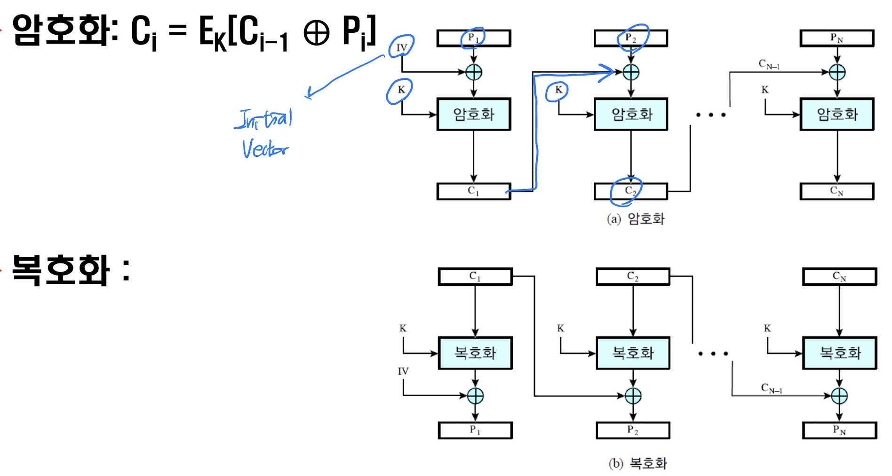

- CFB(Cipher Feedback Mode)

  - 메시지의 크기를 block 크기(16bytes)에 맞추기 위해 padding을 붙여야하는 비효율성 보완
  - 암호화
    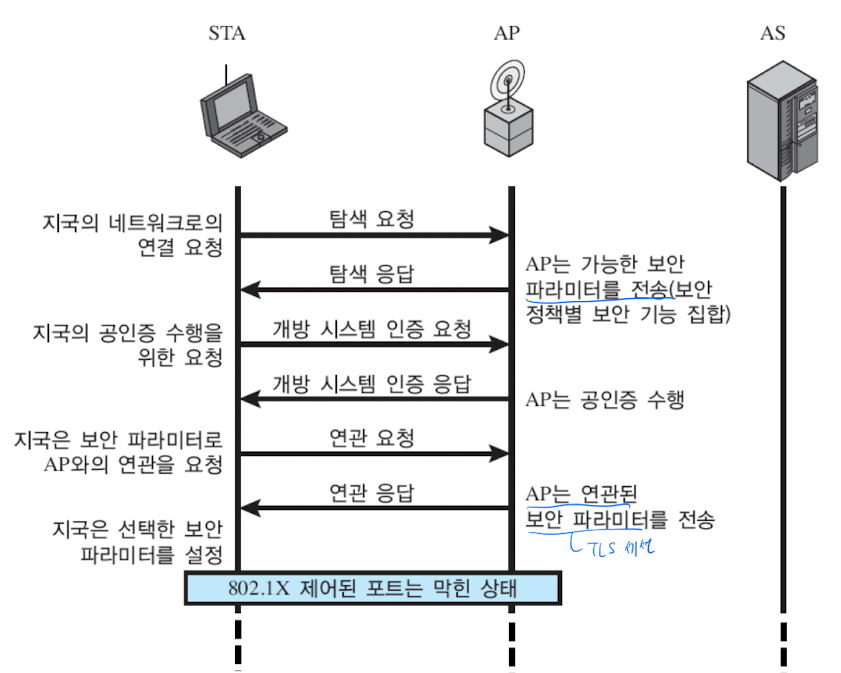
  - 복호화
    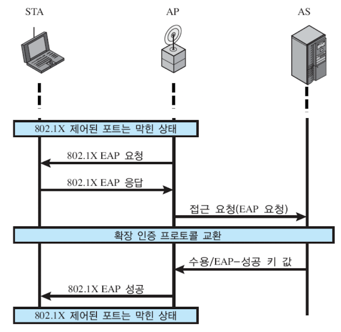
  - 전 단계의 결과물을 다음 단계에 사용하는 chaining으로 구성되어 있어 plaintext가 길다면 소요 시간이 길어짐.  
    이를 해결하기 위해 병렬로 수행할 수 있는 CTR 등이 등장하게 됨.

- CTR(Counter Mode)

  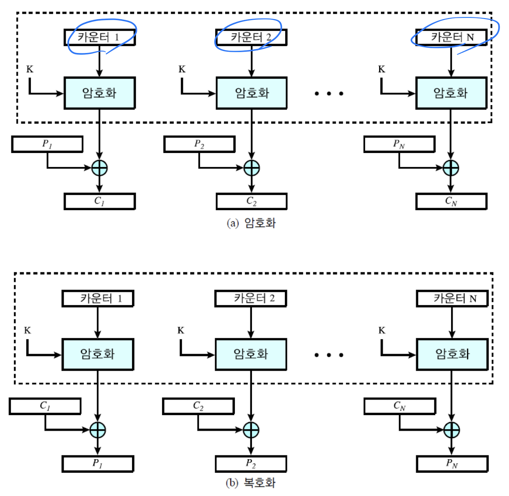

### Stream 암호

- 계속 전송되는 평문의 bit stream과 key stream에서 key를 구해 암호문을 생성한다.

  - Key stream은 사전에 공유하고 있는 secret key로부터 생성된다. 즉 송수신자는 동일한 key stream을 사용한다.

  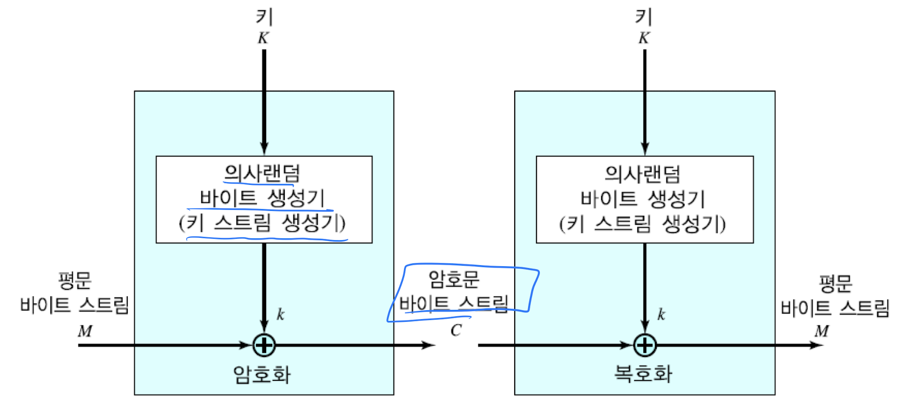

### 난수, 의사 난수

- 난수(random number)

  - 다양한 암호화에 사용
  - key stream 생성 시 사용
  - 임시 session key 생성 등

- 난수의 특성
  - 무작위성: 균등 분포, 독립성
  - 예측 불가능성

---

## (3)

### 메시지 인증

- Source authentication: 진짜 발신자로 표기된 그 사람이 보냈는가?
- Message integritiy: 그 사람이 보낸 메시지 내용이 변조되지 않았는가?

- 대칭 암호를 이용한 메시지 인증

  - Source authentication

    - 송수신자가 동일한 key를 **둘 사이에서만** 공유하고 있다는 전제
    - 오직 진짜 송신자만이 수신자에게 보내는 메시지를 성공적으로 암호화할 수 있다.

    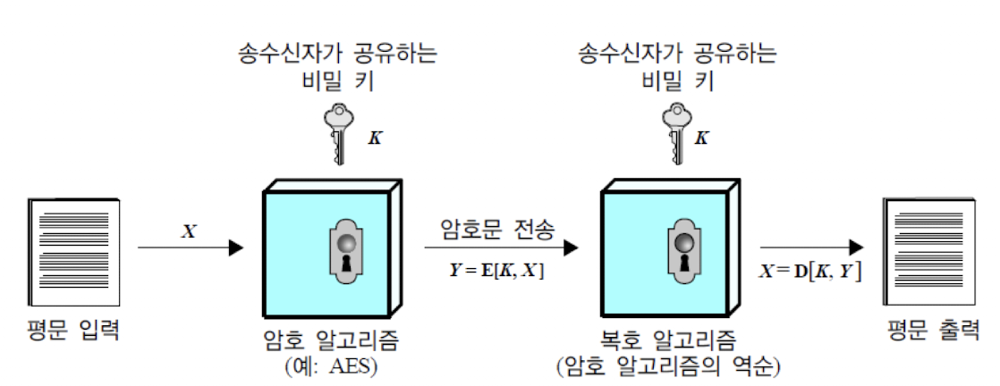

  - Message integrity
    - 암호문 변조 시 제대로된 복호화 불가
    - ECB를 사용하면 1개 block만 교체할 수도 있기에 CBC mode 등을 사용해야 한다.
      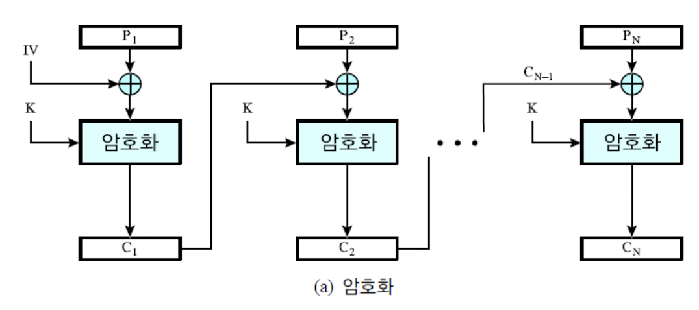

### MAC(Message Authentication Code) - 메시지 인증 코드

- 무결성을 위해 사용
- $MAC_m = F(K_{AB}, M)$

  - $M$: 메시지
  - $F$: 인증 코드 생성 함수
  - $K_{AB}$: A와 B의 공유 키
  - 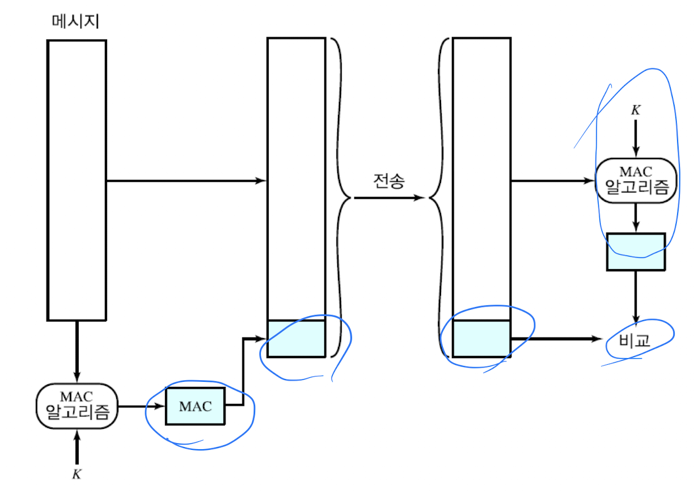

- 일방향 hash 함수
  - hash value = $H(m)$
    - $H()$ : hash function
    - $m$: 메시지
  - **key가 없으므로 source authentication, message integrity 검증 불가**

#### 일방향 hash function으로 MAC 구현하기

- 대칭 암호 사용

  - Hash value를 암호화해 전송

    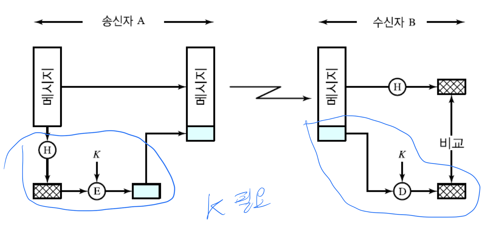

- 공개 키 암호 사용

  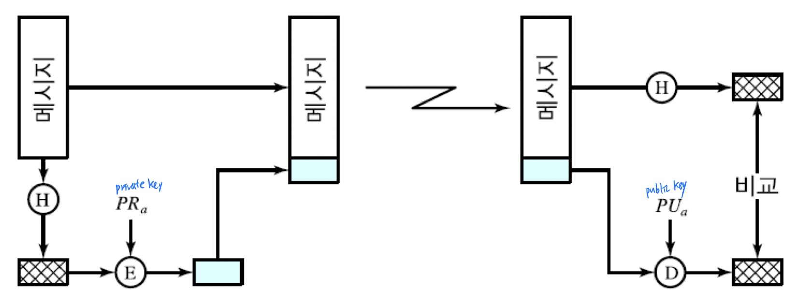

- 비밀값 사용

  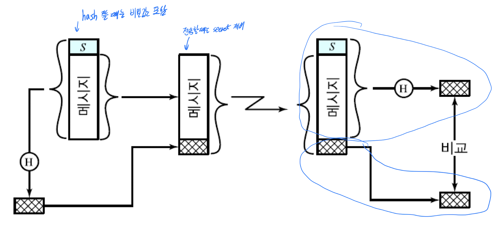

### 안전한 hash function

- 안전한 hash function의 요건

  - (1) 임의 크기의 데이터 블록에 적용 가능
  - (2) 일정한 길이의 출력
  - (3) 계산의 용이성 및 구현 가능성
  - (4) **일방항 성질**
    - $h$에 대해 $H(x) = h$가 성립되는 $x$를 찾아내는 것이 계산적으로 불가능해야 한다.
    - $H()$가 일방향이 아니라면 공격자는 secret key를 찾아낼 수 있다.
  - (5) **약한 충돌 저항성**
    - 주어진 블록 $x$에 대해 $H(x) = H(y)$를 만족하는 $y \ne x$를 찾아 내는 것이 계산적으로 불가능해야 한다.
    - 즉 주어진 메시지의 hash value와 동일한 hash value를 갖는 다른 메시지를 찾을 수 없어야 한다.
  - (6) **강한 충돌 저항성**
    - $H(x) = H(y)$를 만족하는 쌍 (x, y)를 찾는 것이 계산적으로 불가능해야 한다.
    - 즉 동일한 hash value를 내는 서로 다른 2개의 값을 찾을 수 없어야 한다.
    - Collision을 이용한 공격: X, Y를 찾아냈다면 일종의 서명 문서 위조 가능
      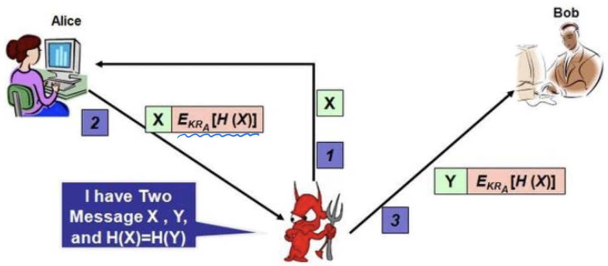

- $n$ bit hash code에 대한 공격 난이도

  - 일방향 성질: $2^n$
  - 약한 충돌 저항성: $2^n$
  - 강한 충돌 저항성: $2^{n/2}$

### SHA: Secure Hash Algorithm

- SHA-256: 입력은 512 bit, 출력은 256 bit
- SHA-512: 입력은 1024 bit, 출력은 512 bit

  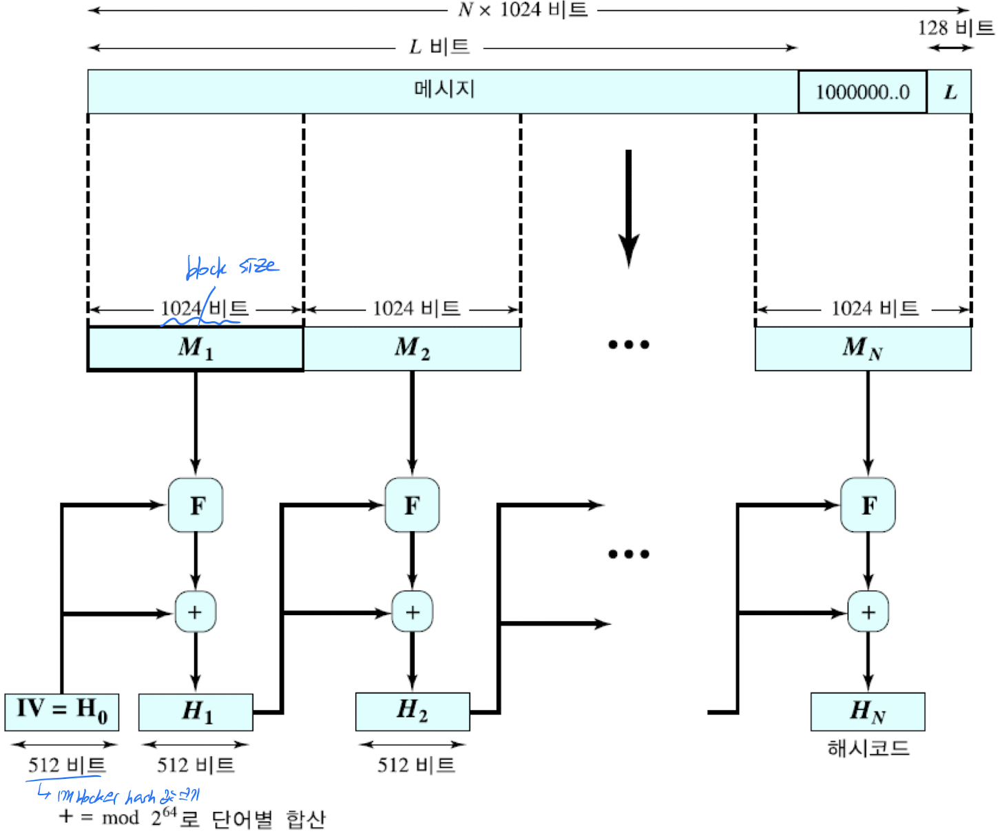

### HMAC

- 암호적 hash code를 이용한 MAC
- $MAC = HMAC(Key, Message)$
- HMAC의 특징(대칭 key 사용 MAC 대비)
  - 빠른 속도
  - 코드 획득의 용이성(암호적 hash function에 대한 코드를 쉽게 구현 가능)
  - 수출 규제 X

---

## (4)

### 공개 키 암호 개념

- plaintext, 암호 알고리즘, public key, private key, 암호문, 그리고 복호 알고리즘으로 구성
- 공개 키로 암호화하는 모습

  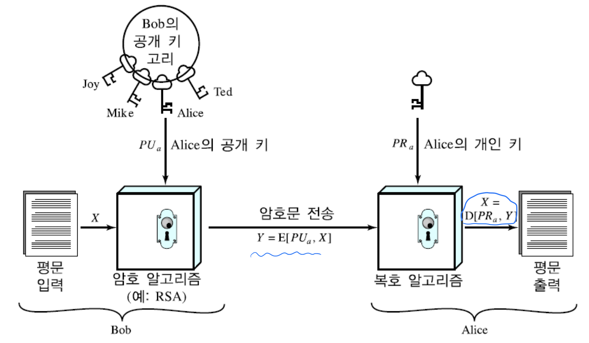

- 개인 키로 암호화하는 모습(누구나 복호화 가능)

  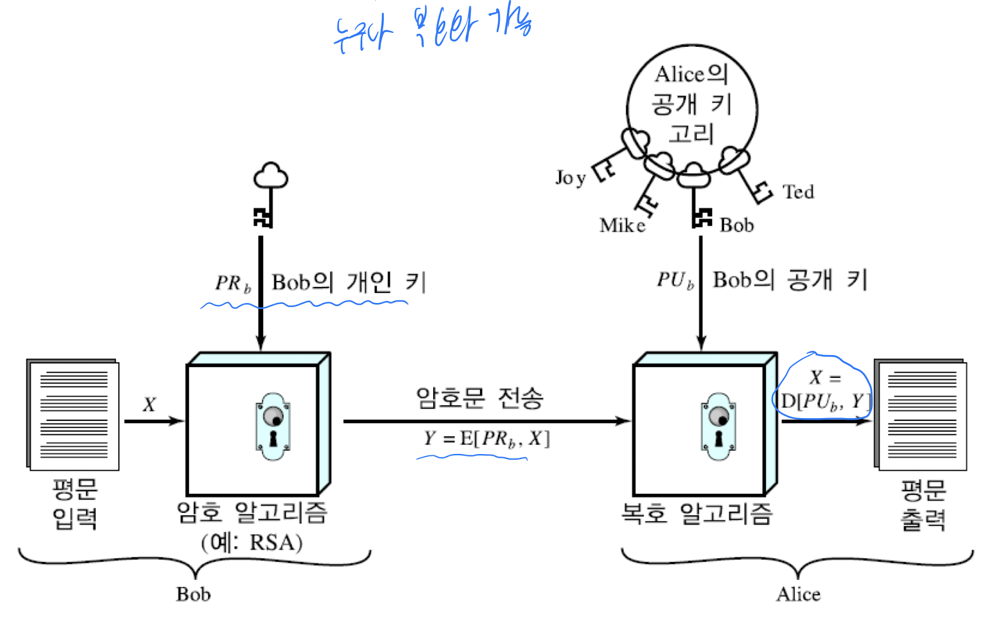

  - 암호화는 자신의 private key로, 복호화는 상대의 public key로 수행

- **암호화** : 수신자의 public key
- **복호화** : 수신자의 private key
  - 발신자의 public key로 암호화하면 누구나 public key로 복호화할 수 있다.
- 수신자의 public key로 복호화가 성공적으로 수행되면 그 사람의 private key로 암호화했음을 알 수 있다.
- **키 교환** : 암호화에 사용될 (대칭)키를 교환하는 과정
  - 키 일치(key agreement): DH(Diffie-Hellman) 알고리즘

### 공개 키 암호 요건

- 사용성

  - (1) B가 한 쌍의 key $(PU_B, PR_B)$를 생성하는 것이 계산적으로 쉬워야 한다.
  - (2) Public key와 평문 $M$을 알고 있는 송신자 A는 암호문을 계산적으로 쉽게 구할 수 있어야 한다.  
    $C = E(PU_B, M)$
  - (3) 수신자 B가 암호문을 자신의 private key를 사용해 복호화하는 것이 계산적으로 쉬워야 한다.  
    $M = D(PR_B, C)$

- 보안성

  - (4) Public key $PU_B$를 알고 있는 공격자가 private key $PR_B$를 계산적으로 구하는 것이 불가능해야 한다.
  - (5) Public key $PU_B$와 암호문 $C$를 알고 있는 공격자가 원문 $M$을 계산적으로 구하는 것이 불가능해야 한다.

- RSA만 만족하는 요건: 2개의 key 중 어느 하나를 암호화에 사용하면, 다른 하나는 복호화에 사용할 수 있다.

  - $M = D[PU_b, E(PR_b, M)] = D[PR_b, E(PU_b, M)]$

### 공개 키 암호 알고리즘

#### RSA 알고리즘

- Public key$(PU)$: `{e, n}`
- Private key$(PR)$: `{d, n}`
- 공개 키로 암호화한다.
  - $C = M^e \mod n$
  - $M = C^d \mod n = (M^e)^d \mod n = M^{ed} \mod n$
- 알고리즘 요건

  - (1) $n$보다 작은 모든 정수 $M$에 대해 $M = M^{ed} \mod n$을 만족하는 값 $e, d, n$을 구할 수 있어야 한다.
  - (2) $n$보다 작은 모든 정수 $M$에 대해 $M^e$와 $C^d$를 구하는 것이 쉬워야 한다.
  - (3) $e, n$이 주어졌을 때 $d$를 구하는 것이 불가능해야 한다.

- 위 `e`, `n`, `d`를 구하기 위해 key 생성 알고리즘을 사용한다.

  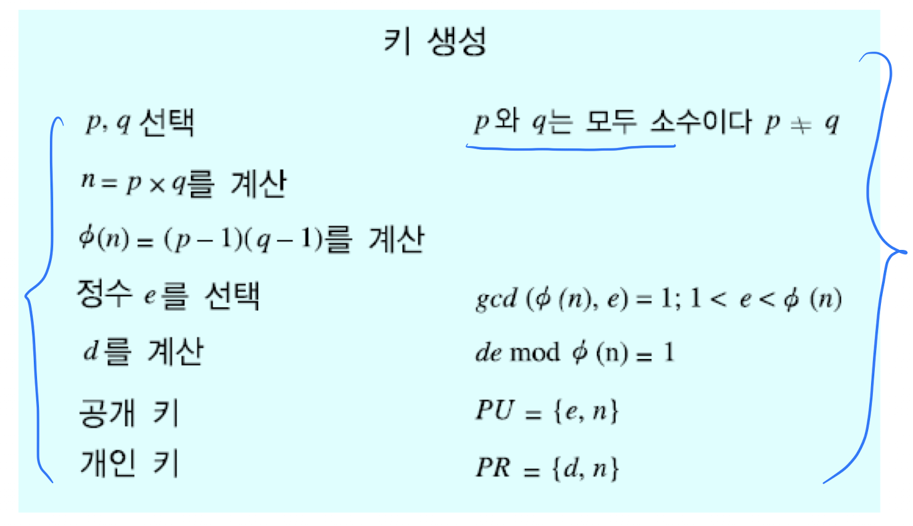

  - example:
    - (1) $p = 17, q = 11$이라 해보자.
    - (2) $n = pq = 17 \times 11 = 187$
    - (3) $\phi(n) = (p-1)(q-1) = 16 \times 10 = 160$
    - (4) $\phi(n)$과 서로소인 수 e를 선택. $e = 7$이라 해보자.
    - (5) $d < 160$이면서 $de \mod 160 = 1$인 수 $d$ 결정 -> $d = 23$이라 해보자.
    - (6) Public key: `{7, 187}`, Private key: `{23, 187}`

- 공격 방법

  - 수학적 공격

    - $n$은 공개되므로 $n$으로부터 $p, q$를 얻으면 공개된 $e$를 이용해 $d$를 쉽게 계산해낼 수 있다.
    - 방어 방법: n을 2048bit 이상의 큰 길이를 갖도록 한다.

  - 타이밍 공격

    - 복호화 알고리즘의 실행 시간, 전력 소모량 등을 관측해 $d$의 길이(값) 추정 => **부채널 공격**
    - 방어 방법: 랜덤으로 지체 시간을 넣는다.
    - **암호 알고리즘은 구현 상의 보안성도 중요하다!**

  - 선택 암호문 공격
    - 데이터 블록을 선택한 후 RSA의 약점을 이용한다.
    - 방어 방법: 평문에 padding 추가 (**최적 비대칭 암호화 padding(OAEP) 활용**)

#### Diffie-Hellman 키 교환

- 키 교환: 두 사용자가 메시지를 암호화하기 위한 대칭 key를 안전하게 교환하는 과정

- 이산대수 문제: $b = a^i \mod p, 0 \le i \le p - 1$에서 $b,a,p$가 주어졌을 때 $i$를 계산적으로 구할 수 없다.

- Diffie-Hellman 과정

  - 두 사용자 A, B가 있다고 하자. 그리고 $q, \alpha$가 주어진다.
  - (1) A는 $X_A < q$를 임의로 선택하고 $Y_A = \alpha^{X_A} \mod q$를 계산한다.
  - (2) B는 $X_B < q$를 임의로 선택하고 $Y_B = \alpha^{X_B} \mod q$를 계산한다.
  - (3) 양 측은 X를 private key로 보관하고 Y를 public key로 공개한다.

  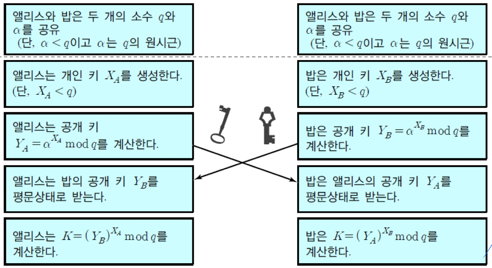

- 이후 A는 $K = (Y_B)^{X_A} \mod q$를 이용해 key를 계산하고, B는 $K = (Y_A)^{X_B} \mod q$를 이용해 key를 계산한다.

  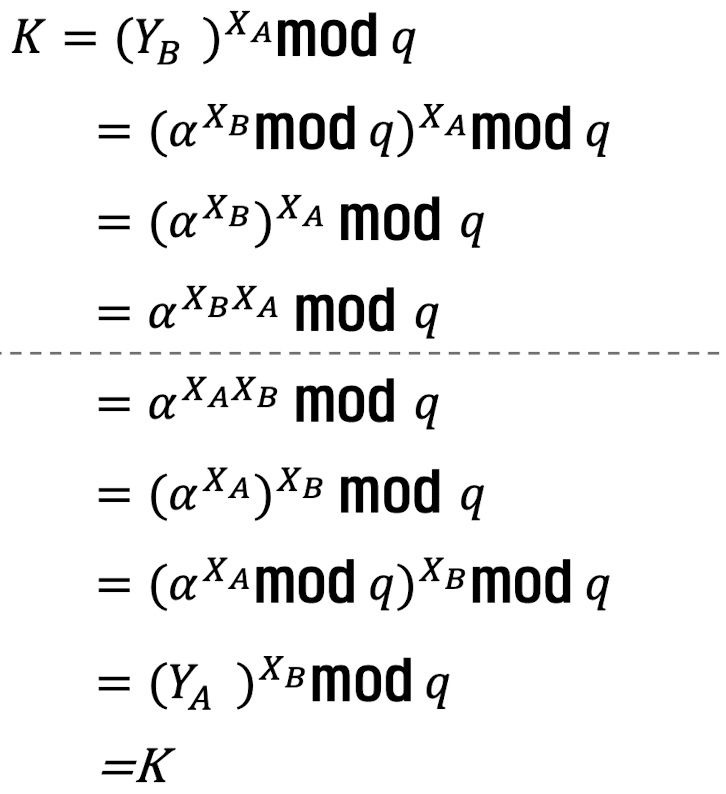

- 예시:

  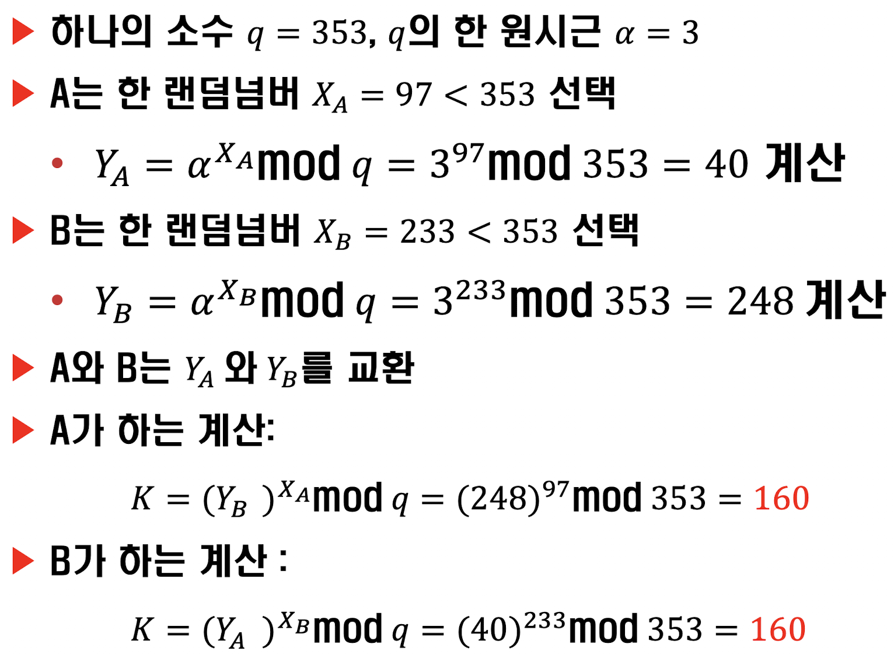

- 중간자 공격(MITM: Man In The Middle)

  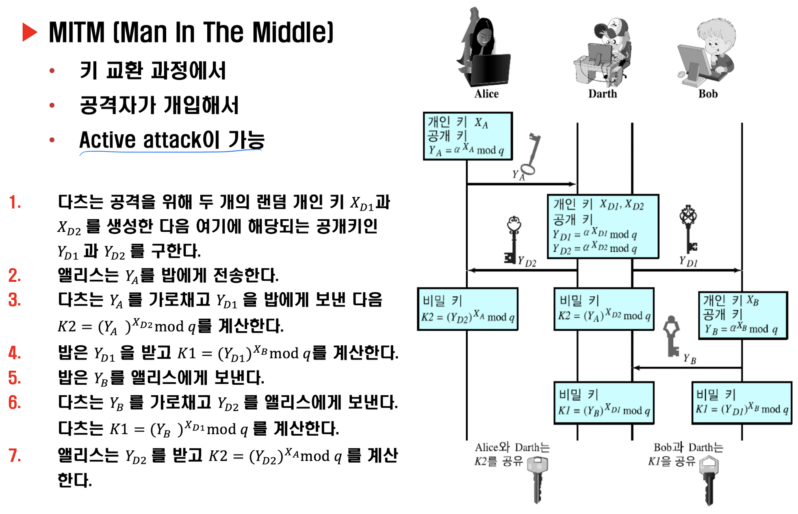
  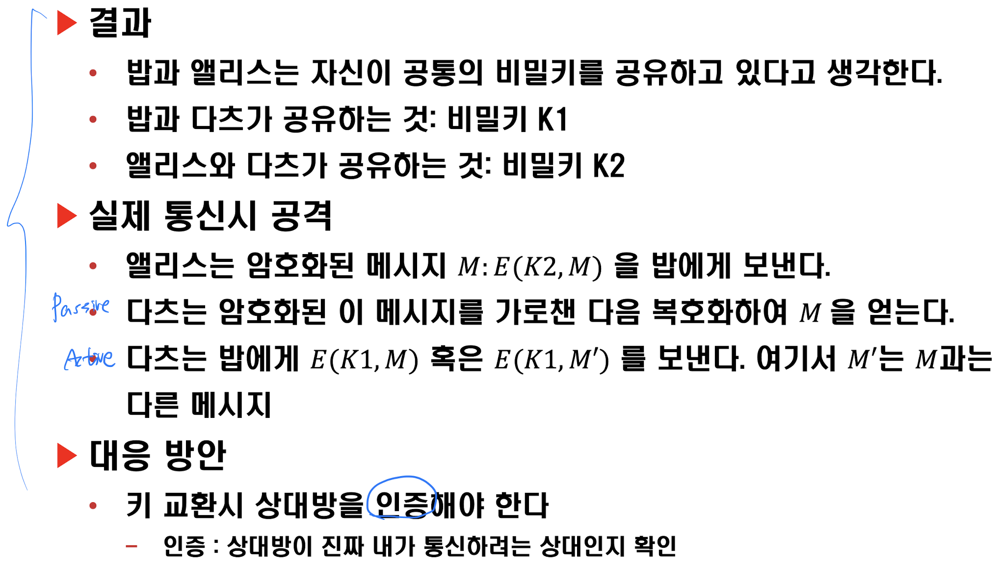

### 디지털 서명

- MAC은 메시지의 무결성, 소스 인증을 위해 사용한다.
- 부인 방지: 송신자가 메시지를 보낸 것을 부인하지 못하도록 하는 메커니즘
  - Secret key를 사용한 MAC(대칭 키 기반)은 송수신자가 이 key를 공유하기에 부인 방지가 불가하다.
- 전자서명: **공개 키 암호를 사용한 MAC**

  - 메시지의 무결성, 소스 인증, 부인 방지 모두 가능

  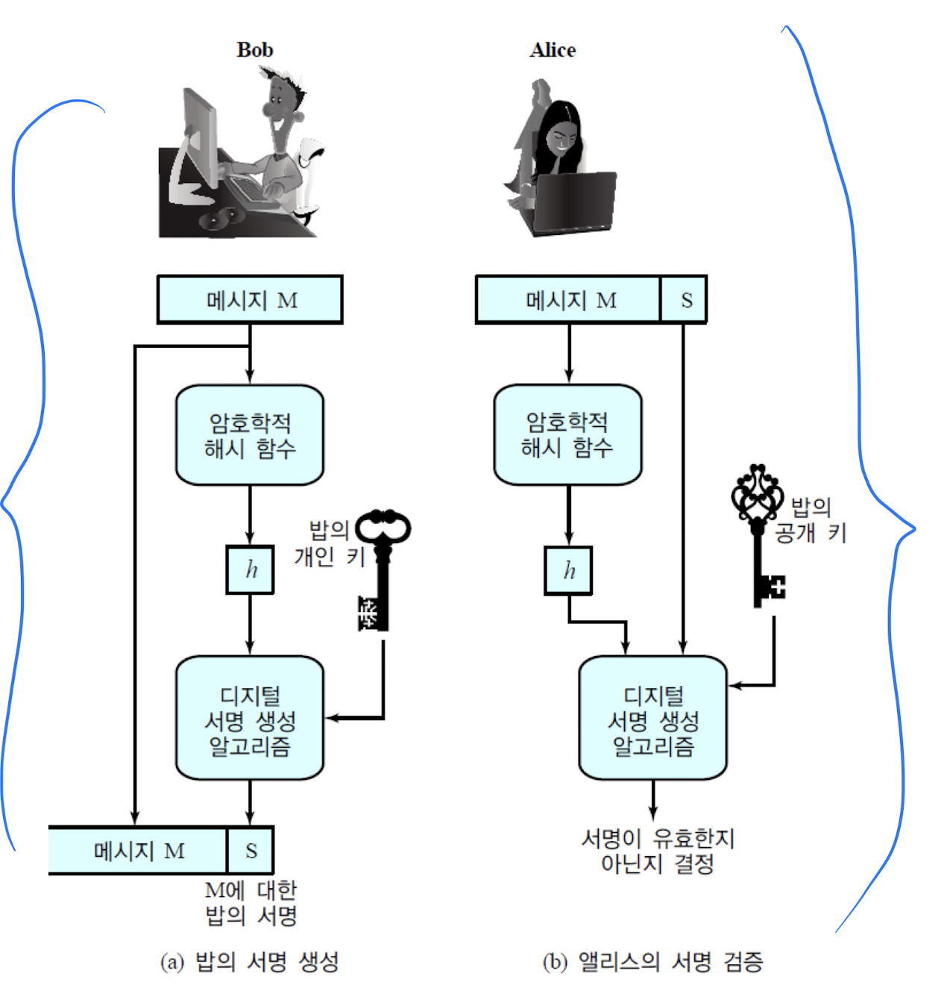

### 기타

- Base64 encoding: text 중 ascii 영역에서 display되는 64개의 문자만을 사용해 encoding한 것.  
  6bit씩 끊어 하나의 문자를 표현한다. 4글자씩 끊어 사용하며, padding은 `=`로 수행한다.

- PEM encoding(Privacy Enhancing Mail): Base64 encoding을 사용해 인증서를 인코딩한 것.

- ASN.1(Abstract Syntax Notation One)

  - IDL(Interface Description Language)
  - serializable, deserializable
  - 통신, 암호 분야에서 많이 사용

  ```asn1
  FooProtocol DEFINITIONS ::= BEGIN

    FooQuestion ::= SEQUENCE {
  trackingNumber INTEGER,
  question IA5String
    }

    FooAnswer ::= SEQUENCE {
  questionNumber INTEGER,
  answer BOOLEAN
    }

    myQuestion FooQuestion ::= {
  trackingNumber 1234,
  question "Anybody there?"
    }
  ```

- DER encoding: ASN.1을 encoding할 때 주로 사용한다.

---

## (5)

### 인증 개념

- B가 A의 id에 대한 확인
- A, B는 사람, 컴퓨터 모두 가능하다.
- 상호 인증

- 인증 단계

  - 식별 단계(identification step)
  - 검증 단계(verfication step)

- 인증 방법

  - 개인이 알고 있는 것: pw, pin 등
  - 개인이 소지하고 있는 것: 스마트 카드, 물리적 키 등, 이를 모두 token이라 한다.
  - 개인 자체: 지문, 망막 등
  - 개인이 수행하는 것: 음성 패턴, 타이핑 리듬 등

- 인증 구분

  - Standalone 컴퓨터에서 인증(단말 앞에서 인증)

    - 생체 인증(사진 공격 등 방지), PW 인증(cracking, guessing 방지)

  - 네트워크 상의 원격 인증
    - 네트워크 공격에 대응해야 한다.(도청, replay, 위조 변조 등)

### 단순한 인증

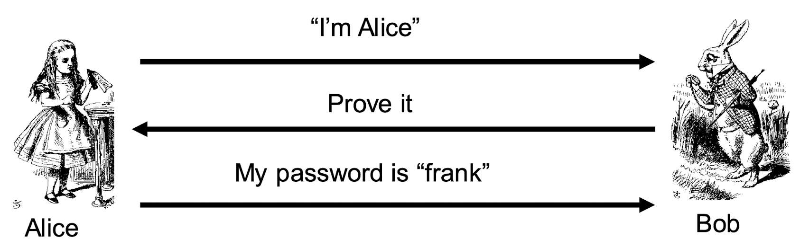

- Standalone에서는 문제 없다.
- Bob은 사전에 등록된 Alice의 pw를 갖고 있어야 한다(**인증은 본인 확인과 별개!!**)
- 네트워크 인증에는 불충분 => **Replay attack 가능!**
  - Alice, Bob 사이에 Trudy가 등장해 Bob에게 Alice의 pw를 말해 인증할 수 있다.

### pw 보호

- pw 대신 hash 값을 사용한다.
  - pw 보호는 가능하지만 replay attack은 여전히 가능하다.

### Challenge - Response

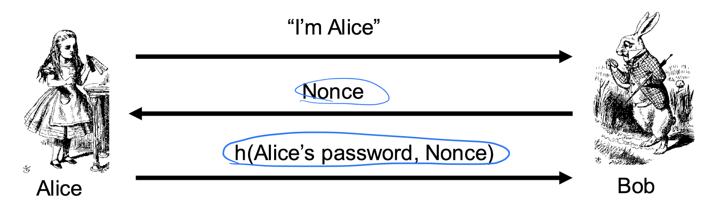

- Challenge로 Nonce(number once, random number)를 전달한다.
- pw, nonce를 모두 hash해 전달한다.
- Replay attack을 방지할 수 있다! (nonce가 매번 다르기 때문)

### 대칭 키 활용 인증

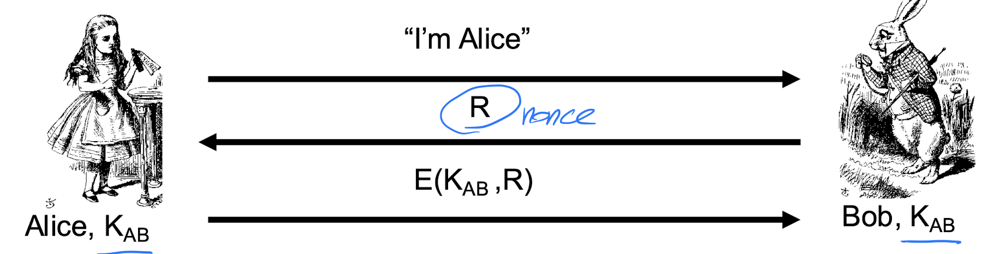

- R은 nonce, $K_{AB}$는 대칭 key로 사전에 공유하고 있다.
- Replay attack을 방지할 수 있다!

### 상호 인증 - 서로를 인증한다.


- 위처럼 하면 Alice는 Bob을 인증할 수 있지만 Bob은 Alice를 인증할 수 없다.
- 3번 과정은 replay일 수 있지만 의미가 없다.

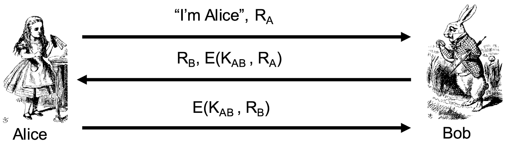

- 이렇게 하면 Replay attack은 불가능하지만 아래와 같이 공격이 가능하다.

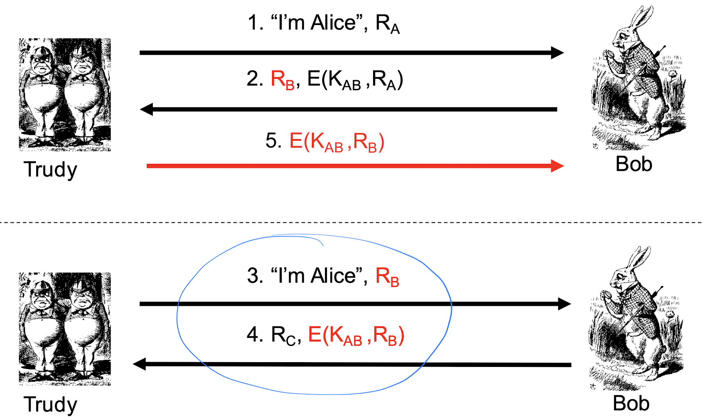

- 즉 Trudy(제3자)가 마치 Alice인 것처럼 Bob에게 인증을 받을 수 있다.  
  아래처럼 누가 encryption을 진행했는지를 넣어 encryption을 진행하면 위 공격을 막을 수 있다.

  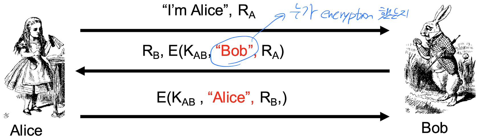

### 공개 키 notation

- Alice의 public key로 암호화: { $M_{Alice}$ }
- Alice의 private key로 암호화: { $[M]_{Alice}$ }

### 공개 키 활용 인증

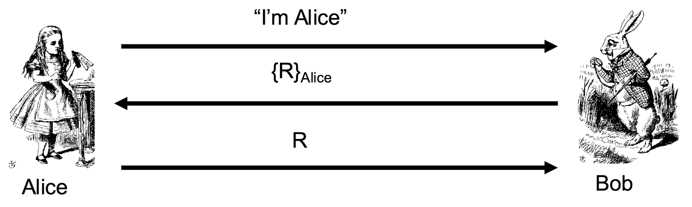

- 위 인증 방법은 아래와 같은 공격 때문에 안전하지 않다.

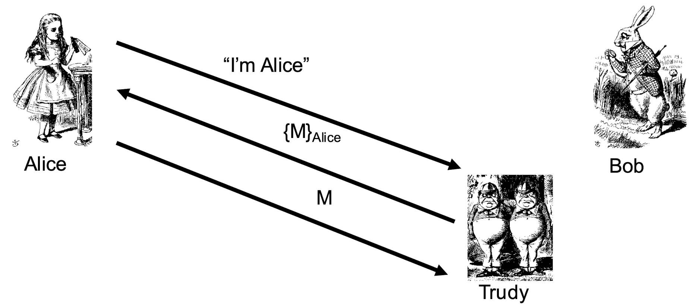

- Trudy(제 3자)는 이 프로토콜을 사용해 Alice에게 무엇이든 decrypt 시킬 수 있다.

  - 이전에 도청한 메시지 M도 마찬가지이다.
  - 따라서 **message encryption을 위한 키 쌍과 인증을 위한 키 쌍을 별개로 사용해야 한다.**

### 공개 키 인증 프로토콜

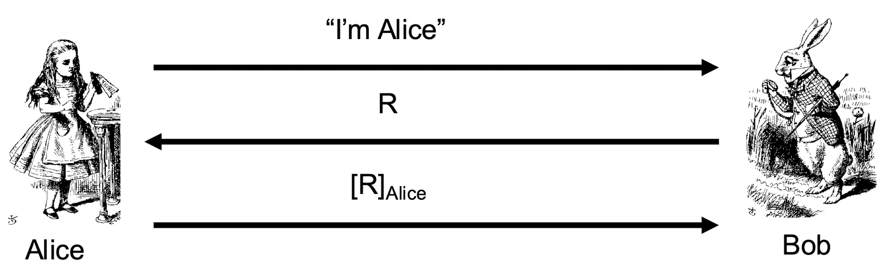

- 여전히 Trudy는 Alice에게 무엇이든 sign하게 할 수 있다.  
  **인증과 전자 서명에 다른 키 쌍을 사용해야 한다.**

### 공개 키 인증

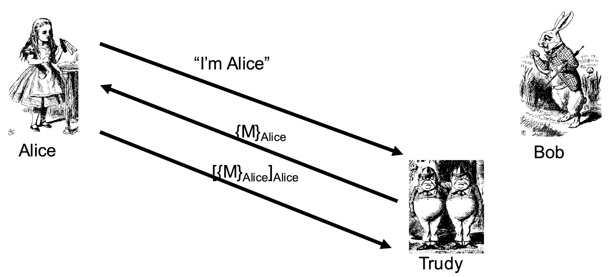

- 암호화와 인증에 동일한 키 쌍을 사용하면 서명에 의해 메시지가 decrypt될 가능성이 있다.  
  따라서 **공개 키 메커니즘은 용도 별로 다른 키 쌍을 사용해야 한다.**

### 세션 키

- 해당 세션의 암호화, 인증에 사용한다.

  - 보통 대칭 키가 세션 키로 사용되며 암호화, MAC에 사용된다.
  - 보통 인증 과정에 세션 키를 교환하게 된다.

### 인증과 세션 키 교환

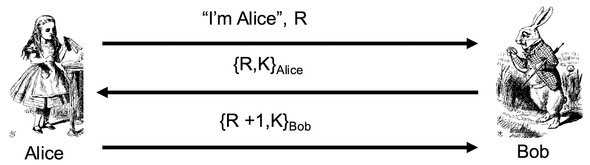

- 안전하지만(key 노출 X), 상호 인증은 불가하다. 즉 Bob은 Alice를 인증할 수 있지만 Alice는 Bob을 인증할 수 없다.

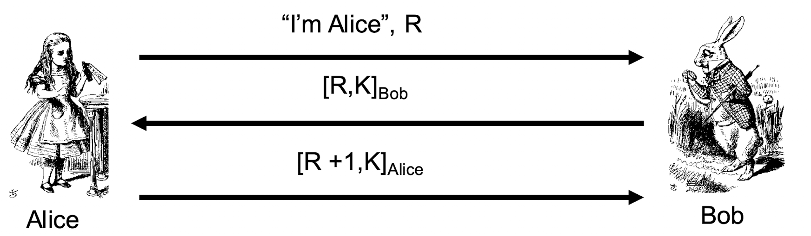

- 이렇게 서명을 사용하면 상호 인증은 가능하지만 key가 노출된다.  
  $[R, K]_{Bob}$ 을 ${K}_{Bob}$으로 복호화할 수 있기 때문이다. $[R+1, K]_{Alice}$도 마찬가지이다.

- 이를 해결하기 위해 **암호화와 서명을 같이 사용**한다.  
  즉 서명을 암호화한다.

  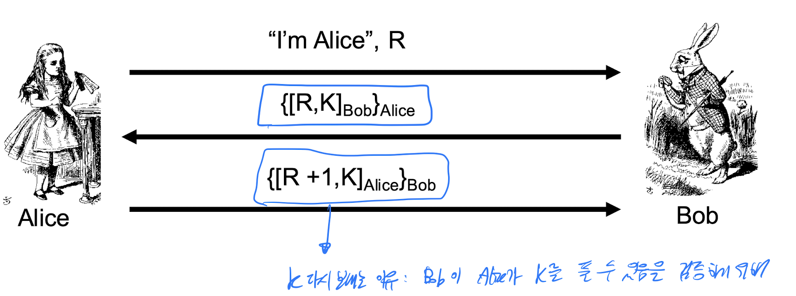

- 이렇게 하면 상호 인증과 key 노출을 모두 해결할 수 있다.
- K를 Alice가 Bob에게 다시 보내는 이유는 Bob이 Alice가 K를 풀 수 있음을 검증하기 위함이다.

### PES(Perfect Forward Secrecy)

- 문제 시나리오

  - Alice가 $K_{AB}$로 암호화한 암호문을 Bob에게 전송
  - Trudy가 암호문을 sniffing해 저장
  - 추후 Alice나 Bob의 컴퓨터가 해킹되어 $K_{AB}$가 노출되면 Trudy는 이전에 저장한 암호문을 복호화할 수 있다.

- PES: Key가 노출되어도 암호문의 복호화가 불가능해지는 보안성  
  즉 Trudy가 $K_{AB}$를 알아도 이전에 저장한 암호문을 복호화할 수 없다.

- PES를 위해서는 $K_{AB}$를 암호화에 사용하면 안된다.  
  대신 세션 키 $K_S$를 사용해 암호화한 후 이를 완벽히 지워야 한다.  
  그렇다면 이 세션 키 $K_S$는 어떻게 교환할까?

### Naive Session Key Protocol

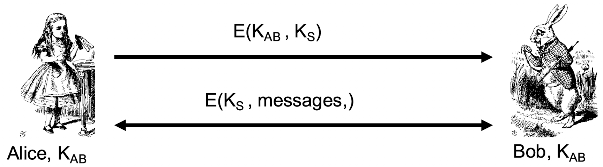

- 이렇게 하면 Trudy가 $E(K_{AB}, K_S)$를 sniffing해 저장하고 이후 $K_{AB}$가 노출되면 $K_S$를 알 수 있다.

- 이렇게 하지 말고 아래처럼 Diffie-Hellman을 사용해보자.

  - 세션 키 $K_S = g^{ab} \mod p$
  - $K_S$ 생성 후 Alice는 a 삭제, Bob은 b 삭제
  - Alice, Bob도 $K_S$를 이후에 복구할 수 없다.

  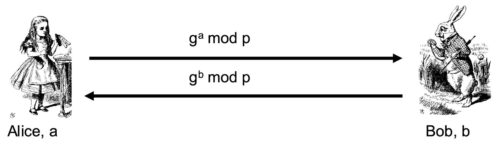

- 그렇다면 MITM(Man in the Middle) 공격은 어떻게 막을 수 있을까?

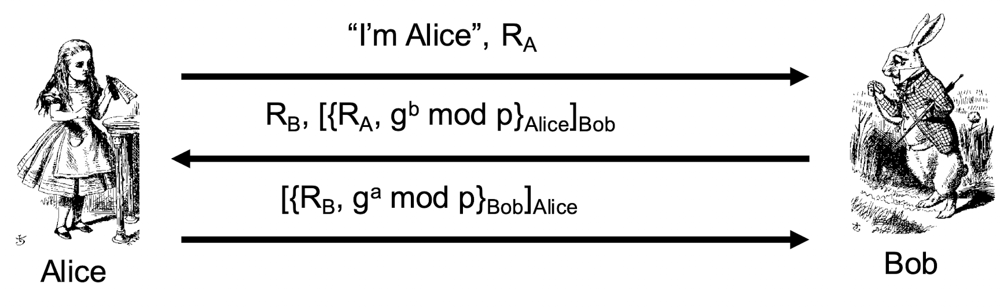

- 위처럼 하면 상호 인증도 가능하고 a, b는 세션 키 생성 후 바로 지우기 때문에 세션 키를 복구할 수 없다.

---

## (6)

### 대칭 키 분배 방법 4가지

- 키 분배(교환): 암호 통신을 위해 통신의 당사자들이 키를 확보하는 과정
- 대칭 키 분배의 문제:

  - 기밀성: 둘만 알 수 있도록
  - 인증: MITM 공격자가 아닌 통신하고자 하는 상대방과 키를 나눠야 함

- 키 교환 4가지 방법

  - (1) A가 키 생성 후 B에게 **직접 전달**
  - (2) 제3자가 키를 A와 B에게 직접 전달
    - 제3자: TTP(Trusted Third Party)
  - (3) A와 B의 공유 key로 암호화해 상대방에게 전송
  - (4) A와 B가 제3자인 C와 암호화된 연결(secure channel)이 확립되어 있다면, C가 secure channel을 통해  
    A와 B에게 키를 전달

### KDC 키 분배 절차

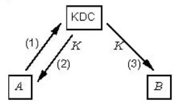

- (1) A와 B가 통신을 원하면 연결 요청 packet을 KDC에 전송한다.
  - A와 KDC 사이의 통신은 A와 KDC가 공유하고 있는 **영구 키**로 암호화된다.
- (2) A의 연결 요청 후 KDC는 일회용 세션키 K를 생성한다.
  - 세션키 K를 A와 공유하고 있는 영구 키로 암호화한 후 A에게 전달
  - B도 동일한 방식
- (3) A와 B는 암호 통신 진행

  - 세션 키 K를 사용해 데이터를 암호화해 전송

- KDC가 없다면?
  - 키 교환 (3)번을 위해서는 키 교환 (1)을 $M^2$번 수행해야 한다.
- KDC가 있다면?
  - 키 교환 (4)를 위해서는 키 교환 (1)을 $M$번 수행하면 된다.

> (1): A가 키 생성 후 B에게 직접 전달
> (3): A와 B의 공유 key로 암호화해 상대방에게 전송
> (4): A와 B가 제3자인 C와 암호화된 연결(secure channel)이 확립되어 있다면, C가 secure channel을 통해 A와 B에게 키를 전달

### 공개 키 분배

- 공개 키는 말그대로 _공개_ 키 이기에 기밀성이 필요 없다.
- 다만, 공개키의 **소유자는 확인**할 수 있어야 한다.

- 안전한(소유자가 확인된) 공개 키 전달

  - Direct 확인: 소유자를 직접 확인(secure channel)
  - 공개 키 인증서(Public-key certificate)
    - 공개 키와 키 소유자의 ID로 구성
    - 이를 신뢰할만한 제 3자가 서명한다.
    - 제3자: 정부기관, 금융기관 등 사용자 모두가 신뢰하는 인증기관(CA: Certificate Authority)
    - Off-line 수단: Kerberos 등

### 공개 키 인증서 활용

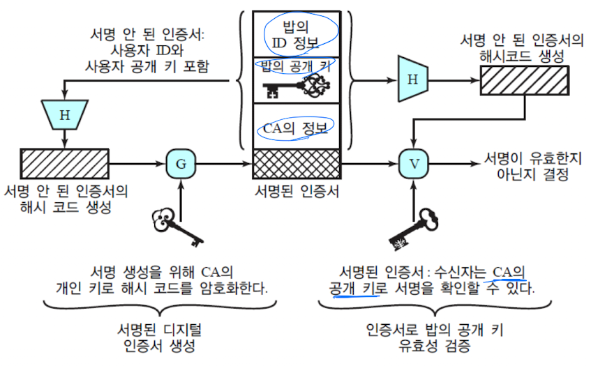

### CA의 공개 키 안전 확보 방법

- 단말에 저장되어 있는 신뢰하는 CA 목록
- 신뢰하는 CA가 인증서를 발급해준 다른 CA

### 공개 키를 이용한 비밀 키 분배

- Diffie-Hellman 키 교환을 이용 시
  - MITM Attack 가능
  - 두 사용자 사이에 별도의 인증 방법 필요
- 공개 키 인증서를 활용 시
  - (1) 메시지 준비
  - (2) 일회용 세션 키를 사용하는 대칭 암호 기법으로 메시지 암호화
  - (3) 수신자의 공개 키를 이용해 세션 키를 암호화
    - 수신자의 공개 키는 공개 키 인증서를 통해 알아낸다.
  - (4) 암호화된 세션 키를 메시지에 첨부해 수신자에게 전달

### X.509 인증서

- 표준 공개 키 인증서
- 디렉토리: 사용자 정보 데이터베이스를 관리하는 하나의 서버 또는 분산 서버의 집단으로, **공개 키 인증서의 공개 저장소**로 이용

### 인증서 체인

- `발행자<<대상자>>`의 형식을 가진다.

- `X1<<X2>>X2<<B>>`: B를 X2가 서명, X2는 X1에 의해 서명되었다.

### X.509 계층 구조

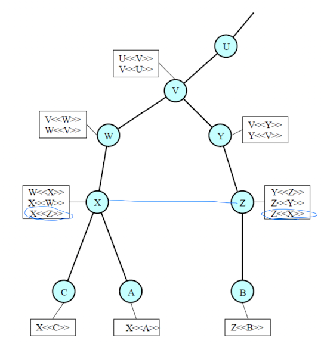

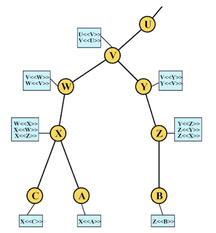

- 위 그림에서 A가 B의 인증서를 얻는 체인은 아래와 같다.

  - `X<<W>>W<<V>>V<<Y>>Y<<Z>>Z<<B>>`

### 취소 인증서 목록(CRL: Certificate Revocation List)

- 각 CA는 취소했지만 유효 기간이 아직 끝나지 않은 인증서들의 목록
- 취소 목록을 디렉토리에 공개한다.

### 공개 키 기반 구조

- 공개 키 기반 구조: PKI(Public-Key Interface)
- 안전함, 편리함, 그리고 효율적인 공개 키 획득을 위해 개발됨.

### PKIX 구성 요소

- 종단 개체(end entity)
- 인증 기관(CA)
- 등록 기관(RA)
- CRL 발행자
- 저장소(Repository)

### PKIX 관리 기능

- 등록(registration)
- 초기화(initialization)
- 인증서 발급: 인증(certification)
  - 사용자 인증(authentication)과 다름
- 키 쌍 복구
- 키 쌍 갱신
- 취소 요청
- 교차 인증(CA들끼리 인증서를 주고받는 것)

---

## (7)

### 네트워크 접근 통제(NAC: Network Access Control)

- 사용자의 네트워크 로그인 인증 및 권한 검사
- 사용자의 컴퓨터나 모바일 기기(종단 기기)가 안전한지 점검

### 네트워크 접근 통제 시스템 구성 요소

- 접근 요청자(AR: Access Requestor)

  - 네트워크에 접근을 시도하는 node
  - NAC가 관리하는 모든 장치

- 정책 서버(Policy Server)

  - AR의 입장과 정의된 정책에 기반해 접근 허가 여부 결정
  - AR의 상태 확인

- 네트워크 접근 서버(NAS: Network Access Server)

  - 원격 사용자가 네트워크 연결 시 접근 통제 지점

- AR과 NAS 간의 인증 목적
  - ID 확인: ID에 따른 접근 제어
  - 세션 키 교환

### 네트워크 접근 통제 적용 방법

- 통제(enforcement) 수단
  - IDEE 802.1X: 어떤 port에 접근할 수 있는지
  - VLANs(Virtual Local Area Networks): VLAN으로 세그먼트 분할 및 AR을 VLAN에 접속 허용하는 방식
  - Firewall: 트래픽을 차단하는 방식
  - DHCP(Dynamic Host Configuration Protocol): DHCP 할당 여부로 제어

### 확장 인증 프로토콜(EAP: Extensible Authentication Protocol)

- 네트워크 접근 및 인증 프로토콜의 프레임워크 역할
- 클라이언트와 인증 서버 간의 다양한 인증 방법을 캡슐화할 수 있는 일련의 프로토콜 메시지 제공
- Peer-to-peer link, LAN 및 기타 네트워크 및 네트워크 링크 계층 장치에서 작동
- 다양한 링크와 네트워크에서 필요로하는 인증 기능 제공

### EAP 계층 구조

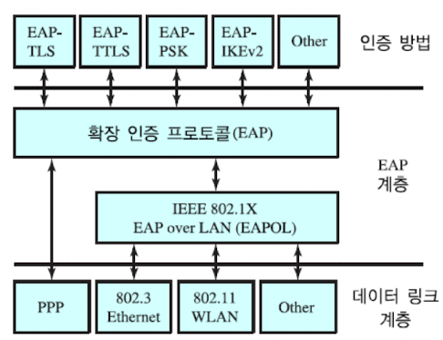

### EAP 인증 수단

- EAP-PWD: pw 기반
- EAP-TLS(EAP Transport Layer Security)
- EAP-TTLS
- EAP-GPSK
- EAP-IKEv2

### EAP 교환

- EAP 인증자를 통해 인증서버에 접근해 인증한다.
- EAP 인증자가 접근 통제를 수행한다.
- 그리고 peer와 EAP 인증자 사이의 메시지 구조를 정의한다.

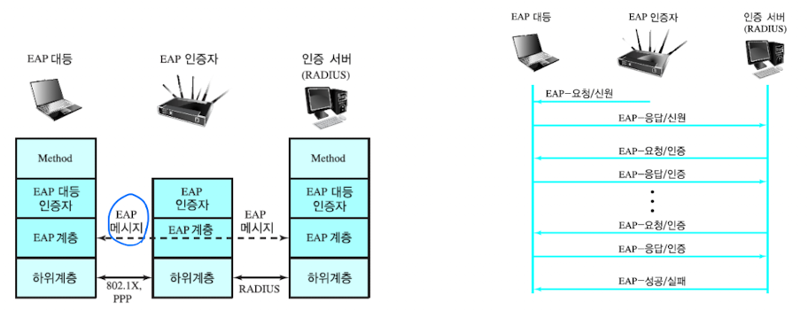

### IEEE 802.1X 포트-기반 NAC

- EAPOL: LAN 상의 EAP 기반 NAC
- AP가 채널, 포트를 통해 통제한다.

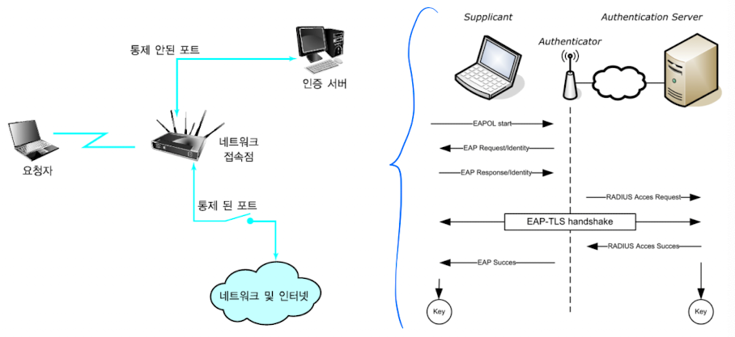

### 클라우드 컴퓨팅의 5가지 핵심적 특성

- 광범위한 네트워크 접근(broad network access)
- 신속한 탄력성(rapid elasticity)
- 측정된 서비스(measured service)
- 주문형 셀프 서비스(on-demand self service)
- 자원 풀링(resource pooling)

### 클라우드 컴퓨팅의 3가지 서비스 모델

- SaaS: 사용자가 제공자가 클라우드 기반 구조에서 구동되도록 올려놓은 응용 프로그램 이용
- PaaS: 사용자는 자신이 생성했거나 프로그래밍 언어로 만든 프로그램 또는 제공자가 지원하는 도구를 클라우드 기반 구조에 배치
- IaaS: 사용자는 저장소, 네트워크 및 기본적 컴퓨팅 자원을 사용자가 배치할 수 있는 곳에 제공하고 OS와 응용 프로그램을 포함한  
  모든 응용 프로그램을 구동

### 클라우드의 주요 보안 위협 및 대응 방안

- 클라우드 컴퓨팅의 오용 및 비도덕적 활용
- 안전하지 않은 인터페이스와 API
- 악의적 내부자(관리)
- 공유 기술 문제(resource pooling과 연관)
- 데이터 손실 및 노출

### 클라우드 데이터 보호

- 클라우드 암호화의 4개 주체

  - 데이터 소유자
  - 사용자(시스템에 요청하는 인적 개체)
  - 클라이언트
  - 서버

### 동형 암호

- 암호화된 상태에서 연산 수행


### 클라우드 기반 보안 서비스

- SecaaS(Security as a Service): 클라우드로 제공하는 보안 서비스 패키지
