# OS

## 1. 개요

- 운영체제란 무엇인가?

  - 하드웨어를 손쉽게, 그리고 효율적으로 사용할 수 있는 **abstraction** 제공
  - 자원의 공유 및 분배를 위한 **policy** 결정

### Abstractions

- Program

  - 컴퓨터를 실행시키기 위한 일련의 순차적으로 구성된 명령어의 모음
  - Disk와 같은 secondary storage에 저장되어 있다.
  - static하다.

- Process

  - **실행되고 있는** 프로그램의 추상화
  - Program Counter, Stack, Data Section으로 구성
  - Dynamic하다.
  - 각 process가 사용하는 virtual memory space는 서로 철저히 독립되어 있어야 한다.

- Address space

  - Process가 차지하는 메모리 공간
  - virtual, not physical
  - 서로의 주소 공간을 침범할 수 없도록 해주는 protection domain의 역할을 한다.

- File

  - Process에서 읽고 쓸 수 있는 persistent storage
  - Process는 데이터가 실제로 저장되는 위치를 알지 않는다.

- Port

  - 컴퓨터 시스템이 메시지를 주고받는 communication endpoint
  - Port를 통해 송수신하는 데이터를 어떤 process가 처리해야 하는지 지정한다.

- Software의 구분

  - System software: 컴퓨터 시스템을 구동시키는 software  
    OS, compiler, assembler 등

  - Application software: 특정 용도로 사용되는 software  
    web browser 등

- OS는 **항상 동작** 한다.  
  또한 통제 기능을 가져 항상 자원에 대한 관리, 감시 활동을 하며 하드웨어에 대한 제어도 한다.

- `hardware` <-> `OS` <-> `Application` 의 3-tier 구조로 이루어져 있다.

---

## 2. 운영체제 구조

- Automatic Job Sequencing

  - 사람의 관여 없음
  - 이전 작업 종료되자마자 다음 작업 실행 -> 일괄 처리(batch)보다 성능 향상
  - I/O에 의해 발생하는 CPU idle time 개선은 없음

- Spooling(Simultaneous Peripheral Operation On-Line)

  - CPU의 idle time을 줄이기 위함
  - I/O와 computation의 동시 진행 가능
  - Spooling을 통해 사용자는 여러 개의 인쇄 작업을 프린터에 순차적으로 요청 가능

- Multiprogramming

  - CPU의 idle time을 줄이기 위함
  - 2개 이상의 작업을 동시에 실행
  - OS는 여러 개의 작업을 메모리에 동시에 유지
  - 현재 실행중인 작업이 I/O를 할 경우, 다음 작업을 순차적으로 실행
  - 스케쥴링: FCFS(First Come First Served)
  - 단점: 사용자가 실행 중인 작업에 대해 관여할 수 없다.

  - 문제점들

    - 다른 job이 수행되기 위해서는 현재 수행되는 job이 I/O를 해야 한다.
    - 공평성을 유지할 수 있어야 한다.
    - High priority로 수행할 필요성은 job scheduling으로 해결되지 못했다.

- Timesharing

  - CPU의 실행 시간을 time slice로 나눈 것.
  - 모든 프로그램은 time slice 동안 CPU를 점유하고, 그 시간에 끝나면 CPU를 양보(yield) 한다.
  - 여러 개의 작업들이 CPU switching(context switching)을 통해 동시에 실행된다.
  - CPU switching이 매우 빈번하게 일어난다.  
    하지만 context switching이 일어나는 동안 사용자는 실행중인 프로그램에 관여가 가능해진다.

- Multitasking

  - 여러 개의 task들이 CPU와 같은 자원을 공유하도록 한다.
  - 하나의 job은 동시에 실행할 수 있는 여러 개의 task들로 나눠질 수 있다.  
    `job = n * task`
  - 사용자가 여러 개의 프로그램을 실행할 수 있도록 하며, CPU가 idle 상태일 때는 background 작업을 실행 가능하도록 한다.

  - 문제점들

    - 복잡한 메모리 관리 시스템: 동시에 여러 개의 프로그램이 메모리에 상주해야 하며 그에 맞는 관리, 보호 시스템이 필요하다.
    - 적절한 응답 시간을 제공하기 어렵다.
    - 서로 독립된 task들이 동시에 실행되는 concurrent execution을 제공하기 위한 CPU scheduling이 필요하다.
    - Job들 간의 ordered execution이 필요하다.

---

## 3. 운영체제 구조

### OS design principles(mechanism, policy)

- Policy: **무엇**이 되게 할 것인가?
- Mechanism: **어떻게** 할 것인가?
- Policy와 mechanism을 분리함으로써 OS 설계를 보다 모듈화할 수 있다.

### Methods for OS design

#### Layering

- OS의 복잡도를 낮추기 위한 방안
- 하나의 layer는 well-defined 함수들로 이뤄진다.
- 하나의 layer는 인접한 layer들과만 통신할 수 있다.
- 설계의 복잡도를 낮출 수는 있으나, 그로 인한 overhead가 발생한다.

- 장점:

  - Layer의 수정이 다른 layer들과 독립적으로 이뤄질 수 있다.

### User mode, kernel mode

- CPU는 2가지 이상의 실행 모드가 있다.

  - System protection을 위해 필요하다. 권한에 따라 접근할 수 있는 메모리, 실행 가능한 명령어가 제한되기 때문이다.
  - 각각의 mode별로 권한(privilege)이 설정된다.
  - Hardware의 지원이 필요하다.

- User mode에서 실행 중인 프로그램은 kernel mode의 권한이 필요한 작업을 수행할 수 없다.

- Kernel mode

  - 모든 권한을 가진 mode
  - OS가 실행되는 mode
  - Privilege 명령어 및 register 접근 가능

- User mode

  - Kernel mode에 비해 낮은 권한의 mode
  - Application이 실행되는 mode
  - Privilege 명령어 실행 불가

### System call

- User mode에서 kernel mode로 진입하기 위한 통로
- Register에 System call에 필요한 파라미터들 및 OS의 리턴값을 저장한다.

### Kernel designs

#### Monolithic kernel

- Kernel의 모든 service가 같은 주소 공간에 위치한다.
- Application은 자신의 주소 공간에 kernel code 영역을 mapping해 kernel service를 이용한다.
- Hardware 계층에 대한 **단일 abstraction을** 정의한다.  
  그리고 이를 사용하기 위해 라이브러리나 애플리케이션에게 **단일한 인터페이스** 를 제공한다.

  

- 장점: Application과 모든 kernel service가 **같은 주소 공간** 에 위치하기 때문에 system call 및  
  kernel service 간의 데이터 전달 overhead가 적다.

- 단점:

  - 모든 서비스 모듈에 **single binary** 로 되어있기에 **일부분의 수정이 전체에 영향을 미친다.**
  - 각 모듈이 유기적으로 연결되어 있기에 kernel 크기가 커질수록 **유지 보수가 어려워진다.**
  - **한 모듈의 버그가 전체 시스템에 영향을 끼친다.**

#### Micro kernel

- Kernel service를 **기능에 따라 모듈화** 해 각각 **독립된 주소 공간에서 실행** 된다.

  - 이러한 모듈들을 **서버**라 하며, **서버들은 독립된 프로세스로 구현** 된다.

- Micro kernel은 IPC와 같은 단순한 기능만을 제공한다.

- 장점:

  - 각 kernel service가 따로 구현되거 있기에 **서로 간의 의존성이 낮다.**  
    즉, 독립적인 개발이 가능하고 유지 보수가 monolithic kernel보다 상대적으로 용이하다.
  - Kernel service 서버의 간단한 시작, 종료가 가능하다.

- 단점: 독립된 서버들 간의 IPC 및 context switching이 필요해 monolithic kernel보다 성능이 나쁘다.

#### Hypervisor

- 가상화된 컴퓨터 hardware 자원을 제공하기 위한 관리 계층이다.  
  Guest OS와 hardware 사이에 위치한다.

- 각 guest OS들은 서로 다른 Virtual machine에서 수행되며, 서로의 존재를 알지 못한다.

- Hypervisor는 각 guest OS 간의 CPU, memory 등 시스템 자원을 분배하는 등 최소한의 역할을 수행한다.

- 장점:

  - 하나의 물리 컴퓨터에서 여러 종류의 guest OS 운용이 가능하다.
  - 실제 컴퓨터가 제공하는 것과 다른 형태의 명령어 집합 구조를 제공한다.

- 단점: Hardware를 직접적으로 사용하는 다른 OS에 비해 성능이 떨어진다.


---

## 4. Process

- Process가 만들어지는 과정은 아래와 같다.

  - `Source code` -compiler-> `Object file` -linker-> `Executable file` -loader-> `Memory`

- Compiler

  - Source code를 CPU가 이해할 수 있는 object file로 변환한다.
  - Object file은 object file 자체만으로는 수행이 이뤄지지 못한다.(ex. 외부 라이브러리 코드의 linking이 필요)
  - 프로세스로 변환되기 위한 정보가 삽입되어야 한다.
  - Relative address로 표현된다.

- Linker

  - 여러 object file들과 라이브러리들을 연결해 메모리로 loading될 수 있는 **하나의 executable file** 로 변환
  - Executable

    - 특정 OS에서 실행될 수 있는 파일
    - Absolute address로 표현된다.

- Loader

  - **Executable을 실제 메모리로 올려주는 역할** 을 하는 **OS의 일부**
  - 동작 과정

    - (1) Executable의 header를 읽어 text, data 크기 결정
    - (2) 프로그램을 위한 address space(virtual memory space) 생성
    - (3) 실행 명령어들과 data를 executable로부터 생성한 address space로 복사
    - (4) 프로그램의 argument들을 stack으로 복사
    - (5) CPU 내의 register들을 초기화하고, start-up routing으로 jump

- Runtime system

  - 응용 프로그램의 효율적인 실행을 지원하기 위해 프로그램과 연결해 상호작용한다.
  - C runtime system program execution

    - Process 시작을 위해 kernel은 program counter를 `_start()` 함수의 주소로 지정
    - `_start()` 함수는 동적으로 link된 C library 및 thread 환경을 초기화하는 `_libc_start_main()` 함수 호출
    - 라이브러리 초기화 후 프로그램의 `main()` 함수 호출

### Process management

- Process - abstraction

  - Process는 OS의 abstraction중 하나로, Os가 프로그램을 쉽게 동작시켜주기 위해 존재한다.
  - Execution unit(스케쥴링 단위)
  - Protection domain(서로 침범 불가)

  - 구성요소: Program counter, Text section, Stack, Data section, BSS

    > BSS: 초기화되지 않은 전역변수들 저장

  - Process는 disk에 저장된 프로그램으로부터 변환되어 메모리로 loading된다.

- Linux의 process memory layout은 아래와 같다.

  

- Process state

  - New: 프로세스가 생성되는 중
  - Running: 프로세스가 실행 중
  - Waiting: 프로세스가 특정 event가 발생하기를 기다리는 중(ex. I/O completion)
  - Ready: 프로세스가 processor에게 할당 받기를 기다리는 중
  - Terminated: 프로세스가 실행을 완료하고 종료된 상태

  > Waiting에서 ready로 가고, ready에서 언제든지 running으로 갈 수 있다.

- Kernel은 ready queue, waiting queue, running queue를 사용해 process들을 상태에 따라 관리한다.

  

- PCB(Process Control Block)

  - OS가 process들을 관리하기 위해 만들어진 자료구조
  - 아래 내용들을 가진다.

    - Process state
    - Program counter(running 상태일 때 실행되어야 하는 instruction)
    - CPU registers
    - CPU scheduling information
    - Memory management information
    - Accounting information
    - I/O status information

- Context switching

  - CPU가 다른 process를 실행할 때 kernel은 아래 2개 과정을 거쳐야 한다.

    - (1) 이전 process의 상태 저장
    - (2) 새로운 process의 상태 복원

  - Context switching time은 overhead이며, hardware 지원에 따라 좌우된다.

- Processor 구조에 따른 context switching의 차이

  - CISC

    - 복잡한 명령어 set => 효율은 높지만 clock 속도는 낮다.
    - 복잡한 회로로 인해 차지하는 물리적 공간이 많아져 register 용량이 작다.
    - CPU register 개수가 적어 context switching이 빠르다.

  - RISC

    - 간단한 명령어 set => clock 속도가 높고 수행 속도도 빠르다.
    - 절약된 물리적 공간에 많은 register를 장착해야 하기에 context switching 시 보다 큰 overhead가 발생한다.

- Process creation

  - 시스템 내의 process들은 여러 개가 동시에 실행될 수 있어야 하고, 동적으로 생성 및 종료되어야 한다.
  - OS는 process creation과 termination mechanism을 제공한다.

  - Parent process, child process의 관계를 가진다.

    - Child는 parent의 리소스를 공유받을 수도 있고, 아닐 수도 있다.
    - Parent과 child는 동시에 실행될 수 있으며, parent는 child의 종료를 기다릴 수 있다.

  - 메모리 관점에서 child process는 parent process의 중복(duplicate)이다.
    - Child process는 load된 program이 있다.
    - Unix에서 새로운 process는 `fork()`에 의해 생성되며, parent process memory의 복사본을 가진다.  
      그리고 `exec()`를 호출해 새로운 program을 load한다.

  ```c
  int main(void) {
      pid_t pid;
      pid = fork();
      if(pid < 0) { // Error in fork()
  	    fprintf(stderr, "Fork Failed");
  	    exit(-1);
      }     else if(pid > 0) { // Parent process
  	// PARENT!
      }     else if(pid == 0) { // Child process
  	// CHILD!
      }
      return 1;
  }
  ```

- Process termination

  - Process는 `exit()`을 호출해 종료될 수 있으며, `wait()`을 사용해 parent는 child의 종료를 기다릴 수 있다.  
    문제가 생길 때 `abort()`를 호출하면 core dump가 생성되며 `SIGABRT` signal이 호출자 process에 전달된다.

- Cooperating processes

  - 독립적인 process들은 다른 process의 실행에 의해 영향받을 수 없다.

---

## 5. Computer Architecture

### 단일 bus 구조

- Bus: CPU, RAM, I/O device 간의 데이터가 연결되는 통로  
  Data bus, address bus 등이 있다.

- 단일 bus:

  - 하나의 system bus에 여러 가지 모듈들이 연결되어 있다.
  - CPU, memory, I/O device의 속도가 비슷했던 초창기에 생겼다.
  - 하지만 시간이 지나면서 CPU, Memory, I/O device간에 속도 격차가 발생하면서 **병목 현상**이 발생한다.

### 병목 현상

- 같은 bus에 연결된 device들 간의 속도 차이로 인해 발생하는 현상
- CPU(빠름) - memory - I/O device(느림)
- ex) CPU는 초당 5개 일을 할 수 있는데 메모리가 초당 3개 일만을 전달할 수 있다면 전체 시스템 속도는 메모리의 속도로 제한된다.
- 속도: CPU > memory > Disk, network > I/O device

### 계층적 bus 구조

- 여러 개의 세분화된 bus를 사용한다.
- 이중 bus

  - CPU와 I/O의 속도 차이로 인한 병목 현상을 해결하기 위함
  - 빠른 CPU, memory는 system bus에 연결한다.
  - I/O device는 I/O bus에 연결한다.

### Event 처리 기법: Interrupt

- **비동기적 이벤트(예상할 수 없는 이벤트)** 를 처리하기 위한 기법
- 처리 순서:

  - (1) Interrupt disable(interrupt는 1번에 1개만 처리가 가능하다.)
  - (2) 현재 실행 상태(state) wjwkd
  - (3) ISR(Interrupt Service Routing)로 jump
  - (4) 저장한 실행 상태 복원
  - (5) Interrupt로 중단된 지점부터 다시 시작

- Interrupt에는 순서가 있으며, hardware 장치마다 다르게 설정되어 있다.
- ISR은 짧아야 한다.(너무 길면 다른 interrupt들이 처리되지 못한다.)
- Time sharing은 timer interrupt의 도움으로 가능하게 된 기술이다.

### Event 처리 기법: Trap

- **동기적 이벤트(프로그램이 발생시킨 이벤트)** 를 처리하기 위한 기법
- Trap handler에 의해 처리된다.
- TSR(Trap Service Routine)이 있기에 interrupt와 유사하지만, interrupt와 달리 trap은  
  **실행 상태(state)를 저장, 복원하지 않는다.** (그냥 error 출력 후 process 종료시키기 때문)

### I/O device basic concepts

- Device registers

  - Control register, status register, input register, output register로 구성
  - CPU가 접근하는 memory의 영역을 나타낸다.

- I/O controller

  - 장치와 직접적인 상호작용을 진행한다.
  - CPU는 직접적으로 장치의 상태를 알 수 없고, I/O controller를 통해 알 수 있다.

### I/O 처리 기법: Polling

- Loop를 돌며 특정 event의 도착 여부를 확인하면서 기다린다.
- Interrupt handler를 등록하는 것과 반대로 polling은 매 순간 event의 발생 여부를 주기적으로 확인한다.
- Controller나 장치가 매우 빠른 경우에 적합하다.
- Event 도착 시간이 길 경우, polling은 CPU time을 낭비하게 된다.

### I/O 처리 기법: DMA(Direct Memory Access)

- Polling은 모든 I/O 연산을 CPU를 통해 진행하지만, DMA는 I/O를 위한 전용 process를 둔다.
- 전송할 데이터가 클 경우 CPU가 I/O를 처리하는 polling보다 DMA가 더 효율적이다.
- DMA controller라는 processor를 사용한다.

  - (1) CPU가 DMA controller에게 I/O 요청
  - (2) DMA controller가 CPU를 대신해 I/O device와 main memory 사이의 데이터 전송 수행
  - 이때 DMA controller는 작업 수행 완료를 interrupt를 통해 CPU에게 알린다.

- DMA는 polling과 달리 추가적인 hardware를 필요로 한다.
- DMA를 최대한 활용하기 위해서는 I/O가 일어날 때마다 다른 process가 자신의 할 일을 할 수 있도록  
  적당한 parallelism을 제공하는 scheduling 기법을 활용해야 한다.

---

## 6. CPU Scheduling

- Scheduling

  - 어떻게 process들에게 CPU 사용을 할당할 것인지를 결정
  - CPU 사용률과 처리량의 최대화를 목표로 한다.
  - Scheduler는 multiprogramming에 기반해 memory 내에 준비된 ready state의 process들 중 하나에게 CPU를 할당한다.

- Process 수행 사이클의 구성

  - CPU, I/O burst cycle

    - CPU burst: CPU로 연산을 수행하는 시간
    - I/O burst: I/O 처리를 위해 기다리는 시간
    - 일반적인 프로세스는 두 burst를 번갈아가며 수행한다.

  - Process 분류에 따른 CPU burst의 특징

    - CPU-bound process: 짧은 주기의 긴 CPU burst
    - I/O-bound process: 긴 주기의 짧은 CPU burst
    - 어떤 종류의 process가 많은지에 따라 스케쥴링 기법의 효율성이 달라진다.

### Scheduling의 종류

- CPU scheduling은 아래 시점에 따라 이뤄진다.

  - (1) `Running` -> `Waiting`
  - (2) `Running` -> `Ready`
  - (3) 수행 종료
  - (4) `Ready` -> `Running`

- 비선점형 스케쥴링(non-preemtive scheduling)

  - (1), (4)에서만 수행되는 scheduling 기법

- 선점형 스케쥴링(preemtive scheduling)

  - 그 외의 다른 scheduling 기법

- Scheduling criteria

  - CPU 사용률: 전체 시스템 시간 중 CPU가 작업을 처리하는 시간의 비율
  - 처리량(throughput): CPU가 단위 시간 당 처리하는 프로세스의 개수
  - 응답 시간(response time): 요청 후 첫 응답이 올 때까지의 시간
  - 대기 시간(waiting time): Process가 ready queue에서 대기하는 시간의 총합
  - Turnaround time: process가 시작해서 끝날 때까지 걸리는 시간

### Scheduling algorithm - FCFS scheduling

- 먼저 CPU 할당을 요청한 process에게 CPU를 먼저 할당한다.(First Come First Served)
- 비선점형 스케쥴링 방식이다.

  

- 작업의 수행 순서에 따라 대기 시간이 변할 수 있다.

### Scheduling algorithm - Shortest Job First scheduling

- 다음 CPU burst time이 가장 짧은 process에게 CPU를 먼저 할당한다.
- 최소한의 평균 대기 시간 제공
- 비선점형 방식: 한 번 CPU를 할당받으면 자신의 CPU burst time이 끝나기 전에는 놓지 않는다.
- 선점형 방식: CPU를 할당 받아 수행 중이더라도, CPU burst time이 현재 자신이 남은 시간 보다 짧은 시간을 가진  
  프로세스가 새로 생성되면 CPU를 양보한다.

  
  

### Scheduling algorithm - Priority scheduling

- 미리 주어진 priority에 따라 CPU 할당
- 비선점형 방식: 한 번 CPU를 할당받으면 자신의 CPU burst time이 끝나기 전에는 놓지 않는다.
- 선점형 방식: 새로 생성된 process의 priority가 현재 실행중인 process의 priority보다 높다면 CPU 양보.
- 문제점 - 기아 상태(starvation): 낮은 priority를 가진 process가 전혀 수행되지 않을 수 있다.
  - 해결법 - aging 기법: 할당을 기다리는 시간에 따라 priority를 증가시켜준다.

### Scheduling algorithm - Round Robin scheduling

- CPU를 시간 단위(time quantum)로 할당한다.
- 선점형 scheduling 방식이다.
- Time quantum만큼 수행한 process는 ready queue의 끝으로 돌아가 다시 할당을 기다린다.

  

- Time quantum이 길면 FCFS 방식과 유사한 성능을 띈다.  
  반면 time quantum이 context switching에 필요한 시간보다 적다면 효율이 매우 떨어진다.

### Scheduling algorithm - Multilevel Queue scheduling

- Ready queue를 여러 개의 queue로 분리해 각각에 다른 scheduling algorithm을 사용하는 기법이다.
- Foreground queue: Interactive한 동작이 필요한 process를 위한 queue, Round Robin 기법 사용
- Background queue: CPU 연산 작업을 주로 수행하는 process를 위한 queue, FCFS 기법 사용

### Scheduling algorithm - Multilevel Feedback Queue Scheduling

- Multilevel queue에서 process들이 서로 다른 queue로 이동할 수 있도록 하는 scheduling 기법

  - Aging의 한 방법으로도 사용된다.

- 예시:

  - 3개의 queue로 구성되어 있다고 해보자.

    - $Q_0$ : Time quantum이 8ms
    - $Q_1$: Time quantum이 16ms
    - $Q_2$: FCFS 기법 사용

    - 새로운 process가 들어온다면?
      - (1) $Q_0$에서 8ms 동안 수행
      - (2) (1)에서 종료되지 않았다면 $Q_1$로 이동, 16ms 동안 수행
      - (3) (2)에서도 종료되지 않았다면 $Q_2$로 이동, FCFS 기법으로 수행

### 4가지 multiple processor scheduling 기법들

- 비대칭 multiprocessing

  - 하나의 CPU가 시스템 자료구조(scheduling, I/O) 관리
  - 모든 CPU가 접근할 경우보다 데이터 공유가 간단하게 이뤄진다.

- 대칭 multiprocessing: 많은 CPU가 kernel 자료구조를 동시에 관리한다.

- Processor affinity: 과거에 수행하던 CPU에 process를 배정한다.
- Load balancing:

  - CPU마다 각각의 ready queue를 두면? -> 일부 CPU에 process가 집중될 수 있다.
  - CPU 모두에 단 하나의 ready queue만 두면? -> 사용 가능한 CPU에 차례대로 process 배정 가능

---

## 7. IPC

- IPC: process들 간 데이터 및 정보를 주고받기 위한 mechanism

  - Kernel에서 IPC를 위한 도구를 지원한다.(system call의 형태)

- Process의 협력 모델을 구현하기 위해 IPC는 반드시 필요하다.  
  그리고 실행 중인 process는 협력하는 다른 process의 영향을 받는다.

### Shared Memory

- Process의 특정 memory 영역을 공유한다.
- 응용 프로그램 레벨에서의 통신 기능을 제공한다.
- 공유 메모리가 설정되면, 그 이후의 통신은 kernel의 관여 없이 진행 가능하다.
- Read, Write
- Process들의 주소 공간의 일부를 공유 메모리로 설정해 프로그램에서 바로 접근할 수 있다.
- 둘 이상의 process가 동시에 메모리에 접근해 데이터를 변경하지 않도록 **동기화**가 필요하다.

### Message passing

- Process 간의 memory 공유 없이 동작 가능하다. 대신, 매번 kernel의 도움을 받아야 한다.
- ex) Pipe, Message queue, Socket
- Send and receive
- Kernel을 경유해 message를 전송해야 한다.
- Kernel에서 데이터를 buffering한다.
- Context switching과 연관된다.

  - ex) Process A는 process B의 메시지를 수신하기 위해 기존 작업을 잠시 중단한다.

### IPC 동기화 방식

- Shared memory 방식 - 추가적인 방법 필요

  - Memory 영역에 대한 동시적인 접근을 제어하기 위한 방법 필요
  - Locking, semaphore 등 활용

- Message passing 방식 - kernel이 동기화 제공

- Send, receive는 kernel이 동기화해주며 프로그램에서 동기화에 대한 고려를 할 필요가 없다.

### Pipe

- 하나의 process가 다른 process로 데이터를 직접 전달하는 방법

  - 데이터는 **한쪽 방향으로만 이동** 한다. 따라서 양방향 통신을 하려면 2개의 pipe가 필요하다.
  - **1:1 의사소통만 가능** 하다.
  - **보내진 순서대로 받는다.**
  - **용량 제한이 있기에** , pipe가 꽉 차면 더 이상 쓸 수 없다.(수신자가 데이터를 read할 때까지 못 사용)

### Signal

- 특정 process에게 kernel을 통해 **event** 를 전달하는 방법

- 송신 process: 여러 신호 중 하나를 특정 process에게 보낸다. 이 동작은 수신 process의 상태와 무관하게 수행한다.
- 수신 process: 신호 종류에 따라 신호 처리 방법을 지정할 수 있다.

  - 무시
  - 단순히 신호를 붙잡아 두기
  - 특정 처리 루틴(signal handler)를 두어 처리

- **비동기적 동작**

  - Process A가 signal을 process B에게 보내도, signal의 처리는 process B가 scheduling되어야 가능하다.

### Message queue

- 고정된 크기의 message를 linked list로 구현된 queue에 전달해 통신하는 방법
- 여러 process가 동시에 접근할 수 있으므로 **동기화가 필요** 하다.

### Socket

- Port를 이용해 통신하는 데에 사용된다.

  - Port: OS가 제공하는 abstraction 중 하나
  - Port 번호를 이용해 통신하려는 상대 process의 socket을 찾아간다.

- 다른 IPC와 달리, process의 위치에 독립적이다.

  - Local or remote
  - Local의 경우, port 번호만으로 식별 가능
  - Remote의 경우, IP address + port 번호 조합으로 식별

---

## 8. Thread

- 정의

  - Execution unit
  - Process 내의 실행 흐름
  - Process보다 작은 단위
  - Process가 제공한 protection domain은 없다.

- Process가 할 작업을 여러 개로 나눈 후, 각각을 thread화 하면 병렬적으로 작업을 완수할 수 있다.

- Cooperative process와의 차이점

  - Cooperative process는 IPC가 필요해 비용이 많이 들지만, thread는 같은 process 내의 논리적인 실행 흐름이므로 IPC가 필요 없다.
  - Process 사이의 context switching 비용
  - Process 내에서 상호작용하는 thread를 만들면 process보다 적은 비용으로 cooperative process가 하는 일을 동일하게 수행할 수 있다.

- Thread 수가 증가할수록 CPU utilization도 증가하지만, 임계값을 넘어가면 thread switching 비용 때문에 처리량이 다시 감소한다.
- CPU가 많은 시스템일수록 thread를 이용하는 것이 유리하다.

- Process vs thread

  - Process

    - 하나의 thread와 같은 실행 흐름을 가진다.
    - Process 간의 메모리는 독립적이므로, 서로의 영역에 접근하기 어렵다.
    - Process 간의 switching 비용이 크다.

  - Thread

    - 하나의 process 내에 여러 개의 thread가 존재한다.
    - Process의 code, data section은 thread간에 공유된다.
    - Thread들은 같은 memory 영역을 사용하므로, thread 간의 switching 비용이 적다.

### Thread의 구성 요소

- Thread는 하나의 실행 흐름이므로 실행과 관련된 자료 구조가 필요하다.

  - Thread ID: Thread 식별자
  - Program Counter: 현재 실행 중인 instruction의 주소
  - Register set: CPU의 register 값들
  - Stack

- 동일한 process 내의 thread들이 서로 공유하는 것들

  - Code: program의 code section
  - Data: process의 data section
  - File: process에서 open한 file

### Multi-threaded program의 장점

- Responsiveness

  - 프로그램의 특정 부분을 담당하는 thread가 block되거나 시간이 걸리는 작업을 하더라도, 다른 thread들은 실행되고 있기에  
    user 입장에서는 해당 프로그램이 interactive하다고 볼 수 있다.

- Resource sharing

  - Thread들 사이에는 process의 memory와 다른 자원들을 공유한다.

- Economy: Process 생성 비용보다 thread 생성 비용이 적다.
- Scalability: 여러 개의 thread가 각각 다른 processor에서 동시 실행될 수 있다.

### Multicore programming

- Multicore processor: 하나의 chip에 여러 개의 computing code 탑재

### User thread, Kernel thread

- User threads

  - Kernel 영역 위에서 지원되며, 일반적으로 user level의 library를 통해 구현
  - Library에서 thread 생성, scheduling 관련 관리를 해준다.
  - 장점: 동일한 memory 영역에서 thread가 생성, 관리되므로 속도가 빠르다.
  - 단점: 여러 개의 user thread 중 하나의 thread가 system call로 block되면, 나머지 모든 thread들도 block된다.  
    이는 kernel이 여러 user thread들을 하나의 process로 간주하기 때문이다.

- Kernel threads

  - OS에서 지원하는 thread
  - Kernel 영역에서 thread 생성, scheduling 관련 관리를 해준다.
  - 장점

    - Kernel thread중 하나가 block되어도 다른 thread들은 계속 실행된다.
    - Multiprocessor 환경에서 kernel이 여러 개의 thread를 다른 processor에 할당할 수 있다.

  - 단점: user thread보다 생성 및 관리 속도가 느리다.

### User, kernel thread의 mapping

- Many-To-One

  - 여러 개의 user thread들이 하나의 kernel thread에 mapping된다.
  - 주로 kernel thread를 지원하지 못하는 시스템에서 사용된다.
  - 한계점: 한 번에 하나의 thread만 kernel에 접근할 수 있다.
    - 하나의 user thread가 system call을 하면, 나머지 모든 user thread들은 block된다.
    - 진정한 concurrency 지원 불가
    - 동시에 여러 개의 thread가 system call을 사용할 수 없다.

- One-To-One

  - 각각의 user thread를 kernel thread에 mapping한다.
  - User thread가 생성되면 그에 따른 kernel thread가 생성된다.
  - Many-To-One에서 발생한 system call 호출 시 다른 thread들이 blocking되는 문제를 해결한다.
  - 여러 개의 thread들을 multiprocessor에서 동시에 수행할 수 있다.
  - 한계점
    - Kernel thread도 한정된 자원이기에 무한정으로 생성할 수 없다.
    - Thread를 생성, 사용하려 할 때 그 개수에 대한 고려를 해야한다.

- Many-To-Many

  - 여러 개의 user thread를 여러 개의 kernel thread로 mapping한다.
  - Many-To-One과 One-To-One 모델의 문제점을 해결한다.
  - Kernel thread는 생성된 user thread의 수와 **같거나, 더 적은 수 만큼만 생성** 되어 적절히 scheduling된다.
    - One-To-One처럼 사용할 thread의 수에 대한 고민을 할 필요가 없다.
    - Many-To-One의 system call 등에 의해 한 thread가 block되면 다른 thread들도 block는 문제를 해결한다.

### Thread 고려사항: 생성 과정(creation)

- `fork()`: 하나의 program 내의 thread가 `fork()`를 호출하면, 모든 thread를 가진 process를 생성할 것인지, 아니면  
  `fork()`를 호출한 thread만을 복사한 process를 만들 것인지 고려해야 한다. Linux는 2가지 방법 모두를 제공한다.

- `exec()`: `fork()`해 모든 thread를 복사했을 때 `exec()`을 호출하면 모든 thread들은 새로운 program으로 교체된다.  
  여기서 `fork()` 후 `exec()`할 시 `fork()`를 요청한 thread만이 복사되는 것이 더 바람직하다.  
  그러나 `fork()` 후 `exec()`을 하지 않는 경우에는 모든 thread의 복사가 필요하기도 하다.

### Thread 고려사항: 취소(cancellation)

- Thread cancellation: Thread의 작업이 끝나기 전, 외부에서 작업을 중지시키는 것
- 하나의 thread에 내려진 중지 명령이 다른 모든 thread의 작업을 중단시켜야 하는 경우도 있다.
- 자원이 thread에 할당된 경우 cancellation의 문제:

  - System의 자원을 사용하고 있는 thread가 중지되었을 때, 할당된 자원을 함부로 해제할 수 없다.  
    다른 thread가 그 자원으 사용하고 있을 수도 있기 때문이다.

### Thread 고려사항: Thread pools

- Thread가 자주 생성되고 제거되는 상황에서 새로운 thread를 만드는 시간이 실제 thread의 동작 시간보다 길 수도 있다.  
  Thread는 시스템 자원이기 때문에, system의 동작을 보장하는 최대한의 thread 개수에 대한 제한이 필요하다.

- 위 문제를 thread pool이 해결하는데, process는 새롭게 실행될 때 특정 개수의 thread를 만든 후 thread pool에 할당한다.  
  이후 새로운 thread가 필요하면 thread pool에서 가져오고, 작업이 끝나면 해당 thread를 제거하지 않고 다시 thread pool에 반납한다.

- Thread pool을 사용하면 thread 생성 시간을 줄일 수 있고, 너무 많은 thread의 생성에 따른 시스템 부하를 줄일 수 있다.

### Thread 고려사항: Thread 간의 IPC

- 동일한 process 내의 thread들 사이의 통신은 shared memory를 사용하는 것이 효율적이다.

  - 이유: Thread들은 같은 process의 data section을 공유하므로, 자연스럽게 shared memory가 가능해진다.

- 다른 process에 존재하는 다른 thread와의 통신은 process의 경우(IPC)와 비슷한 성능을 보인다.

---

## 9. 동기화(1)

### Race condition

- 공유 데이터에 대한 동시 접근은 데이터의 일관성(consistency)을 해칠 수 있다.
- Race condition: 공유 데이터에 대해 여러 process가 동시에 접근해 변경을 시도하는 상황
- 데이터 일관성을 유지하기 위해서는 cooperative process들이 **순차적으로 변경을 수행** 하게 만드는 기법이 필요하다.  
  이를 process synchronization이라 한다.

### Critical section

- Critical section: 여러 process들이 데이터에 접근 및 사용하는 code 영역
- 한 번에 단 하나의 process만이 critical section에 진입하도록 해야 한다.

- Critical section을 가진 process는 아래처럼 모델링된다.

  - Entry(critical) section: 한 번에 하나의 process만 접근하도록 한다.
  - Exit(remainder) section: 다음 process가 entry sction에 접근할 수 있도록 한다.

- Critical section 문제를 해결하는 알고리즘은 아래 3개 조건을 만족해야 한다.

  - Mutual exclusion(상호 배제): Critical section에는 한 번에 단 하나의 process만 진입할 수 있다.
  - Progress(진행): 특정 process가 critical section에 있다면, remainder section에서 어떤 process가 다음에  
    critical section에 진입할 수 있는지 결정해야 한다.
  - Bounded waiting: Process가 critical section에 진입할 때까지 걸리는 시간에 limit이 있어야 한다.

### Peterson solution

- 공유 변수:

  - `int turn;`
  - `boolean flag[2]; flag[0] = flag[1] = false;`

```java
// Process p0
flag[0] = true;
turn = 1;
while(flag[1] && (turn == 1)) // { loop }
CRITICAL_SECTION_TASK;
flag[0] = false;
REMAINDER_SECTION_TASK;

// Process p1
flag[1] = true;
turn = 0;
while(flag[0] && (turn == 0)) // { loop }
CRITICAL_SECTION_TASK;
flag[1] = false;
REMAINDER_SECTION_TASK;
```

- 위 알고리즘은 mutual exclusion, progress, bounded waiting을 모두 만족한다.  
  p0, p1이 동시에 수행되더라도 `turn` 변수에 의해 실행이 결정된다.

- 예시 상황을 보자.

  - p0 시작 -> while loop 건너뜀(`flag[1]`이 false) -> p1으로 context switch -> p1은 while loop 수행(조건 만족)  
    -> p0로 context switch -> p0가 작업 마친후 `flag[0]`을 false로 바꿈 -> p0가 remainder section으로 이동  
    -> p1이 critical section에서 작업 진행

- 한계점

  - 3개 이상의 process가 존재하는 상황의 구현 불가
  - 증명이 NP 문제로 매우 어려움

- 하드웨어로 처리하면 알고리즘이 매우 간단해짐!

```java
acquireLock(criticalSection);
CRITICAL_SECTION_TASK;
releaseLock(criticalSection);
REMAINDER_SECTION_TASK;
```

- 간단한 방법으로는 critical section에 들어가면서 interrupt를 disable하면 되지만, user program이  
  interrupt를 제어하는 것은 바람직하지 않다. 그리고 scalable하지도 않다.  
  따라서 동기화를 위한 instruction이 도입되었다.

### Synchronization instruction

- CPU에서 지원해 atomic하게 수행되는 instruction(명령어)을 이용한다.  
  Atomic하다는 것은 명령어가 수행되는 동안 방해받지 않는다는 것이다.

- TestAndSet 명령어

```cpp
boolean TestAndSet(boolean *target) {
	boolean rv = *target;
	*target = true;
	return rv;
}
```

- 즉 `TestAndSet()`은 인자를 true로 바꾸고, 인자값을 반환한다.

#### Mutual exclusion with TestAndSet

- 공유 변수: `boolean lock = false;`

- 프로세스 수행 과정

```cpp
do {
	while(TestAndSet(&lock));
	CRITICAL_SECTION_TASK;
	lock = false;
	REMAINDER_SECTION_TASK;
}
```

- Swap 명령어

```cpp
void Swap(boolean *a, boolean *b) {
	boolean tmp = *a;
	*a = *b;
	*b = tmp;
}
```

### Mutual exclusion with Swap

- 공유 변수:

  - `boolean lock;`
  - `boolean waiting[n];`

- 프로세스 수행 과정

```cpp
do {
	waiting[i] = true;
	while(waiting[i] == true) {
		swap(&lock, &waiting[i]);
	}
	CRITICAL_SECTION_TASK;
	lock = false;
	REMAINDER_SECTION_TASK;
}
```

- 이러한 instruction들의 한계점: Mutual exclusion은 해결되나, bounded waiting 같은 조건은 user program에서 구현해야 한다.

### Semaphores

- 세마포어: 2개의 원자적 연산을 가지는 정수 변수

  - 원자적인 연산들:

    - `Wait()` or `P()`: 정수 변수값을 감소시킨다.
    - `Signal()` or `V()`: 정수 변수값을 증가시킨다.

  - 이 변수는 2개의 atomic operation들에 의해서만 접근될 수 있다.

- `P()`는 critical section에 들어가기 전에, `V()`는 나와서 수행한다.
- `P()`, `V()`는 서로 독립적으로, 그리고 원자적으로 수행된다.  
  즉 하나의 process가 `P()`로 세마포어 값을 수정하는 동안, 다른 process에서 `P()`나 `V()`로 같은 세마포어 값을 수정할 수 없다.

### Semaphore의 구현 - Busy Waiting

- Busy waiting을 이용한 구현은 아래와 같다.

```cpp
// P(S)
while(S <= 0) { loop(); }
S = S - 1;

// V(S)
S = S + 1;
```

- 이렇게 busy waiting은 critical section에 들어갈 때까지 무한 loop를 돌며 기다린다.
- 단점:

  - CPU cycle의 낭비
  - 대기중인 process들 중 어떤게 critical section에 진입하게 될 것인지 결정하지 않음

### Semaphore의 구현 - Sleep Queue

- Sleep Queue를 사용한 구현

  - Busy waiting의 CPU cycle 낭비 문제 해결
  - Semaphore 자료구조에 Sleep Queue를 추가해 대기 중인 process들을 관리할 수 있다.
  - Semaphore 값이 양수가 되어 critical section 진입이 가능해지면 Sleep Queue에서 대기 중인 process들 중 하나를 깨워 실행시킨다.

- Sleep queue 방식의 semaphore

```c
typedef struct {
	int value;
	struct process *list;
} semaphore;

// P(semaphore *S)
S->value--;
if(S->value < 0) {
	// process를 sleep queue에 추가
	add(S->list, current_process);
	// sleep과 동일
	block();
}

// V(semaphore *S)
S->value++;
if(S->value <= 0) {
	// sleep queue에서 process를 꺼내옴
	p = remove(S->list);
	// 실행
	wakeup(p);
}
```

### 2가지 semaphore 종류

- Counting semaphore: 값의 범위가 정해진 semaphore. 초기값은 가능한 자원의 수
- Binary semaphore: 0과 1만 가질 수 있음. Counting semaphore보다 구현이 간단하다.

  - Binary semaphore를 이용해 counting semaphore를 구현할 수 있다.

### Binary semaphore의 구현

- `TestAndSet` 명령어를 통해 구현
- `semaphore S;`: 현재 critical section에 진입한 process가 있는지 여부를 나타냄

```c
// P(S)
while(testAndSet(&S));
// S 값이 true로 바뀌어 return된다.

// V(S)
S = false;
// 진입한 process가 없다고 나타내 `wait()`에서 대기중인 process를 진입 가능하게 한다.
```

### Counting semaphore의 구현

- 안할래 모르겠다

### Semaphore의 구현

- `P()`, `V()`는 기본적으로 system call이다.

- Kernel이 single thread인 경우: Kernel 내에서 semaphore 동작 구현
- Kernel이 multi thread인 경우: Kernel 내에서 별도로 동기화를 해야함

### Semaphore의 단점

- Deadlock 발생 가능성 존재
- `P()`, `V()` 연산이 분리되어 있기에 이 둘을 잘못 사용할 경우에 대한 대책이 없다.

> Deadlock: 2개 이상의 process들이 끝없이 event를 기다리는 상황

### Monitor

- High-level 언어에서의 동기화 방법
- 한 순간에 하나의 process만 monitor에서 활동하도록 보장한다.
- Application은 sempahore와 같이 `P()`, `V()` 연산에 대한 고려 없이 procedure를 호출하는 것 만으로 동기화를 해결할 수 있다.

- 과정:

  - Entry queue에서 대기 중인 process들은 monitor를 사용하기 위해 기다린다.
  - Shared data에 접근하기 위해서는 monitor에 진입해 제공되는 operation을 통해야만 한다.

---

## 10. 동기화(2)

- 동기화의 고전적인 문제 3개

  - Bounded-buffer problem
  - Readers and writers problem
  - Dining philosophers problem

### Bounded-buffer problem

- N개 item을 삽입할 수 있는 buffer에 여러 개의 생산자와 소비자가 접근한다.

- 생산자: 하나의 item을 생산해 buffer에 저장
- 소비자: buffer에서 하나의 item 가져옴(단, buffer가 empty면 대기)
- 여러 생산자, 소비자 중 자신이 buffer(critical section)에 접근해 생산, 소비할 수 있는가?

#### Bounded-buffer problem 구현

- Buffer: `boolean buffer[n];`, 초기화는 모든 값을 empty로
- 생산자: `buffer[]`에서 empty인 index를 찾아 full로 바꾼다. `buffer[m] = full;`
- 소비자: `buffer[]`에서 full인 index를 찾아 empty로 바꾼다. `buffer[m] = empty;`
- 세마포어

  - Empty: buffer내에 저장할 공간이 있음을 표시한다.
    - 생산자의 진입 관리
    - 초기값: 0
  - Full: buffer내에 소비할 item이 있음을 표시한다.
    - 소비자의 진입 관리
    - 초기값: n
  - Mutex: buffer에 대한 접근 관리
    - 생산자, 소비자가 `buffer[]`의 값을 변경하기 위한 세마포어
    - 초기값: 1

- 코드로 보기

```c
// 생산자 process
do {
	// (1) nextp에 item 생산
	// (2) buffer에 적어도 하나의 공간이 생기기를 기다린다.
	P(empty);
	// (3) critical section 진입을 위해 기다린다.
	P(mutex);
	// (4) nextp를 buffer에 추가한다.
	// (5) critical section을 빠져나온다.
	V(mutex);
	// (6) buffer에 item이 있음을 알린다.
	V(full);
} while(1);

// 소비자 process
do {
	// (1) buffer에 적어도 하나의 item이 생기기를 기다린다.
	P(full);
	// (2) critical section 진입을 위해 기다린다.
	P(mutex);
	// (3) buffer에서 item을 가져온다.
	// (4) critical section을 빠져나온다.
	V(mutex);
	// (5) buffer에 공간이 생겼음을 알린다.
	V(empty);
	// (6) nextc에 item을 소비
} while(1);
```

### Readers and writers problem

- 여러 reader, writer들이 하나의 공유 데이터를 읽거나 쓰기 위해 접근하는 문제
- Reader: 공유 데이터를 읽는다.
  - 여러 reader들은 동시에 데이터를 읽어도 된다.
- Writer: 공유 데이터에 쓴다.
  - Writer의 데이터 수정을 위해서는 reader 혹은 다른 writer가 작업을 하고 있지 않아야 한다.

#### Readers and writers problem 구현

- 문제 해결을 위한 자료구조와 세마포어

  - `int readCount = 0;`: buffer에 현재 접근 중인 reader의 개수
  - `semaphore wrt = 1`: writer들 사이의 동기화 관리
  - `semaphore mutex = 1`: readCount와 wrt에의 접근이 **원자적으로 수행됨을 보장** 하기 위한 세마포어

- 코드로 보기

```c
// writer process
P(wrt);
WRITE_DATA;
V(wrt);

// reader process
P(mutex);
readCount++;
if(readCount == 1) { // 자신이 첫 번째 reader여도 다른 writer가 작업 중일 수 있다.
	// 어떠한 writer도 수행되고 있지 않는지 판별
	P(wrt);
}
// readCount, reader semaphore에 다른 process들이 접근할 수 있도록 함
V(mutex);
READ_DATA;
P(mutex);
readCount--;
// 자신을 제외한 reader가 아무도 없는 경우, writer 접근을 가능하도록 함
if(readCount == 0) {
	V(wrt);
}
V(mutex);
```

- 위 구현 방법의 문제점: **writer의 starvation**

  - 여러 reader들이 계속해서 진입할 경우, readCount가 0까지 떨어지지 않을 수 있다.

---

## 10. Memory management(1)

## 주소 공간(address space)

- Process에서 참조할 수 있는 주소들의 범위(집합)
- Process와 1:1 관계를 가진다.
- User thread는 주소 공간을 공유한다.

- 주소 공간의 크기

  - CPU address bus에 의존적
  - Address bus가 32bit라면 $0 \sim 2^{32} - 1$의 주소 공간을 가진다.

### Physical, virtual address

- 물리 주소(physical address): main memory 접근 시 사용되는 주소
- 가상 주소(virtual address)

  - Process 관점에서 사용하는 주소
  - CPU 관점의 주소는 물리, 가상 주소도 될 수 있다.
  - Logical하기 때문에 주소 공간을 의미 있는 단위로 나눠 사용하지 않는다.

- 초기 컴퓨터는 물리 주소를 compile time에 생성했다.  
  즉 compiler는 process가 physical memory에서 실행되는 주소를 compile time에 알고 있어 절대 코드를 생성했다.

- 하지만 다양한 program들이 실행됨에 따라 compile time에 물리 주소를 정하기가 어려워졌다.  
  특히 multiprogramming의 경우, compile time에 결정된 주소는 다른 program과 동시에 memory에 loading하기 어렵다.

- 이러한 이유로 가상 주소를 생성하기 시작했다.

### 주소 결정 시점

- Compile time

  - Compiler가 symbol table을 만들고 주소는 symbol table relative한 주소로 만들어진다.
  - Compile된 object file의 주소는 0부터 시작한다.

- Link time

  - Object file과 library들을 묶어 symtol table에 의존적이지 않은 주소를 만들어낸다.
  - Executable file의 주소는 0부터 시작한다.

- Load time

  - Program의 실행을 위해 loader는 executable을 memory에 load한다.
  - 주소 공간 전체가 memory에 올라간다면, load 시 물리 주소에 대한 binding이 일어난다.
  - 만약 program의 시작 주소를 바꿔야 한다면, 다시 load해야 한다.

- Execution time

  - Process가 실행 될 때 물리주소가 바뀌면 물리 주소에 대한 binding은 process가 실행될 때 일어난다.

### CPU에서 사용하는 주소에 따른 변환 방법

- CPU에서 physical relative address를 사용하는 경우

  - Program 내의 instruction들의 주소를 시작 주소(base address)로부터의 상대적인 offset으로 표현

  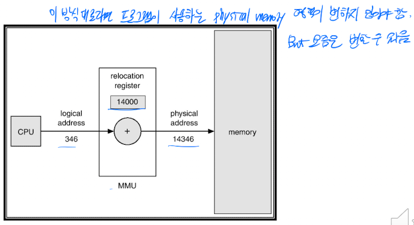

- CPU에서 virtual address를 사용하는 경우

  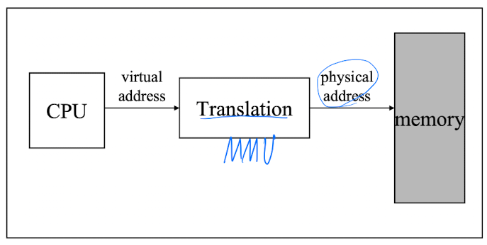

### MMU(Memory Management Unit)

- Virtual address와 physical address 간의 변환을 수행하는 장치

  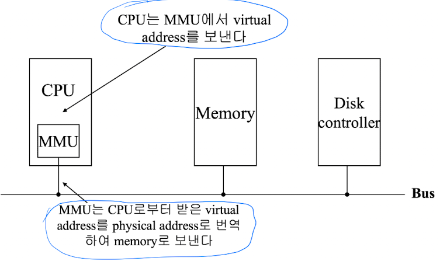

### Virtual memory

- memory에 실제 존재하지는 않지만, 사용자에게 memory로서의 역할을 하는 memory
- 기본 아이디어: Process가 수행되기 위해 program의 모든 부분이 실제 메모리(physical memory)에 있을 필요가 없다.  
  단지 현재 실행되고 있는 code 부분만이 physical memory에 있으면 process는 실행 가능하다.

  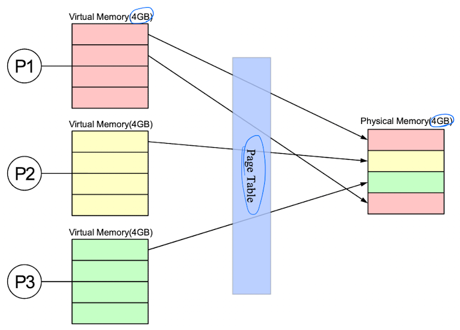

### Virtual memory의 구현

- Process는 virtual memory만 바라본다.

  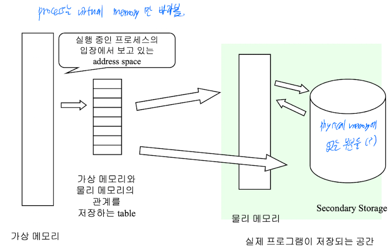

- physical memory의 크기가 virtual memory의 크기보다 작다.

### Page table(address mapping table)

- Virtual address와 physical address 간의 mapping을 저장하는 table

### Paging

- 주소 공간을 동일한 크기인 page로 나눠 관리한다.

  - 보통 page size는 4KB로 설정한다.
  - Frame: Physical memory를 고정된 크기로 나눴을 때 하나의 block
  - Page: Virtual memory를 고정된 크기로 나눴을 때 하나의 block
  - Frame 1개와 page 1개의 크기는 같다.

- Page가 하나의 frame을 할당받으면, physical memory에 위치하게 된다.

  - Frame을 할당받지 못한 page들은 backing storage에 저장된다.  
    Backing storage도 page, frame과 동일한 크기로 나뉘어져 있다.

- Page number, offset

  - Page number: 각 process가 가진 page 각각에 부여된 번호
  - Page address: 각 page의 내부 주소(ex. 1번 process 12번 page의 34번째 data)

### Page table

- 각 process의 page 정보를 저장한다.
- Process와 page table은 1:1 관계를 가진다.
- 해당 page에 할당된 물리 메모리의 frame의 시작 주소를 가리킨다.

- 구현

  - Page table은 physical memory에 존재한다.
  - PTBR(Page Table Base Register): Physical memory 내의 page table을 가리킨다.
  - PTLR(Pate Table): PTBR이 가리키는 page table의 크기를 나타낸다.

- Page table을 이용한 주소 변환 과정

  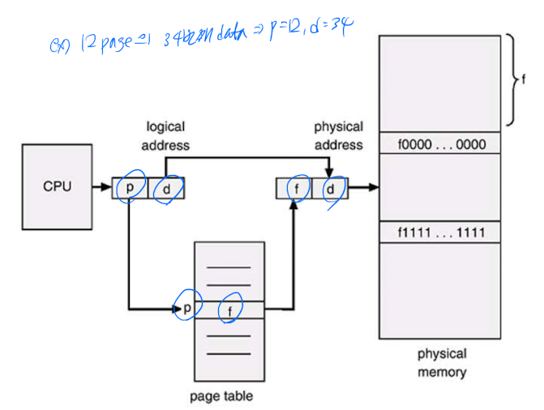

### PTE(Page Table Entry)

- Page table의 record
- PTE의 각 field 내용

  - Page base address: 해당 page에 할당된 frame의 시작 주소
  - Flag bits

    - Accessed bit: page에 대한 접근이 있었는지 여부
    - Dirty bit: Page 내용의 변경 여부
    - Present bit: 현재 page에 할당된 frame이 있는지 여부
    - Read/Write bit: 읽기/쓰기에 대한 권한 표시

### TLB(Transaction Look-aside Buffer)

- Paging 방법에서는 data로 접근할 때 항상 2번의 memory 접근이 필요하다.

  - Page table 1번, physical memory 내의 data에 1번
  - 이는 memory 접근 속도를 크게 떨어뜨린다.

- 위 비효율성을 해결하기 위해 MMU는 TLB를 둔다.

  - Page table을 이용해 변환된 주소를 TLB에 저장해둔다.(일종의 cache)
  - TLB는 register이기에 빠른 수행이 가능하다.
  - TLB hit ratio가 높을수록 memory 접근 속도를 향상시킬 수 있다.

  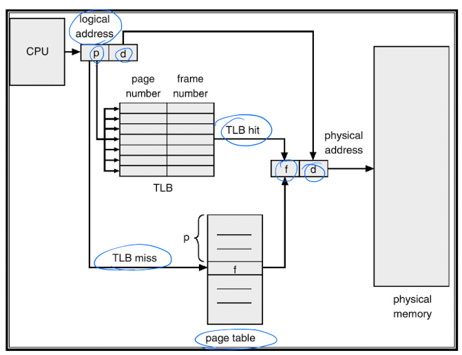

### Multilevel Page Table

- 시스템 발전에 따라 virtual memory space도 매우 큰 용량을 요구하게 되었다.  
  이로 인해 page table의 크기도 커지고, 이 공간에 의해 paging이 잘 이뤄질 수 없게 되고 있다.

- 구현 예시: two level page table

  - Outer page table을 하나 더 두어, page table들을 가리키도록 한다.

    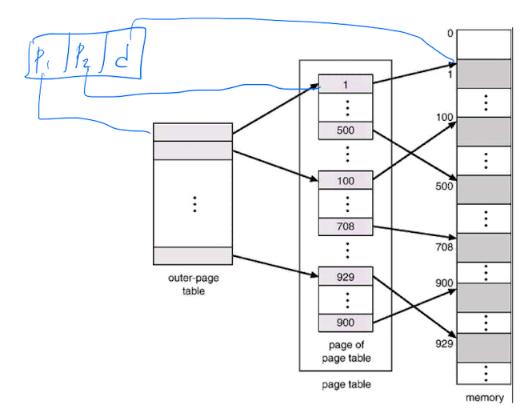

- 2 level page table의 page walk

  
  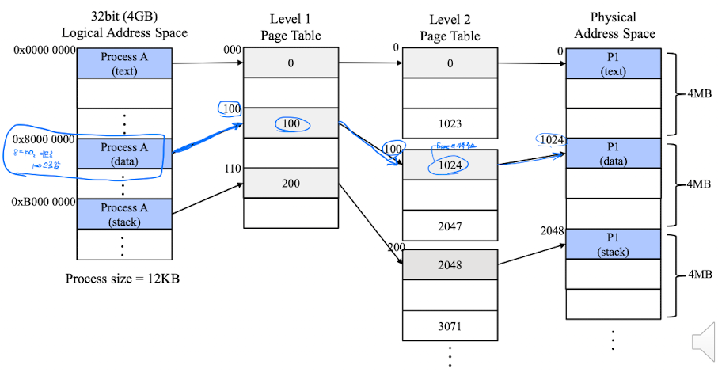

### Page table level과 성능

- Level이 많은 경우

  - 장점: Page table이 차지하는 메모리 공간이 적어진다.
  - 단점: table walk에 걸리는 시간이 증가한다.

### Inverted page table

- Multilevel page table과 마찬가지로 page table의 용량 증가 문제를 해결하기 위한 또다른 방법이다.
- 방법:

  - 아무리 virtual memory space가 커도, physical memory 크기에는 한계가 있다.  
    그리고 **모든 physical memory는 virtual memory의 page에 mapping될 확률이 높다.**

- 기존 방식은 page number를 이용해 frame number를 검색했다.
- 반면 inverted page table은 CPU에서 참조하는 주소와 PID의 조합으로 page id를 만들어 page table 내에서 page id를 검색한다.

  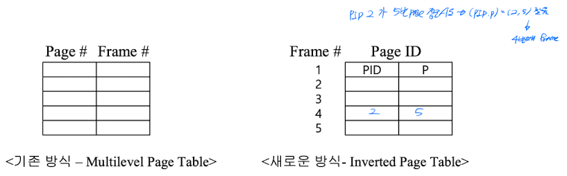

- 구현 방법

  - System 전체에 **하나의 page table** 만을 둔다.
    - Page table index: frame 번호
    - 내용: PID, page number, page address

- Page table은 적은 용량을 차지하게 되지만, table을 검색하는 데에 시간이 오래 걸린다.

  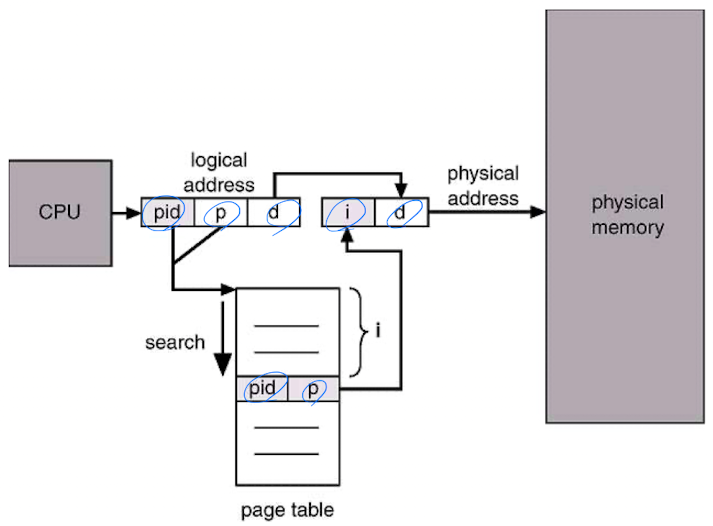

### Demand paging

- Process의 실행을 위한 모든 page를 memory에 올리지 않고, **필요한 page의 요청 발생 시 memory에 올리는** paging 기법
- Page table에 valid bit를 추가해 page가 valid한지, invalid한지 표시한다.
- Valid, invalid page

  - Valid: physical memory에 load되어 있는 page
  - Invalid: physical memory에 load되어 있지 않은 page, 즉 backing storage에 있음

- 장점: 실행을 위한 physical memory 구성의 시간이 줄어든다.
- 단점: Invalid page인 경우 page fault가 발생한다.

  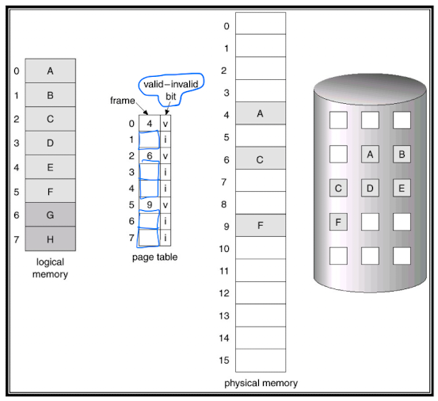

### Page fault

- Process가 page를 참조했는데, 해당 page가 할당받은 frame이 없는 경우를 가리킨다.  
  Page fault는 page fault handler가 처리한다.

- Page fault 발생 빈도는 frame 개수와 반비례한다.

- Page fault handler가 수행하는 내용

  - 새로운 frame을 할당받는다.
  - Backing storate에서 page의 내용을 다시 frame에 불러들인다.
  - Page table을 재구성한다.
  - Process의 작업을 재시작한다.

- Thrashing: process의 실행 시간 중 page fault 처리 시간이 execution time보다 긴 상황

---
