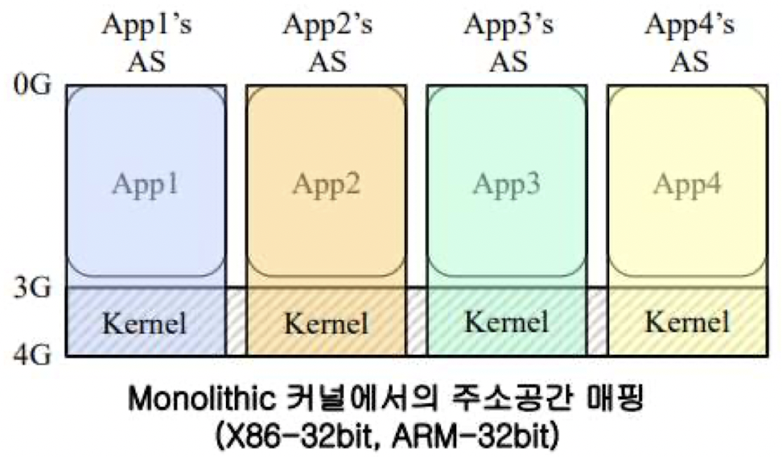
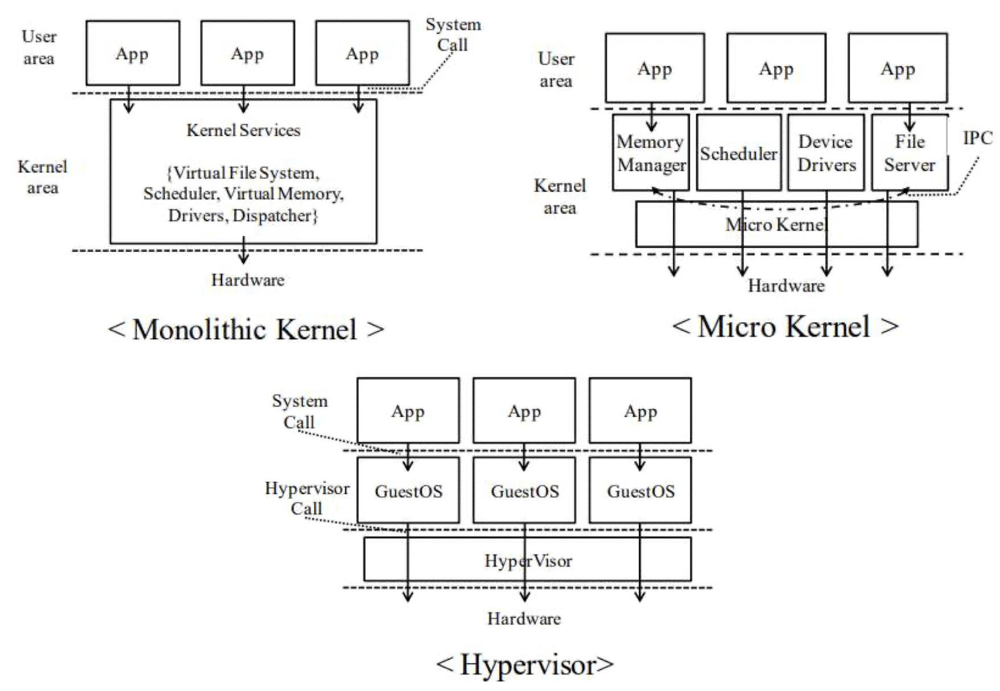
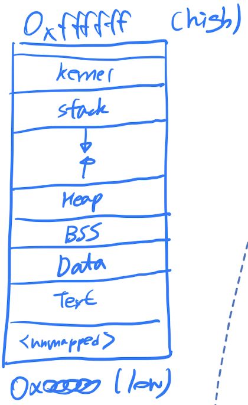
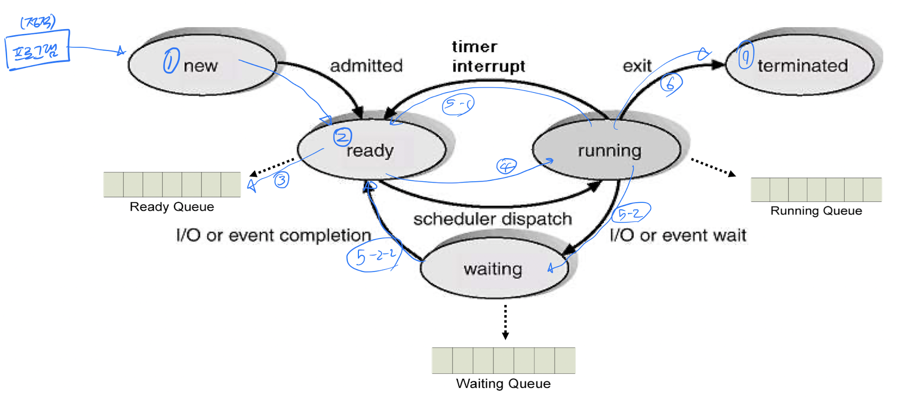
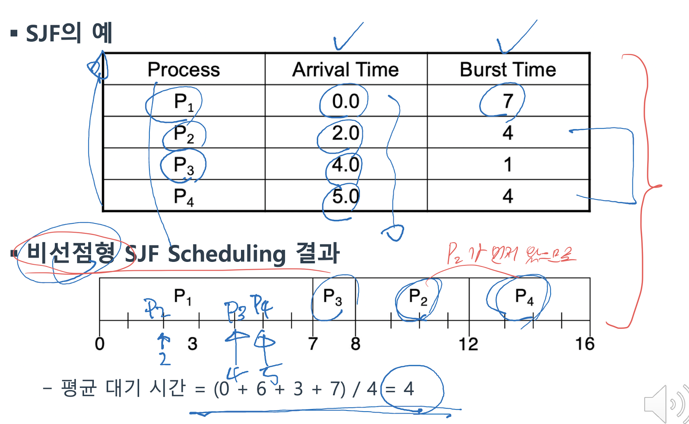
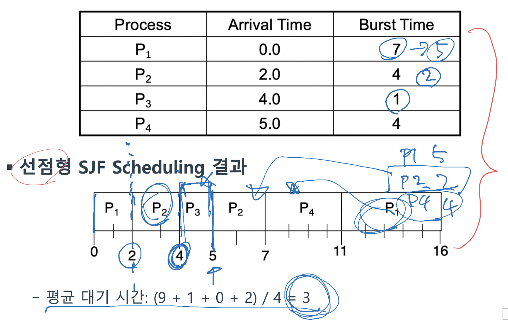
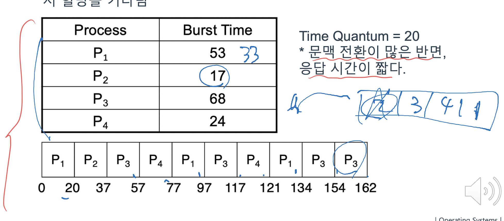

# OS

## 1. 개요

- 운영체제란 무엇인가?

  - 하드웨어를 손쉽게, 그리고 효율적으로 사용할 수 있는 **abstraction** 제공
  - 자원의 공유 및 분배를 위한 **policy** 결정

### Abstractions

- Program

  - 컴퓨터를 실행시키기 위한 일련의 순차적으로 구성된 명령어의 모음
  - Disk와 같은 secondary storage에 저장되어 있다.
  - static하다.

- Process

  - **실행되고 있는** 프로그램의 추상화
  - Program Counter, Stack, Data Section으로 구성
  - Dynamic하다.
  - 각 process가 사용하는 virtual memory space는 서로 철저히 독립되어 있어야 한다.

- Address space

  - Process가 차지하는 메모리 공간
  - virtual, not physical
  - 서로의 주소 공간을 침범할 수 없도록 해주는 protection domain의 역할을 한다.

- File

  - Process에서 읽고 쓸 수 있는 persistent storage
  - Process는 데이터가 실제로 저장되는 위치를 알지 않는다.

- Port

  - 컴퓨터 시스템이 메시지를 주고받는 communication endpoint
  - Port를 통해 송수신하는 데이터를 어떤 process가 처리해야 하는지 지정한다.

- Software의 구분

  - System software: 컴퓨터 시스템을 구동시키는 software  
    OS, compiler, assembler 등

  - Application software: 특정 용도로 사용되는 software  
    web browser 등

- OS는 **항상 동작** 한다.  
  또한 통제 기능을 가져 항상 자원에 대한 관리, 감시 활동을 하며 하드웨어에 대한 제어도 한다.

- `hardware` <-> `OS` <-> `Application` 의 3-tier 구조로 이루어져 있다.

---

## 2. 운영체제 구조

- Automatic Job Sequencing

  - 사람의 관여 없음
  - 이전 작업 종료되자마자 다음 작업 실행 -> 일괄 처리(batch)보다 성능 향상
  - I/O에 의해 발생하는 CPU idle time 개선은 없음

- Spooling(Simultaneous Peripheral Operation On-Line)

  - CPU의 idle time을 줄이기 위함
  - I/O와 computation의 동시 진행 가능
  - Spooling을 통해 사용자는 여러 개의 인쇄 작업을 프린터에 순차적으로 요청 가능

- Multiprogramming

  - CPU의 idle time을 줄이기 위함
  - 2개 이상의 작업을 동시에 실행
  - OS는 여러 개의 작업을 메모리에 동시에 유지
  - 현재 실행중인 작업이 I/O를 할 경우, 다음 작업을 순차적으로 실행
  - 스케쥴링: FCFS(First Come First Served)
  - 단점: 사용자가 실행 중인 작업에 대해 관여할 수 없다.

  - 문제점들

    - 다른 job이 수행되기 위해서는 현재 수행되는 job이 I/O를 해야 한다.
    - 공평성을 유지할 수 있어야 한다.
    - High priority로 수행할 필요성은 job scheduling으로 해결되지 못했다.

- Timesharing

  - CPU의 실행 시간을 time slice로 나눈 것.
  - 모든 프로그램은 time slice 동안 CPU를 점유하고, 그 시간에 끝나면 CPU를 양보(yield) 한다.
  - 여러 개의 작업들이 CPU switching(context switching)을 통해 동시에 실행된다.
  - CPU switching이 매우 빈번하게 일어난다.  
    하지만 context switching이 일어나는 동안 사용자는 실행중인 프로그램에 관여가 가능해진다.

- Multitasking

  - 여러 개의 task들이 CPU와 같은 자원을 공유하도록 한다.
  - 하나의 job은 동시에 실행할 수 있는 여러 개의 task들로 나눠질 수 있다.  
    `job = n * task`
  - 사용자가 여러 개의 프로그램을 실행할 수 있도록 하며, CPU가 idle 상태일 때는 background 작업을 실행 가능하도록 한다.

  - 문제점들

    - 복잡한 메모리 관리 시스템: 동시에 여러 개의 프로그램이 메모리에 상주해야 하며 그에 맞는 관리, 보호 시스템이 필요하다.
    - 적절한 응답 시간을 제공하기 어렵다.
    - 서로 독립된 task들이 동시에 실행되는 concurrent execution을 제공하기 위한 CPU scheduling이 필요하다.
    - Job들 간의 ordered execution이 필요하다.

---

## 3. 운영체제 구조

### OS design principles(mechanism, policy)

- Policy: **무엇**이 되게 할 것인가?
- Mechanism: **어떻게** 할 것인가?
- Policy와 mechanism을 분리함으로써 OS 설계를 보다 모듈화할 수 있다.

### Methods for OS design

#### Layering

- OS의 복잡도를 낮추기 위한 방안
- 하나의 layer는 well-defined 함수들로 이뤄진다.
- 하나의 layer는 인접한 layer들과만 통신할 수 있다.
- 설계의 복잡도를 낮출 수는 있으나, 그로 인한 overhead가 발생한다.

- 장점:

  - Layer의 수정이 다른 layer들과 독립적으로 이뤄질 수 있다.

### User mode, kernel mode

- CPU는 2가지 이상의 실행 모드가 있다.

  - System protection을 위해 필요하다. 권한에 따라 접근할 수 있는 메모리, 실행 가능한 명령어가 제한되기 때문이다.
  - 각각의 mode별로 권한(privilege)이 설정된다.
  - Hardware의 지원이 필요하다.

- User mode에서 실행 중인 프로그램은 kernel mode의 권한이 필요한 작업을 수행할 수 없다.

- Kernel mode

  - 모든 권한을 가진 mode
  - OS가 실행되는 mode
  - Privilege 명령어 및 register 접근 가능

- User mode

  - Kernel mode에 비해 낮은 권한의 mode
  - Application이 실행되는 mode
  - Privilege 명령어 실행 불가

### System call

- User mode에서 kernel mode로 진입하기 위한 통로
- Register에 System call에 필요한 파라미터들 및 OS의 리턴값을 저장한다.

### Kernel designs

#### Monolithic kernel

- Kernel의 모든 service가 같은 주소 공간에 위치한다.
- Application은 자신의 주소 공간에 kernel code 영역을 mapping해 kernel service를 이용한다.
- Hardware 계층에 대한 **단일 abstraction을** 정의한다.  
  그리고 이를 사용하기 위해 라이브러리나 애플리케이션에게 **단일한 인터페이스** 를 제공한다.

  

- 장점: Application과 모든 kernel service가 **같은 주소 공간** 에 위치하기 때문에 system call 및  
  kernel service 간의 데이터 전달 overhead가 적다.

- 단점:

  - 모든 서비스 모듈에 **single binary** 로 되어있기에 **일부분의 수정이 전체에 영향을 미친다.**
  - 각 모듈이 유기적으로 연결되어 있기에 kernel 크기가 커질수록 **유지 보수가 어려워진다.**
  - **한 모듈의 버그가 전체 시스템에 영향을 끼친다.**

#### Micro kernel

- Kernel service를 **기능에 따라 모듈화** 해 각각 **독립된 주소 공간에서 실행** 된다.

  - 이러한 모듈들을 **서버**라 하며, **서버들은 독립된 프로세스로 구현** 된다.

- Micro kernel은 IPC와 같은 단순한 기능만을 제공한다.

- 장점:

  - 각 kernel service가 따로 구현되거 있기에 **서로 간의 의존성이 낮다.**  
    즉, 독립적인 개발이 가능하고 유지 보수가 monolithic kernel보다 상대적으로 용이하다.
  - Kernel service 서버의 간단한 시작, 종료가 가능하다.

- 단점: 독립된 서버들 간의 IPC 및 context switching이 필요해 monolithic kernel보다 성능이 나쁘다.

#### Hypervisor

- 가상화된 컴퓨터 hardware 자원을 제공하기 위한 관리 계층이다.  
  Guest OS와 hardware 사이에 위치한다.

- 각 guest OS들은 서로 다른 Virtual machine에서 수행되며, 서로의 존재를 알지 못한다.

- Hypervisor는 각 guest OS 간의 CPU, memory 등 시스템 자원을 분배하는 등 최소한의 역할을 수행한다.

- 장점:

  - 하나의 물리 컴퓨터에서 여러 종류의 guest OS 운용이 가능하다.
  - 실제 컴퓨터가 제공하는 것과 다른 형태의 명령어 집합 구조를 제공한다.

- 단점: Hardware를 직접적으로 사용하는 다른 OS에 비해 성능이 떨어진다.



---

## 4. Process

- Process가 만들어지는 과정은 아래와 같다.

  - `Source code` -compiler-> `Object file` -linker-> `Executable file` -loader-> `Memory`

- Compiler

  - Source code를 CPU가 이해할 수 있는 object file로 변환한다.
  - Object file은 object file 자체만으로는 수행이 이뤄지지 못한다.(ex. 외부 라이브러리 코드의 linking이 필요)
  - 프로세스로 변환되기 위한 정보가 삽입되어야 한다.
  - Relative address로 표현된다.

- Linker

  - 여러 object file들과 라이브러리들을 연결해 메모리로 loading될 수 있는 **하나의 executable file** 로 변환
  - Executable

    - 특정 OS에서 실행될 수 있는 파일
    - Absolute address로 표현된다.

- Loader

  - **Executable을 실제 메모리로 올려주는 역할** 을 하는 **OS의 일부**
  - 동작 과정

    - (1) Executable의 header를 읽어 text, data 크기 결정
    - (2) 프로그램을 위한 address space(virtual memory space) 생성
    - (3) 실행 명령어들과 data를 executable로부터 생성한 address space로 복사
    - (4) 프로그램의 argument들을 stack으로 복사
    - (5) CPU 내의 register들을 초기화하고, start-up routing으로 jump

- Runtime system

  - 응용 프로그램의 효율적인 실행을 지원하기 위해 프로그램과 연결해 상호작용한다.
  - C runtime system program execution

    - Process 시작을 위해 kernel은 program counter를 `_start()` 함수의 주소로 지정
    - `_start()` 함수는 동적으로 link된 C library 및 thread 환경을 초기화하는 `_libc_start_main()` 함수 호출
    - 라이브러리 초기화 후 프로그램의 `main()` 함수 호출

### Process management

- Process - abstraction

  - Process는 OS의 abstraction중 하나로, Os가 프로그램을 쉽게 동작시켜주기 위해 존재한다.
  - Execution unit(스케쥴링 단위)
  - Protection domain(서로 침범 불가)

  - 구성요소: Program counter, Text section, Stack, Data section, BSS

    > BSS: 초기화되지 않은 전역변수들 저장

  - Process는 disk에 저장된 프로그램으로부터 변환되어 메모리로 loading된다.

- Linux의 process memory layout은 아래와 같다.

  

- Process state

  - New: 프로세스가 생성되는 중
  - Running: 프로세스가 실행 중
  - Waiting: 프로세스가 특정 event가 발생하기를 기다리는 중(ex. I/O completion)
  - Ready: 프로세스가 processor에게 할당 받기를 기다리는 중
  - Terminated: 프로세스가 실행을 완료하고 종료된 상태

  > Waiting에서 ready로 가고, ready에서 언제든지 running으로 갈 수 있다.

- Kernel은 ready queue, waiting queue, running queue를 사용해 process들을 상태에 따라 관리한다.

  

- PCB(Process Control Block)

  - OS가 process들을 관리하기 위해 만들어진 자료구조
  - 아래 내용들을 가진다.

    - Process state
    - Program counter(running 상태일 때 실행되어야 하는 instruction)
    - CPU registers
    - CPU scheduling information
    - Memory management information
    - Accounting information
    - I/O status information

- Context switching

  - CPU가 다른 process를 실행할 때 kernel은 아래 2개 과정을 거쳐야 한다.

    - (1) 이전 process의 상태 저장
    - (2) 새로운 process의 상태 복원

  - Context switching time은 overhead이며, hardware 지원에 따라 좌우된다.

- Processor 구조에 따른 context switching의 차이

  - CISC

    - 복잡한 명령어 set => 효율은 높지만 clock 속도는 낮다.
    - 복잡한 회로로 인해 차지하는 물리적 공간이 많아져 register 용량이 작다.
    - CPU register 개수가 적어 context switching이 빠르다.

  - RISC

    - 간단한 명령어 set => clock 속도가 높고 수행 속도도 빠르다.
    - 절약된 물리적 공간에 많은 register를 장착해야 하기에 context switching 시 보다 큰 overhead가 발생한다.

- Process creation

  - 시스템 내의 process들은 여러 개가 동시에 실행될 수 있어야 하고, 동적으로 생성 및 종료되어야 한다.
  - OS는 process creation과 termination mechanism을 제공한다.

  - Parent process, child process의 관계를 가진다.

    - Child는 parent의 리소스를 공유받을 수도 있고, 아닐 수도 있다.
    - Parent과 child는 동시에 실행될 수 있으며, parent는 child의 종료를 기다릴 수 있다.

  - 메모리 관점에서 child process는 parent process의 중복(duplicate)이다.
    - Child process는 load된 program이 있다.
    - Unix에서 새로운 process는 `fork()`에 의해 생성되며, parent process memory의 복사본을 가진다.  
      그리고 `exec()`를 호출해 새로운 program을 load한다.

  ```c
  int main(void) {
      pid_t pid;
      pid = fork();
      if(pid < 0) { // Error in fork()
  	    fprintf(stderr, "Fork Failed");
  	    exit(-1);
      }     else if(pid > 0) { // Parent process
  	// PARENT!
      }     else if(pid == 0) { // Child process
  	// CHILD!
      }
      return 1;
  }
  ```

- Process termination

  - Process는 `exit()`을 호출해 종료될 수 있으며, `wait()`을 사용해 parent는 child의 종료를 기다릴 수 있다.  
    문제가 생길 때 `abort()`를 호출하면 core dump가 생성되며 `SIGABRT` signal이 호출자 process에 전달된다.

- Cooperating processes

  - 독립적인 process들은 다른 process의 실행에 의해 영향받을 수 없다.

---

## 5. Computer Architecture

### 단일 bus 구조

- Bus: CPU, RAM, I/O device 간의 데이터가 연결되는 통로  
  Data bus, address bus 등이 있다.

- 단일 bus:

  - 하나의 system bus에 여러 가지 모듈들이 연결되어 있다.
  - CPU, memory, I/O device의 속도가 비슷했던 초창기에 생겼다.
  - 하지만 시간이 지나면서 CPU, Memory, I/O device간에 속도 격차가 발생하면서 **병목 현상**이 발생한다.

### 병목 현상

- 같은 bus에 연결된 device들 간의 속도 차이로 인해 발생하는 현상
- CPU(빠름) - memory - I/O device(느림)
- ex) CPU는 초당 5개 일을 할 수 있는데 메모리가 초당 3개 일만을 전달할 수 있다면 전체 시스템 속도는 메모리의 속도로 제한된다.
- 속도: CPU > memory > Disk, network > I/O device

### 계층적 bus 구조

- 여러 개의 세분화된 bus를 사용한다.
- 이중 bus

  - CPU와 I/O의 속도 차이로 인한 병목 현상을 해결하기 위함
  - 빠른 CPU, memory는 system bus에 연결한다.
  - I/O device는 I/O bus에 연결한다.

### Event 처리 기법: Interrupt

- **비동기적 이벤트(예상할 수 없는 이벤트)** 를 처리하기 위한 기법
- 처리 순서:

  - (1) Interrupt disable(interrupt는 1번에 1개만 처리가 가능하다.)
  - (2) 현재 실행 상태(state) wjwkd
  - (3) ISR(Interrupt Service Routing)로 jump
  - (4) 저장한 실행 상태 복원
  - (5) Interrupt로 중단된 지점부터 다시 시작

- Interrupt에는 순서가 있으며, hardware 장치마다 다르게 설정되어 있다.
- ISR은 짧아야 한다.(너무 길면 다른 interrupt들이 처리되지 못한다.)
- Time sharing은 timer interrupt의 도움으로 가능하게 된 기술이다.

### Event 처리 기법: Trap

- **동기적 이벤트(프로그램이 발생시킨 이벤트)** 를 처리하기 위한 기법
- Trap handler에 의해 처리된다.
- TSR(Trap Service Routine)이 있기에 interrupt와 유사하지만, interrupt와 달리 trap은  
  **실행 상태(state)를 저장, 복원하지 않는다.** (그냥 error 출력 후 process 종료시키기 때문)

### I/O device basic concepts

- Device registers

  - Control register, status register, input register, output register로 구성
  - CPU가 접근하는 memory의 영역을 나타낸다.

- I/O controller

  - 장치와 직접적인 상호작용을 진행한다.
  - CPU는 직접적으로 장치의 상태를 알 수 없고, I/O controller를 통해 알 수 있다.

### I/O 처리 기법: Polling

- Loop를 돌며 특정 event의 도착 여부를 확인하면서 기다린다.
- Interrupt handler를 등록하는 것과 반대로 polling은 매 순간 event의 발생 여부를 주기적으로 확인한다.
- Controller나 장치가 매우 빠른 경우에 적합하다.
- Event 도착 시간이 길 경우, polling은 CPU time을 낭비하게 된다.

### I/O 처리 기법: DMA(Direct Memory Access)

- Polling은 모든 I/O 연산을 CPU를 통해 진행하지만, DMA는 I/O를 위한 전용 process를 둔다.
- 전송할 데이터가 클 경우 CPU가 I/O를 처리하는 polling보다 DMA가 더 효율적이다.
- DMA controller라는 processor를 사용한다.

  - (1) CPU가 DMA controller에게 I/O 요청
  - (2) DMA controller가 CPU를 대신해 I/O device와 main memory 사이의 데이터 전송 수행
  - 이때 DMA controller는 작업 수행 완료를 interrupt를 통해 CPU에게 알린다.

- DMA는 polling과 달리 추가적인 hardware를 필요로 한다.
- DMA를 최대한 활용하기 위해서는 I/O가 일어날 때마다 다른 process가 자신의 할 일을 할 수 있도록  
  적당한 parallelism을 제공하는 scheduling 기법을 활용해야 한다.

---

## 6. CPU Scheduling

- Scheduling

  - 어떻게 process들에게 CPU 사용을 할당할 것인지를 결정
  - CPU 사용률과 처리량의 최대화를 목표로 한다.
  - Scheduler는 multiprogramming에 기반해 memory 내에 준비된 ready state의 process들 중 하나에게 CPU를 할당한다.

- Process 수행 사이클의 구성

  - CPU, I/O burst cycle

    - CPU burst: CPU로 연산을 수행하는 시간
    - I/O burst: I/O 처리를 위해 기다리는 시간
    - 일반적인 프로세스는 두 burst를 번갈아가며 수행한다.

  - Process 분류에 따른 CPU burst의 특징

    - CPU-bound process: 짧은 주기의 긴 CPU burst
    - I/O-bound process: 긴 주기의 짧은 CPU burst
    - 어떤 종류의 process가 많은지에 따라 스케쥴링 기법의 효율성이 달라진다.

### Scheduling의 종류

- CPU scheduling은 아래 시점에 따라 이뤄진다.

  - (1) `Running` -> `Waiting`
  - (2) `Running` -> `Ready`
  - (3) 수행 종료
  - (4) `Ready` -> `Running`

- 비선점형 스케쥴링(non-preemtive scheduling)

  - (1), (4)에서만 수행되는 scheduling 기법

- 선점형 스케쥴링(preemtive scheduling)

  - 그 외의 다른 scheduling 기법

- Scheduling criteria

  - CPU 사용률: 전체 시스템 시간 중 CPU가 작업을 처리하는 시간의 비율
  - 처리량(throughput): CPU가 단위 시간 당 처리하는 프로세스의 개수
  - 응답 시간(response time): 요청 후 첫 응답이 올 때까지의 시간
  - 대기 시간(waiting time): Process가 ready queue에서 대기하는 시간의 총합
  - Turnaround time: process가 시작해서 끝날 때까지 걸리는 시간

### Scheduling algorithm - FCFS scheduling

- 먼저 CPU 할당을 요청한 process에게 CPU를 먼저 할당한다.(First Come First Served)
- 비선점형 스케쥴링 방식이다.

  

- 작업의 수행 순서에 따라 대기 시간이 변할 수 있다.

### Scheduling algorithm - Shortest Job First scheduling

- 다음 CPU burst time이 가장 짧은 process에게 CPU를 먼저 할당한다.
- 최소한의 평균 대기 시간 제공
- 비선점형 방식: 한 번 CPU를 할당받으면 자신의 CPU burst time이 끝나기 전에는 놓지 않는다.
- 선점형 방식: CPU를 할당 받아 수행 중이더라도, CPU burst time이 현재 자신이 남은 시간 보다 짧은 시간을 가진  
  프로세스가 새로 생성되면 CPU를 양보한다.

  
  

### Scheduling algorithm - Priority scheduling

- 미리 주어진 priority에 따라 CPU 할당
- 비선점형 방식: 한 번 CPU를 할당받으면 자신의 CPU burst time이 끝나기 전에는 놓지 않는다.
- 선점형 방식: 새로 생성된 process의 priority가 현재 실행중인 process의 priority보다 높다면 CPU 양보.
- 문제점 - 기아 상태(starvation): 낮은 priority를 가진 process가 전혀 수행되지 않을 수 있다.
  - 해결법 - aging 기법: 할당을 기다리는 시간에 따라 priority를 증가시켜준다.

### Scheduling algorithm - Round Robin scheduling

- CPU를 시간 단위(time quantum)로 할당한다.
- 선점형 scheduling 방식이다.
- Time quantum만큼 수행한 process는 ready queue의 끝으로 돌아가 다시 할당을 기다린다.

  

- Time quantum이 길면 FCFS 방식과 유사한 성능을 띈다.  
  반면 time quantum이 context switching에 필요한 시간보다 적다면 효율이 매우 떨어진다.

### Scheduling algorithm - Multilevel Queue scheduling

- Ready queue를 여러 개의 queue로 분리해 각각에 다른 scheduling algorithm을 사용하는 기법이다.
- Foreground queue: Interactive한 동작이 필요한 process를 위한 queue, Round Robin 기법 사용
- Background queue: CPU 연산 작업을 주로 수행하는 process를 위한 queue, FCFS 기법 사용

### Scheduling algorithm - Multilevel Feedback Queue Scheduling

- Multilevel queue에서 process들이 서로 다른 queue로 이동할 수 있도록 하는 scheduling 기법

  - Aging의 한 방법으로도 사용된다.

- 예시:

  - 3개의 queue로 구성되어 있다고 해보자.

    - $Q_0$ : Time quantum이 8ms
    - $Q_1$: Time quantum이 16ms
    - $Q_2$: FCFS 기법 사용

    - 새로운 process가 들어온다면?
      - (1) $Q_0$에서 8ms 동안 수행
      - (2) (1)에서 종료되지 않았다면 $Q_1$로 이동, 16ms 동안 수행
      - (3) (2)에서도 종료되지 않았다면 $Q_2$로 이동, FCFS 기법으로 수행

### 4가지 multiple processor scheduling 기법들

- 비대칭 multiprocessing

  - 하나의 CPU가 시스템 자료구조(scheduling, I/O) 관리
  - 모든 CPU가 접근할 경우보다 데이터 공유가 간단하게 이뤄진다.

- 대칭 multiprocessing: 많은 CPU가 kernel 자료구조를 동시에 관리한다.

- Processor affinity: 과거에 수행하던 CPU에 process를 배정한다.
- Load balancing:

  - CPU마다 각각의 ready queue를 두면? -> 일부 CPU에 process가 집중될 수 있다.
  - CPU 모두에 단 하나의 ready queue만 두면? -> 사용 가능한 CPU에 차례대로 process 배정 가능

---
