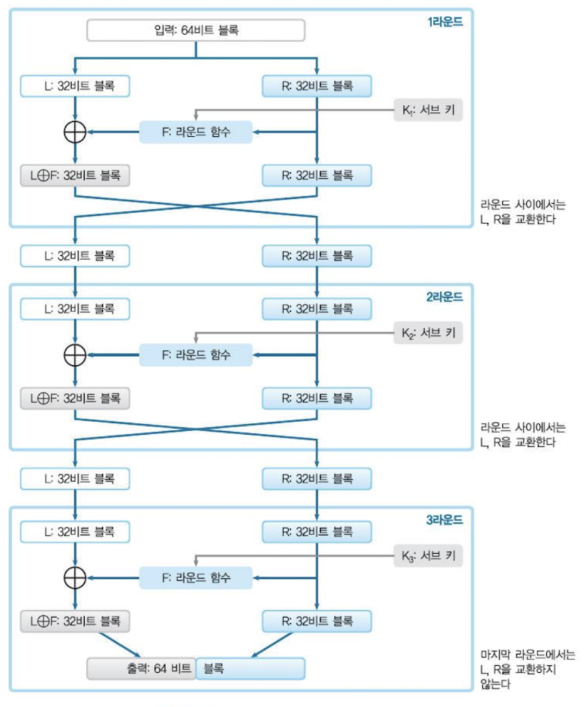
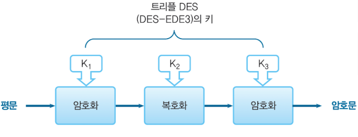

# 대칭 암호

## 문자 암호에서 비트열 암호로

- 암호화 알고리즘의 필수 성질 두 가지

  - 혼란(confusion): 평문과 암호문 사이의 관계를 파악하기 어렵게 만든다.
  - 확산(diffusion): 평문의 작은 변화가 암호문 전체에 영향을 미치도록 만든다. -> 평문의 통계적 특성 숨기기

- 암호 알고리즘은 비트들을 혼합(섞는) 함수들을 **반복** 해서 수행한다.

- Block cipher

  - 평문과 암호문을 고정된 길이의 block으로 구성한다.
  - 암호문은 평문들의 블록 각각에 비트들을 혼합하는 함수(round function)들을 반복해서 적용해 만든다.
  - Round function의 입력값은 key와 이전 round의 출력값이다.
  - Feistel cipher: 혼합, 반복의 절차를 잘 보여주는 블록 암호의 framework

- Feistel 의 특징

  - 원하는 만큼 round 수 추가 가능
  - round함수에 뭘 써도 복호화 가능
  - 암호화, 복호화의 구조가 동일

- **블록 암호의 안정성**

  - 안정성은 혼란, 확산의 성질을 만족하는지에 따라 결정된다.
  - 수학적으로는 brute force 외의 방식으로 암호문을 얻는 것이 불가능한지를 따져야 한다.
  - 블록 암호의 안정성은 **key의 길이** 에 따라 결정된다.

---

## DES

- Feistel cipher를 사용하는 블록 암호

  - 블록: 64비트
  - 키 길이: 56비트
  - round 수: 16
  - 각 round에 사용되는 subkey 길이: 48비트

- DES의 한계

  - brute force 공격에 의해 빠른 시간 내에 키를 찾을 수 있다.
    - 56비트의 키 길이가 짧다. -> Triple DES

---

## Triple DES

- 키 길이를 112 또는 168비트로 늘린다.

- 약점:

  - 소프트웨어의 구현에 비효율적이다. DES보다 3배 느리다.
  - 블록 크기인 64비트가 너무 작다.
  - 미래에도 안전할지 확신할 수 없다. -> AES 등장

---

## AES

- 특징

  - DES와 같이 반복 단계가 있다.
  - Feistel 구조가 아니다.
  - 블록 크기: 128비트
  - 키 길이: (블록 크기와 관계없이) 128, 192, 256비트 중 하나
  - 반복 횟수는 키 길이에 따라 가변적으로 바뀐다.(키가 128비트면 10회, 192비트면 12회, 256비트면 14회)
  - 각 round마다 아래 4개 연산을 수행한다.

    - SubBytes: 테이블을 참조해 각 바이트를 대체한다.
    - ShiftRows: 각 행을 왼쪽으로 순환시킨다.
    - MixColumns: 각 열을 테이블을 참조해 선형 변환한다.
    - AddRoundKey: bit 단위로 XOR 연산을 수행한다.

- 정리

  - 간단히 암호문을 만드는 연산이다.
  - AES는 DES보다 더욱 널리 사용된다.
  - 키 길이는 주로 128비트를 사용한다.

---

## Rijndael

---
